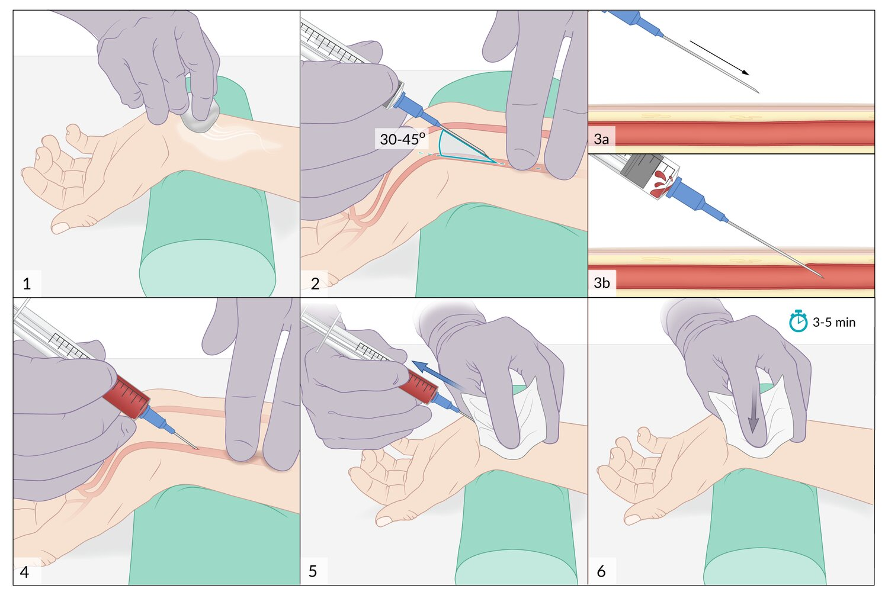
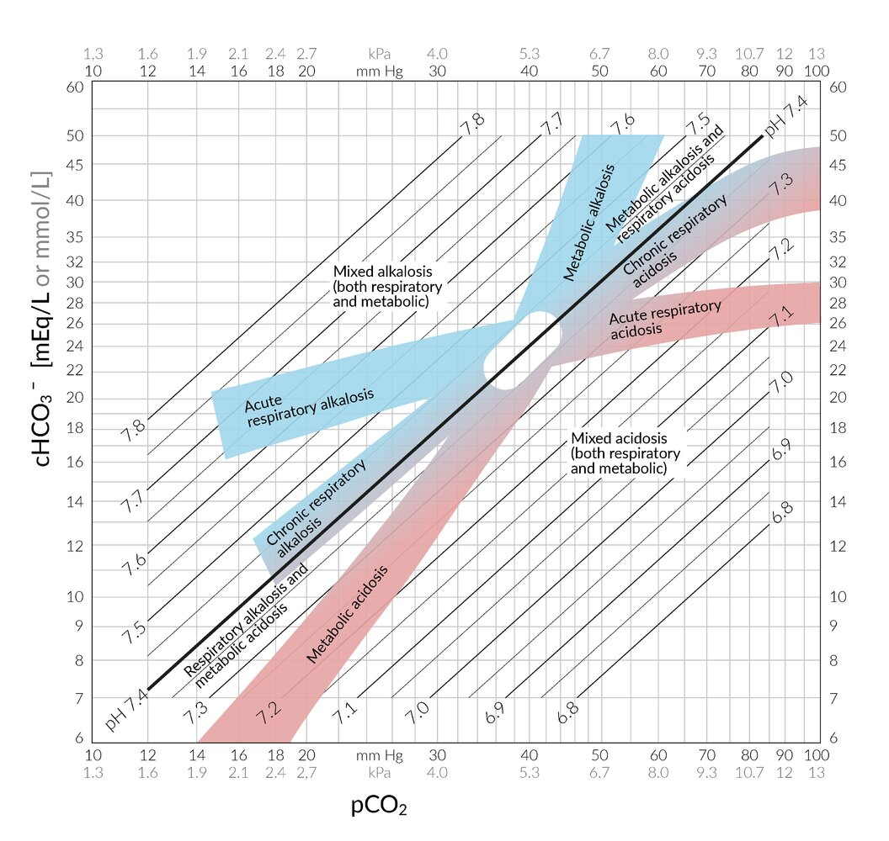

# Arterial blood gas analysis

*Categories: Clinical knowledge > Anesthesiology > Arterial blood gas analysis*

[Original Article Link](https://coursology-qbank.com/amboss/article/8l0OAT)

---

## Summary

Arterial <u>blood gas</u> (ABG) analysis is a common test that measures oxygen, carbon dioxide, and <u>bicarbonate</u> blood levels. The test provides an assessment of <u>gas exchange</u> processes and <u>acid-base balance</u>. ABGs are usually obtained by puncturing the radial or <u>femoral artery</u>. An <u>arterial line</u> may be placed if frequent <u>ABG sampling</u> and continuous blood pressure monitoring are required.

See also “<u>Arterial access</u>.”

---

## Arterial blood gas analysis

* Procedure: See “<u>ABG sampling</u>.”

* Measured parameters

* Partial pressure of oxygen in arterial blood (<u>PaO2</u>) and <u>partial pressure of carbon dioxide</u> (<u>PaCO2</u>) in arterial blood

* Arterial oxygen saturation (<u>SaO2</u>): percentage of <u>hemoglobin</u> binding sites occupied by oxygen

* <u>pH</u>

* Base excess: Excess value of base in the blood. Used to identify whether an <u>acid-base imbalance</u> is predominantly a respiratory, metabolic, or a <u>mixed acid-base disorder</u>.

* Standard <u>bicarbonate</u>

* Modern <u>blood gas</u> analyzers also measure: some <u>electrolytes</u> (i.e., <u>sodium</u>, <u>potassium</u>, <u>chloride</u>, <u>calcium</u>), blood <u>glucose</u>, <u>hemoglobin</u>, <u>methemoglobin</u> and <u>carboxyhemoglobin</u> concentrations

* Reference ranges for ABG

* <u>PaCO2</u>: 35–45 mm Hg

* <u>SaO2</u>: ≥ 95%

* <u>pH</u>: 7.35–7.45

* <u>HCO3-</u>: 21–27 mEq/L

* <u>Base excess</u>: -2–3 mEq/L

* Resting <u>PaO2</u> > 80 mm Hg is considered normal.

* Interpretation 

* <u>Hypoxemic respiratory failure</u> (type 1 <u>respiratory failure</u>): ↓ <u>PaO2</u>

* <u>Hypercapnic respiratory failure</u> (type 2 <u>respiratory failure</u>): ↑ <u>PaCO2</u> and ↓ <u>PaO2</u>

* See also “Diagnostics” in “<u>Acid-base disorders</u>.”

Radial artery puncture with arterial blood gas (ABG) sampling

Arterial blood gas analysis

Acid-base nomogram

---

## Mixed oxygen venous saturation

* Definition

* <u>Mixed oxygen venous saturation</u> (<u>SvO2</u>) is the saturation of <u>hemoglobin</u> in the <u>pulmonary artery</u>.

* <u>SvO2</u> is an indirect measure of the oxygen content in the venous system.

* <u>Reference range</u>: 65–70%

* Interpretation

* Decreased <u>SvO2</u>

* Increased tissue oxygen extraction due to decreased <u>oxygen delivery</u> to tissue

* Decreased <u>hemoglobin concentration</u>

* <u>Lung</u> disease

* Decreased alveolar oxygen concentration

* Decreased alveolar oxygen <u>diffusion</u>

* Increased <u>right-to-left shunting</u>

* Decreased <u>cardiac output</u>

* Increased oxygen consumption by tissues

* Exercise

* <u>Fever</u>

* <u>Seizures</u>

* Inability of <u>hemoglobin</u> to bind to oxygen (e.g., <u>carbon monoxide poisoning</u>)

* Increased <u>SvO2</u>

* Peripheral blood shunting (e.g., <u>AV fistula</u>)

* Decreased metabolic demand (e.g., <u>hypothermia</u>)

---