# Burns

*Categories: Clinical knowledge > Anesthesiology > Burns*

[Original Article Link](https://coursology-qbank.com/amboss/article/Jh0sUf)

---

## Summary

Burns can be caused by heat, chemicals, <u>electricity</u>, friction, and radiation. Injury severity is determined by the depth and extent of the burn. Burn depth is classified as first degree (<u>superficial</u>), second degree (<u>superficial</u> partial thickness or deep partial thickness), third degree (full thickness), or fourth degree (deep injury). Burn extent is classified by the percentage of the body surface area involved, known as the <u>total body surface area</u> (<u>TBSA</u>), typically using the <u>rule of nines</u> or the <u>Lund-Browder chart</u>. Major burns often cause extensive tissue <u>necrosis</u> and severe systemic inflammatory reactions. Early treatment for major burns includes <u>airway management</u>, <u>supplemental oxygen</u>, and large volumes of IV fluid; <u>IV fluid resuscitation</u> is initiated using a protocol but guided by clinical response, e.g., urine output and blood pressure. Inhalation injuries and <u>acute compartment syndrome</u> can complicate <u>burn management</u>, e.g., <u>escharotomy</u> may be required. Serial <u>arterial blood gas</u>, <u>electrolyte</u>, <u>CBC</u>, and <u>creatinine</u> studies are essential in the management of major burns; frequent assessment of peripheral <u>perfusion</u> is required in circumferential limb burns. All burns are initially managed with <u>pain management</u>, topical ointments, and nonadherent dressings, and major burns often require further management such as <u>debridement</u> of <u>necrotic</u> tissue followed by interventions such as <u>skin grafting</u> or <u>flap</u> reconstruction. Burn wounds are susceptible to infection, which increases <u>mortality rates</u>. <u>Shock</u>, <u>sepsis</u>, and <u>respiratory failure</u> are among the most common <u>causes of death</u> after a burn injury.

---

## Etiology

### Thermal burns [[1]](https://coursology-qbank.com/amboss/article/0lXevy)

* Most common type of burn

* Flame burns: fire

* Contact burns: hot surfaces

* <u>Scalding</u>: hot liquids or steam

### Nonthermal burns [[2]](https://coursology-qbank.com/amboss/article/wcWhe40)

* Chemical burns

* Acids such as sulfuric acid (e.g., in lead acid batteries), nitric acid (e.g., explosives and polymer industry), <u>hydrofluoric acid</u> (e.g., in cleaning products for electronics), <u>phenol</u>, and <u>acetic acid</u>

* Alkalis such as <u>anhydrous ammonia</u> (e.g., in fertilizers), <u>calcium</u> oxide (e.g., in cement), <u>sodium</u> hydroxide, and <u>potassium</u> hydroxide

* Miscellaneous: white <u>phosphorus</u> (e.g., in fireworks), metals (e.g., <u>sodium</u>, <u>potassium</u>, <u>lithium</u>), bleaching agents (e.g., <u>hydrogen peroxide</u>, <u>hypochlorite</u>), <u>vesicants</u> (e.g., <u>mustard gas</u>), hydrocarbons (e.g., gasoline, diesel fuel)

* Electrical burns

* Low-<u>voltage</u> sources: electrical cords, outlets in households

* High-<u>voltage</u> sources: power lines, lightning

* Radiation burns

* Electromagnetic waves

* UV radiation (e.g., from sunlight, <u>phototherapy</u>)

* <u>X-rays</u>, gamma rays (e.g., from <u>radiotherapy</u>, radiodiagnostic procedures, nuclear accidents)

* Infrared waves (e.g., from warming lamps), microwaves

* High-energy particles (e.g., from <u>radiotherapy</u>, nuclear accidents): <u>alpha particles</u>, beta particles, high-energy neutrons

* Friction burns: <u>skin</u> injury caused by <u>abrasion</u> against a hard surface (esp. at high speeds) and the heat generated by the resulting friction (e.g., from skidding across the street due to a motorcycle accident)

> [!TIP]
> Although most burn injuries are unintentional, intentional injury must always be suspected in <u>vulnerable populations</u>, such as children and older adults.

---

## Classification

### Burn severity [[3]](https://coursology-qbank.com/amboss/article/sfWtnk0)

* <u>Burn severity</u> is primarily based on the <u>depth of burn</u> and <u>extent of burn</u>.

* Additional factors that determine severity include:

* Burn location, e.g., face, hands, across <u>joints</u>

* Concurrent injuries

* Patient age

* Comorbid diseases or conditions

* Small burns can have severe consequences; consult a burn specialist for second- to <u>fourth-degree burns</u>.

### Depth of burn [[4]](https://coursology-qbank.com/amboss/article/C30qkf)

Burn depth is determined by the <u>skin</u> layers involved.

| Overview of burn depth |  |  |  |  |  |  |
| --- | --- | --- | --- | --- | --- | --- |
| Degree of burns |  | Affected tissue layers | Clinical features |  |  | Prognosis |
| <u>Pain</u> | Wound blanching on pressure | Appearance |  |  |  |  |
|  1st-degree burn  (<u>superficial burn</u>)   |  |  * <u>Superficial</u> layers of the <u>epidermis</u>   |  * Yes (localized <u>pain</u>)   |   * Yes  * Rapid refill    |   * Similar to <u>sunburn</u>  * Localized features due to <u>histamine</u> release include:  * <u>Erythema</u>  * Swelling  * <u>Skin</u> appears dry  * No <u>blistering</u>    |   * Healing within 3–6 days  * No scarring    |
| 2nd-degree burn (<u>partial thickness burn</u>) |  2a (<u>superficial partial thickness burn</u>) |  * <u>Epidermis</u> and upper layers of the <u>dermis</u> (<u>papillary dermis</u>)   |  * Yes (especially with the movement of air or changes in temperature in the area surrounding the wound)   |   * Yes  * Slow refill    |   * <u>Erythema</u>  * Swelling  * Increased temperature of affected <u>skin</u>  * <u>Vesicles</u>/<u>bullae</u>    |   * Healing within 1–3 weeks  * Temporary <u>hypopigmentation</u>/<u>hyperpigmentation</u>  * No scarring    |
|  2b (<u>deep partial thickness burn</u>)   |  * Deeper layers of the <u>dermis</u> (<u>papillary</u> and <u>reticular dermis</u>)   |  * Yes (<u>pain</u> is typically felt on applying pressure)   |   * No  * Very slow refill    |   * <u>Vesicles</u>/<u>bullae</u>: fragile (rupture easily)  * Mottled coloration of the <u>skin</u> with red and/or white patches    |   * Healing takes 3 weeks or longer.  * <u>Scar</u> formation    |  |
|  3rd-degree burn (<u>full thickness burn</u>)   |  |  * <u>Epidermis</u>, <u>dermis</u>, and subcutaneous tissue   |  * No (perception of deep pressure is intact)   |  * No   |   * Tissue <u>necrosis</u> with black, waxy-white, or gray leather-like <u>skin</u> (<u>eschar</u>)  * <u>Skin</u> appears dry and inelastic    |  * The burn does not heal by itself.   |
|  4th-degree burn (deeper injury burn)   |  |  * <u>Epidermis</u>, <u>dermis</u>, and deeper structures (muscles, fat, <u>fascia</u>, and bones)   |  * No (minimal perception of deep pressure)   |  * The tissue is dead and requires <u>amputation</u>.   |  |  |

> [!TIP]
> In <u>deep partial-thickness burns</u>, <u>pain</u> may be absent due to damage to sensory nerve endings.

> [!WARNING]
> Reassess burn depth periodically, as it can increase after initiating resuscitation.

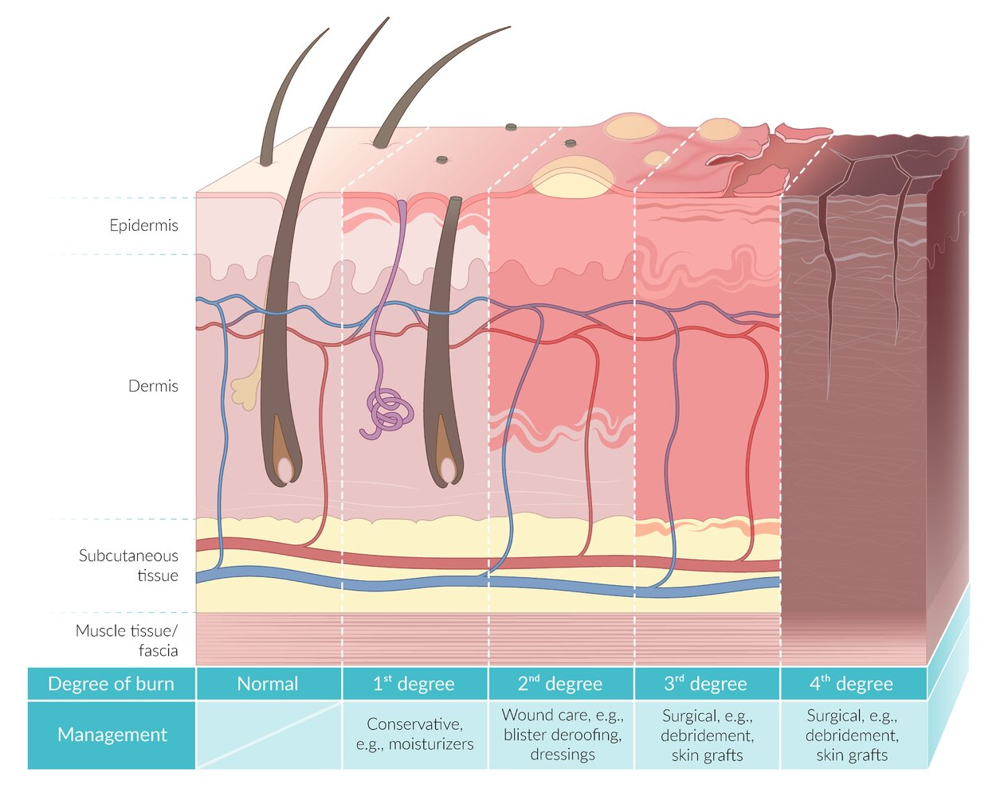

Burn classification

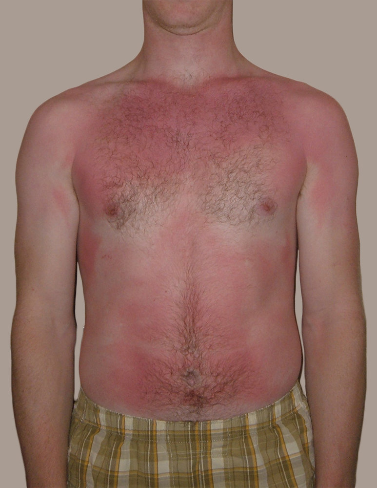

First-degree burn (superficial burn)

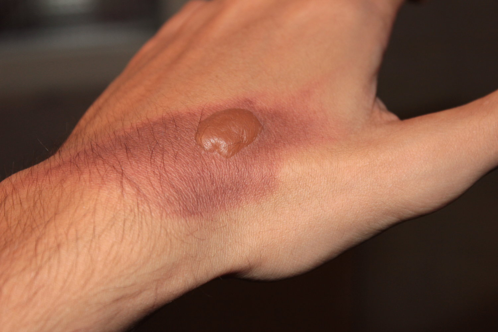

Second-degree burn (2a; superficial partial-thickness burn)

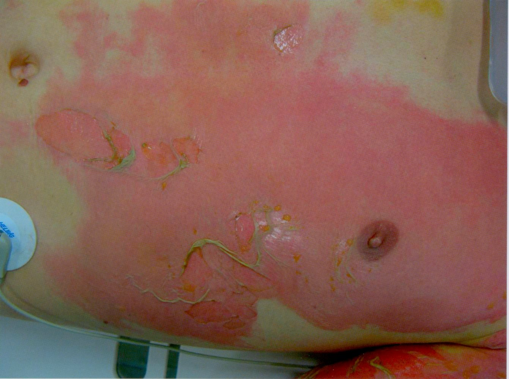

Second-degree burn (2b; deep partial-thickness burn)

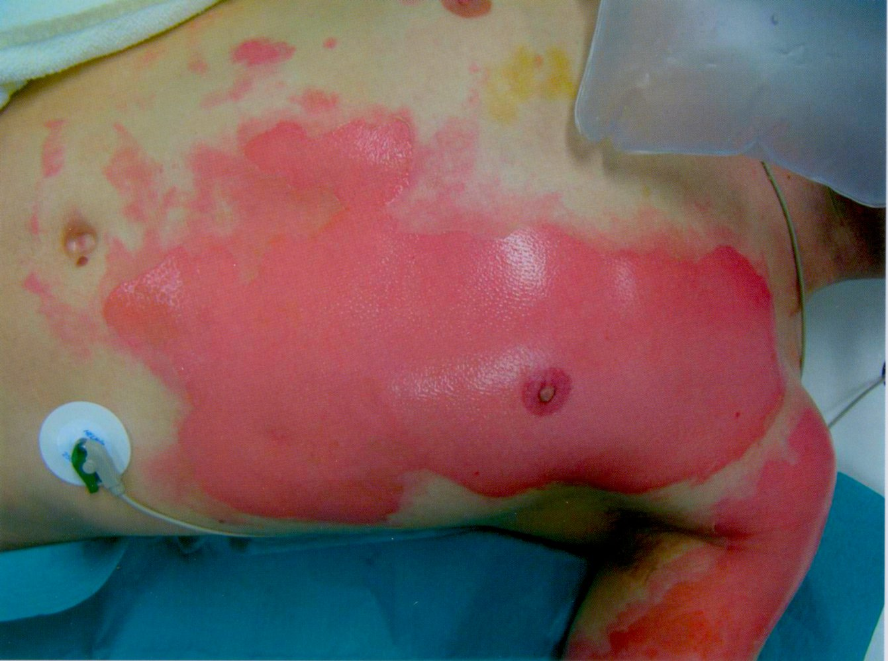

Second-degree burn (2b; deep partial-thickness burn) 

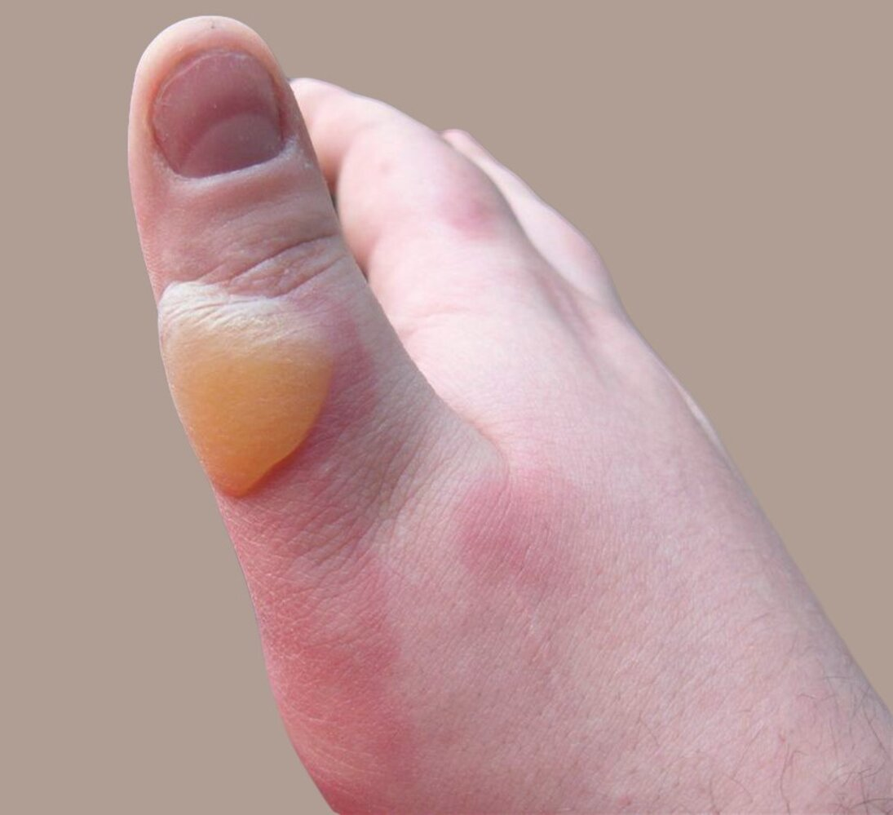

Superficial partial-thickness burn

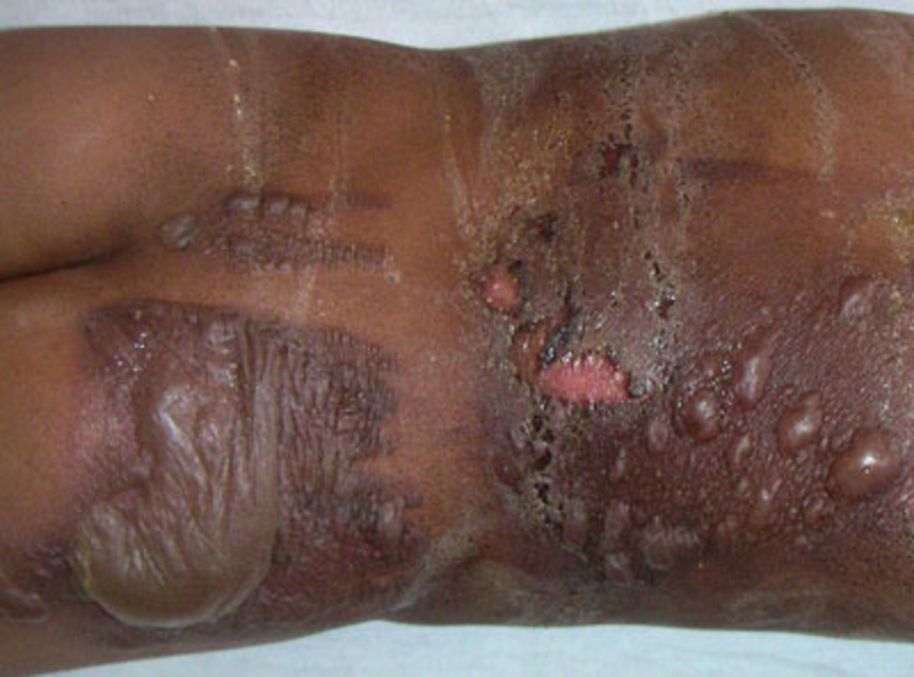

Second-degree burn (2b; deep partial-thickness burn)

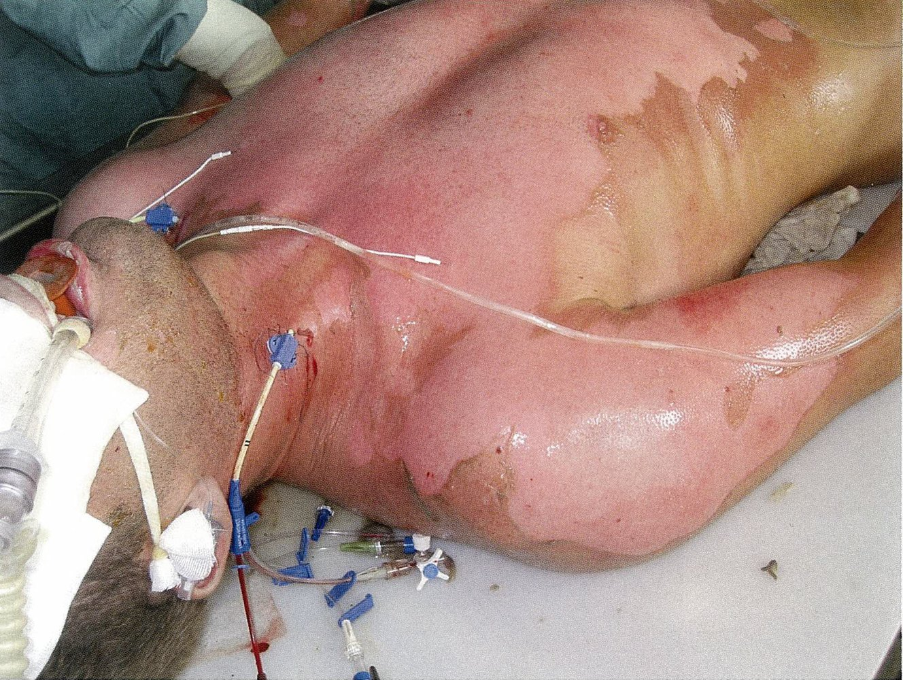

Second-degree electrical burn

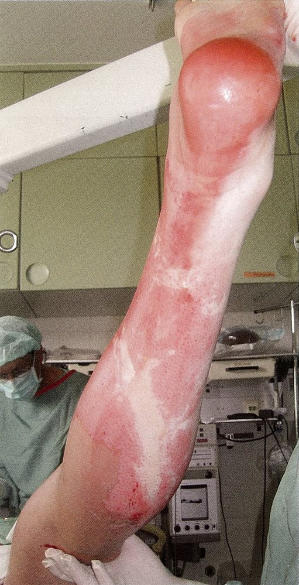

Electrical burns

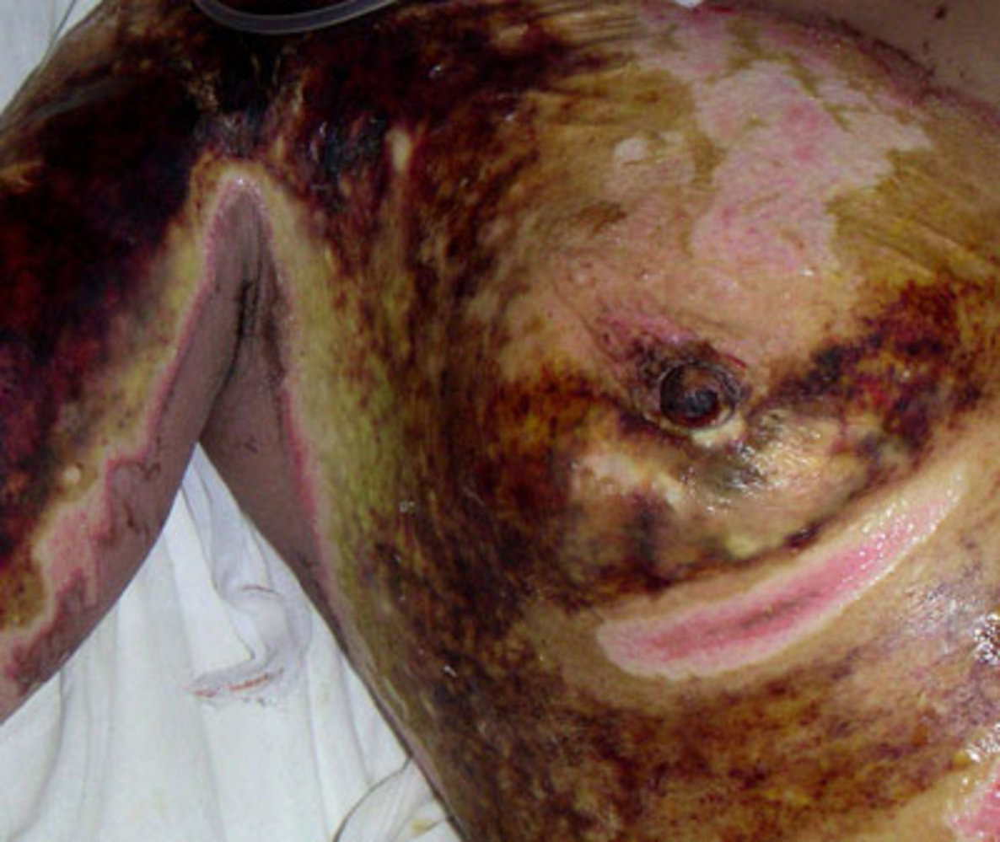

Third-degree burn (full-thickness burn)

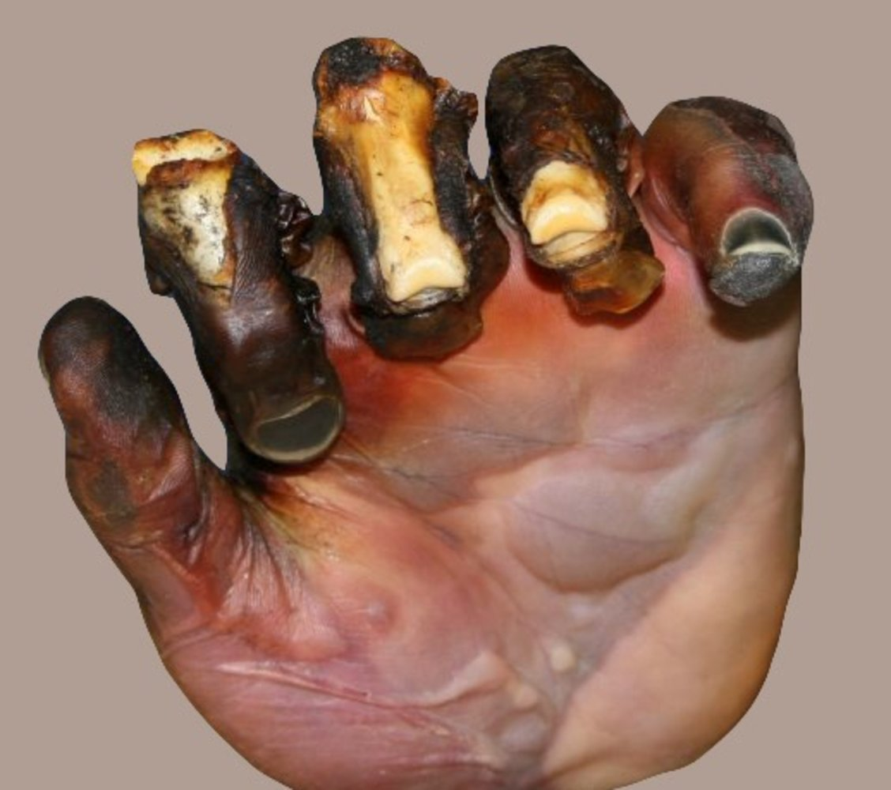

Fourth-degree burn (deeper injury burn)

### Extent of burn [[3]](https://coursology-qbank.com/amboss/article/sfWtnk0)

The percentage of total body surface area (<u>TBSA</u>) injured is used to quantify the <u>extent of burn</u> injury relative to the entire <u>skin</u> surface.

> [!WARNING]
> <u>First-degree burns</u> are not included when calculating <u>TBSA</u>.

#### Rule of nines

* A clinical tool used to rapidly assess the <u>TBSA</u> affected by burns in adults

* The adult body is divided into regions, each comprising ∼ 9% of the body surface area: head/neck, two regions on the <u>anterior</u> trunk, two regions on the <u>posterior</u> trunk, each arm, and two regions on each leg. The genital/<u>perineal region</u> accounts for 1%.

* The <u>rule of nines</u> does not accurately account for proportions in children.

* Children's heads are up to 20% proportionally larger than adults.

* Children's legs are up to 13% proportionally smaller than adults.

#### Lund-Browder chart

* A standardized table used to estimate <u>TBSA</u> affected by burns by age group

* Most accurate method for assessing burn extent

| Body surface area estimation with Lund-Browder chart |  |  |  |
| --- | --- | --- | --- |
| Region | Adult | Child | <u>Infant</u> |
| Head | 7% | 9–17% | 19% |
| Trunk | 26% (13% <u>anterior</u>, 13% <u>posterior</u>) |  |  |
| Arms and hands | 19% (9.5% each side) |  |  |
| Thighs | 19% (9.5% each side) |  13–18% (6.5–9% each side) | 11% |
| Lower legs and feet | 21% (10.5% each side) |  17–20% (8.5–10% each side) | 17% |
| Genital | 1% |  |  |

#### <u>Palmar</u> method

* A method of calculating <u>TBSA</u> using the patient's palm, which is equivalent to ∼ 1% of their body surface area

* Least accurate method

Rule of nines

Development of regions of the body in relation to total body surface area

---

## Pathophysiology

### <u>Thermal burns</u>

#### Local effects

* Local changes at the burn site (Jackson model of the burn wound) [[1]](https://coursology-qbank.com/amboss/article/0lXevy)

* Zone of coagulation: a central zone of irreversible, <u>coagulative necrosis</u>

* Zone of stasis: surrounds the central zone of coagulation and is comprised of damaged but viable tissue with decreased <u>perfusion</u>

* Zone of <u>hyperemia</u>: surrounds the zone of stasis and is characterized by inflammation and increased blood flow

* Bacterial <u>colonization</u> of the burn site

* Almost all burn wounds are colonized by bacteria.

* Common pathogens that infect burn wounds include <u>MRSA</u>, <u>Pseudomonas</u>, <u>Klebsiella</u>, Acinetobacter, and <u>Candida</u>.

* Eschars: a <u>skin</u> lesion characterized by dried, <u>necrotic</u> <u>skin</u> tissue

* Can cause constrictive effects

* Circumferential eschars (burns that fully encircle the chest, neck, abdomen, and/or an extremity) → loss of <u>skin</u> elasticity → impaired blood flow and/or <u>compartment syndrome</u> (caused by an accumulation of fluids) → acute <u>ischemia</u> <u>distal</u> to the <u>eschar</u>

* Significant <u>eschar</u> on chest or neck → restriction of chest excursion → <u>asphyxia</u>

> [!NOTE]
> Inadequate resuscitation and/or <u>wound care</u> may result in irreversible damage to the zone of stasis and increased burn depth.

#### Systemic effects [[5]](https://coursology-qbank.com/amboss/article/p30Ljf)

Burns involving > 30% of the body surface area and third- or fourth-degree burns are likely to have systemic effects.

* Release of <u>cytokines</u> and other inflammatory mediators → <u>systemic inflammatory response syndrome</u>

* Increased vascular permeability → extravasation of protein and fluid from the <u>intravascular</u> compartment into <u>interstitial</u> tissue → generalized <u>edema</u>, <u>acute respiratory distress syndrome</u>, and <u>hypovolemic shock</u> with <u>paralytic ileus</u>

* <u>Disseminated intravascular coagulation</u> (<u>DIC</u>)

* Evaporative fluid loss → <u>hypothermia</u>, <u>dehydration</u>

* <u>Hemolysis</u>, muscle damage → <u>hemoglobinuria</u> and/or <u>myoglobinuria</u> → <u>acute tubular necrosis</u>

* <u>Immunosuppression</u>

### Nonthermal burns [[6]](https://coursology-qbank.com/amboss/article/AN1Rdh0)

* Chemical burns [[7]](https://coursology-qbank.com/amboss/article/sbWtEP0)

* Acid exposure → <u>coagulative necrosis</u> → limited depth of tissue damage

* Alkali exposure → <u>cell membrane</u> <u>fatty acid</u> <u>saponification</u> and protein complex formation → <u>liquefactive necrosis</u> → deeper penetration of the agent → increased risk of systemic <u>poisoning</u>

* Electrical burns [[8]](https://coursology-qbank.com/amboss/article/PjXW0y)

* Electrical current enters the body (entry point) → tissue resistance converts electrical energy to heat → direct heat damage → current exits the body (exit point)

* Low-<u>voltage</u> <u>electricity</u> (< 1000 V): entry and exit points are typically close together → burns at the site of contact

* High-<u>voltage</u> <u>electricity</u> (≥ 1000 V): entry and exit sites are far away from each other → extensive deep-tissue and/or organ damage despite little or no apparent <u>skin</u> injury → high risk of <u>rhabdomyolysis</u>, <u>compartment syndrome</u>, and vascular <u>thrombosis</u>

* See also “<u>Electrical and lightning injuries</u>.”

* Radiation burns [[9]](https://coursology-qbank.com/amboss/article/GbWBEP0)

* UV waves, <u>x-ray</u> waves, <u>gamma waves</u>, <u>alpha particles</u>, beta particles → <u>DNA damage</u> (directly or indirectly via <u>free radical formation</u>) → cell <u>apoptosis</u>

* See also “<u>Radiation injury</u>.”

> [!WARNING]
> Alkali burns cause significantly more tissue damage and have a higher risk of systemic toxicity than acid burns. Local tissue damage from alkalis can continue for up to 2–3 days after exposure.

---

## Initial management

For treatment of minor burns, see “<u>Local burn wound care</u>.”

### Approach to burns

* Initiate a <u>primary survey</u> (<u>ABCDE survey</u>), including burn-specific considerations.

* Perform a <u>secondary survey</u>, including the following:

* Determination of <u>burn severity</u>

* Urgent specialist consultation and/or disposition as indicated

* Evaluation for <u>signs of acute compartment syndrome</u>

* Provide <u>supportive care for burn injuries</u>.

* Obtain further diagnostics based on <u>burn severity</u>.

* Determine the disposition of patients with burn injuries.

* Begin definitive treatment.

### <u>Primary survey</u>

The <u>primary survey</u> should follow the <u>ATLS</u> and Advanced Burn Life Support algorithms. Obtain specialist consultation concurrently with management if indicated (e.g., <u>activate the trauma team</u> for <u>trauma patients</u>, consult obstetrics for pregnant patients).

* <u>Don PPE</u>.

* Stop the burning process, e.g., remove clothes and/or <u>caustic substances</u> (see “Special mechanisms”).

* <u>Airway</u>: Consider immediate <u>advanced airway management</u> if <u>indications for early intubation in burns</u> are present.

* Breathing: Administer 100% oxygen for suspected <u>carbon monoxide poisoning</u> (<u>CO poisoning</u>) or <u>inhalation injury</u>.

* Circulation: Begin <u>fluid resuscitation in burns</u>.

* Initiate <u>acute pain management</u>.

> [!WARNING]
> Be prepared for a <u>difficult airway</u> as a result of direct <u>thermal injury</u> and/or <u>upper airway</u> <u>edema</u> from <u>IV fluid resuscitation</u>.

> [!TIP]
> Treat <u>pain</u> due to major burns with small, frequent doses of IV <u>opioids</u>; avoid subcutaneous and intramuscular <u>opioid</u> administration because drug absorption is unpredictable. [[3]](https://coursology-qbank.com/amboss/article/sfWtnk0)[[12]](https://coursology-qbank.com/amboss/article/lcdvcK0)

### <u>Secondary survey</u>

* <u>Place a urinary catheter</u> and monitor urine output.

* Determine <u>burn severity</u> based on the <u>depth of burn</u> and <u>extent of burn</u>.

* Consider urgent specialist consultation and disposition as indicated (see “Urgent disposition”).

* Examine limbs for <u>signs of acute compartment syndrome</u>. 

* Elevate injured limbs to reduce <u>edema</u> formation and the risk of developing <u>acute compartment syndrome</u>.

* Assess <u>perfusion</u> with <u>pulse oximetry</u>, <u>capillary refill time</u>, and a <u>handheld Doppler device</u>.

* <u>Treat acute compartment syndrome</u> with immediate <u>escharotomy</u> and/or <u>fasciotomy</u>.

### Indications for early intubation in burns [[3]](https://coursology-qbank.com/amboss/article/sfWtnk0)[[10]](https://coursology-qbank.com/amboss/article/ZyYZd7)

* <u>Signs of airway obstruction</u>

* <u>Signs of impending respiratory failure</u>

* Facial and/or oropharyngeal burns

* Difficulty <u>swallowing</u>

* > 40% <u>TBSA</u> burns

* Significant and/or progressive <u>edema</u>

* Reduced <u>level of consciousness</u> and/or impaired <u>airway protective reflexes</u>

* Limited <u>advanced airway management</u> during transport to a <u>burn center</u>

### Special mechanisms [[3]](https://coursology-qbank.com/amboss/article/sfWtnk0)

Additional early management steps may be required depending on the cause of the burn injury.

* Chemical burns

* Immediately irrigate most burn wounds with large volumes of water.

* Exceptions to immediate <u>irrigation</u> with water include:

* Cement (dry lime): Wipe off powder before <u>irrigation</u>.

* <u>Phenols</u>: Wipe off the <u>phenol</u> solution, then preferentially irrigate with <u>PEG</u>; use water if <u>PEG</u> is not available.

* Elemental metals (e.g., elemental <u>lithium</u>, <u>sodium</u>, <u>magnesium</u>): Remove fragments with forceps then cover the area with mineral oil.

* <u>Electrical and lightning injuries</u>

* Begin <u>continuous cardiac monitoring</u> to assess for <u>cardiac arrhythmias</u>.

* Obtain <u>diagnostics for rhabdomyolysis</u>.

* If urine appears red, begin <u>management of rhabdomyolysis</u> without waiting for laboratory confirmation.

* <u>Blast injuries</u>: Assess for <u>primary blast injuries</u>, e.g., <u>blast lung injury</u>, <u>blast-induced abdominal injury</u>.

> [!TIP]
> Certain burn patterns (e.g., <u>scald burns</u>) should raise concern for <u>nonaccidental injury</u>.

### Urgent consults

* <u>Activate the trauma team</u> for any of the following: [[10]](https://coursology-qbank.com/amboss/article/ZyYZd7)

* > 15% <u>TBSA</u> burns in adults

* > 10% <u>TBSA</u> burns in children

* Signs of <u>airway</u> involvement

* Contact a <u>burn center</u> to discuss transfer if any <u>criteria for transfer to a burn center</u> are met.

---

## Diagnosis

Diagnostic testing is based on <u>burn severity</u>. Patients with minor burns may not require any testing. Patients with major burns require testing, but care and/or transfer should not be delayed. [[3]](https://coursology-qbank.com/amboss/article/sfWtnk0)

### Bedside diagnostics

* <u>Pulse oximetry</u> or <u>pulse</u> <u>CO-oximetry</u>: to monitor for progressive <u>hypoxemia</u>, <u>CO poisoning</u>

* <u>Bronchoscopy</u>: direct evaluation for possible <u>airway</u> injury, e.g., <u>mucosal</u> <u>edema</u>, inhaled soot

* Imaging studies

* <u>CXR</u>: to evaluate <u>endotracheal tube</u> position and assess for associated trauma

* Additional radiographs: depend on concomitant injuries, e.g., <u>fractures</u>

* <u>ECG</u>: to assess for <u>arrhythmias</u> in <u>electrical injuries</u>

### <u>Laboratory studies</u> [[3]](https://coursology-qbank.com/amboss/article/sfWtnk0)[[10]](https://coursology-qbank.com/amboss/article/ZyYZd7)

* Initial studies (all patients with major burns)

* <u>BMP</u>: to monitor for <u>hyperkalemia</u> and <u>hyponatremia</u> in the acute phase, <u>hypernatremia</u> in the postacute phase, and <u>acute renal failure</u>

* <u>CBC</u>

* <u>POC glucose</u>

* <u>Pregnancy test</u>

* <u>Urinalysis</u>: to distinguish <u>myoglobinuria</u> from <u>hematuria</u>

* Specialized studies (based on the mechanism and severity of injury)

* <u>ABG</u>: to establish baseline pulmonary status and to monitor for <u>hypoxemia</u>, and metabolic and <u>respiratory acidosis</u>

* <u>Lactate</u>: trends used to guide resuscitation

* Preoperative studies: <u>coagulation studies</u>, <u>type and screen</u>

* Wound and <u>blood cultures</u>: if there is concern for infection

> [!WARNING]
> A single normal <u>ABG</u> does not rule out <u>inhalation injury</u>; remain vigilant for the development of symptoms for 24 hours. [[10]](https://coursology-qbank.com/amboss/article/ZyYZd7)

---

## Management

Follow the <u>initial management of burns</u> for all patients. For suspected <u>nonaccidental injury</u>, see also “<u>Approach to suspected child maltreatment</u>.”

### Overview

* Management should be guided by a specialist based on <u>burn severity</u> and secondary injuries.

* To avoid delaying treatment, some interventions should be initiated concurrently with specialist consultation, including:

* <u>Fluid resuscitation in burns</u>

* <u>Local burn wound care</u>

* <u>Supportive care for burn injuries</u>

* Consult a <u>burn center</u> immediately to discuss transfer if any <u>criteria for transfer to a burn center</u> are met.

### Definitive management

Definitive management should be guided by a specialist and may include:

* Early <u>debridement</u> of <u>necrotic</u> tissue [[13]](https://coursology-qbank.com/amboss/article/BXWzZ40)

* <u>Wet-to-dry dressings</u> for infected wounds or wounds with devitalized tissue

* Free <u>skin grafts</u> (i.e., <u>split-thickness</u> or <u>full thickness skin graft</u>)

* Burn reconstruction, e.g., <u>flap</u> reconstruction with free or pedicled flaps  [[14]](https://coursology-qbank.com/amboss/article/ZR0Zlf)

---

## Fluid resuscitation in burns

Major burns (e.g., > 20% <u>TBSA</u>) result in increased <u>capillary</u> permeability, causing significant <u>intravascular</u> <u>hypovolemia</u> requiring <u>IV fluid resuscitation</u>. [[3]](https://coursology-qbank.com/amboss/article/sfWtnk0)[[15]](https://coursology-qbank.com/amboss/article/Ncd-cK0)[[16]](https://coursology-qbank.com/amboss/article/j1W_g40)

### Approach

* <u>Establish IV access</u>: two large <u>peripheral IVs</u>, <u>central line</u>, or <u>intraosseous access</u>.

* Use <u>lactated Ringer's solution</u> to avoid <u>hyperchloremic metabolic acidosis</u>. [[3]](https://coursology-qbank.com/amboss/article/sfWtnk0)

* Give half the calculated 24-hour fluid volume in the first 8 hours and the remainder over the next 16 hours.

* Place a <u>Foley catheter</u> and titrate <u>IV fluid therapy</u> to urine output and clinical response. [[3]](https://coursology-qbank.com/amboss/article/sfWtnk0)

* Adults and children > 30 kg (> 66 lb): goal urine output ≥ 0.5 mL/kg/hour

* Children ≤ 30 kg (≤ 66 lb): goal urine output ≥ 1 mL/kg/hour

* Consider <u>colloids</u> (e.g., <u>albumin</u>, plasma) in close consultation with a burn specialist.  [[15]](https://coursology-qbank.com/amboss/article/Ncd-cK0)

> [!TIP]
> Titrate <u>fluid resuscitation</u> to clinical response to minimize <u>edema</u> formation. [[3]](https://coursology-qbank.com/amboss/article/sfWtnk0)

### American Burn Association recommended protocol [[3]](https://coursology-qbank.com/amboss/article/sfWtnk0)[[15]](https://coursology-qbank.com/amboss/article/Ncd-cK0)

This protocol is recommended over the <u>Parkland formula</u> to reduce the risks of overresuscitation, e.g., <u>perfusion</u>-threatening;  <u>edema</u>, <u>pleural effusion</u>.

* Flame, chemical, or <u>scald</u> injury: first 24-hour total volume

* Adults and children ≥ 14 years of age: 2 mL x % of <u>TBSA</u> affected by 2nd- and <u>3rd-degree burns</u> x weight in kg

* Children < 13 years of age: 3 mL x % of <u>TBSA</u> affected by 2nd- and <u>3rd-degree burns</u> x weight in kg

* Children ≤ 30 kg (≤ 66 lb) and <u>infants</u>: Add <u>D5LR</u> <u>maintenance fluid requirement</u> to the resuscitation volume.

* <u>Electrical injury</u>: first 24-hour total volume

* 4 mL x % of <u>TBSA</u> affected by 2nd- and <u>3rd-degree burns</u> x weight in kg

* Children ≤ 30 kg (≤ 66 lb) and <u>infants</u>: Add <u>D5LR</u> <u>maintenance fluid requirement</u> to the resuscitation volume.

### Parkland formula

* A traditional <u>fluid resuscitation</u> protocol for patients with burn injuries

* Risk of overresuscitation, which can lead to complications

* First 24-hour total volume: 4 mL x % of <u>TBSA</u> affected by 2nd- and <u>3rd-degree burns</u> x weight in kg

---

## Local burn wound care

### Minor burns [[3]](https://coursology-qbank.com/amboss/article/sfWtnk0)[[13]](https://coursology-qbank.com/amboss/article/BXWzZ40)

* Provide <u>acute pain management</u> (typically <u>acetaminophen</u> or <u>NSAIDs</u>).

* Irrigate the wound to cool the area and remove debris.

* Clean the wound with soap or diluted <u>chlorhexidine gluconate</u>.

* Treat <u>first-degree burns</u> with topical moisturizers (e.g., aloe vera-based gels) for symptom relief. [[13]](https://coursology-qbank.com/amboss/article/BXWzZ40)[[17]](https://coursology-qbank.com/amboss/article/2XWTxP0)

* Consider applying a topical <u>antibiotic</u>, e.g., <u>bacitracin</u>.

* Consider a nonadherent wound dressing if the <u>skin</u> is broken.

### Major burns [[3]](https://coursology-qbank.com/amboss/article/sfWtnk0)[[13]](https://coursology-qbank.com/amboss/article/BXWzZ40)

Consult a burn specialist as soon as possible.

* Administer <u>acute pain management</u>: typically small, frequent doses of IV <u>opioids</u>.

* Consider immediate <u>escharotomy</u> or <u>fasciotomy</u> if limb <u>perfusion</u> is compromised. [[3]](https://coursology-qbank.com/amboss/article/sfWtnk0)[[10]](https://coursology-qbank.com/amboss/article/ZyYZd7)

* Irrigate the wound to cool the area and remove debris.

* Clean the wound with soap or diluted <u>chlorhexidine gluconate</u>.

* Debride devitalized <u>skin</u> and <u>blisters</u> > 2 cm using sterile gauze or scissors.

* Apply a topical <u>antibiotic</u>.

* <u>Silver sulfadiazine</u> is commonly used for <u>full-thickness burns</u>.

* <u>Bacitracin</u> is commonly used for <u>partial-thickness burns</u>.

* Apply a wound dressing.

* Dressing choice depends on burn depth, location, and infection risk.

* Types of dressing: <u>occlusive dressing</u>, <u>hydrocolloid dressing</u>, <u>biosynthetic dressing</u>

> [!WARNING]
> Treat <u>hypoxemia</u> and <u>hypovolemia</u> before giving narcotics or sedatives to avoid masking features of these life-threatening conditions. [[10]](https://coursology-qbank.com/amboss/article/ZyYZd7)

---

## Supportive care for burn injuries

* <u>Hypothermia</u> prevention

* Increase the ambient temperature in the treatment room.

* Monitor core body temperature.

* Use fluid warmers for <u>IV fluid therapy</u> if core body temperature is low.

* <u>Nutritional support</u>

* Consult nutrition early to manage <u>postburn hypermetabolism</u>.

* <u>Enteral nutrition</u> is preferred over <u>parenteral nutrition</u>.

* <u>Anxiety</u> management: See “<u>Benzodiazepines for the treatment of agitation</u>.”

* <u>Antibiotic prophylaxis</u> [[18]](https://coursology-qbank.com/amboss/article/HbWKEP0)

* Not recommended for acute burns

* If <u>sepsis</u> is suspected, include coverage for <u>MRSA</u> (e.g., <u>vancomycin</u>) and <u>Pseudomonas</u> (e.g., <u>cefepime</u>).

* <u>Stress ulcer prophylaxis</u>: , e.g., <u>proton pump inhibitors</u> or <u>H2 antagonists</u> [[3]](https://coursology-qbank.com/amboss/article/sfWtnk0)

* <u>Tetanus prophylaxis</u> for all patients

* <u>Physical therapy</u> when tolerated

---

## Escharotomy

* Definition: <u>incisions</u> made through constricting <u>eschars</u> to improve <u>perfusion</u> and/or ventilation

* Indications: symptoms caused by constricting <u>circumferential burns</u> on the neck, chest, abdomen, and/or limbs

* Limbs: <u>signs of acute compartment syndrome</u>

* Chest: increased <u>airway</u> pressures, decreased <u>tidal volumes</u>, decreased <u>preload</u>, decreased <u>cardiac output</u>

* Abdomen: <u>clinical features of abdominal compartment syndrome</u>

* Technique [[19]](https://coursology-qbank.com/amboss/article/3wYSir)

* <u>Don PPE</u> and create a <u>sterile field</u>.

* <u>Partial-thickness burns</u>: Administer <u>local anesthesia</u> and/or sedation.

* Make <u>incisions</u> on both the <u>medial</u> and <u>lateral</u> aspects of the extremity, trunk, and/or chest.

* Only <u>incise</u> through the depth of the <u>skin</u>, until underlying <u>subcutaneous fat</u> is exposed.

* <u>Incisions</u> should extend 1 cm above and below the constricting lesion.

* Limb <u>escharotomy</u>

* Avoid incising over neurovascular structures.

* Verify that peripheral <u>perfusion</u> has improved after <u>escharotomy</u> is complete.

* Thoracic <u>escharotomy</u>

* <u>Incise</u> from the clavicles to the <u>costal margin</u> along the <u>anterior axillary line</u>, bilaterally.

* Make a transverse <u>incision</u> along the subcostal line to join both vertical <u>incisions</u>.

* Verify that ventilation and/or <u>cardiac output</u> have improved after <u>escharotomy</u> is complete.

> [!TIP]
> <u>Fasciotomy</u> is indicated if <u>signs of acute compartment syndrome</u> persist after <u>escharotomy</u>. [[20]](https://coursology-qbank.com/amboss/article/9bWNDP0)

---

## Complications

* <u>Shock</u>, <u>sepsis</u>, and <u>respiratory failure</u> 

* Most common <u>causes of death</u> from burns.

* Common causative organisms of <u>sepsis</u> include <u>Staphylococcus aureus</u> (including <u>MRSA</u>), <u>Enterococcus</u> (including <u>VRE</u>), and <u>Pseudomonas</u>.

* <u>Circumferential burns</u> may lead to:

* <u>Compartment syndrome</u>

* <u>Acute limb ischemia</u> (e.g., weak/absent <u>pulse</u>, <u>paresthesia</u>, <u>pallor</u> in the affected limb)

* <u>Abdominal compartment syndrome</u>

* Increased <u>intraabdominal pressure</u> (e.g., <u>jugular venous distension</u>, <u>hypotension</u>, <u>tachycardia</u>)

* <u>Curling ulcers</u>

* <u>Keloid</u> formation, <u>contractures</u>

* <u>Marjolin ulcer</u>

* Complications of chemical burns

* <u>Cataracts</u> or <u>vision loss</u> (if the burn involves the eyes)

* <u>Esophageal strictures</u> (if the burn involves the <u>esophagus</u>)

* Systemic <u>poisoning</u>

* Complications of electrical burns: <u>arrhythmias</u>

We list the most important complications. The selection is not exhaustive.

---

## Inhalation injury

### Definition [[3]](https://coursology-qbank.com/amboss/article/sfWtnk0)

Inhalation injuries are defined as damage to the respiratory tract caused by inhalation of superheated gas or steam, toxic byproducts of fire, or other primary irritants.

### Etiology

* Smoke

* Superheated gases or steam

* Particulate matter, e.g., soot

* <u>Irritants and asphyxiants</u>, which can lead to <u>poisoning</u> (e.g., <u>CO poisoning</u>, <u>ammonia intoxication</u>, <u>cyanide poisoning</u>, <u>chlorine poisoning</u>)

### Pathophysiology [[3]](https://coursology-qbank.com/amboss/article/sfWtnk0)

* <u>Supraglottic</u> injuries: mainly due to thermal damage, which leads to <u>epithelial</u> sloughing, hypersecretion, and <u>airway obstruction</u> from swelling and secretions

* <u>Subglottic</u> injuries: due to chemical irritation, which leads to <u>epithelial</u> damage, hypersecretion, impaired ciliary function, and potential <u>airway obstruction</u>

### Clinical features [[3]](https://coursology-qbank.com/amboss/article/sfWtnk0)

* <u>Signs of airway obstruction</u> (primarily caused by <u>upper airway</u> <u>edema</u>)

* <u>Bronchospasm</u>

* <u>Signs of pulmonary edema</u>

### <u>Red flags</u> for <u>inhalation injury</u> [[21]](https://coursology-qbank.com/amboss/article/ZwXZhZ0)

* Burn injury occurred in a confined space

* Facial burns, singed eyebrows and/or nose <u>hair</u>

* Evidence of soot on the face or in the <u>airway</u>, e.g., carbonaceous <u>sputum</u>

* <u>Stridor</u>, <u>dysphonia</u>

* Extensive <u>TBSA</u>

### Management of <u>inhalation injury</u> [[3]](https://coursology-qbank.com/amboss/article/sfWtnk0)[[10]](https://coursology-qbank.com/amboss/article/ZyYZd7)[[21]](https://coursology-qbank.com/amboss/article/ZwXZhZ0)

#### Initial management

* Begin <u>oxygen therapy</u> based on the clinical scenario, e.g., high-flow <u>humidified oxygen</u> through a <u>nonrebreather mask</u> for suspected <u>CO poisoning</u>.

* Monitor <u>end-tidal CO2</u> (<u>EtCO2</u>) and <u>pulse oximetry</u>.

* Obtain a <u>chest x-ray</u> to evaluate for <u>pulmonary edema</u>, associated trauma, and <u>ARDS</u>.

* Consider <u>advanced airway management</u> (e.g., early <u>intubation</u>) for <u>signs of airway obstruction</u> or <u>respiratory failure</u>.

#### Ongoing management

* Further diagnostics

* Perform <u>flexible fiberoptic laryngoscopy</u> to assess for laryngeal <u>edema</u> and help guide <u>airway management</u>.

* Consider flexible <u>fiberoptic bronchoscopy</u>;  to assess for <u>airway</u> damage, e.g., <u>mucosal</u> <u>erythema</u>, <u>edema</u>, <u>blistering</u>, <u>ulceration</u>, and/or soot deposition.

* Obtain <u>ABG</u> and serum <u>lactate</u> levels to quantify <u>lung injury</u> severity and as a <u>surrogate</u> marker for <u>cyanide poisoning</u>.

* Measure <u>carboxyhemoglobin</u> levels; see “<u>CO poisoning</u>.”

* Conduct <u>pulmonary function tests</u> to rule out <u>airway obstruction</u>.

* Use <u>lung protective ventilation strategies</u> in intubated patients to prevent further pulmonary injury.

* Initiate specific management based on the cause and severity of the injury.

* <u>Management of CO poisoning</u>

* <u>Management of asphyxiant and irritant exposure</u>

* See “Management” in “<u>Cyanide poisoning</u>.”

* <u>Management of ARDS</u>

### Complications

* <u>Airway obstruction</u> due to laryngeal <u>edema</u>

* Tracheobronchitis

* <u>Pneumonitis</u>

* <u>ARDS</u>

* <u>Arsenic poisoning</u>

* <u>Carbon monoxide poisoning</u>

* <u>Cyanide poisoning</u>

> [!WARNING]
> A normal <u>ABG</u> and/or <u>CXR</u> at presentation does not exclude an <u>inhalation injury</u>; injuries can manifest after 24–48 hours. [[3]](https://coursology-qbank.com/amboss/article/sfWtnk0)

> [!TIP]
> Always assess for <u>CO poisoning</u> in patients with major burns, even if <u>pulse oximetry</u> is normal.

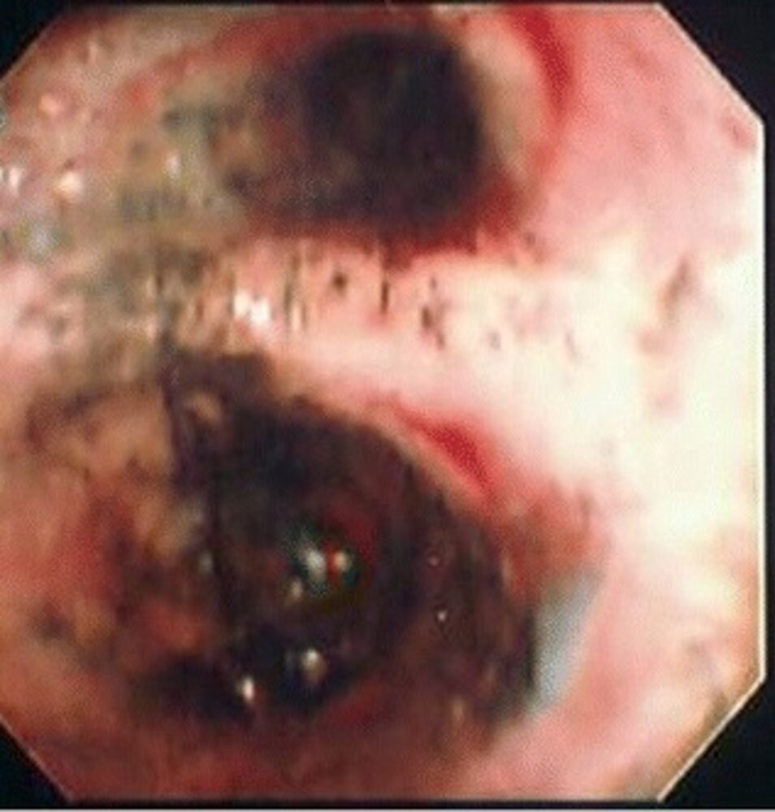

Inhalation injury of the upper airways

---

## Postburn hypermetabolism

* Definition: a metabolic phenomenon that can occur in patients with moderate to severe burn injuries characterized by an initial hypometabolic phase followed by a <u>hypermetabolic state</u>

* Pathophysiology: an increase in <u>catecholamines</u>, <u>cortisol</u>, and inflammatory <u>cytokines</u>  → severe metabolic alterations

* Elevated resting energy expenditures

* <u>Insulin resistance</u>

* ↑ <u>Gluconeogenesis</u>

* ↑ <u>Lipolysis</u>

* <u>Protein catabolism</u>

* Clinical features

* Hypometabolic phase (ebb phase)

* Onset within 48 hours of the burn injury

* Decreased <u>cardiac output</u>, oxygen consumption, and metabolic rate

* Hypermetabolic phase (flow phase)

* Onset 5–7 days after the injury

* Can persist for up to ∼ 3 years

* <u>Hyperdynamic circulation</u>: ↑ blood pressure, ↑ <u>heart rate</u>

* Muscle wasting, protein loss

* <u>Significant weight loss</u>

* <u>Hyperglycemia</u>

* Increased body temperature

* <u>Multiorgan dysfunction</u>

* Management

* Early excision and grafting

* <u>Analgesia</u>

* <u>Nutritional support</u>

* <u>Anabolic steroids</u>

* Glycemic control with <u>insulin</u>

* <u>Beta blockers</u> (e.g., <u>propranolol</u>) to decrease resting metabolism

References:[[22]](https://coursology-qbank.com/amboss/article/libv7t)[[23]](https://coursology-qbank.com/amboss/article/Nib-7t)

---