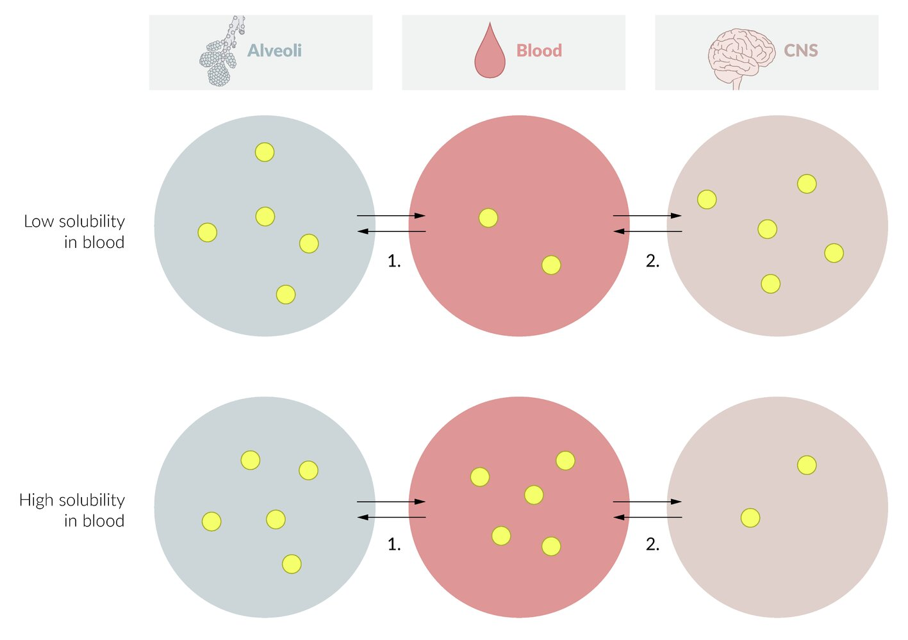
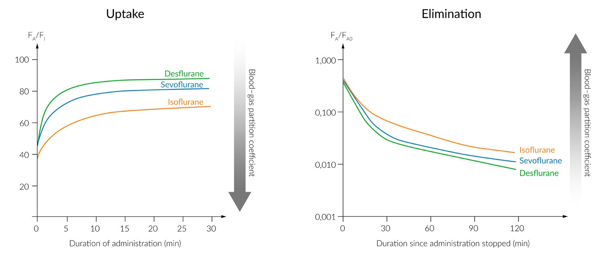

# Inhalational anesthetics

*Categories: Clinical knowledge > Anesthesiology > Drugs > Inhalational anesthetics*

[Original Article Link](https://coursology-qbank.com/amboss/article/EN081g)

---

## Summary

Inhalational <u>anesthetics</u> are used for the induction and maintenance of <u>general anesthesia</u> as well as sedation. The exact mechanisms by which they act are still unknown. The most common inhalational <u>anesthetics</u> are <u>sevoflurane</u>, <u>desflurane</u>, and <u>nitrous oxide</u>. Of these, <u>sevoflurane</u> is the most common because of its rapid onset of action and the fact that patients recover quickly from it. Inhalational <u>anesthetics</u> cause respiratory <u>depression</u>, a decrease in arterial blood pressure and cerebral metabolic demand, and an increase in <u>cerebral blood flow</u>. While side effects differ based on the substance (e.g., <u>halothane</u> can cause <u>hepatotoxicity</u>), the most common side effect is <u>nausea</u>.

---

## Overview

|  Overview of inhalational anesthetics  |  |  |  |  |  |
| --- | --- | --- | --- | --- | --- |
| Agents |  | Indications | Mechanism of action | Adverse effects |  |
| Nitrous oxide |  |  * Induction and maintenance of <u>general anesthesia</u>   |  * Exact mechanism of action still unknown, leads to:  * Sedation/<u>narcosis</u>  * Anesthesia (<u>nitrous oxide</u>)  * ↓ Respiration and arterial blood pressure, <u>myocardial</u> <u>depression</u>  * ↑ Cerebral blood flow and <u>ICP</u>   |   * <u>PONV</u>  * Risk of <u>malignant hyperthermia</u>    |   * Can diffuse into gas-filled body compartments → expansion of the gas in that compartment  * ↑ Pulmonary vessel resistance    |
| Desflurane |  |   * ↑ Blood pressure and <u>heart rate</u>  * Decreased <u>systemic vascular resistance</u>  * <u>Sympathetic</u> activation at higher doses    |  |  |  |
| Sevoflurane |  |  * <u>Agitation</u> (especially in pediatric patients) [[1]](https://coursology-qbank.com/amboss/article/mWcVNY0)   |  |  |  |
| Isoflurane |  |  * Perioperative <u>hyperkalemia</u> [[2]](https://coursology-qbank.com/amboss/article/5WciNY0)   |  |  |  |
|  Enflurane  |  |  * Proconvulsive   |  |  |  |
|  Halothane  |  |  * <u>Halothane hepatitis</u>   |  |  |  |
| Methoxyflurane |  |  * <u>Nephrotoxic</u>   |  |  |  |

---

## Pharmacokinetics and pharmacodynamics

### <u>Pharmacokinetic</u> principles

* Uptake into the blood: inhalational <u>anesthetics</u> are taken up passively via <u>diffusion</u>, which depends on:

* Blood solubility of the <u>anesthetic</u>

* Blood-gas partition coefficient: the <u>ratio</u> of <u>anesthetic</u> concentrations in the blood and alveolar space when <u>partial pressures</u> in the two compartments are equal

* The higher the <u>blood-gas partition coefficient</u> of an inhalational <u>anesthetic</u>, the higher the solubility of that substance in the blood.

* <u>Lung</u> ventilation, volumes, and <u>perfusion</u>

* Distribution and uptake into the <u>brain</u>: Transport to and uptake into the <u>brain</u> depend on cerebral <u>perfusion</u> and the fat solubility of the inhalational <u>anesthetic</u>.
* Brain-blood partition coefficient: the <u>ratio</u> of <u>anesthetic</u> concentrations between <u>brain</u> tissue and blood when <u>partial pressures</u> are equal. The higher the <u>brain-blood partition coefficient</u>, the higher the solubility of the <u>anesthetic</u> in <u>brain</u> tissue

* Onset of effect: : The lower the <u>blood-gas partition coefficient</u> of an inhalational <u>anesthetic</u>, the faster the substance takes effect (less induction time)

* Elimination

* Inhalational <u>anesthetics</u> are eliminated by the <u>lungs</u>
* The lower the <u>blood-gas partition coefficient</u> of an inhalational <u>anesthetic</u>, the faster the effect ceases (less recovery time)

* Inhalational <u>anesthetics</u> are metabolized only to a small degree
* Exception: <u>halothane</u> is metabolized in the <u>liver</u>

* With prolonged duration of anesthesia in <u>obese</u> patients, inhalational <u>anesthetics</u> with a high fat solubility can accumulate in <u>adipose tissue</u> and slow down recovery from anesthesia (increased context-sensitive <u>half-life</u>).

Uptake of inhalation anesthetics as a function of blood solubility

Inhalational anesthetics: Uptake and Elimination

### <u>Pharmacodynamic</u> principles

* Measure of <u>potency</u> of inhalational <u>anesthetics</u>: minimum alveolar concentration (<u>MAC</u>)

* <u>MAC</u> is the fraction of volume of the <u>anesthetic</u> present in the inspired air that provides sufficient <u>analgesia</u> in 50% of patients, meaning that patients will not respond to an extremely painful stimulus such as surgical <u>skin</u> <u>incision</u>.

* <u>MAC</u> is inversely related to <u>anesthetic</u> <u>potency</u> (<u>potency</u> = 1/<u>MAC</u>) and represents the <u>ED50</u> value.

* The lower the <u>MAC</u> value, the more fat soluble the <u>anesthetic</u>. For example:

* <u>Halothane</u> has a slow induction and high <u>potency</u> because of its high lipid and blood solubility.

* <u>Nitrous oxide</u> (<u>N2O</u>), in contrast, has a fast induction and low <u>potency</u> due to low lipid and blood solubility.

### <u>Pharmacokinetics</u> and <u>pharmacodynamics</u> of common inhalational <u>anesthetics</u>

|  | <u>Blood-gas partition coefficient</u> | <u>Brain-blood partition coefficient</u> | <u>Minimum alveolar concentration</u> (<u>MAC</u>) |
| --- | --- | --- | --- |
| <u>Nitrous oxide</u> |  * 0.47   |  * 1.1   |  * > 104%   |
| <u>Desflurane</u> |  * 0.42   |  * 1.3   |  * 6–7%   |
| <u>Sevoflurane</u> |  * 0.69   |  * 1.7   |  * 2%   |
| <u>Isoflurane</u> |  * 1.40   |  * 2.6   |  * 1.4%   |
| <u>Enflurane</u> |  * 1.80   |  * 1.4   |  * 1.7%   |
| <u>Halothane</u> |  * 2.30   |  * 2.9   |  * 0.75%   |

References:[[3]](https://coursology-qbank.com/amboss/article/ai0QJf)[[4]](https://coursology-qbank.com/amboss/article/XC09qR)[[5]](https://coursology-qbank.com/amboss/article/_xa5_5)[[6]](https://coursology-qbank.com/amboss/article/zyar3M)

---

## Pharmacodynamics

### General effects

* Anesthesia

* Sedation/<u>narcosis</u>

* ↓ Respiration

* ↓ Arterial blood pressure

* <u>Myocardial</u> <u>depression</u>

* ↓ Cerebral metabolic demand

* ↑ Cerebral blood flow

* <u>↑ ICP</u>

* Postoperative: <u>nausea and vomiting</u>

### Specific characteristics of common inhalational <u>anesthetics</u>

|  | Specific characteristics |
| --- | --- |
| <u>Nitrous oxide</u> |   * Can cause expansion of gas trapped in a cavity  * Usually insufficient if used alone → often combined with a more potent inhalational <u>anesthetic</u> to achieve the “second gas effect”  * Rapid onset and recovery    |
| <u>Desflurane</u> |   * Very rapid onset and recovery  * Pungent odor; irritates <u>airways</u> → not suitable for induction of anesthesia    |
| <u>Sevoflurane</u> |   * Most commonly used inhalational <u>anesthetic</u>  * Rapid onset and recovery  * Nonpungent → suitable for induction of anesthesia    |
| <u>Isoflurane</u> |   * Most potent of the fluranes  * Relatively slow onset and recovery  * Pungent odor → not suitable for induction of anesthesia    |
| Methoxyflurane |   * <u>Nephrotoxicity</u>  * Can be used as a patient-controlled short-term <u>pain</u> relief    |
| <u>Enflurane</u> |   * <u>Seizures</u> (proconvulsive)  * Medium speed of onset and recovery    |
| <u>Halothane</u> |   * <u>Hepatotoxicity</u>  * Medium speed of onset and recovery    |

References:[[4]](https://coursology-qbank.com/amboss/article/XC09qR)

---

## Adverse effects

### General side effects

* <u>Postoperative nausea and vomiting</u>  [[7]](https://coursology-qbank.com/amboss/article/zxar_5)

* Risk of <u>malignant hyperthermia</u> (except <u>nitrous oxide</u>)

* Postoperative shivering

### Side effects of specific substances

* <u>Nitrous oxide</u>

* Can diffuse into gas-filled body compartments and cause expansion of the gas present there → potential damage to organs/tissues

* Causes mild <u>myocardial</u> <u>depression</u> and increases pulmonary vessel resistance

* <u>Desflurane</u> [[8]](https://coursology-qbank.com/amboss/article/6NYjXp)

* ↓ Systemic vascular resistance → <u>hypotension</u>

* <u>Cardiac output</u> is well-preserved.

* High concentrations → transient stimulation of the <u>sympathetic nervous system</u> → possible <u>tachycardia</u>, <u>hypertension</u>, and <u>dysrhythmias</u>

* <u>Sevoflurane</u>

* Interacts with <u>soda lime</u> → <u>nephrotoxic</u> breakdown products (known as compounds A–E)

* ↓ <u>Minute ventilation</u> [[8]](https://coursology-qbank.com/amboss/article/6NYjXp)

* <u>Isoflurane</u>

* ↑ <u>Intracranial pressure</u>

* <u>Nausea and vomiting</u> (postoperatively)

* <u>Malignant hyperthermia</u>

* Methoxyflurane: <u>nephrotoxic</u>

* <u>Enflurane</u>: proconvulsive

* <u>Halothane</u>: <u>hepatotoxic</u> → halothane hepatitis [[9]](https://coursology-qbank.com/amboss/article/xBaE1M)

* Pathophysiology: underlying mechanism not fully understood

* Clinical features

* Occurs 2 days to 3 weeks after <u>halothane</u> exposure

* Signs of acute <u>hepatitis</u> (e.g., <u>jaundice</u>, <u>fever</u>, <u>vomiting</u>, <u>hepatomegaly</u>)

* <u>Rash</u>, <u>arthralgias</u>

* Diagnostics: diagnosis of exclusion

* Possible laboratory findings: ↑ <u>eosinophils</u>, ↑ serum <u>transaminases</u> ;  , ↑ <u>bilirubin</u>, ↑ <u>alkaline phosphatase</u>

* <u>Biopsy</u> shows massive centrilobular hepatic <u>necrosis</u>

* Treatment: depending on the severity of <u>liver</u> damage,  ranges from supportive treatment to <u>liver transplantation</u> [[10]](https://coursology-qbank.com/amboss/article/7ya4gM)

References:[[4]](https://coursology-qbank.com/amboss/article/XC09qR)[[7]](https://coursology-qbank.com/amboss/article/zxar_5)[[9]](https://coursology-qbank.com/amboss/article/xBaE1M)[[11]](https://coursology-qbank.com/amboss/article/-xaD_5)

We list the most important adverse effects. The selection is not exhaustive.

---