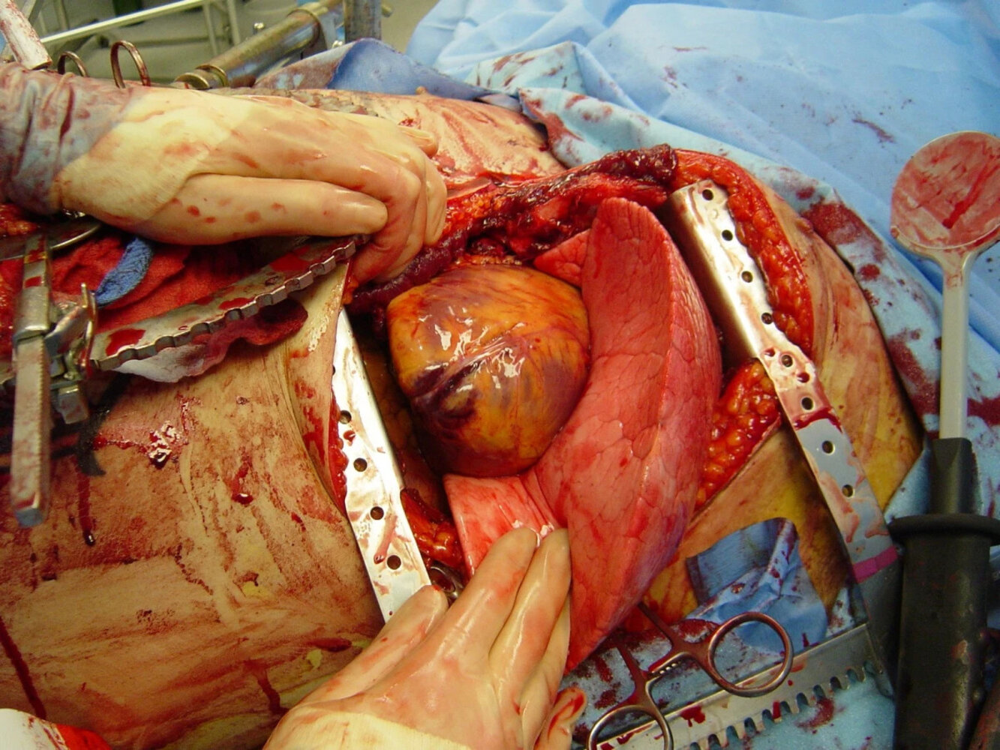
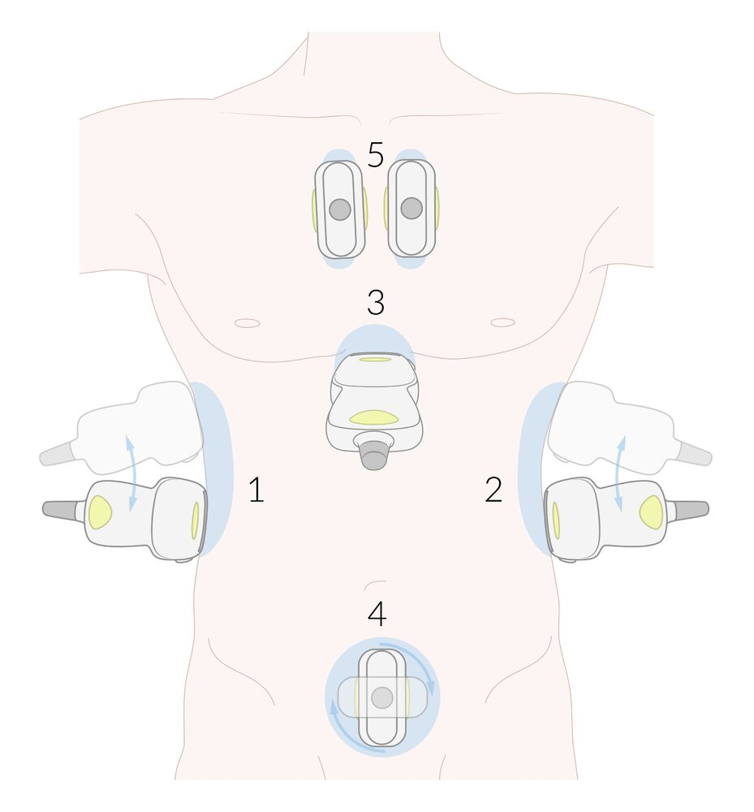
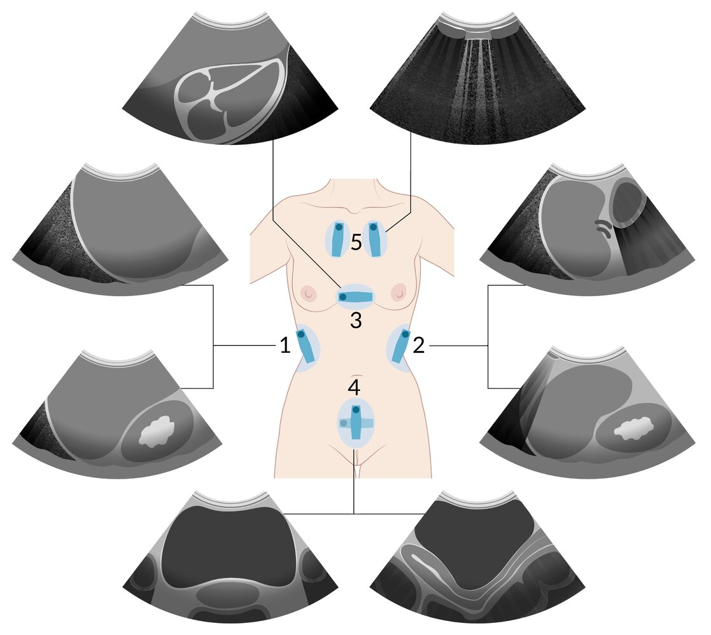
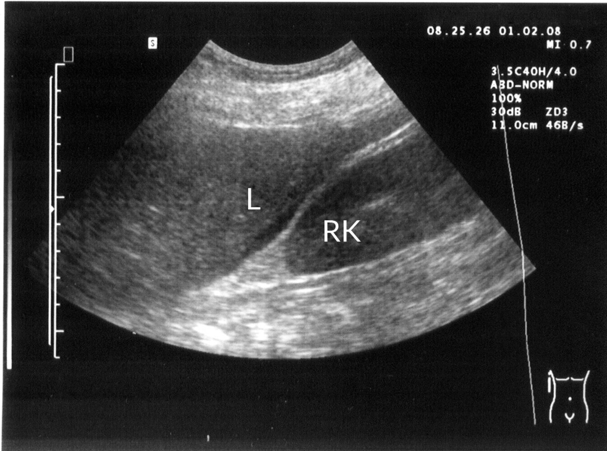
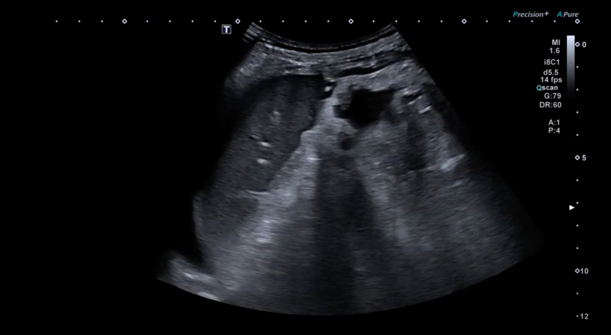
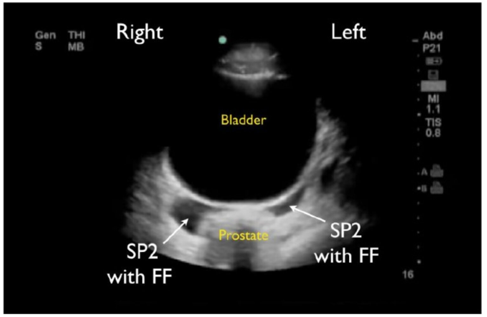
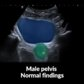

# Management of trauma patients

*Categories: Clinical knowledge > Anesthesiology > Management of trauma patients*

[Original Article Link](https://coursology-qbank.com/amboss/article/4N03Yg)

---

## Summary

Trauma is one of the <u>leading causes of death</u> worldwide and, in the United States, the leading <u>cause of death</u> in young adults. Traumatic injuries range from isolated wounds to life-threatening multi-organ injuries. <u>Advanced trauma life support</u> (<u>ATLS</u>) is a framework for the systematic evaluation of trauma patients to improve outcomes and reduce missed injuries. <u>Prehospital trauma care</u> involves life-saving interventions and <u>basic life support</u> in the field by emergency medical services while providing rapid transportation to the nearest appropriate hospital. In the hospital, the assessment of trauma patients begins with a <u>primary survey</u> in which life-threatening conditions are identified and treated using the sequential <u>ABCDE approach</u>. After the patient is stabilized, the <u>secondary survey</u> is performed, which involves a thorough history and <u>physical examination</u> as well as diagnostic testing to identify other injuries. The <u>tertiary survey</u> is performed within 24 hours of presentation to identify missed injuries. If at any point during the evaluation the patient's needs exceed the hospital's capabilities, the process to transfer the patient to a <u>trauma center</u> should be initiated. Trauma management of pregnant, geriatric, and pediatric patients requires additional considerations given their unique physiology.

See also “<u>Blunt trauma</u>” and “<u>Penetrating trauma</u>.”

---

## Definitions

* Trauma center [[1]](https://coursology-qbank.com/amboss/article/ZyYZd7)

* A health facility that provides specialized care to patients with serious traumatic injuries.

* Different levels (e.g., I–V) of <u>trauma center</u> can be designated

* Trauma team [[1]](https://coursology-qbank.com/amboss/article/ZyYZd7)

* A multidisciplinary team that provides care to patients at <u>trauma centers</u>

* Consists of specialists from trauma <u>surgery</u>, <u>emergency medicine</u>, intensive care, and nursing

* Members typically include a team leader, <u>airway</u> manager, assessment physician, proceduralist, trauma nurse, trauma technician, respiratory therapist, radiographer, and scribe.

* See also “<u>Criteria for trauma team activation</u>.”

* Advanced trauma life support (<u>ATLS</u>)  [[1]](https://coursology-qbank.com/amboss/article/ZyYZd7)

* A framework for managing patients with serious injuries in prehospital and hospital settings.

* Describes management sequences (e.g., <u>ABCDE algorithm</u>) that prioritize the most immediately life-threatening injuries first.

* Aims to standardize trauma care across centers with varying resources and experience with trauma management

* Polytrauma: severe injuries occurring in more than one anatomic region that cause systemic physiological disturbances  [[2]](https://coursology-qbank.com/amboss/article/FB1gcj0)

---

## Prehospital trauma care

<u>Prehospital trauma care</u> is situation-dependent and centered on field stabilization of the patient and prompt transport to the closest <u>trauma center</u>.

### Bystanders [[1]](https://coursology-qbank.com/amboss/article/ZyYZd7)[[3]](https://coursology-qbank.com/amboss/article/HnXKuA)

* Shout for help and/or call 911.

* Assess scene safety prior to providing assistance.

* Remove the patient from dangerous situations.

* Initiate <u>basic life support</u> (<u>BLS</u>).

* Perform life-saving interventions.

* <u>Airway opening maneuvers</u>

* <u>Hemorrhage control</u>

* <u>Spinal immobilization</u>

### Emergency medical services (<u>EMS</u>) [[1]](https://coursology-qbank.com/amboss/article/ZyYZd7)[[4]](https://coursology-qbank.com/amboss/article/AN1Rdh0)

<u>Prehospital trauma care</u> provided by physicians varies regionally.  [[5]](https://coursology-qbank.com/amboss/article/JB1sbj0)

* <u>EMS</u> typically perform an abbreviated version of the <u>primary survey</u>.

* Provide life-saving interventions.

* <u>Airway management</u> for <u>respiratory distress</u> or <u>altered mental status</u>

* <u>Hemorrhage control</u> (e.g., use of <u>tourniquets</u> or pressure bandages)

* <u>Immediate hemodynamic support</u> (e.g., <u>IV fluids</u>)

* Prevent additional injury.

* <u>Spinal immobilization</u> (e.g., <u>cervical collar</u> placement, backboard)

* <u>Fracture</u> stabilization

* Provide <u>parenteral analgesia</u>, as needed.

* Rapidly transport the patient to the closest appropriate hospital.  [[6]](https://coursology-qbank.com/amboss/article/qB1Cbj0)[[7]](https://coursology-qbank.com/amboss/article/IB1YXj0)

* Notify the receiving hospital.

* <u>Signout</u> of patient to <u>trauma team</u> lead upon arrival

---

## Primary survey

The <u>ABCDE algorithm</u> in <u>ATLS</u> provides a sequence to help prioritize treating the most rapidly life-threatening injuries first. In clinical practice, <u>trauma team</u> members evaluate and treat these simultaneously, continually reassessing each injury's severity throughout the resuscitation. [[1]](https://coursology-qbank.com/amboss/article/ZyYZd7)

### <u>Airway</u> (and <u>C-spine immobilization</u>) [[1]](https://coursology-qbank.com/amboss/article/ZyYZd7)

Identify and treat <u>airway obstruction</u> (e.g., due to blood, direct injury, <u>edema</u>) and/or loss of <u>airway protective reflexes</u>, (e.g., due to <u>AMS or coma</u>), while preventing further <u>C-spine injury</u>.

* Assess the <u>airway</u>.

* Ask the patient to state their name; the ability to answer typically correlates with a patent <u>airway</u>.

* Evaluate for <u>signs of airway compromise</u> and <u>signs of respiratory distress</u>.

* Examine the <u>airway</u> for foreign bodies or injury (e.g., <u>facial fractures</u>, soot, <u>burns</u>).

* Perform initial interventions.

* Suction oropharyngeal secretions and/or blood.

* Perform <u>airway opening maneuvers</u>.

* Insert <u>basic airway adjuncts</u>.

* Intubate patients with: [[8]](https://coursology-qbank.com/amboss/article/GB1BXj0)

* <u>Airway obstruction</u> and/or <u>respiratory failure</u>

* Depressed mental status (e.g., <u>GCS</u> ≤ 8)  [[8]](https://coursology-qbank.com/amboss/article/GB1BXj0)[[9]](https://coursology-qbank.com/amboss/article/QLbux8)

* Severe <u>shock</u> and/or <u>cardiac arrest</u>

* At-risk <u>inhalation injury</u>

* Stabilize the <u>C-spine</u>.

* Assume <u>C-spine injury</u> in patients with <u>blunt trauma</u> and <u>indications for spinal immobilization</u>.

* Perform <u>airway management</u> with necessary <u>spinal motion restrictions</u>.

* See “<u>Initial management of C-spine injury</u>” for details.

> [!WARNING]
> Perform <u>cricothyrotomy</u> in case of <u>intubation failure</u>.

> [!WARNING]
> Consider early <u>intubation</u> for impending <u>airway obstruction</u> in patients with signs of <u>inhalation injury</u>, moderate to severe facial and oropharyngeal <u>burns</u>, and extensive body <u>burns</u>. [[8]](https://coursology-qbank.com/amboss/article/GB1BXj0)

### Breathing [[1]](https://coursology-qbank.com/amboss/article/ZyYZd7)

Identify and treat chest injuries, e.g., <u>tension pneumothorax</u>, <u>open pneumothorax</u>, <u>massive hemothorax</u>, <u>flail chest</u>, and <u>tracheobronchial injuries</u>.

* Assess oxygenation: Evaluate <u>SpO2</u> and start continuous <u>pulse oximetry</u>.

* Assess ventilation

* <u>Vital signs</u>: Monitor rate and quality of respirations; consider <u>EtCO2</u> monitoring.

* Neck: Inspect for <u>jugular venous distension</u> and <u>tracheal deviation</u>

* Chest: <u>Auscultate</u> and inspect for <u>chest wall injuries</u>: e.g., penetrating wounds, <u>subcutaneous emphysema</u>, absent breath sounds, <u>paradoxical chest movement</u>

* Consider <u>eFAST</u> to help identify <u>pneumothorax</u> at the bedside.

* Perform initial interventions.

* <u>Supplemental O2</u>

* <u>Emergency chest decompression</u> for suspected <u>tension pneumothorax</u>.

* 3-sided dressing for <u>sucking chest wound</u>

* <u>BMV</u> or <u>mechanical ventilation</u> for <u>respiratory failure</u>

> [!WARNING]
> If <u>traumatic pneumothorax</u> is suspected in a patient requiring <u>positive pressure ventilation</u>, perform <u>tube thoracostomy</u> immediately to prevent progression to <u>tension pneumothorax</u>. [[1]](https://coursology-qbank.com/amboss/article/ZyYZd7)

### Circulation [[1]](https://coursology-qbank.com/amboss/article/ZyYZd7)

Provide <u>immediate hemodynamic support</u> and <u>hemostatic measures</u> while identifying sources of bleeding, e.g., external hemorrhage, <u>thoracic cavity</u>, <u>abdominal cavity</u>, thighs, <u>retroperitoneal space</u>.

* Assess hemodynamic status.

* Assess <u>central pulses</u>, <u>level of consciousness</u>, and <u>capillary refill time</u>.

* Monitor <u>vitals</u> and <u>continuous cardiac telemetry</u>.

* Perform initial interventions.

* Place two large-bore IVs (at least 18-gauge).

* Consider <u>intraosseous access</u> if <u>peripheral IV</u> cannot be obtained.

* Administer 1 L warmed isotonic <u>crystalloid</u> bolus.

* If unresponsive to IV fluid, proceed to <u>blood transfusion</u>.

* Localize hemorrhage.

* Perform <u>FAST</u> to rapidly identify <u>hemopericardium</u>, and intrathoracic, intraabdominal, and/or intrapelvic bleeding in unstable patients.

* Identify obvious <u>pelvic</u> or <u>long bone</u> (e.g., <u>femur</u>) deformity.

* Identify <u>major bleeding</u> vessels (e.g., in the neck, groin, chest, or <u>proximal</u> extremities).

* Identify indications for immediate <u>surgery</u> (e.g., <u>exploratory laparotomy</u>, <u>urgent thoracotomy</u>) and/or <u>angioembolization</u>.

* Treat <u>hemorrhagic shock</u>.

* Administer <u>emergency transfusion</u> with <u>universal donor blood products</u> (e.g., <u>type O blood</u>) if required.

* Provide <u>crossmatched</u> <u>blood products</u> as soon as they are available.

* Follow local <u>massive transfusion protocol</u> if indicated, e.g., plasma, <u>platelets</u>, and <u>pRBCs</u> at a 1:1:1 <u>ratio</u>.

* Consider <u>tranexamic acid</u> (<u>TXA</u>).  [[10]](https://coursology-qbank.com/amboss/article/_jX51y)[[11]](https://coursology-qbank.com/amboss/article/zjXr1y)

* Consider <u>reversal of anticoagulation</u>.

* Allow for <u>permissive hypotension</u>.

* Perform bedside hemorrhage control.

* Apply pressure or <u>tourniquet</u> to control active external hemorrhage.

* Apply <u>pelvic binder</u> for suspected bleeding <u>pelvic fractures</u>

* <u>Insert chest tube</u> for suspected massive <u>traumatic hemothorax</u>

* Treat <u>obstructive shock</u>: e.g., <u>chest tube insertion</u> for <u>tension pneumothorax</u>, <u>pericardial window</u> for <u>cardiac tamponade</u>

> [!WARNING]
> If there is a loss of <u>vital signs</u>, treat <u>traumatic cardiac arrest</u> with <u>emergency chest decompression</u> and <u>emergency thoracotomy</u>.

> [!WARNING]
> Suspect <u>cardiac tamponade</u> in patients with <u>penetrating chest injury</u> with <u>Beck triad</u> and a positive <u>FAST scan</u>, and expedite urgent <u>pericardial fluid drainage</u> via <u>thoracotomy</u>.

> [!WARNING]
> <u>Penetrating abdominal injury</u> with <u>signs of shock</u> is usually an indication for <u>exploratory laparotomy</u>.

### Disability [[1]](https://coursology-qbank.com/amboss/article/ZyYZd7)

Identify life-threatening <u>traumatic brain injury</u> (<u>TBI</u>), begin measures to limit <u>secondary brain injury</u>, and expedite definitive <u>surgery</u> if indicated.

* Perform rapid neurological evaluation.

* Calculate <u>GCS</u>.

* Assess <u>pupillary light response</u>.

* Assess motor and sensation functions.

* Initiate <u>TBI management</u>.

* Consult neurosurgery.

* Start <u>neuroprotective measures</u>.

* Start <u>ICP management</u> if a <u>cerebral herniation syndrome</u> is present.

> [!WARNING]
> Remain vigilant for <u>signs of traumatic brain injury</u> in intoxicated patients. [[1]](https://coursology-qbank.com/amboss/article/ZyYZd7)

Glasgow Coma Scale (GCS)

### Exposure (and environmental control) [[1]](https://coursology-qbank.com/amboss/article/ZyYZd7)

* Undress the patient completely.

* Examine the entire patient for signs of occult injury, including the <u>axilla</u>, groin, and back.

* Prevent and/or <u>manage hypothermia</u> with <u>rewarming techniques</u>.

### Diagnostic adjuncts [[1]](https://coursology-qbank.com/amboss/article/ZyYZd7)

Consider the following studies during the <u>primary survey</u> if they are likely to impact immediate management:

* Portable <u>CXR</u>

* Portable <u>pelvic</u> <u>x-ray</u>

* <u>FAST</u> or <u>eFAST</u>

* <u>Diagnostic peritoneal lavage</u> (if <u>POCUS</u> is unavailable)

* See “<u>Diagnostics in trauma</u>” for details.

> [!TIP]
> Use bedside studies for rapid diagnostics in patients that are too unstable for transport to imaging suites.

### Traumatic circulatory arrest [[1]](https://coursology-qbank.com/amboss/article/ZyYZd7)

* Common causes include <u>tension pneumothorax</u>, <u>cardiac tamponade</u>, and <u>hemorrhagic shock</u>.

* Management

* First line: bilateral chest decompression with <u>finger thoracostomy</u>

* Consider <u>emergency thoracotomy</u>

* Expedite definitive <u>surgery</u> and operative stabilization of survivors.

> [!WARNING]
> <u>Traumatic cardiac arrest</u> requires bedside surgical interventions by trained personnel and subsequent operative treatment and stabilization. Do not follow standard <u>ACLS</u> algorithms as these are unlikely to be effective.

Emergency thoracotomy

#### Resuscitative thoracotomy [[12]](https://coursology-qbank.com/amboss/article/9gXNxx)

The following is consistent with the 2015 Eastern Association for the <u>Surgery</u> of Trauma (<u>EAST</u>) recommendations on <u>emergency department thoracotomy</u>. Follow local policies as indications vary regionally. [[12]](https://coursology-qbank.com/amboss/article/9gXNxx)

* Definition: a bedside procedure performed in the emergency department or trauma bay to obtain emergency access to the <u>thoracic cavity</u> to provide temporizing lifesaving measures in pulseless patients

* Purpose

* Relieve <u>cardiac tamponade</u> via <u>pericardiotomy</u> and/or repair of <u>myocardial injury</u>

* Control intrathoracic hemorrhage

* Perform <u>open cardiac massage</u>

* Cross-clamp the <u>descending aorta</u>

* Indications

* Pulseless patients after <u>penetrating thoracic injury</u>

* Pulseless patients after penetrating extrathoracic injury, excluding isolated <u>cranial</u> injuries

* Pulseless patients with recently documented signs of life in the field or at the hospital  after blunt injury

* Contraindication: pulseless patients without any documented signs of life in the field or at the hospital after blunt injury

> [!WARNING]
> Do not perform <u>resuscitative thoracotomy</u> unless a qualified <u>surgeon</u> is present. [[1]](https://coursology-qbank.com/amboss/article/ZyYZd7)

### Interim management

Consider the following once the <u>primary survey</u> is complete:

* Reassess the <u>effectiveness</u> of life-saving bedside interventions.

* Prepare for urgent time-sensitive imaging (e.g., CT head) once the patient is stable enough.

* Determine if the patient needs immediate <u>surgery</u>, urgent interfacility transfer, or immediate specialty consult (see “Disposition”).

* Next steps: See “<u>Secondary survey</u>.”

> [!WARNING]
> If there is clinical deterioration at any time, repeat the <u>primary survey</u> to identify a critical cause.

#### Urgent interfacility transfer [[1]](https://coursology-qbank.com/amboss/article/ZyYZd7)

The following applies to patients initially evaluated at facilities that are not <u>trauma centers</u>:

* The decision to transfer a patient to a <u>trauma center</u> for definitive care is multifactorial.

* See “<u>Criteria for trauma team activation</u>” for conditions that typically require management by a trained <u>trauma team</u>.

* If tests are required prior to transfer, keep them limited to tests that will ensure a safe transfer.

* Communicate with the receiving physician and transportation team about clinical and diagnostic findings.

> [!WARNING]
> Do not delay an urgent transfer in order to complete an in-depth diagnostic evaluation.

---

## Secondary survey

The <u>secondary survey</u> is performed after the patient is stabilized and it involves a thorough history and <u>physical examination</u> as well as diagnostic testing to identify other injuries.

### History [[1]](https://coursology-qbank.com/amboss/article/ZyYZd7)

Obtain the following to anticipate likely injuries and estimate patient's physiological reserve.

* AMPLE history: a focused history approach recommended in the rapid evaluation of patients with trauma

* Allergies

* Medications

* Past <u>medical history</u> and <u>pregnancy</u> status

* Last meal

* Events and environment related to the injury

* Mechanism of injury

* Injury patterns can provide clues to the mechanism of injury (e.g., direction, amount of energy).

* Commonly divided into <u>blunt trauma</u> and <u>penetrating trauma</u>

* See “<u>Blunt trauma injury mechanisms</u>.”

* See “<u>Gunshot injuries</u>” and “<u>Penetrating trauma</u>.”

> [!TIP]
> Obtain collateral information from <u>EMS</u>, family, and/or witnesses, especially if the patient is unable to provide a reliable history.

### <u>Physical examination</u> [[1]](https://coursology-qbank.com/amboss/article/ZyYZd7)

A systematic head-to-toe <u>physical examination</u> must be completed to identify additional injuries.

* Assess each body part for <u>open wounds</u>, <u>lacerations</u>, <u>abrasions</u>, foreign bodies, and/or <u>bruising</u>.

* Identify any bony deformities, areas with focal tenderness, or <u>edema</u>.

* Document all findings.

|  <u>Secondary survey</u> in trauma patients [[1]](https://coursology-qbank.com/amboss/article/ZyYZd7) |  |  |
| --- | --- | --- |
|  | Examination | Injuries |
| Head |   * Inspect and palpate the head.  * Perform <u>ocular examination</u> and <u>pupillary examination</u>.  * Assess mental status and <u>GCS</u>.  * Evaluate <u>cranial nerves</u>.    |   * See “<u>Traumatic brain injury</u>”  * See “<u>Traumatic eye injuries</u>”  * See “<u>Skull fractures</u>”    |
| Maxillofacial |   * Inspect <u>ears</u>, nose, and mouth.  * Assess for <u>malocclusion</u>.    |   * See “<u>Facial fractures</u>”  * See “<u>Dental injuries</u>”    |
| <u>Cervical spine</u> and neck |   * Inspect for signs of <u>tracheal injury</u> or <u>tracheal deviation</u>.  * Palpate for <u>crepitus</u>.  * <u>Auscultate</u> carotid <u>arteries</u>.  * Palpate for <u>cervical spine</u> tenderness.    |   * See “<u>Vertebral fractures</u>”  * See “<u>Penetrating neck trauma</u>”  * See “<u>Blunt neck trauma</u>”    |
| Chest |   * Inspect and <u>auscultate</u> the chest.  * Palpate the <u>chest wall</u> for tenderness and <u>crepitus</u>.    |   * See “<u>Tension pneumothorax</u>”  * See “<u>Traumatic pneumothorax</u>”  * See “<u>Traumatic hemothorax</u>”  * See “<u>Rib fracture</u>”  * See “<u>Cardiac tamponade</u>”  * See “<u>Diaphragmatic rupture</u>”  * See “<u>Blunt chest trauma</u>”  * See “<u>Penetrating chest trauma</u>”    |
| Abdomen and <u>pelvis</u> |   * Inspect and <u>auscultate</u> the abdomen.  * Palpate the abdomen for tenderness, <u>abdominal guarding</u>, or <u>rebound tenderness</u>.  * Assess for <u>pelvic instability</u>.    |   * See “<u>Blunt abdominal trauma</u>”  * See “<u>Penetrating abdominal trauma</u>”  * See “<u>Pelvic fracture</u>”    |
| Genitourinary |   * Assess for <u>urethral injury</u>.  * Perform a <u>digital rectal examination</u> and/or <u>pelvic examination</u> as indicated.    |  * See “<u>Genitourinary trauma</u>”   |
| Back and flank |   * Perform a <u>log roll</u> to examine the back of patients under <u>C-spine precautions</u>.  * Palpate the thoracolumbar <u>spine</u> for tenderness and step deformities.  * Evaluate for signs of <u>retroperitoneal hemorrhage</u> (e.g. <u>Grey Turner sign</u>)    |  * See “<u>Vertebral fractures</u>.”   |
| Musculoskeletal |   * Inspect upper and lower extremities for <u>lacerations</u> or deformities.  * Palpate upper and lower extremities for tenderness.  * Palpate peripheral pulses.    |   * See “<u>Penetrating trauma to the extremities</u>”  * See “<u>Blunt trauma to the extremities</u>”  * See “<u>General principles of fractures</u>”  * See “<u>Compartment syndrome</u>”  * See “<u>Rhabdomyolysis and crush syndrome</u>”    |
| Neurological |  * Assess motor and sensory functions of upper and lower extremities.   |   * See “<u>Incomplete spinal cord syndromes</u>”  * See “<u>Complete spinal cord injury</u>”    |

> [!WARNING]
> Do not forget to <u>log roll</u> patients who are under <u>C-spine precautions</u> to examine the back and <u>spine</u>.

### Diagnostic adjuncts [[1]](https://coursology-qbank.com/amboss/article/ZyYZd7)

Consider the following diagnostic studies and procedures during the <u>secondary survey</u> once the patient is stable:

* <u>Whole-body CT</u> (<u>WBCT</u>)

* CT head without IV contrast

* CT <u>cervical spine</u> without IV contrast

* CT thoracic and/or <u>lumbar spine</u> without IV contrast

* CT chest with IV contrast or <u>CTA</u> chest

* CT abdomen and <u>pelvis</u> with IV contrast

* <u>X-rays</u> of the extremities

* <u>Laboratory studies</u>

* Ancillary testing (e.g., <u>bronchoscopy</u>, <u>esophagoscopy</u>)

* See “<u>Diagnostics in trauma</u>” for details.

### Further management

* Ensure imaging is ordered for all identifiable injuries.

* Consider using decision rule to clinically rule out <u>C-spine injury</u> and allow early removal of <u>C-spine precautions</u>.

* Order routine trauma <u>laboratory studies</u>, including any <u>emergency preop diagnostics</u> and tests required to evaluate medical comorbidies.

* Order appropriate monitoring, e.g., <u>continuous cardiac monitoring</u>, <u>neurovitals</u>.

* Provide adequate <u>analgesia</u> and other <u>supportive care</u> (e.g., <u>antiemetics</u>, <u>maintenance fluids</u>).

* Provide <u>tetanus prophylaxis</u> for <u>open wounds</u>.

* If <u>intraperitoneal</u> injury is suspected, administer <u>empiric antibiotics for intraabdominal infections</u>.

* Evaluate the need for admission, interfacility transfer, and further consults to address newly identified injuries (See “Disposition”).

* Next steps: See “<u>Tertiary survey</u>.”

---

## Diagnostics

### Approach

* Consider clinical judgment, mechanism of injury, and patient factors (e.g., age, hemodynamic status) when choosing diagnostic studies.

* Weigh the need and timing of diagnostic studies against the need for urgent interfacility transfer or surgical intervention for each patient.

* Follow local policies on diagnostic imaging strategy (e.g., liberal vs. selective) as these vary by institution and region (see “<u>CT imaging in trauma</u>” for details).

### <u>ECG</u> [[1]](https://coursology-qbank.com/amboss/article/ZyYZd7)

* Indications: mechanisms that may result in cardiac injury (e.g., in <u>blunt chest trauma</u>)

* Findings

* <u>Blunt cardiac injury</u> (e.g., <u>dysrhythmia</u>, <u>ST segment</u> changes)

* <u>Pericardial effusion and cardiac tamponade</u> (e.g., <u>electrical alternans</u>, low <u>voltage</u> QRS)

### <u>Laboratory studies</u> [[1]](https://coursology-qbank.com/amboss/article/ZyYZd7)

* Routine studies: <u>CBC</u>, <u>BMP</u>, <u>LFTs</u>

* Preoperative studies: <u>coagulation studies</u>, <u>type and screen</u>

* <u>Pregnancy test</u> (e.g., serum or urine <u>β-hCG</u>)

* <u>POC glucose</u>

* <u>Urinalysis</u>  (See “<u>Approach to genitourinary trauma</u>” for details.)

* <u>Lactate</u>

* <u>ABG</u>: to evaluate <u>PaO2</u>, <u>PaCO2</u>, <u>pH</u> and <u>base deficit</u>

> [!WARNING]
> <u>Normotensive</u> patients with trauma may have subclinical <u>hypoperfusion</u>. Evaluate for other <u>clinical features of shock</u> and check <u>hemodynamic parameters</u> (e.g., serum <u>lactate</u>, <u>base deficit</u>).

### FAST and eFAST [[1]](https://coursology-qbank.com/amboss/article/ZyYZd7)[[20]](https://coursology-qbank.com/amboss/article/B1czQY0)

See “<u>Point-of-care ultrasound</u>” (<u>POCUS</u>) for procedural details (e.g., image generation and troubleshooting).

* <u>Focused assessment with sonography for trauma</u> (<u>FAST</u>): thoracoabdominal <u>POCUS</u> used in trauma patients to detect free fluid within the <u>peritoneal</u>, <u>pericardial</u>, and pleural cavities

* <u>Extended FAST</u> (<u>eFAST</u>): an extension of the <u>FAST scan</u> that includes evaluation of the chest for <u>lung sliding</u>

* Clinical applications in trauma

* Can identify internal hemorrhage (e.g., <u>hemoperitoneum</u>, <u>hemopericardium</u>, <u>hemothorax</u>) requiring operative intervention in unstable patients

* <u>eFAST</u> can additionally help identify <u>pneumothorax</u>

* Used primarily as a diagnostic adjunct during the <u>primary survey</u>

* Can be used as an adjunct for serial reassessments

* Limitations

* Limited <u>sensitivity</u> in stable patients

* Needs to be interpreted alongside other diagnostic and clinical findings

* Technique: <u>Sonography</u> of the subxiphoid, <u>RUQ</u>, <u>LUQ</u>, <u>pelvic</u>, and <u>anterior</u> thoracic regions is typically performed (see “<u>FAST and eFAST</u>” in “<u>POCUS</u>” for details).

* Findings: See “<u>FAST and eFAST</u>” in “<u>POCUS</u>” for details.

* Free fluid can be seen in the following spaces:

* <u>Pericardial</u>

* Pleural

* Hepatorenal

* Splenorenal   and/or subphrenic

* <u>Pelvic</u>

* <u>Lung sliding</u> may be absent in <u>pneumothorax</u>

> [!TIP]
> Interpret <u>FAST and eFAST</u> alongside other diagnostic parameters and clinical judgment. <u>POCUS</u> does not replace definitive diagnostic studies. [[20]](https://coursology-qbank.com/amboss/article/B1czQY0)

> [!WARNING]
> A positive <u>FAST exam</u> in a <u>hemodynamically unstable</u> patient with trauma is usually an indication for urgent operative intervention (e.g., <u>exploratory laparotomy</u>, <u>urgent thoracotomy</u>, <u>pericardiotomy</u>).

eFAST: Placement of the transducer

eFAST: Main areas of interest

Pericardial effusion

Intraperitoneal free fluid in the hepatorenal space

Free fluid in the splenorenal recess

Free fluid in the left subphrenic space

FAST exam of the male pelvis with free fluid

Pleural effusion

AMBOSS POCUS series | Pericardial effusion

AMBOSS POCUS series | Free fluid in hepatorenal recess (Morison pouch)

AMBOSS POCUS series | Free fluid in splenorenal recess

AMBOSS POCUS series | Pleural effusion

AMBOSS POCUS series | Pneumothorax

AMBOSS POCUS series | Male pelvis: normal findings

### <u>Radiography</u> [[1]](https://coursology-qbank.com/amboss/article/ZyYZd7)

Bedside chest and <u>pelvic</u> <u>x-rays</u> are commonly performed during the <u>primary survey</u>, while extremity and <u>spine</u> <u>X-rays</u> are typically reserved for the <u>secondary survey</u>.

#### <u>CXR</u>

* Indications: blunt or <u>penetrating trauma</u> to the chest or abdomen

* Findings

* <u>Pneumothorax</u>

* <u>Hemothorax</u>

* <u>Pneumoperitoneum</u>

* <u>Pneumomediastinum</u>

* <u>Widened mediastinum</u>

#### <u>Pelvic</u> <u>X-ray</u>

* Indications

* Blunt or <u>penetrating trauma</u> to the abdomen

* <u>Unstable pelvis</u>

* Findings: <u>pelvic fracture</u>

#### Extremity <u>X-rays</u>

* Indications: <u>pain</u>, redness, swelling, or deformity at the injury site

* Findings: <u>fracture</u> and/or <u>dislocation</u>

#### Spinal <u>X-rays</u>

Spinal <u>x-rays</u> have been replaced by CT imaging in most <u>trauma centers</u>.

* Indications

* Spinal tenderness to palpation

* Disruption of the <u>vertebral process</u> alignment (i.e., <u>step-off deformity</u>)

* Extremity numbness, tingling, or <u>weakness</u>

* <u>Neurogenic shock</u>

* Findings

* <u>Vertebral compression fracture</u>

* <u>Burst fracture</u>

* <u>Chance fracture</u>

* <u>Transverse process fracture</u>

* <u>Spinous process</u> <u>fracture</u>

* <u>Spondylolisthesis</u>

### CT imaging in trauma [[1]](https://coursology-qbank.com/amboss/article/ZyYZd7)

#### Approach

* Perform <u>CT scans</u> preferentially during the <u>secondary survey</u> in hemodynamically stable patients with no obvious indications for emergent <u>laparotomy</u>.

* Make decisions about the timing, necessity, and sequence of <u>CT scans</u> together with all relevant specialists on the <u>trauma team</u>, especially for patients with <u>polytrauma</u>.

* If a crucial <u>CT scan</u> cannot be delayed as it impacts operative management, ensure <u>trauma teams</u> are at the bedside with stabilizing treatments throughout the procedure.

* Follow local protocols for CT imaging (e.g., <u>WBCT</u> vs. selective CT imaging) under specialist guidance.  [[21]](https://coursology-qbank.com/amboss/article/YD1n1Q0)[[22]](https://coursology-qbank.com/amboss/article/vB1Acj0)[[23]](https://coursology-qbank.com/amboss/article/DB111j0)[[24]](https://coursology-qbank.com/amboss/article/wB1h1j0)[[25]](https://coursology-qbank.com/amboss/article/9B1N1j0)

> [!WARNING]
> Avoid transporting unstable patients out of resuscitation areas to obtain <u>CT scans</u> whenever possible.

#### Whole-body CT (<u>pan scan</u>) [[21]](https://coursology-qbank.com/amboss/article/YD1n1Q0)

* May be performed to evaluate patients with multiple injuries after significant trauma

* Commonly includes:

* CT head without IV contrast

* CT <u>cervical spine</u> without IV contrast

* CT thoracic and <u>lumbar spine</u> with IV contrast

* CT chest with IV contrast

* <u>CTA</u> chest

* CT abdomen and <u>pelvis</u> with IV contrast

#### CT head and <u>spine</u>

* CT head without IV contrast: See “Diagnostic imaging in <u>traumatic brain injury</u>.”

* CT <u>cervical spine</u> without IV contrast

* Indications

* Clinical suspicion of <u>C-spine injury</u> based on mechanism and examination

* Inability to <u>clear C-spine</u> clinically using a validated tool (e.g., <u>NEXUS C-spine criteria</u> , Canadian <u>C-spine</u> rule (CCR) )

* Findings

* Bony deformity and/or <u>fracture</u> of the <u>vertebral body</u> or processes

* Loss of alignment of the <u>vertebral bodies</u>

* Increased distance between <u>vertebrae</u>

* Narrowing of <u>vertebral canal</u>

* Increased prevertebral <u>soft tissue</u> swelling

* CT thoracic and <u>lumbar spine</u> without IV contrast 

* Indications: clinical suspicion of <u>T-spine</u> and/or or <u>L-spine</u> injury based on mechanism and examination

* Findings: similar to CT <u>cervical spine</u>

> [!TIP]
> Consider imaging for <u>spinal fractures</u> in patients with evidence of high-energy trauma to the lower extremities (e.g., <u>calcaneus fracture</u>) after falling from a height.

> [!TIP]
> Obtain CT <u>cervical spine</u> if <u>C-spine injury</u> cannot be ruled out using validated clinical decision tools. [[26]](https://coursology-qbank.com/amboss/article/xbaEDQ)

NEXUS C-Spine Criteria

Canadian C-Spine Rule

#### CT chest with IV contrast [[27]](https://coursology-qbank.com/amboss/article/BV1z9f0)[[28]](https://coursology-qbank.com/amboss/article/EVW8w40)

* Indications

* Inability to rule out <u>blunt chest trauma</u> with validated clinical decision tools

* <u>Penetrating chest trauma</u>

* Findings

* Cardiac injury (e.g., <u>blunt cardiac injury</u>)

* <u>Lung injury</u> (e.g., <u>pneumothorax</u>, <u>hemothorax</u>, <u>pulmonary contusion</u>)

* <u>Tracheal injury</u>

* <u>Diaphragm injury</u>

* <u>Esophageal injury</u>

* <u>Chest wall injury</u> (e.g., <u>rib fracture</u>)

#### <u>CTA</u> chest

* Indications

* Inability to rule out <u>blunt chest trauma</u> with validated clinical decision tools

* <u>Penetrating chest trauma</u> with concern for great vessel injury.

* Findings

* Cardiac injury (e.g., <u>blunt cardiac injury</u>)

* <u>Blunt thoracic aortic injury</u>

* Vascular injury (e.g., <u>penetrating chest trauma</u>) [[29]](https://coursology-qbank.com/amboss/article/vVWAw40)

> [!TIP]
> Consider <u>CTA</u> chest to evaluate for <u>blunt thoracic aortic injury</u> in patients with high-energy trauma and a wide <u>mediastinum</u> on <u>CXR</u>.

#### CT abdomen and <u>pelvis</u> with IV contrast

* Indications

* Blunt and/or <u>penetrating abdominal trauma</u>

* Penetrating back and/or flank trauma with no other indications for immediate <u>laparotomy</u>

* Findings

* <u>Stomach</u> injury

* <u>Splenic injury</u> (e.g., <u>splenic rupture</u>)

* <u>Liver</u> injury (e.g., <u>liver hematoma</u>)

* Small and large bowel injuries (e.g., <u>gastrointestinal perforation</u>)

* <u>Kidney injury</u> (e.g., <u>renal laceration</u>, <u>renal hematoma</u>)

* <u>Bladder injury</u> (e.g., <u>rupture of the bladder</u>)

* <u>Pelvic fracture</u>

### Diagnostic peritoneal lavage (<u>DPL</u>)

* Definition: an invasive diagnostic test used to assess for <u>hemoperitoneum</u> or <u>viscus</u> perforation in abdominal trauma

* Indications: : may be performed after the <u>primary survey</u> for suspected <u>hemoperitoneum</u> with equivocal or unavailable <u>FAST</u>  [[1]](https://coursology-qbank.com/amboss/article/ZyYZd7)

* Procedure: A catheter is placed into the abdomen and contents are aspirated to assess for the presence of blood or fecal matter. If neither is observed, a liter of warm saline is instilled and then collected for cytological analysis.

* Findings: The presence of <u>bile</u>, fecal matter, or ≥ 10 cc of blood is considered a positive test and is an indication for emergent <u>laparotomy</u>.

### Ancillary testing

Additional testing may be performed depending on the mechanism of injury and clinical evaluation, and may include:

* <u>Bronchoscopy</u> for <u>tracheobronchial injury</u>

* <u>Esophagoscopy</u> for <u>esophageal perforation</u>

* Assessment for <u>features of GU trauma</u> (e.g., using <u>CT urography</u>, <u>retrograde urethrogram</u>): for renal, ureteral and <u>urethral injuries</u>

* <u>Echocardiography</u> for <u>blunt cardiac injury</u>

> [!TIP]
> Assess patients for <u>features of GU trauma</u> (e.g., with <u>retrograde urethrogram</u>) if there is <u>hematuria</u>, blood at the meatus, inability to void, need for <u>pelvic binder</u>, <u>scrotal hematoma</u>, or perineal <u>ecchymosis</u>.

> [!TIP]
> Suspect <u>tracheobronchial injury</u> in patients with extensive <u>subcutaneous emphysema</u>.

---

## Special patient groups

### Trauma in pregnant individuals

#### Overview

| Overview of <u>trauma in pregnancy</u> |  |  |
| --- | --- | --- |
|  | Maternal | Fetal |
| Clinical features |   * <u>Vaginal bleeding</u>  * <u>Hematuria</u>  * Abdominal <u>pain</u>  * <u>Premature labor</u>  * <u>Rupture of membranes</u>    |   * <u>Fetal heart rate</u> changes  * Decreased fetal movement    |
| Diagnostics |   * Clinical evaluation (see “<u>Primary survey</u>”)  * <u>Laboratory studies</u>: <u>rhesus blood type</u> (to avoid <u>maternal Rh alloimmunization</u>)  * Imaging   * <u>Ultrasound</u>  * <u>X-ray</u>, <u>CT scan</u> (should not be deferred because of fetal radiation concerns)    |   * <u>Doppler ultrasound</u>: detection of fetal heartbeat  * Assessment of the <u>gestational age</u>  * Electronic fetal monitoring (minimum 4 hours): detection of <u>fetal distress</u>, <u>placental abruption</u>, and <u>preterm labor</u>    |
| Management |   * Minor trauma: obstetric surveillance  * Major trauma: initial stabilization and resuscitation of the mother as needed; further assessment in <u>trauma center</u> (See “<u>Primary survey</u>””)    |   * Minor trauma: obstetric surveillance  * Major trauma  * <u>Intrauterine resuscitation</u> of the fetus  * Perimortem <u>Cesarean section</u> (in case of viable fetus > 23 weeks' <u>gestation</u> after unsuccessful maternal resuscitation for 4–5 minutes)    |

> [!WARNING]
> Avoid examining the mother in the <u>supine position</u> in order to avoid possible <u>supine hypotensive syndrome</u>.

> [!TIP]
> The mother should be evaluated and treated before the fetus. Early and optimal diagnostics and trauma management of the mother is the best treatment for the fetus.

#### <u>Epidemiology</u> [[30]](https://coursology-qbank.com/amboss/article/M7cMmd0)

* <u>Incidence</u>: every 12th pregnant woman experiences trauma

* <u>Trauma in pregnancy</u> is the leading cause of nonobstetrical maternal <u>death</u> in the US.

#### Etiology [[31]](https://coursology-qbank.com/amboss/article/ja1_420)[[32]](https://coursology-qbank.com/amboss/article/Pa1Wk20)

* Unintentional trauma (e.g., due to falls, <u>MVCs</u>)

* Intentional trauma:

* <u>Intimate partner violence</u>

* Assault

* <u>Suicide attempt</u>

#### Classification [[33]](https://coursology-qbank.com/amboss/article/vEcAxV0)

* Minor trauma (90%): trauma for which obstetrical surveillance suffices 

* No abdominal involvement

* No rapid compression or deceleration

* No <u>pain</u> or <u>vaginal bleeding</u>

* No loss of fluid

* Normal fetal movement

* Major trauma (10%): trauma that requires further assessment in a <u>trauma center</u>

* Abdominal involvement with abdominal <u>pain</u>

* Signs and symptoms of internal bleeding

* <u>Hematuria</u>

* <u>Vaginal bleeding</u> and/or loss of fluid

* <u>Loss of consciousness</u>

* Rapid compression and/or deceleration

* Decreased fetal movement

#### Management of pregnant patients with trauma [[1]](https://coursology-qbank.com/amboss/article/ZyYZd7)[[34]](https://coursology-qbank.com/amboss/article/u21pjT0)[[35]](https://coursology-qbank.com/amboss/article/rv1fYQ0)

* All pregnant trauma patients

* Begin initial resuscitation using the <u>ABCDE approach</u>.

* Assess for signs of abruption  and <u>uterine rupture</u>.

* Perform a <u>fetal status assessment</u>.

* Consider imaging: <u>ultrasound</u> and/or CT (should not be deferred because of fetal radiation concerns)

* Obtain <u>coagulation studies</u>, including <u>fibrinogen</u>.  [[33]](https://coursology-qbank.com/amboss/article/vEcAxV0)

* Order a <u>Kleihauer-Betke test</u>.

* Administer <u>anti-D immunoglobulin</u> for <u>Rh-negative</u> mothers.

* Consult <u>OB/GYN</u> if there is any concern for obstetric injuries.

* Trauma patients > 20 weeks' <u>gestation</u>

* Initiate <u>tocodynamometry</u> for at least 4–6 hours.

* Continue monitoring for 24 hours if any of the following are present : [[1]](https://coursology-qbank.com/amboss/article/ZyYZd7)[[33]](https://coursology-qbank.com/amboss/article/vEcAxV0)

* High-impact mechanism of injury

* ≥ 6 uterine contractions per hour

* <u>Vaginal bleeding</u>, significant abdominal <u>pain</u>, or uterine tenderness

* Rupture of the membranes

* Abnormal <u>fetal heart rate</u> pattern

* Maternal <u>tachycardia</u> (HR > 110/minute)

* Further management

* Management of nonobstetric injuries as for nonpregnant patients

* Emergency delivery in consultation with <u>OB/GYN</u> if there is <u>nonreassuring fetal status</u> or maternal <u>hemodynamic instability</u>

* See also: 

* “<u>Management of placental abruption</u>”

* “<u>Management of uterine rupture</u>”

* “<u>Management of preterm labor</u>”

> [!WARNING]
> Even minor trauma poses a risk for <u>placental abruption</u>. [[34]](https://coursology-qbank.com/amboss/article/u21pjT0)[[36]](https://coursology-qbank.com/amboss/article/ex1xvQ0)

#### Complications

* Due to <u>physiological changes during pregnancy</u>

* Superior displacement of abdominal organs

* Increased risk of gastrointestinal injury from chest or upper abdominal trauma

* Increased risk of <u>aspiration</u> during <u>intubation</u>

* Decrease of blood pressure (by 15–20 mmHg only during <u>2nd trimester</u>): increased risk of hypotensive complications (e.g., falls due to <u>syncope</u>) and missing pathological causes underlying <u>hypotension</u>

* Increase of the <u>heart rate</u> (by 15–20 bpm only during <u>3rd trimester</u>): increased risk of complications from <u>tachycardia</u> (e.g., <u>arrhythmias</u>) and missing pathological causes underlying <u>tachycardia</u>

* Increase of blood volume: increased risk of overlooked blood loss

* <u>Placental abruption</u> and <u>preterm labor</u>

* Fetal loss (60–70% caused by minor trauma, with <u>placental abruption</u> being the most common complication)

* <u>Supine hypotensive syndrome</u> following trauma (see “<u>Supine hypotensive syndrome</u>” in “Other complications” below)

* <u>Uterine rupture</u> and exsanguination

* Maternal <u>death</u>

#### Prevention

Screen all pregnant women for <u>intimate partner violence</u>; for more information see “<u>Intimate partner violence</u>.”

### Trauma in older adults [[1]](https://coursology-qbank.com/amboss/article/ZyYZd7)[[37]](https://coursology-qbank.com/amboss/article/KnbU88)

#### Common mechanisms of injury

* Falls  [[1]](https://coursology-qbank.com/amboss/article/ZyYZd7)

* Impact from <u>MVCs</u>

* <u>Burns</u>

* <u>Penetrating injuries</u>

#### General principles

* Consider any physiological events that may have led to the trauma (e.g., <u>cardiac arrhythmia</u> leading to <u>syncope</u> and resulting in a fall).

* Determine medication effects.

* Assess for <u>older adult abuse</u>.

* Determine <u>goals of care</u>.

#### Geriatric modifications to the <u>primary survey</u>

* <u>Airway</u>

* Loss of protective <u>airway</u> reflexes

* Dentures and <u>arthritic</u> changes may impede <u>airway management</u>.

* Breathing

* Limited respiratory reserve with potential for rapid deterioration to <u>respiratory failure</u>

* At risk for <u>respiratory failure</u> following <u>rib fractures</u>; provide adequate <u>analgesia</u> and <u>pulmonary toilet</u>.

* Circulation

* Patients with preexisting <u>hypertension</u> may appear <u>normotensive</u>, but this may represent a relatively hypotensive state (e.g., <u>hemorrhagic shock</u>).

* Use of cardiac medicine  may blunt <u>tachycardia</u>.

* Consider advanced monitoring (e.g., <u>central venous pressure</u>, <u>ECHO</u>) during resuscitative efforts.

* Disability

* Increased risk for <u>TBI</u>

* Cortical <u>atrophy</u> may delay signs of <u>intracranial bleeding</u>.

* More likely in patients taking <u>anticoagulant</u> and <u>antiplatelet medications</u>

* Preexisting neurological or psychiatric disease may impede evaluation.

* Exposure: Loss of <u>subcutaneous fat</u> puts patients at risk for <u>hypothermia</u>, as well as pressure injury from <u>immobilization</u>.

### Trauma in children [[1]](https://coursology-qbank.com/amboss/article/ZyYZd7)

#### Common mechanisms of injury

* <u>MVCs</u>  [[1]](https://coursology-qbank.com/amboss/article/ZyYZd7)

* <u>Drowning</u>

* House fires

* <u>Nonaccidental injury</u>

* Falls

#### General principles

* Normal <u>pediatric vital signs</u> vary by age.

* Smaller body mass results in greater force applied per unit of body area, leading to a greater risk for multiple injuries than adults.

* Developmental age may hinder history and examination.

* Use <u>Broselow tape</u> to recommend common drug dosing and equipment sizes.

* Assess for <u>red flags for child maltreatment</u>.

* Practice judicious use of <u>CT scans</u>.  [[38]](https://coursology-qbank.com/amboss/article/3C1S7Q0)

#### Pediatric modifications to the <u>primary survey</u> [[1]](https://coursology-qbank.com/amboss/article/ZyYZd7)

* <u>Airway</u>

* Proportionally larger head results in passive <u>cervical spine</u> <u>flexion</u>, which may obstruct the <u>airway</u>.

* Visualization during <u>intubation</u> is difficult.

* Shorter <u>airway</u> is located higher in the neck.

* <u>Anterior</u> attachment of <u>vocal cords</u> is located more inferiorly than the <u>posterior</u> attachment.

* Breathing

* Higher normal <u>respiratory rate</u> than adults

* Use a pediatric bag-valve-mask for children < 30 kg.

* Circulation

* Higher <u>normal heart rate</u> and lower normal blood pressure than adults

* Increased physiological reserve allows children to maintain normal systolic blood pressure during <u>hemorrhagic shock</u>.

* See also “<u>Basic life support in infants and children</u>.”

* Disability

* Proportionally larger head leading to an increased risk of <u>TBI</u>

* Modified <u>GCS</u> may be used in children < 4 years of age.

* See also “<u>PECARN blunt head-trauma prediction rule</u>.”

* Exposure: at increased risk for accidental <u>hypothermia</u> because of greater body surface area to mass <u>ratio</u> than adults [[39]](https://coursology-qbank.com/amboss/article/iC1J7Q0)

Pediatric Glasgow Coma Scale

---