# Regional anesthesia

*Categories: Clinical knowledge > Anesthesiology > Regional anesthesia*

[Original Article Link](https://coursology-qbank.com/amboss/article/Sl0ywT)

---

## Summary

Regional anesthesia involves the injection of <u>local anesthetic agents</u> around nerves in the <u>peripheral nervous system</u> or <u>central nervous system</u> to achieve reversible numbing of <u>pain</u> conduction in the corresponding innervated tissue. Regional anesthesia can be divided into <u>peripheral nerve blocks</u>, <u>neuraxial anesthesia</u> (i.e., <u>spinal anesthesia</u>, <u>epidural anesthesia</u>), and <u>intravenous regional anesthesia</u>.

See also “<u>Local anesthesia</u>” and “<u>Local anesthetic agents</u>.”

---

## Overview

* Goal: used prior to certain medical procedures to reduce <u>pain</u>. [[1]](https://coursology-qbank.com/amboss/article/3wYSir)

* Types of <u>anesthetic agents</u>: See “<u>Local anesthetic agents</u>.”

* General contraindications to regional anesthesia

* Absolute: <u>allergy</u> to a class of <u>anesthetic</u>

* Relative

* Active inflammation or infection at the injection site

* <u>Coagulopathy</u>

* Neurological deficits in the area of distribution

* Types 

* <u>Peripheral nerve blocks</u>

* <u>Neuraxial anesthesia</u> (i.e., <u>epidural anesthesia</u>, <u>spinal anesthesia</u>)

* Intravenous regional anesthesia (<u>Bier block</u>): a <u>local anesthetic agent</u> is injected intravenously into an extremity that has been separated from the central circulation with a <u>tourniquet</u> and exsanguinated by compression to provide an anesthetized, bloodless surgical field

---

## Peripheral nerve block

### Definition [[1]](https://coursology-qbank.com/amboss/article/3wYSir)

Injection of <u>local anesthetic agents</u> around nerves in the <u>peripheral nervous system</u> to achieve reversible numbing of <u>pain</u> conduction in the corresponding innervated tissue

### Indications [[1]](https://coursology-qbank.com/amboss/article/3wYSir)

#### General

* Nonthoracoabdominal <u>surgery</u> or minor procedures (e.g., <u>closed reductions</u>)

* <u>Wound repair</u> in which <u>infiltration anesthesia</u> may distort the anatomy

* Large area of anesthesia required

* Postoperative <u>pain control</u>

#### Head, neck, and thorax

|  Common <u>nerve blocks</u> of the head, neck, and thorax  [[1]](https://coursology-qbank.com/amboss/article/3wYSir)  |  |  |
| --- | --- | --- |
| Type | Targeted nerves | Clinical applications |
| Maxillary nerve block |   * Individual dental nerves  * Superior alveolar nerves (i.e., <u>posterior</u>, middle, <u>anterior</u>)  * <u>Infraorbital nerve</u>    |   * <u>Pain</u> reduction and/or <u>abscess</u> drainage for maxillary <u>teeth</u>  * <u>Laceration</u> repair of the upper lip and midface    |
| Mandibular nerve block |   * Inferior alveolar nerve  * Mental nerve    |   * <u>Pain</u> reduction and/or <u>abscess</u> drainage for mandibular <u>teeth</u>  * <u>Laceration</u> repair of the lower lip and chin    |
| Intercostal block |  * <u>Intercostal nerve</u>   |  * Reduction of <u>pain</u> associated with <u>rib contusions</u> and <u>fractures</u>   |
|  Penile block [[2]](https://coursology-qbank.com/amboss/article/MHdMIr0)[[3]](https://coursology-qbank.com/amboss/article/AN1Rdh0)  |   * <u>Dorsal</u> penile <u>nerve block</u>: <u>anesthetic</u> infiltration in two positions at the <u>dorsal</u> base of the <u>penis</u>  * <u>Ring block</u>: <u>anesthetic</u> infiltration circumferentially around the base of the <u>penis</u> (includes <u>dorsal</u> penile nerve)    |   * <u>Nonsurgical management of ischemic priapism</u>  * <u>Paraphimosis reduction</u>  * <u>Wound treatment</u> in <u>penile trauma</u>    |

> [!WARNING]
> Use a <u>local anesthetic agent</u> without <u>epinephrine</u> for <u>regional anesthesia of the penis</u>. [[2]](https://coursology-qbank.com/amboss/article/MHdMIr0)

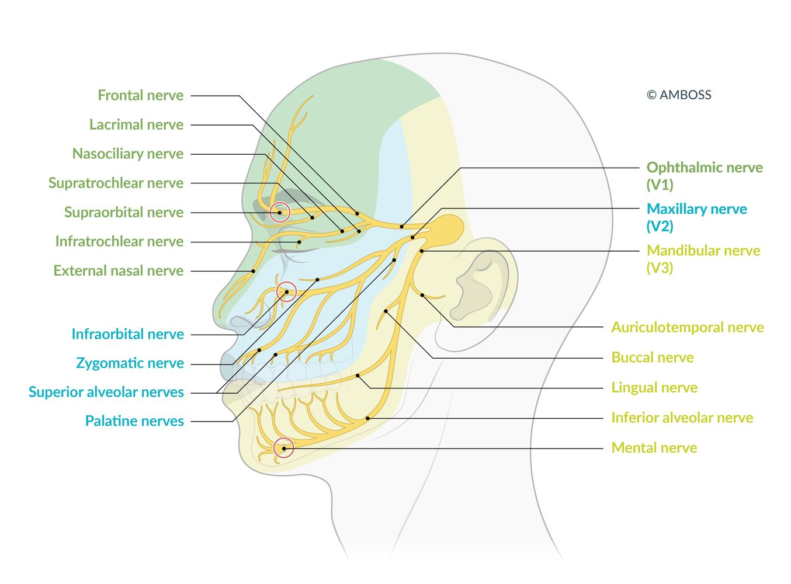

Trigeminal nerve branches and areas of sensory innervation

#### Upper extremity

|  Common <u>nerve blocks</u> of the upper extremities [[1]](https://coursology-qbank.com/amboss/article/3wYSir)  |  |  |
| --- | --- | --- |
| Type | Targeted nerves or plexus | Clinical applications |
|  Brachial plexus block    |   * Interscalene plexus  * Supraclavicular plexus  * Infraclavicular plexus  * Axillary plexus    |   * <u>Shoulder reductions</u> and <u>surgery</u>  * Arm, forearm, and hand <u>surgery</u>    |
| <u>Elbow</u> or wrist block |   * <u>Median nerve</u>  * <u>Radial nerve</u>  * <u>Ulnar nerve</u>    |  * Hand <u>surgery</u>   |
|  Digital block See also “Lower extremity.” |  * Digital nerve   |   * Finger <u>lacerations</u>  * Finger reductions  * <u>Nail bed injuries</u>  * Drainage of <u>digital infections</u> (e.g., <u>paronychia</u>, <u>felon</u>)    |

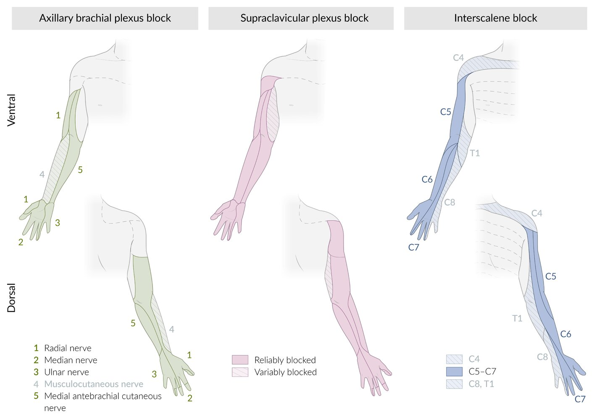

Upper extremity peripheral nerve blocks

Median nerve

Radial nerve

Ulnar nerve

#### Lower extremity

|  Common <u>nerve blocks</u> of the lower extremities   [[1]](https://coursology-qbank.com/amboss/article/3wYSir)  |  |  |
| --- | --- | --- |
| Type | Targeted nerves | Clinical applications |
|  Femoral block (three-in-one block)    |   * <u>Femoral nerve</u>  * <u>Obturator nerve</u>  * <u>Lateral femoral cutaneous nerve</u>    |   * <u>Hip fractures</u> and <u>surgery</u>  * Knee <u>surgery</u>    |
| Fascia iliaca block |   * <u>Femoral nerve</u>  * <u>Lateral femoral cutaneous nerve</u>    |  |
|  Sciatic block    |  * <u>Sciatic nerve</u>   |   * Foot <u>surgery</u>  * Ankle <u>surgery</u>    |
| Ankle block |   * <u>Posterior</u> <u>tibial nerve</u>  * <u>Sural nerve</u>  * <u>Superficial peroneal nerve</u>  * <u>Deep peroneal nerve</u>  * <u>Saphenous nerve</u>    |  * Foot <u>surgery</u>   |
| <u>Digital block</u> |  * <u>Digital nerve block</u>   |   * Toe <u>lacerations</u>  * Toe reductions  * <u>Nail bed injuries</u>  * Drainage of <u>digital infections</u> (e.g., <u>paronychia</u>, <u>felon</u>)    |

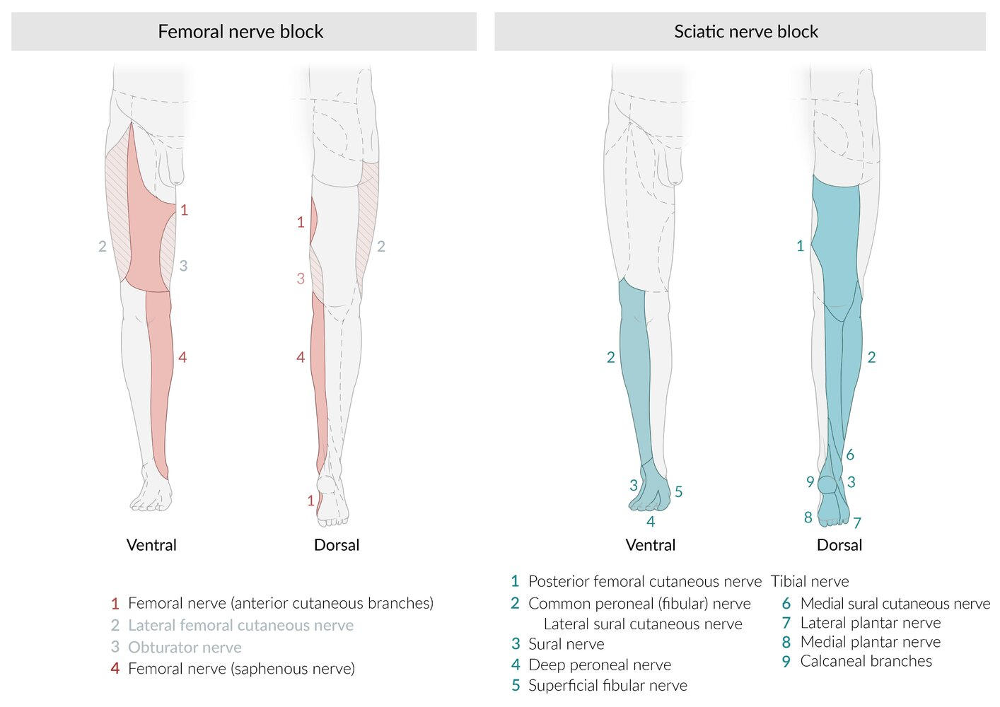

Lower extremity peripheral nerve blocks

Innervation areas of the peripheral nerves (leg, ventral view)

Innervation areas of the peripheral nerves (leg, dorsal view)

### Contraindications

See “<u>General contraindications to regional anesthesia</u>.”

### Procedure [[1]](https://coursology-qbank.com/amboss/article/3wYSir)

* Injection site: varies based on the target nerve

* Approach

* Single injection

* Continuous administration via a catheter

* Technique: varies based on the target nerve

* Place the patient in a position that allows easy access to the target nerves.

* Perform <u>skin preparation</u> and maintain a <u>sterile field</u>.

* Identify the targeted nerve using anatomical landmarks and/or:

* <u>Ultrasound</u>

* Nerve stimulation test

* Inject the <u>local anesthetic agent</u> around the target nerve.

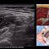

Ultrasound Guided Axillary Brachial Plexus Block NYSORA Regional Anesthesia

NYSORA Regional Anesthesia Interscalene Block

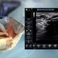

Ultrasound-Guided Continuous Interscalene Brachial Plexus Block - Regional Anesthesia

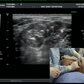

Interscalene Block (ultrasound guided - out of plane)

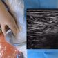

Ultrasound-Guided Femoral Nerve Block - Regional anesthesia Crash course with Dr. Hadzic

### Complications

See “<u>Complications of regional anesthesia</u>.”

> [!TIP]
> <u>Peripheral nerve blocks</u> do not carry the risks associated with <u>general anesthesia</u> (e.g., respiratory <u>depression</u>, <u>aspiration</u>) and <u>neuraxial anesthesia</u> (e.g., <u>CSF leak</u> syndrome, <u>urinary retention</u>). [[1]](https://coursology-qbank.com/amboss/article/3wYSir)

> [!WARNING]
> Avoid discharging patients after major <u>nerve blocks</u> until sensation and function have returned to baseline levels to reduce the risk of secondary injury. [[1]](https://coursology-qbank.com/amboss/article/3wYSir)

> [!WARNING]
> Monitor for delayed-onset LAST, especially if high doses of <u>local anesthetic agents</u> were used.

---

## Epidural anesthesia

### Definition [[4]](https://coursology-qbank.com/amboss/article/9C1N8Q0)

* <u>Local anesthetics</u> with or without <u>opioids</u> and <u>alpha-adrenergic agonists</u> are injected into the <u>epidural space</u> and act on the <u>spinal nerve</u> roots.

* <u>Epidural anesthesia</u> blocks several <u>nerve roots</u> around the site of injection and barely affects the function of the <u>nerve roots</u> above and below (segmental anesthesia).

### Indications [[4]](https://coursology-qbank.com/amboss/article/9C1N8Q0)

* Used for a variety of surgeries of the lower body (e.g., <u>cesarean delivery</u>, <u>hernia</u> repair, <u>appendectomy</u>, <u>prostate</u> and <u>bladder</u> surgeries, knee <u>surgery</u>)

* During <u>labor</u>

* Perioperatively

* <u>Chronic pain</u> management (e.g., <u>spinal stenosis</u>, <u>disk herniation</u>)

### Contraindications [[4]](https://coursology-qbank.com/amboss/article/9C1N8Q0)

See also “<u>General contraindications to regional anesthesia</u>.”

* Absolute

* Uncorrected <u>hypovolemia</u>

* <u>Increased intracranial pressure</u>

* Infection at the puncture site

* Relative

* <u>Coagulopathy</u>

* Spinal deformities

* <u>Sepsis</u>, systemic <u>bacteremia</u>, amniotic infection syndrome

* Neurological deficits caused by, e.g., disk prolapse, <u>paraplegic</u> syndrome, and <u>multiple sclerosis</u>

### Procedure [[4]](https://coursology-qbank.com/amboss/article/9C1N8Q0)

* Injection site

* May be performed at any <u>vertebral</u> level (cervical, thoracic and <u>lumbar spine</u>)

* Needle inserted into the <u>epidural space</u> between the <u>ligamentum flavum</u> and <u>dura mater</u>

* Approaches to inject the <u>local anesthetic</u>
1. * Catheter placement, which has the advantage of repeated/continuous administration of <u>anesthetic drugs</u> (most commonly performed)
2. * Single-shot technique

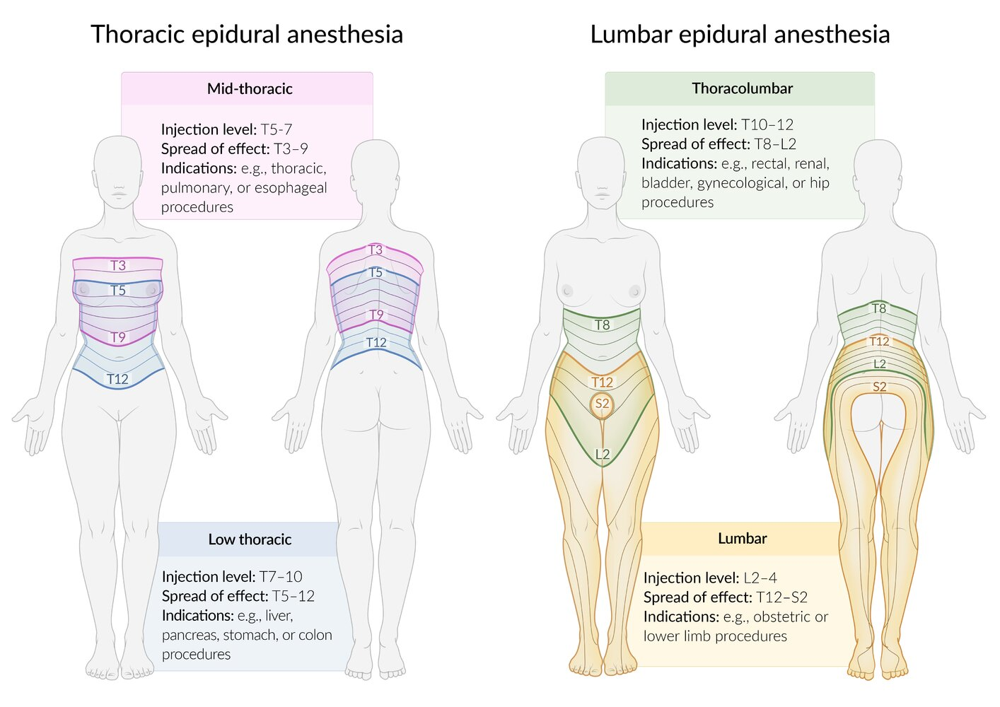

Spread of effect of epidural anesthesia

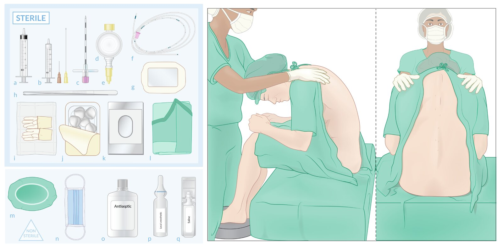

Epidural anesthesia (1/2): materials and patient positioning

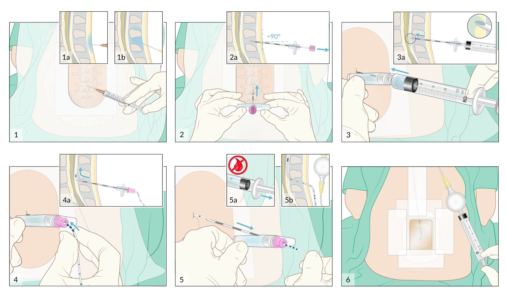

Epidural anesthesia (2/2): procedure

### Complications

See “<u>Complications of regional anesthesia</u>” and “<u>Complications of neuraxial anesthesia</u>.”

---

## Spinal anesthesia

### Definition

* <u>Local anesthetics</u> with or without <u>opioids</u> and <u>alpha-adrenergic agonists</u> are injected into the <u>cerebrospinal fluid</u> (<u>CSF</u>) in the <u>lumbar spine</u> and act directly on the spinal cord

* Combined spinal and epidural anesthesia (CSE)

* Combines the advantages of <u>spinal anesthesia</u> (rapid action, motoric block) with the advantages of <u>epidural anesthesia</u> (favorable post-operative <u>pain management</u> via an <u>epidural catheter</u>)

* Plays a major role in obstetrics and orthopedics.

### Indications

Used for a variety of lower extremity, lower abdominal, <u>pelvic</u>, and perineal procedures (e.g., <u>cesarean delivery</u>, hip and <u>knee replacement</u>), e.g:

* <u>Cesarean delivery</u>: T4–6 (mamillary line)

* <u>Pelvic</u>, urethral, and renal <u>pelvic</u> <u>surgery</u>: T6–8 (<u>xiphoid</u>)

* Transurethral <u>surgery</u> including stretching of the <u>bladder</u>, vaginal <u>birth</u>, hip <u>surgery</u>: T10 (<u>navel</u>)

* Transurethral <u>surgery</u> without stretching of the <u>bladder</u>: L1 (<u>inguinal ligament</u>)

* Knee and foot <u>surgery</u>: L2/3

* Perineal <u>surgery</u>: <u>S2</u>–5

### Contraindications

See “Contraindications” in “<u>Epidural anesthesia</u>.”

### Procedure

* Injection site

* Injection usually performed below L2 to avoid damage to the spinal cord

* Needle inserted into <u>subarachnoid space</u> between the arachnoid and <u>pia mater</u>

* Approach: almost always single-shot technique

Anatomical structures in lumbar puncture, spinal anesthesia, and epidural anesthesia

Transverse section of the lumbar spine

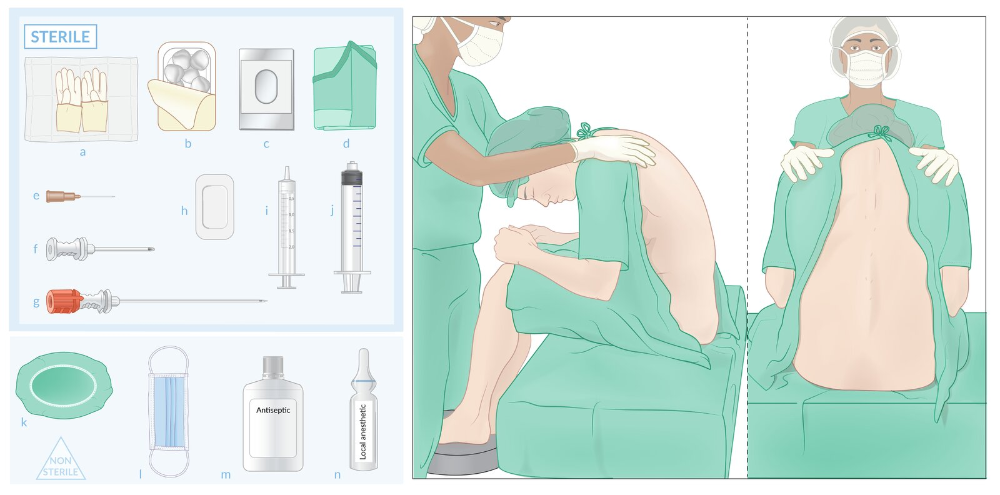

Spinal anesthesia (1/2): materials and patient positioning

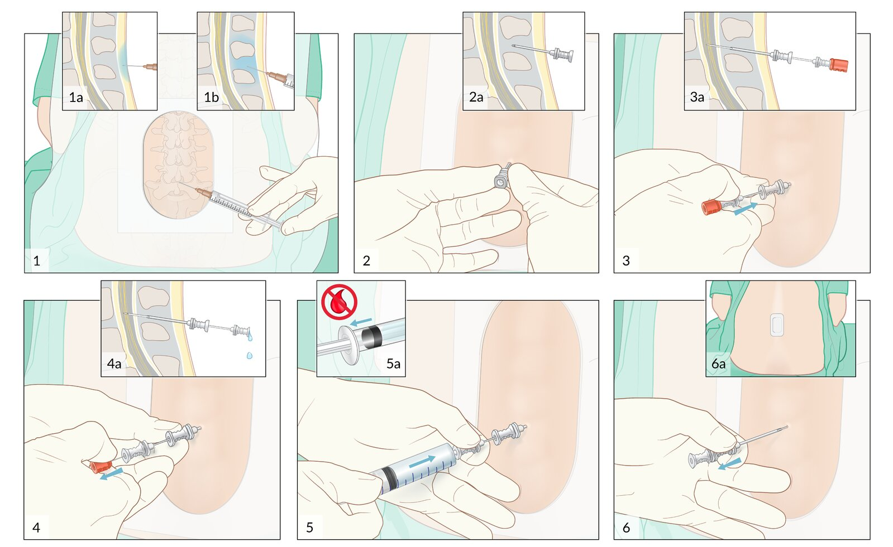

Spinal anesthesia (2/2): procedure

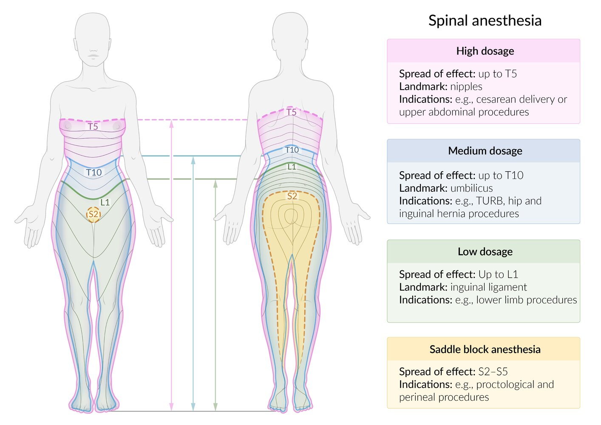

Spread of effect of spinal anesthesia

### Complications

See “<u>Complications of regional anesthesia</u>” and “<u>Complications of neuraxial anesthesia</u>.”

---

## Complications

See also “<u>Adverse effects of local anesthetic agents</u>.”

### Complications of regional anesthesia [[1]](https://coursology-qbank.com/amboss/article/3wYSir)

* Nerve injury

* <u>Local anesthetic systemic toxicity</u>

* <u>Hematoma</u>

* Infection

* Secondary injury

### Complications of neuraxial anesthesia [[5]](https://coursology-qbank.com/amboss/article/Yx0nER)[[6]](https://coursology-qbank.com/amboss/article/Xx09ER)[[7]](https://coursology-qbank.com/amboss/article/Xx19EQ0)

* <u>CSF leak</u> syndrome

* <u>Spinal epidural hematoma</u>;   and <u>spinal epidural abscess</u>

* <u>Meningitis</u>

* <u>Hypotension</u>

* Pathophysiology: <u>sympathetic</u> blockade causes <u>vasodilation</u> and decreases <u>venous return</u> → reduced <u>cardiac output</u>

* Clinical features: <u>hypotension</u>, <u>dizziness</u>, <u>lightheadedness</u>, and <u>nausea</u> shortly after administering <u>anesthetic</u>

* Diagnostics: <u>clinical diagnosis</u>

* Treatment: <u>IV fluid resuscitation</u> + small doses of <u>epinephrine</u>

* <u>Sympathetic</u> block → peripheral <u>vasodilation</u>, <u>bradycardia</u>, and <u>hypotension</u> (Bezold-Jarisch reflex)  → relative <u>hypovolemia</u>

* <u>Postoperative urinary retention</u>

* <u>Back pain</u>

* <u>Anterior spinal artery syndrome</u>

* <u>Conus medullaris syndrome</u>

#### Total spinal anesthesia [[8]](https://coursology-qbank.com/amboss/article/Yx1nEQ0)

* Definition: complete spinal space affected by <u>local anesthetic</u> drug

* Pathophysiology: drug overdose during <u>spinal block</u> or accidental <u>spinal anesthesia</u> during epidural block (intrathecal injection) → excessive <u>cranial</u> spread of the <u>local anesthetic</u> drug  → inhibition of the intercostal respiratory muscles and <u>sympathetic</u> block → <u>bradycardia</u> and <u>hypotension</u> → reduced <u>perfusion</u> of the <u>brainstem</u> → total <u>spinal anesthesia</u> → circulatory and <u>respiratory arrest</u>

* Clinical features

* <u>Hypotension</u> and cardiac decompensation

* <u>Apnea</u>

* <u>Loss of consciousness</u>

* <u>Mydriasis</u> (<u>dilated pupils</u>), <u>fixed pupils</u>

* Prophylaxis: correct catheter placement 

* Negative <u>aspiration</u> test: <u>Aspiration</u> of blood indicates a perforated blood vessel or <u>intravascular</u> placement of the catheter. <u>Aspiration</u> of <u>CSF</u> may be caused by catheter insertion into the intrathecal space.

* Intrathecal test dose injection : Numb legs point to a misplaced catheter.

* Therapy

* Immediate <u>intubation</u> unless already performed

* Stabilization of BP via <u>fluid resuscitation</u> and <u>catecholamines</u>

We list the most important complications. The selection is not exhaustive.

---