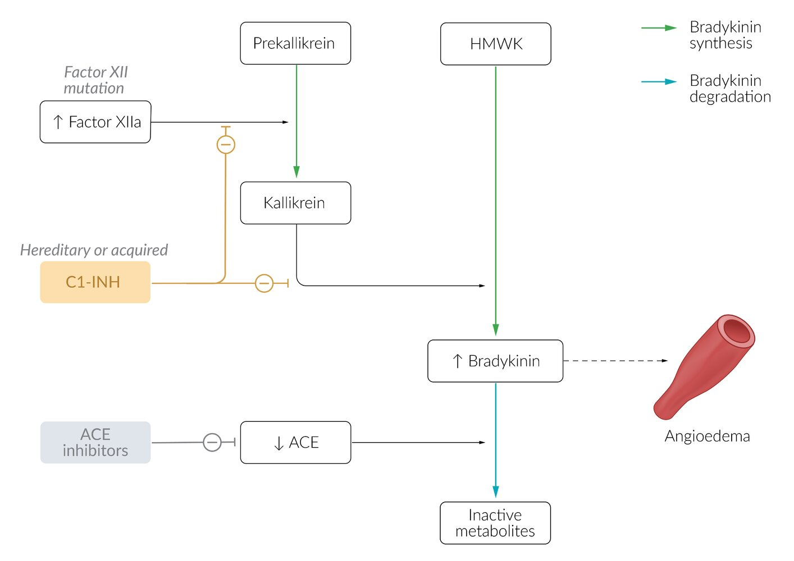
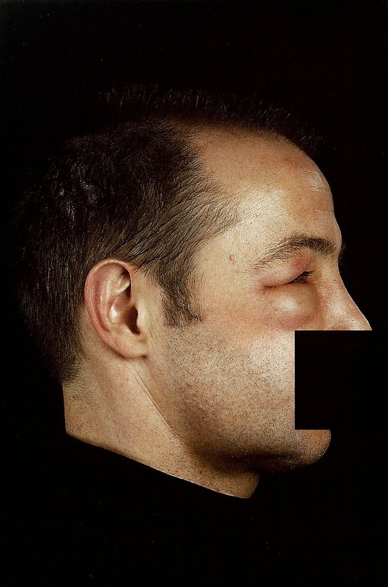
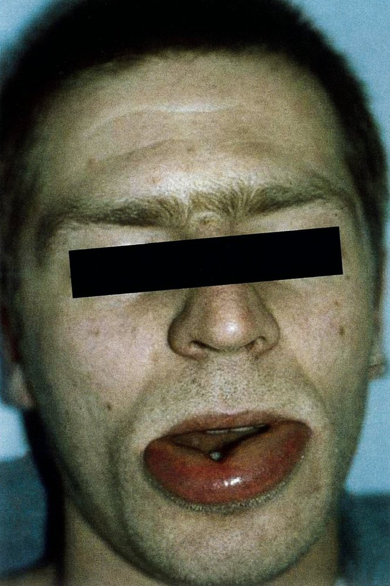
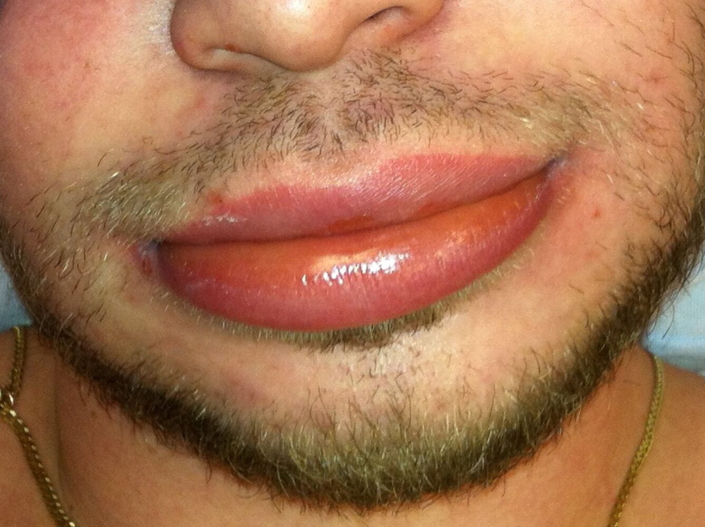
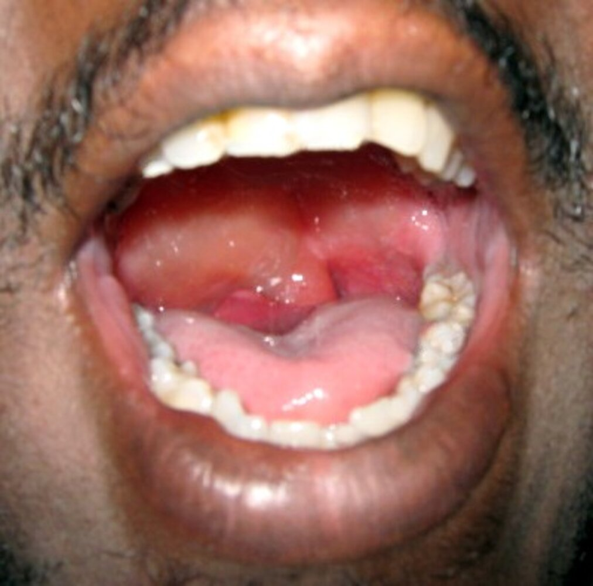
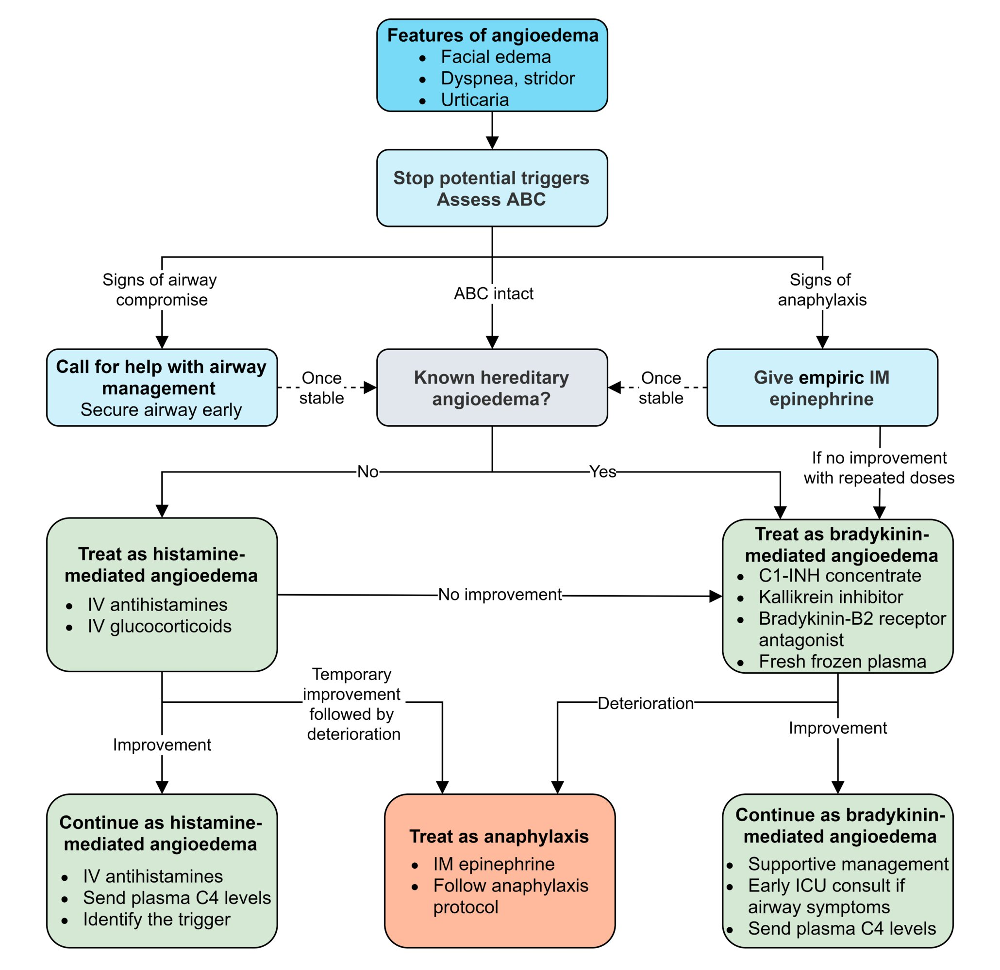

# Angioedema

*Categories: Clinical knowledge > Dermatology > Allergic and immune-mediated disorders > Angioedema*

[Original Article Link](https://coursology-qbank.com/amboss/article/2k0TMT)

---

## Summary

Angioedema is a <u>self-limited</u>, localized swelling of the <u>dermis</u>, subcutaneous tissues, and/or <u>submucosal</u> tissues caused by fluid leakage into the <u>interstitial</u> tissue. It is mediated by vasoactive substances and can be classified as <u>histamine</u>-mediated (often secondary to <u>allergic reactions</u> and <u>NSAIDs</u>), <u>bradykinin</u>-mediated (due to <u>ACE inhibitor</u> use or enzyme deficiencies), or unknown (<u>idiopathic</u>). Patients usually present with swelling of the eyelids, <u>lips</u>, and <u>tongue</u>. However, life-threatening laryngeal <u>edema</u> may occur, which requires immediate <u>airway</u> protection. Treatment generally consists of aggressive <u>supportive care</u> and avoidance of triggers, if applicable. In acute cases, <u>histamine</u>-mediated angioedema is treated with <u>systemic glucocorticoids</u>, <u>antihistamines</u>, and, if necessary, <u>epinephrine</u> for <u>anaphylaxis</u>. <u>Bradykinin</u>-mediated angioedema is treated with <u>C1 inhibitor</u> (<u>C1-INH</u>) concentrate, <u>bradykinin</u>-B2-<u>receptor</u> <u>antagonists</u>, or <u>kallikrein</u> inhibitors.

<u>Urticaria</u> is defined as the presence of <u>hives</u> with or without angioedema. See “<u>Urticaria</u>” for additional information.

---

## Classification

### <u>Histamine-mediated angioedema</u> (<u>mast cell-mediated angioedema</u>) [[1]](https://coursology-qbank.com/amboss/article/FgWgCk0)[[2]](https://coursology-qbank.com/amboss/article/quYCHI)

* Direct <u>mast cell</u> activation

* Non-<u>IgE</u>-mediated

* Possible triggers: <u>NSAIDs</u> (most commonly <u>aspirin</u>) , <u>opiates</u>, radiocontrast media

* <u>Allergic reactions</u>

* <u>IgE</u>-mediated

* Possible triggers: food, <u>insect bites</u>/stings, <u>antibiotics</u>, latex, <u>NSAIDs</u> (less commonly), other <u>allergens</u>, physically-induced

* <u>Family history</u> of <u>atopy</u>

### <u>Bradykinin-mediated angioedema</u>  [[2]](https://coursology-qbank.com/amboss/article/quYCHI)[[6]](https://coursology-qbank.com/amboss/article/8gWOCk0)

* Hereditary angioedema (inherited <u>C1 inhibitor deficiency</u> )

* <u>Autosomal-dominant inheritance</u>

* Clinical manifestations in childhood or <u>adolescence</u>

* Possible triggers: <u>estrogen</u> fluctuation (e.g., <u>OCPs</u>, <u>hormone</u> replacement, <u>menstruation</u>, <u>ovulation</u>, and <u>pregnancy</u>), infection (e.g., <u>H. pylori</u>), mental <u>stress</u>/fatigue, physical exertion, trauma, surgical and dental procedures, drugs (e.g., <u>ACE inhibitors</u>), and weather changes [[3]](https://coursology-qbank.com/amboss/article/IuYYsI)[[4]](https://coursology-qbank.com/amboss/article/ruYfsI)

* Acquired angioedema (acquired <u>C1 inhibitor deficiency</u>)

* Presents in advanced or middle age (usually in or after the fourth decade of life)

* Often associated with lymphoproliferative diseases and <u>B-cell</u> malignancies

* <u>ACE inhibitor</u>-induced (rarely <u>ARB</u>-induced): impaired <u>bradykinin</u> breakdown

### Angioedema of unknown cause [[2]](https://coursology-qbank.com/amboss/article/quYCHI)[[5]](https://coursology-qbank.com/amboss/article/JuYsHI)

* Idiopathic angioedema 

* Recurrent episodes without known cause

* Possible triggers: cold, heat, <u>stress</u>, and exercise

* More commonly follows a histaminergic pattern

* Infections

* More common in children

* Possible triggers: <u>common cold</u>, <u>streptococcal pharyngitis</u>, <u>urinary tract infections</u>

* Drug-induced: <u>calcium channel blockers</u>, <u>fibrinolytics</u>, <u>immunosuppressive agents</u> (e.g., <u>tacrolimus</u>)

Bradykinin-mediated angioedema

---

## Clinical features

### Common symptoms

* Facial <u>edema</u> (mouth, eyelids, <u>tongue</u>)

* Laryngeal involvement: <u>dyspnea</u> and <u>inspiratory stridor</u>; potentially life-threatening

* Possible swelling of extremities and urogenital area (e.g., hands, feet, <u>scrotum</u>)

### <u>Histamine-mediated angioedema</u>

* Often associated with <u>hives</u> and <u>pruritus</u>

* Other associated with clinical findings of <u>allergic reactions</u> (see “<u>type 1 hypersensitivity reaction</u>”;  and “<u>Urticaria</u>”)

* Onset within 30 minutes to 2 hours of exposure and resolution over hours to days

### <u>Bradykinin-mediated angioedema</u>

* <u>Family history</u> often present (<u>hereditary angioedema</u>)

* Abdominal symptoms : colicky abdominal <u>pain</u>, <u>nausea</u>/<u>vomiting</u>, <u>diarrhea</u>

* Angioedema of the extremities or trunk

* Not associated with <u>hives</u> or <u>pruritus</u>

Hereditary angioedema

Angioedema

Angioedema

Angioedema

References:[[7]](https://coursology-qbank.com/amboss/article/pXaL_Q)

---

## Diagnosis

* Initial evaluation

* The diagnosis is mainly based on history and clinical findings.

* <u>Flexible fiberoptic laryngoscopy</u> should be performed if there is no clear obstruction but clinical suspicion of angioedema is high.  [[2]](https://coursology-qbank.com/amboss/article/quYCHI)

* Further evaluation: indicated for follow-up or if the etiology is unclear (e.g., persistent or recurrent angioedema, isolated angioedema without <u>hives</u>) [[2]](https://coursology-qbank.com/amboss/article/quYCHI)[[6]](https://coursology-qbank.com/amboss/article/8gWOCk0)[[8]](https://coursology-qbank.com/amboss/article/GlWByl0)

* <u>Laboratory studies</u> (to differentiate between angioedema classifcations)

* Serum <u>mast cell tryptase</u>: increased in <u>histamine-mediated angioedema</u>

* Evaluation of <u>C1-INH</u> deficiency in <u>bradykinin-mediated angioedema</u> (see table below)

* Imaging: not routinely recommended

* Neck <u>x-ray</u> or CT: may be used to rule out conditions that mimic angioedema, e.g., <u>retropharyngeal abscess</u>

* <u>Ultrasound</u> or abdominal CT: may show bowel wall thickening

|  Laboratory findings in bradykinin-mediated angioedema [[6]](https://coursology-qbank.com/amboss/article/8gWOCk0)  |  |  |  |  |  |
| --- | --- | --- | --- | --- | --- |
|  | <u>Hereditary angioedema</u> |  |  | <u>Acquired angioedema</u> |  |
| Type I | Type II | Type III | <u>ACE-inhibitor</u> induced | <u>C1-INH</u> deficiency |  |
| <u>C1-INH</u> level | ↓ | Normal | Normal | Normal | ↓ |
| <u>C1-INH</u> function | ↓ | ↓ | Normal | Normal | ↓ |
|  C4 level  | ↓ During acute attacks | ↓ During acute attacks | Normal | Normal | ↓ |
|  <u>C1q</u> level  | Normal | Normal | Normal | Normal | ↓ |

---

## Management

### Approach

* Emergency management

* Treat <u>anaphylaxis</u>, if present.

* <u>Airway management</u>

* Stop any potential triggers.

* Once the patient has been stabilized, identify and treat the cause of angioedema

* <u>Histamine-mediated angioedema treatment</u>

* <u>Bradykinin-mediated angioedema treatment</u>

Management of angioedema

### Emergency management [[2]](https://coursology-qbank.com/amboss/article/quYCHI)[[5]](https://coursology-qbank.com/amboss/article/JuYsHI)[[9]](https://coursology-qbank.com/amboss/article/UcYbbL)[[10]](https://coursology-qbank.com/amboss/article/DlW1_l0)

* Evaluate for <u>anaphylaxis</u>: See <u>anaphylaxis diagnostic criteria</u>.
* If there is concern for <u>anaphylaxis</u>:

* Give <u>IM epinephrine</u> DOSAGE

* Start aggressive <u>supportive care</u> (e.g., <u>IV fluids</u>, <u>supplemental oxygen</u>): See <u>treatment of anaphylaxis</u> for the full algorithm.

* <u>Airway management</u>
* If <u>airway</u> compromise is present:

* See <u>airway management and ventilation in anaphylaxis</u>.

* Call anesthesia/otolaryngology for help.

* Prepare for <u>difficult airway</u> with rescue devices and set up for <u>surgical airway</u>.

* <u>Awake fiberoptic intubation</u> is preferred; <u>RSI</u> with <u>paralytics</u> should be avoided if possible.

* A <u>supraglottic airway</u> (e.g., <u>laryngeal mask</u>) is not appropriate.

* Only attempt unassisted <u>intubation</u> if the risk of <u>death</u> is imminent and there is no expert available.

* Stop any potential triggers: Remove potential exposures or offending medications (e.g., <u>ACE inhibitors</u>).

> [!TIP]
> If <u>airway</u> compromise is suspected (<u>stridor</u>, <u>wheezing</u>, diminished air movement) or the patient is in <u>shock</u>, administer <u>IM epinephrine</u> immediately, start oxygen and <u>IV fluids</u>, and consider <u>intubation</u> to protect the <u>airway</u>. Once acute therapy has been initiated, the type and cause of angioedema should be determined.

> [!WARNING]
> <u>Intubation</u> is very risky in patients with angioedema and should only be performed by an expert. If there is no time for help, then preparation for the procedure must also include rescue devices and <u>surgical airway</u> equipment.

### Case-based specific treatment [[2]](https://coursology-qbank.com/amboss/article/quYCHI)[[5]](https://coursology-qbank.com/amboss/article/JuYsHI)

* <u>ABCs</u> intact and no <u>airway</u> compromise: Proceed with <u>histamine-mediated angioedema treatment</u>.

* Poor response to repeated <u>IM epinephrine</u> administration: Consider <u>bradykinin-mediated angioedema treatment</u>.

#### Treatment of histamine-mediated angioedema and treatment of idiopathic angioedema

* Standard therapy

* IV <u>antihistamines</u>: e.g., <u>diphenhydramine</u> DOSAGE

* IV <u>glucocorticoids</u>: e.g., <u>methylprednisolone</u> DOSAGE

* Positive response: Continue standard treatment.

* Poor response: Consider <u>bradykinin-mediated angioedema treatment</u>.

* <u>Idiopathic angioedema</u> typically responds well to standard <u>anaphylaxis treatment</u>

* If the initial response to standard therapy is followed by progression to <u>anaphylaxis</u> : see <u>treatment of anaphylaxis</u> and <u>acute management checklist for anaphylaxis</u>.

#### Treatment of bradykinin-mediated angioedema and treatment of hereditary angioedema [[8]](https://coursology-qbank.com/amboss/article/GlWByl0)[[10]](https://coursology-qbank.com/amboss/article/DlW1_l0)

* Administer one of the following <u>targeted therapies</u>:

* Purified <u>C1-INH</u> concentrate (protein replacement)

* Plasma-derived DOSAGE [[5]](https://coursology-qbank.com/amboss/article/JuYsHI)

* Recombinant DOSAGE

* <u>Kallikrein</u> inhibitor: ecallantide DOSAGE

* <u>Bradykinin</u>-B2 <u>receptor</u> <u>antagonist</u>: icatibant DOSAGE

* Second-line or suspected <u>ACE inhibitor</u>-induced etiology: <u>fresh frozen plasma</u> (<u>FFP</u>) 15 mg/kg IV once

* Angioedema associated with <u>tPA</u>: requires special treatment algorithm; See “<u>Complications of thrombolysis</u>.”

> [!WARNING]
> <u>Epinephrine</u>, <u>glucocorticoids</u>, and <u>antihistamines</u> are usually not effective in acute <u>hereditary angioedema</u> attacks! If these have been given empirically (e.g., for <u>suspected anaphylaxis</u> with <u>airway</u> compromise) and there is a poor response, then <u>targeted therapy</u> for <u>bradykinin-mediated angioedema</u> should be considered as the next step.

---