# Contact dermatitis

*Categories: Clinical knowledge > Dermatology > Allergic and immune-mediated disorders > Contact dermatitis*

[Original Article Link](https://coursology-qbank.com/amboss/article/Xs09th)

---

## Summary

Contact dermatitis encompasses two conditions: allergic contact dermatitis (<u>ACD</u>) and <u>irritant contact dermatitis</u> (<u>ICD</u>). Both conditions frequently coexist, as either condition may disrupt the <u>skin</u> barrier, increasing the risk of <u>allergen</u> sensitization and/or irritant <u>sensitivity</u>. Common <u>allergens</u> that cause <u>ACD</u> include metals, personal care products, plants, latex, preservatives, topical medications, and food and beverages. Common irritants that cause <u>ICD</u> include metals, strong acids or alkalis, soaps, solvents, topical medications, fabrics, and dust. <u>ICD</u> is primarily a <u>clinical diagnosis</u>; <u>ACD</u> requires <u>patch testing</u>. For both conditions, the mainstay of management is to avoid the offending agent and maintain the <u>skin</u> barrier with regular <u>emollient</u> use. Acute symptomatic relief (e.g., cool compresses) may improve comfort. Treatment for <u>ACD</u> also involves <u>topical corticosteroids</u> for localized disease and oral <u>steroids</u> for generalized disease.

Contact dermatitis - triggers and clinical presentation

---

## Overview

### Types of contact dermatitis

|  <u>Irritant vs. allergic contact dermatitis</u>[[2]](https://coursology-qbank.com/amboss/article/I6cYmW0)[[3]](https://coursology-qbank.com/amboss/article/5wWijn0)  |  |  |  |
| --- | --- | --- | --- |
|  |  | <u>Irritant contact dermatitis</u> | Allergic contact dermatitis |
| Type of reaction |  |   * Nonimmunologic reaction   * Irritant causes a direct cytotoxic effect on the <u>skin</u>.  * Inflammatory response is secondary to cutaneous damage, not to the causative agent.  * Does not require prior <u>allergic sensitization</u>    |   * <u>Type IV hypersensitivity reaction</u> [[4]](https://coursology-qbank.com/amboss/article/7wd44H0)  * Requires prior <u>allergic sensitization</u>    |
| Individuals at risk |  |   * Health care workers [[3]](https://coursology-qbank.com/amboss/article/5wWijn0)  * Individuals working in the cosmetics industry, hairdressers  * Metal workers    |  * Presensitized individuals   |
| Clinical features | Onset [[3]](https://coursology-qbank.com/amboss/article/5wWijn0)  |   * Acute <u>ICD</u>: minutes to hours after exposure  * Chronic <u>ICD</u> (more common): gradual onset    |  * Often within 12–96 hours of exposure  [[4]](https://coursology-qbank.com/amboss/article/7wd44H0) [[5]](https://coursology-qbank.com/amboss/article/HwdK4H0)[[6]](https://coursology-qbank.com/amboss/article/OpcIpW0)   |
| Characteristics |   * Distinct borders  * Acute lesions    * <u>Erythema</u>, <u>papules</u>, <u>vesicles</u>, and/or <u>bullae</u>  * <u>Pain</u>, burning, stinging (more common in <u>irritant contact dermatitis</u>) [[3]](https://coursology-qbank.com/amboss/article/5wWijn0)  * <u>Pruritus</u> (often intense in <u>ACD</u>)  * Chronic lesions: fissures, <u>lichenification</u>    |  |  |
| Distribution |  * Limited to the site of irritant exposure   |  * May extend beyond the site of <u>allergen</u> exposure   |  |
| Diagnosis |  |  * <u>Clinical diagnosis</u> of exclusion   |  * Positive <u>patch test</u> confirms diagnosis.   |

### Approach to suspected contact dermatitis

* Perform a thorough history and examination to evaluate for sources of irritant and/or <u>allergen</u> exposure, including: [[6]](https://coursology-qbank.com/amboss/article/OpcIpW0)

* Personal products

* Home and work environments

* In children: toys, sports gear, musical instruments, and caregiver personal care products [[4]](https://coursology-qbank.com/amboss/article/7wd44H0)

* Suspected <u>ACD</u> 

* Refer for <u>patch testing</u> to confirm diagnosis.

* Children who cannot undergo <u>patch testing</u>: Consider avoiding common <u>allergens</u>.

* Suspected <u>ICD</u>: Start empiric <u>management of ICD</u> (i.e., irritant avoidance).

* Diagnostic uncertainty or persistent lesions: Refer to a specialist (e.g., dermatologist, allergist) for further evaluation.

> [!TIP]
> <u>ACD</u> and <u>ICD</u> may be difficult to distinguish clinically and often co-exist. <u>Patch testing</u> is indicated if <u>ACD</u> is suspected.[[7]](https://coursology-qbank.com/amboss/article/_dd5sK0)

### Differential diagnosis of contact dermatitis[[2]](https://coursology-qbank.com/amboss/article/I6cYmW0)[[3]](https://coursology-qbank.com/amboss/article/5wWijn0)[[6]](https://coursology-qbank.com/amboss/article/OpcIpW0)

* Other types of dermatitis, e.g.:

* <u>Atopic dermatitis</u>

* <u>Seborrheic dermatitis</u>

* <u>Dyshidrotic eczema</u>

* <u>Nummular dermatitis</u>

* <u>Dermatitis herpetiformis</u>

* <u>Stasis dermatitis</u>

* Infections, e.g.:

* <u>Skin and soft tissue infections</u>

* <u>Scabies</u>

* <u>Tinea pedis</u>

* <u>Psoriasis</u>

* Phototoxicity and/or <u>sunburn</u>

* <u>Mycosis fungoides</u> (<u>cutaneous T-cell lymphoma</u>)

Atopic dermatitis

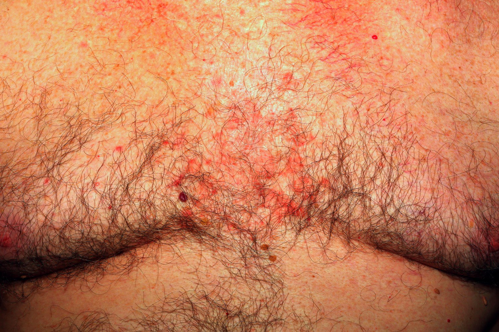

Seborrheic dermatitis

Dyshidrotic eczema

Plaque psoriasis

Interdigital skin lesions in scabies

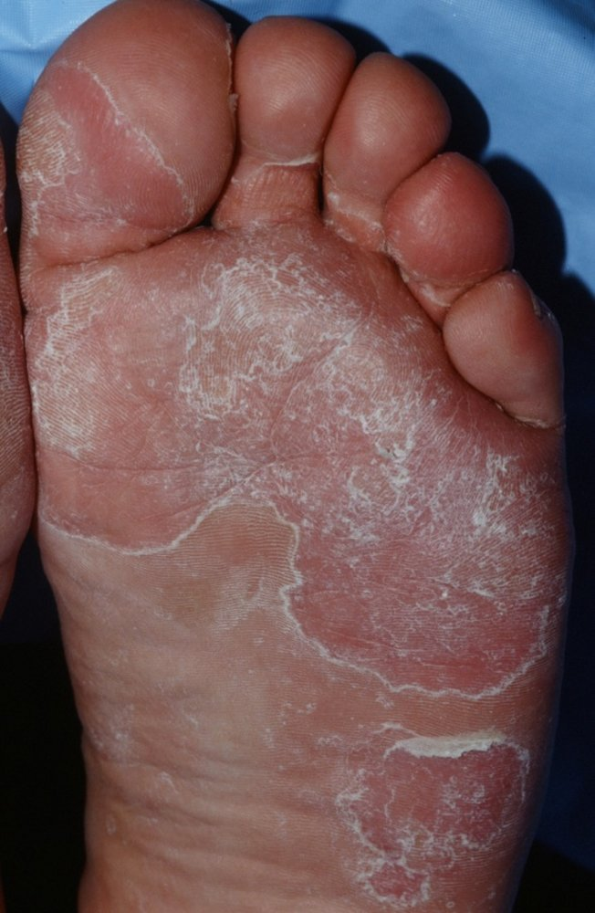

Tinea pedis (athlete's foot)

Dermatitis herpetiformis

Cutaneous T-cell lymphoma

---

## Allergic contact dermatitis

### <u>Epidemiology</u>

* Adults: 15–20% have a contact <u>allergy</u> to ≥ 1 <u>allergen</u>.  [[8]](https://coursology-qbank.com/amboss/article/r6cfmW0)[[9]](https://coursology-qbank.com/amboss/article/76c4mW0)

* Children: rare in the first few months of life; <u>prevalence</u> increases to that of adulthood by <u>adolescence</u>. [[4]](https://coursology-qbank.com/amboss/article/7wd44H0)[[6]](https://coursology-qbank.com/amboss/article/OpcIpW0)

* <u>♀</u> > <u>♂</u> [[9]](https://coursology-qbank.com/amboss/article/76c4mW0)

> [!TIP]
> <u>ACD</u> is one of the most common dermatological diagnoses, and its <u>prevalence</u> is increasing worldwide. [[8]](https://coursology-qbank.com/amboss/article/r6cfmW0)

### Etiology

#### Common <u>allergens</u> [[2]](https://coursology-qbank.com/amboss/article/I6cYmW0)[[6]](https://coursology-qbank.com/amboss/article/OpcIpW0)

* Metals: : <u>nickel</u> , cobalt, <u>chromium</u>  [[4]](https://coursology-qbank.com/amboss/article/7wd44H0)[[7]](https://coursology-qbank.com/amboss/article/_dd5sK0)

* Personal care products: perfumes, soaps, cosmetics, diapers, wipes

* Plants: poison ivy, <u>poison oak</u>, <u>poison sumac</u>

* Occupational: gloves , solvents, <u>detergents</u>

* Preservatives: e.g., thimerosal

* Topical medications: <u>hydrocortisone</u>, topical <u>antibiotics</u> (e.g., <u>neomycin</u>), <u>benzocaine</u>  [[2]](https://coursology-qbank.com/amboss/article/I6cYmW0)

#### <u>Risk factors</u> [[6]](https://coursology-qbank.com/amboss/article/OpcIpW0)[[8]](https://coursology-qbank.com/amboss/article/r6cfmW0)

* Congenital <u>risk factors</u>: certain genetic <u>polymorphisms</u>

* Acquired <u>risk factors</u>: other forms of dermatitis (e.g., <u>atopic dermatitis</u> ), <u>occupational exposures</u>

### Pathophysiology

<u>ACD</u> is a <u>type IV hypersensitivity reaction</u>.

* First contact with <u>allergen</u> → allergic sensitization

* Repeated contact with <u>allergen</u> → development of a <u>rash</u> typically after 12–48 hours

> [!TIP]
> Compared to type I–III <u>hypersensitivity reactions</u>, which are <u>antibody</u>-mediated, type IV reactions are mediated by <u>T cells</u>.

### Clinical features

* Characteristics of lesions [[2]](https://coursology-qbank.com/amboss/article/I6cYmW0)[[4]](https://coursology-qbank.com/amboss/article/7wd44H0)

* Acute

* Intensely pruritic <u>erythematous</u> <u>papules</u> and <u>plaques</u>

* <u>Vesicles</u> with serous oozing in more severe cases

* Distinct borders that may extend beyond the site of <u>allergen</u> exposure

* Chronic: fissures, <u>lichenification</u>, and <u>hyperpigmentation</u> [[4]](https://coursology-qbank.com/amboss/article/7wd44H0)

* Distribution

* Local (reflects areas and shapes of exposures); examples include:

* <u>Rash</u> where jewelry is worn: suggests <u>nickel</u> <u>allergy</u>

* <u>Rash</u> on face and eyelids: likely caused by cosmetics

* <u>Rash</u> in <u>axillae</u>: likely caused by fragrances or deodorant

* Pruritic <u>papulovesicular</u> <u>rash</u> with a linear pattern on extremities: likely caused by urushiol-producing plants like <u>poison ivy</u> in patients with a history of exposure (urushiol-induced contact dermatitis)

* <u>Ectopic</u> (lesions at a distance from initial exposure): due to inadvertent transfer of <u>allergen</u> by self or others [[6]](https://coursology-qbank.com/amboss/article/OpcIpW0)

* Systemic contact dermatitis [[6]](https://coursology-qbank.com/amboss/article/OpcIpW0)

* Can develop after systemic exposure (e.g., ingestion, intravenous) to <u>allergens</u> (e.g., metals or flavorings in foods, medications).

* Manifestations include generalized dermatitis, flexural and <u>intertriginous dermatitis</u>, and local dermatitis.

* In children, the <u>lips</u> and feet are commonly affected. [[4]](https://coursology-qbank.com/amboss/article/7wd44H0)

> [!TIP]
> Contact dermatitis due to <u>poison oak</u>, <u>poison ivy</u>, or <u>poison sumac</u> is the most likely cause in a patient presenting with <u>erythematous</u>, pruritic, and burning <u>skin</u> lesions in a linear pattern that appear 24 hours after a camping trip.

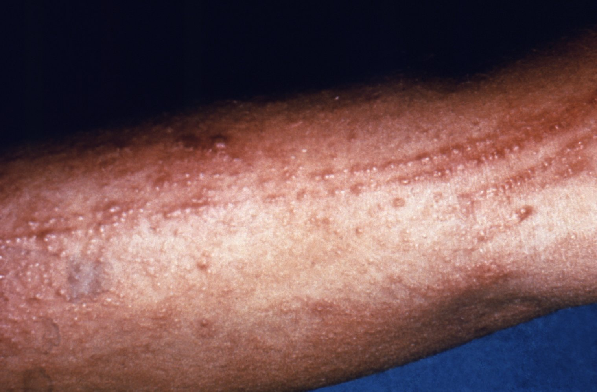

Urushiol-induced contact dermatitis

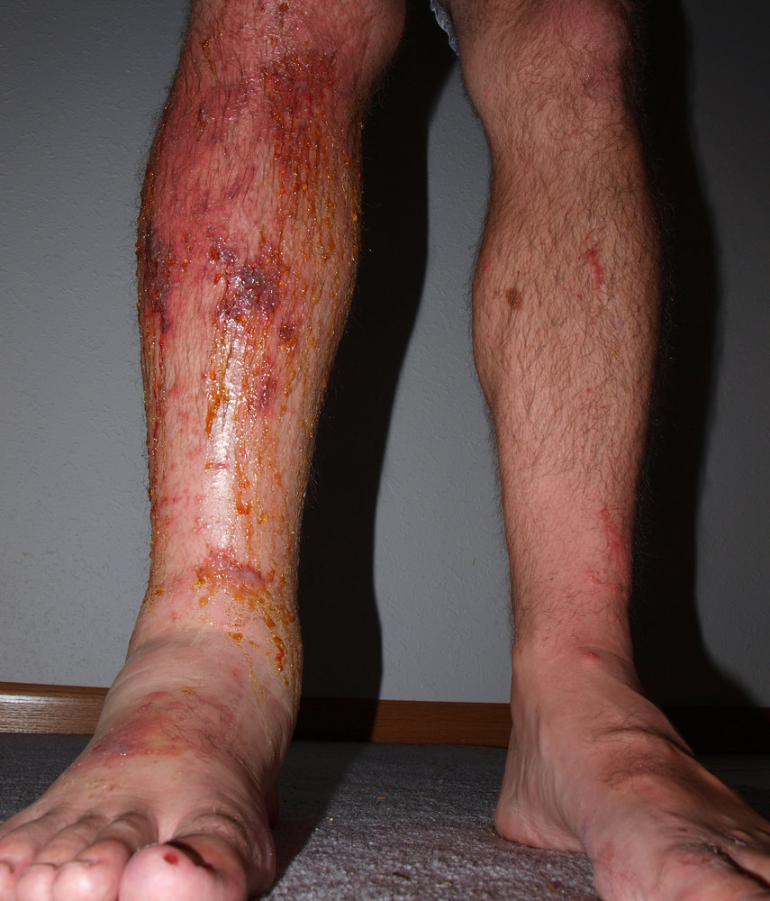

Urushiol-induced contact dermatitis

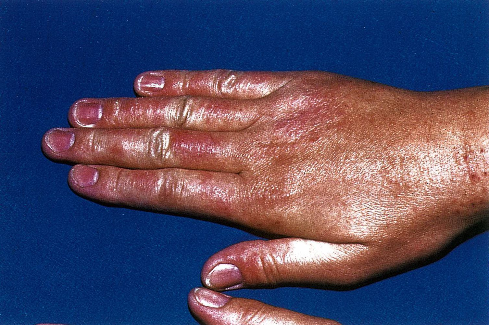

Eczema

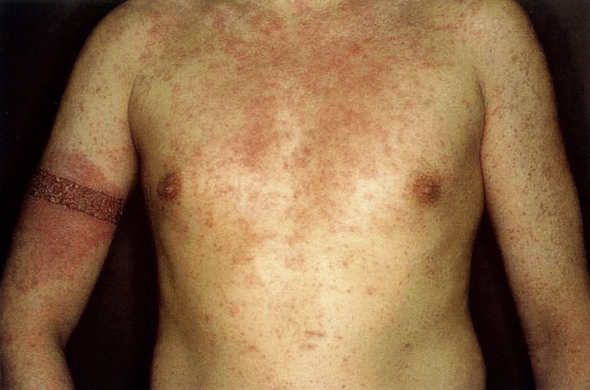

Allergic contact dermatitis

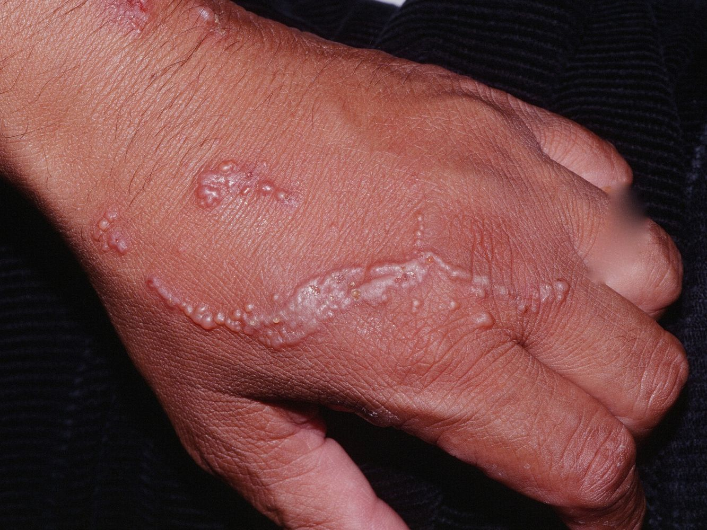

Allergic contact dermatitis

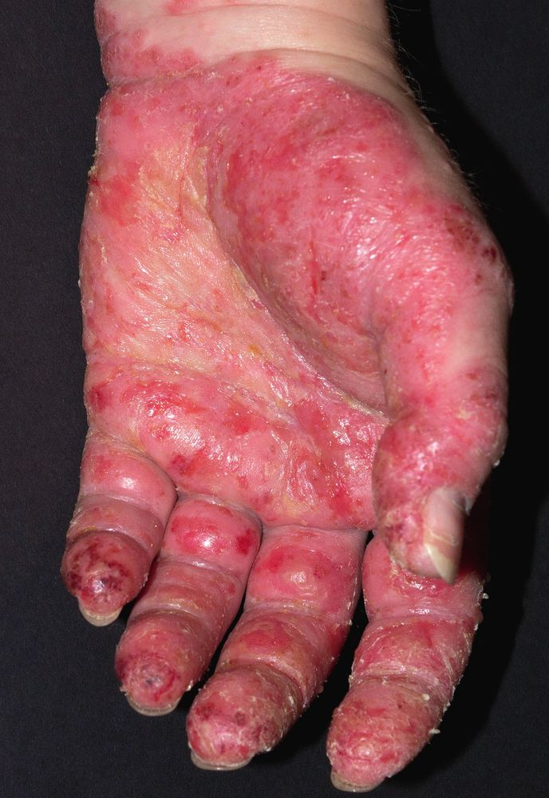

Allergic contact dermatitis

### Diagnosis [[2]](https://coursology-qbank.com/amboss/article/I6cYmW0)

* Suspect <u>ACD</u> in patients with pruritic lesions in well-demarcated areas of exposure.

* Review the patient's use of personal products as well as their home and work environment to determine the likely <u>allergen</u>.

* All patients require <u>patch testing</u> (<u>gold standard</u>) to confirm the diagnosis. [[6]](https://coursology-qbank.com/amboss/article/OpcIpW0)

#### Patch test[[6]](https://coursology-qbank.com/amboss/article/OpcIpW0)

* Indications 

* Suspected <u>ACD</u>

* Worsening of lesions or poor response to empiric <u>topical corticosteroids</u>  [[6]](https://coursology-qbank.com/amboss/article/OpcIpW0)

* Additional indications in children [[4]](https://coursology-qbank.com/amboss/article/7wd44H0)[[5]](https://coursology-qbank.com/amboss/article/HwdK4H0)

* New-onset <u>atopic dermatitis</u> in late childhood or <u>adolescence</u>

* Prior to initiation of systemic treatment

* Dermatitis involving the face, hands, feet, and/or perineal area

* Procedure

* A series of patches fixed with common <u>allergens</u> are applied directly to the <u>skin</u>.

* Results are commonly read at 48 hours.   [[6]](https://coursology-qbank.com/amboss/article/OpcIpW0)[[10]](https://coursology-qbank.com/amboss/article/ZqcZCW0)

* Interpretation: A positive reaction consists of <u>erythema</u>, <u>papules</u>, and, sometimes, <u>vesicles</u> at the site of the patch(es). [[11]](https://coursology-qbank.com/amboss/article/bIcHYd0)

> [!WARNING]
> Before performing a <u>patch test</u>, avoid or decrease the dosage of systemic <u>immunosuppressants</u> (e.g., <u>systemic corticosteroids</u>). [[6]](https://coursology-qbank.com/amboss/article/OpcIpW0)

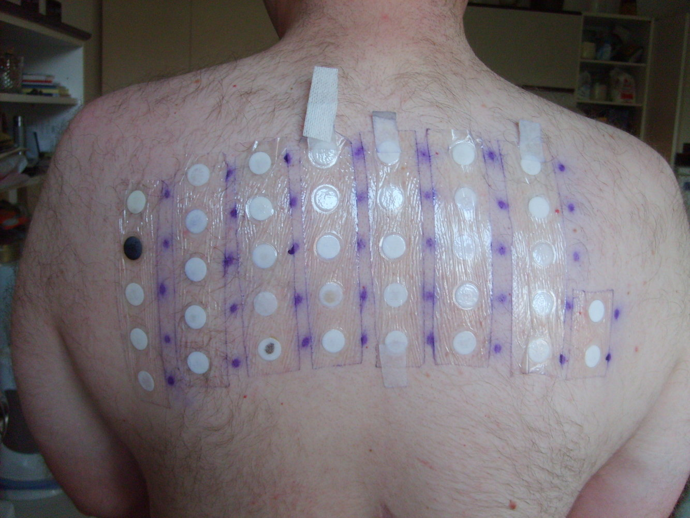

Patch test

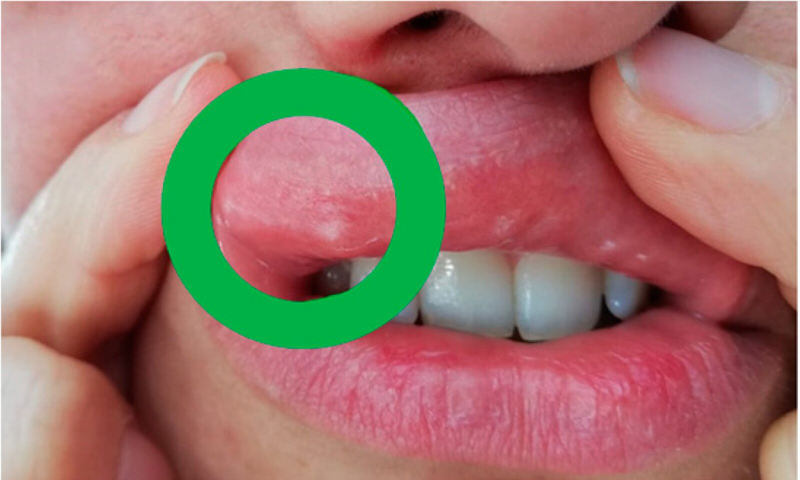

Nickel patch test

#### Additional diagnostic studies [[2]](https://coursology-qbank.com/amboss/article/I6cYmW0)

Consider in selected patients to exclude differential diagnoses of contact dermatitis.

* <u>Bacterial culture</u>: if there is weeping, crusting, <u>exudate</u>

* <u>KOH preparation</u>: if there is <u>erythema</u> and <u>scaling</u>

* <u>Dermoscopy</u>: if concern for <u>scabies</u>

* <u>Punch biopsy</u>: if the diagnosis remains unclear

### Management [[2]](https://coursology-qbank.com/amboss/article/I6cYmW0)[[6]](https://coursology-qbank.com/amboss/article/OpcIpW0)[[7]](https://coursology-qbank.com/amboss/article/_dd5sK0)

#### Approach

* The mainstay of management of ACD for all adults and children is avoiding exposure to <u>allergens</u>.

* In patients with <u>ACD</u> from plants (e.g., <u>poison ivy</u>), wash contaminated <u>skin</u> immediately after exposure. [[12]](https://coursology-qbank.com/amboss/article/gbVFGG0)

* Treat <u>skin</u> lesions with <u>corticosteroids</u>.

* Provide nonpharmacological symptomatic management, e.g.:

* Cool compresses

* <u>Calamine lotion</u>, <u>emollients</u>, colloidal oatmeal baths

* Wet dressings (e.g., for oozing, crusting lesions)

* Treat bacterial and fungal <u>superinfections</u> as needed; see also:

* "Treatment of <u>skin and soft tissue infections</u>"

* “<u>Impetigo</u>”

* "<u>Treatment of mucocutaneous candidiasis</u>”

* For severe or persistent lesions, refer to dermatology for consideration of additional treatment options.  [[7]](https://coursology-qbank.com/amboss/article/_dd5sK0)

> [!TIP]
> <u>Antihistamines</u>, although commonly used, are generally not effective for treating <u>pruritus</u> associated with <u>ACD</u>. [[2]](https://coursology-qbank.com/amboss/article/I6cYmW0)

> [!TIP]
> If contact dermatitis worsens despite treatment with topical therapies, consider if <u>ACD</u> has developed due to <u>allergic sensitization</u> to topical medication (e.g., <u>topical corticosteroids</u>, <u>neomycin</u>); <u>patch testing</u> is indicated. [[6]](https://coursology-qbank.com/amboss/article/OpcIpW0)

#### <u>Corticosteroid</u> therapy

* Adults 

* <u>Topical corticosteroids</u> are preferred for localized dermatitis. 

* Areas with thin <u>skin</u> (e.g., face, genitals, flexural surfaces): <u>low-potency topical corticosteroids</u> (e.g., <u>desonide</u>) DOSAGE [[2]](https://coursology-qbank.com/amboss/article/I6cYmW0)

* Other areas: <u>mid-potency topical corticosteroids</u> (e.g., <u>triamcinolone</u> DOSAGE) or <u>high-potency topical steroids</u> (e.g., <u>clobetasol</u> DOSAGE), depending on severity [[2]](https://coursology-qbank.com/amboss/article/I6cYmW0)

* Systemic <u>steroids</u>;  (e.g., <u>prednisone</u> DOSAGE) are often required for generalized dermatitis (e.g., affecting > 20% of the body surface area). [[2]](https://coursology-qbank.com/amboss/article/I6cYmW0)[[13]](https://coursology-qbank.com/amboss/article/h9dcMH0).   [[2]](https://coursology-qbank.com/amboss/article/I6cYmW0)[[6]](https://coursology-qbank.com/amboss/article/OpcIpW0)[[13]](https://coursology-qbank.com/amboss/article/h9dcMH0)

* Children [[6]](https://coursology-qbank.com/amboss/article/OpcIpW0)

* <u>Topical corticosteroids</u>, with <u>potency</u> based on the location and severity of disease [[14]](https://coursology-qbank.com/amboss/article/OaVIkG0)

* Use the lowest <u>potency</u> and shortest duration necessary to reduce the risk of adverse effects. [[15]](https://coursology-qbank.com/amboss/article/LnWwFN0)

* Avoid ointments.

* Systemic <u>steroids</u> may be necessary for generalized dermatitis and/or severe symptoms. [[14]](https://coursology-qbank.com/amboss/article/OaVIkG0)

> [!TIP]
> Avoid long-term use of <u>topical steroids</u> to prevent local <u>skin</u> <u>atrophy</u> and systemic adverse effects. [[6]](https://coursology-qbank.com/amboss/article/OpcIpW0)

---

## Irritant contact dermatitis

<u>ICD</u> is caused by the direct cytotoxic effect of a causal agent. It is either acute or, more commonly, chronic. [[3]](https://coursology-qbank.com/amboss/article/5wWijn0)[[7]](https://coursology-qbank.com/amboss/article/_dd5sK0)[[16]](https://coursology-qbank.com/amboss/article/Ecd8VK0)

### Etiology [[3]](https://coursology-qbank.com/amboss/article/5wWijn0)[[17]](https://coursology-qbank.com/amboss/article/qEWC9M0)

#### Common irritants

* Chemical irritants, e.g.:

* Heavy metals

* Strong acids and alkalis

* Water, soaps and <u>detergents</u>

* Solvents, synthetic oils

* Topical medications

* Physical irritants, e.g.:

* Friction

* Certain fabrics that prevent ventilation (e.g., synthetics) or are rough (e.g., wool)

* Dust (e.g., coal, rock, sawdust)

#### <u>Risk factors</u>

* Environmental factors, e.g.:

* Low <u>humidity</u>

* Frequent exposure to moisture (e.g., frequent handwashing or <u>hand disinfection</u>, food preparation) [[3]](https://coursology-qbank.com/amboss/article/5wWijn0)

* Extreme temperatures (e.g., <u>thermal burns</u>, <u>sunburn</u>, cold injury)

* History of <u>atopy</u>

### Clinical features [[3]](https://coursology-qbank.com/amboss/article/5wWijn0)

* <u>Skin</u> lesions limited to the area of irritant exposure are characteristic of contact dermatitis.

* The dorsum of the hands are most commonly affected.  [[3]](https://coursology-qbank.com/amboss/article/5wWijn0)[[17]](https://coursology-qbank.com/amboss/article/qEWC9M0)

* Additional manifestations in children include: [[3]](https://coursology-qbank.com/amboss/article/5wWijn0)[[6]](https://coursology-qbank.com/amboss/article/OpcIpW0)

* <u>Irritant diaper dermatitis</u>

* <u>Perioral dermatitis</u>, due to frequent licking or exposure of cheeks to certain foods

|  Clinical features of <u>ICD</u>[[2]](https://coursology-qbank.com/amboss/article/I6cYmW0)[[3]](https://coursology-qbank.com/amboss/article/5wWijn0)[[18]](https://coursology-qbank.com/amboss/article/lPWvUl0)  |  |  |
| --- | --- | --- |
|  | Acute <u>ICD</u> | Chronic <u>ICD</u> |
| Onset |  * Occurs within seconds to hours of exposure to a strong chemical irritant   |  * Gradual onset  [[3]](https://coursology-qbank.com/amboss/article/5wWijn0)   |
| Duration |  * Days to weeks   |  * Months to years   |
| Characteristic features |   * Immediate <u>pain</u>, stinging, or <u>pruritus</u>  * <u>Erythema</u>, <u>vesicles</u> or <u>blisters</u>, <u>edema</u>, <u>necrosis</u>  * Sharply demarcated borders corresponding to area of exposure    |   * Burning or stinging sensation, <u>pruritus</u>  * <u>Xerosis</u>, fissures, <u>hyperkeratosis</u>, <u>scaling</u>, and <u>lichenification</u>  * Poorly defined borders corresponding to area of exposure    |

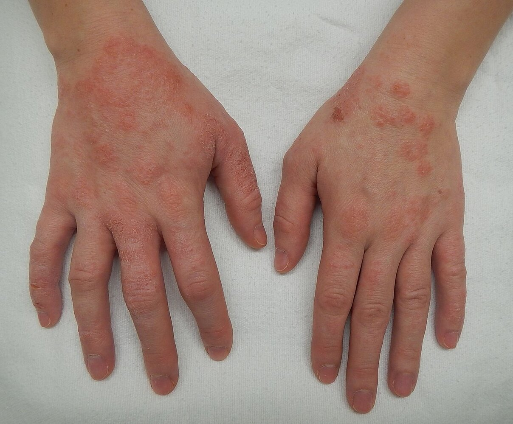

Dermatitis of the hands

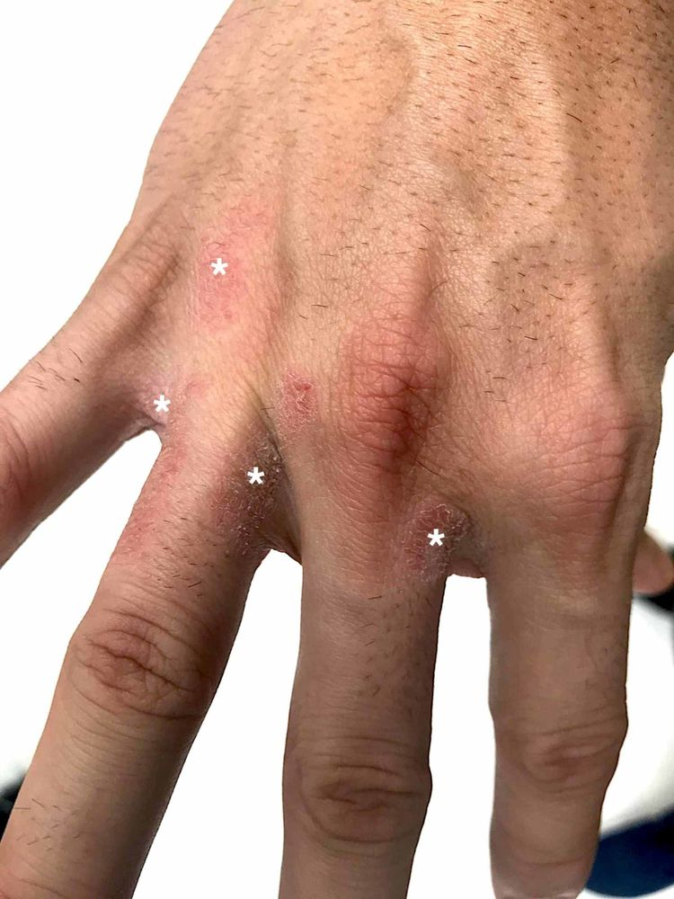

Irritant contact dermatitis

### Diagnosis [[2]](https://coursology-qbank.com/amboss/article/I6cYmW0)[[3]](https://coursology-qbank.com/amboss/article/5wWijn0)

* <u>ICD</u> is a diagnosis of exclusion. [[7]](https://coursology-qbank.com/amboss/article/_dd5sK0)

* A presumptive diagnosis of <u>ICD</u> can be made if symptoms improve by avoiding the irritant.

* History and examination may help differentiate <u>irritant vs. allergic contact dermatitis</u>.

* <u>ICD</u> usually resolves within 6 weeks of avoiding the causative agent. [[18]](https://coursology-qbank.com/amboss/article/lPWvUl0)

* Diagnostic uncertainty

* Assess for alternative diagnoses (see "Differential diagnoses of contact dermatitis").

* Refer to a specialist (e.g., dermatologist, allergist) for further evaluation, which may include: 

* <u>Patch testing</u>

* <u>Dermoscopy</u>

* Microbiological studies (e.g., <u>KOH preparation</u>, culture of <u>exudate</u>)

> [!TIP]
> As <u>ICD</u> disrupts the <u>skin</u> barrier, patients may present with concurrent <u>atopic dermatitis</u> or <u>ACD</u>. [[3]](https://coursology-qbank.com/amboss/article/5wWijn0)[[7]](https://coursology-qbank.com/amboss/article/_dd5sK0)

### Management [[2]](https://coursology-qbank.com/amboss/article/I6cYmW0)[[3]](https://coursology-qbank.com/amboss/article/5wWijn0)[[6]](https://coursology-qbank.com/amboss/article/OpcIpW0)

Management of ICD is similar in adults and children. <u>Irritant diaper dermatitis</u> and <u>perioral dermatitis</u> are covered separately.

* Avoid exposure to irritants; for <u>occupational exposures</u>, use of <u>PPE</u> and/or job reassignment may be necessary.

* Maintain <u>skin</u> barrier integrity (e.g., with regular use of <u>emollients</u>).  [[7]](https://coursology-qbank.com/amboss/article/_dd5sK0)

* For exposure to severe chemical irritants: [[7]](https://coursology-qbank.com/amboss/article/_dd5sK0)

* Immediately irrigate with water and remove contaminated clothing.

* Treat chemical <u>burns</u>; see "<u>Burns</u>" for details.

* Provide symptomatic relief with cold compresses, <u>calamine lotion</u>, and/or colloidal oatmeal as needed. [[2]](https://coursology-qbank.com/amboss/article/I6cYmW0)

* Treat bacterial and fungal <u>superinfections</u> (see also “Treatment of <u>skin and soft tissue infections</u>” and “<u>Treatment of mucocutaneous candidiasis</u>”)

* Consider <u>corticosteroids</u> after irritant removal, although their benefit for <u>ICD</u> is not well established.  [[2]](https://coursology-qbank.com/amboss/article/I6cYmW0)

* For severe or persistent lesions, refer to dermatology for consideration of additional treatment options.

### Prognosis

* <u>ICD</u> usually resolves within 2–6 weeks of removing the irritant. [[18]](https://coursology-qbank.com/amboss/article/lPWvUl0)

* For patients with ongoing exposure:

* Resolution after treatment occurs in only ∼ 30% of patients. [[18]](https://coursology-qbank.com/amboss/article/lPWvUl0)

* Spontaneous resolution can occur in patients exposed to mild to moderate irritants (hardening phenomenon). [[17]](https://coursology-qbank.com/amboss/article/qEWC9M0)[[19]](https://coursology-qbank.com/amboss/article/8cdOVK0)

---