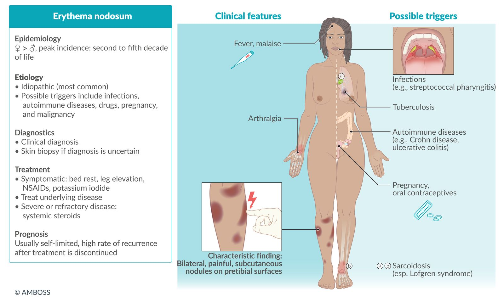
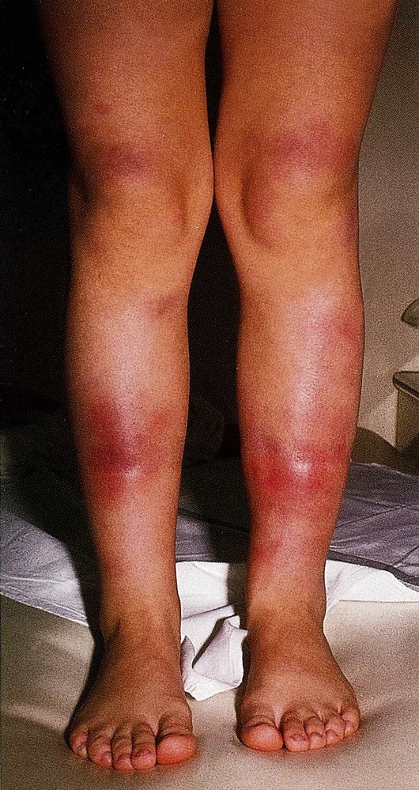
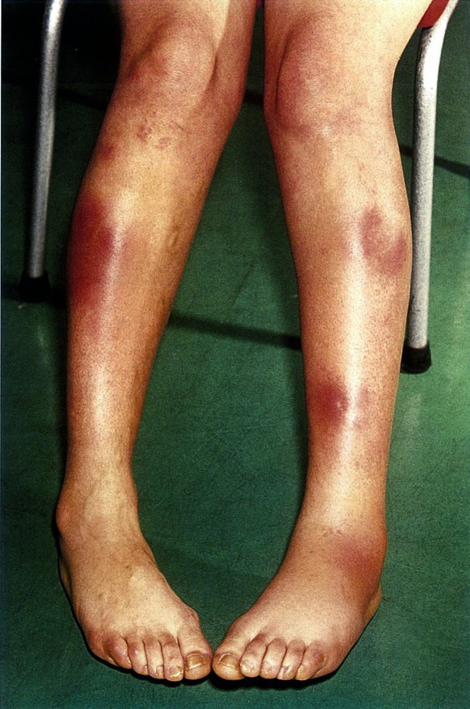
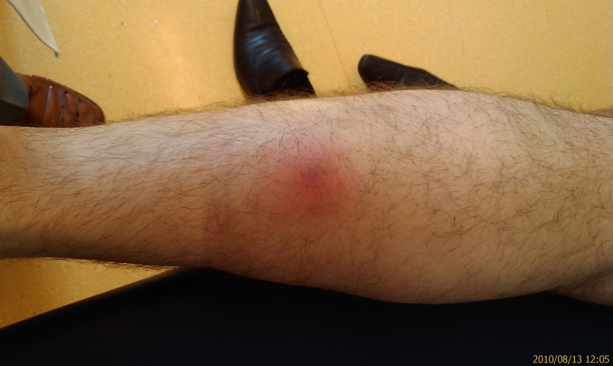
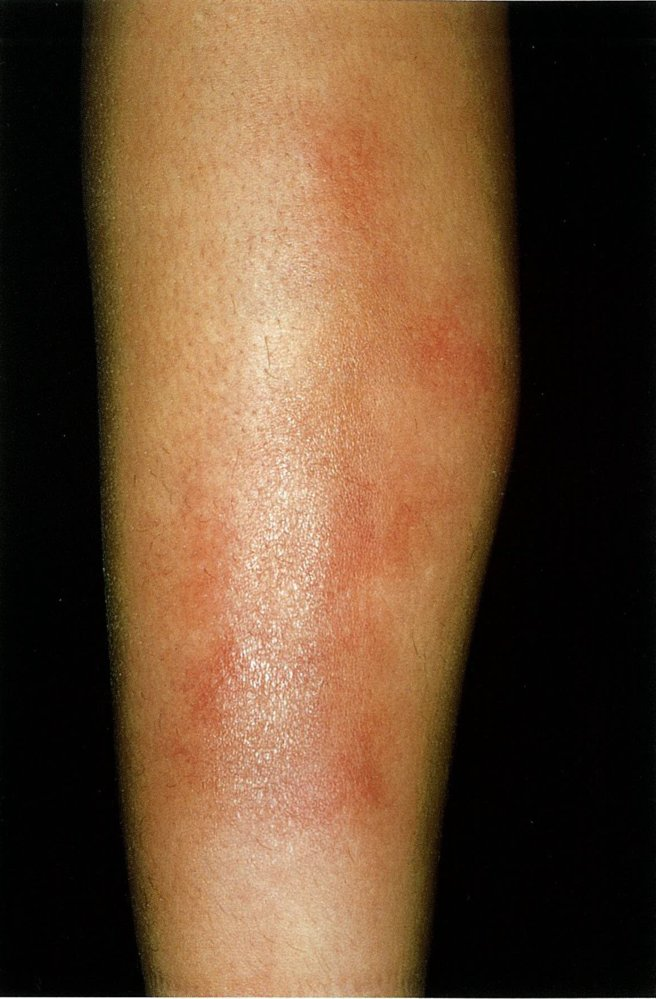
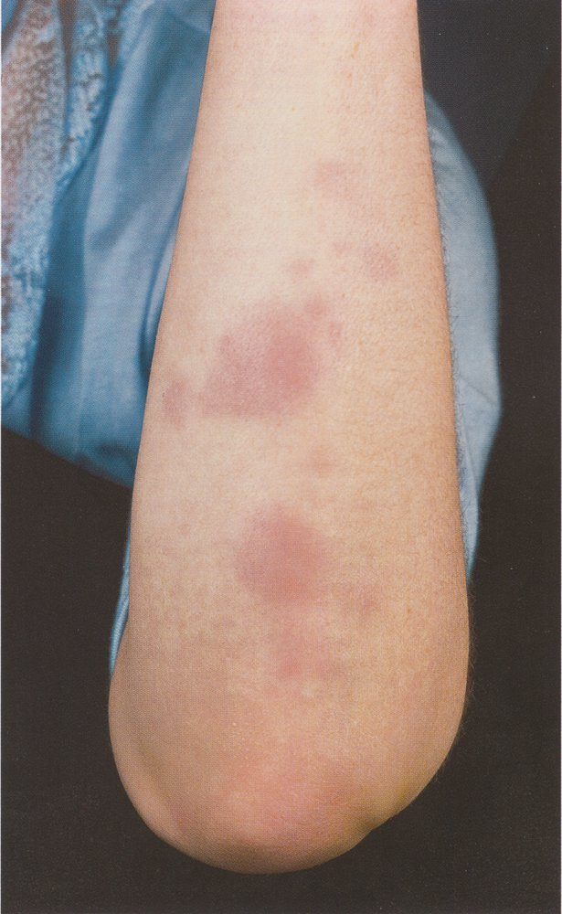
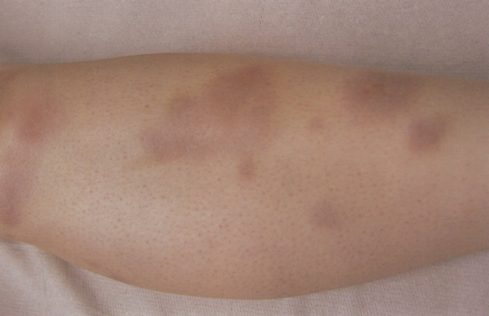
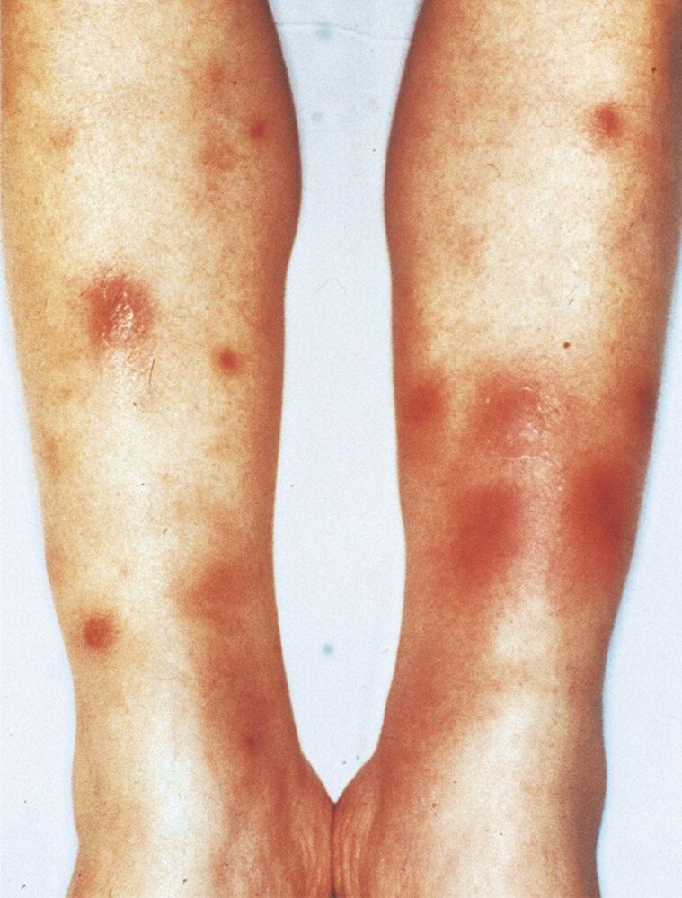
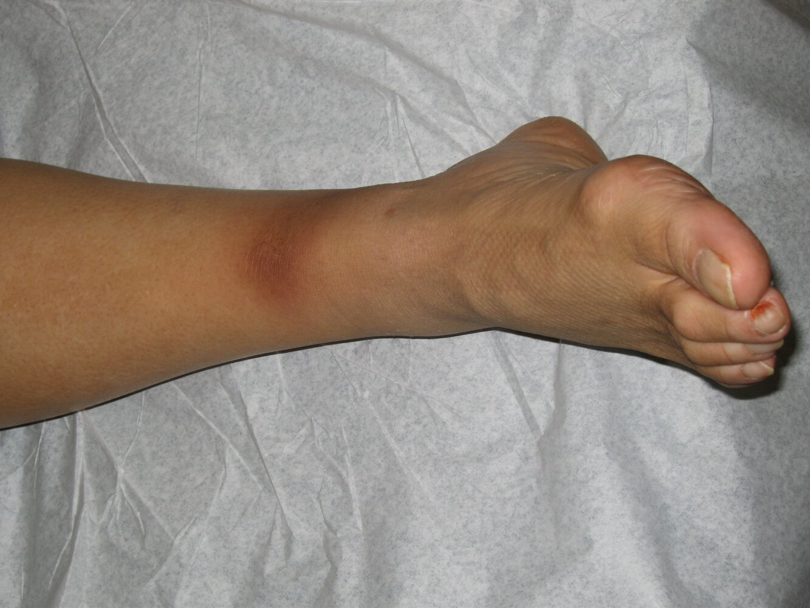

# Erythema nodosum

*Categories: Clinical knowledge > Dermatology > Allergic and immune-mediated disorders > Erythema nodosum*

[Original Article Link](https://coursology-qbank.com/amboss/article/Fk0gpT)

---

## Summary

Erythema nodosum is a type of <u>panniculitis</u> caused by a <u>delayed hypersensitivity reaction</u>. It characteristically manifests with the sudden onset of painful, subcutaneous <u>nodules</u> on the <u>anterior</u> aspect of the lower legs. Female individuals are most commonly affected. Erythema nodosum is often <u>idiopathic</u> but can be caused by a variety of conditions, including infections and autoimmune diseases (e.g., <u>ulcerative colitis</u>). Erythema nodosum is primarily a <u>clinical diagnosis</u>, but testing is recommended to confirm the diagnosis and/or exclude a serious underlying cause. Erythema nodosum typically resolves spontaneously within a few weeks; treatment is symptomatic and/or targeted to the specific cause.

Erythema nodosum fact sheet

---

## Etiology

* <u>Idiopathic</u> (over one-third of patients)  [[3]](https://coursology-qbank.com/amboss/article/W8dPl70)

* Infection (e.g., <u>streptococcal pharyngitis</u>, <u>histoplasmosis</u>, <u>coccidioidomycosis</u>, <u>tuberculosis</u>, <u>leprosy</u>, <u>cat scratch disease</u>, <u>infectious mononucleosis</u>)

* Autoimmune diseases (e.g., <u>sarcoidosis</u>, <u>Crohn disease</u>, <u>ulcerative colitis</u>, <u>Behcet syndrome</u>)

* Drugs (e.g., <u>oral contraceptives</u>, <u>sulfonamides</u>, <u>penicillins</u>, iodide)

* <u>Pregnancy</u>

* <u>Malignancy</u> (e.g., <u>leukemia</u>, <u>lymphoma</u>)

---

## Pathophysiology

<u>Delayed hypersensitivity</u> reaction → panniculitis (inflammation of <u>subcutaneous fat</u>) [[3]](https://coursology-qbank.com/amboss/article/W8dPl70)[[4]](https://coursology-qbank.com/amboss/article/PacWka0)

---

## Clinical features

* Nonspecific symptoms  [[3]](https://coursology-qbank.com/amboss/article/W8dPl70)[[5]](https://coursology-qbank.com/amboss/article/V8dGl70)

* <u>Fever</u>

* <u>Arthralgia</u>

* <u>Malaise</u>

* <u>Lymphadenopathy</u>

* Painful, subcutaneous <u>nodules</u> on both pretibial surfaces (less common on other areas of <u>skin</u>) [[3]](https://coursology-qbank.com/amboss/article/W8dPl70)[[5]](https://coursology-qbank.com/amboss/article/V8dGl70)

* Sudden onset (1–2 days)

* Initially firm and <u>erythematous</u>

* May become soft and purple in the second week

* Typically resolve over several weeks, with slowly fading <u>hyperpigmentation</u> (e.g., yellow or brown hue)

* Recurrences are common.

Erythema nodosum fact sheet

Erythema nodosum

Erythema nodosum in sarcoidosis

Erythema nodosum

Erythema nodosum

Erythema nodosum

Erythema nodosum

Erythema nodosum

Erythema nodosum

Erythema nodosum

---

## Diagnosis

Erythema nodosum is primarily a <u>clinical diagnosis</u>. Diagnostic testing is performed to determine the cause and/or to guide management.

### Approach [[3]](https://coursology-qbank.com/amboss/article/W8dPl70)[[5]](https://coursology-qbank.com/amboss/article/V8dGl70)

* Make a preliminary diagnosis based on clinical features.

* Perform a focused history. [[2]](https://coursology-qbank.com/amboss/article/kEdmD70)

* <u>Constitutional symptoms</u>

* Recent drug intake or <u>vaccinations</u>

* Travel history

* <u>Family history</u> of autoimmune disease and/or <u>tuberculosis</u> exposure

* Animals in the home

* Obtain <u>laboratory studies</u> and imaging based on clinical suspicion.

* Consider a <u>skin biopsy</u> for confirmation.

> [!WARNING]
> Exclude underlying disease before establishing a diagnosis of <u>idiopathic</u> erythema nodosum. [[3]](https://coursology-qbank.com/amboss/article/W8dPl70)

### <u>Laboratory studies</u> [[3]](https://coursology-qbank.com/amboss/article/W8dPl70)[[4]](https://coursology-qbank.com/amboss/article/PacWka0)[[5]](https://coursology-qbank.com/amboss/article/V8dGl70)

* Routine studies

* <u>CBC with differential</u>

* <u>ESR</u>, <u>CRP</u>

* <u>Antistreptolysin O antibody</u> <u>titer</u>, throat swab culture

* Individuals who can become pregnant: <u>pregnancy test</u>  [[6]](https://coursology-qbank.com/amboss/article/e8dxl70)

* Additional studies based on suspicion, e.g.:

* <u>VDRL</u>

* Serum <u>AAT</u> level [[7]](https://coursology-qbank.com/amboss/article/mMWV6N0)

* <u>Inflammatory bowel disease</u> workup

* <u>Diagnostic workup for sarcoidosis</u>

* <u>Diagnostic workup for tuberculosis</u>

### Imaging studies [[3]](https://coursology-qbank.com/amboss/article/W8dPl70)[[5]](https://coursology-qbank.com/amboss/article/V8dGl70)

* <u>Chest x-ray</u>

* Recommended as part of the initial workup

* May show hilar <u>lymphadenopathy</u> (e.g., in <u>sarcoidosis</u>, <u>tuberculosis</u>)

* Consider advanced imaging (e.g., CT chest) as needed for further evaluation and/or confirmation of <u>chest x-ray</u> findings.

### <u>Skin biopsy</u> [[3]](https://coursology-qbank.com/amboss/article/W8dPl70)[[5]](https://coursology-qbank.com/amboss/article/V8dGl70)

* <u>Confirmatory test</u>: Consider if there is diagnostic uncertainty (e.g., for patients with atypical manifestations).  [[5]](https://coursology-qbank.com/amboss/article/V8dGl70)

* Indications and timing vary.  [[3]](https://coursology-qbank.com/amboss/article/W8dPl70)[[4]](https://coursology-qbank.com/amboss/article/PacWka0)[[5]](https://coursology-qbank.com/amboss/article/V8dGl70)

---

## Treatment

### Approach [[3]](https://coursology-qbank.com/amboss/article/W8dPl70)

* Stop offending medications.

* Treat the underlying condition (if known)

* Provide supportive treatment.

* Severe and/or refractory disease: Consider additional treatment in consultation with a specialist. 

* Systemic <u>steroids</u>

* <u>Potassium iodide</u>, <u>colchicine</u>, <u>dapsone</u>  [[3]](https://coursology-qbank.com/amboss/article/W8dPl70)[[5]](https://coursology-qbank.com/amboss/article/V8dGl70)

### Supportive treatment [[3]](https://coursology-qbank.com/amboss/article/W8dPl70)[[5]](https://coursology-qbank.com/amboss/article/V8dGl70)

* Bed rest

* Leg elevation

* Limb compression with bandages

* Heat or cool compresses

* <u>NSAIDs</u> (e.g., <u>ibuprofen</u>)  [[3]](https://coursology-qbank.com/amboss/article/W8dPl70)

### Disposition

* Most patients can be managed as outpatients.

* Refer patients with severe, atypical, and/or recurrent symptoms to dermatology.

* Consider admission if warranted by underlying cause (e.g., need for parenteral treatment).

---

## Prognosis

* Usually <u>self-limited</u> (within 1–8 weeks) [[5]](https://coursology-qbank.com/amboss/article/V8dGl70)[[6]](https://coursology-qbank.com/amboss/article/e8dxl70)[[9]](https://coursology-qbank.com/amboss/article/P8dW570)

* May resolve earlier with effective treatment of an underlying condition

* Recurrence after discontinued treatment is common.

---