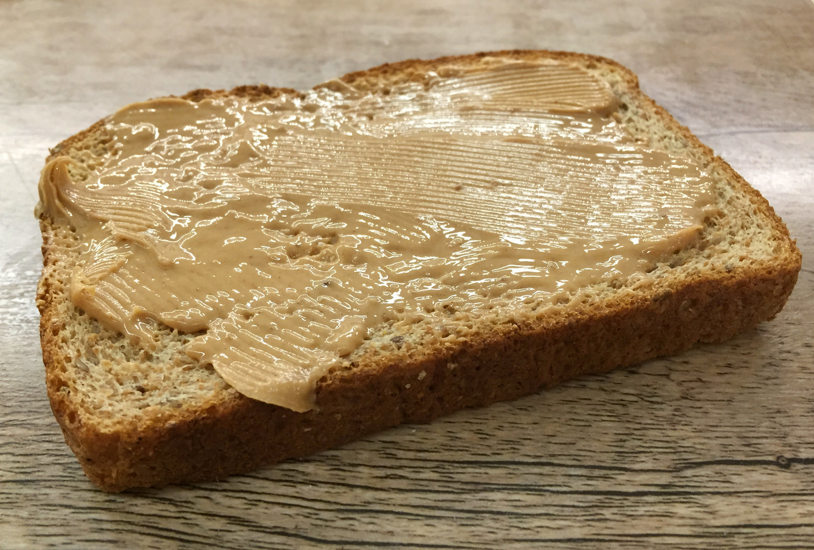

# Food allergy

*Categories: Clinical knowledge > Dermatology > Allergic and immune-mediated disorders > Food allergy*

[Original Article Link](https://coursology-qbank.com/amboss/article/QM0uog)

---

## Summary

Food <u>allergies</u> are <u>IgE</u>, non-<u>IgE</u>, or mixed <u>hypersensitivity reactions</u> to food <u>allergens</u>. They are the most common cause of <u>anaphylaxis</u>. Young children are commonly affected, with onset usually in the first two years of life. <u>IgE</u>-mediated reactions are the most common type of food <u>allergy</u> and have an onset within minutes after ingestion, while mixed or non-<u>IgE</u> reactions are usually delayed and limited to the <u>gastrointestinal tract</u>. Clinical features include <u>urticaria</u>, <u>angioedema</u>, <u>wheezing</u>, <u>rhinorrhea</u>, and abdominal <u>pain</u>. Differential diagnoses include <u>food intolerance</u> and reactions to non-food <u>allergens</u>. A thorough <u>patient history</u> must be obtained to identify a potential <u>allergen</u>, with allergist consultation for testing (e.g., <u>skin prick test</u>, <u>allergen-specific IgE test</u>). Additional interventions (e.g., <u>oral food challenge</u>) may be required for inconclusive results or suspected mixed or non-<u>IgE</u> reactions. Avoidance of triggers is the mainstay of management. Other therapies (e.g., <u>oral immunotherapy</u>, <u>omalizumab</u>) may be considered in select patients. The <u>primary prevention</u> method is the early introduction of <u>potentially allergenic foods</u>.

---

## Etiology

* <u>Hypersensitivity reaction</u>;  (<u>IgE</u>, non-<u>IgE</u>, or mixed) against select ingredients in food

* The most common food <u>allergens</u> (the big nine food allergens) in the US are: [[5]](https://coursology-qbank.com/amboss/article/UOdb7J0)[[6]](https://coursology-qbank.com/amboss/article/5Mdi6q0)

* Legumes: peanuts (most common <u>allergen</u>), soybeans

* Tree nuts

* Animal products: cow's milk, chicken eggs, fish, shellfish

* Other: wheat, sesame

Peanut butter toast

---

## Pathophysiology

* Commonly <u>IgE</u>-mediated: <u>type I hypersensitivity reaction</u> (immediate onset; within minutes to 2 hours of ingestion)

* Mixed <u>IgE</u>/non-<u>IgE</u>-mediated and non-<u>IgE</u>-mediated reactions are also possible (delayed onset; hours to days after ingestion).

---

## Clinical features

Clinical features of food <u>allergy</u> vary from mild symptoms (e.g., isolated <u>skin</u> involvement) to life-threatening <u>anaphylaxis</u>. [[2]](https://coursology-qbank.com/amboss/article/XMd9Mq0)

* <u>Skin</u> (most common)

* <u>Pruritus</u>, <u>erythema</u>

* <u>Urticaria</u>, <u>angioedema</u>

* Respiratory

* Sneezing, nasal <u>pruritus</u>, <u>rhinorrhea</u>

* Laryngeal <u>edema</u>

* <u>Wheezing</u>, <u>dyspnea</u>

* Gastrointestinal

* Symptoms of <u>oral allergy syndrome</u>

* <u>Nausea</u>, <u>vomiting</u>

* Abdominal <u>pain</u>

* <u>Diarrhea</u>, blood or mucus in stool

* Cardiovascular

* <u>Hypotension</u>

* <u>Tachycardia</u>, <u>dysrhythmias</u>

* <u>CNS</u>: <u>headache</u>

* Features of associated conditions, e.g.:

* <u>Asthma</u>

* <u>Atopic dermatitis</u>

* <u>Allergic rhinitis</u>

* <u>Eosinophilic esophagitis</u>

> [!TIP]
> Non-<u>IgE</u> or mixed reactions typically have delayed onset (hours to days) and are limited to the <u>skin</u> and <u>GI tract</u>. [[2]](https://coursology-qbank.com/amboss/article/XMd9Mq0)[[7]](https://coursology-qbank.com/amboss/article/st0tU3)

> [!WARNING]
> Respiratory and cardiovascular manifestations can be fatal.

---

## Subtypes and variants

### Food protein-induced allergic proctocolitis of infancy (<u>FPIAP</u>)

* Definition: a type of delayed inflammatory non-<u>IgE</u>-mediated food <u>allergy</u> typically seen in young <u>infants</u> that affects the <u>distal</u> <u>colon</u>

* <u>Epidemiology</u>:  primarily affects young <u>infants</u> (typically manifests at 2–8 weeks of age)

* Etiology

* <u>Hypersensitivity reaction</u> to certain foods, most commonly cow's milk, followed by soy protein, rice, and eggs [[8]](https://coursology-qbank.com/amboss/article/2f1TlT0)

* Associated with a personal and <u>family history</u> of <u>atopy</u> [[9]](https://coursology-qbank.com/amboss/article/ff1klT0)

* Clinical features

* Insidious progression of symptoms over several months

* <u>Rectal bleeding</u>

* Increased stool frequency

* Streaks of mucus in the stool

* Abdominal <u>pain</u>

* Affected <u>infants</u> typically appear otherwise healthy.

* Diagnostics: mainly a <u>clinical diagnosis</u> based on <u>patient history</u> and clinical features

* <u>Patient history</u>: evaluation of <u>infant</u>'s and mother's diet

* Laboratory testing: may reveal <u>eosinophilia</u>, mild <u>iron deficiency anemia</u>, and/or increased <u>fecal calprotectin</u>

* Differential diagnosis

* <u>Food protein-induced enterocolitis syndrome</u> (<u>FPIES</u>)

* <u>Necrotizing enterocolitis</u>

* <u>Gastrointestinal infection</u> (e.g., with <u>Campylobacter</u>)

* <u>Anal fissure</u>

* <u>Intussusception</u>

* <u>Meckel diverticulum</u>

* Management

* Removal of offending foods from the <u>infant</u>'s diet

* Breastfed <u>infants</u>

* Elimination of all dairy and soy products from the mother's diet

* Continue <u>breastfeeding</u>

* Formula-fed <u>infants</u>: switching to a <u>hydrolyzed formula</u> (e.g., <u>hydrolyzed</u> casein)

* The offending foods should be carefully reintroduced to assess tolerance after one year of age.

* Complications: chronic <u>colitis</u> and/or persistent food <u>allergy</u> (rare)

* Prognosis

* Gross <u>rectal bleeding</u> usually improves within 3–4 days of removing the offending food. [[9]](https://coursology-qbank.com/amboss/article/ff1klT0)

* <u>FPIAP</u> usually resolves spontaneously by one year of age. [[10]](https://coursology-qbank.com/amboss/article/Uf1blT0)

### Pollen-associated food allergy syndrome [[6]](https://coursology-qbank.com/amboss/article/5Mdi6q0)[[7]](https://coursology-qbank.com/amboss/article/st0tU3)[[11]](https://coursology-qbank.com/amboss/article/pMdLpq0)

* Definition: an <u>IgE</u>-mediated reaction to the ingestion of certain raw fruits, vegetables, and nuts in individuals with pollen <u>allergy</u>

* Etiology: cross-reactivity between pollen <u>allergens</u> and <u>proteins</u> in certain foods

* Melons, kiwis, bananas, and cucumbers in individuals allergic to ragweed pollen

* Apples, peaches, and hazelnuts in individuals allergic to birch pollen

* Clinical features

* <u>Pruritus</u>, tingling, and/or <u>edema</u> of the <u>lips</u>, <u>tongue</u>, <u>palate</u>, and <u>pharynx</u>

* Onset within minutes of ingesting foods

* Symptoms are typically mild and temporary, but <u>anaphylaxis</u> may occur.

* Diagnostics: See “Diagnosis.”

* Treatment: See “Treatment.”

---

## Diagnosis

### Approach [[2]](https://coursology-qbank.com/amboss/article/XMd9Mq0)[[6]](https://coursology-qbank.com/amboss/article/5Mdi6q0)[[12]](https://coursology-qbank.com/amboss/article/NMd-Kq0)

* Clinical evaluation to identify the potential <u>allergen</u> and exclude differential diagnoses should include:

* Type of ingested foods and preparation (e.g., raw vs. cooked)

* Amount of ingestion and timing relative to symptoms

* Type of reaction (e.g., limited to <u>skin</u>, respiratory symptoms) and context (e.g., <u>stress</u>, mother's diet in breastfed <u>infants</u>)

* <u>Risk factors</u> for food <u>allergy</u>, e.g., severe <u>atopic dermatitis</u>, <u>eosinophilic esophagitis</u> [[7]](https://coursology-qbank.com/amboss/article/st0tU3)

* Consider referral to an allergist for diagnostic testing.

> [!WARNING]
> For patients appearing unwell, use the <u>ABCDE approach</u> and rule out serious conditions (e.g., <u>intussusception</u>).

> [!TIP]
> Diagnosis of food <u>allergy</u> is primarily clinical. <u>Laboratory studies</u> and other tests may support the diagnosis.

### Diagnostic studies [[2]](https://coursology-qbank.com/amboss/article/XMd9Mq0)[[6]](https://coursology-qbank.com/amboss/article/5Mdi6q0)[[12]](https://coursology-qbank.com/amboss/article/NMd-Kq0)

An allergist may perform the following studies in patients with a strong clinical suspicion of <u>IgE</u>-mediated food <u>allergy</u>.

* <u>Skin prick test</u> (SPT): first-line test for suspected <u>IgE</u>-mediated food <u>allergy</u>

* <u>Allergen-specific IgE test</u> (<u>sIgE</u>)

* Indications

* Inconclusive or contraindicated SPT (e.g., high risk of <u>anaphylaxis</u>, <u>uncontrolled asthma</u>, taking medications for chronic conditions)

* Suspicion of a specific <u>allergy</u>, e.g., <u>alpha-gal syndrome</u>

* Methods

* <u>ELISA</u>: preferred

* Radioallergosorbent test : no longer used

> [!TIP]
> Total serum <u>IgE</u> is not useful for diagnosis because low or normal levels do not exclude an <u>IgE</u>-mediated reaction. [[12]](https://coursology-qbank.com/amboss/article/NMd-Kq0)

> [!TIP]
> A positive SPT or <u>sIgE</u> indicates sensitization to an <u>allergen</u> but does not confirm a food <u>allergy</u>. Always correlate with the patient's clinical evaluation. [[6]](https://coursology-qbank.com/amboss/article/5Mdi6q0)[[7]](https://coursology-qbank.com/amboss/article/st0tU3)

Skin prick test

Positive skin prick test

### Additional evaluations [[2]](https://coursology-qbank.com/amboss/article/XMd9Mq0)[[7]](https://coursology-qbank.com/amboss/article/st0tU3)

* <u>Double-blind</u> oral food challenge

* Indications: <u>gold standard test</u> for food <u>allergy</u>  [[2]](https://coursology-qbank.com/amboss/article/XMd9Mq0)[[7]](https://coursology-qbank.com/amboss/article/st0tU3)

* Method: Under medical surveillance, the patient is given different potential food <u>allergens</u> in increasing doses. A supervised <u>oral food challenge</u> should be performed in a setting with access to emergency equipment, <u>epinephrine</u>, and trained medical providers. The patient initially chews without <u>swallowing</u> the potential <u>allergens</u>. If results are unclear, the patient is instructed to swallow the <u>allergens</u>.  [[3]](https://coursology-qbank.com/amboss/article/jpd_6I0)[[4]](https://coursology-qbank.com/amboss/article/Qpdu6I0)

* Diagnosis is confirmed if symptoms occur (e.g., tingling, <u>pruritus</u>, <u>urticaria</u>, <u>angioedema</u>).

* <u>Elimination diets</u>

* Indications

* Inconclusive <u>laboratory studies</u>

* Suspected mixed or non-<u>IgE</u> mediated food <u>allergy</u> (e.g, <u>FPIAP</u>, <u>eosinophilic esophagitis</u>)

* Method: The suspected <u>allergen</u> is eliminated from the patient's diet.

* Diagnosis is confirmed if symptoms resolve without the need for <u>antihistamines</u> or other medications for food <u>allergy</u>.

* Other methods (may be performed if initial studies are negative): intradermal tests, <u>basophil activation tests</u> [[6]](https://coursology-qbank.com/amboss/article/5Mdi6q0)

> [!WARNING]
> Broad <u>elimination diets</u> (i.e., restricting multiple foods) are associated with significant <u>malnutrition</u>. [[7]](https://coursology-qbank.com/amboss/article/st0tU3)

---

## Differential diagnoses

* Reaction to non-food <u>allergens</u> (e.g., medications, <u>Hymenoptera stings</u>)

* <u>Anorexia nervosa</u>

* <u>Chronic urticaria</u>

* <u>Food intolerance</u>, e.g., <u>lactose intolerance</u>, <u>fructose intolerance</u>

* <u>Celiac disease</u>

* <u>Infantile colic</u>

* <u>GERD</u>, <u>IBD</u>

* Neurologic responses to temperature or <u>capsaicin</u> (e.g., <u>rhinitis</u> from hot or spicy foods)

The differential diagnoses listed here are not exhaustive.

---

## Treatment

There is no specific treatment for food <u>allergy</u>. Management is primarily supportive. [[6]](https://coursology-qbank.com/amboss/article/5Mdi6q0)[[7]](https://coursology-qbank.com/amboss/article/st0tU3)

* <u>Anaphylaxis management</u>: if <u>diagnostic criteria for anaphylaxis</u> are met

* Administer <u>IM epinephrine</u>. DOSAGE

* Initiate <u>immediate hemodynamic support</u> (e.g., <u>IV fluids</u>, <u>supplemental oxygen</u>).

* Alert the <u>ICU</u> and/or consult anesthesiology.

* See “<u>Management of anaphylaxis</u>” and “<u>Management of angioedema</u>” for treatment algorithms.

* Avoidance of identified <u>allergens</u> [[6]](https://coursology-qbank.com/amboss/article/5Mdi6q0)[[7]](https://coursology-qbank.com/amboss/article/st0tU3)

* First-line management

* Educate patients on food cross-contamination (e.g., contact with <u>allergens</u> during food preparation).

* Symptomatic management: <u>second-generation antihistamines</u> (e.g., <u>cetirizine</u> DOSAGE) for mild symptoms

* <u>Oral immunotherapy</u>: ingestion of increasing doses of a specific food <u>allergen</u> in a controlled setting to reduce the risk of <u>anaphylaxis</u> caused by accidental exposures

* Effective in patients with <u>allergy</u> to peanuts, milk, and eggs

* <u>Anaphylaxis</u> may occur during <u>oral immunotherapy</u>.

* Palforzia (peanut <u>allergen</u> powder) is the only <u>oral immunotherapy</u> product approved by the <u>FDA</u>. [[13]](https://coursology-qbank.com/amboss/article/bndH7q0)

* <u>Omalizumab</u>: considered in select patients (based on serum <u>IgE</u> and body weight)  [[14]](https://coursology-qbank.com/amboss/article/VndGHq0)

> [!WARNING]
> Peanuts and tree nuts are the most common causes of lethal <u>allergic reactions</u>, including <u>anaphylaxis</u>. Educate patients with these <u>allergies</u> on the use of an <u>epinephrine autoinjector</u>. [[2]](https://coursology-qbank.com/amboss/article/XMd9Mq0)[[6]](https://coursology-qbank.com/amboss/article/5Mdi6q0)

---