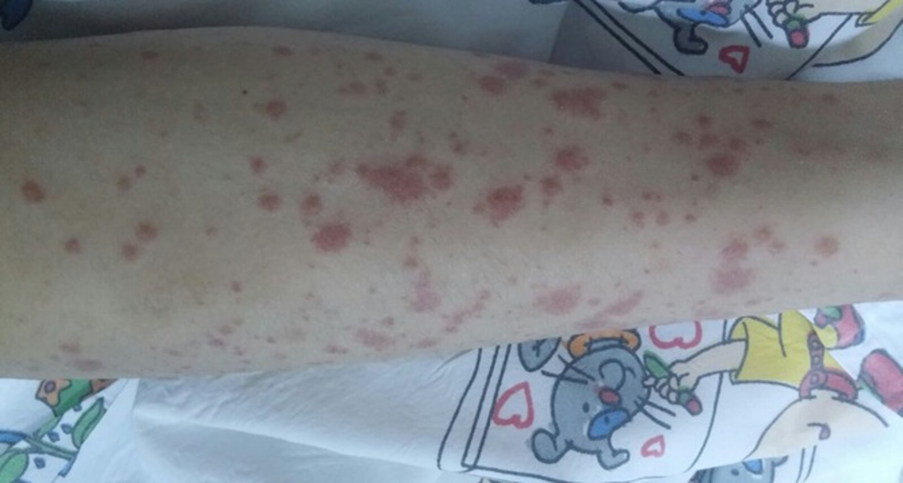
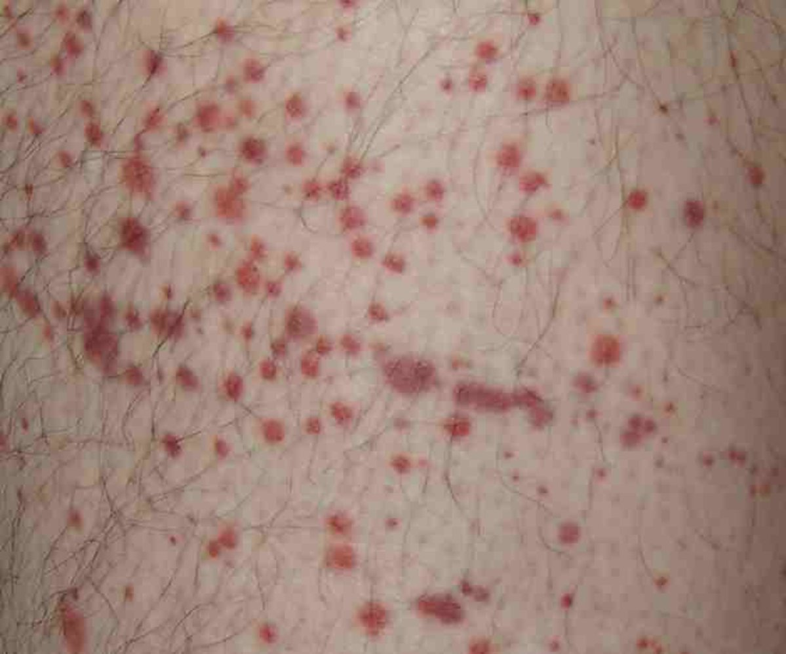
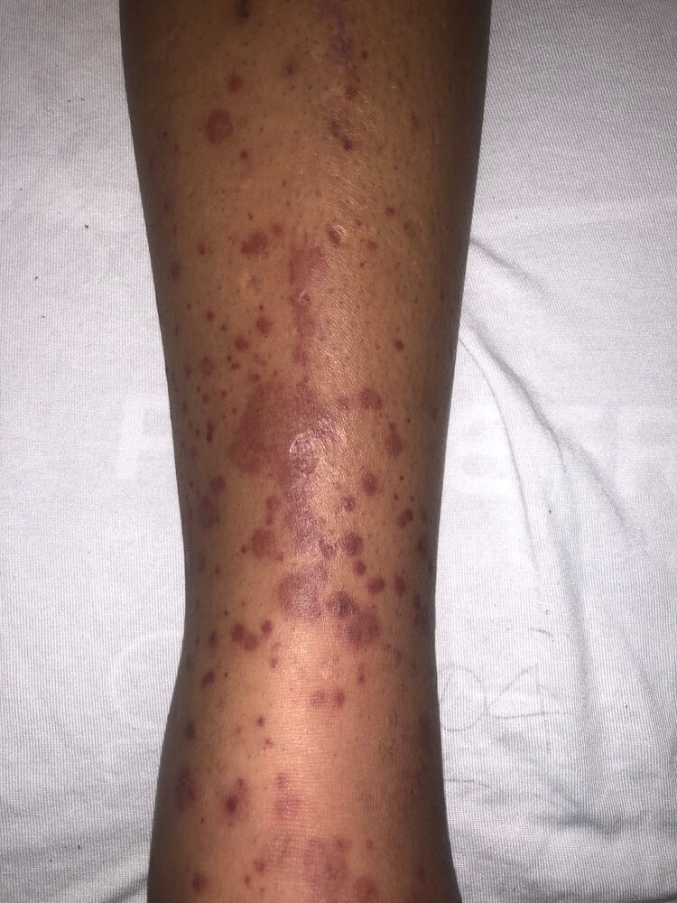

# IgA vasculitis

*Categories: Clinical knowledge > Dermatology > Allergic and immune-mediated disorders > IgA vasculitis*

[Original Article Link](https://coursology-qbank.com/amboss/article/BT0zG2)

---

## Summary

<u>IgA</u> <u>vasculitis</u> (IgAV), previously referred to as Henoch-Schonlein <u>purpura</u> (<u>HSP</u>), is an acute <u>immune complex</u>-mediated small vessel <u>vasculitis</u> that most commonly occurs in children. Onset is often preceded by an <u>upper respiratory tract</u> or <u>gastrointestinal infection</u>; IgAV in adults may be <u>idiopathic</u>. Affected individuals typically develop palpable <u>purpura</u>, <u>arthritis</u> and/or <u>arthralgia</u>, and abdominal <u>pain</u>. Renal involvement (i.e., IgAV nephritis) is more common and usually more severe in adults than in children, typically manifesting with <u>hematuria</u>. While IgAV is a <u>clinical diagnosis</u>, <u>laboratory studies</u> are used to identify organ involvement and exclude differential diagnoses, and <u>skin biopsy</u> can confirm the diagnosis in patients with atypical presentations. IgAV is usually <u>self-limited</u>; treatment is generally supportive. <u>Systemic glucocorticoids</u> may be required depending on severity of manifestations (e.g., in IgAV nephritis, <u>orchitis</u>). IgAV has an excellent prognosis in children, usually resolving within one month when not complicated by IgAV nephritis. Adults often manifest with more severe features and have lower remission rates. All patients require follow-up assessments to rule out the development of <u>chronic renal disease</u>.

IgA vasculitis fact sheet

---

## Epidemiology

* Sex: : <u>♂</u> > <u>♀</u>

* Age: more common in children

* 90% of affected individuals < 10 years [[1]](https://coursology-qbank.com/amboss/article/qoaC1l)

* Peak <u>incidence</u>: 6 years [[2]](https://coursology-qbank.com/amboss/article/3aXS49)

Epidemiological data refers to the US, unless otherwise specified.

---

## Etiology

The exact pathogenesis is unknown and assumed to be multifactorial. Factors that likely play a role include:

* Preceding infection

* Up to 90% of cases are preceded by viral or bacterial infection 1–3 weeks prior. [[3]](https://coursology-qbank.com/amboss/article/RaXl49)

* Most commonly an <u>upper respiratory tract infection</u> caused by group A <u>Streptococcus</u> [[4]](https://coursology-qbank.com/amboss/article/iaXJ49)

* GI infections also possible

* Many other organisms have also been associated with IgAV.

* Drugs (e.g., <u>ACE inhibitors</u>, <u>clarithromycin</u>) and <u>vaccines</u>

* Genetic predisposition

* Solid-organ malignancies (in adults) [[5]](https://coursology-qbank.com/amboss/article/q-1Cyj0)

---

## Pathophysiology

* Hypothesized pathophysiological mechanism: exposure to <u>allergen</u>/<u>antigen</u> (e.g., infection, drugs) → stimulation of <u>IgA</u> production → deposition of <u>IgA</u> <u>immune complexes</u> in vascular walls (e.g., in the <u>skin</u>, <u>GI tract</u>, <u>joints</u>, <u>kidneys</u>) → activation of <u>complement</u> → vascular inflammation and damage

---

## Clinical features

An <u>upper respiratory tract infection</u> often precedes symptom onset by 1–3 weeks. [[3]](https://coursology-qbank.com/amboss/article/RaXl49)

* <u>Constitutional symptoms</u>: low-grade <u>fever</u>, <u>malaise</u>, fatigue

* <u>Skin</u> (∼ 100% of cases)  [[6]](https://coursology-qbank.com/amboss/article/p-1Lyj0)

* Symmetrically distributed <u>erythematous</u> <u>papules</u> or <u>urticarial</u> lesions that coalesce into palpable <u>purpura</u>

* <u>Bullae</u>, <u>pustules</u>, and <u>necrotic</u> or hemorrhagic <u>purpura</u> (more common in adults) [[5]](https://coursology-qbank.com/amboss/article/q-1Cyj0)

* Most commonly in the lower extremities, buttocks, and other areas of pressure or constraint (e.g., from clothing)

* <u>Joints</u> (∼ 75% of cases) [[7]](https://coursology-qbank.com/amboss/article/4-13xj0)

* <u>Arthritis</u>/<u>arthralgia</u>

* Most commonly in the ankles and knees

* <u>Gastrointestinal tract</u> (∼ 60% of cases) [[7]](https://coursology-qbank.com/amboss/article/4-13xj0)

* Colicky abdominal <u>pain</u>

* <u>Intussusception</u>

* <u>Hematochezia</u> or <u>melena</u>

* <u>Nausea</u> and/or <u>vomiting</u>

* <u>Kidneys</u>: IgAV nephritis (20–50% of children; 50–80% of adults) ;  [[8]](https://coursology-qbank.com/amboss/article/O-1Ixj0)

* <u>Nephritic syndrome</u>

* See also “<u>IgA nephropathy</u>.”

* Other organs (rare)

* Genitourinary tract (e.g., <u>epididymo-orchitis</u>, <u>urethritis</u>)

* Central and <u>peripheral nervous system</u> (e.g., <u>headaches</u>, <u>seizures</u>, <u>intracerebral hemorrhage</u>)

* Respiratory tract (e.g., mild <u>interstitial</u> changes, alveolar hemorrhage)

* Eyes (e.g., <u>episcleritis</u>, <u>uveitis</u>)

> [!TIP]
> IgAV is characterized by PAPAH: purpura, abdominal pain, arthritis/arthralgia, and hematuria.

> [!TIP]
> IgAV is an important differential diagnosis to consider in children with a limp.

> [!TIP]
> IgAV is much less common but typically more severe (e.g., involving hemorrhagic or <u>necrotic</u> <u>skin</u> lesions, IgAV nephritis) in adults than in children. [[8]](https://coursology-qbank.com/amboss/article/O-1Ixj0)

Purpura in IgA vasculitis

Purpura in IgA vasculitis

Purpura in IgA vasculitis

Purpura in IgA vasculitis

---

## Diagnosis

### Approach [[5]](https://coursology-qbank.com/amboss/article/q-1Cyj0)[[7]](https://coursology-qbank.com/amboss/article/4-13xj0)[[9]](https://coursology-qbank.com/amboss/article/P-1Wxj0)[[10]](https://coursology-qbank.com/amboss/article/POWWsl0)

* Pediatric and adult patients

* Make a <u>clinical diagnosis</u> of IgAV based on typical clinical features.

* Check history for recent infections, medications, and <u>vaccination</u> as potential precipitating factors.

* Obtain <u>laboratory studies</u> to identify organ involvement and exclude alternative diagnoses.

* <u>CBC</u>, <u>BMP</u>, <u>coagulation panel</u>

* <u>Urinalysis</u> and occult <u>stool blood test</u>

* If abdominal <u>pain</u> is present, obtain imaging studies to investigate for <u>GI bleeding</u> and <u>intussusception</u>.

* If the diagnosis remains unclear, refer to a specialist for confirmatory <u>biopsy</u>.  [[11]](https://coursology-qbank.com/amboss/article/AN1Rdh0)

* Adult-specific considerations [[5]](https://coursology-qbank.com/amboss/article/q-1Cyj0)[[10]](https://coursology-qbank.com/amboss/article/POWWsl0)[[11]](https://coursology-qbank.com/amboss/article/AN1Rdh0)

* A <u>biopsy</u> is typically required to confirm the diagnosis in adults.

* Consider <u>cancer screening</u> if the cause of IgAV is not established.  [[5]](https://coursology-qbank.com/amboss/article/q-1Cyj0)[[12]](https://coursology-qbank.com/amboss/article/fQWkvO0)

> [!TIP]
> Suspect <u>IgA</u> <u>vasculitis</u> in any patient with palpable <u>purpura</u>, <u>arthralgia</u>, and abdominal <u>pain</u>. [[7]](https://coursology-qbank.com/amboss/article/4-13xj0)

> [!WARNING]
> Consider the differential diagnosis for palpable <u>purpura</u> (e.g., <u>small-vessel vasculitides</u>, coagulopathies).

### <u>Laboratory studies</u> [[5]](https://coursology-qbank.com/amboss/article/q-1Cyj0)[[7]](https://coursology-qbank.com/amboss/article/4-13xj0)[[9]](https://coursology-qbank.com/amboss/article/P-1Wxj0)

#### Baseline <u>laboratory studies</u>

Obtain the following studies in all patients to assess for renal and GI involvement:

* <u>CBC</u>

* Usually normal <u>platelet count</u>

* ↓ <u>Hemoglobin</u> suggests <u>GI bleeding</u>.

* <u>BMP</u>: ↑ <u>creatinine</u> and/or ↑ <u>BUN</u> suggest IgAV nephritis

* <u>Coagulation panel</u>: typically normal

* Urine: may be normal, abnormal values suggest IgAV nephritis

* <u>Urinalysis</u> (first sample of the day): <u>hematuria</u>, <u>proteinuria</u>

* Microscopy: <u>nephritic sediment</u> (e.g, <u>RBC casts</u>, <u>dysmorphic RBCs</u>)

* ↑ <u>Urine protein-creatinine ratio</u>

* <u>Stool blood test</u>: positive if there is <u>GI bleeding</u>

> [!TIP]
> Consider an alternative diagnosis if <u>coagulopathy</u> and <u>thrombocytopenia</u> are present. [[8]](https://coursology-qbank.com/amboss/article/O-1Ixj0)

#### Additional <u>laboratory studies</u>

The following studies may support the diagnosis of IgAV but are not required in the diagnostic workup.

* <u>LFTs</u>: ↓ <u>albumin</u> due to intestinal protein loss

* ↑ <u>ESR</u>, <u>CRP</u>

* If preceding <u>streptococcal</u> infection:

* Hypocomplementemia [[13]](https://coursology-qbank.com/amboss/article/JaWslP0)

* ↑ <u>Antistreptolysin O</u> (<u>ASO</u>) <u>titers</u> [[4]](https://coursology-qbank.com/amboss/article/iaXJ49)

* ↑ <u>IgA</u> in serum: in ∼ 60% of cases; not specific for IgAV [[8]](https://coursology-qbank.com/amboss/article/O-1Ixj0)

### Imaging [[5]](https://coursology-qbank.com/amboss/article/q-1Cyj0)[[9]](https://coursology-qbank.com/amboss/article/P-1Wxj0)

Imaging studies should be obtained according to the patient's symptoms and/or suspected complications.

* Abdominal <u>ultrasound</u>: indicated in patients with abdominal <u>pain</u> to evaluate for <u>intussusception</u>

* CT abdomen and <u>pelvis</u>: if <u>ultrasound</u> is inconclusive or if further evaluation is required

* <u>Duplex ultrasound</u> of the <u>scrotum</u>: if there is testicular <u>pain</u> to evaluate for <u>orchitis</u> or torsion

* Additional studies: based on clinical presentation (e.g., <u>MRI</u> <u>brain</u> to evaluate for cerebral <u>vasculitis</u>)

> [!TIP]
> <u>Intussusception</u> is the most common complication of IgAV requiring <u>surgery</u> in children. [[9]](https://coursology-qbank.com/amboss/article/P-1Wxj0)

Target sign in intussusception

### <u>Biopsy</u> [[8]](https://coursology-qbank.com/amboss/article/O-1Ixj0)[[9]](https://coursology-qbank.com/amboss/article/P-1Wxj0)

<u>Histology</u> from the <u>skin</u> and/or <u>kidney</u> confirms the diagnosis of IgAV. [[8]](https://coursology-qbank.com/amboss/article/O-1Ixj0)

* <u>Skin</u>

* Indications: atypical <u>skin</u> features

* Findings

* <u>Leukocytoclastic vasculitis</u>

* <u>IgA</u> and C3 complex deposition (hallmark) in small vessels of the <u>superficial</u> <u>dermis</u> [[3]](https://coursology-qbank.com/amboss/article/RaXl49)

* <u>Kidney</u>

* Indications: severe renal involvement  [[9]](https://coursology-qbank.com/amboss/article/P-1Wxj0)[[14]](https://coursology-qbank.com/amboss/article/Dyc1hU0)

* Findings

* Mesangial <u>IgA</u> deposition

* C3 and <u>fibrin</u>

* <u>Crescent formation</u> in more severe cases  [[8]](https://coursology-qbank.com/amboss/article/O-1Ixj0)

### EULAR/PRINTO/PReS classification criteria  [[15]](https://coursology-qbank.com/amboss/article/J-1syj0)[[16]](https://coursology-qbank.com/amboss/article/k-1mxj0)

Classification criteria can be used to distinguish IgAV from other types of <u>vasculitides</u>, but should not be used as diagnostic criteria for IgAV.  [[9]](https://coursology-qbank.com/amboss/article/P-1Wxj0)[[15]](https://coursology-qbank.com/amboss/article/J-1syj0)

* <u>Purpura</u> or <u>petechiae</u> (predominantly in the lower limbs)

* Plus ≥ 1 of the following:

* Acute colicky abdominal <u>pain</u>

* Acute <u>arthritis</u> or <u>arthralgias</u>

* <u>Proteinuria</u> and/or <u>hematuria</u>

* <u>Histopathology</u>: <u>cutaneous leukocytoclastic vasculitis</u> or proliferative <u>glomerulonephritis</u> with predominant <u>IgA</u> deposits

Leukocytoclastic vasculitis

Crescent formation in rapidly progressive glomerulonephritis (RPGN)

---

## Differential diagnoses

| Differential diagnosis of IgAV based on clinical features |  |  |
| --- | --- | --- |
| Clinical feature of IgAV | Differential diagnosis | Distinguishing features of the differential diagnosis |
|  <u>Purpura</u> [[17]](https://coursology-qbank.com/amboss/article/Joas1l) |  * <u>Hypersensitivity vasculitis</u>   |  * No <u>IgA</u> deposition on <u>biopsy</u>   |
|  * Small vessel <u>vasculitides</u> such as:  * <u>Granulomatosis with polyangiitis</u>  * <u>Eosinophilic granulomatosis with polyangiitis</u>  * <u>Microscopic polyangiitis</u>  * <u>Systemic lupus erythematosus</u> (<u>SLE</u>)   |   * No <u>IgA</u> deposition on <u>biopsy</u>  * Affects adults  * Associated with specific <u>antibodies</u> (e.g., <u>MPO-ANCA</u>)    |  |
|  * Coagulopathies (e.g., <u>hemophilia A</u>)   |  * Abnormal <u>coagulation studies</u> (e.g., ↑ <u>aPTT</u>)   |  |
|   * <u>Immune thrombocytopenia</u>  * <u>Hemolytic uremic syndrome</u>    |   * <u>Low platelet count</u>  * Nonpalpable <u>purpura</u>    |  |
|   * <u>Meningococcal septicemia</u>  * <u>Acute leukemia</u>    |   * <u>Low platelet count</u>  * Abnormal <u>coagulation studies</u> (e.g., ↑ <u>PT</u>)    |  |
| <u>Arthritis</u>/<u>arthralgia</u> |  * Autoimmune diseases such as:  * <u>SLE</u>  * <u>Juvenile idiopathic arthritis</u> (<u>JIA</u>)  * <u>Rheumatic fever</u>   |   * No <u>IgA</u> deposition on <u>biopsy</u>  * Associated with specific <u>antibodies</u> (e.g., <u>anti-dsDNA</u>)    |
|  * <u>Septic arthritis</u>   |  * <u>Arthritis</u> typically in a single <u>joint</u>   |  |
|  * <u>Reactive arthritis</u>   |  * No <u>rash</u>, abdominal <u>pain</u>, or renal symptoms   |  |
| Renal disease |  * <u>IgA nephropathy</u>   |   * No <u>rash</u>, <u>joint</u>, or GI symptoms  * Primarily affects (young) adults    |

> [!NOTE]
> IgAV is a unique cause of <u>purpura</u> without <u>thrombocytopenia</u>.

The differential diagnoses listed here are not exhaustive.

---

## Treatment

### Approach [[9]](https://coursology-qbank.com/amboss/article/P-1Wxj0)[[10]](https://coursology-qbank.com/amboss/article/POWWsl0)[[11]](https://coursology-qbank.com/amboss/article/AN1Rdh0)

Decisions about pharmacotherapy are based on symptom severity and should be guided by a specialist.

* All patients: Provide <u>supportive care</u>.

* Ensure adequate hydration: <u>oral rehydration therapy</u> and <u>IV fluid therapy</u> as needed

* Provide <u>NSAIDs</u> and/or <u>acetaminophen</u> for <u>pain</u> (see “<u>Oral analgesics</u>” for dosages).

* Treat <u>skin</u> lesions with leg elevation, <u>compression stockings</u>, and/or <u>wound care</u> of ulcerative lesions. [[5]](https://coursology-qbank.com/amboss/article/q-1Cyj0)

* Discontinue drugs suspected of inducing IgAV.  [[18]](https://coursology-qbank.com/amboss/article/4PW3Ul0)

* Patients with severe <u>vasculitis</u> and/or IgAV nephritis

* Initiate <u>systemic glucocorticoid</u> therapy.

* Consult specialists for treatment of complications, e.g., dialysis or <u>kidney transplant</u> for severe IgAV nephritis.

* Admit to the hospital.

> [!TIP]
> Most cases of IgAV are <u>self-limited</u> and only require <u>supportive care</u>.

> [!WARNING]
> Avoid <u>NSAIDs</u> in patients with IgAV nephritis or <u>GI bleeding</u>. [[9]](https://coursology-qbank.com/amboss/article/P-1Wxj0)

### <u>Systemic glucocorticoids</u> [[5]](https://coursology-qbank.com/amboss/article/q-1Cyj0)[[9]](https://coursology-qbank.com/amboss/article/P-1Wxj0)

* Indications [[9]](https://coursology-qbank.com/amboss/article/P-1Wxj0)

* IgAV nephritis

* Severe abdominal <u>pain</u>

* <u>Rectal bleeding</u>

* <u>Orchitis</u>

* Cerebral <u>vasculitis</u>

* Pulmonary hemorrhage

* Other features of severe <u>vasculitis</u>

* Agents

* Mild-to-moderate disease: PO <u>prednisone</u> DOSAGE (<u>off-label</u>) [[9]](https://coursology-qbank.com/amboss/article/P-1Wxj0)[[11]](https://coursology-qbank.com/amboss/article/AN1Rdh0)

* Severe disease: IV <u>methylprednisolone</u> DOSAGE (<u>off-label</u>) [[9]](https://coursology-qbank.com/amboss/article/P-1Wxj0)

> [!WARNING]
> Rule out <u>intussusception</u> before starting <u>systemic glucocorticoids</u> in patients with severe abdominal <u>pain</u>. [[5]](https://coursology-qbank.com/amboss/article/q-1Cyj0)

### Specialist consultation [[5]](https://coursology-qbank.com/amboss/article/q-1Cyj0)[[9]](https://coursology-qbank.com/amboss/article/P-1Wxj0)

Consider early consultation as follows:

* Nephrology for IgAV nephritis; treatment options include:

* <u>Systemic glucocorticoids</u> (first-line treatment) [[9]](https://coursology-qbank.com/amboss/article/P-1Wxj0)

* Other <u>immunosuppressive agents</u> (second-line treatment), e.g., <u>azathioprine</u>, <u>mycophenolate mofetil</u>, IV <u>cyclophosphamide</u> [[9]](https://coursology-qbank.com/amboss/article/P-1Wxj0)

* <u>RAAS inhibitors</u>, e.g., <u>ACEI</u>, <u>ARB</u> 

* Indicated in patients with persistent <u>proteinuria</u> (> 3 months) [[9]](https://coursology-qbank.com/amboss/article/P-1Wxj0)

* See “<u>Management of AKI</u>" and “<u>Management of CKD</u>.”

* Gastroenterology: if there is blood in stool and/or severe or progressive abdominal <u>pain</u>

* Rheumatology: for recurrent or refractory IgAV

### Disposition [[19]](https://coursology-qbank.com/amboss/article/dhWo1O0)

* All patients require scheduled outpatient follow-up to monitor for delayed renal impairment (See “<u>Follow-up of IgAV</u>”)

* Consider hospital admission for patients with severe IgAV if any of the following are present:

* <u>Orchitis</u>

* Moderate-to-severe abdominal <u>pain</u>

* <u>Arthritis</u> involving > 2 <u>joints</u>

* <u>Proteinuria</u>

* <u>Gastrointestinal bleeding</u>

* Inability to ambulate

---

## Complications

* Renal [[20]](https://coursology-qbank.com/amboss/article/soatWl)

* IgAV nephritis may progress to <u>nephrotic syndrome</u>.

* Serious complication: rapid-progressive <u>glomerulonephritis</u> (<u>RPGN</u>) with <u>crescent formation</u>

* <u>End-stage renal disease</u> requiring dialysis or <u>kidney transplant</u>

* Gastrointestinal

* <u>Intussusception</u>

* <u>Small bowel</u> <u>infarction</u> or perforation

We list the most important complications. The selection is not exhaustive.

---

## Follow-up

Patients with IgAV require follow-up due to an increased risk of <u>chronic kidney disease</u>.  [[5]](https://coursology-qbank.com/amboss/article/q-1Cyj0)[[9]](https://coursology-qbank.com/amboss/article/P-1Wxj0)[[21]](https://coursology-qbank.com/amboss/article/rYWfqP0)

* Monitoring

* Blood pressure

* Urine studies: <u>urinalysis</u>, <u>UPCR</u>, <u>UACR</u>

* <u>Serology</u>: <u>creatinine</u> with <u>eGFR</u>

* Frequency

* Patients with <u>proteinuria</u> or <u>hypertension</u>: every 2 weeks for 1 month, then every 1–2 months for 6–12 months, then every 3–6 months

* Patients without <u>proteinuria</u> or <u>hypertension</u>: every 2 weeks for 1 month, then every 2–3 months for 6–12 months, then annually

* Repeat if the patient develops <u>AKI</u> or a nonrenal flare (e.g., cutaneous lesions, GI symptoms)

* Refer to nephrology if there is:

* Persistent <u>hypertension</u>

* Worsening renal function or <u>proteinuria</u>

* Persistent <u>proteinuria</u> or <u>hematuria</u> for > 3 months

> [!TIP]
> IgAV nephritis typically develops within 6 months of IgAV symptom onset. [[21]](https://coursology-qbank.com/amboss/article/rYWfqP0)

---

## Prognosis

* IgAV usually resolves with full recovery. However, relapse is likely in patients with previous renal involvement.

* The prognosis is worse in patients with <u>nephrotic range proteinuria</u>. In rare cases (∼ 1%), <u>ESRD</u> may occur.

---