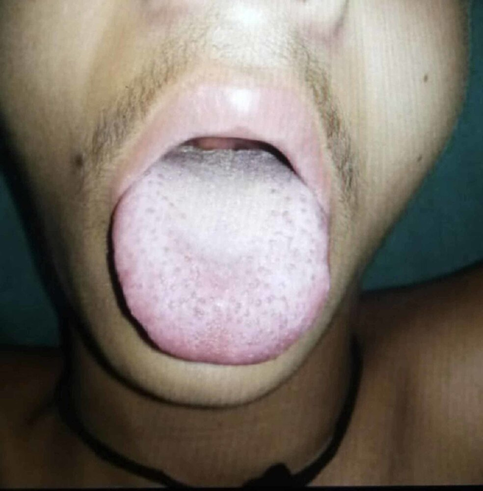
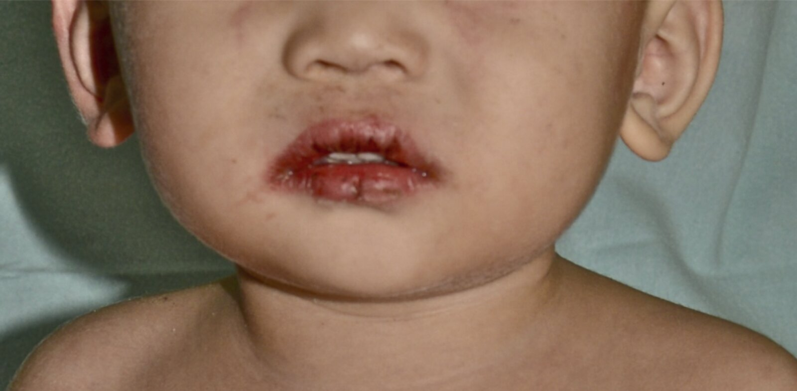
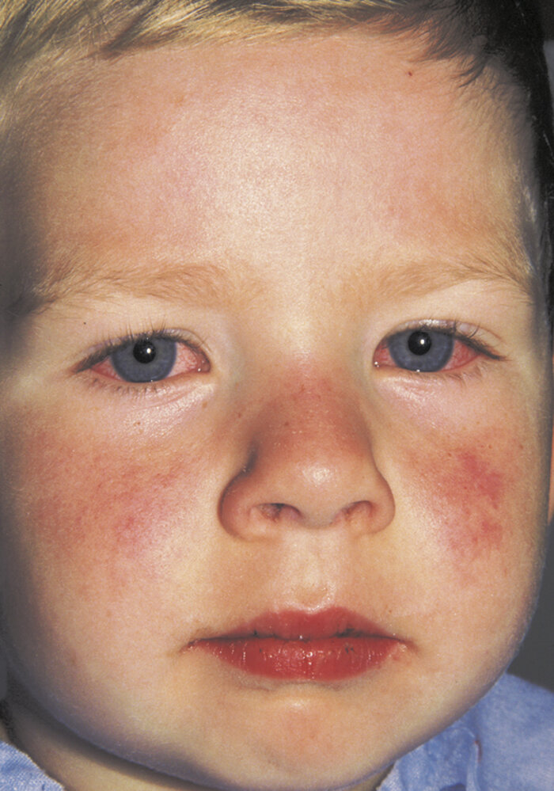
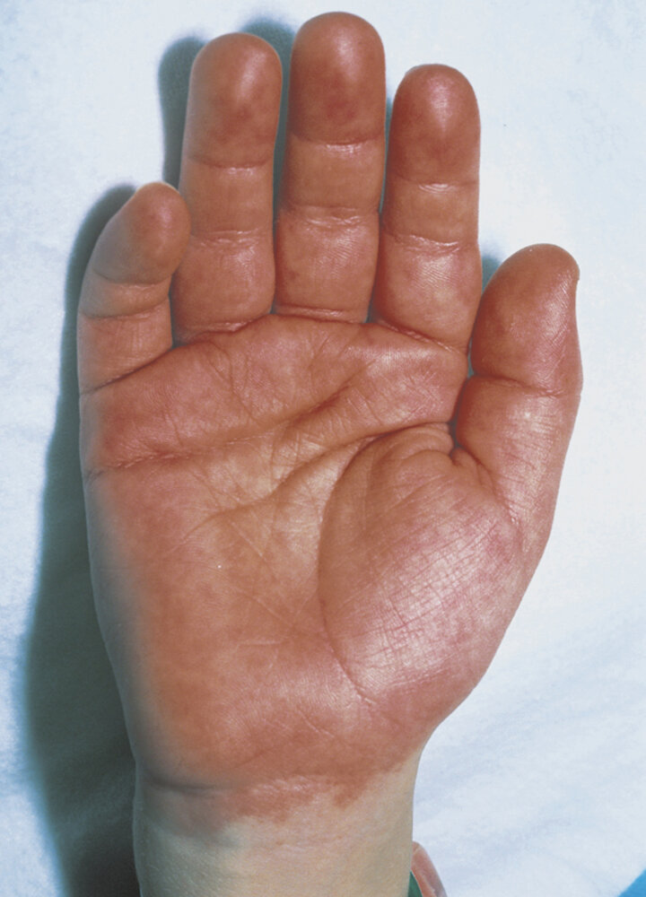
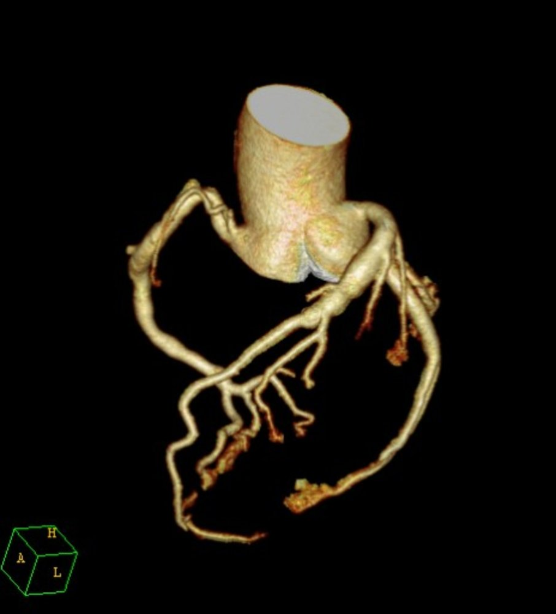

# Kawasaki disease

*Categories: Clinical knowledge > Dermatology > Allergic and immune-mediated disorders > Kawasaki disease*

[Original Article Link](https://coursology-qbank.com/amboss/article/hT0cq2)

---

## Summary

Kawasaki disease (KD) is an acute, necrotizing <u>vasculitis</u> of unknown etiology. The condition primarily affects children under the age of five and is more common among those of Asian descent. KD is characterized by high <u>fever</u>, desquamative <u>rash</u>, <u>conjunctivitis</u>, <u>mucositis</u> (e.g., <u>strawberry tongue</u>), <u>cervical lymphadenopathy</u>, as well as <u>erythema</u> and <u>edema</u> of the <u>distal</u> extremities. The most concerning manifestation is <u>coronary artery</u> <u>aneurysms</u>, which can lead to <u>myocardial infarction</u> or <u>arrhythmias</u>. KD is a <u>clinical diagnosis</u> that is supported by findings such as elevated <u>ESR</u> or evidence of cardiac involvement on <u>echocardiography</u>. Treatment with <u>intravenous immunoglobulins</u> (IVIG) and <u>aspirin</u> is essential and should be initiated as soon as possible after diagnosis.

---

## Epidemiology

* Sex: <u>♂</u> > <u>♀</u> (1.5:1) [[1]](https://coursology-qbank.com/amboss/article/JaXsl9)

* Age: : primarily children < 5 years (most common cause of acquired <u>coronary artery disease</u> in children) [[2]](https://coursology-qbank.com/amboss/article/IaXYN9)[[3]](https://coursology-qbank.com/amboss/article/bYXHn9)

* Peak <u>incidence</u>: occurs mostly in late winter and spring

* <u>Prevalence</u> [[2]](https://coursology-qbank.com/amboss/article/IaXYN9)

* Approx. 20 per 100,000 children

* Highest rate in children of Asian and Pacific-Islander descent

* Mortality: < 0.5%  [[4]](https://coursology-qbank.com/amboss/article/EaX8m9)

Epidemiological data refers to the US, unless otherwise specified.

---

## Clinical features

### Principal clinical features of Kawasaki disease  [[6]](https://coursology-qbank.com/amboss/article/BU1z2T0)

* <u>Fever</u> ≥ 5 days 

* Usually > 39°C

* Required for diagnosis

* Resolution of <u>fever</u> does not exclude KD.

* Oropharyngeal <u>mucositis</u>, e.g.,

* Strawberry tongue: <u>erythema</u> and swelling of the <u>tongue</u>

* Cracked and red <u>lips</u>

* Diffuse oropharyngeal <u>erythema</u>

* Painless bilateral <u>conjunctivitis</u> without <u>exudate</u>

* Polymorphous <u>rash</u> originating on the trunk

* <u>Erythema</u> and <u>edema</u> of hands and feet, including the palms and soles (the first week) with possible desquamation of fingertips and toes after 2–3 weeks

* Cervical <u>lymphadenopathy</u> ≥ 1.5 cm (often unilateral)

> [!TIP]
> <u>Fever</u> must last ≥ 5 days to fulfill the <u>diagnostic criteria for KD</u>. [[6]](https://coursology-qbank.com/amboss/article/BU1z2T0)

> [!NOTE]
> “CRASH and BURN”: Conjunctivitis, Rash, Adenopathy, Strawberry <u>tongue</u>, Hands and feet, and BURN (<u>fever</u> ≥ 5 days) are the most common features of KD.

> [!WARNING]
> Maintain a high index of suspicion for KD in <u>infants</u> (especially < 6 months old) and children with prolonged <u>fever</u> and any of the following: irritability, <u>aseptic meningitis</u>, unexplained <u>shock</u> (e.g., negative <u>blood cultures</u>), and <u>lymphadenopathy</u> or <u>deep neck infections</u> resistant to <u>antibiotics</u>. [[6]](https://coursology-qbank.com/amboss/article/BU1z2T0)

Clinical features of Kawasaki disease

Typical findings in Kawasaki disease

Strawberry tongue in Kawasaki disease

Kawasaki disease

### Other clinical features [[6]](https://coursology-qbank.com/amboss/article/BU1z2T0)

* Cardiovascular

* <u>Clinical features of myocarditis</u>

* <u>Clinical features of pericarditis</u>

* <u>Clinical features of acute heart failure</u>

* <u>Clinical features of peripheral vascular disease</u> including <u>gangrene</u>

* Cardiac <u>murmurs</u>

* Respiratory: retropharyngeal or parapharyngeal swelling

* Gastrointestinal: <u>nausea</u>, <u>vomiting</u>, <u>diarrhea</u>, abdominal <u>pain</u>, <u>jaundice</u>

* Musculoskeletal: <u>arthralgias</u> and other clinical features of <u>arthritis</u>

* Neurological: severe irritability, <u>facial nerve palsy</u>, <u>hearing loss</u>

* Genitourinary: groin <u>rash</u>, <u>urethritis</u>, scrotal swelling

* Ocular: <u>cells and flare</u> on <u>slit lamp examination</u>

> [!WARNING]
> Children with KD may present with <u>cardiogenic shock</u> requiring fluids and <u>vasopressors</u>. [[6]](https://coursology-qbank.com/amboss/article/BU1z2T0)

---

## Diagnosis

### Approach [[6]](https://coursology-qbank.com/amboss/article/BU1z2T0)[[7]](https://coursology-qbank.com/amboss/article/6YdjJo0)

* Determine if the patient meets <u>diagnostic criteria for classic KD</u>.

* If <u>diagnostic criteria for classic KD</u> are not met, apply the <u>diagnostic criteria for incomplete KD</u>.

* If the diagnosis remains uncertain:

* Perform serial clinical and laboratory evaluations.  [[6]](https://coursology-qbank.com/amboss/article/BU1z2T0)

* Perform <u>echocardiography</u> if <u>periungual</u> desquamation develops.

* Treat empirically if the <u>diagnostic criteria for classic KD</u> are met or the <u>diagnostic criteria for incomplete KD</u> is fulfilled on subsequent evaluation.

### Diagnostic criteria for classic KD [[6]](https://coursology-qbank.com/amboss/article/BU1z2T0)[[7]](https://coursology-qbank.com/amboss/article/6YdjJo0)

* <u>Fever</u> lasting ≥ 5 days

* Presence of ≥ 4 other <u>principal clinical features of KD</u> at any time during illness

### Diagnostic criteria for incomplete KD [[6]](https://coursology-qbank.com/amboss/article/BU1z2T0)[[7]](https://coursology-qbank.com/amboss/article/6YdjJo0)

The following criteria are consistent with recommendations from the 2017 <u>AHA</u> scientific statement on diagnosis, treatment, and long-term management of KD and the 2021 American College of Rheumatologists/<u>Vasculitis</u> Foundation guidelines for the management of KD.

* Unexplained <u>fever</u>, e.g., ≥ 5 days in patients with suggestive clinical features or ≥ 7 days in <u>infants</u> with no other identifiable cause

* < 4 other <u>principal clinical features of KD</u> at any time during illness

* Elevated <u>ESR</u> and/or <u>CRP</u> in combination with either of the following:

* ≥ 3 other characteristic laboratory findings (e.g., <u>anemia</u>, <u>thrombocytosis</u>)

* Positive <u>echocardiographic</u> findings (e.g., <u>coronary artery aneurysm</u>)

> [!TIP]
> Take a thorough history, as one or more <u>principal clinical features of KD</u> may have resolved by the time of evaluation. [[6]](https://coursology-qbank.com/amboss/article/BU1z2T0)

### Characteristic laboratory findings [[6]](https://coursology-qbank.com/amboss/article/BU1z2T0)[[7]](https://coursology-qbank.com/amboss/article/6YdjJo0)

Experts consider the following to correlate more strongly with KD than other laboratory findings:

* Elevated <u>ESR</u> and/or <u>CRP</u>

* <u>ESR</u> ≥ 40 mm/hour

* <u>CRP</u> ≥ 3.0 mg/dL

* <u>Anemia</u>: See the “<u>WHO criteria for anemia</u>” for age-based cutoffs in children.

* <u>Leukocytosis</u>: <u>WBC</u> ≥ ≥ 15,000/mm³

* <u>Thrombocytosis</u>: <u>platelets</u> ≥ 450,000/mm³ 1 week after <u>fever</u> onset

* Elevated <u>ALT</u> level

* Low <u>albumin</u> (≤ 3 g/dL)

* Elevated urine <u>WBC count</u> (≥ 10 cells/hpf)

> [!TIP]
> KD is less likely if <u>inflammatory markers</u> are normal 7 days after illness onset. [[6]](https://coursology-qbank.com/amboss/article/BU1z2T0)

### <u>Echocardiography</u> [[6]](https://coursology-qbank.com/amboss/article/BU1z2T0)[[7]](https://coursology-qbank.com/amboss/article/6YdjJo0)

* Indications

* Workup of incomplete KD

* Screening for coronary disease as soon as KD is diagnosed

* Unexplained <u>shock</u> in children

* Baseline measurements, monitoring, and follow-up of all patients with KD

* Findings  [[6]](https://coursology-qbank.com/amboss/article/BU1z2T0)

* <u>Coronary artery aneurysm</u> or dilatation

* <u>LV dysfunction</u>

* <u>Mitral regurgitation</u>

* <u>Pericardial effusion</u>

> [!WARNING]
> Do not delay treatment for <u>echocardiography</u> if clinical suspicion is high. [[6]](https://coursology-qbank.com/amboss/article/BU1z2T0)

> [!TIP]
> <u>Procedural sedation</u> may be required to optimize image quality in very young or irritable children. [[6]](https://coursology-qbank.com/amboss/article/BU1z2T0)

### Other investigations [[6]](https://coursology-qbank.com/amboss/article/BU1z2T0)

Clinical features of KD vary; the following findings may be present:

* Other <u>laboratory studies</u>: <u>hyperbilirubinemia</u>, elevated <u>lipase</u> or <u>amylase</u>

* Other cardiovascular imaging (e.g., <u>cardiac MRI</u>): abnormalities of <u>coronary arteries</u> and/or aortic root

* Nonspecific <u>ECG</u> changes

* Chest imaging: infiltrates, pulmonary <u>nodules</u>

* <u>CSF analysis</u>: <u>pleocytosis</u>, negative cultures

* Neck imaging: retropharyngeal or parapharyngeal mass

---

## Treatment

### Approach [[6]](https://coursology-qbank.com/amboss/article/BU1z2T0)[[7]](https://coursology-qbank.com/amboss/article/6YdjJo0)

Initiate treatment for all patients with classic or incomplete KD and admit them for further workup and management, including consultation with pediatric cardiology and rheumatology.

* Initial management

* Initiate treatment with IVIG and <u>ASA</u> for patients with classic or incomplete KD.

* Consider adjunctive therapy for patients at high risk of IVIG resistance or developing <u>coronary artery</u> <u>aneurysms</u> in consultation with a specialist

* Ongoing management

* Persistent or <u>recurrent fever</u> > 36 hours after IVIG infusion

* Repeat IVIG infusion.

* Consider adjunctive therapy in consultation with a specialist.

* <u>Fever</u> resolved: Monitor temperatures daily for 1–2 weeks.

* Outpatient management: Arrange repeat <u>echocardiography</u> 1–2 weeks and 4–6 weeks after treatment.

### <u>IV immunoglobulin</u> (IVIG) [[6]](https://coursology-qbank.com/amboss/article/BU1z2T0)[[7]](https://coursology-qbank.com/amboss/article/6YdjJo0)[[10]](https://coursology-qbank.com/amboss/article/Tdd66K0)

* High single-dose IVIG infusion (<u>off-label</u>) DOSAGE is indicated for all patients with classic or incomplete KD. [[6]](https://coursology-qbank.com/amboss/article/BU1z2T0)[[7]](https://coursology-qbank.com/amboss/article/6YdjJo0)

* Administer as soon as possible (preferably within 10 days of onset) to reduce the risk of <u>coronary artery</u> <u>aneurysms</u>.

* A second IVIG infusion is indicated for patients with recurrent or persistent <u>fever</u> > 36 hours after initial IVIG infusion.

> [!WARNING]
> Avoid administering <u>live vaccines</u> to patients within 11 months of IVIG treatment because of the risk of reduced <u>vaccine</u> <u>efficacy</u>. [[11]](https://coursology-qbank.com/amboss/article/fXdkxo0)

### <u>Aspirin</u> (<u>ASA</u>) [[6]](https://coursology-qbank.com/amboss/article/BU1z2T0)[[7]](https://coursology-qbank.com/amboss/article/6YdjJo0)

* Indicated for all patients with classic or incomplete KD, irrespective of age

* Dosage in acute KD can vary by institution; consult local protocols.

* High-dose <u>ASA</u> (<u>off-label</u>) DOSAGE is often given until the patient is afebrile for 48–72 hours. [[6]](https://coursology-qbank.com/amboss/article/BU1z2T0)[[7]](https://coursology-qbank.com/amboss/article/6YdjJo0)

* Moderate-dose <u>ASA</u> (<u>off-label</u>) DOSAGE or low-dose <u>ASA</u> (<u>off-label</u>) DOSAGE can be given instead of high-dose <u>ASA</u>.  [[6]](https://coursology-qbank.com/amboss/article/BU1z2T0)[[7]](https://coursology-qbank.com/amboss/article/6YdjJo0)

* Low-dose <u>ASA</u> is often continued for 6–8 weeks.  [[6]](https://coursology-qbank.com/amboss/article/BU1z2T0)[[7]](https://coursology-qbank.com/amboss/article/6YdjJo0)

> [!TIP]
> <u>ASA</u> is indicated in young children with KD. The benefit of treatment is considered to outweigh the risk of <u>ASA</u>-induced <u>Reye syndrome</u> in these patients. [[6]](https://coursology-qbank.com/amboss/article/BU1z2T0)[[7]](https://coursology-qbank.com/amboss/article/6YdjJo0)

### Adjunctive therapy [[6]](https://coursology-qbank.com/amboss/article/BU1z2T0)[[7]](https://coursology-qbank.com/amboss/article/6YdjJo0)

* Consider in consultation with a specialist for the following:

* High risk of IVIG resistance

* High risk of developing <u>coronary artery</u> <u>aneurysms</u>

* Refractory disease

* Options include:

* <u>Corticosteroids</u> (e.g., <u>prednisolone</u>, methylprednisone) [[12]](https://coursology-qbank.com/amboss/article/dddoKK0)

* Immunomodulators (e.g., <u>infliximab</u>, <u>cyclosporine</u>, <u>anakinra</u>)

---

## Complications

* <u>Coronary artery aneurysm</u> ;    [[6]](https://coursology-qbank.com/amboss/article/BU1z2T0)

* The risk of <u>aneurysms</u> is highest during the second and third weeks following symptom onset. [[6]](https://coursology-qbank.com/amboss/article/BU1z2T0)

* Rupture or <u>thrombosis</u> of the <u>aneurysm</u> can be lethal.

* <u>Myocardial infarction</u>

* <u>Myocarditis</u>

* Ventricular dysfunction

* Most commonly occurs within the first 2 weeks of onset of KD [[13]](https://coursology-qbank.com/amboss/article/ZG1ZBR0)

* Often seen in <u>infants</u> with untreated KD [[14]](https://coursology-qbank.com/amboss/article/E718nR0)

* Most commonly associated with <u>lymphocytic</u> <u>myocarditis</u>  [[13]](https://coursology-qbank.com/amboss/article/ZG1ZBR0)[[15]](https://coursology-qbank.com/amboss/article/u71pnR0)

* Manifests with symptoms (e.g., <u>tachypnea</u> or <u>diaphoresis</u> with feeding, <u>exertional dyspnea</u>) and <u>physical examination</u> findings of <u>congestive heart failure</u> (e.g., <u>hepatomegaly</u>, <u>S3 gallop</u>, <u>rales</u> or <u>crackles</u> on <u>lung auscultation</u>) [[16]](https://coursology-qbank.com/amboss/article/v71AnR0)

* Increased risk of sudden <u>death</u> [[14]](https://coursology-qbank.com/amboss/article/E718nR0)

* <u>Arrhythmias</u>

Coronary artery aneurysm in Kawasaki disease

We list the most important complications. The selection is not exhaustive.

---