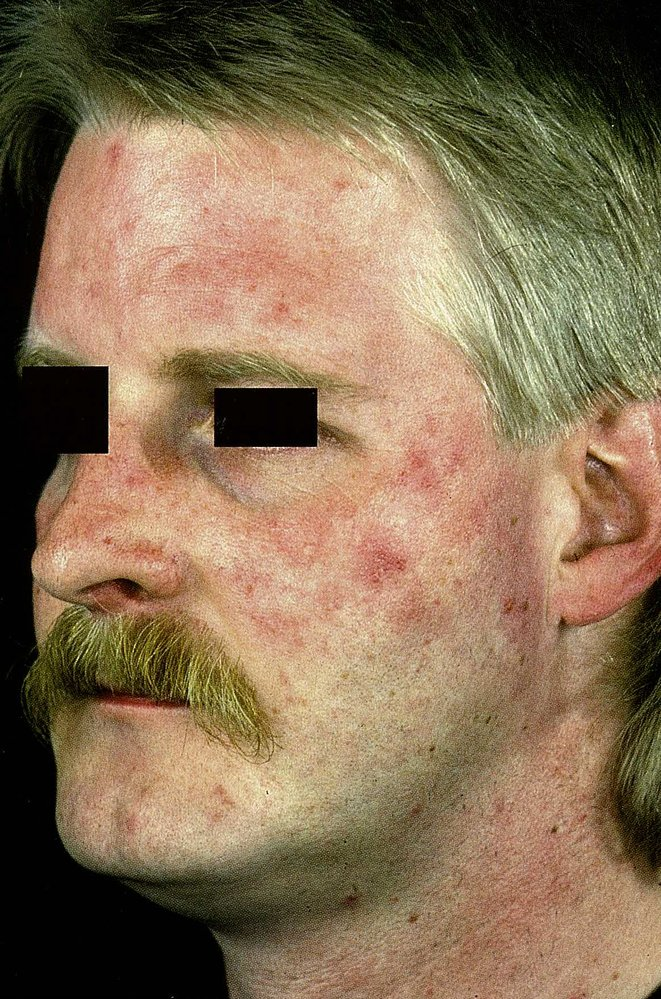
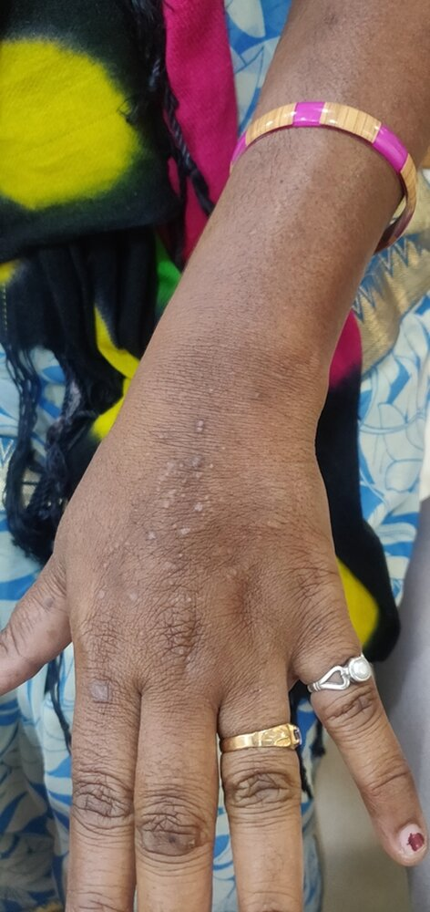
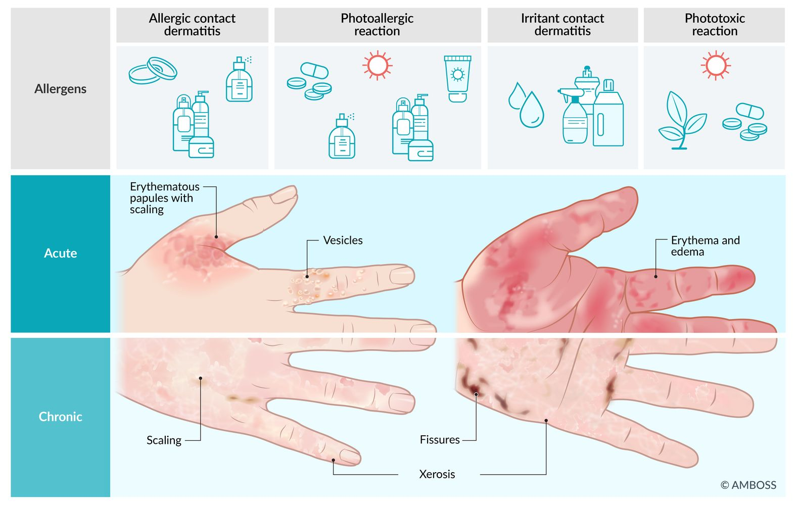
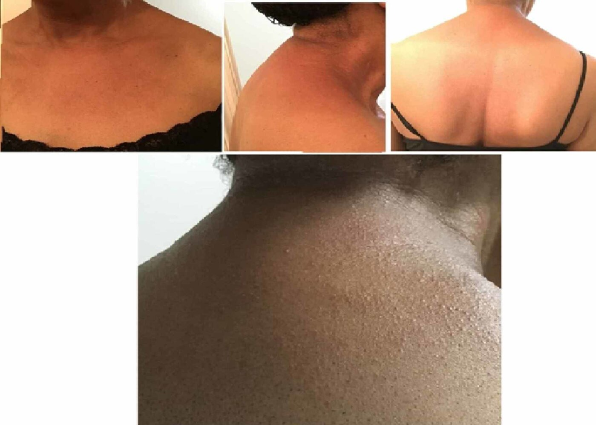
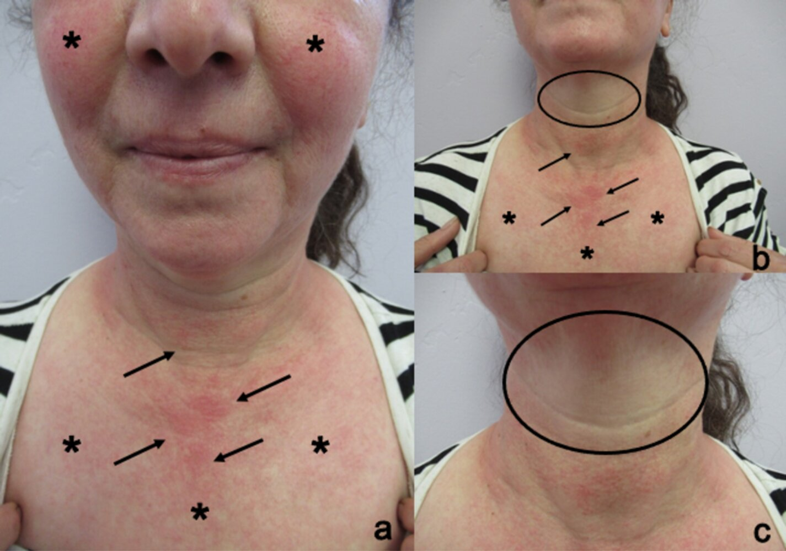
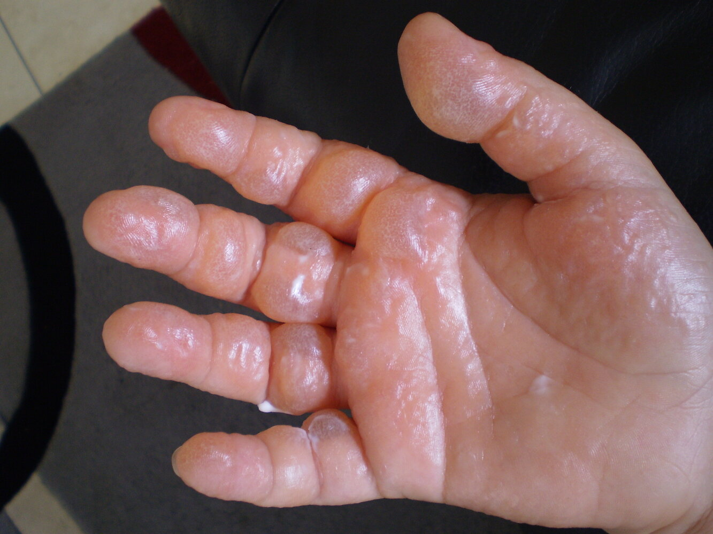
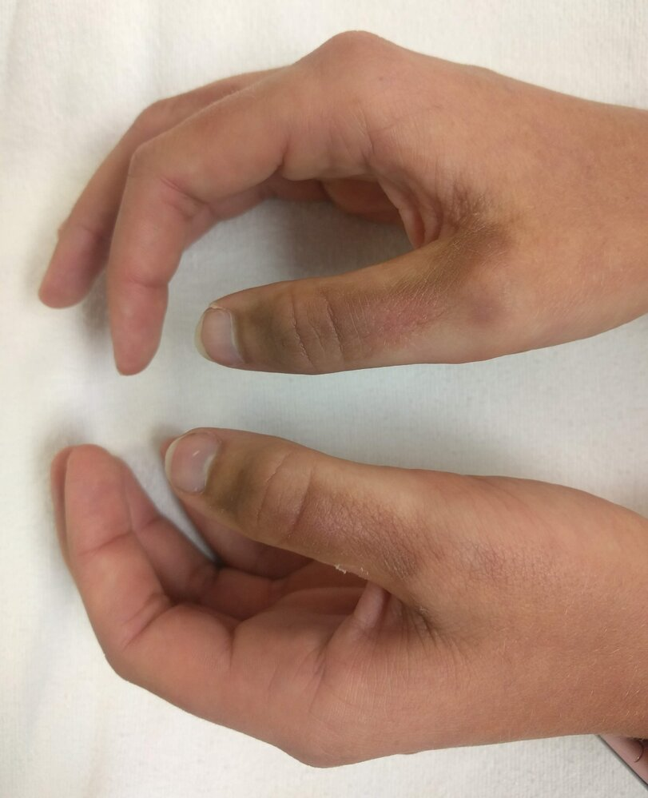

# Photodermatoses

*Categories: Clinical knowledge > Dermatology > Allergic and immune-mediated disorders > Photodermatoses*

[Original Article Link](https://coursology-qbank.com/amboss/article/dk0o5T)

---

## Summary

Photodermatoses (<u>photosensitivity</u> disorders) are a group of <u>skin</u> conditions that result from an abnormal reaction to <u>UV light</u> and can be categorized as either primary or <u>secondary photodermatoses</u> depending on the specific cause. <u>Primary photodermatoses</u> are induced by immune-mediated reactions (e.g., as in <u>polymorphous light eruption</u>) or stem from chemical/drug exposure. <u>Secondary photodermatoses</u> result from underlying disorders (e.g., genetic diseases, <u>photoaggravated dermatoses</u>) that increase an individual's susceptibility to adverse UV reactions. Most photodermatoses present as an <u>erythematous</u> <u>rash</u> on areas of sun-exposed <u>skin</u>. A careful history and full <u>skin examination</u> are required to differentiate between the types. In the case of diagnostic uncertainty, further workup includes <u>laboratory studies</u> for underlying causes, <u>skin biopsy</u>, and <u>phototesting</u>. The <u>general management of photodermatoses</u> for both adults and children involves supportive therapy for symptom relief, <u>photoprotective measures</u>, and avoidance of triggers (e.g., <u>phototoxic agents</u>). Further treatment, if required, is usually overseen by a specialist and may include <u>phototherapy</u> and <u>immunosuppressive therapy</u>.

The diagnosis and management of <u>sunburn</u> are discussed in a separate article.

---

## Approach to suspected photodermatoses

### General principles

* Most photodermatoses present as an <u>erythematous</u> <u>rash</u> in sun-exposed areas.

* Careful history-taking is usually sufficient to establish a <u>clinical diagnosis</u>; further studies are reserved for diagnostic uncertainty.

* The initial <u>general management of photodermatoses</u> is the same for all forms of the disease.

### Clinical evaluation

* Focused history [[1]](https://coursology-qbank.com/amboss/article/EM18qh0)

* Time since exposure to sun or artificial light

* Use of medications, creams/cosmetics, or contact with plants

* History of intense <u>pruritus</u>

* Symptom improvement during the winter months and with less exposure to the sun

* <u>Family history</u> of photodermatoses

* <u>Physical examination</u>

* <u>Erythematous</u> <u>rash</u> and swelling on sun-exposed areas (e.g., face, upper neck, or back)   [[1]](https://coursology-qbank.com/amboss/article/EM18qh0)[[2]](https://coursology-qbank.com/amboss/article/uM1pqh0)

* Possible <u>primary skin lesions</u> (e.g., <u>vesicle</u>, <u>blister</u>)

> [!TIP]
> The <u>rash</u> in photodermatoses usually spares <u>skin</u> folds and areas covered with jewelry or clothes. [[2]](https://coursology-qbank.com/amboss/article/uM1pqh0)

### Diagnostics of photodermatoses [[2]](https://coursology-qbank.com/amboss/article/uM1pqh0)[[4]](https://coursology-qbank.com/amboss/article/kIYm1q)[[5]](https://coursology-qbank.com/amboss/article/bn1H7h0)

* Photodermatoses are typically a <u>clinical diagnosis</u>. [[1]](https://coursology-qbank.com/amboss/article/EM18qh0)

* For diagnostic uncertainty:

* Consider <u>laboratory studies</u>, e.g.:

* Plasma <u>porphyrins</u> for <u>porphyria cutanea tarda</u>

* <u>ANA</u>, <u>anti-Ro</u>, and <u>anti-La antibodies</u> for <u>SLE</u>

* Perform a <u>skin biopsy</u>.

* Consider challenge-rechallenge testing, where a suspected agent is withdrawn and then reintroduced to see if a recurrence occurs.

* Refer to a specialist for <u>phototesting</u> and/or additional studies to evaluate for <u>secondary photodermatoses</u>.

#### Phototesting [[2]](https://coursology-qbank.com/amboss/article/uM1pqh0)[[5]](https://coursology-qbank.com/amboss/article/bn1H7h0)

* Definition: a collection of studies that assess the reaction of the <u>skin</u> when exposed to UV radiation

* Indication: diagnostic confirmation for patients with suspected <u>primary photodermatoses</u>

* Methods

* Minimal erythema dose (MED) testing

* Different <u>skin</u> fields are exposed to increasing UV doses to determine the <u>threshold dose</u> to trigger.

* Serial readings of the <u>erythema</u> are indicated every few hours.

* Photoprovocation test

* A test that aims to reproduce photodermatoses

* Performed by repeatedly exposing a patient to fixed doses of UV radiation for a period of at least 3 days

* Photopatch testing

* A study used to identify <u>photoallergens</u>

* Suspected agents are applied to the <u>skin</u> in duplicate sets, with one set being exposed to UV radiation and the other not exposed and used for control.

> [!TIP]
> <u>Phototesting</u> is not always available and <u>challenge-rechallenge testing</u> may be required as an alternative. [[2]](https://coursology-qbank.com/amboss/article/uM1pqh0)

### General management of photodermatoses

* Start supportive therapy for photodermatoses. [[4]](https://coursology-qbank.com/amboss/article/kIYm1q)[[6]](https://coursology-qbank.com/amboss/article/wM1hIh0)

* <u>Pruritus</u>: Recommend <u>antihistamines</u> and cold compresses.

* <u>Erythema</u>: Consider <u>topical corticosteroids</u>.

* Advise patients to avoid UV radiation;  when possible and use <u>photoprotective measures</u> if exposure is unavoidable. [[5]](https://coursology-qbank.com/amboss/article/bn1H7h0)[[7]](https://coursology-qbank.com/amboss/article/y0WdiP0)[[8]](https://coursology-qbank.com/amboss/article/vM1Aqh0)

* When possible, stop medications that may be contributing to phototoxic or photoallergic reactions.

* Refer patients to a specialist (e.g., dermatologist, immunologist) if symptoms persist.

---

## Immune-mediated photodermatoses

Immune-mediated (<u>idiopathic</u>) photodermatoses result from an abnormal <u>immune response</u> to UVR exposure. <u>Polymorphous light eruption</u> is the most common type of immune-mediated photodermatosis and the most ubiquitous photodermatosis overall; other forms of immune-mediated photodermatoses are comparatively rare. [[2]](https://coursology-qbank.com/amboss/article/uM1pqh0)

---

## Polymorphous light eruption

### Etiology [[5]](https://coursology-qbank.com/amboss/article/bn1H7h0)

An acquired photodermatosis characterized by a pathological response to UV exposure

### <u>Epidemiology</u>

* Most common type of photodermatoses in both adults and children [[1]](https://coursology-qbank.com/amboss/article/EM18qh0)[[2]](https://coursology-qbank.com/amboss/article/uM1pqh0)

* Predominantly affects genetically-predisposed individuals and those with a darker <u>skin</u> tone [[2]](https://coursology-qbank.com/amboss/article/uM1pqh0)[[3]](https://coursology-qbank.com/amboss/article/_UW5fk0)[[4]](https://coursology-qbank.com/amboss/article/kIYm1q)

* Typically worse during the spring and summer [[5]](https://coursology-qbank.com/amboss/article/bn1H7h0)

### Pathophysiology [[2]](https://coursology-qbank.com/amboss/article/uM1pqh0)

* Most likely a <u>cell-mediated immune response</u> resembling a <u>delayed-type hypersensitivity reaction</u>

* Presumably caused by a reaction to autoantigens that arise from UV exposure

### Clinical features [[2]](https://coursology-qbank.com/amboss/article/uM1pqh0)

* <u>Erythematous</u> <u>rash</u>

* <u>Papules</u>, <u>plaques</u>, and <u>vesicles</u> may be present.

* Usually pruritic

* Common sites involved:

* Sun-exposed areas

* <u>Ears</u> in children; this variant is known as juvenile spring eruption.

* Develops minutes to hours (can be days) after the first high-intensity UV exposure in the spring or the summer

* Without continuous sun exposure: resolves within a week

* Symptoms usually:

* Improve over the summer because of UVR-induced immunologic tolerance (photohardening)

* Recur annually (always at the same anatomical sites and after the first sun exposure)

Polymorphous light eruption

Polymorphous light eruption

### Diagnostics [[2]](https://coursology-qbank.com/amboss/article/uM1pqh0)[[5]](https://coursology-qbank.com/amboss/article/bn1H7h0)

* PLE is primarily a <u>clinical diagnosis</u>.

* See also “<u>Diagnostics of photodermatoses</u>.”

* <u>Skin biopsy</u> findings include <u>spongiosis</u>, cellular infiltration predominantly with <u>lymphocytes</u>, and possible vesiculation. [[5]](https://coursology-qbank.com/amboss/article/bn1H7h0)

* Results from <u>MED testing</u> and <u>photopatch testing</u> are typically normal. [[2]](https://coursology-qbank.com/amboss/article/uM1pqh0)

### Management [[5]](https://coursology-qbank.com/amboss/article/bn1H7h0)

* Start <u>general management of photodermatoses</u>, including <u>photoprotective measures</u>.

* Refer to a dermatologist for additional management, which may include:

* <u>Corticosteroids</u> (oral or topical) [[1]](https://coursology-qbank.com/amboss/article/EM18qh0)[[4]](https://coursology-qbank.com/amboss/article/kIYm1q)

* <u>Phototherapy</u> to accelerate <u>photohardening</u>

* Preferred: narrowband <u>UVB phototherapy</u> [[1]](https://coursology-qbank.com/amboss/article/EM18qh0)[[5]](https://coursology-qbank.com/amboss/article/bn1H7h0)

* Alternative: <u>PUVA</u> therapy [[1]](https://coursology-qbank.com/amboss/article/EM18qh0)[[5]](https://coursology-qbank.com/amboss/article/bn1H7h0)

* <u>Immunosuppressive agents</u> (e.g., <u>azathioprine</u>, <u>cyclosporine</u>) for refractory disease

> [!TIP]
> Starting <u>phototherapy</u> in the spring can help prevent symptoms during the summer. [[4]](https://coursology-qbank.com/amboss/article/kIYm1q)

---

## Drug or chemical-induced photodermatoses

### Overview

* Drug or chemical-induced photodermatoses are those caused by exposure (either topical or oral) to a photosensitizer

* Photosensitizers may be either <u>phototoxic agents</u> or <u>photoallergens</u>

* While the etiology, pathophysiology, and clinical features vary between the conditions, the diagnostics and management are the same.

Contact dermatitis - triggers and clinical presentation

| Overview of drug or chemical-induced photodermatoses |  |  |  |  |
| --- | --- | --- | --- | --- |
|  |  | Etiology | Pathophysiology | Clinical features |
|  <u>Phototoxic reactions</u> [[2]](https://coursology-qbank.com/amboss/article/uM1pqh0)  |  Drug-induced <u>phototoxic reactions</u> [[2]](https://coursology-qbank.com/amboss/article/uM1pqh0)  |  * Exposure to <u>phototoxic agents</u>, e.g.: [[1]](https://coursology-qbank.com/amboss/article/EM18qh0)[[2]](https://coursology-qbank.com/amboss/article/uM1pqh0)  * Systemic drugs including <u>tetracyclines</u> (especially <u>doxycycline</u>), <u>hydrochlorothiazide</u>, <u>amiodarone</u>, and <u>sulfonamides</u> .  * Topical drugs  * Sunscreen   |   * Drug metabolites interact with <u>UV light</u> (usually triggered by UVA) → <u>free radical</u> release → direct tissue or <u>cell injury</u> → severe <u>rash</u>  * Occurs without pre-sensitization to the drug    |   * Severe <u>sunburn</u>-like <u>rash</u>, possibly with <u>vesicles</u> or <u>bullae</u>  * Occurs within minutes to hours of sun exposure  * Localization: sun-exposed areas of the <u>skin</u>    |
| Phytophotodermatitis |  * Exposure to <u>phototoxic agents</u>, i.e.: plant compounds furocoumarin (e.g., psoralen)  * Direct <u>skin</u> contact with the plant  [[1]](https://coursology-qbank.com/amboss/article/EM18qh0)[[8]](https://coursology-qbank.com/amboss/article/vM1Aqh0)[[13]](https://coursology-qbank.com/amboss/article/Zn1Z7h0)  * Berloque dermatitis: a type of photodermatitis elicited by the use of perfume or products with bergamot oils (aromatherapy) [[13]](https://coursology-qbank.com/amboss/article/Zn1Z7h0)   |  * <u>Skin</u> contact with photosensitizing agents (psoralen) from a plant → phototoxic reaction upon UVA exposure   |   * Localization: sun-exposed areas of the <u>skin</u> (most often the extremities)  * <u>Rash</u>  * Stripe-like or reticulate <u>rash</u>; usually correlates to plant shape or forms a brush pattern resembling handprints or fingerprints  * 24–48 hours after contact: redness and <u>blistering</u>; most severe after three days  * Resolution after 2–4 weeks with <u>hyperpigmentation</u> that may be visible for months  * Itching, burning <u>pain</u>    |  |
|  <u>Photoallergic reaction</u> [[2]](https://coursology-qbank.com/amboss/article/uM1pqh0)  |  |  * <u>Delayed hypersensitivity reaction</u> to <u>photoallergens</u>   |  * <u>T-cell mediated delayed hypersensitivity</u> (type IV) after epicutaneous or oral contact with photosensitizing agents and typically UVA radiation   |   * The <u>skin</u> changes are limited to areas that were exposed to UVA radiation and were in contact with the photosensitizing agent.  * <u>Rash</u>: <u>erythema</u> and <u>papules</u>, rarely <u>vesicles</u>    |

> [!TIP]
> <u>Phytophotodermatitis</u> can typically be differentiated from <u>sunburn</u> by a longer <u>latency period</u> before <u>erythema</u> develops, and the pattern of the <u>rash</u>, which is usually localized rather than generalized.

Drug-induced phototoxic reaction

Drug-induced phototoxic reaction

Phytophotodermatitis

Phytophotodermatitis

### Diagnostics [[2]](https://coursology-qbank.com/amboss/article/uM1pqh0)

* Primarily a <u>clinical diagnosis</u> [[8]](https://coursology-qbank.com/amboss/article/vM1Aqh0)

* Diagnostic uncertainty: See “<u>Diagnostics of photodermatoses</u>.” [[2]](https://coursology-qbank.com/amboss/article/uM1pqh0)

* <u>Skin biopsy</u> findings [[2]](https://coursology-qbank.com/amboss/article/uM1pqh0)

* <u>Phototoxic reaction</u>: <u>keratinocyte</u> <u>necrosis</u> and infiltration of <u>neutrophils</u> and <u>lymphocytes</u>

* <u>Photoallergic reaction</u>: acute <u>spongiotic dermatitis</u>

* <u>Photopatch testing</u> [[2]](https://coursology-qbank.com/amboss/article/uM1pqh0)

* Patients with <u>allergic contact dermatitis</u> will react on both the control and UV-exposed patch.

* Patients with <u>photoallergy</u> will react only on the UV-exposed patch.

> [!TIP]
> <u>Phytophotodermatitis</u> is the most common <u>phototoxic reaction</u> in children. [[1]](https://coursology-qbank.com/amboss/article/EM18qh0)

### Management [[2]](https://coursology-qbank.com/amboss/article/uM1pqh0)[[8]](https://coursology-qbank.com/amboss/article/vM1Aqh0)

* If possible, avoid exposure or discontinue the <u>phototoxic agent</u> or <u>photoallergen</u>. [[1]](https://coursology-qbank.com/amboss/article/EM18qh0)

* Start <u>general management of photodermatoses</u>; note, some sunscreens can cause a <u>photoallergic reaction</u>. [[1]](https://coursology-qbank.com/amboss/article/EM18qh0)

* For <u>skin</u> exposed to a phytophototoxin: Rinse the <u>skin</u> with water within 2 hours of exposure to reduce the intensity of the reaction. [[8]](https://coursology-qbank.com/amboss/article/vM1Aqh0)

* Severe <u>phototoxic reactions</u> (> 30% <u>body surface area estimation</u>): Consider hospitalization for intense <u>wound care</u>. [[8]](https://coursology-qbank.com/amboss/article/vM1Aqh0)

> [!WARNING]
> Sunscreen can cause photoallergic reactions; patients should avoid products containing common <u>photoallergens</u> such as oxybenzone and dibenzoylmethanes. [[2]](https://coursology-qbank.com/amboss/article/uM1pqh0)

---