# Raynaud phenomenon

*Categories: Clinical knowledge > Dermatology > Allergic and immune-mediated disorders > Raynaud phenomenon*

[Original Article Link](https://coursology-qbank.com/amboss/article/Uh0bWf)

---

## Summary

<u>Raynaud</u> phenomenon (RP) is an exaggerated vasoconstrictive response of <u>distal</u> <u>arteries</u> and <u>arterioles</u> (most commonly in the fingers and toes) to cold or emotional <u>stress</u>. <u>Primary RP</u> is <u>idiopathic</u>, whereas <u>secondary RP</u> is caused by underlying systemic diseases (e.g., <u>mixed connective tissue disease</u>, <u>vasculitides</u>, medications). Both types typically manifest with the sequential discoloration of fingers and/or toes from white (<u>ischemia</u>) to purple-blue (<u>hypoxia</u>) to red (reactive <u>hyperemia</u>). Episodes of <u>vasoconstriction</u> usually last for 15–20 minutes after removal of the trigger. <u>Ischemic</u> episodes in <u>secondary RP</u> can be more prolonged, leading to tissue loss (<u>ischemic</u> <u>ulcers</u>) and rarely, <u>gangrene</u>. Trigger avoidance is the main aspect of managing RP. In patients with <u>secondary RP</u>, the underlying etiology should be identified and treated. Pharmacotherapy (preferably with <u>calcium channel blockers</u>) may be considered for RP refractory to trigger avoidance. Intravenous <u>prostaglandins</u> or interventional therapy (e.g., selective digital sympathectomy) may be required for patients with severe or refractory disease.

---

## Etiology

### Overview [[1]](https://coursology-qbank.com/amboss/article/NWY-lL)[[2]](https://coursology-qbank.com/amboss/article/TYa6oQ)[[3]](https://coursology-qbank.com/amboss/article/gkaFMk)

* Vasospastic attack triggered by cold or emotional <u>stress</u>

* More common in female individuals

### Primary Raynaud phenomenon (previously called <u>Raynaud disease</u>)

* <u>Idiopathic</u> (no identifiable vascular changes); possible genetic susceptibility  [[1]](https://coursology-qbank.com/amboss/article/NWY-lL)

* Vasospasms of the digital <u>arteries</u> and <u>arterioles</u>

* Onset usually < 30 years of age

### Secondary Raynaud phenomenon (previously called <u>Raynaud syndrome</u>)

* Vasospasms due to arteriolar changes in the fingers (and/or toes), which may be precipitated by the following:

* Drugs: <u>beta blockers</u>, <u>ergotamine</u>, <u>bleomycin</u>

* Smoking

* Occupational trauma: from handling vibrating tools, typing

* Hyperviscocity: <u>polycythemia</u>, paraproteinemias (<u>plasmacytoma</u>, <u>Waldenstrom macroglobulinemia</u>), <u>cryoglobulinemia</u>, <u>cold agglutinin disease</u>

* <u>Vasculitides</u>: e.g., <u>Buerger disease</u>

* <u>Connective tissue diseases</u> (<u>CTDs</u>): e.g., <u>scleroderma</u> (<u>CREST syndrome</u>), <u>systemic lupus erythematosus</u>, mixed <u>CTDs</u>, <u>Sjogren syndrome</u>

* Arterial disease: e.g., <u>peripheral artery disease</u>

* <u>Frostbite</u>

* Neurological disease: e.g., <u>carpal tunnel syndrome</u>, <u>intervertebral disc</u> disease

* Onset usually ≥ 30 years of age

---

## Clinical features

### Classic presentation [[1]](https://coursology-qbank.com/amboss/article/NWY-lL)[[4]](https://coursology-qbank.com/amboss/article/yU1dfT0)[[5]](https://coursology-qbank.com/amboss/article/Y01ne20)

* Most commonly affects the fingers and toes bilaterally (may be asynchronous and asymmetric)

* The thumb is typically spared in <u>primary RP</u>. [[1]](https://coursology-qbank.com/amboss/article/NWY-lL)[[4]](https://coursology-qbank.com/amboss/article/yU1dfT0)

* Can also affect <u>ears</u>, nose, areolar tissue, <u>tongue</u> (uncommon)

* Classic triphasic presentation

* <u>Ischemic</u> phase (white): exposure to trigger → <u>vasoconstriction</u> of digital <u>arteries</u> and <u>arterioles</u> → <u>ischemia</u> and <u>pallor</u>

* <u>Hypoxic</u> phase (blue): deoxygenation of residual blood → <u>cyanosis</u>

* <u>Hyperemic</u> phase (red): restoration of reduced blood flow → reactive <u>hyperemia</u>

* <u>Livedo reticularis</u> may occur during episodes.

* Rewarming is associated with transient numbness, <u>pain</u>, and/or paraesthesias in the affected areas.

> [!TIP]
> An episode does not always involve all three phases; often, blood flow is restored without causing reactive <u>hyperemia</u>. [[1]](https://coursology-qbank.com/amboss/article/NWY-lL)

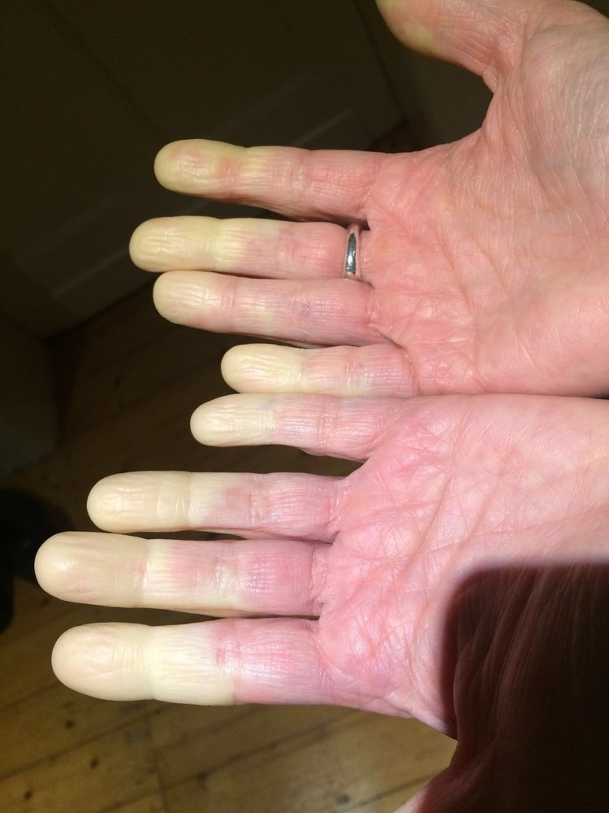

Raynaud phenomenon (ischemic phase)

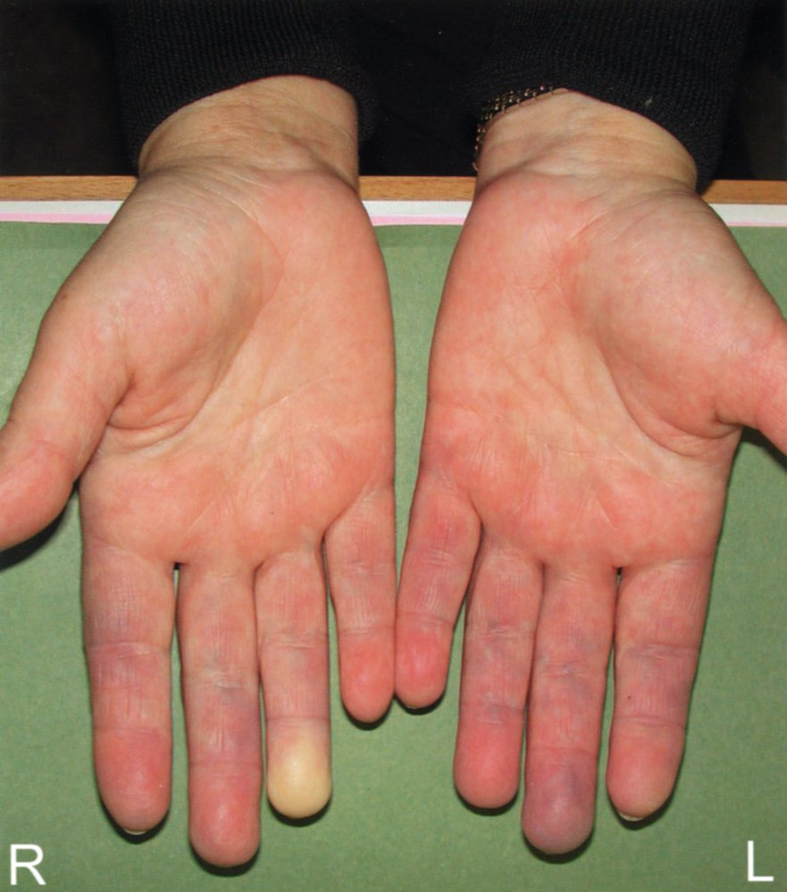

Raynaud phenomenon

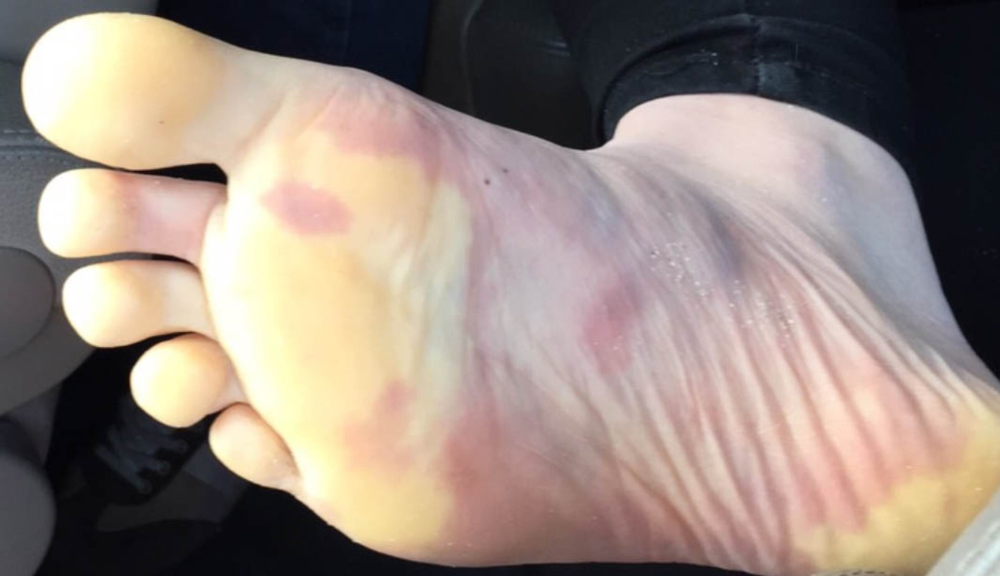

Raynaud's phenomenon

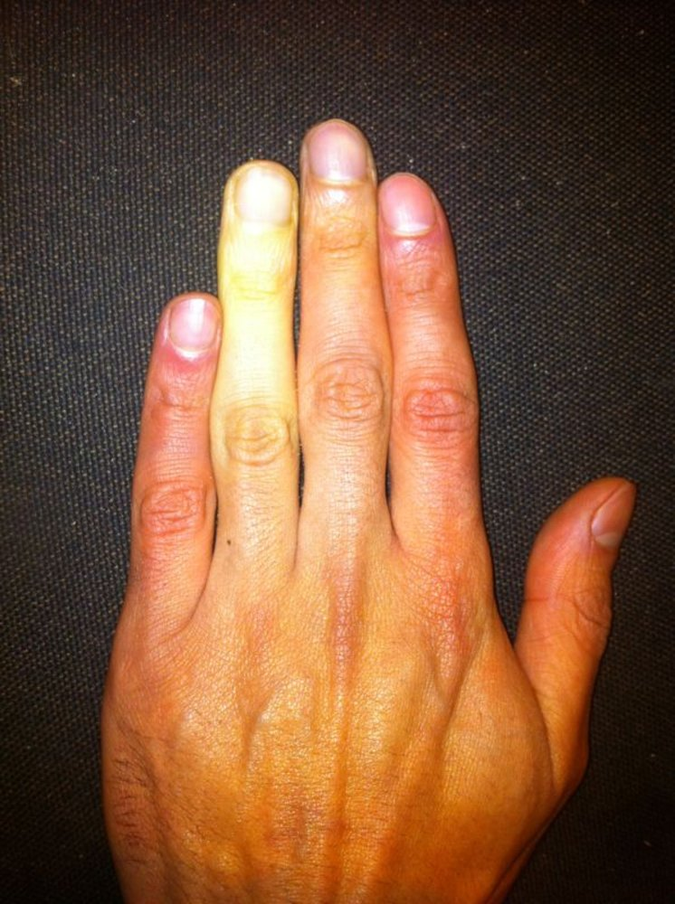

Raynaud phenomenon

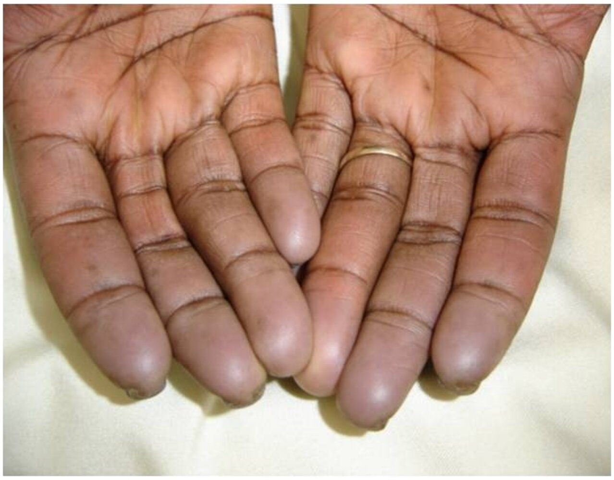

Raynaud phenomenon

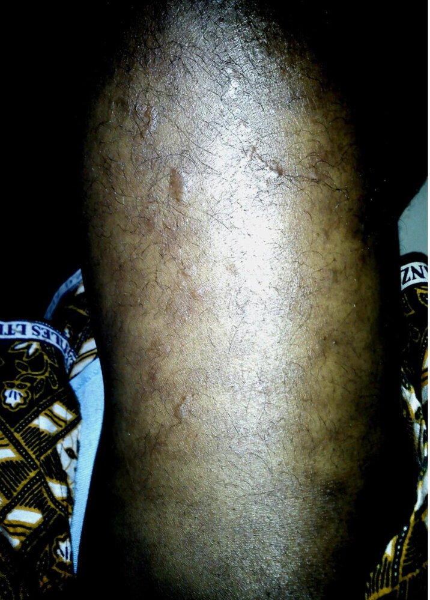

Livedo reticularis

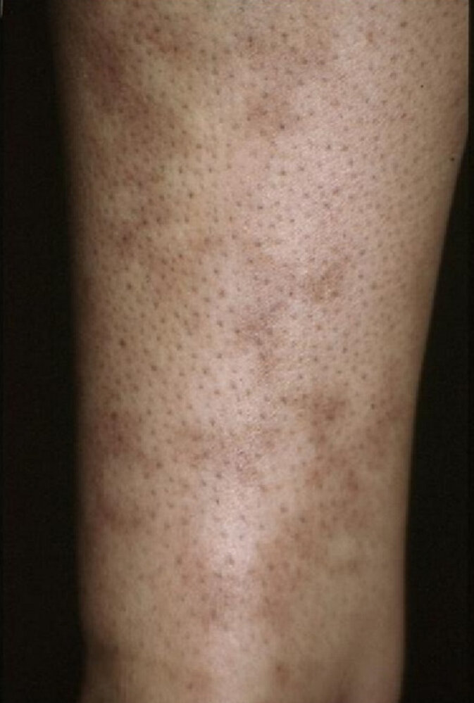

Livedo reticularis

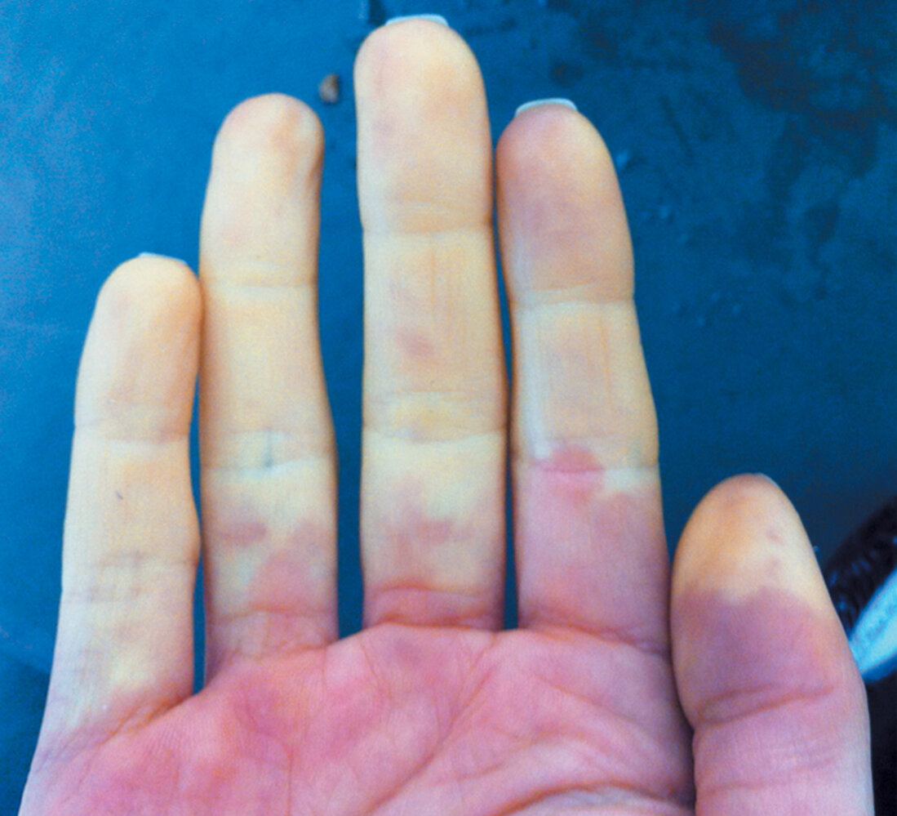

### Duration [[1]](https://coursology-qbank.com/amboss/article/NWY-lL)[[5]](https://coursology-qbank.com/amboss/article/Y01ne20)

* Vasospastic episodes are usually reversible.

* Symptoms normally subside within an hour (typically 15–20 minutes after cessation of trigger exposure). [[1]](https://coursology-qbank.com/amboss/article/NWY-lL)

* Can potentially last for several hours

### Associated findings [[1]](https://coursology-qbank.com/amboss/article/NWY-lL)[[5]](https://coursology-qbank.com/amboss/article/Y01ne20)

* In <u>primary RP</u>: symptoms of systemic vasospasm (e.g., <u>migraine</u>, <u>irritable bowel syndrome</u>) [[1]](https://coursology-qbank.com/amboss/article/NWY-lL)

* In <u>secondary RP</u>:

* Severe <u>pain</u> and <u>ulcerations</u>/<u>necrosis</u> due to critical <u>ischemia</u>

* Signs of associated systemic disease (e.g., telangiectases, <u>skin</u> <u>fibrosis</u>, <u>sclerodactyly</u>, calcinosis, <u>photosensitivity</u>, patchy <u>alopecia</u>)

* <u>Clinical features of peripheral arterial disease</u> are absent: Pulses, <u>Allen test</u>, and bilateral BP readings are normal in both primary and <u>secondary RP</u>.

> [!WARNING]
> Trophic changes are uncommon in <u>primary RP</u>. Irreversible <u>ischemia</u> with tissue damage indicates <u>secondary RP</u> and requires further investigation to identify the underlying cause. [[1]](https://coursology-qbank.com/amboss/article/NWY-lL)

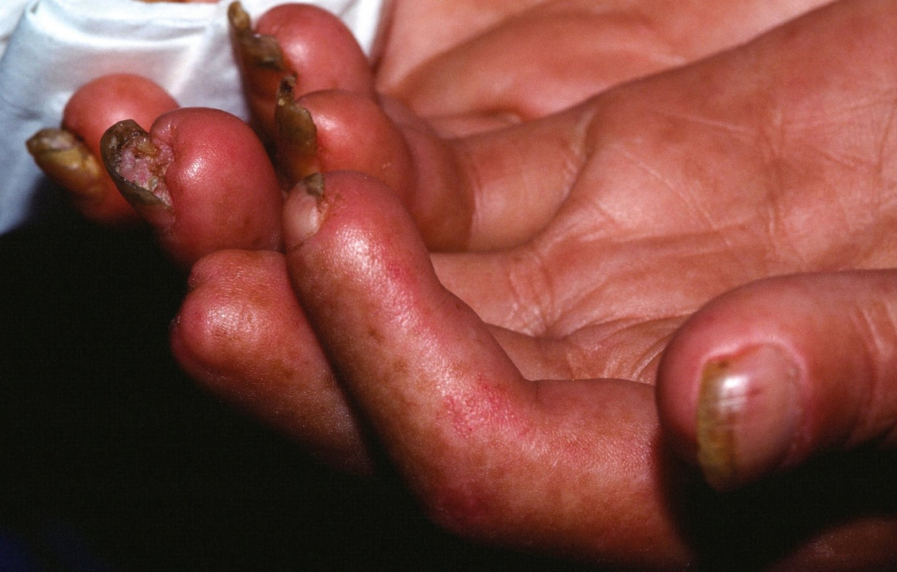

Sclerodactyly in systemic sclerosis

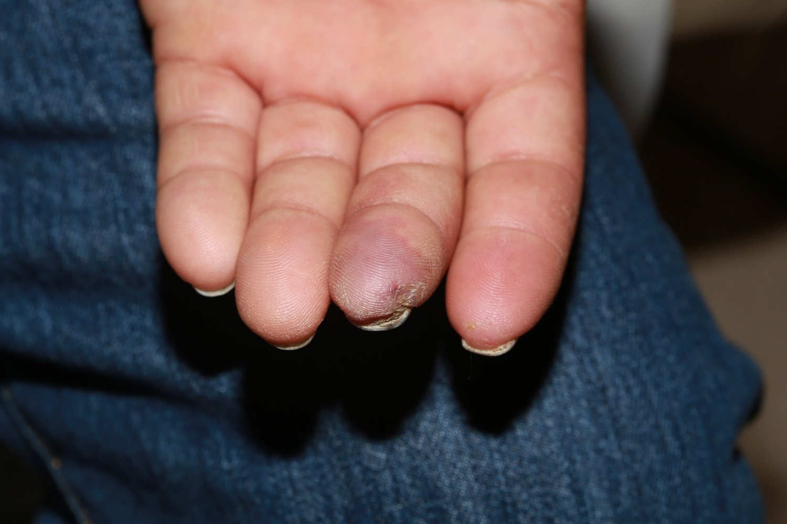

Raynaud phenomenon

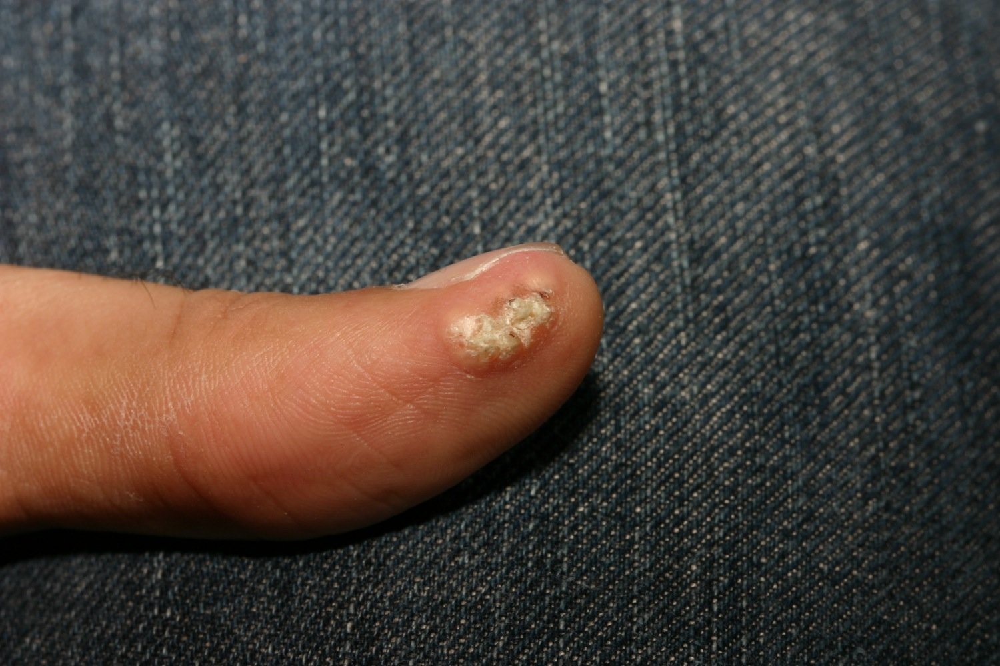

Calcinosis cutis

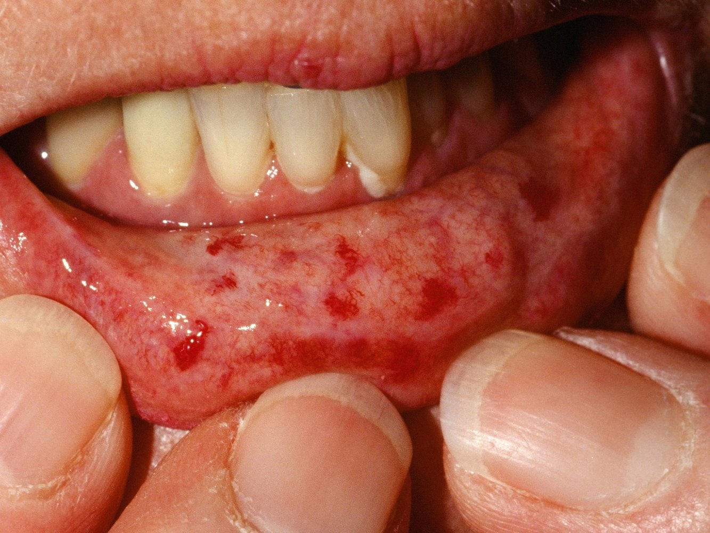

Telangiectasia in CREST syndrome

---

## Differential diagnoses

### <u>Perniosis</u> (<u>chilblains</u>) [[11]](https://coursology-qbank.com/amboss/article/2X1Tx20)[[12]](https://coursology-qbank.com/amboss/article/hX1cB20)[[13]](https://coursology-qbank.com/amboss/article/RX1lB20)

* Erythrocyanotic <u>papules</u> or <u>nodules</u>, predominantly on the hands, fingers, toes, legs, and face on exposure to cold

* Lesions appear 12–24 hours after exposure to cold and last for 1–3 weeks.

* Typically seasonal (colder months)

* See “<u>Nonfreezing cold injuries</u>” for details.

### <u>Acrocyanosis</u>

* No triphasic color response like in RP, nonparoxysmal manifestation (often persistent)

* Recurrent or frequently persistent bluish/<u>cyanotic</u> discoloration of the peripheral extremities

* Usually triggered and/or aggravated by exposure to cold temperatures, most cases improve in summer.

* See "<u>Acrocyanosis</u>" for details.

### Erythromelalgia [[14]](https://coursology-qbank.com/amboss/article/Za1ZQ20)[[15]](https://coursology-qbank.com/amboss/article/0a1eQ20)

* Rare condition characterized by episodes of hyperperfusion that affect the feet and less commonly the hands

* Symptoms include intense burning <u>pain</u>, <u>erythema</u>, warmth, and swelling of the affected areas.

* Triggers include warmth and physical activity.

* May be primary (genetically determined) or secondary to <u>myeloproliferative disorders</u>, <u>CTD</u>, cancer, infections, or <u>poisoning</u>.

### <u>Peripheral artery disease</u> (<u>PAD</u>)

* Exercise-induced <u>pain</u> (may also be persistent)

* Cold and pale extremities

* Diminished or absent radial or <u>ulnar artery</u> <u>pulse</u>

* Can be a cause of <u>secondary RP</u> (functional vasospasm), but must be considered as an independent differential diagnosis.

### <u>Acute arterial occlusion of an extremity</u>

* Acute onset as in RP, but not episodic or <u>self-limiting</u>

* The “<u>6 Ps</u>” of clinical presentation: <u>Pain</u>, <u>Pallor</u>, Pulselessness, <u>Paresthesia</u>, <u>Paralysis</u>, <u>Poikilothermia</u>

### <u>Thoracic outlet syndrome</u> [[9]](https://coursology-qbank.com/amboss/article/vL1Azh0)[[16]](https://coursology-qbank.com/amboss/article/_L15Z30)

* Typically unilateral

* Can be a cause of <u>secondary RP</u> (due to compression of the <u>sympathetic</u> nerves)

The differential diagnoses listed here are not exhaustive.

---

## Treatment

### Approach [[1]](https://coursology-qbank.com/amboss/article/NWY-lL)[[4]](https://coursology-qbank.com/amboss/article/yU1dfT0)

* First line management in all patients: trigger avoidance and lifestyle measures to minimize vasospastic attacks

* Persistent symptoms 

* Consider pharmacotherapy.

* Consider interventional therapies in patients with refractory disease and surgical treatment when indicated.

* <u>Secondary RP</u>

* Identify and treat the underlying cause.

* Specialist referral (e.g., <u>immunology</u>, rheumatology) for further management.

### Trigger avoidance [[1]](https://coursology-qbank.com/amboss/article/NWY-lL)[[4]](https://coursology-qbank.com/amboss/article/yU1dfT0)

* Avoidance of cold (e.g., wearing warm gloves or multiple layers of clothing)

* <u>Stress</u> management (e.g., <u>anxiety</u> attacks, episodes of irritability/anger)

* Minimize vibration exposure (e.g., occupational use of power hand tools such as jackhammers)

* <u>Smoking cessation</u> (smoking promotes <u>vasoconstriction</u>)

* Discontinuation of medications that may trigger attacks (e.g., <u>β-blockers</u>, <u>ergotamine</u>, <u>oral contraceptives</u>)

> [!TIP]
> Cold avoidance and <u>stress</u> management are key aspects of managing RP. [[4]](https://coursology-qbank.com/amboss/article/yU1dfT0)[[7]](https://coursology-qbank.com/amboss/article/zL1rZ30)

### Pharmacotherapy [[1]](https://coursology-qbank.com/amboss/article/NWY-lL)[[4]](https://coursology-qbank.com/amboss/article/yU1dfT0)[[6]](https://coursology-qbank.com/amboss/article/001ee20)[[7]](https://coursology-qbank.com/amboss/article/zL1rZ30)

There is a paucity of evidence on the <u>efficacy</u> of pharmacotherapy in RP and currently, no drugs have received <u>FDA</u> approval for treatment of the condition. [[1]](https://coursology-qbank.com/amboss/article/NWY-lL)[[7]](https://coursology-qbank.com/amboss/article/zL1rZ30)[[17]](https://coursology-qbank.com/amboss/article/NX1-y20)[[18]](https://coursology-qbank.com/amboss/article/mX1VA20)

* First-line: <u>calcium channel blockers</u> monotherapy

* Preferred: <u>nifedipine</u> DOSAGE [[4]](https://coursology-qbank.com/amboss/article/yU1dfT0)[[7]](https://coursology-qbank.com/amboss/article/zL1rZ30)

* Alternative: <u>amlodipine</u> DOSAGE OR <u>felodipine</u> DOSAGE [[4]](https://coursology-qbank.com/amboss/article/yU1dfT0)

* Second‑line: any of the following alone or in combination with <u>calcium channel blockers</u> 

* Oral: <u>ARBs</u>, <u>ACE inhibitors</u>, <u>PDE5 inhibitors</u> (<u>sildenafil</u>), <u>SSRIs</u>, <u>α-blockers</u>, <u>nitrates</u>

* Topical <u>vasodilators</u>: <u>glyceryl trinitrate</u> (GTN)  [[19]](https://coursology-qbank.com/amboss/article/5X1iA20)

* Severe or complicated RP (e.g., refractory or recurrent digital <u>ulcers</u>) 

* IV prostanoid therapy (e.g., <u>iloprost</u>, <u>epoprostenol</u>) : alone or in combination with <u>botulinum toxin</u>

* <u>Endothelin-1</u> <u>receptor</u> <u>antagonists</u> (e.g., <u>bosentan</u>, macitentan): in patients with <u>secondary RP</u> due to <u>scleroderma</u>

> [!TIP]
> Pharmacotherapy for RP often causes significant side effects (e.g., <u>hypotension</u>). Start all medications at a low dose and gradually increase as tolerated. [[1]](https://coursology-qbank.com/amboss/article/NWY-lL)

### Interventional therapies and <u>surgery</u> [[1]](https://coursology-qbank.com/amboss/article/NWY-lL)[[4]](https://coursology-qbank.com/amboss/article/yU1dfT0)[[6]](https://coursology-qbank.com/amboss/article/001ee20)

* Indications: refractory or severe RP (e.g., critical digital <u>ischemia</u>, as evidenced by persistent <u>ulceration</u> or <u>gangrene</u>)

* Procedures

* <u>Botulinum toxin</u> injections  [[20]](https://coursology-qbank.com/amboss/article/AL1RZ30)

* Selective digital sympathectomy

* <u>Amputation</u> when necessary

---