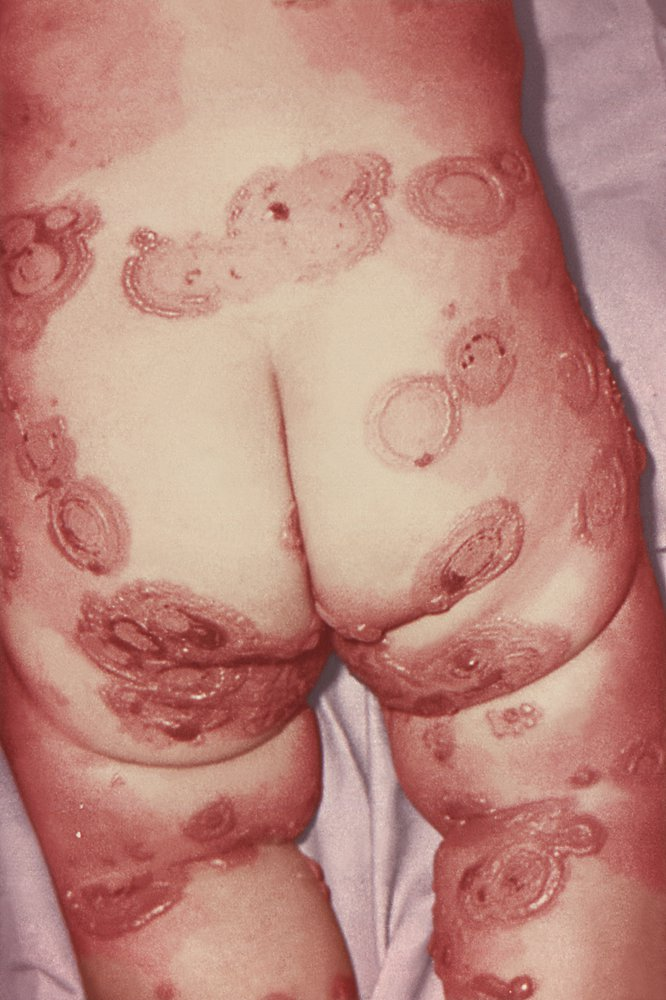
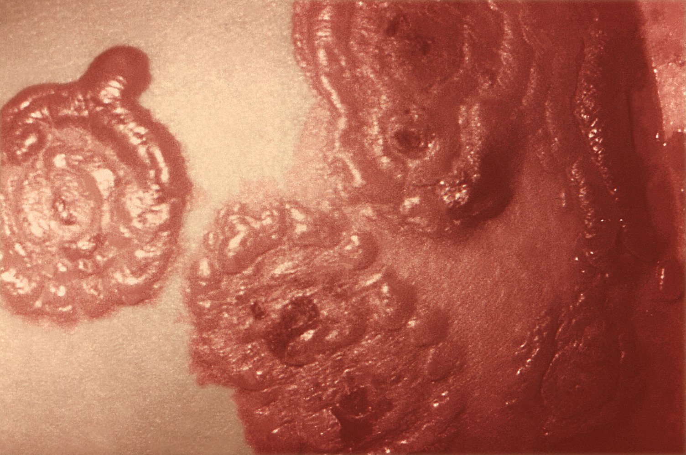
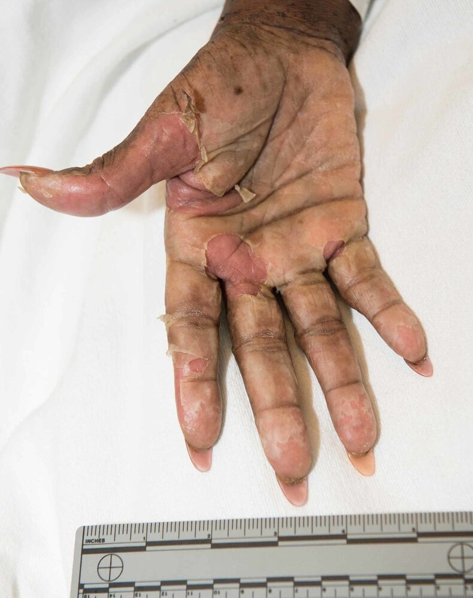
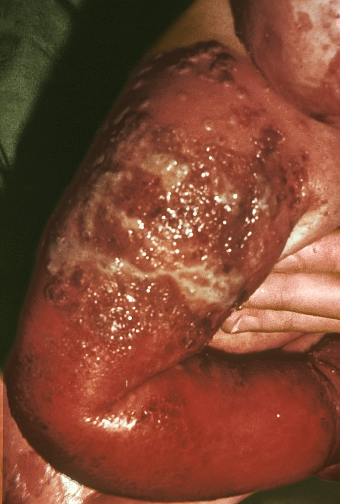
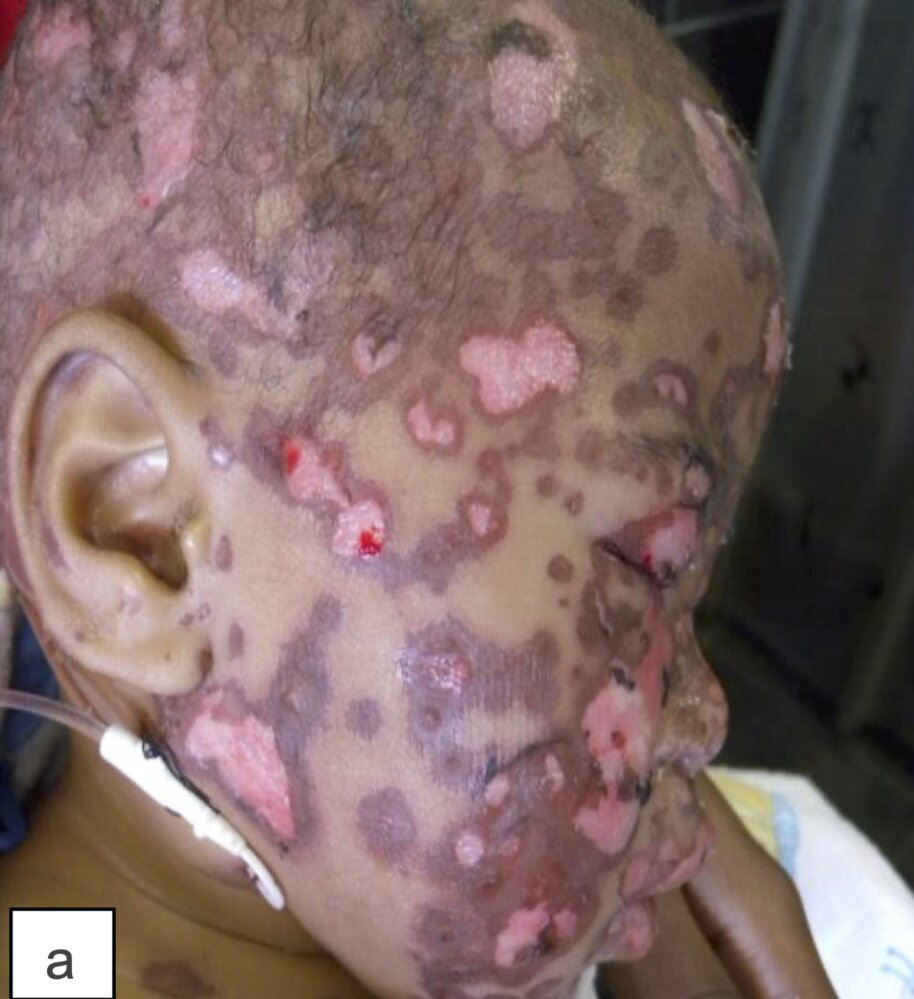
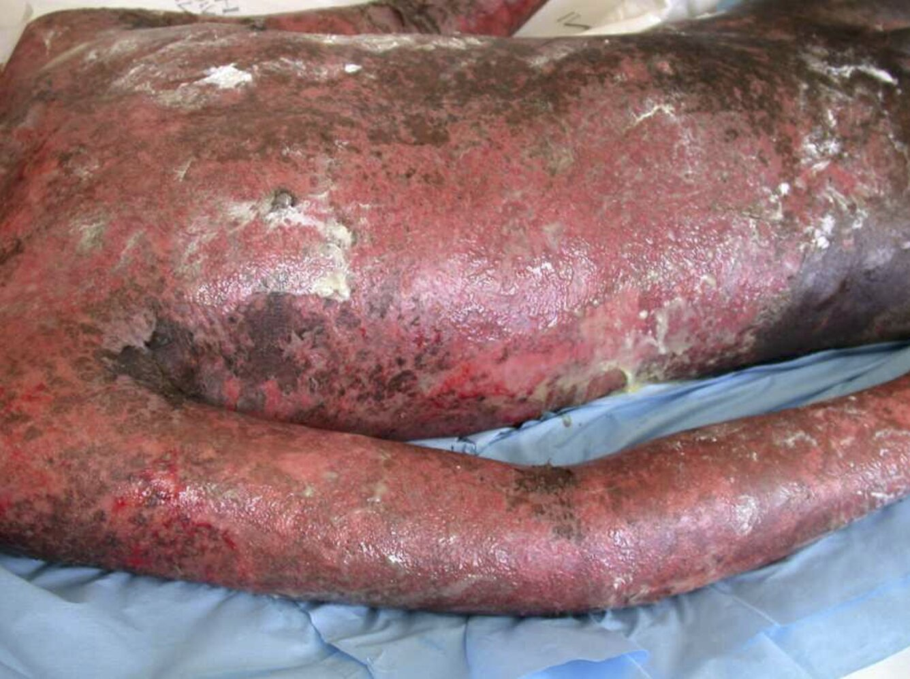
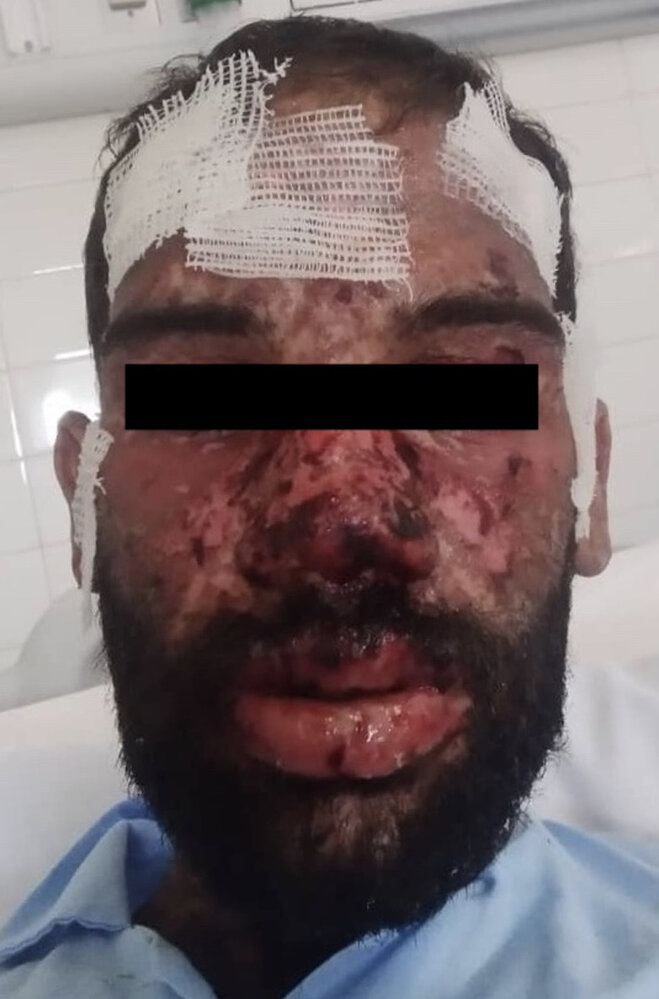
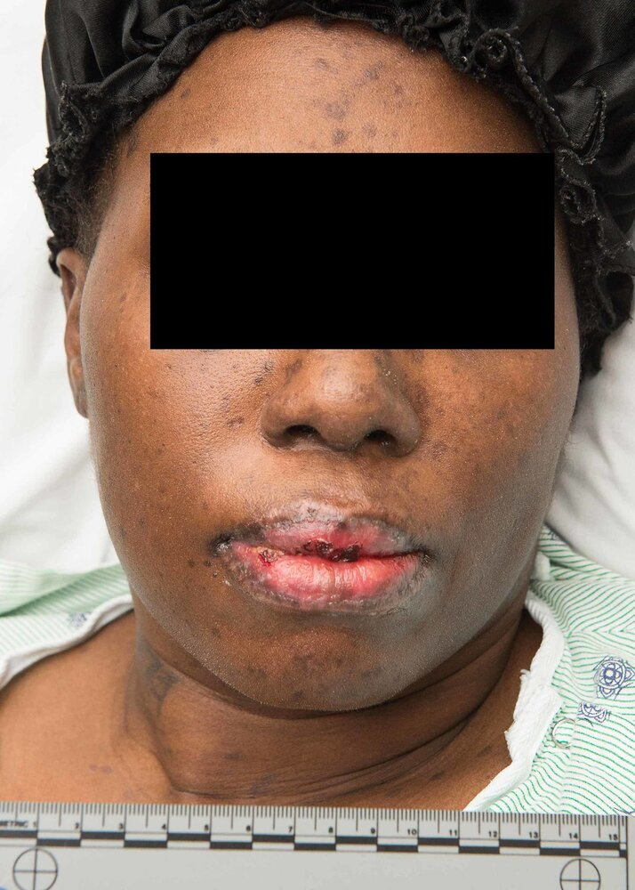
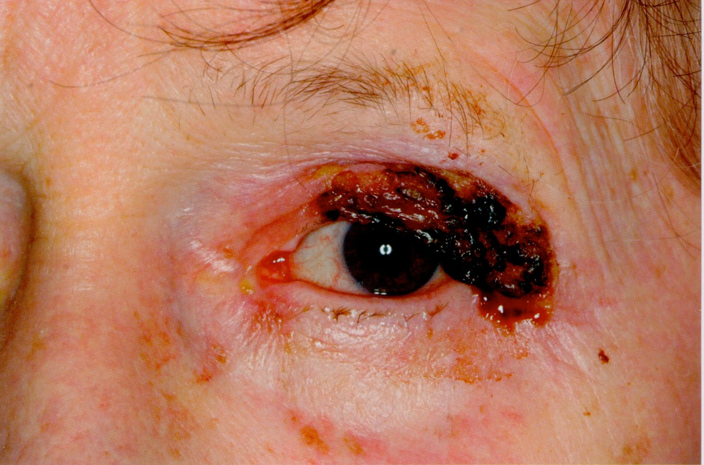
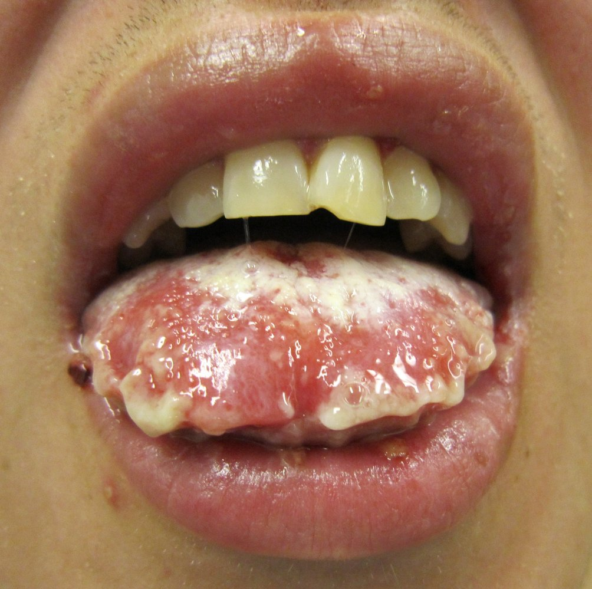

# Stevens-Johnson syndrome

*Categories: Clinical knowledge > Dermatology > Allergic and immune-mediated disorders > Stevens-Johnson syndrome*

[Original Article Link](https://coursology-qbank.com/amboss/article/uL0pzg)

---

## Summary

Stevens-Johnson syndrome (SJS) is a rare immune-mediated <u>skin</u> reaction that results in <u>blistering</u> of <u>skin</u> and extensive <u>epidermal</u> detachment. SJS is generally triggered by medications (e.g., certain <u>antibiotics</u> and <u>antiepileptics</u>). The patient presents 1–3 weeks after exposure to a medication with <u>fever</u> and other <u>flu-like</u> symptoms. Painful, vesiculobullous <u>skin</u> lesions develop and eventually denude to form extensive <u>skin</u> <u>erosions</u>, resembling large, <u>superficial burns</u>. The <u>mucous membranes</u> are also characteristically affected and the patient presents with oral <u>ulcers</u>, genital <u>ulcers</u>, and/or severe <u>conjunctivitis</u>. When > 30% of the <u>skin</u> is affected, the condition is referred to as <u>toxic epidermal necrolysis</u> (TEN). The diagnosis is primarily clinical, but <u>skin biopsies</u> can be used to support the diagnosis and rule out other causes of vesiculobullous lesions. The most important therapeutic measure is to discontinue the offending drug. <u>Supportive care</u> is similar to that of extensive <u>burns</u>, including <u>fluid resuscitation</u>, <u>wound care</u>, and <u>pain management</u>. SJS and TEN are associated with a high mortality as a result of <u>hypovolemic</u> and/or <u>septic shock</u>.

---

## Definitions

* A rare, immune-mediated <u>skin</u> reaction that leads to extensive <u>epidermal</u> detachment and is associated with a high mortality.

* SJS and TEN (<u>toxic epidermal necrolysis</u>) are the same entity but differ in terms of disease severity (based on surface area of <u>skin</u> involved). 

* < 10% – SJS

* 10–30% – SJS/TEN overlap

* > 30% – Toxic epidermal necrolysis (severe SJS)

---

## Etiology

### Triggers [[1]](https://coursology-qbank.com/amboss/article/6WdjmK0)[[2]](https://coursology-qbank.com/amboss/article/qddCIK0)[[3]](https://coursology-qbank.com/amboss/article/rddfrK0)

* Medications (most common): risk is highest within the first 8 weeks of treatment ;  [[1]](https://coursology-qbank.com/amboss/article/6WdjmK0)

* <u>Antibiotics</u>: <u>sulfonamides</u> (e.g., <u>TMP/SMX</u>), <u>aminopenicillins</u>, <u>rifampicin</u>, <u>quinolones</u>, <u>cephalosporins</u>, <u>tetracyclines</u>, <u>macrolides</u>

* <u>Antiepileptics</u>: <u>lamotrigine</u>, <u>carbamazepine</u>, <u>phenobarbital</u>, <u>phenytoin</u>

* <u>Nevirapine</u>

* Oxicam <u>NSAIDs</u> (e.g., <u>piroxicam</u>)

* <u>Allopurinol</u>

* <u>Sulfasalazine</u>

* Rare causes

* Infections: <u>Mycoplasma pneumoniae</u> infection, <u>herpesvirus</u> infection, <u>URIs</u>, <u>HIV</u>, <u>hepatitis A</u> [[4]](https://coursology-qbank.com/amboss/article/pWdLmK0)

* <u>Vaccinations</u>

### <u>Risk factors</u> [[4]](https://coursology-qbank.com/amboss/article/pWdLmK0)[[5]](https://coursology-qbank.com/amboss/article/qWdCmK0)

* <u>HIV</u>  [[6]](https://coursology-qbank.com/amboss/article/JWdsmK0)

* <u>Connective tissue disease</u> (e.g., <u>SLE</u>)

* Age > 60 years

* Certain <u>HLA</u> <u>phenotypes</u>

* Certain <u>CYP</u> <u>polymorphisms</u>

---

## Pathophysiology

* The pathogenesis is not completely understood but is thought to involve a <u>delayed hypersensitivity reaction</u> (type IV): ↑ activity of drug-specific cytotoxic <u>T cells</u> → release of granulysin;  (a cytolytic protein) by an unknown mechanism → damage to <u>keratinocytes</u>

---

## Clinical features

### <u>Prodrome</u> [[4]](https://coursology-qbank.com/amboss/article/pWdLmK0)[[7]](https://coursology-qbank.com/amboss/article/IddYrK0)

Onset: 1–3 weeks after trigger

* <u>Fever</u>

* <u>Malaise</u>

* <u>Sore throat</u>

* <u>Myalgias</u>, <u>arthralgias</u>

* <u>Headaches</u>

### Mucocutaneous lesions [[4]](https://coursology-qbank.com/amboss/article/pWdLmK0)[[7]](https://coursology-qbank.com/amboss/article/IddYrK0)

Onset: 1–3 days after the <u>prodrome</u>

* Cutaneous lesions: affect all patients; progress throughout the illness

* Initial painful <u>erythematous</u> <u>macules</u> with <u>purpuric</u> centers (atypical <u>target lesions</u>) on the face and trunk

* Rapid spread and coalescence into <u>bullae</u> with positive <u>Nikolsky sign</u>

* Expansion to extensive <u>epidermal</u> <u>necrosis</u>

* <u>Dermal</u>-<u>epidermal</u> dissociation and sloughing of the <u>epidermis</u>

* Reepithelialization 1–2 weeks after <u>epidermal</u> sloughing

* <u>Mucosal</u> lesions: occur in > 90% of patients [[4]](https://coursology-qbank.com/amboss/article/pWdLmK0)

* Oral: <u>stomatitis</u>, <u>cheilitis</u>, <u>ulcers</u>

* Ocular: <u>conjunctivitis</u>, <u>keratitis</u>, <u>iritis</u>, <u>anterior uveitis</u>

* GU: genital <u>erosions</u> (e.g., of the <u>glans penis</u>, <u>vulva</u>, <u>vagina</u>), urethral <u>erosions</u>

Stevens-Johnson syndrome

Stevens-Johnson syndrome

Stevens-Johnson syndrome

Toxic epidermal necrolysis (severe Stevens-Johnson syndrome)

Stevens-Johnson syndrome (SJS)

Toxic epidermal necrolysis (TEN)

Toxic epidermal necrolysis (TEN)

Stevens-Johnson syndrome

Stevens-Johnson syndrome following sulfonamide treatment

Mucosal lesions in Stevens-Johnson syndrome (SJS)

### Systemic involvement [[4]](https://coursology-qbank.com/amboss/article/pWdLmK0)

Systemic involvement is less common than mucocutaneous involvement and can affect multiple organ systems.

* GI: esophageal <u>ulcerations</u>, hepatocellular <u>necrosis</u>, <u>cholestasis</u>

* Renal: <u>acute kidney injury</u>, <u>acute tubular necrosis</u>, <u>glomerulonephritis</u>

* Pulmonary: <u>ulceration</u> and <u>necrosis</u> of the <u>bronchial epithelium</u>, <u>pulmonary edema</u>, <u>respiratory failure</u>

---

## Diagnosis

### Approach [[8]](https://coursology-qbank.com/amboss/article/BWdznK0)

* Make a <u>clinical diagnosis</u> of SJS based on history and mucocutaneous lesions.

* Obtain a <u>skin biopsy</u> to confirm the diagnosis.

* Rule out <u>differential diagnoses of SJS</u>, e.g., <u>blistering skin diseases</u>.

> [!TIP]
> <u>Mucosal</u> involvement differentiates SJS from <u>staphylococcal scalded skin syndrome</u>.

### <u>Laboratory studies</u> [[7]](https://coursology-qbank.com/amboss/article/IddYrK0)[[9]](https://coursology-qbank.com/amboss/article/xWdEnK0)[[10]](https://coursology-qbank.com/amboss/article/8VdOwK0)

Possible findings include:

* <u>CBC</u>: <u>lymphopenia</u>, <u>neutropenia</u>, <u>thrombocytopenia</u>

* <u>BMP</u>: <u>electrolyte</u> abnormalities, <u>acute kidney injury</u> (↑ <u>BUN</u>)

* <u>LFTs</u>: ↑ <u>transaminases</u>

* Microbiological studies (if applicable): <u>pathogen</u> detection in <u>cultures of blood</u>, <u>skin</u>, <u>mucous membranes</u>, and urine

---

## Pathology

Findings on <u>skin biopsy</u> include:

* <u>Keratinocyte</u> <u>necrosis</u>

* Apparent subepidermal split

* Eosinophilic infiltration with minimal infiltration of <u>lymphocytes</u> and <u>histiocytes</u> around <u>blood vessels</u>

---

## Differential diagnoses

See also “<u>Overview of blistering skin diseases</u>” and “<u>Rash</u>.”

* <u>Staphylococcal scalded skin syndrome</u> (<u>SSSS</u>)

* <u>Mucous membranes</u> are typically not involved in <u>SSSS</u>.

* <u>SSSS</u> is also much more commonly seen in a younger age group (especially <u>infants</u>).

* <u>Skin biopsy</u> can be used to confirm the diagnosis.

* <u>Erythema multiforme</u> (EMF)

* EMF minor does not typically involve <u>mucous membranes</u>.

* Lesions of EMF (both major and minor) are more acrally distributed and have limited <u>skin</u> detachment.

* While the triggers for both EMF and SJS are essentially the same, the former is more commonly associated with infections such as herpes and <u>Mycoplasma</u>, while the latter is most commonly associated with drugs.

* Severe <u>acute cutaneous lupus erythematosus</u>

* Severe <u>acute graft-versus-host disease</u>

The differential diagnoses listed here are not exhaustive.

---

## Treatment

Management involves a multidisciplinary team of specialists (e.g., dermatology, ophthalmology, gynecology).

### Initial management and <u>supportive care</u> [[7]](https://coursology-qbank.com/amboss/article/IddYrK0)[[8]](https://coursology-qbank.com/amboss/article/BWdznK0)[[11]](https://coursology-qbank.com/amboss/article/DVd19K0)

* Discontinue the offending drug.

* Consult dermatology, ophthalmology, and/or gynecology.

* Supportive management is similar to that of extensive <u>burns</u>, including:

* <u>Goal-directed IV fluid therapy</u>: See “<u>Strategies for IV fluid therapy</u>.”

* <u>Pain management</u>: See “<u>Oral analgesics</u>” and “<u>Parenteral analgesics</u>” for dosages.

* <u>Wound care</u>  [[8]](https://coursology-qbank.com/amboss/article/BWdznK0)

* <u>Mucosal</u> care (e.g., <u>oral care</u>)

* <u>Specialized nutrition support</u>

* Adequate glycemic control

* See also “<u>Supportive care for burn injury</u>.”

* Pharmacotherapy : Consider in consultation with specialists. [[12]](https://coursology-qbank.com/amboss/article/yWddLK0)

### Disposition and monitoring [[8]](https://coursology-qbank.com/amboss/article/BWdznK0)[[11]](https://coursology-qbank.com/amboss/article/DVd19K0)

* <u>ICU</u> admission is typically required; consider transfer to a <u>burn center</u>.

* Monitor for acute complications, including:

* Infection, <u>septic shock</u>

* <u>Hypovolemic shock</u>

* <u>Pleural effusion</u>, <u>respiratory failure</u> [[13]](https://coursology-qbank.com/amboss/article/_Wd5LK0)

* Treat complications, e.g., with:

* <u>Respiratory support</u>

* <u>Electrolyte repletion</u>

* <u>Rewarming techniques</u>

* <u>Antibiotics for sepsis</u>

> [!TIP]
> Only administer <u>antibiotics</u> if there are signs of infection, e.g., <u>fever</u>, worsening <u>skin</u> <u>pain</u>. [[11]](https://coursology-qbank.com/amboss/article/DVd19K0)

---

## Complications

* Acute: <u>dehydration</u> and <u>hypovolemic shock</u>; , secondary infection, <u>sepsis</u>, and <u>septic shock</u>

* Ophthalmologic: ocular scarring and <u>vision loss</u> (most common), <u>keratoconjunctivitis sicca</u>, <u>trichiasis</u> [[7]](https://coursology-qbank.com/amboss/article/IddYrK0)[[13]](https://coursology-qbank.com/amboss/article/_Wd5LK0)

* Dermatologic: <u>hyperpigmentation</u>, <u>hypopigmentation</u>, <u>alopecia</u>, <u>nail</u> loss [[13]](https://coursology-qbank.com/amboss/article/_Wd5LK0)

* Urogenital: <u>urethral stenosis</u>, vaginal adhesions, <u>dyspareunia</u>, <u>phimosis</u>, <u>sexual dysfunction</u> [[11]](https://coursology-qbank.com/amboss/article/DVd19K0)

* Gastrointestinal: stenosis, strictures, <u>dysphagia</u> [[4]](https://coursology-qbank.com/amboss/article/pWdLmK0)

We list the most important complications. The selection is not exhaustive.

---

## Prognosis

* <u>Mortality rate</u> [[14]](https://coursology-qbank.com/amboss/article/0edexK0)

* SJS: 5.4%

* SJS/TEN overlap: 14.4%

* TEN: overall, 15.3%

* Severity-of-illness score for toxic epidermal necrolysis (<u>SCORTEN</u>) [[15]](https://coursology-qbank.com/amboss/article/EWd8MK0)

* <u>Risk factors</u>

* Age ≥ 40 years

* <u>Heart rate</u> ≥ 120 bpm

* <u>Malignancy</u>

* > 10% <u>epidermal</u> detachment on day 1

* <u>BUN</u> > 28 mg/dL

* <u>Bicarbonate</u> < 20 mmol/L

* <u>Glucose</u> > 252 mg/dL

* Interpretation: Mortality increases for every additional <u>risk factor</u> present at admission; rates of up to 90% have been reported for patients with ≥ 5 <u>risk factors</u>.  [[14]](https://coursology-qbank.com/amboss/article/0edexK0)[[15]](https://coursology-qbank.com/amboss/article/EWd8MK0)[[16]](https://coursology-qbank.com/amboss/article/YgdnF60)

* Recurrence: SJS and/or TEN may reoccur with the use of the same or closely related offending drug.

---