# Skin and skin appendage

*Categories: Clinical knowledge > Dermatology > Basics of dermatology > Skin and skin appendage*

[Original Article Link](https://coursology-qbank.com/amboss/article/W60PPS)

---

## Summary

The skin is the largest organ of the body, covering an area of approximately 2 m2. The skin is composed of the <u>cutis</u> (including the <u>dermis</u> and <u>epidermis</u>), <u>subcutaneous tissue</u>, and <u>skin appendages</u>. The <u>epidermis</u>, which is derived from <u>ectoderm</u>, is the outermost layer of the skin and is mainly composed of <u>keratinocytes</u>. The <u>dermis</u>, which is derived from <u>mesoderm</u>, is located underneath the <u>epidermis</u> and is mainly composed of <u>elastic fibers</u>, <u>type I collagen</u>, and <u>connective tissue</u>. It is formed by the <u>papillary dermis</u> and the <u>reticular dermis</u>. The <u>subcutaneous tissue</u>, which is derived from the <u>mesoderm</u>, is the innermost layer of the skin and is mainly composed of fat and <u>connective tissue</u>. <u>Skin appendages</u> are derived from the skin and include <u>hair</u>, <u>nails</u>, and glands. The main functions of the skin are protection (barrier against ultraviolet radiation, microorganisms, and water loss), the synthesis of <u>vitamin D</u>, detection of sensation (e.g., touch, temperature, <u>pain</u>), and the regulation of body temperature.

---

## Structure of the skin

The skin is composed of several layers, which are categorized as follows (from <u>superficial</u> to deep):

### Cutis

Layers of the skin

#### Epidermis

* Derived from <u>ectoderm</u>

* Primarily composed of <u>keratinocytes</u>, which constantly regenerate approximately every 30 days

* The outermost and nonvascularized layer of the skin that maintains the skin's barrier function

* There are 5 layers of the epidermis, which are categorized as follows (from <u>superficial</u> to deep):

* Stratum corneum: outer layer of the <u>epidermis</u>  

* Consists of dead (anuclear; ), <u>keratin</u>-filled cells

* This layer is constantly being sloughed off.

* Stratum lucidum: thin, translucent layer

* Located only on thick skin (palms and soles)

* Composed of a homogeneous layer of <u>keratinocytes</u> with no <u>nuclei</u> or organelles

* Stratum granulosum: also called the granular layer

* Contains keratohyalin

* This layer has waterproof properties.

* Stratum spinosum

* Composed of actively dividing <u>keratinocytes</u>;  with spinous-like projections (prickle cells)

* This layer produces keratin and induces <u>keratinization</u>.

* <u>Langerhans cells</u> are also located in this layer.

* Stratum basale (also called the <u>basal cell layer of the epidermis</u>)

* <u>Stem cells</u> of the <u>epidermis</u> (their daughter cells migrate upwards and differentiate into other cells)

* <u>Melanocytes</u> and <u>Merkel cells</u> are also located in this layer.

* The <u>stratum basale</u> is regenerative (basal keratinocytes proliferate to fill skin defects).

> [!NOTE]
> “Come on, Let's Get Some Beers”: Corneum, Lucidum, Granulosum, Spinosum, and Basalis are the 5 <u>layers of the epidermis</u>.

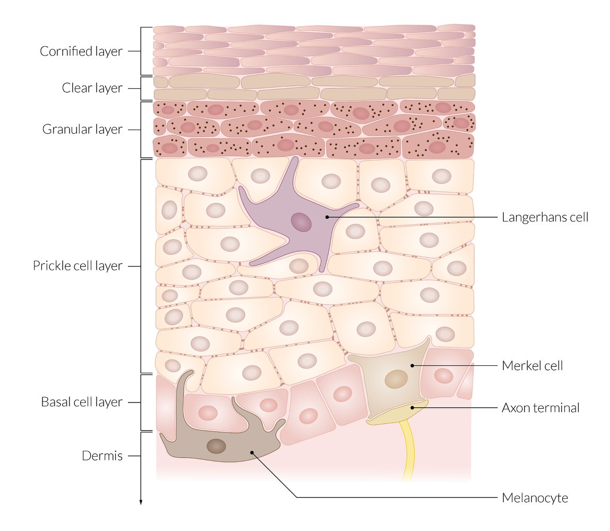

Layers of the epidermis and their characteristics

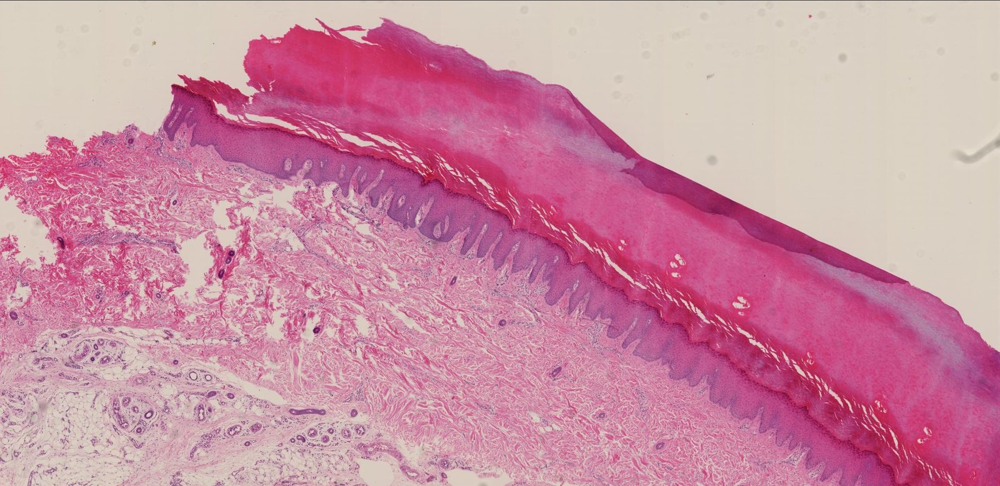

Prominent stratum corneum of glabrous skin

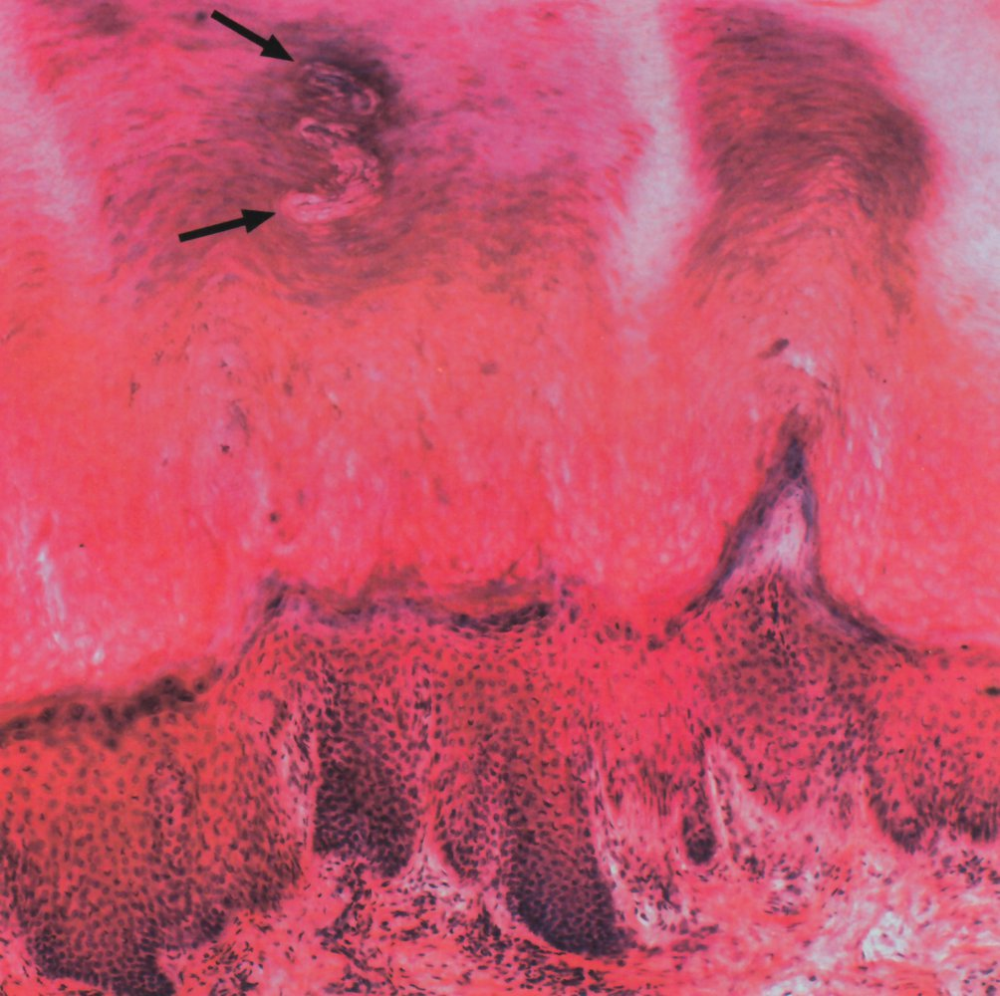

Epidermis of glabrous skin

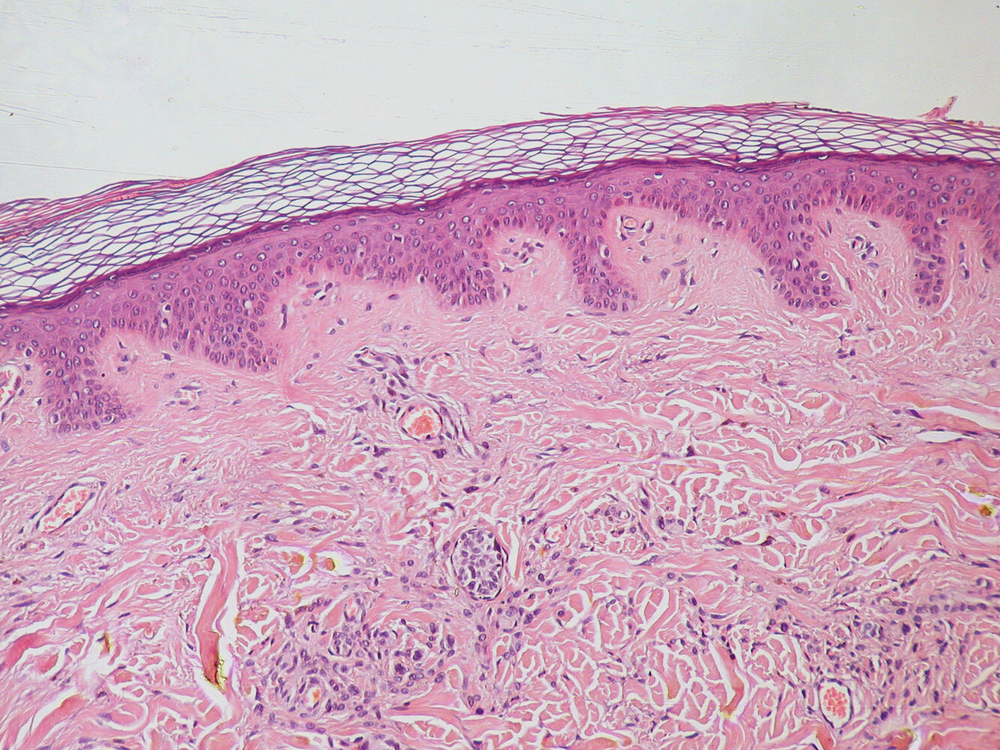

Histology of normal skin

#### Dermal-epidermal junction

* <u>Basement membrane</u>

* Anchors the <u>epidermis</u> to the <u>dermis</u>

* Consists of two layers:

* <u>Lamina lucida</u> (<u>superficial</u>)

* <u>Lamina densa</u> (deeper)

* Hemidesmosomes: connect the <u>epidermis</u> to the <u>basement membrane</u>

* <u>Collagen fibrils</u>: connect <u>stratum basale</u> to the <u>papillary</u> layer

#### Dermis

Derived from <u>mesoderm</u>; contains <u>blood vessels</u> and provides structural integrity to the skin

* Papillary dermis

* Consists of fine, loosely arranged <u>collagen fibers</u>

* Supplies the <u>epidermis</u> with <u>nutrients</u>

* Plays an important role in temperature regulation

* Forms <u>dermal</u> ridges, which connect dermal papillae (extension of the <u>papillary dermis</u> into the <u>epidermis</u>) to <u>epidermal</u> downgrowths known as <u>epidermal</u> ridges or rete ridges

* Contains <u>Meissner corpuscles</u> (for fine-touch and two-point discrimination) and <u>free nerve endings</u>

* Contains <u>immune cells</u> (<u>mast cells</u> and <u>macrophages</u>)

* Reticular dermis

* Consists of thick, densely packed fibers (e.g., reticular, elastic, and collagenous) that provide structure and support to the skin and its components

* Contains <u>Ruffini corpuscles</u> (<u>mechanoreceptors</u>): responsible for mechanical pressure and the sensation of distortion

* Contains <u>sweat glands</u>, <u>sebaceous glands</u>, and the roots of <u>hair follicles</u>

* Langer lines 

* Topographic lines that correlate with the natural orientation of the <u>reticular fibers</u> of the <u>reticular dermis</u>

* Important for <u>wound healing</u> and guiding surgical <u>incisions</u>

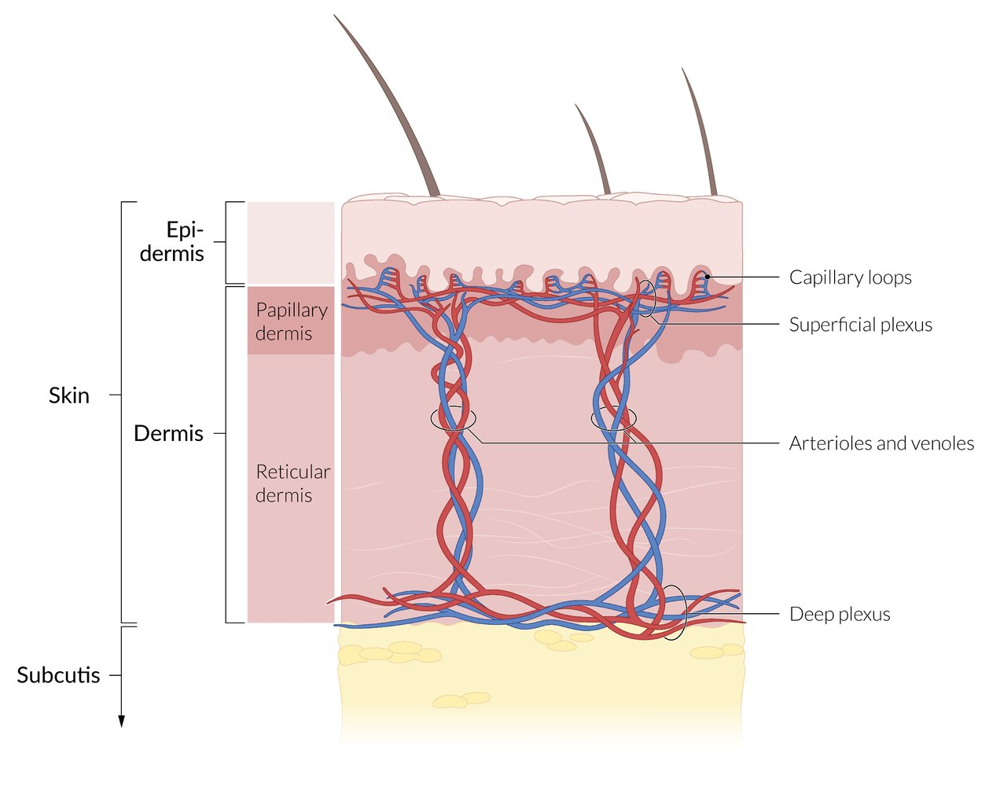

Cutaneous vasculature

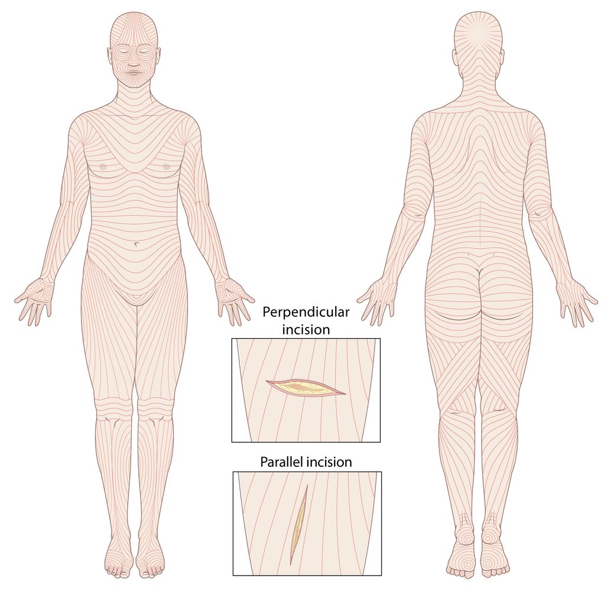

Skin tension lines (Langer lines)

### Subcutis (also called <u>hypodermis</u>)

* Derived from <u>mesoderm</u>

* Consists mainly of subcutaneous fat that protects from cold and trauma

* Contains <u>superficial veins</u> and <u>free nerve endings</u>

* Contains <u>Pacinian corpuscles</u> (<u>mechanoreceptors</u>) that are responsible for the sensations of vibration and pressure

* Collagenous and <u>elastic fibers</u> in this area anchor the skin (<u>epidermis</u>, <u>dermis</u>) to the deep <u>fascia</u>.

* Allows for the subcutaneous administration of medication

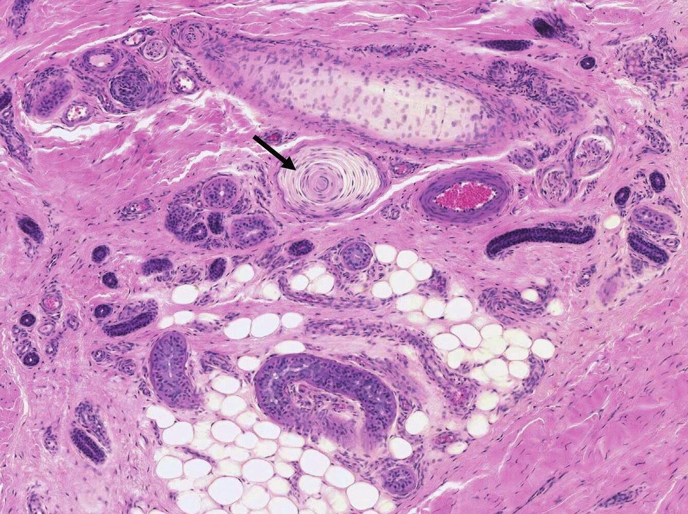

Subcutaneous tissue (subcutis)

### <u>Skin appendages</u>

* <u>Hair</u>, <u>nails</u>, glands (e.g., <u>sweat glands</u>, <u>sebaceous glands</u>)

* See “<u>Skin appendages</u>” below for more information.

References:[[1]](https://coursology-qbank.com/amboss/article/gF0Fh3)[[2]](https://coursology-qbank.com/amboss/article/17a2kN)[[3]](https://coursology-qbank.com/amboss/article/qCaCG5)

---

## Cells of the skin

### Cells of the epidermis [[1]](https://coursology-qbank.com/amboss/article/gF0Fh3)

The <u>epidermis</u> is mainly composed of four different types of cells.

#### Keratinocytes

* Definition: principal <u>cells of the epidermis</u>

* Location

* Throughout the whole <u>epidermis</u>

* Mitotically active in the basal layer (basal cells)

* Connected to the <u>basement membrane</u> via <u>hemidesmosomes</u>

* Function

* Primarily protect against environmental damage and form a barrier against pathogens

* Protect against ultraviolet (UV) radiation by storing <u>melanin</u> produced by <u>melanocytes</u>

* Produce proinflammatory mediators to activate the <u>immune system</u> when exposed to pathogens

* Aid in the process of <u>wound healing</u>

* Form <u>tight junctions</u> with nerve endings and hold <u>lymphocytes</u> and <u>Langerhans cells</u> in place.

* Clinical significance

* Abnormal <u>keratinocyte</u> desquamation contributes to the development of <u>acne</u>.

* <u>Sunburn</u>: <u>apoptosis</u> of <u>keratinocytes</u>

* <u>Blistering</u> skin disorders (e.g., <u>pemphigus vulgaris</u>, <u>staphylococcal scalded skin syndrome</u>): loss of intercellular junctions and desquamation of <u>keratinocytes</u>

#### Melanocytes

* Definition: <u>melanin</u>-producing cells derived from <u>neural crest cells</u>

* Location: <u>hair</u>, <u>iris</u> and <u>choroid</u> of the <u>eye</u>, <u>stratum basale</u> of the skin

* Function: melanin synthesis and storage

* <u>Melanin</u> is a dark pigment synthesized and stored in melanosomes (organelles within <u>melanocytes</u>).

* Dendritic processes transfer <u>melanosomes</u> to adjacent and distant <u>keratinocytes</u>.

* <u>Melanocytes</u> are stimulated by <u>MSH</u>, <u>ACTH</u>, and sunlight (UV-A): <u>MSH</u> and <u>ACTH</u> share the same precursor, <u>proopiomelanocortin</u> (<u>POMC</u>).

* Synthetic pathway of melanin  
1. * <u>Phenylalanine</u> → L-<u>tyrosine</u>

* Enzyme: <u>phenylalanine hydroxylase</u>

* Location: <u>liver</u>
2. * L-<u>tyrosine</u> → L-<u>3,4-dihydroxyphenylalanine</u> (<u>DOPA</u>)

* Enzyme: <u>tyrosine hydroxylase</u>

* Location: <u>melanosomes</u>
3. * <u>DOPA</u> → <u>melanin</u> (brown-black pigment)

* Enzyme: tyrosinase (a <u>copper</u>-containing, oxidative enzyme that is involved in the production of <u>melanin</u> from <u>tyrosine</u>)

* Location: <u>melanosomes</u>

* Clinical significance

* Pigmented skin disorders

* <u>Vitiligo</u>

* <u>Albinism</u>

* <u>Melasma</u>

* <u>Pityriasis versicolor</u>

* Potential tumors

* Benign: <u>nevus</u>/mole

* Malignant: <u>melanoma</u>

> [!NOTE]
> <u>Vitiligo</u> is an acquired condition characterized by loss of <u>melanocytes</u>. <u>Albinism</u> is an inherited condition characterized by impaired <u>melanin</u> production.

Biosynthesis and breakdown of catecholamines

#### Langerhans cells

* Definition: : <u>macrophages</u> of the skin; a type of <u>dendritic cell</u>

* Location: : <u>stratum spinosum</u>

* Characteristics

* <u>Langerhans cells</u> act as <u>antigen-presenting cells</u> (<u>APCs</u>).

* <u>Langerhans cells</u> express the following <u>proteins</u>:

* <u>MHC class II</u>

* <u>Fc receptors</u>

* <u>S-100</u>

* <u>CD1a</u>

* Mesodermal origin

* Stain positive for <u>S-100</u> and <u>CD1a</u>

* Contain <u>Birbeck granules</u>

* Clinical significance

* <u>Langerhans cell histiocytosis</u>

* <u>HIV</u> transmission

* <u>HPV</u> transmission

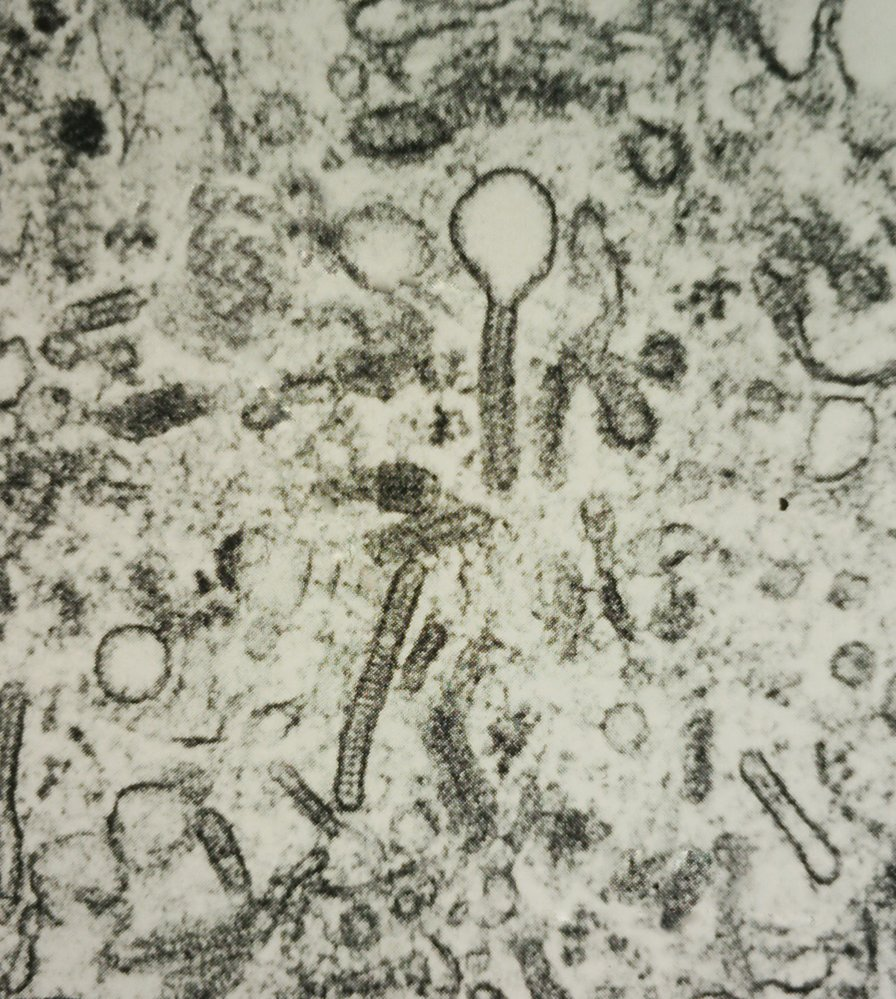

Birbeck granules

#### Merkel cells

* Definition: <u>mechanoreceptors</u> for deep static touch features (e.g., shapes, edges)

* Location

* Mainly located in the <u>stratum basale</u>

* They surround richly innervated areas of <u>connective tissue</u>, such as the fingertips.

* Characteristics

* Rich in <u>keratin</u> filaments, <u>desmosomes</u>, and small, dense blue granules

* <u>Merkel cells</u> are connected to enlarged <u>axon</u> terminals via <u>synapse</u>-like junctions.

* The <u>Merkel cell-neurite complex</u> is known as a <u>Merkel disc receptor</u>.

---

## Skin appendage

### Overview  [[1]](https://coursology-qbank.com/amboss/article/gF0Fh3)

<u>Skin appendage</u> includes:

* <u>Nails</u>

* <u>Hair follicles</u>

* Glands

* <u>Sebaceous glands</u>

* <u>Sweat glands</u> (<u>apocrine sweat glands</u> and <u>eccrine sweat glands</u>)

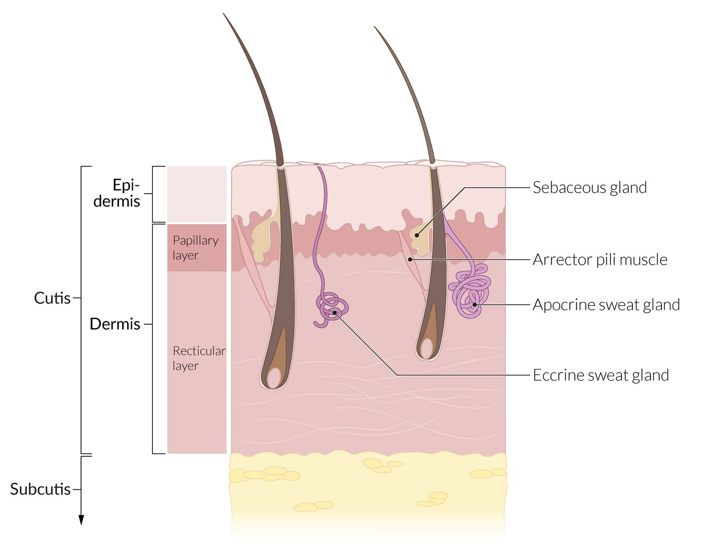

Layers of the skin and skin appendages

### Nails

* Perionychium: <u>epidermal</u> tissue surrounding the root and base of the <u>nail</u>

* Eponychium: <u>proximal</u> layer of <u>epidermis</u> extending over the <u>nail</u> base

* Hyponychium: <u>epidermal</u> tissue immediately underlying the free <u>distal</u> edge of the <u>nail</u>

* Nail plate (<u>nail body</u>)

* Covers the <u>nail</u> bed

* Proximally: consists of the matrix unguis or onychostroma (responsible for new <u>nail</u> growth) and the lunula (the white, crescent-shaped, poorly vascularized portion of the <u>nail</u>)

* Distally: sterile matrix (provides the <u>nail</u> with bulk and strength)

* Nail fold: <u>depression</u> <u>proximal</u> to the <u>nail plate</u> from which the <u>nail</u> grows

* Vascular supply

* Arterial: two terminal branches of the <u>volar</u> digital <u>artery</u>

* Venous: drains into a network in the <u>proximal</u> <u>nail</u> bed and the skin <u>proximal</u> to the <u>nail fold</u>

* Innervation: trifurcation of the <u>dorsal</u> <u>volar</u> digital nerve (supplying the <u>nail fold</u>, pulp, and <u>distal</u> tip of the finger)

Anatomical structure of the nail

### Hair follicles

* Definition: invaginations of the <u>epidermis</u> into the deep <u>dermis</u>, forming a cavity where the <u>hair</u> grows and develops

* Composition

* Hair

* A <u>skin appendage</u> that grows from follicles in the <u>dermis</u>

* Contains medulla, cortex, and cuticle

* Functions include conservation of body heat, sensation, and protection of the skin

* Most prominent on the scalp, <u>pubis</u>, <u>axilla</u>, extremities, and face

* See also “<u>Phases of hair growth</u>”.

* Hair shaft

* Extends above the <u>epidermis</u>

* Connects to the <u>hair</u> root in the deep <u>dermis</u>

* Hair bulb

* Root of the <u>hair follicle</u>; located deep in the <u>dermal papilla</u>

* Receives blood and <u>nutrients</u> from a <u>capillary</u> network of vessels to sustain <u>hair</u> growth

* Arrector pili muscle

* Description: obliquely directed <u>smooth muscle</u> fibers that attach to the <u>dermal</u> sheath surrounding <u>hair follicles</u>

* Function

* Contraction, which is responsible for piloerection (<u>goosebumps</u>)

* Conservation of body heat

* Innervated by the <u>sympathetic</u> <u>autonomic nervous system</u>

* Types

* Vellus hair follicle

* Extends into the <u>reticular dermis</u>

* Found throughout the body

* During <u>puberty</u>, <u>vellus hairs</u> in the <u>axillae</u> and the genital area become <u>terminal hairs</u>.

* Terminal hair follicle

* Extends into <u>subcutaneous fat</u>

* Found on the scalp, eyebrows, and eyelashes

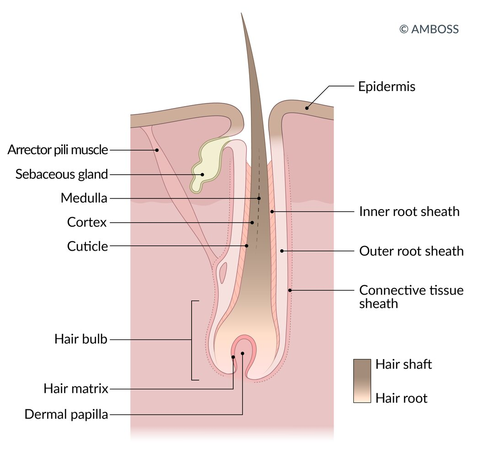

Hair follicle

### Glands

|  |  Sebaceous glands  | Sweat glands |  |
| --- | --- | --- | --- |
|  Eccrine sweat glands  |  Apocrine sweat glands  |  |  |
| Description |  * Exocrine (holocrine) branched glands   |   * Composed of a secretory unit called glomerulum or acrosyringium; surrounded by <u>myoepithelial cells</u>  * The combination of <u>sebaceous gland</u>, <u>arrector pili muscle</u>, and <u>hair follicle</u> is known as the pilosebaceous unit.    |  |
|  * <u>Exocrine glands</u> with a spiral duct (acrosyringium) and secretory ducts that open into sweat pores   |  * <u>Exocrine glands</u> with a secretory unit (glomerulum) and <u>excretory ducts</u> that open into <u>hair follicles</u>   |  |  |
| Location and distribution |   * <u>Dermis</u>  * Predominantly located on the face and scalp  * Absent on palms and soles    |  * Deep in the <u>dermis</u> and <u>hypodermis</u>   |  |
|   * Most areas of the body  * Absent in <u>lips</u>, <u>ear</u> canal, <u>clitoris</u>, <u>labia minora</u>, and <u>glans penis</u>    |  * Mostly <u>axilla</u>, <u>perineum</u>, <u>areola</u> of the <u>nipple</u>, and external <u>ear</u>   |  |  |
| Function |  * Secretion of sebum  * An oily, waxy substance which is a lubricant and a waterproof layer for the skin and <u>hair</u>  * Has photoprotective, antimicrobial, and antioxidant properties   |  * Secretion of sweat (<u>thermoregulation</u>)   |   * Modified apocrine cells produce <u>ear wax</u> or <u>breast milk</u>.  * No significant role in <u>thermoregulation</u>    |
| Regulation of secretion |   * Stimulated by <u>androgens</u>, especially <u>dihydrotestosterone</u>  * Inhibited by <u>estrogens</u>    |  * Stimulated by <u>acetylcholine</u> via <u>muscarinic receptors</u>   |  * Stimulated by <u>epinephrine</u> and <u>norepinephrine</u> from adrenergic nerve fibers   |
|  * Circulating <u>hormones</u> may also affect the secretion of sweat:  * <u>Growth hormone</u>: ↑ size of <u>sweat glands</u>  * <u>Thyroid hormone</u>: ↑ secretion of sweat (i.e., <u>hyperthyroidism</u> is characterized by moist and warm skin)   |  |  |  |

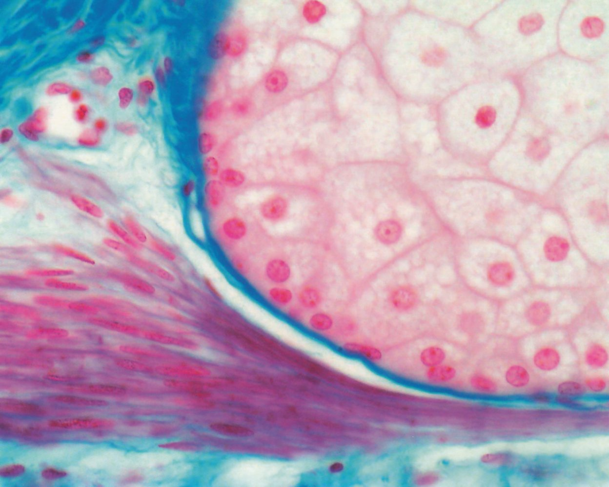

Sebaceous gland and the arrector pili muscle

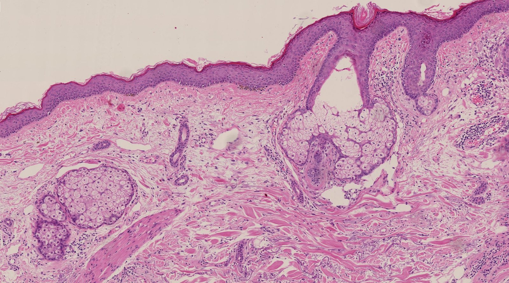

Sebaceous glands

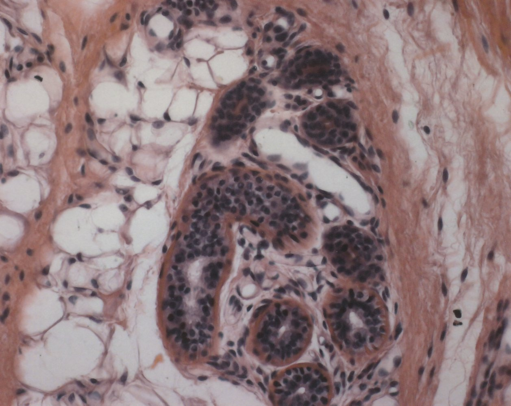

Eccrine sweat glands

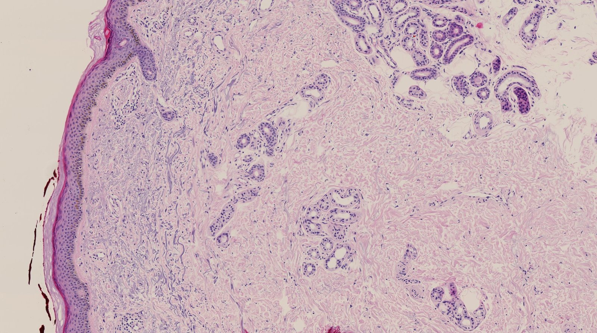

Hairy skin with eccrine sweat glands

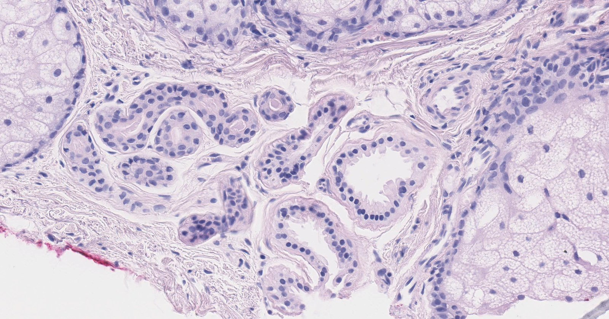

Apocrine sweat glands and sebaceous glands

---

## Functions of the skin

The main functions of the skin include: [[1]](https://coursology-qbank.com/amboss/article/gF0Fh3)

* Barrier and protection against the external environment

* <u>Thermoregulation</u> (e.g., perspiration, regulation of blood circulation)

* <u>Sensory function</u>: sensations of pressure, vibration, touch, <u>pain</u>, and temperature

* <u>Hormone</u> synthesis of <u>vitamin D</u>

* <u>Melanin synthesis</u>: provides protection against ultraviolet (UV) radiation and determines the color of the skin and <u>iris</u> (see “<u>Synthetic pathway of melanin</u>” above)

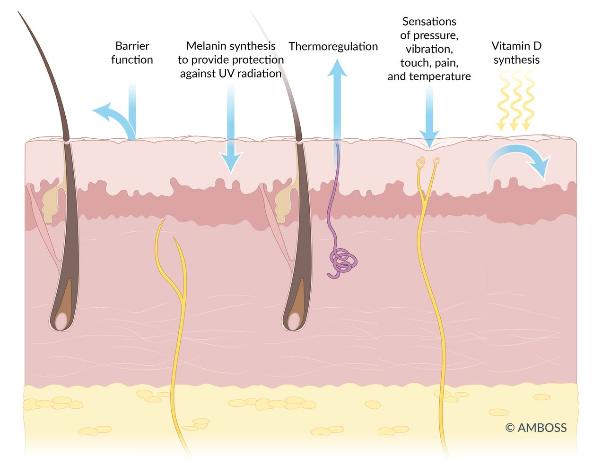

Functions of the skin

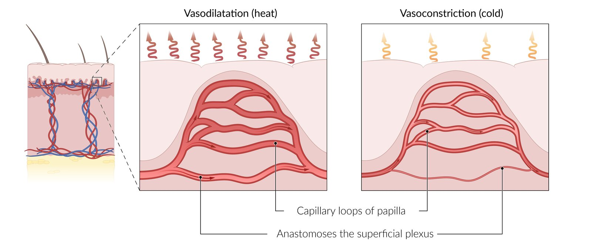

Cutaneous thermoregulation

---

## Embryology

* Skin <u>epithelium</u> is derived from <u>ectoderm</u>.

* Signaling via the <u>Wnt pathway</u> prevents ectodermal progenitor cells from responding to fibroblastic growth factors (FGFs), which promotes a response to <u>bone morphogenetic protein</u> (<u>BMP</u>) signaling and, ultimately, leads to the differentiation into the embryonic <u>epidermis</u>.

* Lack of Wnt signaling causes the progenitor cells to respond to FGFs, which downregulates <u>BMP</u> signaling and promotes neurogenesis (i.e., differentiation into the <u>neuroectoderm</u>).

* <u>Epidermal</u> appendages (e.g., <u>hair follicles</u>, <u>sweat glands</u>) are formed from invaginations of the primitive <u>epidermis</u> into the <u>dermis</u>, with subsequent <u>cell differentiation</u> into the corresponding cell types (e.g., follicle cells, eccrine or <u>apocrine sweat gland</u> cells). [[4]](https://coursology-qbank.com/amboss/article/gOcF7c0)

* <u>Dermis</u> is derived from <u>mesoderm</u>.

* <u>Melanocytes</u>, <u>Langerhans cells</u>, and <u>Merkel cells</u> are derived from <u>neural crest</u> and migrate to the <u>epidermis</u> starting from the 12th week of <u>embryonic development</u>. [[4]](https://coursology-qbank.com/amboss/article/gOcF7c0)

---

## Clinical significance

### Common skin disorders

* <u>Acne</u>

* <u>Allergic contact dermatitis</u>

* <u>Atopic dermatitis</u>

* <u>Psoriasis</u>

* <u>Rosacea</u>

* <u>Seborrheic keratosis</u>

* <u>Urticaria</u>

### Vascular tumors of the skin

* <u>Angiosarcoma</u>

* <u>Bacillary angiomatosis</u>

* <u>Kaposi sarcoma</u>

* <u>Pyogenic granuloma</u>

* <u>Strawberry hemangioma</u>

### Viral infections of the skin

* Herpes

* <u>Human papillomavirus</u>

* <u>Molluscum contagiosum</u>

* <u>Varicella-zoster virus</u>

* <u>Hairy leukoplakia</u>

### Bacterial infections of the skin

* <u>Cellulitis</u>

* <u>Erysipelas</u>

* <u>Impetigo</u>

* <u>Necrotizing fasciitis</u>

* <u>Staphylococcal scalded skin syndrome</u>

### <u>Fungal infections of the skin</u>

* <u>Tinea</u>

* Cutaneous <u>candidiasis</u>

* <u>Sporotrichosis</u>

### <u>Bullous</u> skin disorders

* <u>Bullous pemphigoid</u>

* <u>Dermatitis herpetiformis</u>

* <u>Pemphigus vulgaris</u>

* <u>Stevens-Johnson syndrome</u>

* <u>Toxic epidermal necrolysis</u>

### Malignant and premalignant skin lesions

* <u>Actinic keratosis</u>

* <u>Melanoma</u>

* <u>Cutaneous squamous cell carcinoma</u>

* <u>Basal cell carcinoma</u>

### Disorders of pigmentation

* <u>Albinism</u>

* <u>Melasma</u> (<u>chloasma</u>)

* <u>Vitiligo</u>

* <u>Seborrheic dermatitis</u>

### Other skin disorders

* <u>Acanthosis nigricans</u>

* <u>Erythema nodosum</u>

* <u>Lichen planus</u>

* <u>Ichthyosis</u>

### <u>Nail</u> disorders

* <u>Finger infections</u>

* <u>Psoriasis</u>

### <u>Hair</u> disorders

* <u>Alopecia</u>

* <u>Menkes disease</u>

* <u>Vitamin C deficiency</u>

* <u>Folliculitis</u>

* <u>Trichotillomania</u>

---