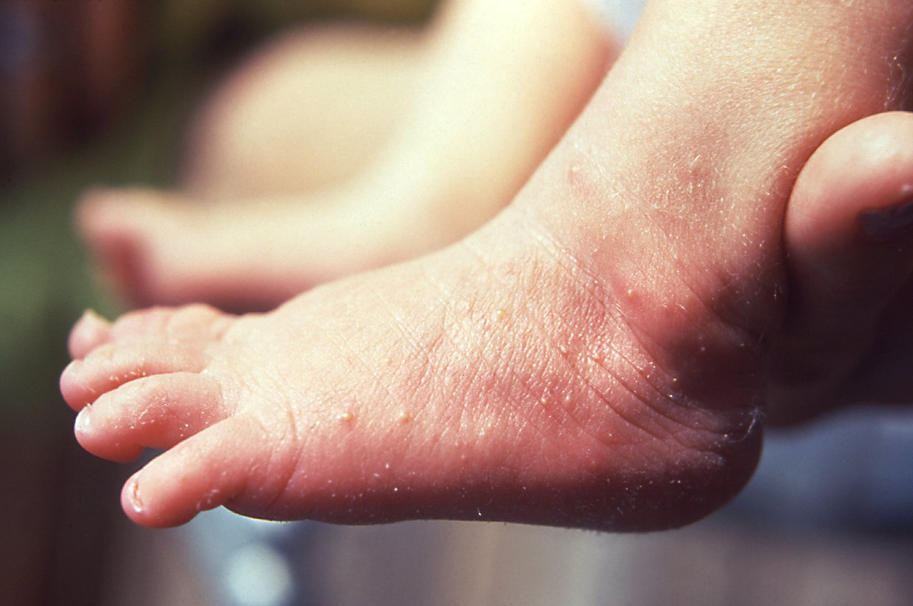
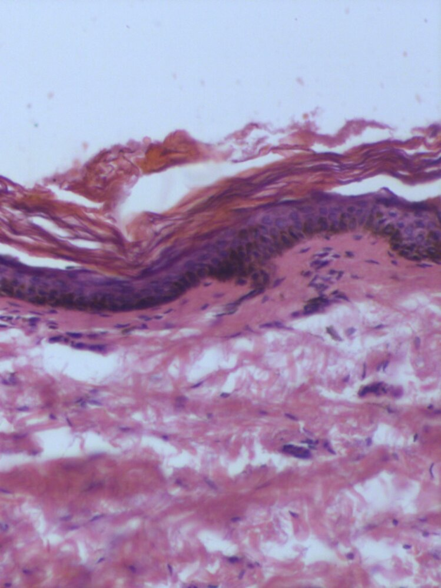
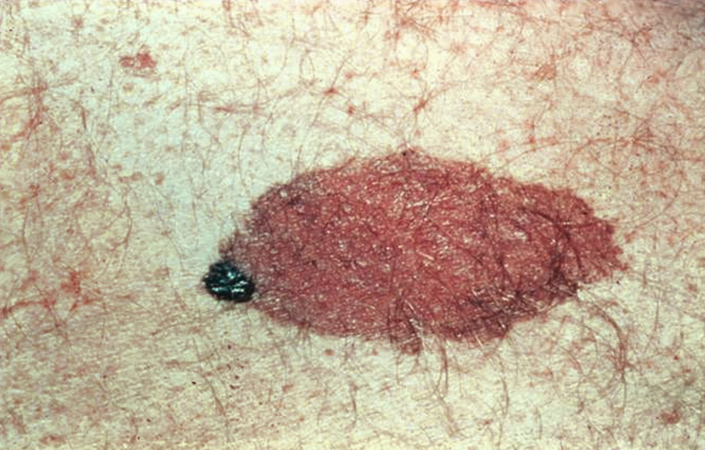
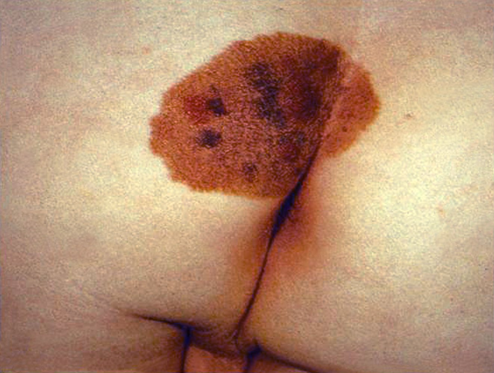
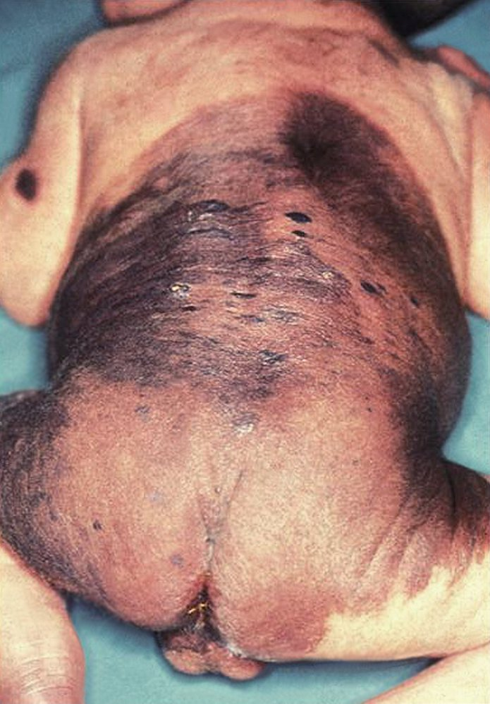
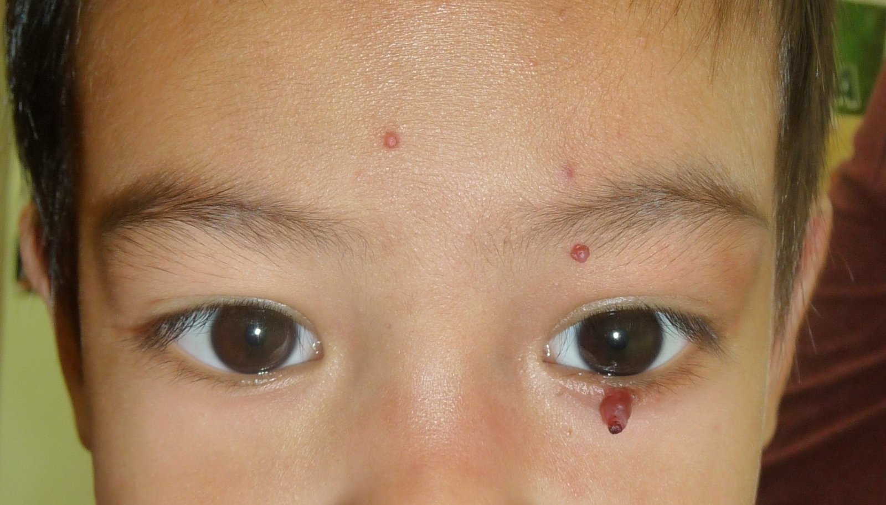
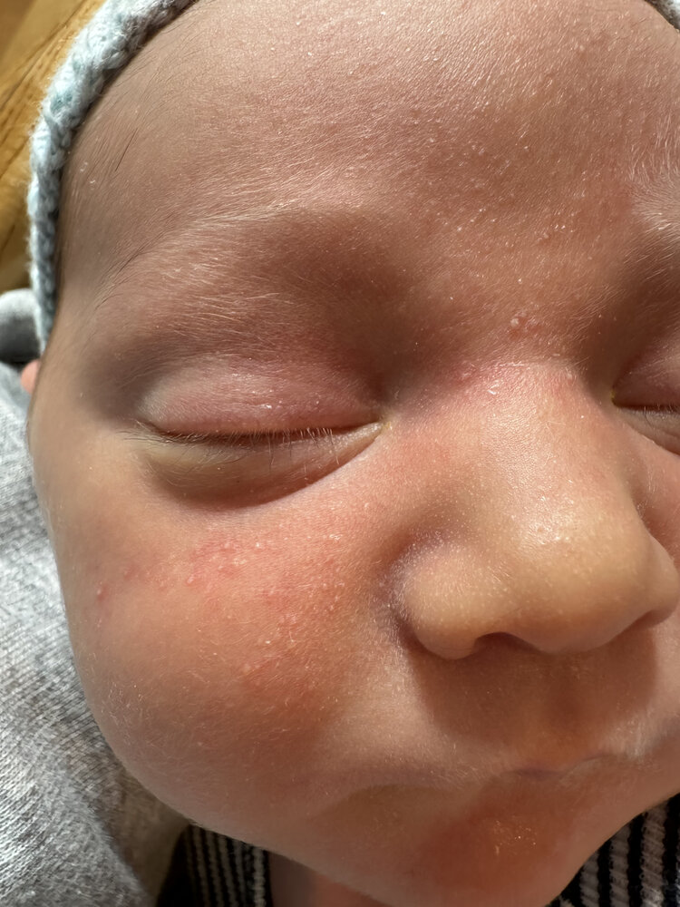
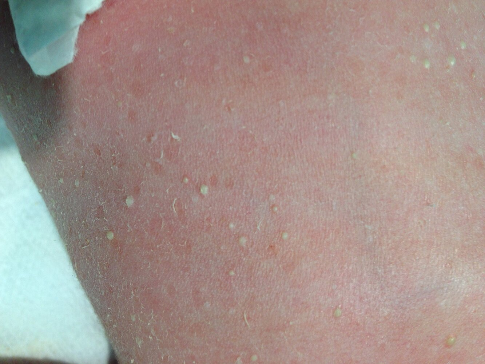

# Overview of neonatal conditions

*Categories: Clinical knowledge > Dermatology > Congenital disorders > Overview of neonatal conditions*

[Original Article Link](https://coursology-qbank.com/amboss/article/Lv0w0R)

---

## Summary

Neonatal conditions manifest during the first 28 days of life and can affect any organ system. This article includes an overview of neonatal conditions by organ system with additional information on <u>macrosomia</u>, neonatal <u>skin</u> conditions (e.g., <u>erythema toxicum neonatorum</u>, <u>congenital dermal melanocytosis</u>), <u>neonatal hypoglycemia</u>, hematologic conditions (e.g., physiologic <u>anemia</u> of <u>pregnancy</u>, <u>neonatal polycythemia</u>), and <u>infantile colic</u>.

For information about routine <u>newborn</u> care, see “<u>The newborn infant</u>.”

---

## Neonatal conditions by system

### <u>Skin</u>

* <u>Neonatal skin lesions</u>

### Head

* <u>Head molding</u>

* <u>Caput succedaneum</u>

* <u>Cephalohematoma</u>

* <u>Subgaleal hemorrhage</u>

* Bulging <u>fontanelles</u> as a sign of <u>increased intracranial pressure</u>

* <u>Facial nerve palsy due to birth trauma</u>

### Eyes

* <u>Retinopathy of prematurity</u>

* <u>Newborn conjunctivitis</u>

* <u>Leukocoria</u> (may indicate <u>retinoblastoma</u>)

### <u>Ear</u>, nose, and mouth

* <u>Cleft lip</u> or <u>cleft palate</u>

* <u>Choanal atresia</u>

### Neck and clavicles

* <u>Birth-related clavicle fracture</u>

* <u>Infant torticollis</u>

### <u>Circulatory system</u>

* <u>Neonatal respiratory distress syndrome</u>

* <u>Cyanotic</u> and <u>acyanotic congenital heart defects</u>

### <u>Gastrointestinal tract</u>

* <u>Hirschsprung disease</u>

* <u>Necrotizing enterocolitis</u>

* <u>Vitamin K deficiency bleeding of the newborn</u>

### Urogenital system

* <u>Neonatal acute kidney injury</u>

* <u>Vesicoureteral reflux</u>

* <u>Cryptorchidism</u>

* <u>Hydrocele</u>

### Trunk, <u>spine</u>, and extremities

* <u>Infantile hypotonia</u>

* <u>Neural tube defects</u>

* <u>Foot deformities</u> (e.g., <u>club foot</u>, <u>metatarsus adductus</u>)

* <u>Developmental hip dysplasia</u>

* <u>Brachial plexus injuries</u>

### Endocrine organs

* <u>Neonatal hypocalcemia</u>

* <u>Congenital hypothyroidism</u>

* <u>Congenital hyperinsulinism</u>

* <u>Neonatal diabetes</u>

* <u>Congenital hypopituitarism</u>

* <u>Congenital adrenal hyperplasia</u>

### Hematological system

* <u>Physiologic anemia of infancy</u>

* <u>Neonatal polycythemia</u>

---

## Macrosomia

* Definition: a fetus that is > 4,000 g (> 8 lb 13 oz), regardless of <u>gestational age</u>

* Etiology [[1]](https://coursology-qbank.com/amboss/article/SbWyGP0)

* <u>Diabetes mellitus in pregnancy</u>

* Previous <u>macrosomic fetus</u>

* <u>Multiparity</u>

* Maternal <u>obesity</u>

* Excessive gestational weight gain

* Maternal <u>birth</u> weight (> 4,000 g (> 8 lb 13 oz))

* <u>Postterm pregnancy</u>

* Genetic and congenital disorders (e.g., <u>Beckwith-Wiedemann syndrome</u>)

* Pathophysiology [[1]](https://coursology-qbank.com/amboss/article/SbWyGP0)

* Maternal <u>hyperglycemia</u> → fetal <u>hyperglycemia</u> → stimulation of fetal <u>pancreas</u> → fetal <u>hyperinsulinemia</u> → ↑ <u>insulin</u>, <u>insulin-like growth factors</u>, <u>growth hormone</u>, and other growth factors → ↑ fetal growth, fat deposition, hepatic <u>glucose</u> uptake, and <u>glycogen synthesis</u> → ↑ delivery to <u>insulin</u>-sensitive tissues (e.g., <u>heart</u>, <u>liver</u>, <u>skeletal muscle</u>)

* ↑ Maternal lipid levels → ↑ supply of <u>fatty acids</u> to the fetus and fetal <u>hyperinsulinemia</u> → incorporation of <u>fatty acids</u> into fetal <u>adipocytes</u> → ↑ fetal <u>adiposity</u>

* Diagnostics: > 4,000 g (> 8 lb 13 oz), as estimated by <u>ultrasound</u> measurements (e.g., fetal abdominal circumference)

* Complications

* Fetal

* <u>Birth injuries</u> (e.g., <u>shoulder dystocia</u>, <u>brachial plexus injury</u>)

* Acute <u>respiratory distress</u>, <u>transient tachypnea of the newborn</u>

* Neonatal <u>hyperbilirubinemia</u>

* <u>Neonatal polycythemia</u>

* <u>Neonatal hypoglycemia</u>

* <u>Metabolic acidosis</u>

* <u>Stillbirth</u>

* Long-term complications (e.g., <u>insulin resistance</u>, <u>obesity</u>)

* Maternal

* Genital tract <u>lacerations</u>

* <u>Postpartum hemorrhage</u>

* <u>Uterine rupture</u>

* Protracted or <u>arrested labor</u>

* Prevention

* Individuals with <u>diabetes mellitus in pregnancy</u> should achieve adequate glycemic control.

* All pregnant individuals should avoid excessive weight gain.

---

## Neonatal skin lesions

### Erythema toxicum neonatorum

* Definition: : a benign, <u>self-limiting</u> <u>rash</u> that appears within the first week of life

* Etiology: unknown (probable contributing factors: immature <u>sebaceous glands</u> and/or <u>hair follicles</u>)

* Clinical features  

* Small, red <u>macules</u> and <u>papules</u> that progress to <u>pustules</u> with surrounding <u>erythema</u>

* Located on trunk and <u>proximal</u> extremities

* Spares the palms of hands and soles of feet

* Diagnostics

* Based on clinical appearance of <u>rash</u>

* <u>Biopsy</u> or smear of pustula (rarely necessary): ↑ <u>eosinophils</u>

* Treatment: observation only

* Prognosis: : typically resolves without complications within 7–14 days

Erythema toxicum neonatorum

### Congenital dermal melanocytosis (<u>Mongolian spot</u>)

* Definition: benign blue-gray pigmented <u>skin</u> lesion of <u>newborns</u>

* Neonatal <u>prevalence</u> [[2]](https://coursology-qbank.com/amboss/article/7JX4v_)

* Asian and Native American: 85–100%

* African American: > 60%

* Hispanic: 46–70%

* White: < 10%

* Pathophysiology: <u>melanocytes</u> migrating from the <u>neural crest</u> to the <u>epidermis</u> during development become entrapped in the <u>dermis</u>

* Clinical features  

* Blue-gray pigmented <u>macule</u> (may also be green or brown)

* Location: most common on the back, also seen on the buttocks, flanks, and shoulders

* Diameter: typically < 5 cm, may be > 10 cm

* Diagnostics

* Based on clinical appearance

* It is important to document the diagnosis of <u>Mongolian spots</u>, as they may resemble <u>bruises</u> and lead to false suspicions of <u>child abuse</u>.

* Prognosis: : usually resolves spontaneously during childhood (typically by the age of 10 years) [[3]](https://coursology-qbank.com/amboss/article/iJXJF_)

Congenital dermal melanocytosis (Mongolian spot)

### Congenital melanocytic nevus

* Definition: a congenital <u>skin</u> lesion caused by the <u>proliferation</u> of <u>melanocytes</u>

* <u>Epidemiology</u>: 1/20,000 births [[4]](https://coursology-qbank.com/amboss/article/jJX_F_)

* Clinical features  ;  [[4]](https://coursology-qbank.com/amboss/article/jJX_F_)

* Light to darkly pigmented, well-circumscribed <u>macule</u> or patch

* Often with increased <u>hair</u> growth

* Vary in size: < 1.5 cm to > 20 cm

* A <u>nevus</u> larger than 20 cm in size is referred to as a giant congenital melanocytic nevus

* Treatment: surgical excision or <u>laser ablation</u> (depending on type and size of lesion)

* Prognosis: large <u>nevi</u> are at risk of degeneration → frequent follow-up

Congenital melanocytic nevus

Congenital nevus

Congenital nevus in the intergluteal region

Congenital melanocytic nevi

### Infantile hemangioma (<u>strawberry hemangioma</u>)

* Definition: benign <u>capillary</u> vascular <u>tumor</u> of <u>infancy</u>

* <u>Epidemiology</u>

* Occurs in 3–10% of <u>infants</u> [[5]](https://coursology-qbank.com/amboss/article/DWb1ns)

* More commonly affects girls

* Pathophysiology

* Abnormal development of vascular <u>endothelial</u> cells

* Rapid <u>proliferation</u> followed by subsequent spontaneous slow <u>involution</u> (occurring at the age of 5–8 years) [[6]](https://coursology-qbank.com/amboss/article/kJXm8_)

* Clinical features

* Manifests during the first few days to months of life

* Progressive presentation; : blanching of <u>skin</u> → fine <u>telangiectasias</u> → red painless <u>papule</u> or <u>macule</u> (strawberry appearance)

* Most commonly on head and neck

* Usually solitary lesions

* Diagnostics

* Based on clinical findings

* The differential diagnosis of <u>cherry angioma</u> is found mostly in adults.

* Treatment

* Active nonintervention (monitoring, parental education)

* Systemic therapy with <u>propranolol</u> in complicated cases

* Rapidly growing cutaneous <u>hemangiomas</u>

* Periorbital hemangioma: vascular anomaly in the periorbital region, most commonly the upper <u>eyelid</u>

* <u>Hemangiomas</u> in the <u>airways</u>, <u>gastrointestinal tract</u>, or <u>liver</u>

* <u>Hemangiomas</u> with high risk of complications

* If unresponsive to medication

* <u>Cryotherapy</u>

* Laser therapy

* Resection if necessary

* Complications

* <u>Ulceration</u>

* Disfigurement

* Prognosis

* Usually good prognosis

* Spontaneous resolution is common

* Visual impairment if <u>periorbital hemangioma</u> is left untreated

Infantile hemangioma

Infantile superficial hemangioma

### Others

* Milia neonatorum

* Definition: tiny <u>epidermal</u> <u>papules</u> caused by the buildup of <u>keratin</u> and sebaceous secretions

* Clinical features: pinhead-sized lesions located on the face/trunk

* Treatment: not necessary

* Prognosis: benign <u>skin</u> lesion, spontaneous resolution without scarring

* <u>Capillary</u> <u>malformations</u> (<u>naevus flammeus</u>, port-wine stain, firemark)  

* Definition: congenital, benign vascular <u>malformations</u> of the small vessels in the <u>dermis</u>

* <u>Epidemiology</u>: may occur in association with a neurocutaneous disorder such as <u>Sturge-Weber syndrome</u>

* Clinical features: typically unilateral, blanchable, pink-red patches that grow and become thicker and darker with age

* Treatment: cosmetic laser treatment if desired (not necessary)

* Prognosis: benign <u>skin</u> lesion

* Transient neonatal pustular melanosis (<u>TNPM</u>)

* Definition: a benign, transient, <u>idiopathic</u> neonatal <u>skin</u> condition

* <u>Epidemiology</u> [[7]](https://coursology-qbank.com/amboss/article/CPXqSy)

* <u>Incidence</u>: ∼ 2%

* Most commonly occurs in African American <u>infants</u> (5 %)

* Clinical features

* Solitary or clustered <u>pustules</u> and <u>vesicles</u> on a nonerythematous base

* <u>Hyperpigmented</u>, <u>erythematous</u> <u>macules</u> and collarettes of fine scale

* Most commonly affects the forehead, <u>anterior</u> neck, and lower back

* Treatment: reassurance

* Prognosis: benign, <u>self-limiting</u> <u>skin</u> lesion

* Nevus anemicus

* Definition: a pale patch of <u>skin</u> that does not create <u>erythema</u> in response to trauma, heat, or cold

* Etiology: caused by a vascular anomaly (increased <u>sensitivity</u> of cutaneous <u>blood vessels</u> to naturally occurring <u>catecholamines</u>)

* Treatment: not required

* LEOPARD Syndrome (<u>Noonan syndrome</u> with multiple lentigines)

* Lentigines: lenticular <u>hyperpigmentation</u> (dark <u>macules</u>)

* Electrocardiographic conduction abnormalities

* Ocular <u>hypertelorism</u>

* Pulmonary stenosis

* Abnormalities of genitalia

* Retardation of growth

* Deafness

* See “<u>Noonan syndrome</u>” in “<u>Rare inherited syndromes</u>.”

* <u>Neonatal acne</u>

* Blueberry muffin syndrome

* A descriptive term for <u>neonates</u> born with multiple bluish, purple marks in the <u>skin</u>, which can be due to extramedullary <u>erythropoiesis</u>, <u>purpura</u>, or <u>metastases</u>.

* The differential includes various cancers (e.g., rhabdomyoscarcoma), blood disorders (e.g., <u>hemolytic</u> disease of the new born), and congenital viral infections (e.g., <u>rubella</u>)

Some congenital infections may manifest with rashes or other <u>skin</u> conditions and should be differentiated from benign <u>skin</u> lesions in the <u>newborn</u>.

Port-wine stain (nevus flammeus)

Transient neonatal pustular melanosis

---

## Neonatal hypoglycemia

* Definition: <u>low blood glucose</u> in a <u>newborn</u>

* Subtypes

* Transitional neonatal hypoglycemia: a normal physiological drop in a <u>newborn</u>'s plasma <u>glucose</u> levels within the first 2 hours of life that typically resolves within 72 hours of <u>birth</u>

* Persistent neonatal hypoglycemia: low plasma <u>glucose</u> levels (< 50 mg/dL) in a <u>newborn</u> that persist beyond the first 48 hours of life

* <u>Risk factors</u> [[8]](https://coursology-qbank.com/amboss/article/rZWf1P0)[[9]](https://coursology-qbank.com/amboss/article/c1Waf40)

* <u>Persistent hyperinsulinemic hypoglycemia</u> (e.g., due to <u>gestational diabetes</u>)

* <u>Prematurity</u>

* <u>Intrauterine growth restriction</u>

* <u>Small for gestational age</u>

* <u>Large for gestational age</u>

* Persistent <u>hypoglycemia</u>

* <u>Perinatal</u> <u>stress</u> (e.g., <u>sepsis</u>, maternal <u>preeclampsia</u> or <u>eclampsia</u>)

* Congenital syndromes (e.g., <u>Beckwith-Wiedemann syndrome</u>)

* <u>Congenital hyperinsulinism</u> or <u>hypopituitarism</u>

* <u>Postterm infants</u>

* Pathophysiology

* Inadequate <u>glycogen</u> stores and/or impaired <u>glucose</u> production

* Increased <u>glucose</u> utilization

* Maternal <u>hyperglycemia</u> → fetal <u>hyperglycemia</u> → <u>beta cells</u> <u>hypertrophy</u> and hyperfunctioning → fetal and neonatal <u>hyperinsulinemia</u> → delivery → ↓ maternal <u>glucose</u> supply → transient <u>hypoglycemia</u>

* Insufficient <u>glycogen</u> stores and <u>hyperinsulinemia</u> → impaired hepatic <u>glycogen</u> mobilization → transient <u>hypoglycemia</u>

* Clinical features

* Usually asymptomatic

* Autonomic symptoms (e.g., <u>tachycardia</u>, sweating, <u>tremors</u>)

* Neurological symptoms (e.g., <u>hypotonia</u>, irritability, poor feeding, <u>lethargy</u>, <u>seizures</u>)

* Diagnostics: <u>Glucose</u> levels should be obtained for symptomatic <u>infants</u> and/or those with known <u>risk factors</u>.  [[9]](https://coursology-qbank.com/amboss/article/c1Waf40)[[10]](https://coursology-qbank.com/amboss/article/b1WH240)[[11]](https://coursology-qbank.com/amboss/article/X1W9240)

* Asymptomatic <u>infants</u>: blood sugar levels < 45 mg/dL within 24–48 hours or < 50 mg/dL thereafter

* Symptomatic <u>infants</u>: blood sugar levels < 40 mg/dL within the first 48 hours or < 50 mg/dL thereafter

* Treatment [[8]](https://coursology-qbank.com/amboss/article/rZWf1P0)

* Close <u>glucose</u> level monitoring for the first 24–48 hours

* Oral or IV <u>glucose</u> supplementation, if necessary.

* Prognosis [[9]](https://coursology-qbank.com/amboss/article/c1Waf40)

* Transient <u>hypoglycemia</u>: <u>glucose</u> levels typically increase and stabilize between 45–80 mg/dL by the first 72 hours

* Persistent <u>hypoglycemia</u>: prognosis depends on the underlying etiology.

---

## Physiologic anemia of infancy

* Definition: a physiologic decrease in <u>RBC</u> production that typically appears at 8–12 weeks of age in term <u>infants</u> and 4–8 weeks of age in <u>preterm infants</u>

* Pathophysiology [[12]](https://coursology-qbank.com/amboss/article/ZT0Z62)

* Increase in oxygenation → ↑ in-tissue oxygen levels → ↓ production of <u>erythropoietin</u>

* Shorter lifespan of <u>erythrocytes</u> (60–90 days in term <u>infants</u> and 35–50 days in <u>preterm infants</u>)

* Clinical features

* Term <u>infants</u>: typically asymptomatic

* <u>Preterm infants</u>: rapid decline of HB that may be more severe, often manifesting with <u>pallor</u>, <u>apnea</u>, <u>lethargy</u>, and/or poor feeding

* Diagnostics: Screening for <u>anemia</u> should be performed at 12 months of age via measurement of <u>Hb</u> levels. [[13]](https://coursology-qbank.com/amboss/article/Cr1qjR0)

* Differential diagnoses

* Blood loss (e.g., due to frequent sampling)

* Increased <u>RBC</u> destruction (e.g., due to immune <u>hemolytic anemia</u>, <u>hereditary spherocytosis</u>)

* Decreased <u>RBC</u> production (e.g., due to congenital <u>hypoplastic</u> <u>anemia</u>)

* Treatment [[12]](https://coursology-qbank.com/amboss/article/ZT0Z62)

* Term <u>infants</u>:  Physiologic <u>anemia</u> is typically well tolerated; no treatment is necessary.

* <u>Preterm infants</u>: Treatment is indicated if <u>Hb</u> levels are < 7 g/dL. 

* Optimization of feeding with <u>iron</u> supplementation

* <u>Blood transfusion</u> may be considered in symptomatic patients with <u>reticulocytopenia</u>.

---

## Neonatal polycythemia

* Definition: venous <u>hematocrit</u> (HCT) greatly exceeding normal values for gestational and postnatal age

* <u>Epidemiology</u>: 1–5% of <u>newborns</u> [[14]](https://coursology-qbank.com/amboss/article/gJXFt_)

* <u>Risk factors</u>

* <u>SGA</u>

* <u>LGA</u>

* <u>Infants</u> of diabetic mothers

* Delayed <u>umbilical cord clamping</u>

* Intrauterine <u>hypoxia</u> (e.g., maternal tobacco use)

* <u>Twin-to-twin transfusion syndrome</u> (recipient)

* <u>Chromosomal abnormalities</u>

* Pathophysiology

* Maternal <u>hyperglycemia</u> → chronic fetal <u>hyperglycemia</u> → ↑ metabolic effects and oxygen demand → fetal <u>hypoxemia</u> → ↑ <u>erythropoietin</u> concentrations

* Delayed <u>umbilical cord clamping</u> → <u>erythrocyte</u> <u>transfusion</u> → ↑ circulating red blood mass (HCT)

* <u>Placental insufficiency</u> or chronic intrauterine <u>hypoxia</u> → increased intrauterine <u>erythropoiesis</u> → ↑ circulating red blood mass (HCT)

* Clinical features 

* <u>Respiratory distress</u>, <u>cyanosis</u>, <u>apnea</u>

* Poor feeding, <u>vomiting</u>

* <u>Hypoglycemia</u>

* <u>Plethora</u>

* <u>Lethargy</u> and irritability

* <u>Tremors</u> or <u>seizures</u>

* Diagnostics 

* Venous HCT > 65%

* <u>Hemoglobin</u> > 22 g/dL

* Treatment (if symptomatic)

* Monitoring

* IV hydration

* Partial exchange transfusion: a procedure in which part of the blood is replaced with an isotonic fluid to lower the <u>hematocrit</u>

* Indicated in asymptomatic patients with high <u>hematocrit</u> (> 75%) or symptomatic patients with <u>hematocrit</u> > 65% [[15]](https://coursology-qbank.com/amboss/article/hJXcF_)

* Increased risk of <u>NEC</u> [[16]](https://coursology-qbank.com/amboss/article/3JXSF_)

* Complications

* <u>Hypoglycemia</u>

* <u>Hyperbilirubinemia</u>

* <u>Hyperviscosity syndrome</u>

* Low <u>iron stores</u>

* <u>NEC</u>

---