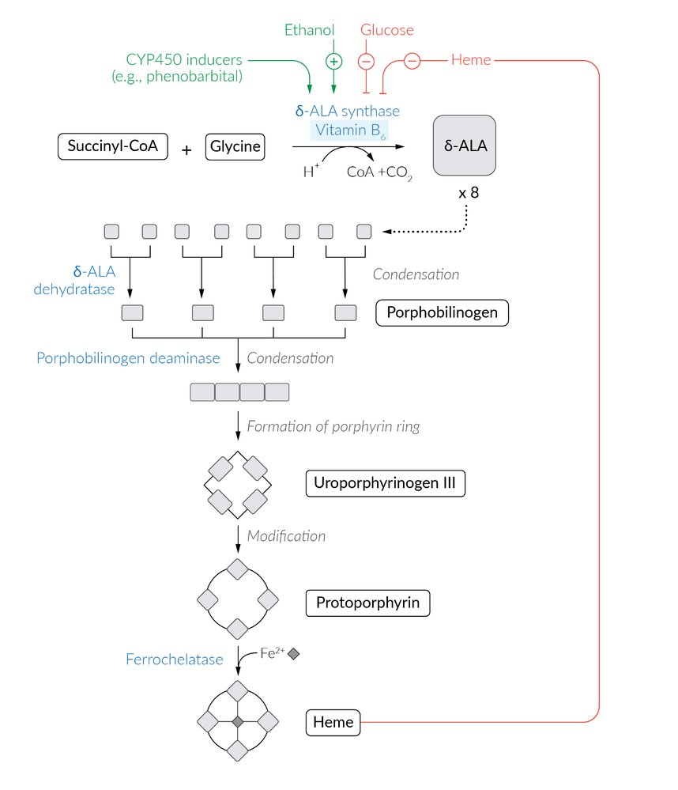
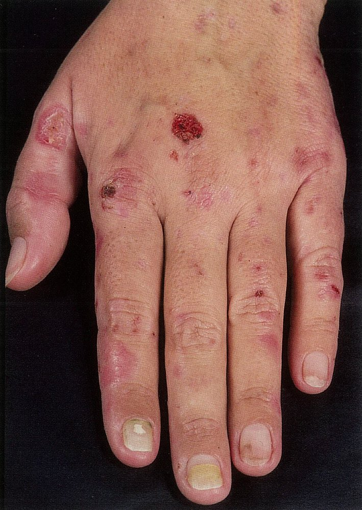
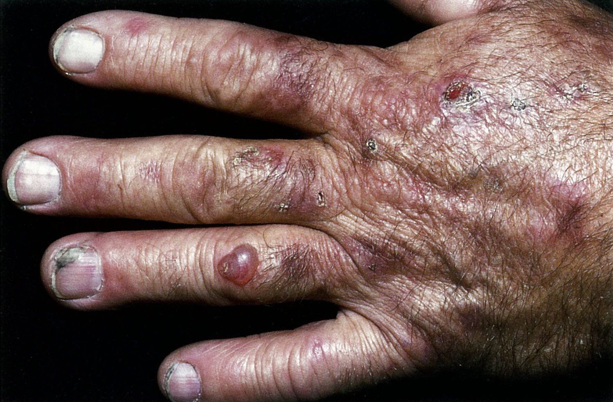
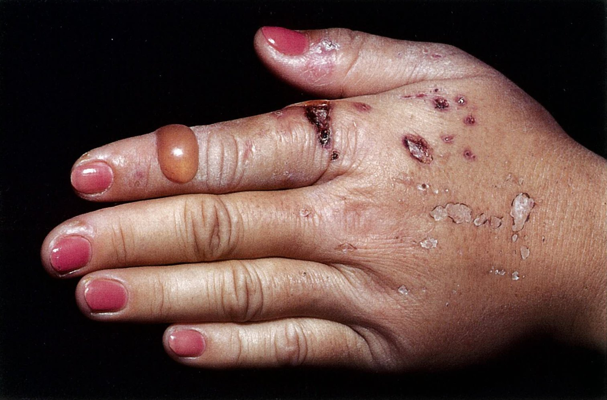
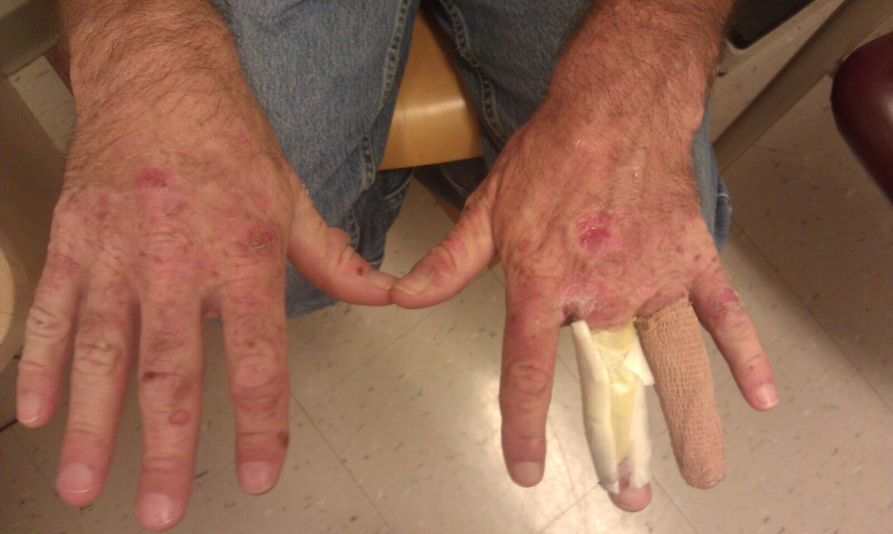
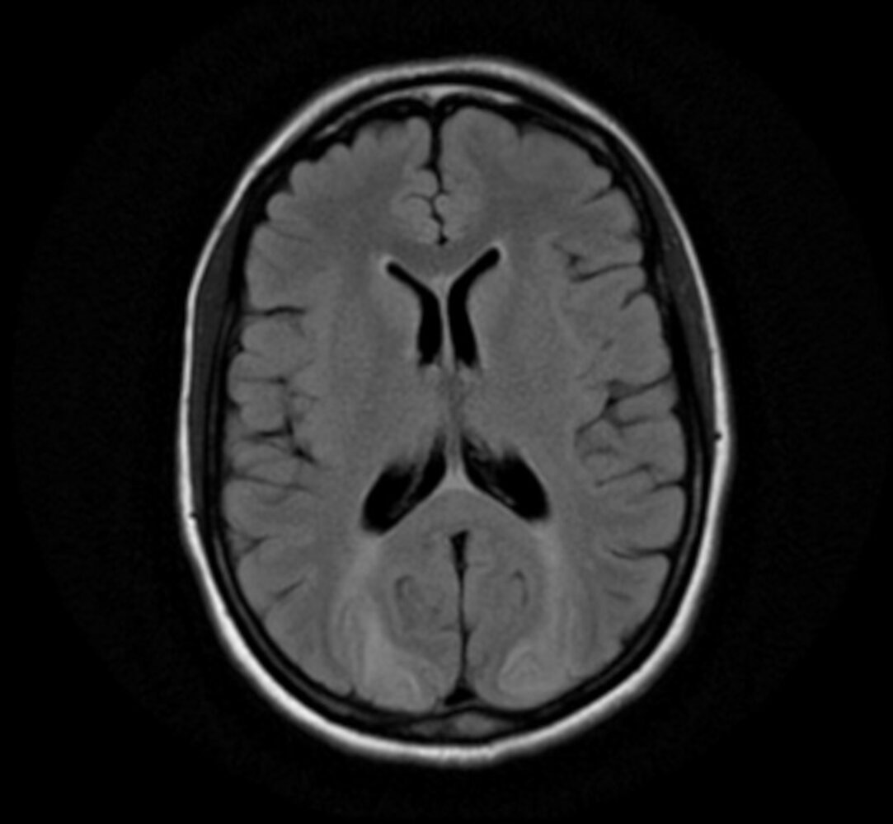

# Porphyrias

*Categories: Clinical knowledge > Dermatology > Congenital disorders > Porphyrias*

[Original Article Link](https://coursology-qbank.com/amboss/article/mk0VoT)

---

## Summary

Porphyrias are a group of rare, inherited or (less commonly) acquired metabolic disorders in which defective enzymes impair the biosynthesis of <u>heme</u> in the <u>liver</u> and/or <u>bone marrow</u>. All porphyrias are characterized by the accumulation of <u>porphyrin</u>, or intermediates of its biosynthesis, which can cause a variety of symptoms depending on the organs involved (e.g., <u>skin</u>, <u>liver</u>, <u>CNS</u>). <u>Porphyria cutanea tarda</u> (PCT) is the most common form and manifests with chronic, <u>blistering</u> cutaneous <u>photosensitivity</u> and tea-colored urine. The diagnosis of PCT is confirmed by detecting <u>porphyrins</u> in urine or serum. Management consists of rigorous <u>photoprotective measures</u>, regular <u>phlebotomy</u> or low-dose <u>hydroxychloroquine</u>, and avoiding <u>risk factors</u>. The second most common form, <u>acute intermittent porphyria</u> (<u>AIP</u>), is characterized by life-threatening attacks of severe abdominal <u>pain</u>, <u>nausea and vomiting</u>, <u>tachycardia</u>, and neuropsychiatric abnormalities. Attacks are generally triggered by certain medications, <u>alcohol</u>, infections, or <u>fasting</u>. The diagnosis of <u>AIP</u> is confirmed by detecting metabolic <u>heme</u> precursors in urine, which often appears reddish. An important acquired form of porphyria is <u>lead poisoning</u>, which is discussed in another article (see “<u>Metal toxicity</u>”). Patients with a known porphyria should avoid potential triggers. Management of <u>AIP</u> consists of <u>supportive care</u>; acute attacks should be treated with <u>hemin</u> to reduce <u>heme</u> production.

---

## Overview

### Description

* Porphyrias are a rare group of inherited or (less commonly) acquired metabolic disorders in which defective enzymes impair the biosynthesis of <u>heme</u> in the <u>liver</u> and/or <u>bone marrow</u>.

### Pathophysiology

* Trigger → ↓ enzyme activity in <u>heme</u> biosynthesis → intermediates of <u>heme</u> production accumulate

* → Deposited into different tissue, such as the <u>skin</u> and/or <u>liver</u> → symptoms

* → Increased urinary and fecal elimination → metabolite detection

* The specific intermediates that accumulate depends on which enzymes are affected in the <u>heme</u> biosynthesis pathway.

### Classification

Porphyrias can be classified based on inheritance or organ of accumulation.

* Inheritance: primary (inherited) or secondary (acquired)

* Organ of accumulation: 

* Hepatic (more common)

* Acute (often systemic): <u>Acute intermittent porphyria</u> is most common.

* Chronic (often cutaneous): <u>Porphyria cutanea tarda</u> is most common.

* Erythropoietic variants (rare)

#### Primary porphyrias (hereditary enzyme defect)

* Hepatic porphyrias

* Acute hepatic porphyrias

* <u>Acute intermittent porphyria</u> (<u>autosomal dominant</u>)

* Porphyria variegata (<u>autosomal dominant</u>)

* Hereditary coproporphyria (<u>autosomal dominant</u>)

* Doss porphyria (<u>autosomal recessive</u>)

* Chronic hepatic porphyrias

* <u>Porphyria cutanea tarda</u> (<u>autosomal dominant</u> or acquired)

* Hepatoerythropoietic porphyria (<u>autosomal recessive</u>)

* <u>Erythropoietic porphyrias</u>

* <u>Congenital erythropoietic porphyria</u> (Gunther disease, <u>autosomal recessive</u>)

* <u>Erythropoietic protoporphyria</u> (<u>autosomal dominant</u>)

#### Secondary porphyria (acquired)

* Secondary coproporphyria (caused by e.g., intoxication, hepatic diseases, blood disorders, infections, <u>starvation</u>)

* Secondary protoporphyrinemia (caused by e.g., <u>anemia</u>, <u>alcohol</u>, or chronic heavy metal <u>poisoning</u>; see <u>metal toxicity</u>)

Heme synthesis

Heme synthesis and corresponding diseases

---

## Porphyria cutanea tarda (PCT)

### <u>Epidemiology</u>

* Most common porphyria  [[1]](https://coursology-qbank.com/amboss/article/rzbf8w)

* Peak <u>incidence</u>: 30–50 years of age [[2]](https://coursology-qbank.com/amboss/article/FVXgwC)

### Etiology and pathophysiology [[2]](https://coursology-qbank.com/amboss/article/FVXgwC)[[3]](https://coursology-qbank.com/amboss/article/9TXNGx)

* Reduced activity of <u>heme</u> biosynthesis enzyme <u>uroporphyrinogen III decarboxylase</u> (<u>UROD</u>) → <u>uroporphyrin</u> accumulates in the <u>skin</u> → sunlight-dependent <u>skin</u> damage (chronic <u>photosensitivity</u>) 

* Type I: acquired (sporadic) deficiency of <u>UROD</u>

* Type II: inherited/familial (<u>autosomal dominant</u>) <u>UROD</u> mutation

* Susceptibility factors 

* <u>Iron overload</u> leading to increased hepatic <u>iron stores</u> (PCT is an <u>iron</u>-related disease) 

* Primary (genetic): <u>hemochromatosis</u>

* Secondary (acquired): excessive <u>iron</u> supplementation, <u>blood transfusions</u> in chronic <u>kidney</u> or <u>liver</u> disease [[4]](https://coursology-qbank.com/amboss/article/VRXGNB)[[5]](https://coursology-qbank.com/amboss/article/wLXh-A)

* <u>Alcohol</u>, smoking

* <u>Hepatitis C</u>

* <u>HIV</u>

* <u>Hepatic steatosis</u>

* <u>Estrogen</u> therapy

* Sunlight exposure

### Clinical findings [[2]](https://coursology-qbank.com/amboss/article/FVXgwC)[[3]](https://coursology-qbank.com/amboss/article/9TXNGx)

PCT manifests clinically as a dermatological disease.

* Characteristic cutaneous findings

* <u>Blistering</u> <u>skin</u> lesions (<u>vesicles</u>, <u>bullae</u>) secondary to the increased fragility of sun-exposed <u>skin</u> (<u>blistering</u> <u>photosensitivity</u>)

* Scarring and <u>milia</u> secondary to an impaired healing process

* <u>Hypertrichosis</u>

* <u>Hyperpigmentation</u>

* <u>Scleroderma</u>-like changes

* Common locations

* Dorsum of the hand

* Face and neck

* Extensor surface of the forearm

* Red-brown (tea-colored) urine

> [!TIP]
> Consider PCT in a patient presenting with a <u>blistering</u> <u>rash</u> on sun-exposed <u>skin</u>.

Porphyria cutanea tarda

Porphyria cutanea tarda

Porphyria cutanea tarda

Porphyria cutanea tarda

### Diagnosis [[2]](https://coursology-qbank.com/amboss/article/FVXgwC)[[3]](https://coursology-qbank.com/amboss/article/9TXNGx)

A high index of suspicion is necessary as the symptoms overlap with several other conditions. Consider PCT in adult patients with a <u>blistering</u> <u>rash</u> on sun-exposed areas (especially the back of the hands) and a known susceptibility factor.

#### Routine blood studies

* <u>CBC</u>: typically normal

* <u>Liver chemistries</u>: ↑ <u>AST</u>, <u>ALT</u>, and <u>GGT</u>

* Renal function: may be abnormal

* <u>Iron studies</u>: ↑ serum <u>ferritin</u>

* <u>Hepatitis B screening</u>, <u>hepatitis C screening</u>, and <u>HIV testing</u> (if the patient has susceptibility factors)

#### Confirmatory diagnostic studies

* First-line testing 

* <u>Spot urine</u> sample test: ↑↑ <u>uroporphyrins</u>

* Blood test: ↑ serum <u>porphyrins</u>

* Second-line testing: <u>UROD</u> activity analysis and <u>gene</u> mutation detection

### Management [[2]](https://coursology-qbank.com/amboss/article/FVXgwC)[[3]](https://coursology-qbank.com/amboss/article/9TXNGx)

The goal of therapy is to resolve the patient's symptoms by reducing <u>porphyrin</u> levels.

#### General measures

* Avoid susceptibility factors, e.g., smoking, <u>alcohol</u>, and <u>exogenous</u> <u>estrogen</u>.

* Advise patients on <u>photoprotective measures</u>, including reducing exposure to visible light (e.g., using large particle sunscreens). [[6]](https://coursology-qbank.com/amboss/article/CLXq-A)

#### Treatment

* <u>Phlebotomy</u>: indicated in all patients with symptomatic PCT 

* Procedure: ∼ 450 mL of blood is removed every 2 weeks

* Therapeutic targets

* Serum <u>ferritin</u> level ∼ 15 ng/mL (near the <u>lower limit of normal</u>)

* Plasma <u>porphyrin</u> level ∼ 1 mcg/dL

* Low-dose <u>hydroxychloroquine</u>  DOSAGE or <u>chloroquine</u> DOSAGE 

* Indications include: 

* Patients unable to tolerate <u>phlebotomy</u> (e.g., concurrent <u>anemia</u>)

* Presence of <u>HFE gene</u> mutation

* No severe <u>iron overload</u>

* Duration: until plasma or urine <u>porphyrins</u> have normalized

#### Ongoing management

* Treatment of <u>hepatitis C</u> (after initiation of treatment for PCT)  [[2]](https://coursology-qbank.com/amboss/article/FVXgwC)

* <u>Hepatocellular carcinoma screening</u>: <u>α-fetoprotein</u> and <u>liver</u> imaging  [[7]](https://coursology-qbank.com/amboss/article/WRXPNB)

---

## Acute intermittent porphyria (AIP)

### <u>Epidemiology</u>

* Second most common porphyria  [[1]](https://coursology-qbank.com/amboss/article/rzbf8w)

* Peak <u>incidence</u>: 20–30 years of age [[2]](https://coursology-qbank.com/amboss/article/FVXgwC)

* Sex: <u>♀</u> > <u>♂</u>

### Etiology and pathophysiology [[2]](https://coursology-qbank.com/amboss/article/FVXgwC)

* <u>Autosomal dominant</u> <u>gene</u> mutation, with variable <u>penetrance</u>

* Approx. 80–90% of carriers of the <u>AIP</u> <u>gene</u> mutation are asymptomatic.

* Trigger → ↑ <u>heme</u> demand and biosynthesis → impaired enzyme activity due to a mutation of <u>porphobilinogen deaminase</u> (<u>PBG-D</u>) (previously known as <u>uroporphyrinogen</u> I <u>synthase</u>);   → accumulation of <u>heme</u> intermediates <u>porphobilinogen</u> (PBG) and δ-aminolevulinic acid (<u>ALA</u>) → symptoms

### Triggers of acute porphyric attacks [[2]](https://coursology-qbank.com/amboss/article/FVXgwC)[[3]](https://coursology-qbank.com/amboss/article/9TXNGx)

Most triggers increase the demand for hepatic <u>heme</u>, thereby stimulating <u>heme</u> biosynthesis, which, in the setting of an <u>AIP</u> enzyme mutation, results in the accumulation of <u>heme</u> intermediates.

* Medications (especially inducers of hepatic <u>cytochrome P450</u> enzymes, which are used in the biosynthesis of <u>heme</u>), including:

* <u>Anticonvulsants</u> (e.g., <u>barbiturates</u>, <u>phenytoin</u>)

* <u>Sulfonamides</u>

* <u>Anesthetics</u>

* <u>Hormone</u> therapy

* See “Tips & Links” for the drug safety database of the American Porphyria Foundation.

* <u>Alcohol</u>

* Smoking

* <u>Endogenous</u> sex <u>hormones</u>

* <u>Fasting</u>/crash dieting

* Metabolic <u>stress</u> (e.g., <u>surgery</u>, infection)

### Clinical features [[8]](https://coursology-qbank.com/amboss/article/1fX2Ox)

The clinical presentation of <u>AIP</u> is variable and symptoms are often nonspecific. In contrast to some porphyrias, there are no dermatological findings.

* Acute attacks

* GI symptoms: severe abdominal <u>pain</u>, <u>nausea</u>, <u>vomiting</u>, <u>constipation</u>

* Neurological abnormalities: <u>polyneuropathies</u> (nonspecific <u>pain</u>, <u>weakness</u>/fatigue, <u>paresthesia</u>, <u>paresis</u>), <u>seizures</u>, respiratory <u>paralysis</u>

* <u>Autonomic dysfunction</u>: <u>tachycardia</u>, <u>hypertension</u>

* Psychiatric abnormalities: <u>hallucinations</u>, <u>disorientation</u>, <u>anxiety</u>, <u>insomnia</u>

* Red-purple urine

* Chronic symptoms

* Most patients remain asymptomatic between attacks.

* Chronic <u>neuropathic pain</u>

* <u>Depression</u> (increased risk of <u>suicide</u>)

> [!NOTE]
> The 5 P's of <u>acute intermittent porphyria</u>: Painful abdomen, Polyneuropathy, Psychologic disturbances, Port wine-colored pee, Precipitated by triggers like drugs

> [!NOTE]
> The <u>skin</u> is not involved in <u>acute intermittent porphyria</u>.

### Diagnosis [[2]](https://coursology-qbank.com/amboss/article/FVXgwC)[[8]](https://coursology-qbank.com/amboss/article/1fX2Ox)

Diagnosis of <u>AIP</u> is challenging and a high index of suspicion must be maintained. Consider <u>AIP</u> if typical clinical features are seen in the absence of other causes (e.g., unexplained severe abdominal <u>pain</u> accompanied by <u>muscle weakness</u> and dark urine).

#### Routine studies

Routine <u>laboratory studies</u> and imaging are often normal, and the diagnosis is confirmed with specialized tests.

* <u>Laboratory studies</u>

* <u>CBC</u>: normal or nonspecific findings

* <u>BMP</u>: possible ↓ Na+, ↑ Cr

* <u>Liver chemistries</u>: ↑ <u>AST</u> and <u>ALT</u>

* Imaging: frequently performed in acute attacks to rule out differential diagnoses

* Abdominal imaging (<u>x-ray</u> or CT):

* Typically normal

* May show dilated bowel loops with <u>air-fluid levels</u> representing an <u>ileus</u>

* <u>MRI</u> or CT <u>brain</u>

* Typically normal

* May show <u>white matter</u> <u>vasogenic edema</u> affecting the <u>posterior</u> <u>brain</u>, consistent with <u>posterior reversible encephalopathy syndrome</u> (PRES)  [[9]](https://coursology-qbank.com/amboss/article/aRXQlB)

Paralytic ileus

Posterior reversible encephalopathy syndrome (PRES)

#### Confirmatory studies

* First-line testing: <u>spot urine</u> sample for <u>heme</u> precursor levels 

* <u>Porphobilinogen</u> (PBG): ↑ (∼ 20–200 mg/L)

* <u>δ-aminolevulinic acid</u> (<u>ALA</u>): ↑  (∼ 10–100 mg/L)

* Second-line testing 

* <u>Porphyrin</u> levels: greatly increased in urine, normal to slightly increased in feces and plasma

* <u>Erythrocyte</u> <u>porphobilinogen</u>: decreased

* Enzyme activity measurement and <u>DNA</u> testing

> [!TIP]
> A 24-hour urine collection is not necessary for the diagnosis of an acute <u>AIP</u> attack and delays diagnosis.

---

## Management of acute attacks

The goal of therapy is to stop the acute attack as quickly as possible while providing supportive and symptomatic care. Hospitalization may be required and specialists (i.e., <u>hematology</u> or hepatology) should be consulted.

### Approach [[2]](https://coursology-qbank.com/amboss/article/FVXgwC)[[3]](https://coursology-qbank.com/amboss/article/9TXNGx)[[8]](https://coursology-qbank.com/amboss/article/1fX2Ox)

* Admit all patients with severe <u>pain</u>, an inability to tolerate oral intake, or a new diagnosis.

* Identify potential triggers and withdraw unsafe medications if possible (see “Tips & Links” for the drug safety database of the American Porphyria Foundation).

* Ensure close monitoring (consider <u>ICU</u> admission pending neurological and respiratory status).

* Monitor daily for:

* <u>Electrolyte</u> derangements (including <u>magnesium</u>)

* Evidence of <u>urinary retention</u>, <u>muscle weakness</u>, <u>ileus</u>, or psychiatric changes

* Respiratory impairment via bedside <u>spirometry</u>

### Treatment

* Hemin therapy DOSAGE [[8]](https://coursology-qbank.com/amboss/article/1fX2Ox)

* Start as soon as possible and continue for 4 days.

* Mechanism: <u>Hemin</u> is an <u>iron</u>-containing <u>porphyrin</u> that decreases the activity of <u>δ-aminolevulinate synthase</u>, thereby decreasing <u>heme</u> biosynthesis and the accumulation of intermediates.

* <u>Glucose</u> loading: :  DOSAGE consider only for mild attacks or as temporizing measure   [[10]](https://coursology-qbank.com/amboss/article/UKXbf_)[[11]](https://coursology-qbank.com/amboss/article/2KXTf_)

* Monitor for <u>hyperglycemia</u> and <u>hyponatremia</u> with serial <u>BMPs</u> every 4 hours.

* Transition to oral intake as early as possible.

### <u>Supportive care</u> [[3]](https://coursology-qbank.com/amboss/article/9TXNGx)

The choice of medications in porphyria patients is complicated and should ideally be agreed upon with a porphyria specialist.

* General measures

* <u>IV fluid therapy</u>

* <u>Electrolyte repletion</u>

* <u>Nutritional support</u>  [[11]](https://coursology-qbank.com/amboss/article/2KXTf_)

* Options for symptomatic treatment include: [[3]](https://coursology-qbank.com/amboss/article/9TXNGx)

* <u>Pain management</u>, e.g., <u>acetaminophen</u> DOSAGE, <u>morphine</u> DOSAGE

* <u>Antiemetics</u>, e.g., <u>ondansetron</u> DOSAGE

* <u>Anxiolytics</u>, e.g., <u>lorazepam</u> DOSAGE

* <u>Beta blockers</u> for <u>hypertension</u> and symptomatic <u>tachycardia</u>, e.g., <u>propranolol</u> DOSAGE)

* <u>Seizure</u> management

* Ensure <u>seizure precautions</u> (especially if the patient has <u>hyponatremia</u>).

* <u>Treat hyponatremia</u> and <u>hypomagnesemia</u>.

* Termination of acute <u>seizures</u>: Consider <u>lorazepam</u>. DOSAGE

* Prevention of further <u>seizures</u>: Consult with a <u>neurologist</u> and porphyria specialist.

> [!TIP]
> Management of acute attacks of <u>AIP</u> can be challenging; obtain specialist consults early.

---

## Chronic therapy

Due to the complexity of this rare disease, patients with <u>AIP</u> should receive an evaluation by specialists at a designated porphyria center.

### All patients [[8]](https://coursology-qbank.com/amboss/article/1fX2Ox)

* Counsel patients on avoiding triggers and maintaining adequate nutrition.

* Screen for long-term complications: <u>chronic kidney disease</u>, <u>hypertension</u>, and <u>hepatocellular carcinoma</u>.

* Provide medical alert bracelets and wallet cards.

* Organize <u>genetic counseling</u> (for both the patient and relatives).

* Consider the need for:

* Chronic <u>neuropathic pain</u> management

* <u>Major depressive disorder</u> management (with <u>suicide</u> prevention)

### Severe disease with recurring attacks

* Prophylactic <u>hemin</u> infusions DOSAGE  [[8]](https://coursology-qbank.com/amboss/article/1fX2Ox)[[12]](https://coursology-qbank.com/amboss/article/5KXiS_)

* <u>Givosiran</u> therapy (specialist management needed)  [[13]](https://coursology-qbank.com/amboss/article/wTXhGx)

* Consider <u>gonadotropin-releasing hormone agonist</u> therapy in women with frequent cyclical attacks.

* <u>Liver transplant</u> (refractory disease) [[2]](https://coursology-qbank.com/amboss/article/FVXgwC)

---

## Differential diagnoses

| Porphyrias vs. lead poisoning |  |  |  |
| --- | --- | --- | --- |
|  | <u>Porphyria cutanea tarda</u> | <u>Acute intermittent porphyria</u> | <u>Lead poisoning</u> |
| Defective enzyme |  * <u>Uroporphyrinogen III decarboxylase</u>   |  * <u>Porphobilinogen deaminase</u>   |   * <u>Ferrochelatase</u>  * <u>ALA dehydratase</u>    |
| Accumulated substrate |  * <u>Uroporphyrin</u> in <u>skin</u> and urine   |  * <u>Porphobilinogen</u> and <u>ALA</u> in blood   |  * <u>Protoporphyrin</u> and <u>ALA</u> in <u>RBCs</u>   |
| Clinical features |   * <u>Blistering</u> <u>skin</u> lesions (<u>blistering</u> <u>photosensitivity</u>) on sun-exposed areas  * Possible scarring, <u>hypertrichosis</u>, and/or <u>hyperpigmentation</u>  * Red-brown (tea-colored) urine    |   * Severe abdominal <u>pain</u>, <u>nausea</u>, <u>vomiting</u>, <u>constipation</u>  * <u>Polyneuropathies</u>, <u>seizures</u>  * <u>Muscle weakness</u>, <u>paresthesia</u>  * <u>Hallucinations</u>, <u>disorientation</u>, <u>anxiety</u>, <u>insomnia</u>  * <u>Tachycardia</u>, <u>hypertension</u>  * Red-purple (port-wine-colored) urine    |   * <u>Symptoms of anemia</u>  * <u>Headache</u>, fatigue, <u>muscle weakness</u>, <u>paresthesias</u>  * <u>Polyneuropathy</u>, <u>encephalopathy</u>, <u>seizures</u> (children are especially susceptible to the neurologic effects of <u>lead poisoning</u>)  * Nephropathy  * <u>Burton line</u> on the <u>gums</u>  * Severe abdominal <u>pain</u> (lead colic), <u>constipation</u>    |
| Diagnostics |   * <u>Spot urine</u> sample test: ↑↑ <u>uroporphyrins</u>  * Blood test: ↑ serum <u>porphyrins</u>    |  * <u>Spot urine</u> sample test  * ↑ <u>Porphobilinogen</u>  * ↑ <u>ALA</u>   |   * <u>Microcytic</u>, <u>hypochromic</u> <u>anemia</u>  * <u>Basophilic stippling</u> of <u>erythrocytes</u> on <u>peripheral blood smear</u>  * <u>Ring sideroblasts</u> in <u>bone marrow</u>    |
| Treatment |   * Avoidance of sun  * <u>Phlebotomy</u>  * Low-dose <u>hydroxychloroquine</u> OR <u>chloroquine</u>    |   * <u>Hemin</u>  * <u>Glucose</u> loading    |   * <u>Succimer</u>  * <u>Dimercaprol</u>    |

The differential diagnoses listed here are not exhaustive.

---