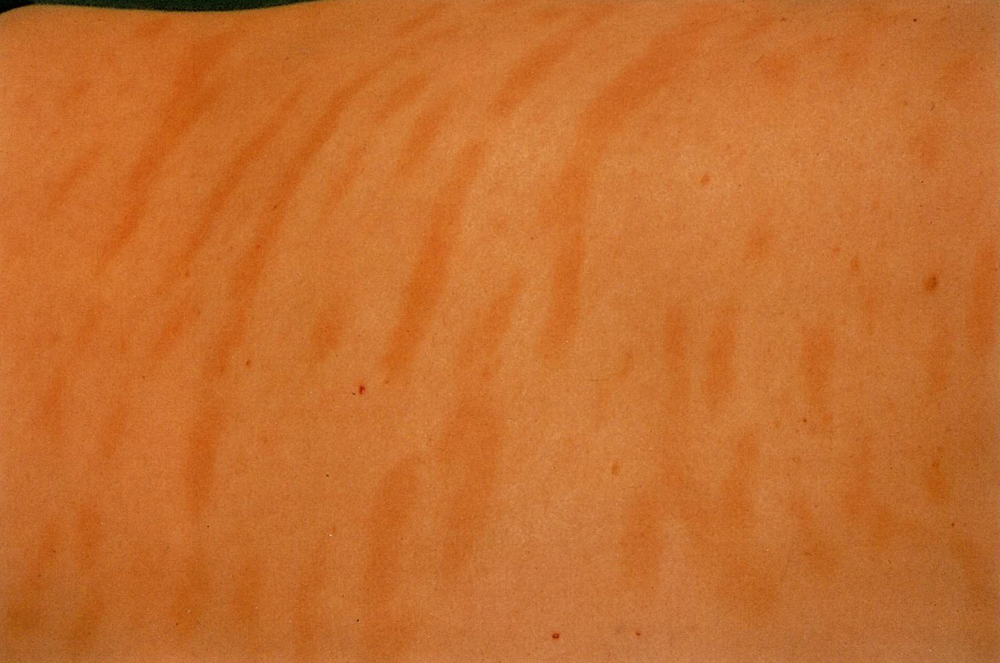

# Parapsoriasis

*Categories: Clinical knowledge > Dermatology > Idiopathic disorders > Parapsoriasis*

[Original Article Link](https://coursology-qbank.com/amboss/article/kk0mLT)

---

## Summary

The term “parapsoriasis” covers a large group of <u>idiopathic</u> cutaneous diseases characterized by asymptomatic or mildly pruritic, <u>erythematous</u>, scaly patches, and a chronic course. The condition is roughly classified into two types: <u>large plaque parapsoriasis</u> and <u>small plaque parapsoriasis</u>. <u>Large plaque parapsoriasis</u> is considered a premalignant condition that can progress to <u>mycosis fungoides</u>. Diagnosis is based on <u>clinical examination</u> and histopathological findings on <u>biopsy</u>. Treatment includes <u>topical steroid</u> therapy and <u>phototherapy</u>.

---

## Large plaque parapsoriasis

* Clinical features

* Irregularly-shaped, scaly, <u>atrophic</u> , salmon-colored, brown, or <u>erythematous</u> patches

* Size: ≥ 5 cm diameter

* Location: trunk, buttocks, thighs, flexor surfaces, and <u>breasts</u> (areas not exposed to sun)

* Considered a premalignant condition; may progress to <u>mycosis fungoides</u>

* Diagnostics: <u>skin biopsy</u>

* Treatment: always indicated, because treatment may prevent progression to <u>mycosis fungoides</u>

* High-<u>potency</u> topical <u>steroids</u>

* <u>Phototherapy</u> for refractory or widespread <u>plaques</u>

* <u>PUVA</u> therapy

* SUP (selective ultraviolet <u>phototherapy</u>)

* Monitor for progression to <u>mycosis fungoides</u>

Large plaque parapsoriasis

References:[[2]](https://coursology-qbank.com/amboss/article/e0YxUn)

---

## Differential diagnoses

* See <u>Differential diagnosis of scaling</u>

* Further differentials:

* <u>Mycosis fungoides</u>

* <u>Pityriasis rosea</u>

* <u>Pityriasis versicolor</u>

References:[[2]](https://coursology-qbank.com/amboss/article/e0YxUn)

The differential diagnoses listed here are not exhaustive.

---