# Psoriasis

*Categories: Clinical knowledge > Dermatology > Idiopathic disorders > Psoriasis*

[Original Article Link](https://coursology-qbank.com/amboss/article/4k03LT)

---

## Summary

Psoriasis is a common chronic inflammatory <u>skin</u> disorder affecting individuals with an underlying genetic predisposition. Triggering events (e.g., infection, medication) can lead to disease manifestation. Psoriasis typically manifests as sharply demarcated, <u>erythematous</u>, scaly, pruritic <u>plaques</u>, most commonly occurring on the scalp, presacral region, and extensor surfaces of the knees and <u>elbows</u>; however, any area of the <u>skin</u> may be affected. Other common clinical findings include <u>arthritis</u>, generally affecting the fingers and lower <u>spine</u>, and <u>nail</u> involvement (e.g., pitting, discoloration). The size, location, and severity of psoriasis lesions vary depending on the subtype. The diagnosis is primarily clinical, based on the patient's symptoms, history, and the presence of any specific signs (e.g., the <u>Auspitz sign</u>); a <u>biopsy</u> is rarely indicated. Mild psoriasis can be treated with topical agents such as <u>corticosteroids</u>, whereas moderate to severe disease requires systemic therapy (e.g., <u>phototherapy</u>, biologic agents).

---

## Epidemiology

* <u>Prevalence</u>: ∼ 2% of the US population  [[1]](https://coursology-qbank.com/amboss/article/1SX2Ax)[[2]](https://coursology-qbank.com/amboss/article/YMcnM10)[[3]](https://coursology-qbank.com/amboss/article/aHaQKN)

* Age of onset: : can present at any age; typically shows bimodal age distribution [[1]](https://coursology-qbank.com/amboss/article/1SX2Ax)[[4]](https://coursology-qbank.com/amboss/article/oEc09V0)

* Early onset psoriasis: (∼ 75% of cases): before 40 years of age

* Late onset psoriasis (∼ 25% of cases): after 40 years of age; usually mild

Epidemiological data refers to the US, unless otherwise specified.

---

## Etiology

* Genetic predisposition: most likely determined via <u>polygenic inheritance</u>  [[5]](https://coursology-qbank.com/amboss/article/UCabr5)

* Trigger factors  [[6]](https://coursology-qbank.com/amboss/article/bHaHKN)

* Infectious

* Infections of the <u>upper respiratory tract</u> caused by <u>β-hemolytic</u> <u>streptococci</u>

* <u>Staphylococcal infections</u>

* <u>HIV</u>

* Mechanical irritation

* Drugs;  (e.g., <u>beta-blockers</u>, <u>chloroquine</u>, <u>lithium</u>, <u>interferon</u>)

---

## Pathophysiology

The mechanism causing the <u>immune response</u> is not yet well understood.

* Increased <u>proliferation</u> of <u>keratinocytes</u> 

* <u>Acanthosis</u>: thickening of the <u>epidermis</u>

* <u>Parakeratosis</u>: retention of nucleated <u>keratinocytes</u> in the <u>stratum corneum</u>

* <u>T cells</u> secrete <u>cytokines</u>, which mediate an inflammatory response.

References:[[7]](https://coursology-qbank.com/amboss/article/5Cais5)

---

## Clinical features

The disease course is typically relapsing, with symptom-free intervals.

### Cutaneous lesions [[2]](https://coursology-qbank.com/amboss/article/YMcnM10)

* Well-demarcated, <u>erythematous</u> <u>plaques</u> and/or <u>papules</u> with silver-white <u>scaling</u>

* Typically, a few single lesions initially appear, often becoming confluent.  [[2]](https://coursology-qbank.com/amboss/article/YMcnM10)

* Located mainly on the scalp, trunk, <u>elbows</u>, and knees (extensor surfaces), but any area of the <u>skin</u> may be affected.

* <u>Pruritus</u> in ∼ 80% of cases (typically mild, but may be severe in some cases) [[8]](https://coursology-qbank.com/amboss/article/YHanKN)

* Characteristic features may be present.

* <u>Auspitz sign</u> ;  [[2]](https://coursology-qbank.com/amboss/article/YMcnM10)

* Small pinpoint bleeding when scales are scraped off

* Removal of the scales exposes the <u>dermal papillae</u>, which leads to bleeding.

* Koebner phenomenon: Physical stimuli or <u>skin</u> injury (e.g., trauma, scratching, irritating clothing) can lead to the appearance of psoriatic <u>skin</u> lesions on previously unaffected <u>skin</u> (isomorphic response).  [[2]](https://coursology-qbank.com/amboss/article/YMcnM10)

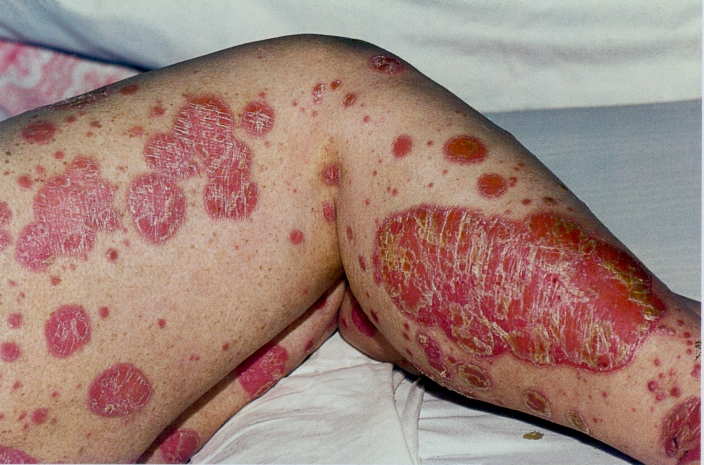

Disseminated plaque psoriasis

Psoriasis

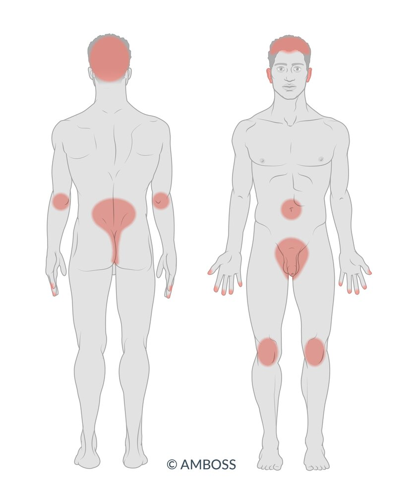

Most common sites of psoriasis

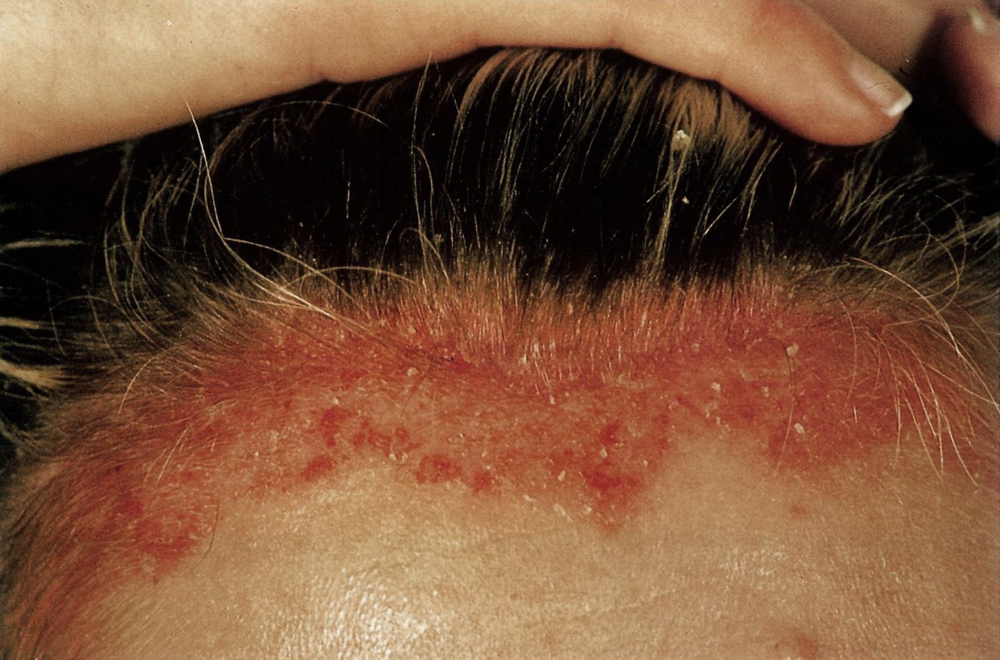

Psoriasis capitis

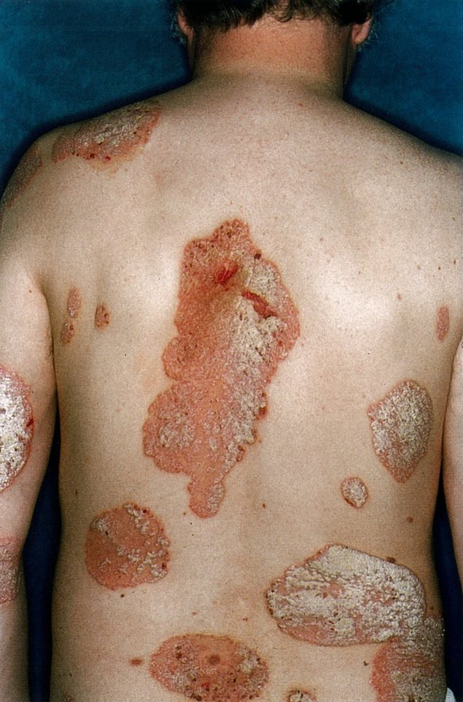

Plaque psoriasis

Psoriasis of the knee

Psoriasis with Auspitz sign

Psoriatic arthritis

#### Cutaneous variants  [[2]](https://coursology-qbank.com/amboss/article/YMcnM10)

* Plaque psoriasis: most common variant; characterized by symmetrically distributed, thick, scaly, <u>erythematous</u> lesions

* Guttate psoriasis 

* Lesions the size of drops of water

* May develop into <u>plaque psoriasis</u>

* Occurs mainly in children and <u>adolescents</u> after <u>streptococcal</u> infection

* Erythrodermic psoriasis   

* Generalized <u>erythematous</u> lesion with diffuse <u>scaling</u>

* May lead to severe illness with <u>fever</u> and <u>dehydration</u>

* Inverse psoriasis: : mainly affects <u>skin</u> folds and flexural creases of <u>large joints</u> (flexural psoriasis)

* Pustular psoriasis 

* High <u>correlation</u> with <u>HLA-B27</u>

* Generalized pustular psoriasis (most common subtype) 

* Generalized <u>erythroderma</u>, confluent white <u>pustules</u> over the entire body, involvement of the oral <u>mucosa</u> and <u>tongue</u>

* Relapsing course with pronounced <u>malaise</u> (<u>fever</u>, <u>weakness</u>, chills); may be fatal

> [!TIP]
> <u>Plaque psoriasis</u> is the most common psoriasis variant (accounts for ∼ 80–90% of psoriasis cases). [[2]](https://coursology-qbank.com/amboss/article/YMcnM10)

> [!WARNING]
> Erythrodermic and <u>generalized pustular psoriasis</u> can lead to severe, life-threatening illness, which must be treated as a <u>medical emergency</u>. [[2]](https://coursology-qbank.com/amboss/article/YMcnM10)

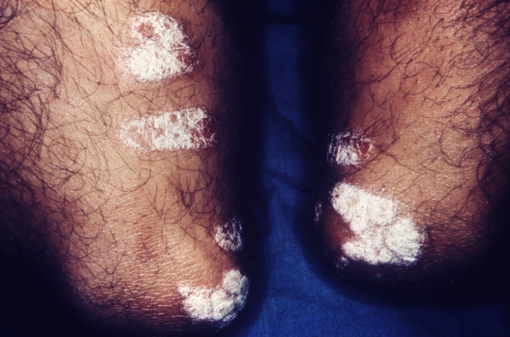

Plaque psoriasis

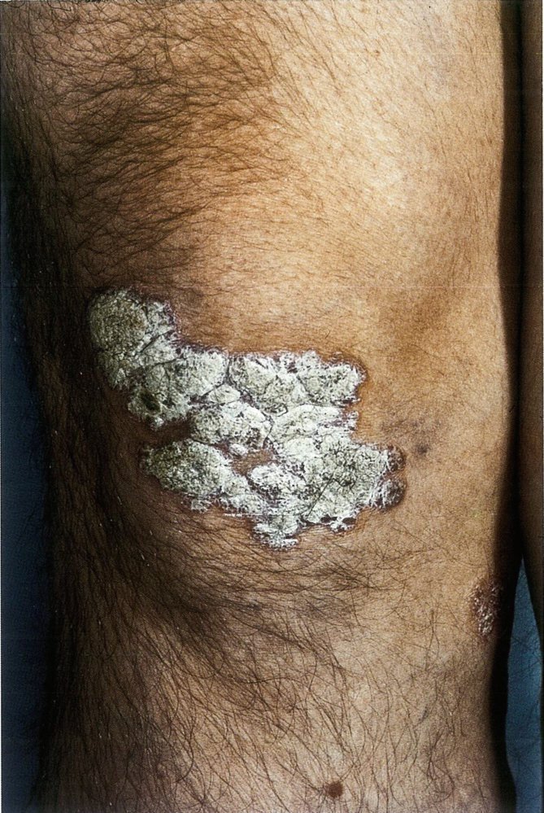

Plaque psoriasis

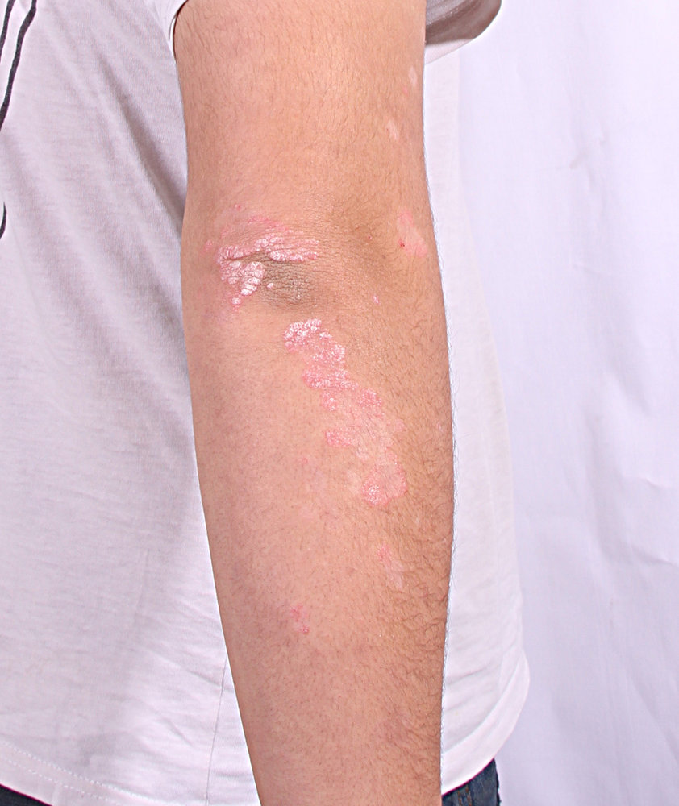

Plaque psoriasis

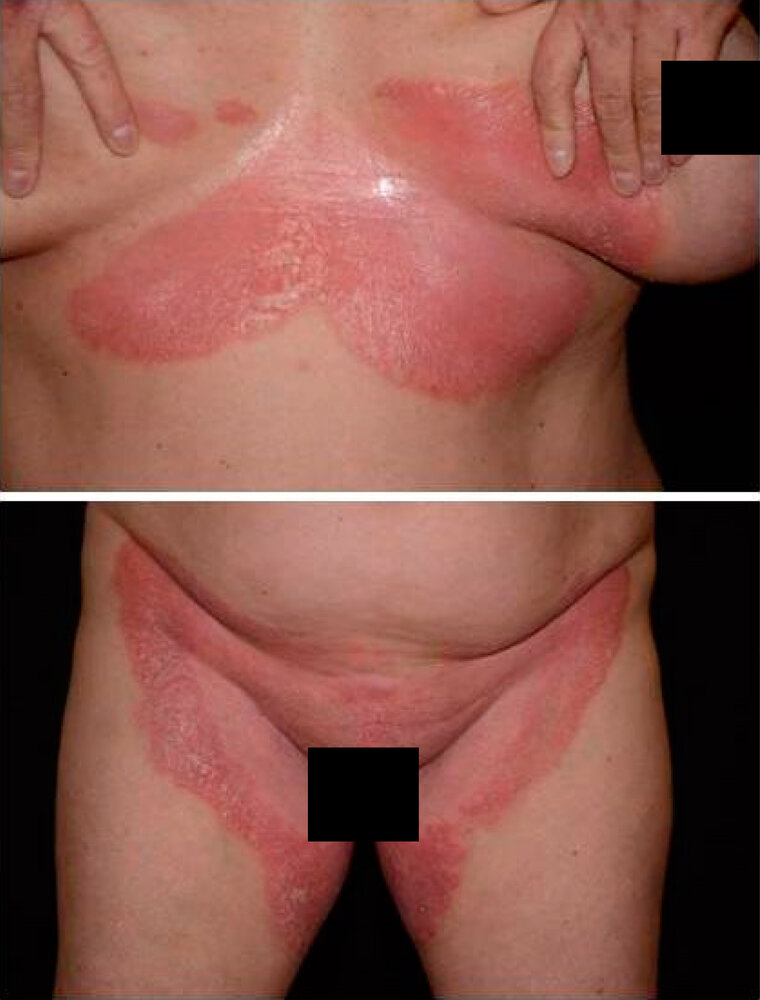

Inverse psoriasis

Inverse psoriasis

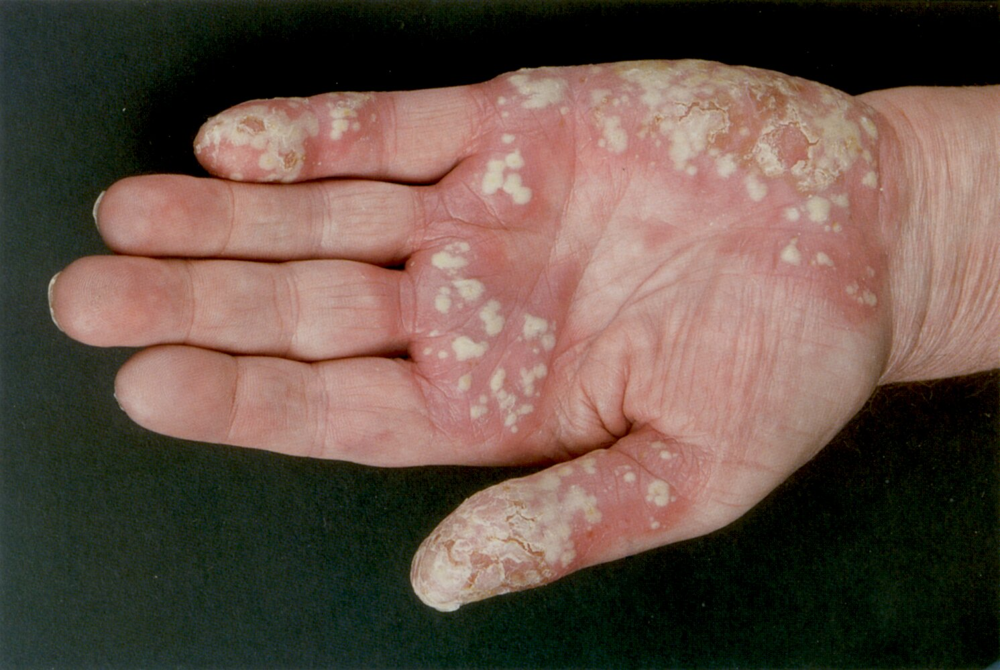

Pustular psoriasis

Generalized pustular psoriasis

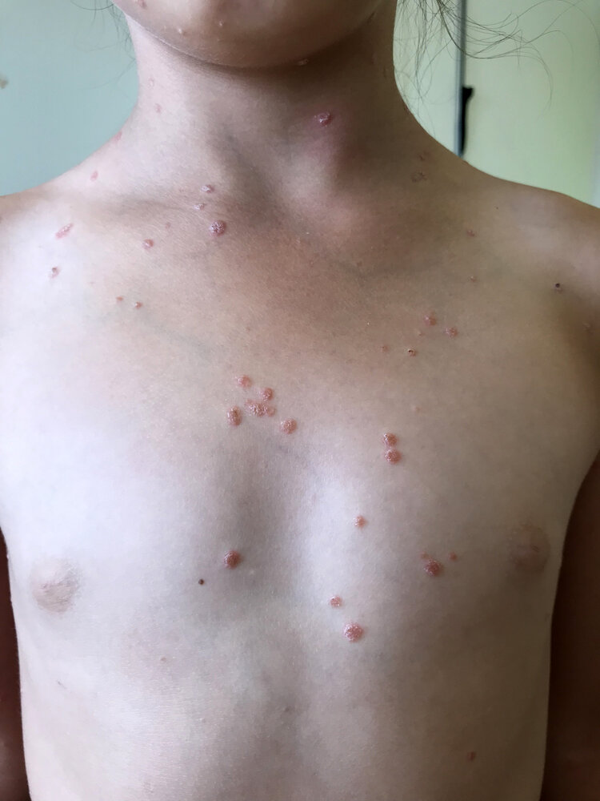

Guttate psoriasis

Psoriasis

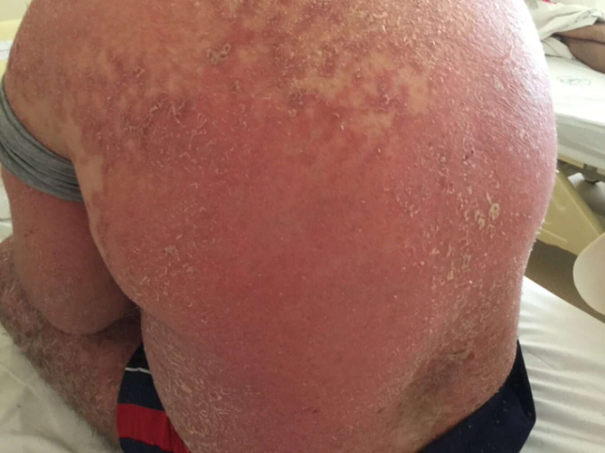

Erythrodermic psoriasis

Generalized exfoliative dermatitis

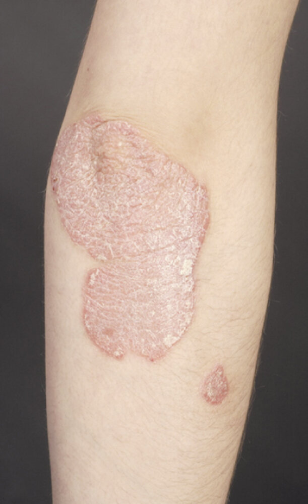

### <u>Nail</u> involvement [[2]](https://coursology-qbank.com/amboss/article/YMcnM10)

Present in ∼ 50% of cases [[9]](https://coursology-qbank.com/amboss/article/MCaMs5)

* Nail pitting: small, round depressions in the <u>nail</u>

* <u>Brittle nails</u>: <u>nail</u> <u>dystrophy</u> with crumbling of the <u>nail</u>

* <u>Onycholysis</u>: partial and mostly <u>distal</u> separation of the <u>nail plate</u>

* Oil drop sign (or <u>salmon spot</u>): well-circumscribed, yellow-red discoloration of the <u>nail</u> [[9]](https://coursology-qbank.com/amboss/article/MCaMs5)

> [!TIP]
> Clinical features vary depending on the cutaneous variant. <u>Erythema</u>, thickening, and <u>scaling</u> are present in most variants. [[2]](https://coursology-qbank.com/amboss/article/YMcnM10)

---

## Psoriatic arthritis

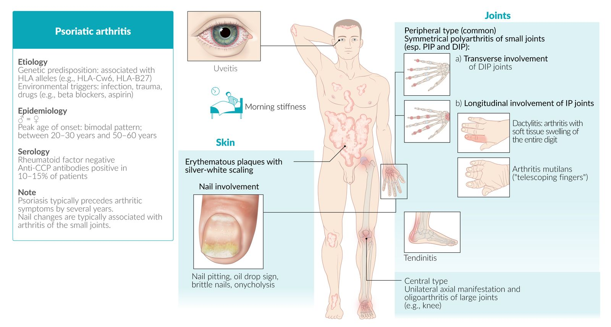

Psoriatic arthritis fact sheet

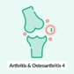

Arthritis & Osteoarthritis - Part 4: Joint Involvement Patterns in Rheumatic Diseases

### Definition

<u>Psoriatic arthritis</u> (PsA) is a type of inflammatory <u>arthritis</u> that primarily affects the hands, feet, and/or <u>spine</u> and occurs in up to 30% of patients with psoriasis.    [[10]](https://coursology-qbank.com/amboss/article/ZMcZM10)

> [!TIP]
> Psoriasis and PsA can occur together or alone

### Clinical features [[10]](https://coursology-qbank.com/amboss/article/ZMcZM10)[[11]](https://coursology-qbank.com/amboss/article/mncVF10)

#### <u>Arthritis</u> [[10]](https://coursology-qbank.com/amboss/article/ZMcZM10)[[11]](https://coursology-qbank.com/amboss/article/mncVF10)

Multiple patterns may be present.

* <u>Oligoarthritis</u>;  (typically asymmetric; ≤ 4 <u>joints</u> affected)

* <u>Polyarthritis</u> (symmetric; similar appearance to <u>rheumatoid arthritis</u>)

* Involvement of <u>distal</u> and <u>proximal interphalangeal joints</u> (<u>DIP</u> and <u>PIP</u>); often occurs in conjunction with other subtypes  [[10]](https://coursology-qbank.com/amboss/article/ZMcZM10)

* Arthritis mutilans: destruction of <u>interphalangeal joints</u> through bone resorption, resulting in the collapse of the <u>soft tissue</u> of the affected area (e.g., telescoping fingers or “<u>opera glass hand</u>”)

* Axial involvement (<u>spine</u> and <u>sacroiliac joints</u>); often occurs in conjunction with other subtypes

Distribution pattern: Psoriatic arthritis of the hand

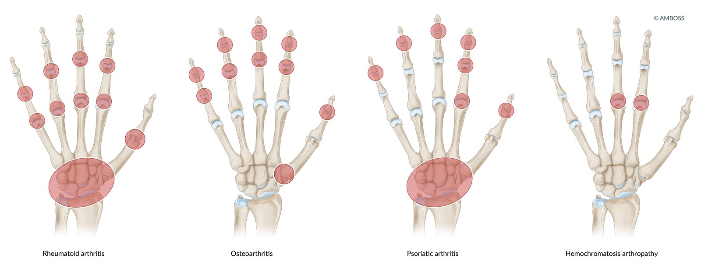

Differential diagnosis: hand joint pain

Telescoping fingers (arthritis mutilans)

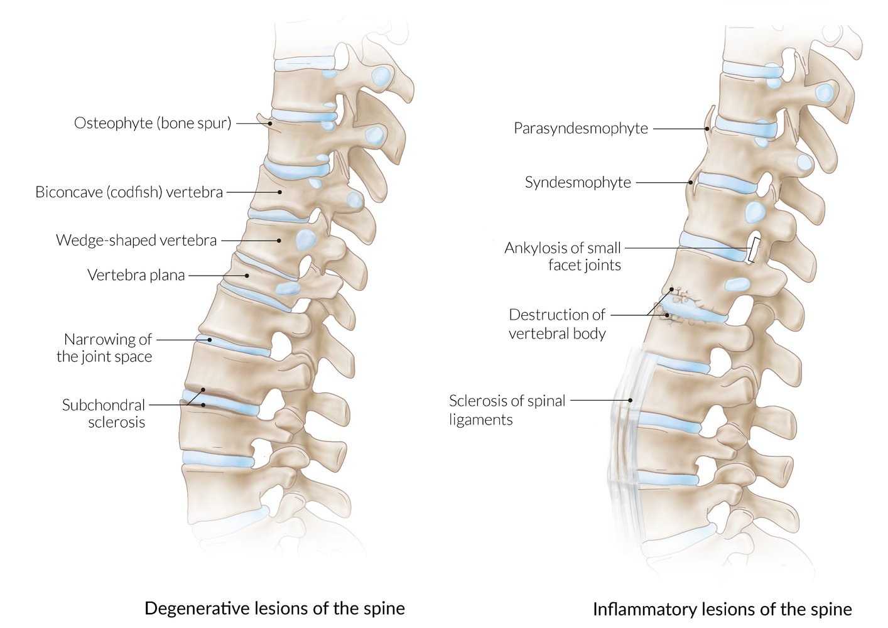

Degenerative and inflammatory lesions of the spine

Psoriatic arthritis

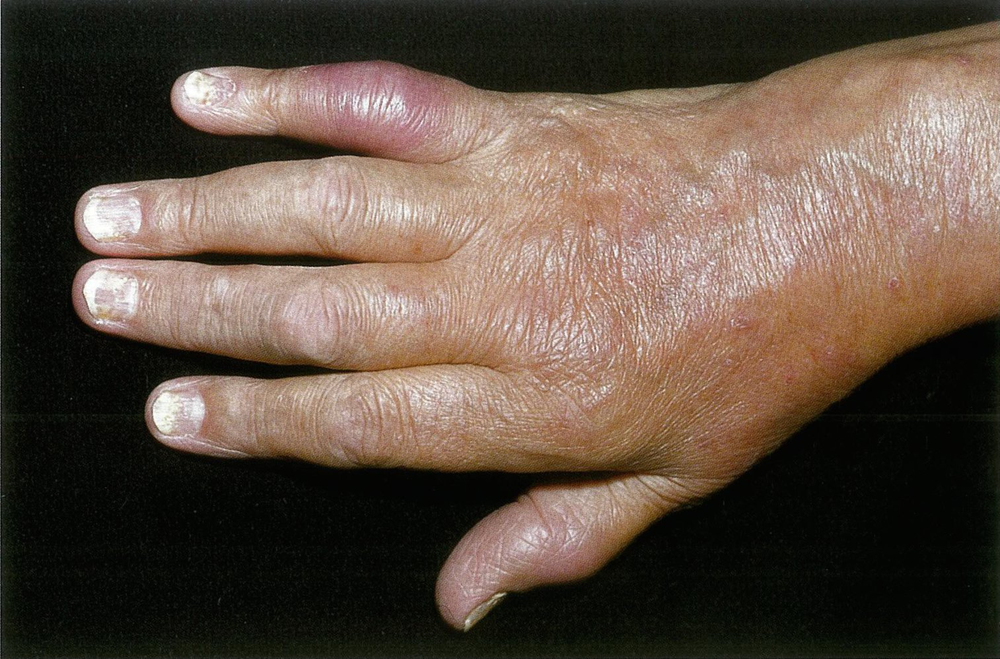

Psoriatic arthritis of the right hand

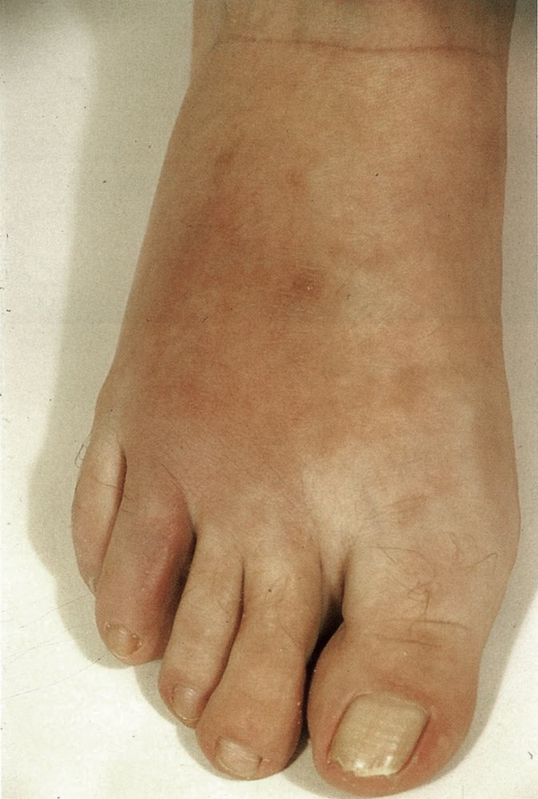

Psoriatic arthritis

#### Accompanying features [[10]](https://coursology-qbank.com/amboss/article/ZMcZM10)

* <u>Enthesitis</u>, e.g., of the <u>calcaneal tendon</u> or the <u>plantar fascia</u>   [[10]](https://coursology-qbank.com/amboss/article/ZMcZM10)

* Dactylitis: inflammation and swelling of the fingers and/or toes (“<u>sausage digits</u>”)    [[10]](https://coursology-qbank.com/amboss/article/ZMcZM10)

* <u>Tenosynovitis</u>

* <u>Nail</u> involvement (e.g., pitting, <u>onycholysis</u>)  [[2]](https://coursology-qbank.com/amboss/article/YMcnM10)[[10]](https://coursology-qbank.com/amboss/article/ZMcZM10)

* <u>Uveitis</u>  [[10]](https://coursology-qbank.com/amboss/article/ZMcZM10)

> [!TIP]
> In PsA, patterns of <u>joint</u> involvement can change over time and vary widely between patients. <u>Oligoarthritis</u> tends to be more common at onset, while <u>polyarthritis</u> may develop in later stages. [[10]](https://coursology-qbank.com/amboss/article/ZMcZM10)

Enthesitis

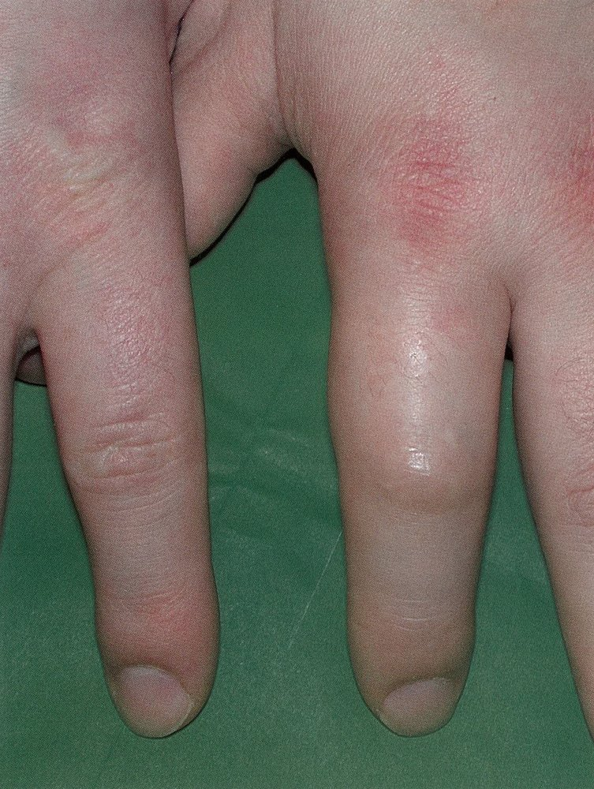

Dactylitis

### Diagnostics [[10]](https://coursology-qbank.com/amboss/article/ZMcZM10)[[11]](https://coursology-qbank.com/amboss/article/mncVF10)

#### General principles

* Diagnosis is mainly clinical, based on patient and <u>family history</u> and clinical features.

* lmaging studies can support the diagnosis and help estimate severity.

* <u>Laboratory studies</u> are usually obtained as a part of the inflammatory <u>arthritis</u> workup.

* Consult rheumatology for all patients.

#### Imaging studies [[10]](https://coursology-qbank.com/amboss/article/ZMcZM10)[[11]](https://coursology-qbank.com/amboss/article/mncVF10)

* <u>X-ray</u> of the affected area (e.g., hands, <u>spine</u>)

* Supportive findings include:

* Fingers: pencil-in-cup deformity of <u>DIP</u> <u>joints</u>

* <u>Spine</u>: <u>syndesmophytes</u>, asymmetric paravertebral <u>ossification</u>, unilateral <u>sacroiliitis</u>

* May appear normal in early disease, especially in patients with axial involvement

* Further studies

* <u>Doppler ultrasound</u>: may show early <u>erosions</u>, <u>synovitis</u>, and enthesophytes

* <u>MRI</u>: may show focal <u>erosions</u>, <u>synovitis</u>, and/or <u>bone marrow</u> <u>edema</u>

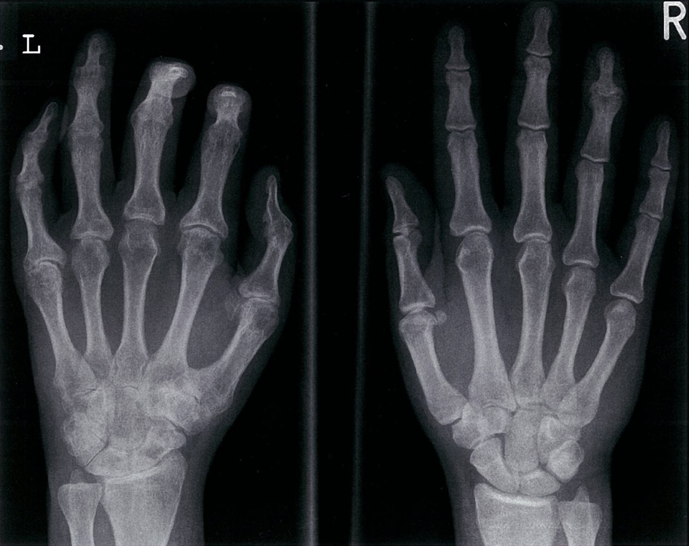

Psoriatic arthritis

Psoriatic arthritis

Psoriatic arthritis

#### <u>Laboratory studies</u> [[10]](https://coursology-qbank.com/amboss/article/ZMcZM10)

<u>Laboratory studies</u> may be obtained to rule out other diagnoses but are not typically required to make a diagnosis of PsA.

* <u>Inflammatory markers</u>: ↑ <u>ESR</u>, ↑ <u>CRP</u>  [[10]](https://coursology-qbank.com/amboss/article/ZMcZM10)

* <u>BMP</u>: ↑ <u>uric acid</u>

* <u>Serology</u>

* <u>HLA-B27</u>: present in ∼ 25% of patients [[10]](https://coursology-qbank.com/amboss/article/ZMcZM10)

* <u>ACPA</u> and <u>rheumatoid factor</u>: negative in ∼ 95% of patients [[10]](https://coursology-qbank.com/amboss/article/ZMcZM10)

> [!TIP]
> <u>Rheumatoid factor</u> is typically negative in patients with PsA, which can help rule out <u>differential diagnoses of inflammatory arthritis</u>. [[10]](https://coursology-qbank.com/amboss/article/ZMcZM10)

#### Classification criteria

These classification criteria are not diagnostic but can provide guidance in clinical practice.  [[10]](https://coursology-qbank.com/amboss/article/ZMcZM10)

|  Classification criteria for <u>psoriatic arthritis</u> (CASPAR) [[10]](https://coursology-qbank.com/amboss/article/ZMcZM10)[[12]](https://coursology-qbank.com/amboss/article/XSX9yx)  |  |  |
| --- | --- | --- |
| Criteria |  | Score |
| Clinical features |  * Current psoriasis   | 2 |
|  * Personal or <u>family history</u> of psoriasis   | 1 |  |
|  * Psoriatic <u>nail</u> <u>dystrophy</u>   | 1 |  |
|  * <u>Dactylitis</u>   | 1 |  |
| Diagnostic studies |  * Negative <u>rheumatoid factor</u>   | 1 |
|  * Radiologic signs of PsA   | 1 |  |
|  Interpretation A total score of ≥ 3 points indicates PsA. |  |  |

### Management of psoriatic arthritis [[11]](https://coursology-qbank.com/amboss/article/mncVF10)[[13]](https://coursology-qbank.com/amboss/article/aMcQM10)

#### General principles

* Treatment depends on disease severity and the presence of certain features and/or comorbidities.

* A treat-to-target approach with a target of remission or low disease activity is recommended. [[13]](https://coursology-qbank.com/amboss/article/aMcQM10)

* Consult a rheumatologist before starting pharmacotherapy.

#### Pharmacological treatment  [[11]](https://coursology-qbank.com/amboss/article/mncVF10)[[13]](https://coursology-qbank.com/amboss/article/aMcQM10)

* <u>Disease-modifying antirheumatic drugs</u> (<u>DMARDs</u>): mainstay of treatment for most patients with PsA.

* <u>Conventional DMARDs</u>, e.g., <u>methotrexate</u>, <u>sulfasalazine</u>, <u>leflunomide</u>

* Targeted synthetic <u>DMARDs</u>, e.g., apremilast, <u>tofacitinib</u>

* <u>Biologic DMARDs</u>, e.g.:

* <u>TNF-α inhibitors</u> (first line), e.g., <u>etanercept</u>, <u>adalimumab</u>, <u>infliximab</u>

* <u>IL-17 inhibitors</u>, e.g., <u>secukinumab</u>, <u>ixekizumab</u>

* <u>IL-12</u>/23 inhibitors, e.g., <u>ustekinumab</u>

* <u>Abatacept</u>

* <u>NSAIDs</u>, e.g., <u>naproxen</u>, <u>indomethacin</u>:

* May be trialed as initial treatment in patients with very mild disease (limited evidence of <u>efficacy</u>)

* Preferred over <u>DMARDs</u> in certain patients, e.g., those with axial disease or predominant <u>enthesitis</u>  [[11]](https://coursology-qbank.com/amboss/article/mncVF10)

* Can also be prescribed for symptomatic relief

* Intraarticular <u>glucocorticoids</u>: used for symptomatic relief

> [!TIP]
> <u>Systemic glucocorticoids</u> are not commonly used in PsA because of concerns that tapering too rapidly may induce a flare of cutaneous disease. [[11]](https://coursology-qbank.com/amboss/article/mncVF10)

#### Supportive management [[13]](https://coursology-qbank.com/amboss/article/aMcQM10)

* Encourage lifestyle modifications.

* <u>Smoking cessation</u>

* Low-impact physical activity

* Maintaining a <u>healthy weight</u>

* Recommend <u>physical therapy</u> and <u>occupational therapy</u>.

---

## Diagnosis

Psoriasis is a <u>clinical diagnosis</u> based on patient and <u>family history</u> and thorough <u>skin examination</u>.

### Approach [[2]](https://coursology-qbank.com/amboss/article/YMcnM10)[[14]](https://coursology-qbank.com/amboss/article/AMcRr10)

* Consult a dermatologist to confirm the diagnosis.

* <u>Skin biopsy</u> is not routinely required for diagnostic confirmation.

* Perform an <u>ASCVD risk assessment</u>.  [[2]](https://coursology-qbank.com/amboss/article/YMcnM10)

* Evaluate for comorbidities including <u>psoriatic arthritis</u>, <u>IBD</u>, <u>MDD</u>, and <u>anxiety</u>.

> [!TIP]
> All patients with psoriasis should be evaluated for <u>psoriatic arthritis</u>, as early diagnosis improves outcomes and the presence of <u>psoriatic arthritis</u> influences treatment decisions. [[2]](https://coursology-qbank.com/amboss/article/YMcnM10)

### <u>Skin biopsy</u> [[15]](https://coursology-qbank.com/amboss/article/Evc8be0)

* Indications: Consider only if clinical presentation is atypical.

* Supportive findings

* <u>Acanthosis</u> and <u>parakeratosis</u>

* Thickening of the <u>stratum spinosum</u>, thinning of the <u>stratum granulosum</u>

* Munro microabscesses: accumulation of <u>neutrophils</u> in the <u>stratum corneum</u> surrounded by <u>parakeratosis</u>

---

## Differential diagnoses

| Differential diagnosis of scaling |  |  |
| --- | --- | --- |
| Disorder | Lesion | Distribution |
| Psoriasis |  * Clearly demarcated, <u>erythematous</u> <u>plaques</u> with silvery <u>scaling</u>, <u>pruritus</u>   |   * Scalp  * Extensor surfaces of <u>joints</u> (knees, <u>elbows</u>)  * Back    |
| <u>Atopic dermatitis</u> |  * Poorly demarcated, <u>eczema</u>, white scales, severe <u>xerosis</u>, and <u>pruritus</u>   |   * Extensor surfaces of extremities (e.g., shins)  * Flexural creases (antecubital, popliteal)    |
| <u>Seborrheic dermatitis</u> |  * Clearly demarcated, <u>erythematous</u> <u>plaques</u>, greasy-looking yellow scales   |   * “<u>Cradle cap</u>” in <u>infants</u>  * Facial involvement (hairline, periocular, <u>nasolabial folds</u>)  * Trunk    |
|  Pityriasis rubra pilaris  |  * Disseminated, <u>plaques</u> with orange-pink scales, <u>hyperkeratosis</u>, <u>erythroderma</u>   |   * Typically palms and soles  * Islands of unaffected <u>skin</u> (sparing)  * Follicular keratosis    |
|  Erythroderma [[16]](https://coursology-qbank.com/amboss/article/oCa0G5) |  * <u>Erythema</u>, <u>scaling</u> 2–6 days following onset, lesions of underlying disease, <u>pruritus</u>   |   * Generalized <u>erythema</u>  * <u>Scaling</u> initially in flexural creases    |

Psoriasis

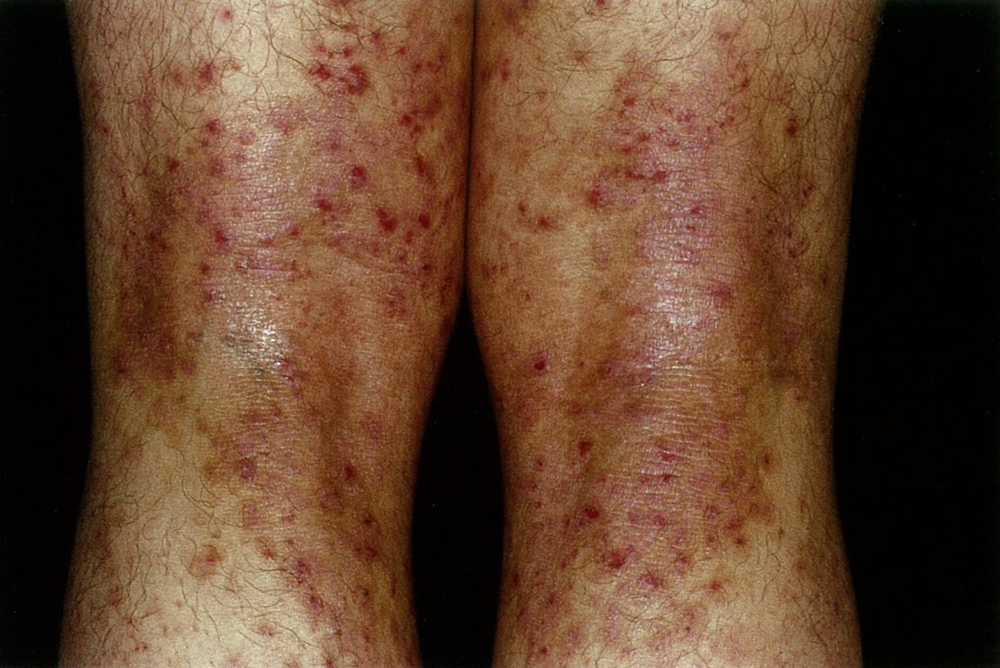

Atopic dermatitis

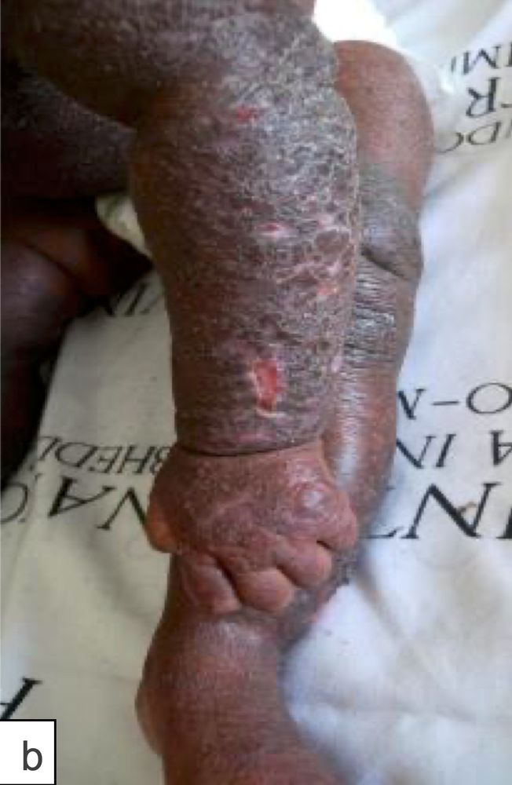

Atopic dermatitis

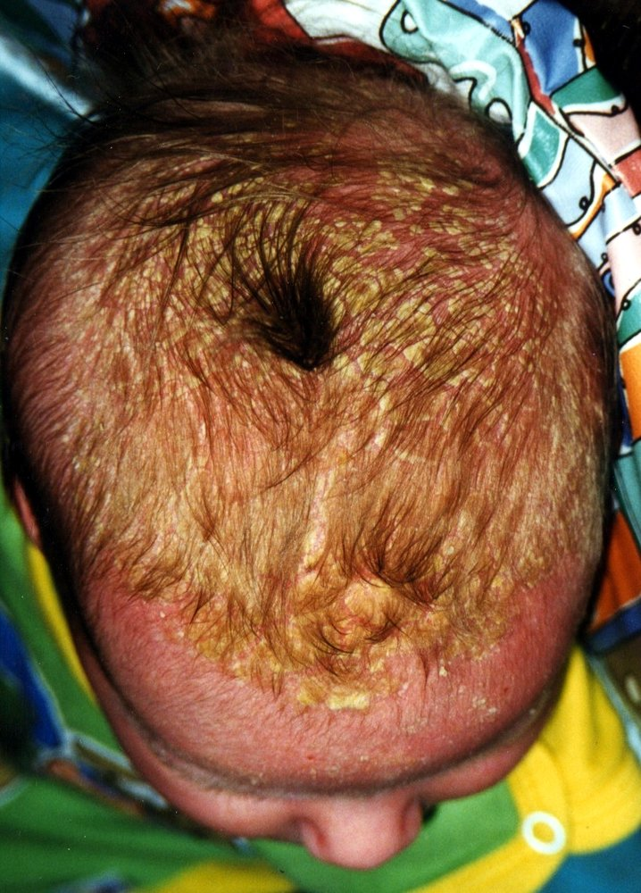

Infantile seborrheic dermatitis (cradle cap)

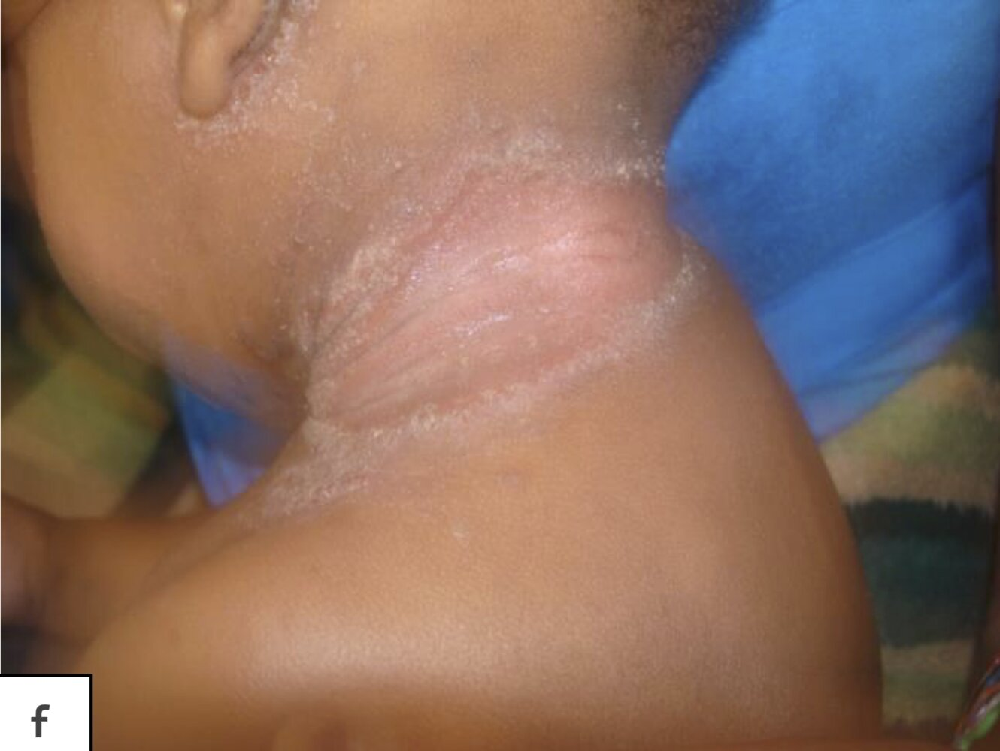

Seborrheic dermatitis

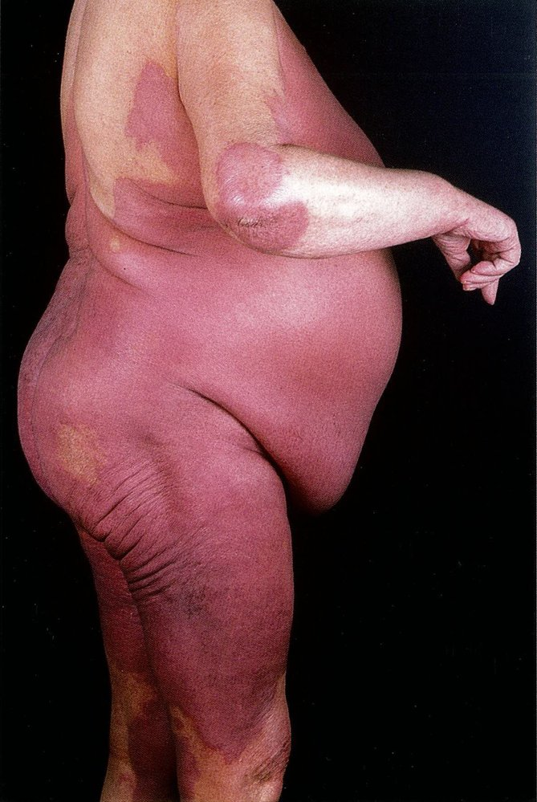

Erythroderma

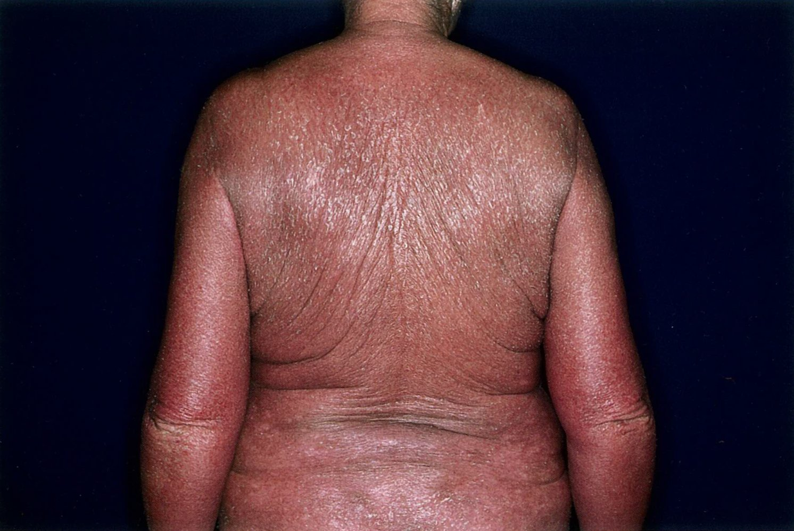

Erythroderma

The differential diagnoses listed here are not exhaustive.

---

## Treatment

The following recommendations apply to the treatment of <u>plaque psoriasis</u> ; consult a specialist before initiating treatment.

### Approach to patients with psoriasis[[2]](https://coursology-qbank.com/amboss/article/YMcnM10)[[14]](https://coursology-qbank.com/amboss/article/AMcRr10)[[17]](https://coursology-qbank.com/amboss/article/nuc77V0)

Treatment depends on disease severity, comorbidities, and patient preference.

* All patients

* Assess disease severity: e.g., based on <u>estimated body surface area</u> (BSA) affected.

* Provide <u>supportive care</u>.

* Mild psoriasis (below 3–5% BSA involvement)

* Topical pharmacotherapy (e.g., <u>corticosteroids</u>, <u>calcipotriene</u>, <u>retinoids</u>) and/or <u>targeted phototherapy</u>

* Systemic agents if treatment response is insufficient

* Moderate to severe psoriasis (above 3–5% BSA involvement)

* Systemic pharmacotherapy

* And/or <u>phototherapy</u>

* Narrowband <u>UVB therapy</u>

* <u>PUVA</u> therapy

* Consider adjunctive topical pharmacotherapy.

> [!TIP]
> All patients with <u>plaque psoriasis</u> and concomitant <u>psoriatic arthritis</u> require systemic treatment. [[2]](https://coursology-qbank.com/amboss/article/YMcnM10)

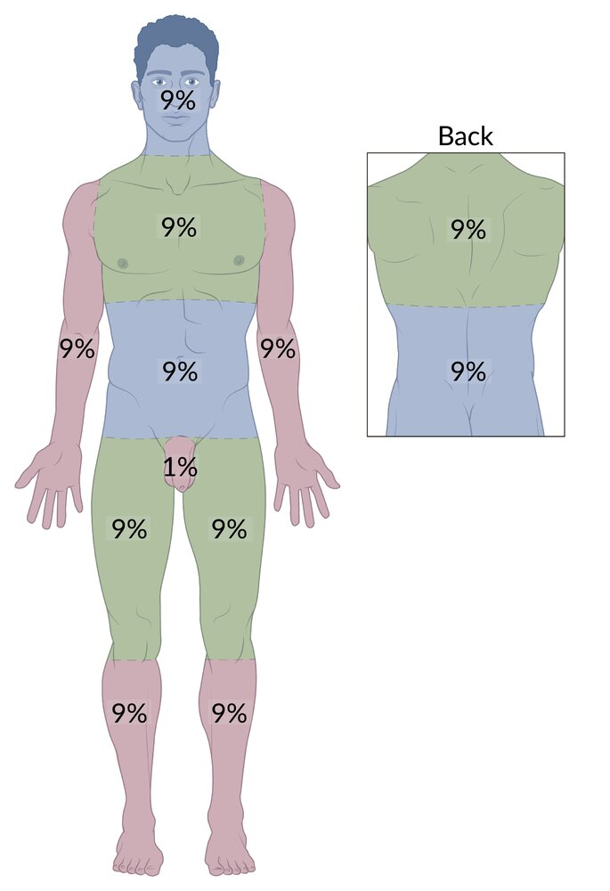

Rule of nines

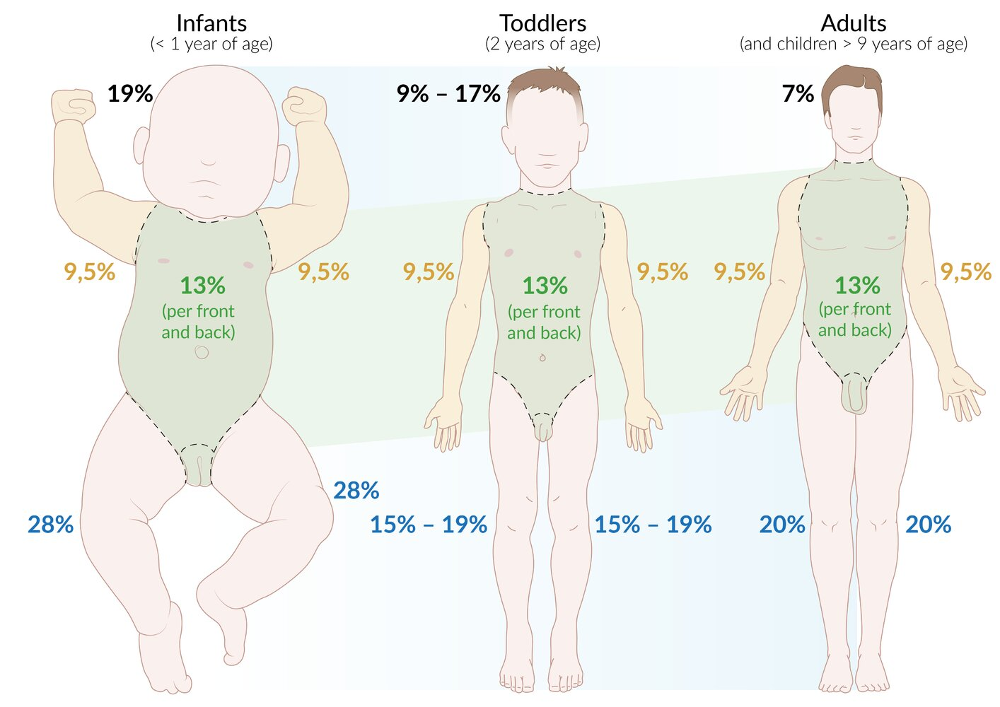

Development of regions of the body in relation to total body surface area

### Topical pharmacotherapy  [[2]](https://coursology-qbank.com/amboss/article/YMcnM10)[[17]](https://coursology-qbank.com/amboss/article/nuc77V0)

Topical pharmacotherapy is the mainstay of mild <u>psoriasis treatment</u>.

* <u>Topical corticosteroids</u> (first-line:  )

* Face, neck, or <u>skin</u> folds (i.e., areas with sensitive/thin <u>skin</u>): low-<u>potency</u> (e.g., <u>hydrocortisone</u> 1%)

* Scalp, trunk, and extremities

* Medium-<u>potency</u> (e.g., <u>triamcinolone</u> 0.1%)

* High-<u>potency</u> (e.g., <u>fluocinonide</u> 0.05%)

* <u>Topical calcineurin inhibitors</u> (<u>off-label use</u> ): e.g., <u>tacrolimus</u> 0.03 % or 0.1%, or <u>pimecrolimus</u> 1%

* Alternative to <u>steroids</u> for areas with sensitive/thin <u>skin</u>

* May be used for maintenance after > 4 weeks of <u>steroid</u> use

* Additional therapy: the following agents may be used in combination with <u>topical corticosteroids</u> 

* <u>Vitamin D</u> analogues: e.g., calcipotriene/<u>calcipotriol</u>

* <u>Keratolytics</u>: <u>retinoids</u> (e.g., <u>tazarotene</u>), or <u>salicylic acid</u>

* <u>Tar preparations</u>, e.g., 1% <u>coal tar</u> lotion

* <u>Anthralin</u>

> [!TIP]
> Commonly used combinations include <u>topical corticosteroids</u> plus either <u>vitamin D</u> analogues or <u>keratolytic agents</u>. Combination therapy increases <u>efficacy</u> and may cause fewer adverse effects than monotherapy.

### Systemic pharmacotherapy [[18]](https://coursology-qbank.com/amboss/article/VO1GrS0)[[19]](https://coursology-qbank.com/amboss/article/eO1xrS0)

* Principles of systemic therapy

* Management should be specialist guided

* Before therapy initiation, obtain baseline <u>laboratory studies</u> (e.g., <u>BMP</u>, <u>CBC</u>, <u>liver chemistries</u>).

* Adjunctive topical pharmacotherapy may be added after a careful review for possible interactions.

* Common indications

* Moderate to severe psoriasis

* Mild psoriasis with insufficient response to topical agents

* Treatment options

* <u>Biologics</u> 

* <u>IL-17 inhibitors</u>, e.g., <u>brodalumab</u>, <u>secukinumab</u>

* <u>IL-23 inhibitors</u>, e.g., <u>ustekinumab</u> , <u>guselkumab</u>

* <u>TNF-α inhibitors</u>, e.g., <u>etanercept</u>, <u>adalimumab</u>, <u>infliximab</u>

* Other medications

* <u>Methotrexate</u> PLUS <u>folic acid</u> to reduce the adverse effects

* <u>Cyclosporine</u>

* Apremilast

### <u>Supportive care</u> [[17]](https://coursology-qbank.com/amboss/article/nuc77V0)

* Provide topical treatment with ointments (e.g., <u>petroleum jelly</u>) and moisturizers to prevent moisture loss.

* Counsel on reducing <u>alcohol</u> consumption and <u>smoking cessation</u>.

* Provide management for any <u>comorbid mental health conditions</u> (e.g., <u>MDD</u>, <u>anxiety</u>).

> [!TIP]
> <u>Alcohol</u> consumption and tobacco use are associated with increased disease severity and <u>ASCVD risk</u>. [[14]](https://coursology-qbank.com/amboss/article/AMcRr10)

---

## Prevention

* Avoidance of <u>nicotine</u> and <u>alcohol</u>

* <u>Regular physical activity</u>

---