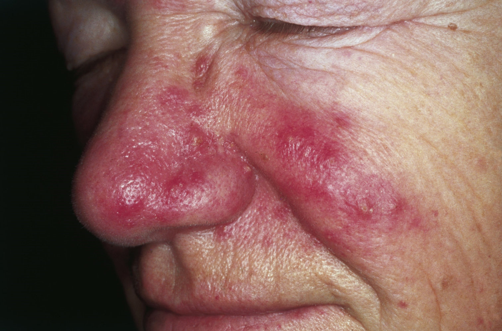
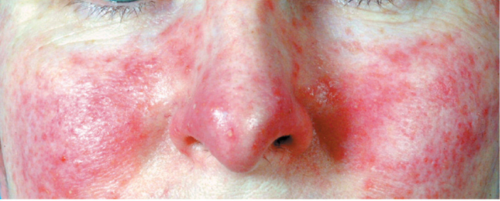
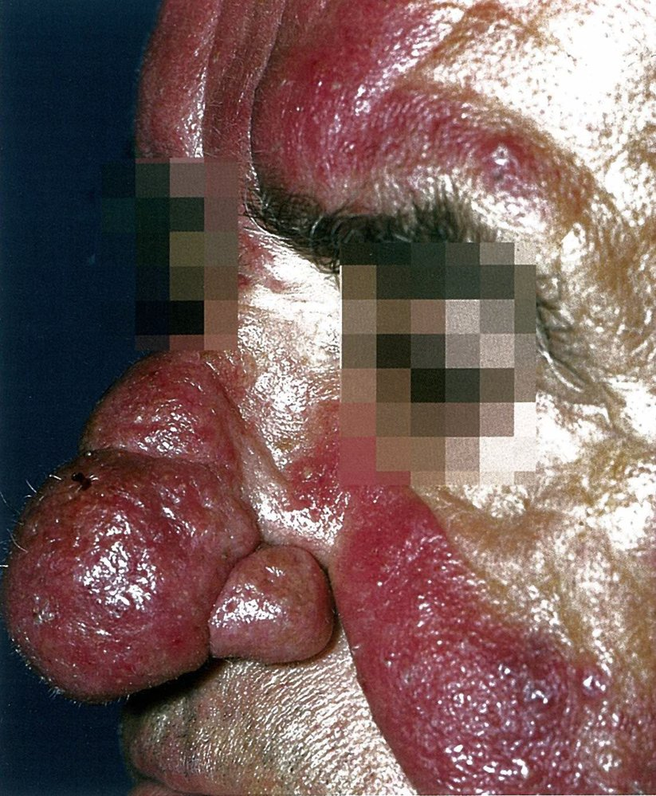
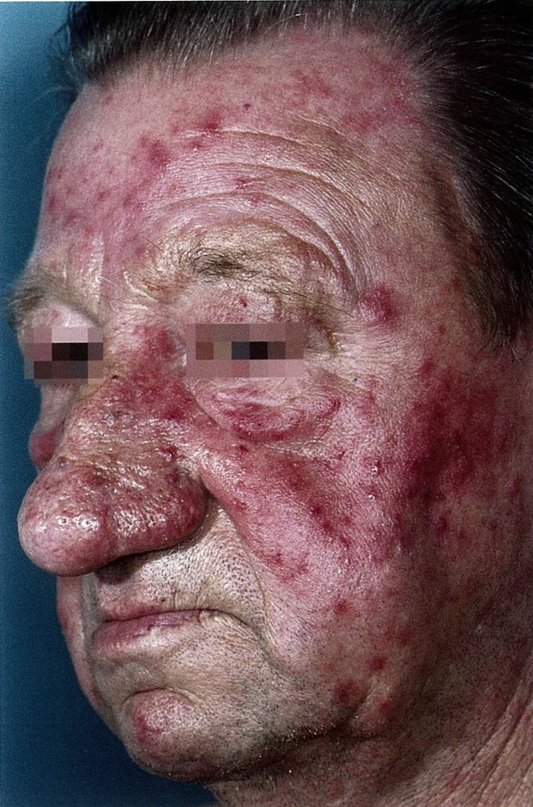
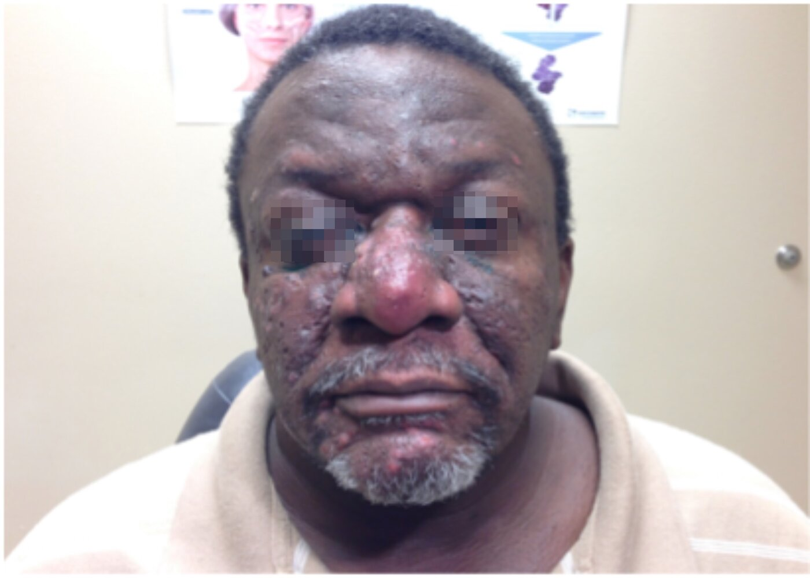

# Rosacea

*Categories: Clinical knowledge > Dermatology > Idiopathic disorders > Rosacea*

[Original Article Link](https://coursology-qbank.com/amboss/article/Lk0woT)

---

## Summary

Rosacea is a chronic inflammatory <u>skin</u> disease that typically affects the face. The cause is unclear, but various triggers (e.g., heat, <u>alcohol</u>) can exacerbate symptoms. Rosacea most commonly affects women 30–60 years of age. Typical clinical features include central facial <u>erythema</u>, <u>telangiectasias</u>, <u>papules</u>, <u>pustules</u>, and <u>facial flushing</u>. Untreated <u>chronic inflammation</u> may result in <u>phymatous changes</u>. <u>Ocular rosacea</u> can occur with or without cutaneous features. Management includes the avoidance of triggers, topical therapy (e.g., <u>ivermectin</u>, <u>metronidazole</u>, <u>azelaic acid</u>, <u>brimonidine</u>), and, for severe or refractory disease, a combination of topical therapy with systemic pharmacological treatment and/or procedures.

---

## Epidemiology

* Sex: : <u>♀</u> > <u>♂</u> [[1]](https://coursology-qbank.com/amboss/article/v-bA_w)

* Age range: : 30–60 years [[1]](https://coursology-qbank.com/amboss/article/v-bA_w)[[2]](https://coursology-qbank.com/amboss/article/D-b1zw)

Epidemiological data refers to the US, unless otherwise specified.

---

## Etiology

* The cause of rosacea is not fully understood. [[3]](https://coursology-qbank.com/amboss/article/QSduz60)

* Involves <u>chronic inflammation</u>

* Proposed factors include dysregulated inflammatory, immune, and neurovascular responses [[3]](https://coursology-qbank.com/amboss/article/QSduz60)

### Rosacea triggers [[3]](https://coursology-qbank.com/amboss/article/QSduz60)[[4]](https://coursology-qbank.com/amboss/article/iSdJz60)

* Environmental factors: sun exposure, cold or hot weather, wind

* Dietary factors: spicy food, hot drinks, <u>alcohol</u> use, <u>nicotine</u> use

* Other: <u>stress</u>, intense exercise, hot baths, and, possibly, the <u>Demodex</u> <u>mite</u>

> [!TIP]
> Increased body temperature commonly triggers rosacea flares. [[3]](https://coursology-qbank.com/amboss/article/QSduz60)

---

## Clinical features

* Cutaneous features are distributed across the chin, forehead, cheeks, and nose, sparing the <u>skin</u> folds. [[3]](https://coursology-qbank.com/amboss/article/QSduz60)

* Fixed <u>erythema</u> on the central region of the face (may periodically worsen)

* Phymatous changes  [[5]](https://coursology-qbank.com/amboss/article/OSdI-60)

* Rhinophyma: enlarged, bulbous nose (usually in men)

* Thickening of <u>skin</u> and <u>sebaceous glands</u>

* Widespread <u>nodules</u> that may be inflammatory

* <u>Papules</u> and <u>pustules</u>

* <u>Telangiectasias</u>

* <u>Facial flushing</u>

* Ocular manifestations: See “<u>Ocular rosacea</u>.”

* Associated symptoms

* Burning or stinging sensation

* Swelling

* Dryness

> [!TIP]
> In contrast to <u>acne</u>, rosacea does not manifest with <u>comedones</u>. [[3]](https://coursology-qbank.com/amboss/article/QSduz60)

> [!TIP]
> <u>Erythema</u> and <u>facial flushing</u> can be difficult to visualize in individuals with dark <u>skin</u>. [[6]](https://coursology-qbank.com/amboss/article/O3dIip0)

Rosacea

Rosacea

Rosacea with rhinophyma

Rosacea

Rosacea

---

## Diagnosis

### Diagnostic criteria for rosacea [[7]](https://coursology-qbank.com/amboss/article/S3dy3p0)

Make a <u>clinical diagnosis</u> if either of the <u>diagnostic criteria for rosacea</u> are met.

* ≥ 1 diagnostic <u>phenotypes</u>:

* Fixed <u>erythema</u> on the central region of the face

* <u>Phymatous changes</u>

* Or ≥ 2 major <u>phenotypes</u>:

* <u>Papules</u> and <u>pustules</u>

* <u>Telangiectasias</u>

* Flushing

* Any <u>features highly suggestive of ocular rosacea</u>

Rosacea

Rosacea

### Diagnostic studies [[4]](https://coursology-qbank.com/amboss/article/iSdJz60)[[6]](https://coursology-qbank.com/amboss/article/O3dIip0)[[11]](https://coursology-qbank.com/amboss/article/33dSRp0)

For diagnostic uncertainty, consider

* Digital photography, often taken with a blue background, to identify <u>erythema</u> or <u>facial flushing</u>

* <u>Dermoscopy</u> to assess for <u>telangiectasias</u>

* <u>Biopsy</u> to exclude alternative diagnoses

> [!TIP]
> Diagnostics (e.g., blanching, photography, <u>dermoscopy</u>) may help visualize <u>erythema</u>, <u>facial flushing</u>, and <u>telangiectasias</u>, especially in individuals with dark <u>skin</u>. [[6]](https://coursology-qbank.com/amboss/article/O3dIip0)

---

## Treatment

### Approach [[3]](https://coursology-qbank.com/amboss/article/QSduz60)[[8]](https://coursology-qbank.com/amboss/article/h3dcRp0)[[14]](https://coursology-qbank.com/amboss/article/HjdKbJ0)

* Educate on lifestyle modifications and screen for psychosocial effects.

* Initiate therapy based on severity assessment.  [[15]](https://coursology-qbank.com/amboss/article/Nrd-hr0)[[16]](https://coursology-qbank.com/amboss/article/mrdV3r0)[[17]](https://coursology-qbank.com/amboss/article/5rdi3r0)

* Mild to moderate disease: topical pharmacotherapy

* Severe disease or refractory to topical treatments

* Consider dermatology referral.

* Combine topical therapies with systemic pharmacological treatment.

* For <u>ocular rosacea</u>: Urgently refer to ophthalmology.

* Reassess periodically.

* Persistent or worsening disease: Refer to dermatology.

* Following remission  : Start <u>maintenance therapy</u>.  [[3]](https://coursology-qbank.com/amboss/article/QSduz60)[[3]](https://coursology-qbank.com/amboss/article/QSduz60)[[5]](https://coursology-qbank.com/amboss/article/OSdI-60)

* Monotherapy: Wean to the lowest effective dose; long-term use may be needed.

* Combination therapy: Transition to long-term monotherapy (typically topical). [[3]](https://coursology-qbank.com/amboss/article/QSduz60)[[4]](https://coursology-qbank.com/amboss/article/iSdJz60)[[8]](https://coursology-qbank.com/amboss/article/h3dcRp0)

> [!TIP]
> Depending on disease severity, a combination of topical and oral pharmacotherapies may be required to achieve remission. [[4]](https://coursology-qbank.com/amboss/article/iSdJz60)[[8]](https://coursology-qbank.com/amboss/article/h3dcRp0)

### Lifestyle modifications [[3]](https://coursology-qbank.com/amboss/article/QSduz60)[[8]](https://coursology-qbank.com/amboss/article/h3dcRp0)

* Avoid <u>rosacea triggers</u>.

* Utilize <u>photoprotective measures</u> (<u>mineral-based sunscreen</u> may cause less irritation).

* Recommend a hypoallergenic, fragrance-free skincare routine.

* Cleanse twice daily.

* Moisturize daily.

* To minimize irritation, dry the face before applying topical therapies.

### Topical therapies [[3]](https://coursology-qbank.com/amboss/article/QSduz60)[[8]](https://coursology-qbank.com/amboss/article/h3dcRp0)[[14]](https://coursology-qbank.com/amboss/article/HjdKbJ0)

* Persistent <u>erythema</u> and/or <u>facial flushing</u>: vasoconstrictors

* Brimonidine 0.33% DOSAGE [[3]](https://coursology-qbank.com/amboss/article/QSduz60)

* <u>Oxymetazoline</u> 1% DOSAGE [[3]](https://coursology-qbank.com/amboss/article/QSduz60)

* <u>Papules</u> and <u>pustules</u>: antiinflammatory medications

* <u>Ivermectin</u> 1% cream DOSAGE [[3]](https://coursology-qbank.com/amboss/article/QSduz60)[[8]](https://coursology-qbank.com/amboss/article/h3dcRp0)

* <u>Metronidazole</u> 0.75% or 1% DOSAGE [[3]](https://coursology-qbank.com/amboss/article/QSduz60)[[8]](https://coursology-qbank.com/amboss/article/h3dcRp0)

* Azelaic acid 15% DOSAGE [[3]](https://coursology-qbank.com/amboss/article/QSduz60)[[8]](https://coursology-qbank.com/amboss/article/h3dcRp0)

* <u>Sulfacetamide</u> <u>sodium</u>/sulfur 10% DOSAGE [[3]](https://coursology-qbank.com/amboss/article/QSduz60)[[8]](https://coursology-qbank.com/amboss/article/h3dcRp0)

* Other <u>FDA</u>-approved therapies (no guideline recommendations) 

* <u>Minocycline</u> 1.5% foam DOSAGE [[3]](https://coursology-qbank.com/amboss/article/QSduz60)

* Encapsulated <u>benzoyl peroxide</u> 5% cream DOSAGE

* <u>Telangiectasias</u>: Consider <u>topical retinoids</u> (<u>off-label</u>).

> [!TIP]
> Counsel patients with <u>skin of color</u> about the risk of changes to <u>skin</u> pigmentation with <u>azelaic acid</u>. [[3]](https://coursology-qbank.com/amboss/article/QSduz60)

### Systemic pharmacological treatment [[3]](https://coursology-qbank.com/amboss/article/QSduz60)[[8]](https://coursology-qbank.com/amboss/article/h3dcRp0)[[14]](https://coursology-qbank.com/amboss/article/HjdKbJ0)

* <u>Papules</u>, <u>pustules</u>, and/or persistent <u>erythema</u>: antiinflammatory medications

* First line: <u>doxycycline</u> DOSAGE  [[3]](https://coursology-qbank.com/amboss/article/QSduz60)[[8]](https://coursology-qbank.com/amboss/article/h3dcRp0)

* Alternative: <u>isotretinoin</u> (<u>off-label</u>) DOSAGE   [[3]](https://coursology-qbank.com/amboss/article/QSduz60)[[5]](https://coursology-qbank.com/amboss/article/OSdI-60)

* <u>Facial flushing</u>: <u>nonselective beta-blockers</u> (for peripheral <u>vasoconstriction</u>)

* <u>Carvedilol</u> (<u>off-label</u>) DOSAGE [[3]](https://coursology-qbank.com/amboss/article/QSduz60)[[8]](https://coursology-qbank.com/amboss/article/h3dcRp0)

* <u>Propranolol</u> (<u>off-label</u>) DOSAGE [[3]](https://coursology-qbank.com/amboss/article/QSduz60)[[8]](https://coursology-qbank.com/amboss/article/h3dcRp0)

### Procedures [[5]](https://coursology-qbank.com/amboss/article/OSdI-60)[[8]](https://coursology-qbank.com/amboss/article/h3dcRp0)[[14]](https://coursology-qbank.com/amboss/article/HjdKbJ0)

* Laser or light therapy: for persistent <u>erythema</u> and <u>telangiectasias</u>  [[5]](https://coursology-qbank.com/amboss/article/OSdI-60)

* Other procedures: for noninflammatory <u>phymatous changes</u>

* <u>Electrosurgery</u>

* <u>Radiofrequency ablation</u>

* Surgical excision

---