# Herpes simplex virus infections

*Categories: Clinical knowledge > Dermatology > Infectious diseases > Venerology > Herpes simplex virus infections*

[Original Article Link](https://coursology-qbank.com/amboss/article/mL0Vyg)

---

## Summary

<u>Herpes simplex virus</u> (<u>HSV</u>) infections are caused by <u>herpes simplex virus</u> type 1 (<u>HSV-1</u>) and <u>herpes simplex virus</u> type 2 (<u>HSV-2</u>). Worldwide <u>seroprevalence</u> is high, with <u>antibodies</u> detectable in over 90% of the population. After primary infection, <u>HSV</u> remains dormant in <u>ganglion</u> <u>neurons</u>. Reactivation can be triggered by various factors (e.g., <u>stress</u>, trauma, <u>immune deficiency</u>). <u>Mucocutaneous HSV infections</u> affect the <u>mucosa</u> (e.g., <u>lips</u>, mouth, <u>esophagus</u>, genital area) and/or the <u>skin</u> and manifest as painful, grouped <u>vesicles</u> on an <u>erythematous</u> base that progress to <u>ulcers</u> with or without <u>prodromal</u> symptoms (e.g., <u>pain</u>, tingling, burning sensation). <u>Nonmucocutaneous HSV infections</u> are less common and may affect the <u>CNS</u> (e.g., <u>HSV encephalitis</u>, <u>HSV</u> <u>meningitis</u>) and/or the eyes (e.g., <u>HSV keratitis</u>, <u>HSV conjunctivitis</u>). Diagnosis is based on clinical presentation and/or confirmatory <u>laboratory studies</u>. Treatment comprises antivirals (e.g., <u>acyclovir</u> or <u>valacyclovir</u>) and <u>supportive care</u>.

---

## Epidemiology

* More than 90% of the world's population over the age of 40 years carries <u>HSV</u>. [[1]](https://coursology-qbank.com/amboss/article/8BXOc00)

* Recurrent infections are more common in <u>immunocompromised individuals</u>. [[2]](https://coursology-qbank.com/amboss/article/Bedza60)

Epidemiological data refers to the US, unless otherwise specified.

---

## Etiology

* Types

* Herpes simplex virus type 1 (<u>HSV-1</u>), <u>human herpes virus</u> type 1 (<u>HHV-1</u>)

* Herpes simplex virus type 2 (<u>HSV-2</u>), <u>human herpes virus</u> type 2 (<u>HHV-2</u>)

* Transmission

* Direct contact with <u>mucosal</u> tissue or secretions of another infected person

* Infection with <u>HSV-1</u> is usually acquired in childhood via saliva.

* <u>HSV-2</u> is mostly spread through genital contact and should, therefore, raise suspicion for <u>sexual abuse</u> if found in children.

* <u>Perinatal transmission</u> (e.g., during <u>childbirth</u> if the birthing parent is symptomatic) is more common for <u>HSV-2</u>.

* Type of infection

* Primary infection

* Mostly asymptomatic (up to 80% of cases, but <u>virus</u> is still shed)

* If symptomatic, the infection is often sudden and severe with systemic symptoms (e.g., <u>fever</u>, <u>malaise</u>, <u>myalgias</u>, and <u>headaches</u>)

* Reactivation of infection

* Frequency and severity vary individually; symptoms are usually less severe than in primary infection.

* Often at the same site as primary infection

---

## Pathophysiology

* <u>Inoculation</u>: The <u>virus</u> enters the body through <u>mucosal</u> surfaces or small <u>dermal</u> lesions.

* Neurovirulence: The <u>virus</u> invades, spreads, and replicates in nerve cells.

* Latency: After primary infection, the <u>virus</u> remains dormant in the <u>ganglion</u> <u>neurons</u>. 

* <u>Trigeminal</u> <u>ganglion</u>: <u>HSV-1</u>

* Sacral <u>ganglion</u>: <u>HSV-2</u>

* Reactivation: triggered by various factors (e.g., <u>immunodeficiency</u>, <u>stress</u>, trauma) → clinical manifestations

* Dissemination

* Disseminated <u>HSV</u> infection spreads to unusual sites (e.g., <u>lungs</u>, <u>gastrointestinal tract</u>, eyes)

* May occur in pregnant patients or patients with severe <u>immunodeficiency</u> (e.g., <u>malnutrition</u>, recipients of organ transplants, patients with <u>AIDS</u>)

---

## Diagnosis

### Approach [[3]](https://coursology-qbank.com/amboss/article/2NcT010)[[4]](https://coursology-qbank.com/amboss/article/AN1Rdh0)[[5]](https://coursology-qbank.com/amboss/article/uBXpc00)

* Make a clinical <u>diagnosis of HSV</u> infection or reactivation.

* <u>Confirmatory testing</u> with <u>PCR</u> and/or viral culture is indicated for:

* First episode of genital <u>HSV</u> (or a recurrent episode if diagnosis was never confirmed) [[3]](https://coursology-qbank.com/amboss/article/2NcT010)

* Severe infections (e.g., <u>eczema herpeticum</u>, <u>CNS</u> involvement, ocular involvement, disseminated infection) [[2]](https://coursology-qbank.com/amboss/article/Bedza60)

* High-risk patients (e.g., <u>neonates</u> and young <u>infants</u>, pregnant individuals, and <u>immunocompromised individuals</u>) [[2]](https://coursology-qbank.com/amboss/article/Bedza60)[[6]](https://coursology-qbank.com/amboss/article/HHdK7r0)

* Diagnostic uncertainty (e.g., atypical lesions, frequent recurrence)  [[3]](https://coursology-qbank.com/amboss/article/2NcT010)

* <u>Serology</u> may be indicated in certain cases.

> [!TIP]
> <u>Mucocutaneous HSV infections</u> are primarily a <u>clinical diagnosis</u> based on the classic appearance of <u>vesicular</u> and ulcerative lesions. [[4]](https://coursology-qbank.com/amboss/article/AN1Rdh0)

### <u>Confirmatory testing</u> [[3]](https://coursology-qbank.com/amboss/article/2NcT010)[[7]](https://coursology-qbank.com/amboss/article/ObWIFP0)

Take samples from a genital <u>ulcer</u> or mucocutaneous lesion. See “<u>Infant HSV testing</u>” for recommended studies in <u>neonates</u> and <u>infants</u>.

* <u>PCR</u>

* Most sensitive <u>laboratory technique</u> for detecting <u>HSV</u> <u>DNA</u>

* First-line test for confirmation of the following <u>HSV</u> infections:

* Mucocutaneous

* <u>Visceral</u> (e.g., <u>esophagitis</u>, <u>pneumonitis</u>)

* <u>CNS</u> (e.g., <u>meningitis</u>, <u>encephalitis</u>)

* Performed on a <u>CSF</u> sample in patients with suspected <u>herpes encephalitis</u> or <u>meningitis</u>

* Viral culture

* Indicated if antiviral <u>sensitivity</u> testing is needed

* Lower <u>sensitivity</u> than <u>PCR</u>

* Mucocutaneous samples should be taken from a fresh <u>vesicle</u>.

### <u>Serologic testing</u> [[3]](https://coursology-qbank.com/amboss/article/2NcT010)

* Request type-specific HSV testing to differentiate between <u>HSV-1</u> and <u>HSV-2</u>.

* <u>HSV-2</u> <u>type-specific HSV testing</u> may be indicated in the following cases: [[3]](https://coursology-qbank.com/amboss/article/2NcT010)

* Suspected genital infection despite negative <u>confirmatory testing</u>, e.g., patients with recurrent and/or atypical anogenital symptoms

* Sexual partner with known <u>HSV</u> infection

* <u>HSV</u> <u>serology</u> cannot determine the location of infection.

* Screening of asymptomatic individuals, including pregnant patients, is not recommended. [[8]](https://coursology-qbank.com/amboss/article/RcWlX40)

### Microscopy [[7]](https://coursology-qbank.com/amboss/article/ObWIFP0)

Microscopy preparations of <u>ulcer</u> base scrapings are no longer recommended because of poor <u>sensitivity</u> and <u>specificity</u>. [[3]](https://coursology-qbank.com/amboss/article/2NcT010)[[4]](https://coursology-qbank.com/amboss/article/AN1Rdh0)

* <u>Tzanck test</u>

* Findings

* <u>Multinucleated giant cells</u>

* Eosinophilic intranuclear Cowdry A inclusions

* Cannot be used to differentiate between <u>HSV-1</u> and <u>HSV-2</u>; also commonly positive in <u>VZV</u> infection

* <u>Direct fluorescent antibody test</u>

* Detects <u>HSV</u> <u>antigens</u>

* Can distinguish between <u>HSV-1</u> and <u>HSV-2</u>

> [!NOTE]
> “Tzancks for the herpes!”: Herpes is detected on Tzanck smear.

> [!WARNING]
> Microscopic detection of <u>HSV</u> infection is not recommended due to poor <u>sensitivity</u> and <u>specificity</u>. [[3]](https://coursology-qbank.com/amboss/article/2NcT010)[[4]](https://coursology-qbank.com/amboss/article/AN1Rdh0)

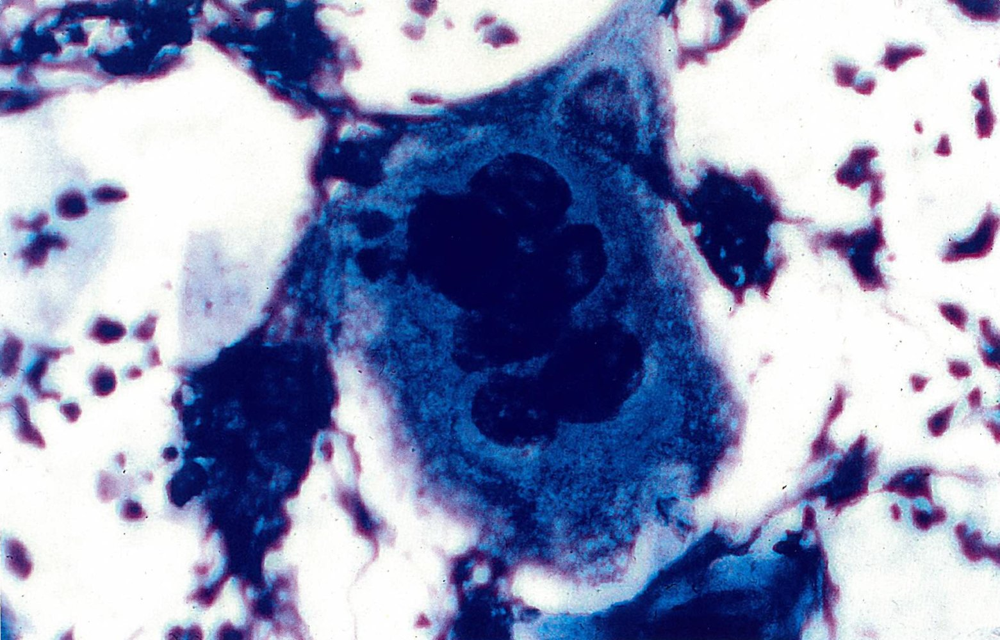

Tzanck cell

---

## Management

### Approach

* Initiate symptomatic treatment as needed.

* <u>IV fluids</u>

* <u>Barrier creams</u> to avoid lip adhesion

* <u>Oral analgesics</u> or <u>parenteral analgesics</u>

* Start <u>antiviral therapy</u> (if indicated) to reduce severity, duration, and viral shedding.

* Prevent onward transmission.

* <u>Contact precautions</u> for hospitalized patients with

* Severe primary mucocutaneous infection

* Disseminated infection

* Educate patients on prevention of <u>HSV</u> infections. [[9]](https://coursology-qbank.com/amboss/article/CZ1qd20)

### General principles of antiviral treatment [[5]](https://coursology-qbank.com/amboss/article/uBXpc00)[[10]](https://coursology-qbank.com/amboss/article/8adOmo0)[[11]](https://coursology-qbank.com/amboss/article/uadpmo0)

For dosages, see specific subtypes.

* Goals

* Decrease in duration and severity of infection (most effective if initiated within 72 hours of onset)

* Reduction of viral shedding

* Mechanism of action: inhibition of viral replication

* Agents

* <u>Acyclovir</u>

* Oral administration: first-line

* IV administration: for severe infections (e.g., severe <u>odynophagia</u> or <u>dysphagia</u>, disseminated infection)

* Topical administration: can be helpful if used early

* Inexpensive but typically requires frequent dosing

* <u>Valacyclovir</u>

* Prodrug of <u>acyclovir</u>

* Oral administration

* More expensive, but typically requires less frequent dosing

* <u>Penciclovir</u>

* Topical administration

* Effective against <u>HSV-1</u>, <u>HSV-2</u>, <u>VZV</u>, and <u>EBV</u>

* <u>Famciclovir</u>

* Prodrug of <u>penciclovir</u>

* Oral administration

* <u>Foscarnet</u>: for <u>acyclovir</u>-resistant <u>HSV-1</u>

* Prophylaxis: indicated in the case of frequent or severe relapses; particularly in patients without <u>prodromal</u> symptoms

* Long-term suppressive therapy with (<u>val</u>)<u>acyclovir</u>

* Variable results in studies

* Costly

> [!TIP]
> Early treatment is essential as <u>antiviral drugs</u> only inhibit the <u>virus</u> during its replication phase.

---

## Subtypes and variants

### Mucocutaneous HSV infections

<u>Mucocutaneous HSV infections</u> affect the <u>mucosa</u> (e.g., <u>lips</u>, mouth, <u>esophagus</u>, genital area) and/or the <u>skin</u> and manifest with painful <u>vesicles</u> on an <u>erythematous</u> base that progress to <u>ulcers</u>.

|  Overview of <u>mucocutaneous HSV infections</u> [[4]](https://coursology-qbank.com/amboss/article/AN1Rdh0)[[5]](https://coursology-qbank.com/amboss/article/uBXpc00)  |  |  |
| --- | --- | --- |
| Subtype | Clinical features | Treatment |
|  <u>Herpetic gingivostomatitis</u>   |   * Location: oral <u>mucosa</u>  * <u>Prodromal</u> symptoms (e.g., <u>fever</u>, <u>malaise</u>, <u>myalgias</u>)    |   * Oral <u>acyclovir</u>  * Symptomatic treatment    |
|  <u>Labial herpes</u>   |   * Location: lip or <u>vermilion border</u>  * <u>Prodromal</u> symptoms (e.g., <u>pain</u>, tingling, burning sensation)    |   * Oral: <u>valacyclovir</u> or <u>acyclovir</u>  * Topical: docosanol or <u>acyclovir</u> cream    |
|  <u>Genital herpes</u>  [[3]](https://coursology-qbank.com/amboss/article/2NcT010)[[12]](https://coursology-qbank.com/amboss/article/H8WKLM0)  |   * Location: anogenital region  * <u>Prodromal</u> symptoms (e.g., <u>pain</u>, tingling)  * Possible <u>urethritis</u> and/or <u>cervicitis</u> during initial infection    |  * Oral <u>acyclovir</u>, <u>famciclovir</u>, or <u>valacyclovir</u>   |
|  <u>Herpetic whitlow</u> [[13]](https://coursology-qbank.com/amboss/article/jwW_in0)  |   * Location: usually the <u>distal</u> <u>phalanx</u> of a single finger  * <u>Pain</u>, burning sensation, <u>edema</u>, tingling    |   * Symptomatic treatment  * Dry dressing  * Generally <u>self-limited</u>    |
|  <u>Eczema herpeticum</u>  [[14]](https://coursology-qbank.com/amboss/article/Od1IJf0)[[15]](https://coursology-qbank.com/amboss/article/UIdbXr0)[[16]](https://coursology-qbank.com/amboss/article/Wk1P5S0)[[17]](https://coursology-qbank.com/amboss/article/u8WpoM0)  |   * Location  * Areas of active or healing <u>eczema</u> (e.g., head, upper body, flexural surfaces)  * See “<u>Clinical features of eczema</u>” for age-specific features.  * <u>Fever</u>, <u>malaise</u>, <u>lymphadenopathy</u>    |   * IV <u>acyclovir</u>  * OR oral <u>valacyclovir</u> or <u>famciclovir</u>    |
|  <u>Herpes gladiatorum</u>  [[18]](https://coursology-qbank.com/amboss/article/IV1YDf0)  |   * Location: areas with <u>skin</u>-to-<u>skin</u> contact (e.g., the head, neck, and/or arms) [[16]](https://coursology-qbank.com/amboss/article/Wk1P5S0)  * <u>Fever</u>, <u>malaise</u>, tender regional <u>lymphadenopathy</u>    |  * Oral <u>acyclovir</u>, <u>famciclovir</u>, or <u>valacyclovir</u>   |
|  Herpes-associated <u>erythema multiforme</u> [[19]](https://coursology-qbank.com/amboss/article/OOdIsJ0)  |   * Location: can occur anywhere, including palms, soles, and <u>mucosa</u>  * Appearance: <u>target lesions</u>  * See “<u>Erythema multiforme minor</u>” and “<u>Erythema multiforme major</u>.”    |   * Acute <u>erythema multiforme</u>: Consider oral <u>acyclovir</u>, <u>famciclovir</u>, or <u>valacyclovir</u> (uncertain benefit).  * Recurrent <u>erythema multiforme</u>: <u>acyclovir</u>    |
|  <u>Herpes esophagitis</u>  |   * Location: esophageal <u>mucosa</u>  * <u>Odynophagia</u>, <u>dysphagia</u>, retrosternal <u>chest pain</u>    |   * Oral <u>acyclovir</u>  * OR IV <u>acyclovir</u> for severe <u>pain</u>    |

### Nonmucocutaneous HSV infections

* <u>Congenital HSV</u> (see “<u>TORCH infections</u>”)

* <u>Neonatal HSV</u>

* <u>Herpes simplex keratitis</u>

* <u>Herpes simplex conjunctivitis</u>

* <u>Necrotizing herpetic retinopathy</u>

* <u>Herpes simplex encephalitis</u>

* <u>Viral meningitis</u> (e.g., <u>HSV</u>)

* Benign recurrent lymphocytic meningitis: a rare recurrent <u>aseptic meningitis</u>  [[20]](https://coursology-qbank.com/amboss/article/buWHpM0)

* Clinical features

* <u>Headache</u>, <u>meningismus</u>

* Transient neurological symptoms in ∼ 50% of cases

* Usually <u>self-limited</u>: Most affected individuals have spontaneous remission and no long-term neurological sequelae.

* Management: Antiviral treatment (e.g., IV <u>acyclovir</u> or oral <u>valacyclovir</u>) may be beneficial.

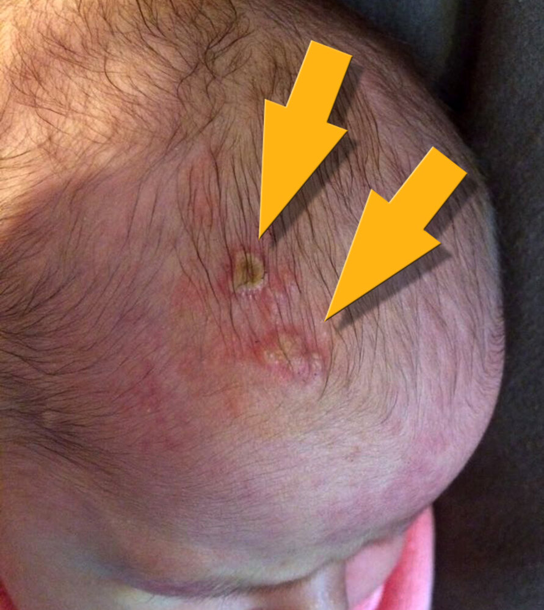

Neonatal herpes simplex

---

## Oral herpes

Primary oral <u>HSV</u> infection manifests as <u>herpetic gingivostomatitis</u> and reactivations manifest as <u>labial herpes</u>. [[21]](https://coursology-qbank.com/amboss/article/s8WtLM0)

### Herpetic gingivostomatitis [[5]](https://coursology-qbank.com/amboss/article/uBXpc00)[[21]](https://coursology-qbank.com/amboss/article/s8WtLM0)

* <u>Epidemiology</u>: : peak <u>incidence</u> in children < 5 years of age and young adults [[21]](https://coursology-qbank.com/amboss/article/s8WtLM0)

* Etiology: mostly <u>HSV-1</u>

* Clinical features

* Gingivostomatitis  

* <u>Erythema</u> and painful <u>ulcerations</u> on perioral <u>skin</u> and oral <u>mucosa</u>

* Especially on the inner cheek, <u>soft palate</u>, and <u>tongue</u>

* Submandibular and/or cervical <u>lymphadenopathy</u>

* Herpetic pharyngotonsillitis: <u>clusters</u> of <u>vesicles</u> on the <u>tonsils</u> and <u>posterior</u> <u>pharynx</u>  [[22]](https://coursology-qbank.com/amboss/article/xadE5o0)

* <u>Prodromal</u> symptoms (up to 15 days after infection): <u>fever</u>, <u>malaise</u>, <u>myalgias</u>, <u>nausea</u>, loss of appetite

* Diagnostics [[5]](https://coursology-qbank.com/amboss/article/uBXpc00)

* Typically a <u>clinical diagnosis</u>.

* Diagnostic uncertainty: See “<u>Diagnostics of HSV infections</u>.”

* Differential diagnoses: See “Differential diagnosis” in “<u>Labial herpes</u>.”

* Treatment: The following regimens are for immunocompetent patients; for <u>immunocompromised</u> patients, consult a specialist.

* All patients

* Provide symptomatic treatment (e.g., <u>oral analgesics</u>, cold foods, <u>topical anesthesia</u>).

* Assess hydration status

* Encourage oral hydration.

* Consider hospital admission for <u>IV fluids</u> for patients who cannot tolerate oral intake.

* Primary infection within 72 hours of symptom onset: Consider oral <u>acyclovir</u>; (<u>off-label</u>) DOSAGE.  [[2]](https://coursology-qbank.com/amboss/article/Bedza60)[[4]](https://coursology-qbank.com/amboss/article/AN1Rdh0)[[5]](https://coursology-qbank.com/amboss/article/uBXpc00)[[21]](https://coursology-qbank.com/amboss/article/s8WtLM0)

> [!TIP]
> <u>Herpetic gingivostomatitis</u> may be mistaken for <u>teething</u> in <u>infants</u>. [[23]](https://coursology-qbank.com/amboss/article/G8WBLM0)

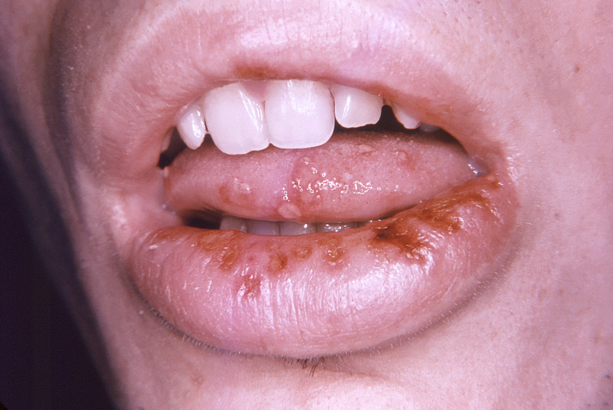

Herpetic gingivostomatitis

### Labial herpes [[5]](https://coursology-qbank.com/amboss/article/uBXpc00)[[24]](https://coursology-qbank.com/amboss/article/l8Wv5M0)[[25]](https://coursology-qbank.com/amboss/article/OvWIZn0)

* <u>Epidemiology</u>: most common recurrent <u>HSV</u> infection

* Etiology: mostly <u>HSV-1</u>

* Clinical features

* <u>Erythematous</u> <u>vesicles</u> on the lip or <u>vermillion border</u> that progress to <u>ulcerations</u>

* <u>Prodromal</u> symptoms (lasting ∼ 6 hours): <u>pain</u>, tingling, burning sensation

* Diagnostics

* Typically a <u>clinical diagnosis</u>.

* Diagnostic uncertainty: See “<u>Diagnostics of HSV infections</u>.”

* Differential diagnoses

* <u>Shingles</u> (<u>herpes zoster</u>)

* <u>Aphthous ulcers</u>

* <u>Herpangina</u>

* <u>Hand, foot, and mouth disease</u>

* <u>Candidiasis</u>

* Syphilitic <u>chancre</u>

* Treatment: The following regimens are for immunocompetent patients; for <u>immunocompromised</u> patients, consult a specialist.

* Primary infection in adults: oral <u>valacyclovir</u>;  (<u>off-label</u>) DOSAGE OR <u>acyclovir</u> (<u>off-label</u>) DOSAGE [[26]](https://coursology-qbank.com/amboss/article/FHdgHr0)

* Reactivation

* In adults and <u>adolescents</u>

* Oral: <u>valacyclovir</u> DOSAGE OR <u>acyclovir</u> (<u>off-label</u>) DOSAGE [[2]](https://coursology-qbank.com/amboss/article/Bedza60)[[5]](https://coursology-qbank.com/amboss/article/uBXpc00)

* Topical (less-effective than oral): <u>acyclovir</u> cream DOSAGE OR <u>penciclovir</u> cream DOSAGE   [[5]](https://coursology-qbank.com/amboss/article/uBXpc00)

* In children < 12 years: Consider oral <u>acyclovir</u> (<u>off-label</u>) DOSAGE. [[2]](https://coursology-qbank.com/amboss/article/Bedza60)[[5]](https://coursology-qbank.com/amboss/article/uBXpc00)

* Suppression in adults : <u>valacyclovir</u> (<u>off-label</u>) DOSAGE OR <u>acyclovir</u> (<u>off-label</u>) DOSAGE [[26]](https://coursology-qbank.com/amboss/article/FHdgHr0)

> [!TIP]
> There is limited evidence for the <u>efficacy</u> of antivirals in children with <u>labial herpes</u> infection. [[2]](https://coursology-qbank.com/amboss/article/Bedza60)

> [!TIP]
> There is no evidence to support topical therapy to prevent <u>labial herpes</u> reactivation. [[2]](https://coursology-qbank.com/amboss/article/Bedza60)[[27]](https://coursology-qbank.com/amboss/article/sHdt7r0)

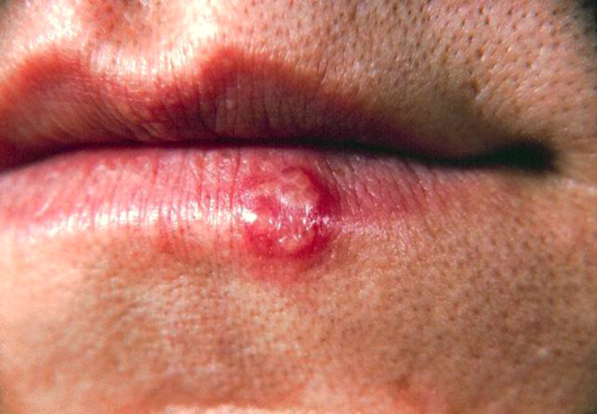

Herpes labialis

---

## Genital herpes

For pregnant individuals, see “<u>Genital herpes in pregnancy</u>.”

* Etiology: : most commonly <u>HSV-2</u> [[12]](https://coursology-qbank.com/amboss/article/H8WKLM0)

* <u>Incubation period</u>: 4–7 days [[12]](https://coursology-qbank.com/amboss/article/H8WKLM0)

* Clinical features [[7]](https://coursology-qbank.com/amboss/article/ObWIFP0)[[12]](https://coursology-qbank.com/amboss/article/H8WKLM0)[[28]](https://coursology-qbank.com/amboss/article/EBX8c00)

* Affected individuals are often asymptomatic or have mild symptoms but may still be at risk of transmission.

* <u>Skin</u> lesions: may be present in both initial and recurrent infection  

* <u>Prodromal</u> symptoms: redness, swelling, tingling, <u>pain</u>, <u>pruritus</u>

* Grouped <u>erythematous</u> <u>vesicles</u> that progress to painful <u>ulcers</u> in the anogenital area

* Primary infection

* Genital tract: <u>skin</u> lesions in the anogenital area, <u>cervicitis</u>, white, thick, and/or foul-smelling <u>vaginal discharge</u>

* <u>Urinary tract</u>: <u>dysuria</u>, <u>urethritis</u>

* Associated symptoms: <u>fever</u>, <u>headaches</u>, <u>myalgias</u>, <u>malaise</u>, tender bilateral inguinal <u>lymphadenopathy</u>

* Recurrent infection

* <u>Prodromal</u> symptoms (lasting hours to days): <u>pain</u> or tingling in the genitals, legs, buttocks, and/or hips

* <u>Skin</u> lesions are usually unilateral, less painful, and of shorter duration than in the initial infection.

* Diagnostics [[29]](https://coursology-qbank.com/amboss/article/padLlo0)

* If lesions are present:

* Make an initial <u>clinical diagnosis</u> to facilitate timely empiric treatment.

* Obtain laboratory confirmation (See “<u>Diagnostics of HSV infections</u>”).

* If lesions are absent: Obtain <u>type-specific HSV testing</u> in selected cases.

* Obtain other <u>STI testing</u>.

* Differential diagnoses

* Syphilitic <u>chancre</u>

* <u>Chancroid</u>

* Treatment for genital herpes: The following regimens are for immunocompetent patients; for <u>immunocompromised</u> patients, consult a specialist. [[3]](https://coursology-qbank.com/amboss/article/2NcT010)[[12]](https://coursology-qbank.com/amboss/article/H8WKLM0)

* Initial infection in adults and <u>adolescents</u>

* <u>Acyclovir</u> DOSAGE [[2]](https://coursology-qbank.com/amboss/article/Bedza60)[[3]](https://coursology-qbank.com/amboss/article/2NcT010)

* OR <u>valacyclovir</u> (<u>off-label</u> in children) DOSAGE   [[2]](https://coursology-qbank.com/amboss/article/Bedza60)[[3]](https://coursology-qbank.com/amboss/article/2NcT010)

* OR <u>famciclovir</u> (<u>off-label</u>) DOSAGE [[3]](https://coursology-qbank.com/amboss/article/2NcT010)

* Recurrent episode in adults and <u>adolescents</u>

* <u>Acyclovir</u> DOSAGE [[2]](https://coursology-qbank.com/amboss/article/Bedza60)[[3]](https://coursology-qbank.com/amboss/article/2NcT010)

* OR <u>valacyclovir</u> (<u>off-label</u> in children) DOSAGE [[2]](https://coursology-qbank.com/amboss/article/Bedza60)[[3]](https://coursology-qbank.com/amboss/article/2NcT010)

* OR <u>famciclovir</u> (<u>off-label</u> in children) DOSAGE  [[2]](https://coursology-qbank.com/amboss/article/Bedza60)[[3]](https://coursology-qbank.com/amboss/article/2NcT010)

* Patients with <u>HIV</u>: See “<u>Mucosal and mucocutaneous complications in HIV infection</u>.”

* Suppressive therapy in adults and <u>adolescents</u>

* Indications

* Recurrent infections

* Sexually active patients (to reduce transmission risk)

* Treatment options: Used for up to 12 months; reassess ongoing need.

* <u>Acyclovir</u> DOSAGE [[2]](https://coursology-qbank.com/amboss/article/Bedza60)[[3]](https://coursology-qbank.com/amboss/article/2NcT010)

* OR <u>valacyclovir</u> (<u>off-label</u> in children) DOSAGE (prescribe high-dose <u>valacyclovir</u> DOSAGE for individuals with ≥ 10 recurrences per year)  [[2]](https://coursology-qbank.com/amboss/article/Bedza60)[[3]](https://coursology-qbank.com/amboss/article/2NcT010)

* OR <u>famciclovir</u> (<u>off-label</u> in children) DOSAGE  [[3]](https://coursology-qbank.com/amboss/article/2NcT010)

* <u>Management of sexual partners</u> [[3]](https://coursology-qbank.com/amboss/article/2NcT010)

* Symptomatic: Provide diagnostics and <u>treatment for genital herpes</u>.

* Asymptomatic: Offer <u>type-specific HSV testing</u>.

> [!TIP]
> <u>Counsel on safer sex practices</u> and <u>STI prevention</u>. [[3]](https://coursology-qbank.com/amboss/article/2NcT010)

> [!WARNING]
> Suspect <u>child sexual abuse</u> in children with <u>genital herpes</u> or <u>HSV-2</u> infection occurring at ≥ 1 month of age and before <u>adolescence</u>. [[3]](https://coursology-qbank.com/amboss/article/2NcT010)

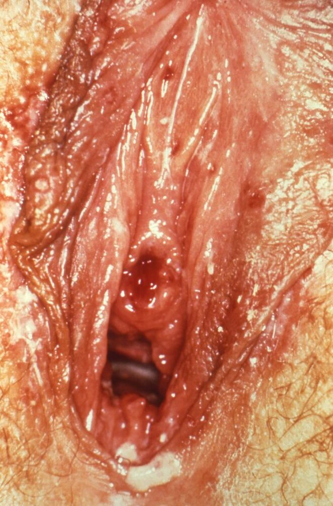

Genital herpes

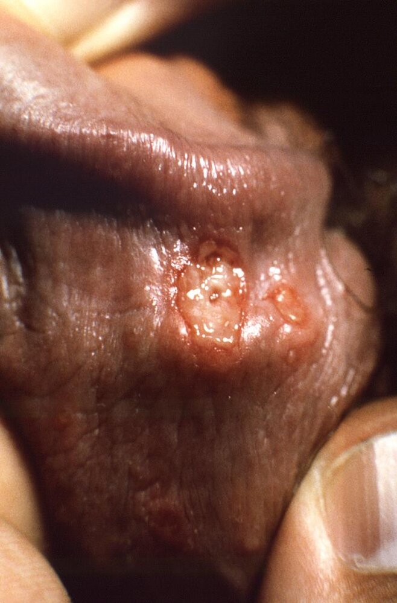

Genital herpes

---

## Cutaneous herpes

### Eczema herpeticum [[17]](https://coursology-qbank.com/amboss/article/u8WpoM0)

* Etiology

* <u>HSV-1</u> or <u>HSV-2</u>

* Associated with preexisting <u>skin</u> conditions, commonly <u>atopic dermatitis</u>

* Clinical features

* Appearance  

* Grouped painful <u>umbilicated</u> <u>vesicles</u> on an <u>erythematous</u> base

* Progression to punched-out <u>erosions</u>

* Location

* Areas of existing active or healing <u>eczema</u> (e.g., head, upper body, flexural surfaces) [[14]](https://coursology-qbank.com/amboss/article/Od1IJf0)[[15]](https://coursology-qbank.com/amboss/article/UIdbXr0)[[16]](https://coursology-qbank.com/amboss/article/Wk1P5S0)

* See “<u>Clinical features of eczema</u>” for age-specific features.

* Associated symptoms: <u>fever</u>, <u>malaise</u>, <u>lymphadenopathy</u>

* Differential diagnoses

* <u>Chickenpox</u>

* <u>Impetigo</u>

* <u>Contact dermatitis</u>

* <u>Smallpox</u>

* Management [[14]](https://coursology-qbank.com/amboss/article/Od1IJf0)[[17]](https://coursology-qbank.com/amboss/article/u8WpoM0)[[30]](https://coursology-qbank.com/amboss/article/cGdayr0)

* Start empiric <u>acyclovir</u> (first-line treatment) while awaiting confirmatory <u>diagnostics for HSV</u>. [[30]](https://coursology-qbank.com/amboss/article/cGdayr0)

* Mild or moderate involvement: oral <u>acyclovir</u> (<u>off-label</u>) in consultation with specialists [[14]](https://coursology-qbank.com/amboss/article/Od1IJf0)[[30]](https://coursology-qbank.com/amboss/article/cGdayr0)

* Severe involvement, systemic symptoms, <u>immune deficiency</u>, and/or age < 1 year: IV <u>acyclovir</u> (<u>off-label</u>) DOSAGE [[30]](https://coursology-qbank.com/amboss/article/cGdayr0)[[2]](https://coursology-qbank.com/amboss/article/Bedza60)

* Urgently consult dermatology and infectious diseases.

* Symptomatic management: <u>antihistamines</u> for <u>pruritus</u>, cool compresses, <u>skin</u> care

> [!WARNING]
> <u>Eczema herpeticum</u> is a disseminated <u>HSV</u> infection and a dermatologic emergency; treat promptly with <u>acyclovir</u>. [[17]](https://coursology-qbank.com/amboss/article/u8WpoM0)

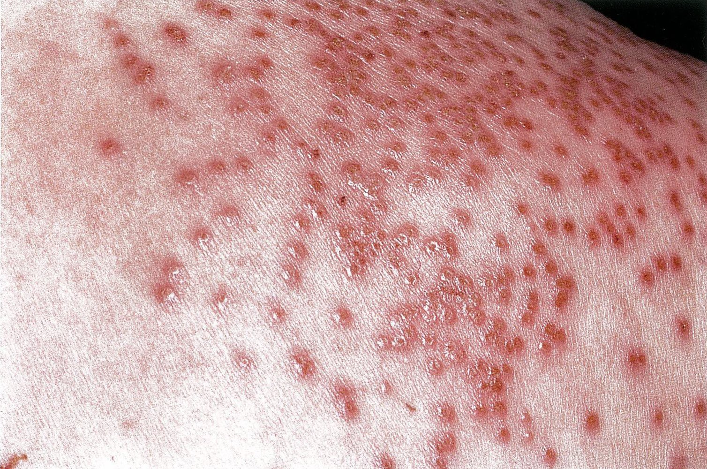

Eczema herpeticum

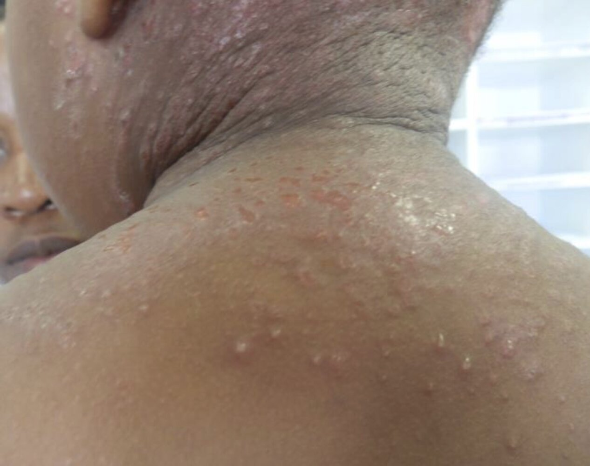

Eczema herpeticum

### Herpetic whitlow [[13]](https://coursology-qbank.com/amboss/article/jwW_in0)[[31]](https://coursology-qbank.com/amboss/article/auWQpM0)[[32]](https://coursology-qbank.com/amboss/article/-qcDad0)

* Etiology

* <u>HSV-1</u> or <u>HSV-2</u>

* Direct contact with infected secretions through a break in the <u>skin</u> (e.g., torn cuticle)

* Commonly affected individuals

* Children

* Health care workers exposed to oral secretions (e.g., dentists)

* <u>Incubation period</u>: 2–20 days [[13]](https://coursology-qbank.com/amboss/article/jwW_in0)

* Clinical features

* Appearance: cluster of <u>vesicles</u> on an <u>erythematous</u> base that progress to <u>ulcerations</u>

* Location: commonly the <u>distal</u> <u>phalanx</u> of a single finger

* Associated symptoms

* <u>Pain</u>, <u>edema</u>, tingling, and a burning sensation in the infected finger

* Regional <u>lymphadenopathy</u> (e.g., axillary, epitrochlear), <u>dermatomal</u> <u>pain</u>, and, rarely, <u>fever</u>

* Diagnostics

* Typically <u>diagnosed clinically</u>

* Diagnostic uncertainty: See “<u>Diagnostics of HSV infections</u>.”

* Differential diagnoses

* <u>Paronychia</u>

* <u>Cellulitis</u>

* <u>Felon</u>

* Treatment [[13]](https://coursology-qbank.com/amboss/article/jwW_in0)

* Provide symptomatic management (e.g., <u>analgesia</u>, <u>immobilization</u>, elevation).

* Keep a dry dressing over the lesions to reduce viral spread.

* Advise patients that <u>herpetic whitlow</u> is <u>self-limited</u>, with resolution in ∼ 3 weeks.

* Consider antiviral treatment in consultation with infectious disease for patients with:

* Lesions < 48 hours old

* <u>Immune deficiency</u>

> [!WARNING]
> Surgical treatment is not indicated for <u>herpetic whitlow</u> and can lead to complications (e.g., <u>inoculation</u> of uninfected <u>skin</u>, bacterial <u>superinfection</u>). [[31]](https://coursology-qbank.com/amboss/article/auWQpM0)

### Herpes gladiatorum [[18]](https://coursology-qbank.com/amboss/article/IV1YDf0)[[33]](https://coursology-qbank.com/amboss/article/rV1fDf0)

* <u>Epidemiology</u>: typically occurs in athletes that participate in close contact sports (e.g., wrestling, rugby)

* <u>Incubation period</u>: 4–11 days

* Etiology

* <u>HSV-1</u>

* Direct contact with infected oral secretions through a break in the <u>skin</u>

* Clinical features 

* Appearance: Multiple <u>vesicles</u> on an <u>erythematous</u> base that progress to <u>ulcerations</u>

* Location: most commonly located on areas with <u>skin</u>-to-<u>skin</u> contact (e.g., head, neck, and arms) [[16]](https://coursology-qbank.com/amboss/article/Wk1P5S0)

* Associated symptoms: <u>fever</u>, <u>malaise</u>, tender regional <u>lymphadenopathy</u>

* Diagnostics: See “<u>Diagnostics of HSV infections</u>.”

* Differential diagnoses

* <u>Folliculitis</u>

* <u>Impetigo</u>

* Treatment [[34]](https://coursology-qbank.com/amboss/article/GwdB4H0)

* The following regimens are for immunocompetent patients; for <u>immunocompromised</u> patients, consult a specialist.

* Initial infection: <u>acyclovir</u> (<u>off-label</u>) DOSAGE OR <u>valacyclovir</u> (<u>off-label</u>) DOSAGE [[18]](https://coursology-qbank.com/amboss/article/IV1YDf0)[[33]](https://coursology-qbank.com/amboss/article/rV1fDf0)[[34]](https://coursology-qbank.com/amboss/article/GwdB4H0)

* Recurrent infection: <u>acyclovir</u> (<u>off-label</u>) DOSAGE OR <u>valacyclovir</u> (<u>off-label</u>) DOSAGE [[18]](https://coursology-qbank.com/amboss/article/IV1YDf0)

* Suppression (adults only; <u>off-label</u>) during sports season: <u>acyclovir</u> DOSAGE OR <u>valacyclovir</u> DOSAGE OR <u>famciclovir</u> DOSAGE [[34]](https://coursology-qbank.com/amboss/article/GwdB4H0)

* Exclude individuals from <u>skin</u>-<u>skin</u> contact sports until all of the following are met: [[2]](https://coursology-qbank.com/amboss/article/Bedza60)[[16]](https://coursology-qbank.com/amboss/article/Wk1P5S0)[[34]](https://coursology-qbank.com/amboss/article/GwdB4H0)

* Has received 5 days of systemic antivirals [[34]](https://coursology-qbank.com/amboss/article/GwdB4H0)

* No new lesions for 72 hours [[34]](https://coursology-qbank.com/amboss/article/GwdB4H0)

* All lesions are crusted over and covered.

* Primary episode: no ongoing systemic symptoms

* Complications: ocular manifestations (e.g., follicular <u>conjunctivitis</u>, <u>viral keratitis</u>)

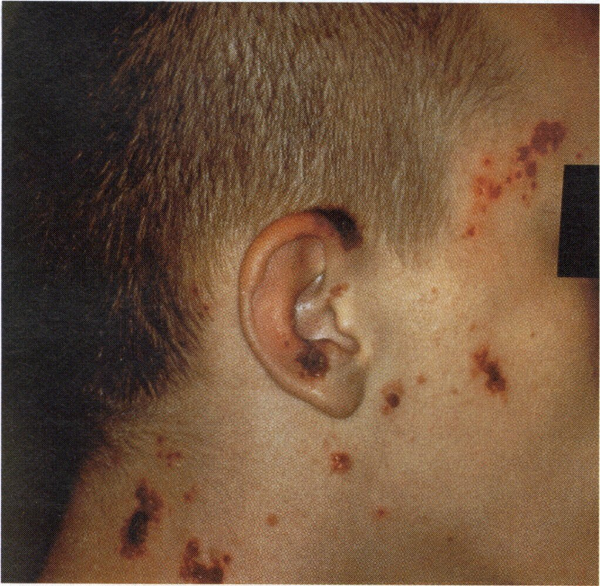

Herpes gladiatorum

---

## Herpes esophagitis

* <u>Epidemiology</u>: typically occurs in patients who are <u>immunocompromised</u> [[35]](https://coursology-qbank.com/amboss/article/IadYNo0)

* Clinical features

* <u>Odynophagia</u>

* <u>Dysphagia</u>

* Retrosternal <u>chest pain</u>

* Diagnostics [[36]](https://coursology-qbank.com/amboss/article/D2c1Pb0)[[37]](https://coursology-qbank.com/amboss/article/kIYm1q)

* Endoscopy: <u>superficial</u> punched-out <u>ulcers</u> in the mid and <u>distal</u> <u>esophagus</u> in the absence of <u>plaques</u>   [[38]](https://coursology-qbank.com/amboss/article/vBXAc00)

* <u>Histopathology</u>

* <u>Multinucleated giant cells</u>

* Intranuclear eosinophilic Cowdry A <u>inclusions</u>

* Differential diagnoses: See “<u>Infectious esophagitis</u>.”

* Treatment [[36]](https://coursology-qbank.com/amboss/article/D2c1Pb0)[[37]](https://coursology-qbank.com/amboss/article/kIYm1q)

* Consider inpatient treatment for patients with severe <u>odynophagia</u>.

* Optimize nutrition and hydration.

* Provide <u>pain management</u>.

* Administer <u>acyclovir</u>.

* Immunocompetent patients: DOSAGE

* <u>Immunocompromised</u> patients: DOSAGE

* Severe <u>odynophagia</u> or <u>dysphagia</u>: IV treatment DOSAGE

* Consult gastroenterology and infectious disease specialists as needed.

* In treatment-naive patients with <u>AIDS</u>, evaluate the need to initiate <u>antiretroviral therapy</u> in consultation with infectious disease specialists.

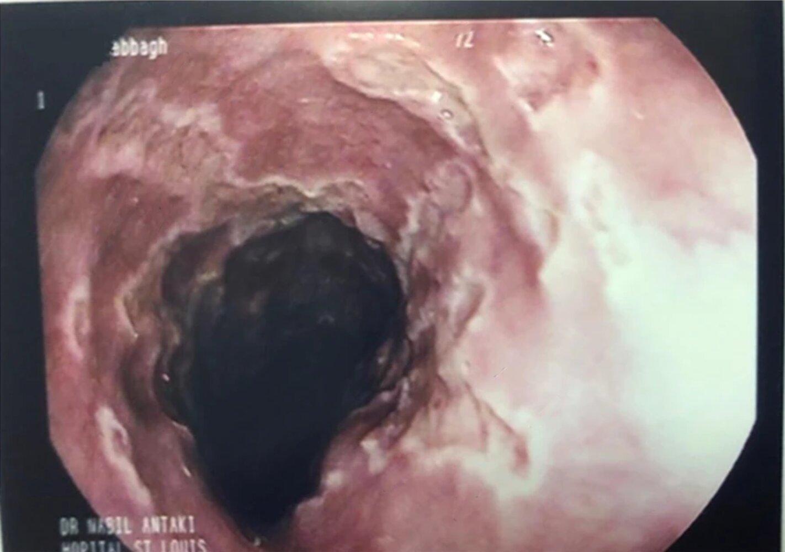

Herpes esophagitis endoscopy

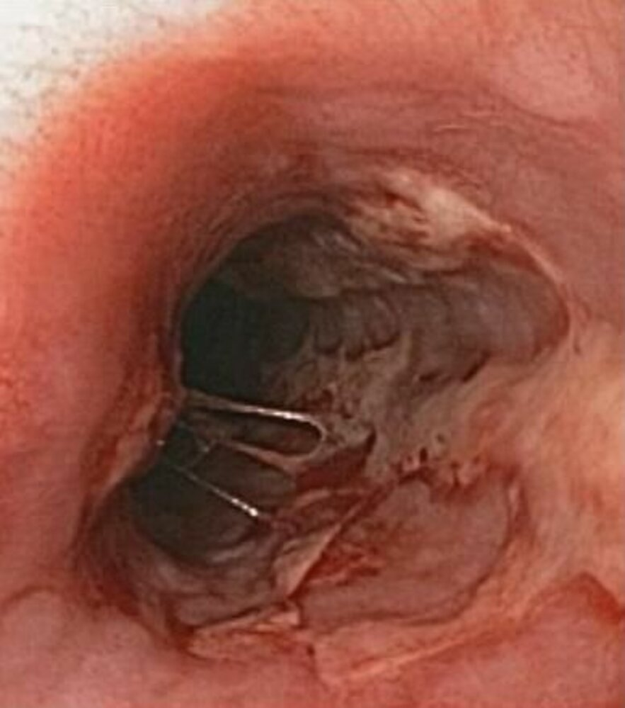

Herpes esophagitis

---

## Special patient groups

### Genital herpes in pregnancy [[2]](https://coursology-qbank.com/amboss/article/Bedza60)[[3]](https://coursology-qbank.com/amboss/article/2NcT010)[[6]](https://coursology-qbank.com/amboss/article/HHdK7r0)

<u>HSV</u> infection during <u>pregnancy</u> can cause disseminated <u>HSV</u> infection (e.g., <u>HSV</u> <u>hepatitis</u>, <u>fulminant liver failure</u>) and <u>vertical transmission</u>. [[3]](https://coursology-qbank.com/amboss/article/2NcT010)[[42]](https://coursology-qbank.com/amboss/article/MwdMjH0)

> [!TIP]
> Suppressive <u>antiviral therapy</u> and <u>cesarean delivery</u> for certain pregnant individuals reduce the risk of <u>vertical transmission</u>. [[43]](https://coursology-qbank.com/amboss/article/f4Wkil0)

#### Prenatal management [[3]](https://coursology-qbank.com/amboss/article/2NcT010)[[6]](https://coursology-qbank.com/amboss/article/HHdK7r0)[[8]](https://coursology-qbank.com/amboss/article/RcWlX40)

* Ask about any history of oral and genital <u>HSV</u> infections.

* Type-specific <u>serologic testing</u> is not routinely recommended.

* No history of oral, labial and/or genital <u>HSV</u>: Recommend avoiding <u>sexual activities</u> during the <u>third trimester</u> if their partner has known or suspected <u>HSV</u> infection.

* Indications for <u>antiviral therapy</u>: The following regimens are for immunocompetent patients; for <u>immunocompromised</u> patients, consult a specialist.

* Active infection

* Primary infection: oral <u>acyclovir</u> DOSAGE OR <u>valacyclovir</u> DOSAGE    [[6]](https://coursology-qbank.com/amboss/article/HHdK7r0)

* Recurrent episodes: oral <u>acyclovir</u> DOSAGE OR <u>valacyclovir</u> DOSAGE [[6]](https://coursology-qbank.com/amboss/article/HHdK7r0)

* Severe or disseminated disease: IV <u>acyclovir</u> DOSAGE [[6]](https://coursology-qbank.com/amboss/article/HHdK7r0)

* History of genital <u>HSV</u>: suppressive oral antivirals from 36 weeks' <u>gestation</u> until delivery

* <u>Acyclovir</u> DOSAGE [[3]](https://coursology-qbank.com/amboss/article/2NcT010)[[6]](https://coursology-qbank.com/amboss/article/HHdK7r0)

* OR <u>valacyclovir</u> DOSAGE [[3]](https://coursology-qbank.com/amboss/article/2NcT010)[[6]](https://coursology-qbank.com/amboss/article/HHdK7r0)

> [!WARNING]
> <u>Famciclovir</u> is not used during <u>pregnancy</u> as the safety has not been established. [[6]](https://coursology-qbank.com/amboss/article/HHdK7r0)

#### Peripartum management [[6]](https://coursology-qbank.com/amboss/article/HHdK7r0)

* Individuals presenting for <u>labor</u> and delivery

* Ask about any history of <u>genital herpes</u>; if prior history, examine thoroughly for active <u>HSV</u> lesions.

* Active <u>genital lesions</u> and <u>preterm prelabor rupture of membranes</u>: Urgently consult obstetrics.

* Considerations for <u>cesarean delivery</u>

* Active <u>genital lesions</u> or <u>prodromal</u> symptoms at delivery: Recommend <u>cesarean delivery</u>.

* Primary infection of <u>genital herpes</u> in the <u>third trimester</u>: Offer an elective <u>cesarean delivery</u> at term or near-term.

#### Postpartum management [[6]](https://coursology-qbank.com/amboss/article/HHdK7r0)

* Birthing parent: <u>Breastfeeding</u> is safe if there are no lesions on the <u>breast</u> and all active lesions are covered.

* <u>Newborn</u>: Provide <u>prevention of HSV infection in neonates</u>.

---