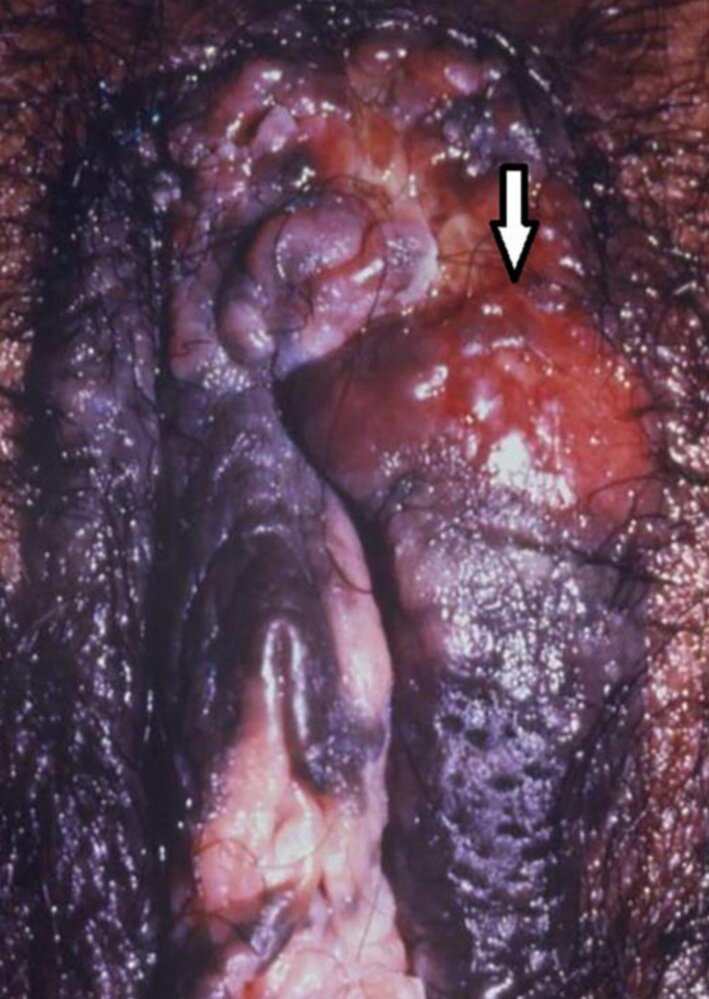
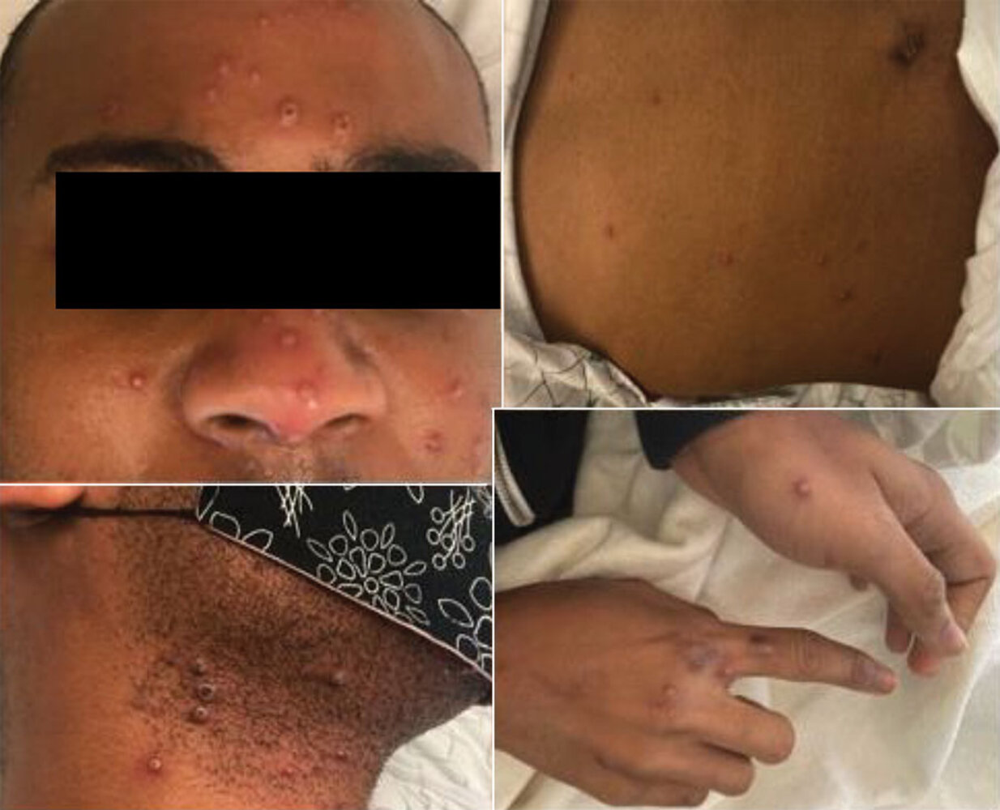
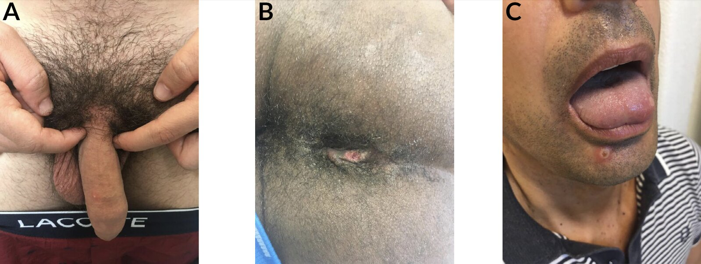
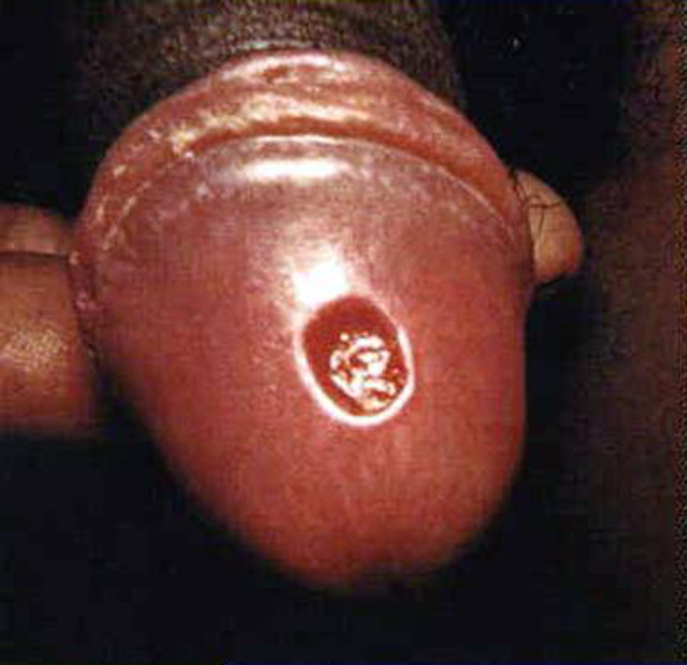
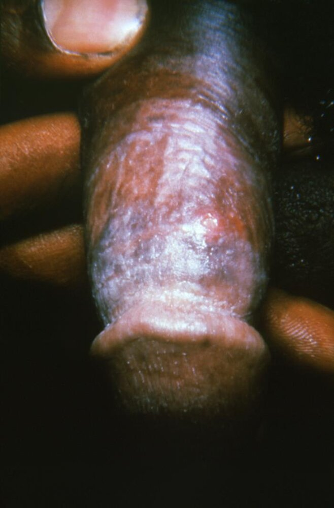
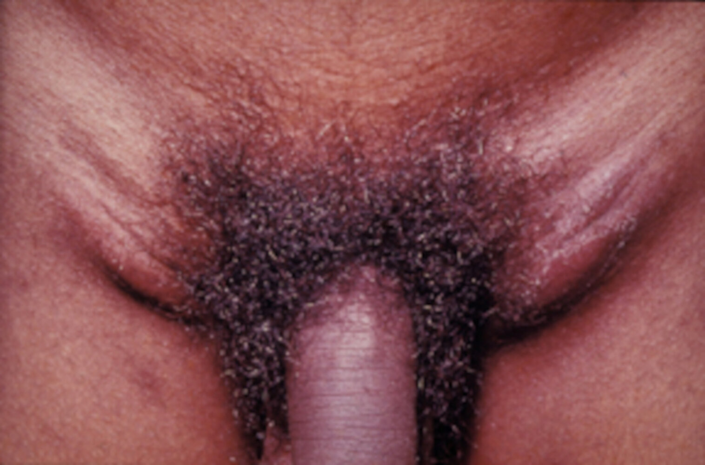
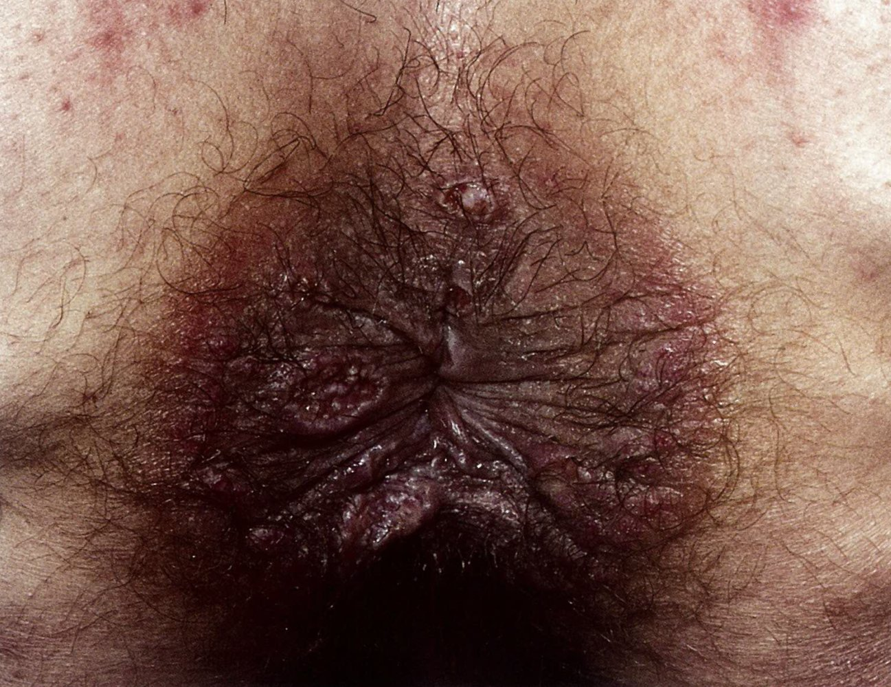
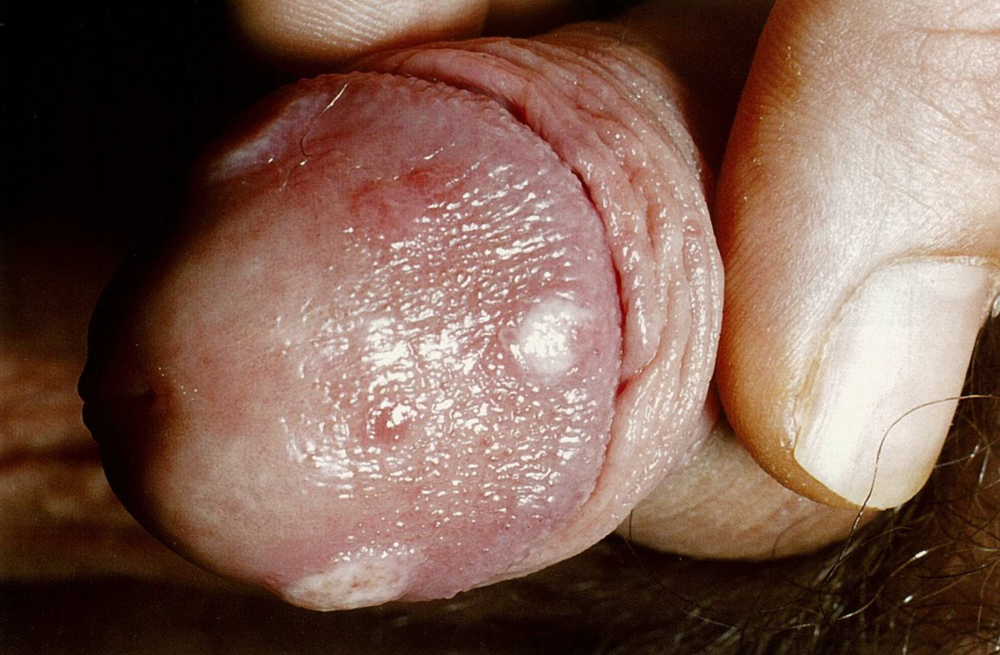
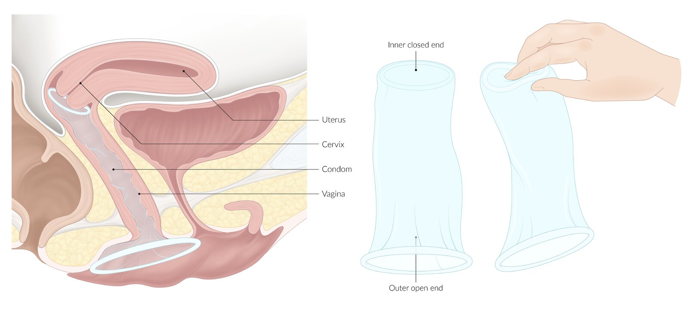

# Sexually transmitted infections

*Categories: Clinical knowledge > Dermatology > Infectious diseases > Venerology > Sexually transmitted infections*

[Original Article Link](https://coursology-qbank.com/amboss/article/IM0YJg)

---

## Summary

Sexually transmitted infections (STIs) are a group of infections that are primarily transmitted via sexual intercourse and intimate physical contact. Some of the most common STIs include <u>HPV infection</u>, <u>chlamydia infection</u>, and <u>gonorrhea</u>. Urethral or <u>vaginal discharge</u>, painful or painless <u>genital lesions</u>, and <u>pelvic pain</u> are the most common presenting symptoms in symptomatic patients. Patients with an active STI have an increased risk of <u>coinfection</u> with additional STIs. In addition to treating the patient, simultaneous treatment of the partner is often necessary to prevent recurrent infections. Regular <u>STI screening</u> in adults is recommended since affected individuals are frequently asymptomatic.

This article provides an overview of the diagnosis and management of undifferentiated STIs and details on <u>screening for STIs</u> in asymptomatic individuals. See the respective articles for details on specific diseases.

---

## Overview

### Overview of STIs

See respective articles for details and dosages.

|  <u>Overview of sexually transmitted infections</u> [[1]](https://coursology-qbank.com/amboss/article/2NcT010)  |  |  |
| --- | --- | --- |
| Pathogens | Associated disease | Management |
| Viral pathogens |  |  |
| <u>Human papillomavirus</u> |   * <u>Condylomata acuminata</u> (usually <u>HPV</u> type 6 or 11)  * <u>Bowenoid papulosis</u> (usually <u>HPV</u> type 16)  [[2]](https://coursology-qbank.com/amboss/article/zYdr7o0)    |   * Local cytotoxic therapy  * <u>Cryotherapy</u>  * Operative management: <u>curettage</u> (surgical excision), laser <u>surgery</u>, or <u>electrosurgery</u>    |
|  <u>Herpes simplex virus</u> type 2 (<u>HSV-2</u>)   |  * <u>Genital herpes</u>   |   * Antivirals, e.g., <u>acyclovir</u>, <u>valacyclovir</u> PO  * See “<u>Treatment for genital herpes</u>.”    |
| <u>HIV</u> |   * <u>Opportunistic infections</u>  * Increased rate of malignancies, e.g., <u>lymphoma</u>, <u>Kaposi sarcoma</u>    |  * Systemic <u>antiretroviral therapy</u>   |
| <u>Hepatitis B virus</u> (<u>HBV</u>) |  * <u>Hepatitis B</u>   |   * Systemic <u>antiviral therapy</u> PO (e.g., <u>entecavir</u>)  * <u>Interferon</u> (immune-modulating, antiviral, and antiproliferative agent) SC or IM    |
|  <u>Monkeypox virus</u> [[3]](https://coursology-qbank.com/amboss/article/Po1WX30)  |  * <u>Mpox</u>   |   * <u>Supportive care for mpox</u>  * <u>Severe mpox</u>: Consider <u>off-label</u> pharmacotherapy.  [[3]](https://coursology-qbank.com/amboss/article/Po1WX30)[[4]](https://coursology-qbank.com/amboss/article/egWx8k0)    |
| Bacterial pathogens |  |  |
| <u>Chlamydia trachomatis</u> D–K |  * <u>Genitourinary chlamydia</u>  * <u>♀</u>: <u>Urethritis</u>, <u>vulvovaginitis</u>, <u>cervicitis</u>, <u>salpingitis</u>, <u>tuboovarian abscess</u>, <u>pelvic inflammatory disease</u> (<u>PID</u>), <u>reactive arthritis</u>  * <u>♂</u>: <u>Urethritis</u>, <u>epididymitis</u>, <u>reactive arthritis</u>, <u>prostatitis</u>   |  * First-line: <u>doxycycline</u> PO   |
| <u>Chlamydia trachomatis</u> L1–L3 |  * <u>Lymphogranuloma venereum</u>   |  |
| <u>Klebsiella granulomatis</u> |  * <u>Granuloma inguinale</u>   |  * First-line: <u>azithromycin</u> PO   |
| <u>Haemophilus ducreyi</u> |  * <u>Chancroid</u>   |  * Any of the following:  * <u>Azithromycin</u> PO  * <u>Ciprofloxacin</u> PO  * <u>Erythromycin</u> base PO  * <u>Ceftriaxone</u> IM   |
| <u>Mycoplasma genitalium</u> |  * <u>Mgen infection</u>   |  * <u>Doxycycline</u> PLUS:  * <u>Moxifloxacin</u> (if <u>macrolide</u>-resistant)  * OR <u>azithromycin</u> (if <u>macrolide</u>-sensitive)   |
| <u>Neisseria gonorrhoeae</u> |  * <u>Gonorrhea</u>  * <u>♀</u>: <u>Urethritis</u>, <u>salpingitis</u>, <u>tuboovarian abscess</u>, <u>pelvic inflammatory disease</u>, <u>cervicitis</u>, <u>Bartholin gland abscess</u>  * <u>♂</u>: <u>Urethritis</u>, <u>epididymitis</u>  * Viscous and <u>purulent</u> discharge  * <u>Disseminated gonococcal infection</u> (e.g., <u>gonococcal arthritis</u>)   |  * <u>Ceftriaxone</u> IM AND (if <u>chlamydia</u> is not excluded) <u>doxycycline</u> PO   |
| <u>Treponema pallidum</u> |  * <u>Syphilis</u>   |   * <u>Penicillin G</u> IM  * Alternatives (in the case of <u>penicillin</u> <u>allergy</u>): <u>doxycycline</u> or <u>ceftriaxone</u>    |
| Parasitic pathogens |  |  |
| <u>Trichomonas vaginalis</u> |  * <u>Trichomoniasis</u> (<u>cervicitis</u>)   |  * <u>Metronidazole</u> PO   |
| <u>Phthirus pubis</u> |  * <u>Pediculosis pubis</u> (<u>pubic lice</u>, <u>crab louse</u>)   |  * Either of the following insecticides:  * <u>Permethrin</u> 1% lotion  * <u>Pyrethrins with piperonyl butoxide</u>   |
| <u>Sarcoptes scabiei</u> |  * <u>Scabies</u>   |   * Topical <u>permethrin</u>  * Alternatives: <u>ivermectin</u> PO, crotamiton cream, sulfur ointment, <u>lindane lotion</u>    |

Anogenital warts (condylomata acuminata)

Bowenoid papulosis

Granuloma inguinale (Donovaniosis)

Tzanck cell

Trichomonas vaginalis

### Overview of <u>genital lesions</u> caused by STIs [[1]](https://coursology-qbank.com/amboss/article/2NcT010)

The most common causes of genital <u>ulcers</u> in the United States are <u>genital herpes</u> and <u>syphilis</u>. [[1]](https://coursology-qbank.com/amboss/article/2NcT010)

| Overview of sexually transmitted genital lesions |  |  |
| --- | --- | --- |
|  | Solitary | Multiple |
| Painful |  * <u>Chancroid</u>  * Solitary painful <u>ulcer</u> with irregular borders and <u>friable</u> granulomatous tissue at the <u>ulcer</u> base  * Commonly associated with painful <u>lymphadenitis</u> (<u>bubo</u>)   |   * <u>Genital herpes</u>  * Mostly <u>HSV-2</u> (most common cause of genital <u>ulcers</u>) [[5]](https://coursology-qbank.com/amboss/article/9AWNNL0)  * Multiple painful shallow <u>ulcers</u>  * <u>Mpox</u>  * Sequential evolution of <u>rash</u>  * <u>Rash</u> also affects the face, palms, and soles  * Typically lasts 2–3 weeks    |
| Painless |   * <u>Chancre</u> (<u>primary syphilis</u>)  * Solitary painless indurated <u>ulcer</u> with a clean base  * <u>Granuloma inguinale</u> (<u>donovanosis</u>)  * Large, <u>friable</u>, beefy-red <u>ulcer</u>  * Regional <u>lymph nodes</u> typically spared  * <u>Lymphogranuloma venereum</u>  * Transient, small <u>papule</u>, or shallow <u>ulcer</u> that heals spontaneously without scarring  * May be associated with painful inguinal <u>lymphadenopathy</u> (may form <u>buboes</u>)    |   * <u>Condylomata acuminata</u> (anogenital warts) * <u>Skin</u>-colored smooth or <u>verrucous</u> <u>papular</u> eruptions  * <u>Condylomata lata</u> (<u>secondary syphilis</u>)  * Warty <u>erosions</u> on the genitals that are velvety, moist, and broad-based  * Resolves spontaneously after weeks to months    |

> [!TIP]
> Consider a noninfectious etiology (e.g., trauma, <u>psoriasis</u>, <u>fixed drug eruptions</u>, <u>Wegener granulomatosis</u>, <u>Behcet syndrome</u>) if a <u>pathogen</u> is not detected on diagnostics. [[1]](https://coursology-qbank.com/amboss/article/2NcT010)[[5]](https://coursology-qbank.com/amboss/article/9AWNNL0)

Chancroid lesion on the penis

Inguinal lymphadenopathy in chancroid

Genital herpes

Genital herpes

Mpox

Mpox

Chancre of the glans penis in primary syphilis

Granuloma inguinale

Lymphogranuloma venereum (LGV)

Lymphogranuloma venereum

Anogenital warts (condylomata acuminata)

Condylomata lata in secondary syphilis

Condylomata lata of the glans penis in secondary syphilis

---

## Risk factors

* Sexually active individuals < 25 years of age

* Inconsistent <u>condom</u> use

* Current STI or an STI in the past year

* Multiple sexual partners

* New sexual partner

* Partner with an STI or at high risk for an STI

* <u>Men who have sex with men</u>

* History of incarceration

* Exchanging sex for drugs or money

* IV drug use

* Individuals who request <u>STI testing</u>

---

## Management

* The following sections detail the initial approach to evaluate suspected STIs; <u>hepatitis B virus infection</u> and <u>HIV infection</u> are detailed separately in their respective articles.

* Evaluate for <u>child sexual abuse</u> in children with STIs occurring beyond the <u>neonatal period</u> and before <u>adolescence</u>.

* An approach to undifferentiated symptoms that are unlikely to be caused by STIs is not covered here.

* See “<u>Screening for STIs</u>” for details on evaluating asymptomatic individuals for STIs.

---

## Diagnostics

* Collect appropriate swabs or <u>first-void urine</u> samples for microscopy  and/or <u>nucleic acid amplification testing</u> (<u>NAAT</u>).

* Test for the most likely causative organism based on <u>patient history</u> and examination findings.

* See the table below for initial diagnostic tests.

* See the respective articles for further details.

* Routinely offer <u>HIV testing</u> and <u>syphilis testing</u> to all individuals with a suspected STI. [[8]](https://coursology-qbank.com/amboss/article/G_cBpU0)

* Perform a <u>pregnancy test</u> in women.

> [!TIP]
> Provider-collected or self-collected swabs should be obtained from all sites of exposure (e.g., <u>rectum</u>, <u>oropharynx</u>, <u>vagina</u>, <u>urethra</u>) as needed. [[1]](https://coursology-qbank.com/amboss/article/2NcT010)

|  Symptom-based STI diagnostics [[1]](https://coursology-qbank.com/amboss/article/2NcT010)[[8]](https://coursology-qbank.com/amboss/article/G_cBpU0)  |  |
| --- | --- |
|  | Recommended diagnostics |
| Men with urethral discharge, <u>dysuria</u>, or scrotal <u>pain</u> |   * <u>NAAT</u> for <u>N. gonorrhoeae</u> and <u>C. trachomatis</u>.  * <u>Diagnostics for urethritis</u>    |
| Women with abnormal <u>vaginal discharge</u> |   * <u>NAAT</u> for <u>N. gonorrhoeae</u> and <u>C. trachomatis</u>  * Perform a <u>wet mount</u>, <u>potassium hydroxide test</u>, and assess <u>vaginal pH</u>: See “<u>Differential diagnoses of infectious causes of vaginal discharge</u>” for findings.  * Negative <u>wet mount</u>: Test for <u>T. vaginalis</u>. [[1]](https://coursology-qbank.com/amboss/article/2NcT010)  * Recurrent symptoms following empiric treatment: Consider <u>diagnostics for M. genitalium infection</u>. [[1]](https://coursology-qbank.com/amboss/article/2NcT010)    |
| Women with <u>pelvic pain</u> and/or <u>dyspareunia</u> |   * <u>Assess for PID</u>.  * In women with <u>PID</u>, perform <u>NAAT</u> for <u>N. gonorrhoeae</u> and <u>C. trachomatis</u>.    |
| Patients with genital and <u>anorectal ulcers</u> |   * All patients  * <u>Test for syphilis</u>: direct detection of <u>T. pallidum</u> in <u>exudate</u> or tissue , <u>syphilis serology</u>  * Test for <u>genital herpes</u>: <u>NAAT</u> (or culture) for <u>HSV1</u> and <u>HSV2</u>; and <u>type-specific HSV serology</u>  * High <u>prevalence</u> areas for <u>chancroid</u>: A probable diagnosis can be made if <u>diagnostic criteria for chancroid</u> are met.  * Multiple painless <u>ulcers</u> or painful inguinal <u>lymphadenopathy</u> without an alternative etiology: <u>NAAT</u> for <u>C. trachomatis</u>  * Clinical suspicion for <u>mpox</u>: <u>PCR</u> testing  [[3]](https://coursology-qbank.com/amboss/article/Po1WX30)[[10]](https://coursology-qbank.com/amboss/article/Ro1lb30)  * Diagnostic uncertainty : Consider <u>biopsy</u> of <u>ulcers</u> with <u>immunohistochemistry</u>. [[1]](https://coursology-qbank.com/amboss/article/2NcT010)    |
|  Patients with <u>anogenital warts</u> [[1]](https://coursology-qbank.com/amboss/article/2NcT010)  |   * Typically clinically diagnosed.  * Consider <u>biopsy</u> in case of diagnostic uncertainty, especially in <u>immunocompromised individuals</u>.  * Consider <u>syphilis testing</u> (microscopy or <u>serology</u>) to rule out <u>condyloma lata</u>.    |
|  Patients with genital itching (suspected <u>ectoparasitic</u> <u>infestation</u>)  [[8]](https://coursology-qbank.com/amboss/article/G_cBpU0)  |  * Diagnosis is typically clinical.   |

Differential diagnosis of infectious vulvovaginitis

> [!TIP]
> In patients with <u>anogenital warts</u>, testing for <u>HPV infection</u> is not recommended, as results are not specific and do not alter management. [[1]](https://coursology-qbank.com/amboss/article/2NcT010)

> [!WARNING]
> <u>Syphilis serology</u> interpretation is complex. Follow <u>syphilis testing algorithms</u> to reduce the risk of <u>false-positive</u> and <u>false-negative</u> results. [[1]](https://coursology-qbank.com/amboss/article/2NcT010)

> [!WARNING]
> All cases of <u>syphilis</u>, <u>gonorrhea</u>, <u>chlamydia</u>, <u>chancroid</u>, <u>hepatitis</u>, <u>mpox</u>, and <u>HIV</u> must be reported to the state health department for surveillance. Reporting of other STIs varies by state. [[1]](https://coursology-qbank.com/amboss/article/2NcT010)

---

## Treatment

### Approach [[1]](https://coursology-qbank.com/amboss/article/2NcT010)[[8]](https://coursology-qbank.com/amboss/article/G_cBpU0)

* Offer treatment to all patients with suspected STIs on the day of presentation.

* Same-day results available: Provide tailored treatment (see “<u>Pathogen</u>-specific management”).

* Same-day results not available: Offer empiric treatment; tailor treatment when results are available.

* Trace and treat partners if possible: See “<u>Management of sexual partners</u>.”

* Counsel patients on how to reduce the risk of STIs: See “<u>Prevention of STIs</u>.”

* Offer <u>postexposure prophylaxis for STIs</u> to eligible patients.

* If <u>STI testing</u> is negative, evaluate for less common causative pathogens and non-STI etiologies.

### Empiric management of STIs

|  Symptom-based management for STIs  [[1]](https://coursology-qbank.com/amboss/article/2NcT010)[[8]](https://coursology-qbank.com/amboss/article/G_cBpU0)  |  |
| --- | --- |
| Clinical presentation | Empiric management |
|  Urethral discharge   |  * Start empiric management for gonorrhea and chlamydia.  * Nonpregnant individuals: <u>ceftriaxone</u> DOSAGE PLUS <u>doxycycline</u> DOSAGE [[1]](https://coursology-qbank.com/amboss/article/2NcT010)  * Pregnant individuals: <u>ceftriaxone</u> DOSAGE PLUS <u>azithromycin</u> DOSAGE [[1]](https://coursology-qbank.com/amboss/article/2NcT010)   |
|  <u>Vaginal discharge</u>   |  |
|  <u>Cervicitis</u> (on <u>speculum examination</u>)   |  |
| <u>Pelvic pain</u> |   * <u>♀</u>: Start <u>empiric antibiotics for PID</u>.  * <u>♂</u>: Start <u>empiric antibiotics for epididymitis</u>.    |
| Anorectal <u>pain</u> and/or discharge |   * <u>Oral analgesics</u> as needed for <u>pain management</u> [[8]](https://coursology-qbank.com/amboss/article/G_cBpU0)  * Start empiric antibiotics for acute proctitis.  * <u>Ceftriaxone</u> DOSAGE PLUS <u>doxycycline</u> DOSAGE [[1]](https://coursology-qbank.com/amboss/article/2NcT010)  * Clinical features of <u>LGV</u> present: Extend <u>doxycycline</u> course to 21 days. [[1]](https://coursology-qbank.com/amboss/article/2NcT010)  * Painful perianal or anorectal <u>mucosal</u> <u>ulcers</u>: Add presumptive <u>treatment for genital herpes</u>. [[1]](https://coursology-qbank.com/amboss/article/2NcT010)    |
| Anogenital <u>ulcers</u> |   * All patients: Consider starting <u>treatment for syphilis</u> and <u>treatment for genital herpes</u> on the same day.  [[8]](https://coursology-qbank.com/amboss/article/G_cBpU0)  * Patients with a solitary painful <u>ulcer</u> and tender <u>lymphadenopathy</u>: Start <u>antibiotics for chancroid</u> empirically only in areas where cases are reported.  [[8]](https://coursology-qbank.com/amboss/article/G_cBpU0)  * Patients with large, beefy-red <u>friable</u> lesions without <u>lymphadenopathy</u>: Start <u>antibiotics for granuloma inguinale</u> only in areas where cases are reported.  [[1]](https://coursology-qbank.com/amboss/article/2NcT010)  * Patients with multiple painless <u>ulcers</u> or painful inguinal <u>lymphadenopathy</u> without an alternative etiology  : Start <u>antibiotics for LGV</u>. [[1]](https://coursology-qbank.com/amboss/article/2NcT010)  * If there is suspicion for <u>mpox</u> (e.g., multiple painful <u>ulcers</u>):  * Start <u>supportive care for mpox</u>.  * Further management depends on severity; see “<u>Management of mpox</u>.”    |
| <u>Anogenital warts</u> |   * Various options are available; use shared-decision making.  * See “<u>Management of anogenital warts</u>” for details.    |

Purulent urethral discharge

Vaginal discharge in gonococcal infection

Infectious cervicitis

> [!TIP]
> <u>Genital herpes</u> and <u>syphilis</u> are the most common causes of anogenital <u>ulcers</u> in the United States. [[1]](https://coursology-qbank.com/amboss/article/2NcT010)[[8]](https://coursology-qbank.com/amboss/article/G_cBpU0)

> [!TIP]
> <u>Chancroid</u> and <u>granuloma inguinale</u> (<u>donovanosis</u>) are rare in the United States. If there is diagnostic uncertainty or genital <u>ulcers</u> persist, immediately refer patients to centers with experience diagnosing and treating <u>chancroid</u>, <u>granuloma inguinale</u>, and <u>LGV</u>. [[1]](https://coursology-qbank.com/amboss/article/2NcT010)[[8]](https://coursology-qbank.com/amboss/article/G_cBpU0)

### <u>Pathogen</u>-specific management

Tailored <u>antimicrobial therapy</u> and additional management steps may be required depending on the <u>pathogen</u> identified, e.g.:

* See “<u>Management of gonorrhea</u>.”

* See “<u>Management of genitourinary chlamydia</u>.”

* See “<u>Treatment of syphilis</u>.”

* See “<u>Treatment of HSV infection</u>.”

* See “<u>Treatment of hepatitis B</u>.”

* See “<u>Treatment of HIV</u>.”

### Follow-up [[1]](https://coursology-qbank.com/amboss/article/2NcT010)

* Patients with <u>chlamydia</u>, <u>gonorrhea</u>, and/or <u>trichomoniasis</u>: 

* Most patients: Screen for repeat infection after 3 months of treatment.

* Obtain test of cure for patients with:

* Ongoing symptoms

* Nonadherence to treatment

* Pharyngeal <u>gonorrhea</u>

* <u>Chlamydia infection</u> during <u>pregnancy</u>

* Patients with <u>syphilis</u>: See “<u>Posttreatment assessment for syphilis</u>.”

---

## Management of sexual partners

### Bacterial STI

#### <u>Contact tracing</u> [[1]](https://coursology-qbank.com/amboss/article/2NcT010)

* Encourage patients with STIs to notify their sexual partners and have them seek clinical evaluation and appropriate treatment (except if there is a risk for <u>intimate partner violence</u>).

* Trace all sexual partners within the past 60 days (even if asymptomatic) OR the most recent sexual partner if last sexual contact was > 60 days ago.

* If timely evaluation and treatment of sexual partners seems unlikely: Offer <u>expedited partner therapy</u>.  [[1]](https://coursology-qbank.com/amboss/article/2NcT010)[[11]](https://coursology-qbank.com/amboss/article/5e1izf0)

> [!TIP]
> Sexual partners must be treated simultaneously to avoid reinfections. [[1]](https://coursology-qbank.com/amboss/article/2NcT010)

#### Expedited partner therapy (<u>EPT</u>) [[1]](https://coursology-qbank.com/amboss/article/2NcT010)

<u>EPT</u> is the treatment of sexual partners of patients with STIs without a preceding <u>clinical examination</u> or diagnostic test. Prescriptions are given to the <u>index patient</u> to pass on to their sexual partners (i.e., patient-delivered partner therapy).

* <u>EPT</u> is recommended for all sexual partners of patients with <u>gonorrhea</u> and/or <u>chlamydia</u> if the partner is unlikely to seek medical evaluation. 

* <u>EPT</u> for <u>gonorrhea</u> only (i.e., <u>chlamydia</u> has been ruled out in the <u>index patient</u>): <u>cefixime</u>DOSAGE [[1]](https://coursology-qbank.com/amboss/article/2NcT010)

* <u>EPT</u> for <u>chlamydia</u> only (i.e., <u>gonorrhea</u> has been ruled out in the <u>index patient</u>): <u>doxycycline</u>DOSAGE

* <u>EPT</u> for <u>gonorrhea</u> and <u>chlamydia</u>: <u>cefixime</u>  DOSAGE PLUS <u>doxycycline</u> DOSAGE [[1]](https://coursology-qbank.com/amboss/article/2NcT010)

* Provide written information on medications for <u>EPT</u> and educational materials on STI symptoms, complications, and prevention strategies.

> [!TIP]
> Offer <u>HIV testing</u> to partners of all patients diagnosed with STIs. Offer <u>HIV PrEP</u> to <u>individuals at very high risk of contracting HIV</u>. [[1]](https://coursology-qbank.com/amboss/article/2NcT010)

> [!TIP]
> Routinely offer <u>EPT</u> (if permitted by local law) to patients diagnosed with <u>chlamydia</u> and/or <u>gonorrhea</u> if it seems unlikely that their partner will seek timely medical care. See “Tips and Links” for the <u>CDC</u> page detailing which states permit <u>EPT</u>. [[1]](https://coursology-qbank.com/amboss/article/2NcT010)

#### Prevention of onward transmission of a bacterial STI [[1]](https://coursology-qbank.com/amboss/article/2NcT010)

Advice patients to avoid unprotected (condomless) sex until the following criteria are met:

* Completion of 7-day treatment regimen  OR 7 days have passed since a single-dose treatment.

* All symptoms have resolved.

* Any current sexual partners have also met the above criteria.

### Viral STIs [[12]](https://coursology-qbank.com/amboss/article/SgWyuk0)[[13]](https://coursology-qbank.com/amboss/article/lMbvK8)

* <u>Contact tracing</u>

* Contact all sexual partners and other individuals who may have been at risk.

* Determine the appropriate period for <u>contact tracing</u> based on the <u>pathogen</u>-specific <u>window period</u> and the date of the patient's last documented negative test, if available. [[12]](https://coursology-qbank.com/amboss/article/SgWyuk0)

* Offer recent contacts <u>post-exposure prophylaxis for STIs</u>.

* Advise <u>isolation precautions</u> as needed.  [[14]](https://coursology-qbank.com/amboss/article/-YdD7o0)

* Treat identified infections; see respective articles for details.

* Avoid unprotected sex in infected patients and during the <u>window period</u> for exposed patients.

* Educate patients on the <u>prevention of STIs</u>.

---

## Prevention

### Reduction in the risk of infection [[1]](https://coursology-qbank.com/amboss/article/2NcT010)[[7]](https://coursology-qbank.com/amboss/article/dv1o_i0)

#### Behavioral counseling

See “<u>Counseling on sexual health and contraception</u>” for details.

* Consistent <u>condom</u> use (internal or external ) during vaginal sex or anal sex

* <u>Dental dam</u> use during oral sex

* Mutual monogamy

* Reducing the number of sex partners

* <u>STI testing</u> of new sexual partners

* Abstinence

* Prevention of spread via <u>fomites</u> (e.g., contaminated sex toys)

> [!TIP]
> Obtain a <u>sexual history</u>, assess for <u>risk factors for STIs</u>, and offer behavioral counseling to prevent or minimize the risk for STIs for all sexually active <u>adolescents</u> and <u>adults at increased risk for STIs</u>. [[7]](https://coursology-qbank.com/amboss/article/dv1o_i0)[[15]](https://coursology-qbank.com/amboss/article/U71bOR0)

Female condom (internal condom)

#### Preexposure prophylaxis for STIs

* All patients: <u>Vaccination</u> against <u>HPV</u>, <u>HBV</u>, and <u>HAV</u> (see “<u>ACIP immunization schedule</u>” for details)

* Individuals at <u>high risk for mpox infection</u>: <u>mpox immunization</u>

* <u>Individuals at very high risk of HIV infection</u>: <u>HIV PrEP</u>

> [!TIP]
> Routinely offer <u>HIV PrEP</u> to <u>individuals at very high risk of HIV infection</u>. [[15]](https://coursology-qbank.com/amboss/article/U71bOR0)

#### Postexposure prophylaxis for STIs (PEP) [[1]](https://coursology-qbank.com/amboss/article/2NcT010)[[16]](https://coursology-qbank.com/amboss/article/PqWWAm0)

Offer PEP to individuals who have been recently exposed to an STI.

* <u>HIV PEP</u>: for sexual contacts within the past 72 hours. [[12]](https://coursology-qbank.com/amboss/article/SgWyuk0)[[15]](https://coursology-qbank.com/amboss/article/U71bOR0)[[17]](https://coursology-qbank.com/amboss/article/NgW-vk0)

* <u>Hepatitis B PEP</u>: Follow guidance for <u>HBV PEP following nonoccupational exposure</u> for contacts within the past 14 days. [[13]](https://coursology-qbank.com/amboss/article/lMbvK8)

* <u>Mpox PEP</u>: Offer to all sexual contacts within 4 days of exposure; consider for patients within 4–14 days to reduce infection severity.  [[3]](https://coursology-qbank.com/amboss/article/Po1WX30)

* <u>Antibiotic prophylaxis</u>

* Offer to all individuals who have experienced <u>sexual assault</u> (see “STI prophylaxis” in “<u>Management of recent sexual violence</u>”). [[1]](https://coursology-qbank.com/amboss/article/2NcT010)

* Offer a single dose of <u>doxycycline</u> (<u>off-label</u>) DOSAGE within 72 hours of unprotected sex  for <u>MSM</u> and <u>transgender women</u> with ≥ 1 bacterial STI in the past 12 months  [[18]](https://coursology-qbank.com/amboss/article/M2dMR60)

* Offer <u>emergency contraception</u> for patients at risk of <u>pregnancy</u>.

### Prevention of onward transmission [[1]](https://coursology-qbank.com/amboss/article/2NcT010)

* Recommend adherence to <u>screening guidelines for STIs</u>.

* Remove barriers to <u>STI testing</u>, for example, by offering self-testing.

* Where possible, provide <u>EPT</u>.

---

## Screening for STIs

The following information is an overview of <u>STI screening</u>; for more detailed information, see the respective disease articles.

### General principles [[1]](https://coursology-qbank.com/amboss/article/2NcT010)

* <u>STI screening</u> recommendations should be tailored to the individual, considering the presence of <u>risk factors</u>.

* Any individual should receive <u>STI screening</u> if they request it, regardless of <u>risk factors</u>.

* For patients with a positive <u>screening test</u>, offer testing and treatment for partners (see “<u>STI management of sexual partners</u>”).

* Screening is an opportunity to educate individuals on <u>STI prevention</u>.

### First-line <u>screening tests</u> [[1]](https://coursology-qbank.com/amboss/article/2NcT010)

* <u>HIV screening</u>: <u>fourth-generation HIV test</u> (combination <u>HIV</u> <u>antigen</u>/<u>antibody</u> immunoassay)

* <u>Hepatitis B screening</u>: triple panel including <u>HBsAg</u>, <u>anti-HBc antibody</u>, and <u>anti-HBs antibody</u>

* <u>Hepatitis C screening</u>: anti–<u>HCV</u> <u>antibody</u>

* <u>Chlamydia screening</u> and <u>gonorrhea screening</u>: <u>NAAT</u> (using samples from all sites of exposure)

* <u>Syphilis screening</u>: <u>syphilis testing algorithms</u>

* <u>Trichomonas</u> screening: <u>NAAT</u> and/or <u>wet mount</u>

> [!TIP]
> The combination of self-swabs and a <u>first-void urine</u> sample allows for screening of most STIs and avoids the need for an intimate examination, which may deter individuals from seeking care. [[19]](https://coursology-qbank.com/amboss/article/3-WSCL0)[[20]](https://coursology-qbank.com/amboss/article/R-WlCL0)

> [!WARNING]
> Routine serological screening for <u>herpes simplex virus 2</u> in asymptomatic individuals is not recommended. [[1]](https://coursology-qbank.com/amboss/article/2NcT010)[[21]](https://coursology-qbank.com/amboss/article/RcWlX40)

### <u>Screening recommendations</u> [[1]](https://coursology-qbank.com/amboss/article/2NcT010)

|  <u>STI screening</u> by population [[1]](https://coursology-qbank.com/amboss/article/2NcT010)  |  |
| --- | --- |
| Population | Recommended screening |
| Women |   * At least once: <u>HIV screening</u>, <u>hepatitis B screening</u>, <u>hepatitis C screening</u>  * Aged < 25 years: annual <u>gonorrhea</u> and <u>chlamydia screening</u>  * Additional screening at least annually if there are ongoing <u>risk factors</u>  * <u>Syphilis screening</u>: <u>risk factors for syphilis</u>  * <u>Chlamydia screening</u> and <u>gonorrhea screening</u>: <u>risk factors for STIs</u>  * <u>Trichomonas</u> screening: high <u>prevalence</u> area or <u>risk factors for STIs</u>    |
| <u>Men who have sex with women</u> |   * At least once: <u>HIV screening</u>, <u>hepatitis B screening</u>, <u>hepatitis C screening</u>  * Additional screening  * <u>Syphilis screening</u>: if <u>risk factors for syphilis</u> are present  * <u>Chlamydia screening</u>: Consider in high <u>prevalence</u> settings if <u>risk factors</u> are present.    |
| <u>Men who have sex with men</u> |   * At least once: <u>hepatitis B screening</u>, <u>hepatitis C screening</u>  * At least annual <u>screening for HIV</u>, <u>gonorrhea</u>, <u>chlamydia</u>, and <u>syphilis</u>    |
| <u>Transgender</u> and <u>nonbinary</u> individuals |  * Screening is based on anatomy and risk behaviors.   |
| Individuals with <u>HIV</u> |   * Screen for <u>chlamydia</u>, <u>gonorrhea</u>, <u>syphilis</u>, <u>hepatitis B</u>, and <u>hepatitis C</u> at <u>HIV</u> diagnosis.  * At least annual <u>screening for gonorrhea</u>, <u>chlamydia</u>, <u>syphilis</u>, and, in women, <u>trichomonas</u>.    |
| Pregnant individuals |  * See “<u>Prenatal screening for medical comorbidities</u>.”   |
| <u>Adolescents</u> |  * See “<u>Sexual health in adolescents</u>.”   |

---