# Chickenpox

*Categories: Clinical knowledge > Dermatology > Infectious diseases > Viral infections > Chickenpox*

[Original Article Link](https://coursology-qbank.com/amboss/article/I40YkT)

---

## Summary

Chickenpox (i.e., varicella) is an infection caused by the <u>varicella zoster virus</u> (<u>VZV</u>). The condition predominantly affects children. Transmission occurs via inhalation of airborne droplets and direct contact with respiratory secretions or <u>skin</u> lesion fluids. Chickenpox manifests with an intensely pruritic <u>rash</u> characterized by sequential <u>clusters</u> of <u>papules</u>, <u>vesicles</u>, and <u>pustules</u> in various stages of development; the <u>rash</u> may be preceded by a <u>prodrome</u> of <u>constitutional symptoms</u>. A <u>clinical diagnosis</u> is made based on the appearance of the <u>rash</u>; <u>confirmatory testing</u> may be obtained for atypical rashes or severe infection. In immunocompetent individuals, chickenpox is <u>self-limiting</u> and managed symptomatically. <u>Antiviral therapy</u> is reserved for patients with severe infection or at high risk for complications (e.g., bacterial <u>superinfection</u>, invasive infections). Following resolution, the <u>virus</u> remains latent in the sensory <u>nerve root</u> <u>ganglia</u>; it can reactivate (see “<u>Shingles</u>”) during episodes of <u>stress</u> or <u>immunosuppression</u>. Prevention includes <u>routine vaccination</u> and, when indicated, <u>postexposure prophylaxis</u>.

Chickenpox fact sheet

---

## Etiology

* <u>Pathogen</u>: : <u>varicella zoster virus</u> (<u>VZV</u>), a <u>human herpesvirus</u> type 3 (<u>HHV-3</u>) [[2]](https://coursology-qbank.com/amboss/article/Ti16Ig0)

* Transmission [[2]](https://coursology-qbank.com/amboss/article/Ti16Ig0)

* Airborne droplets

* Direct <u>skin</u> contact with <u>VZV</u>-infected <u>vesicle</u> fluid

* Transplacental

* <u>Infectivity</u>

* Highly contagious

* Two days before and up to five days after the onset of <u>exanthem</u> (or until all the lesions have formed crusts) [[3]](https://coursology-qbank.com/amboss/article/Ef18LT0)

* Latency: can become latent after primary infection and reside inside the <u>trigeminal</u> and/or <u>dorsal root ganglia</u> [[2]](https://coursology-qbank.com/amboss/article/Ti16Ig0)

### Risk factors for severe VZV infection [[3]](https://coursology-qbank.com/amboss/article/Ef18LT0)[[4]](https://coursology-qbank.com/amboss/article/Xn197h0)[[5]](https://coursology-qbank.com/amboss/article/Ki1Usg0)

Individuals with any of the following factors are at risk of severe primary infection if they have no <u>evidence of VZV immunity</u>:

* Age > 12 years

* <u>Immunosuppression</u>

* <u>Pregnancy</u>

* Chronic <u>skin</u> or <u>lung</u> disease  [[3]](https://coursology-qbank.com/amboss/article/Ef18LT0)

* Long-term <u>salicylate</u> therapy (e.g., <u>aspirin</u>)

* <u>Infancy</u>

* < 28 days of age  [[6]](https://coursology-qbank.com/amboss/article/FQ1gBg0)

* <u>Premature infants</u> during their initial hospitalization with any of the following:

* Born at < 28 weeks <u>gestation</u>

* <u>Birth</u> weight < 1 kg

* Born at ≥ 28 weeks to a nonimmune mother

* Household exposure  [[3]](https://coursology-qbank.com/amboss/article/Ef18LT0)

---

## Clinical features

* <u>Incubation period</u>: ∼ 2 weeks  [[3]](https://coursology-qbank.com/amboss/article/Ef18LT0)

* <u>Prodrome</u> phase (rare in children) [[7]](https://coursology-qbank.com/amboss/article/ei1xqg0)

* <u>Constitutional symptoms</u> (e.g., <u>fever</u>, <u>malaise</u>, <u>headache</u>, muscle or <u>joint</u> <u>pain</u>)

* 2–3 days prior to the onset of <u>exanthem</u>

* <u>Exanthem</u> phase: characterized by approx. 250–500 severely pruritic lesions in varying stages of development  ;  [[3]](https://coursology-qbank.com/amboss/article/Ef18LT0)[[7]](https://coursology-qbank.com/amboss/article/ei1xqg0)

* Lesion stages: papules→ <u>superficial</u> <u>vesicles</u> filled with clear fluid on an <u>erythematous</u> base  (“dewdrop on rose petal” appearance) → <u>umbilicated</u> and crusted <u>pustules</u> → scabs fall off after 1–3 weeks, (often leaving a depressed base)

* <u>Skin</u> involvement [[3]](https://coursology-qbank.com/amboss/article/Ef18LT0)[[7]](https://coursology-qbank.com/amboss/article/ei1xqg0)[[8]](https://coursology-qbank.com/amboss/article/Od1IJf0)

* Lesions first manifest centrally (i.e., face, scalp, and trunk) and spread to the extremities.

* The <u>rash</u> is ultimately distributed across the body, with the highest concentration of lesions in the central areas.

* <u>Mucous membranes</u> may be affected (typically oropharyngeal, and possibly urogenital).

* Ocular involvement may be present (see “<u>VZV conjunctivitis</u>”).

* Palms and soles are typically spared.

* Features of severe varicella infection may develop, e.g.: [[3]](https://coursology-qbank.com/amboss/article/Ef18LT0)

* Prolonged high <u>fever</u> (> 1 week)

* Prolonged eruption of <u>vesicles</u> (> 5 days) [[2]](https://coursology-qbank.com/amboss/article/Ti16Ig0)

* <u>Signs of thrombocytopenia</u>, including hemorrhagic <u>skin</u> lesions

* Symptoms of <u>visceral</u> dissemination (e.g., <u>encephalitis</u>, <u>pneumonia</u>)

* Latent phase: Following resolution of active <u>skin infection</u>, <u>VZV</u> remains latent in the sensory root <u>ganglia</u>; it can later reactivate (see "<u>Shingles</u>”). [[7]](https://coursology-qbank.com/amboss/article/ei1xqg0) [[3]](https://coursology-qbank.com/amboss/article/Ef18LT0)

> [!TIP]
> Severe varicella infection is characterized by the prolonged eruption of <u>vesicles</u>, which are sometimes hemorrhagic, high <u>fever</u> > 1 week, and dissemination of <u>VZV</u> to the <u>brain</u> (<u>encephalitis</u>), <u>liver</u> (<u>hepatitis</u>), and/or <u>lungs</u> (<u>pneumonia</u>). [[3]](https://coursology-qbank.com/amboss/article/Ef18LT0)

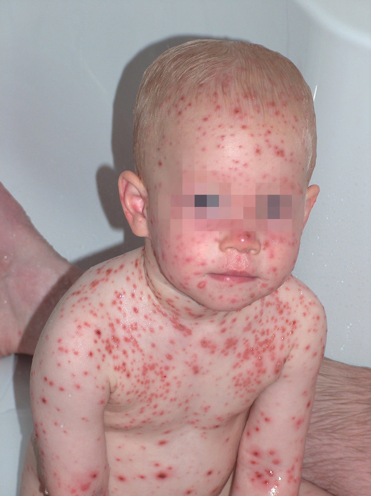

Chickenpox

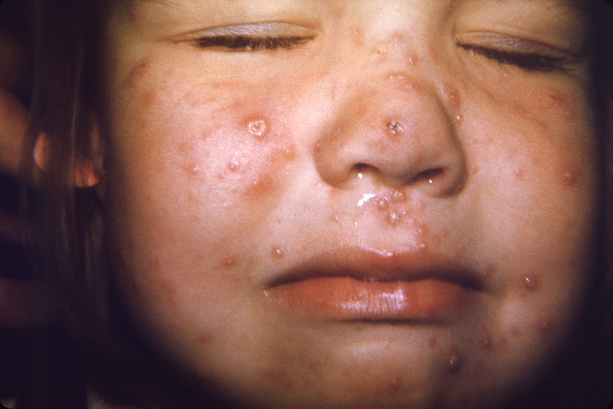

Facial rash in chickenpox

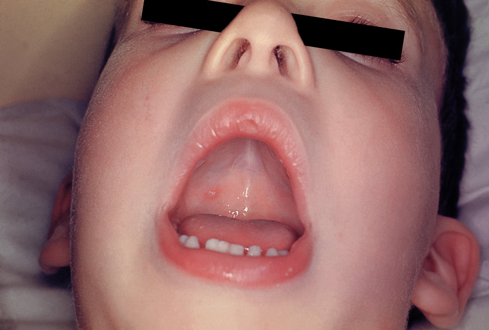

Enanthem of oral mucous membrane in chickenpox

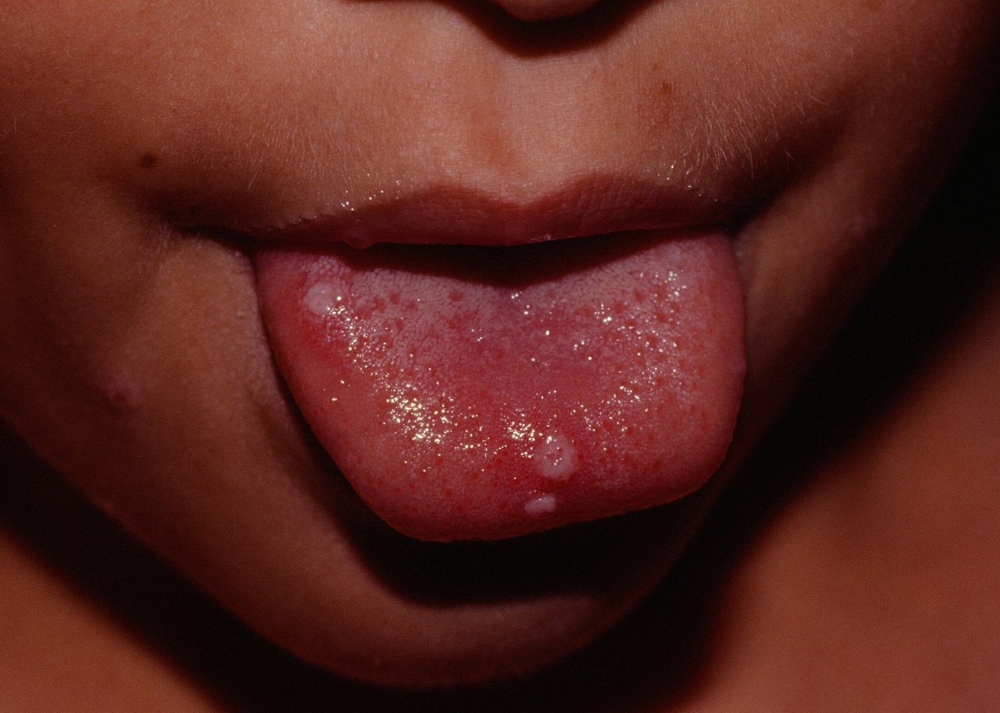

Aphthae

Chickenpox (varicella)

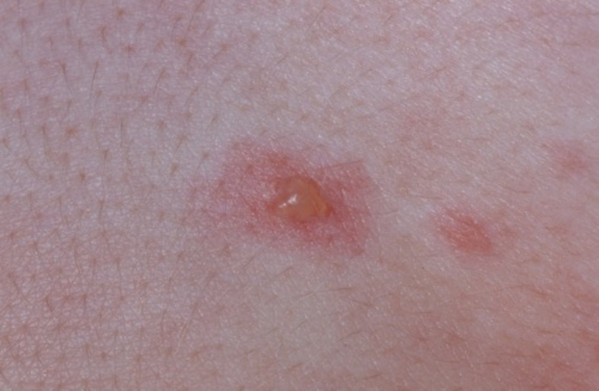

Chickenpox

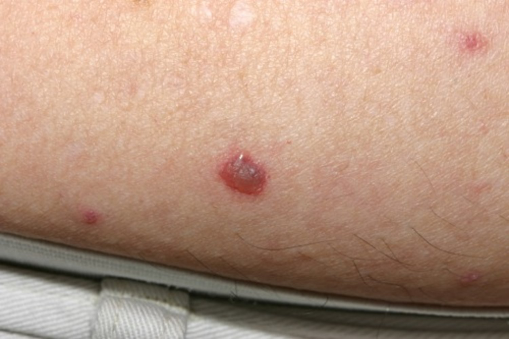

Chickenpox

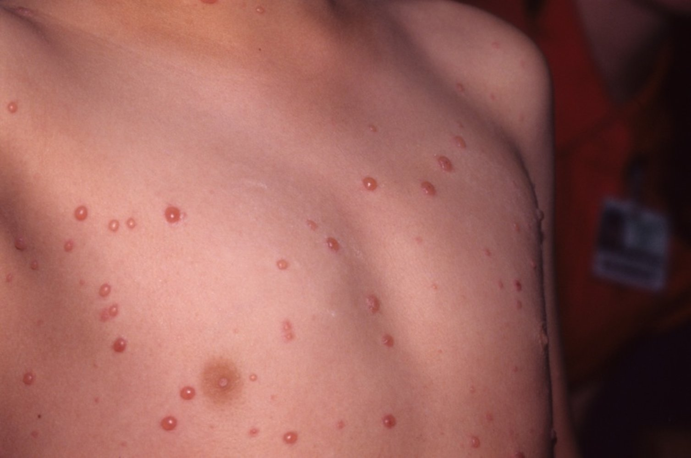

Chickenpox

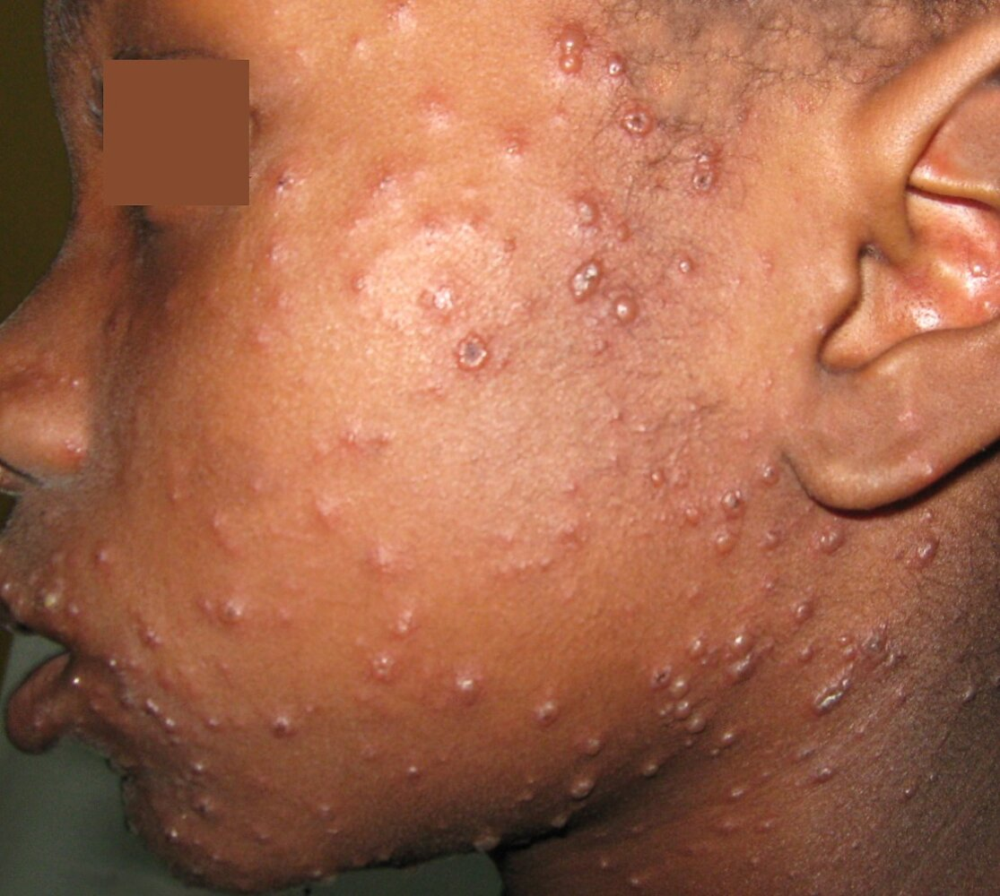

Chickenpox

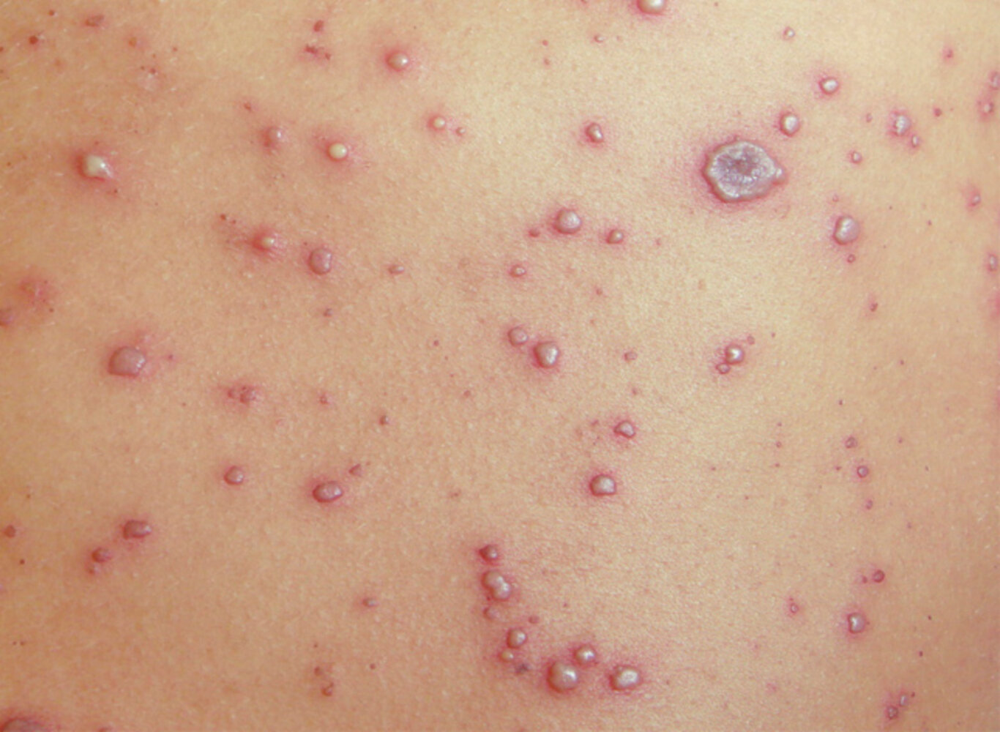

Varicella

---

## Diagnosis

### General principles

* Typically <u>diagnosed clinically</u> based on characteristic clinical features

* Confirmatory diagnostic studies are usually only considered in the following cases: [[2]](https://coursology-qbank.com/amboss/article/Ti16Ig0)[[15]](https://coursology-qbank.com/amboss/article/sn1tuh0)

* Suspected <u>VZV</u> infection in patients with no <u>rash</u> or uncharacteristic <u>rash</u>

* Vaccinated patients with suspected varicella

* Patients with <u>immunocompromised</u> contacts

* Additional studies may be required for patients with severe infections.

### Confirmatory studies [[15]](https://coursology-qbank.com/amboss/article/sn1tuh0)[[16]](https://coursology-qbank.com/amboss/article/tn1XEh0)

* <u>PCR</u> (preferred test for active infection): detects <u>VZV</u> <u>DNA</u>   [[2]](https://coursology-qbank.com/amboss/article/Ti16Ig0)[[17]](https://coursology-qbank.com/amboss/article/uibptt)[[18]](https://coursology-qbank.com/amboss/article/gi1FIg0)

* <u>Direct fluorescent antibody testing</u> on <u>vesicular</u> fluid

* <u>Serology</u> (<u>IgM</u> and <u>IgG</u> detection) can identify primary infection and <u>serologic immunity</u>.  [[3]](https://coursology-qbank.com/amboss/article/Ef18LT0)[[15]](https://coursology-qbank.com/amboss/article/sn1tuh0)[[17]](https://coursology-qbank.com/amboss/article/uibptt)

* Viral culture  [[7]](https://coursology-qbank.com/amboss/article/ei1xqg0)[[17]](https://coursology-qbank.com/amboss/article/uibptt)

* <u>Tzanck smear</u>: not specific for <u>VZV</u> (may also be positive in <u>HSV infections</u>)  [[19]](https://coursology-qbank.com/amboss/article/oi10sg0)

> [!TIP]
> Chickenpox is usually <u>diagnosed clinically</u>. Obtain laboratory testing in case of atypical <u>rash</u> or severe infections. [[2]](https://coursology-qbank.com/amboss/article/Ti16Ig0)

### Additional studies

Consider in severe <u>varicella zoster</u> infection, depending on clinical features.

* Bacterial <u>superinfection</u> of lesions: See “<u>Diagnostics for sepsis</u>" and "<u>Diagnostics for pediatric sepsis</u>."

* <u>Pneumonia</u> [[20]](https://coursology-qbank.com/amboss/article/3p1S630) 

* Chest imaging (CT or <u>x-ray chest</u>)

* Advanced studies: <u>PCR</u> of <u>bronchoalveolar lavage</u>, <u>biopsy</u> of <u>lung tissue</u>

* <u>Meningoencephalitis</u> [[21]](https://coursology-qbank.com/amboss/article/Sp1yK30)

* <u>PCR</u> of <u>CSF</u>

* <u>MRI</u> <u>brain</u> [[22]](https://coursology-qbank.com/amboss/article/hp1c630)

* <u>Thrombocytopenia</u>: <u>CBC</u>

> [!TIP]
> <u>Visceral</u> dissemination is more common in patients with <u>HIV</u>; consider <u>HIV testing</u> in patients with severe infection. [[23]](https://coursology-qbank.com/amboss/article/aicQJX0)

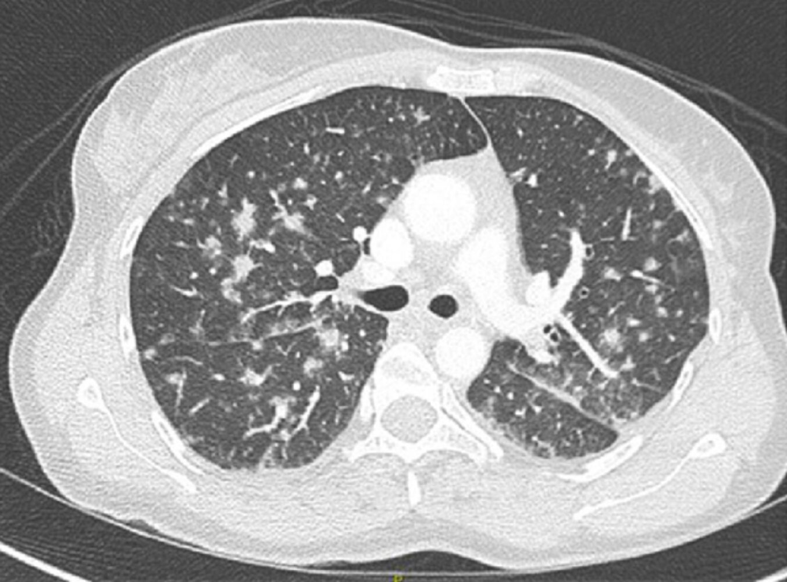

Multiple pulmonary nodules

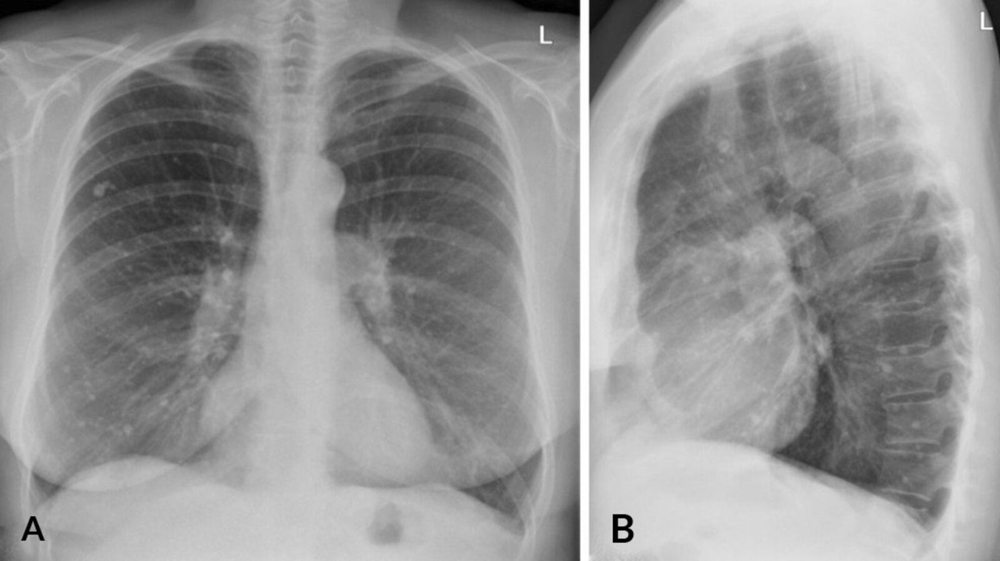

Multiple small calcified pulmonary nodules

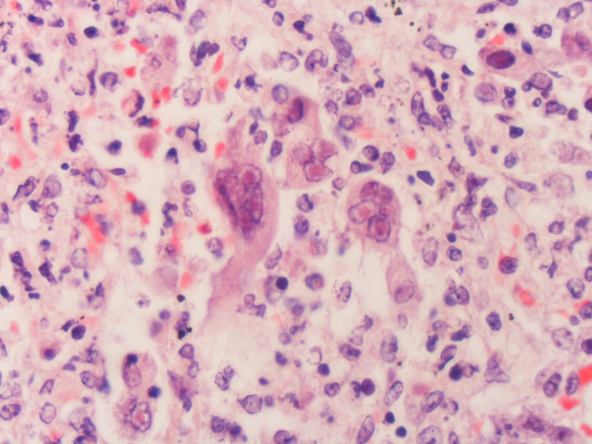

Multinucleated giant cells with Cowdry type A inclusions

---

## Differential diagnoses

Chickenpox may be confused with other conditions that involve widespread <u>vesicles</u> and/or crusting lesions, e.g.: [[3]](https://coursology-qbank.com/amboss/article/Ef18LT0)[[7]](https://coursology-qbank.com/amboss/article/ei1xqg0)

* Disseminated <u>herpes zoster</u> (i.e., <u>shingles</u>)

* <u>Herpes simplex virus</u>: disseminated <u>HSV</u>, <u>eczema herpeticum</u>

* <u>Enterovirus</u> infection: atypical <u>hand foot and mouth disease</u>  [[24]](https://coursology-qbank.com/amboss/article/Np1-p30)[[25]](https://coursology-qbank.com/amboss/article/mp1VJ30)

* Widespread <u>bullous impetigo</u>

* <u>Monkeypox</u>  [[7]](https://coursology-qbank.com/amboss/article/ei1xqg0)

* <u>Adverse reaction</u> to <u>smallpox</u> <u>vaccination</u>: <u>eczema</u> vaccinatum, disseminated vaccinia   [[7]](https://coursology-qbank.com/amboss/article/ei1xqg0)[[26]](https://coursology-qbank.com/amboss/article/5p1iJ30)[[27]](https://coursology-qbank.com/amboss/article/Xh19cg0)

* See also “<u>Infectious rashes in childhood</u>.”

Infectious rashes in children

Pediatric Rashes – Part 1: Diagnosis

The differential diagnoses listed here are not exhaustive.

---

## Treatment

### Approach [[2]](https://coursology-qbank.com/amboss/article/Ti16Ig0)

* Start supportive treatment for all patients.

* Assess for indications for <u>antiviral therapy</u> for varicella; if present, determine duration of symptoms.

* Symptom duration ≤ 72 hours: Initiate immediate <u>antiviral therapy</u>.   [[3]](https://coursology-qbank.com/amboss/article/Ef18LT0)

* Symptom duration > 72 hours: Consult with infectious diseases; <u>antiviral therapy</u> may be appropriate in <u>immunocompromised</u> patients because of prolonged viral replication. [[3]](https://coursology-qbank.com/amboss/article/Ef18LT0)

* Provide treatment for complications and <u>superinfections</u> (e.g., <u>treatment of pneumonia</u>, treatment of <u>skin and soft tissue infections</u>).

* Start measures to <u>prevent transmission of VZV</u>.

> [!TIP]
> Most otherwise healthy children < 13 years of age with chickenpox can be treated with symptomatic treatment alone, but advise caregivers to return in the event of prolonged or worsening symptoms and/or signs of secondary bacterial <u>skin infection</u>. [[2]](https://coursology-qbank.com/amboss/article/Ti16Ig0)

### Supportive treatment [[2]](https://coursology-qbank.com/amboss/article/Ti16Ig0)

* Treat <u>fever</u> and <u>pain</u> with <u>acetaminophen</u> (see “<u>Nonopioid oral analgesia in children</u>”).  [[2]](https://coursology-qbank.com/amboss/article/Ti16Ig0)

* <u>Pruritus</u> ;  [[28]](https://coursology-qbank.com/amboss/article/Ji1ssg0)

* General advice for caregivers

* Apply cool compresses.

* Take lukewarm oatmeal baths.

* Trim fingernails or wear mitts to prevent scratching.

* Medications

* Topical: <u>calamine lotion</u>, pramoxine gel [[28]](https://coursology-qbank.com/amboss/article/Ji1ssg0)

* Oral <u>antihistamines</u>

> [!WARNING]
> Avoid use of <u>aspirin</u> and other <u>salicylates</u> (e.g., <u>bismuth</u>-subsalicylate) in children with chickenpox because of the risk of <u>Reye syndrome</u>. [[3]](https://coursology-qbank.com/amboss/article/Ef18LT0)

> [!WARNING]
> Avoid topical <u>antihistamines</u> and <u>topical corticosteroids</u> in patients with chickenpox because of the risk of systemic absorption when applied to large areas of <u>skin</u>. [[29]](https://coursology-qbank.com/amboss/article/Sn1ysh0)

### Antiviral therapy for VZV infection (high-risk patients only)

* Indications for <u>antiviral therapy</u>

* <u>Severe VZV infection</u>

* <u>Risk factors for severe VZV infection</u>

* Recommended treatment: Begin <u>antiviral therapy</u> as soon as possible (ideally within 24 hours of <u>rash</u> onset). ;  [[3]](https://coursology-qbank.com/amboss/article/Ef18LT0)

* <u>Immunocompromised individuals</u>, <u>neonates</u>, and/or those with severe infection: IV <u>acyclovir</u> DOSAGE  [[2]](https://coursology-qbank.com/amboss/article/Ti16Ig0)[[3]](https://coursology-qbank.com/amboss/article/Ef18LT0)

* Immunocompetent individuals, individuals with nonsevere infection: oral <u>acyclovir</u> DOSAGE or <u>valacyclovir</u> DOSAGE [[3]](https://coursology-qbank.com/amboss/article/Ef18LT0)[[8]](https://coursology-qbank.com/amboss/article/Od1IJf0)[[30]](https://coursology-qbank.com/amboss/article/LMbw68)

> [!TIP]
> Patients with nonsevere infections and no <u>risk factors for severe VZV infection</u> do not require <u>antiviral therapy</u> and can be managed with supportive treatment only. [[2]](https://coursology-qbank.com/amboss/article/Ti16Ig0)

> [!WARNING]
> <u>Neonates</u>, <u>immunocompromised</u> patients, and patients with severe infection should not receive oral <u>acyclovir</u> because of poor oral <u>bioavailability</u>. [[3]](https://coursology-qbank.com/amboss/article/Ef18LT0)

---

## Complications

Adults have higher rates of complications from varicella compared to children. [[2]](https://coursology-qbank.com/amboss/article/Ti16Ig0)

### <u>Skin</u> [[3]](https://coursology-qbank.com/amboss/article/Ef18LT0)

* Bacterial <u>superinfection</u>;  (including <u>impetigo</u>, <u>phlegmon</u>, <u>necrotizing fasciitis</u>), which often leads to scarring and is managed with systemic <u>antibiotics</u>

* Reactivation of latent <u>VZV</u> results in <u>shingles</u> (<u>herpes zoster</u>).

* Scarring

### <u>Central nervous system</u>  [[3]](https://coursology-qbank.com/amboss/article/Ef18LT0)[[31]](https://coursology-qbank.com/amboss/article/Ep18r30)

* <u>Acute cerebellar ataxia</u>: good prognosis, mainly <u>self-limiting</u> after several weeks

* <u>Encephalitis</u> (very rare): cramps, <u>coma</u>, poor prognosis

### <u>Lungs</u> [[3]](https://coursology-qbank.com/amboss/article/Ef18LT0)

* <u>Pneumonia</u> (viral or bacterial)

### Fetus (chickenpox during <u>pregnancy</u>) [[3]](https://coursology-qbank.com/amboss/article/Ef18LT0)

* <u>Congenital varicella syndrome</u>

We list the most important complications. The selection is not exhaustive.

---

## Prognosis

* In healthy children, chickenpox infection generally has a benign course and heals without any consequences.

* Residual scarring may occur because of excessive scratching or bacterial <u>superinfection</u>.

* <u>Immunosuppressed</u> individuals are at a greater risk of the disease taking a generalized or even fatal course.

References:[[2]](https://coursology-qbank.com/amboss/article/Ti16Ig0)

---

## Prevention

### Approach

* Provide <u>primary prevention</u> against varicella infection.

* Ensure children receive <u>varicella vaccination</u> as part of the <u>routine immunization schedule</u>.

* Offer <u>catch-up vaccinations</u> to individuals without <u>evidence of VZV immunity</u>.

* For infected patients: Initiate measures to limit transmission.

* Tell patients to avoid school/work until all lesions have scabbed over and no new lesions appear.  [[3]](https://coursology-qbank.com/amboss/article/Ef18LT0)

* If hospitalized, start <u>infection control</u> measures to <u>prevent nosocomial spread of varicella</u>.

* If required by law, notify the health department for possible <u>contact tracing</u>.

* For close contacts:

* Assess for <u>evidence of VZV immunity</u>.

* Offer <u>postexposure prophylaxis for chickenpox</u> to individuals with no evidence of <u>immunity</u>.

> [!TIP]
> Most US states mandate reporting cases of chickenpox to local and/or state health departments. [[32]](https://coursology-qbank.com/amboss/article/YL1nwh0)

### Evidence of VZV immunity [[3]](https://coursology-qbank.com/amboss/article/Ef18LT0)[[8]](https://coursology-qbank.com/amboss/article/Od1IJf0)[[9]](https://coursology-qbank.com/amboss/article/GQ1Bxg0)

Any of the following constitutes <u>evidence of immunity to chickenpox</u>:  [[9]](https://coursology-qbank.com/amboss/article/GQ1Bxg0)[[33]](https://coursology-qbank.com/amboss/article/XL19wh0)

* Documentation of age-appropriate <u>varicella immunization</u>

* Laboratory findings that confirm prior wild-type disease or <u>serologic evidence of immunity</u> (see “<u>Diagnostics of chickenpox</u>”)

* Attestation of past varicella or <u>herpes zoster</u> infection by a <u>healthcare provider</u>

### Varicella vaccine [[34]](https://coursology-qbank.com/amboss/article/LWWwN40)[[35]](https://coursology-qbank.com/amboss/article/6WWjm40)[[36]](https://coursology-qbank.com/amboss/article/pWWLm40)

* General principles

* Consists of 2 doses of a <u>live attenuated vaccine</u>

* Available <u>vaccines</u> include:   [[3]](https://coursology-qbank.com/amboss/article/Ef18LT0)[[5]](https://coursology-qbank.com/amboss/article/Ki1Usg0)[[37]](https://coursology-qbank.com/amboss/article/1L129h0)

* A single-<u>antigen</u> <u>varicella vaccine</u>

* A combined <u>measles</u>, <u>mumps</u>, <u>rubella</u>, varicella (<u>MMRV</u>) <u>vaccine</u>   [[38]](https://coursology-qbank.com/amboss/article/551ikh0)

* Recommended for all individuals without <u>evidence of VZV immunity</u> who have no <u>contraindications to live vaccines</u>

* Schedule: See “<u>ACIP immunization schedule</u>” for details on routine and catch-up schedules.

* Adverse effects [[3]](https://coursology-qbank.com/amboss/article/Ef18LT0)

* Minor injection-site reaction and <u>fever</u>

* If <u>MMRV</u> is given at 12– 23 months of age: increased risk of <u>febrile seizures</u>

* <u>Vaccine-associated chickenpox rash</u>

* Future development of <u>shingles</u>  [[3]](https://coursology-qbank.com/amboss/article/Ef18LT0)

> [!TIP]
> Recommend the <u>varicella vaccine</u> to all nonimmune children and adults who do not have <u>contraindications to live vaccination</u>. [[37]](https://coursology-qbank.com/amboss/article/1L129h0)[[39]](https://coursology-qbank.com/amboss/article/S11yTf0)

### Postexposure prophylaxis for chickenpox [[4]](https://coursology-qbank.com/amboss/article/Xn197h0)[[9]](https://coursology-qbank.com/amboss/article/GQ1Bxg0)

#### General principles

* <u>Postexposure prophylaxis</u> is recommended for nonimmune individuals exposed to chickenpox or <u>shingles</u> to prevent disease onset or mitigate disease course.  [[3]](https://coursology-qbank.com/amboss/article/Ef18LT0)[[40]](https://coursology-qbank.com/amboss/article/iZXJY9)

* Eligibility is determined by assessing for <u>evidence of VZV immunity</u> and verifying exposure.

* High-risk interactions include:

* Indoor face-to-face contact with an infected individual for ≥ 5 minutes  [[3]](https://coursology-qbank.com/amboss/article/Ef18LT0)[[9]](https://coursology-qbank.com/amboss/article/GQ1Bxg0)

* Sharing a hospital room or living arrangements with an infected individual

* Active or <u>passive immunization</u> is given depending on <u>risk factors</u>.

* For patients who are ineligible for <u>active immunization</u> and cannot receive <u>passive immunization</u>: Consult infectious disease about possible <u>chemoprophylaxis</u>.  [[3]](https://coursology-qbank.com/amboss/article/Ef18LT0)

* <u>Passive immunization</u> may prolong the <u>incubation period</u> of <u>VZV</u>; monitor patients for 28 days following exposure. [[3]](https://coursology-qbank.com/amboss/article/Ef18LT0)[[41]](https://coursology-qbank.com/amboss/article/sQ1txg0)

* If symptoms develop following exposure, initiate <u>treatment for varicella infection</u> regardless of whether the patient received <u>postexposure prophylaxis</u>.

#### Determining <u>postexposure prophylaxis</u>

|  Recommended management [[3]](https://coursology-qbank.com/amboss/article/Ef18LT0)[[9]](https://coursology-qbank.com/amboss/article/GQ1Bxg0)[[41]](https://coursology-qbank.com/amboss/article/sQ1txg0)  |  |  |
| --- | --- | --- |
|  | <u>Evidence of VZV immunity</u> | No <u>evidence of VZV immunity</u> |
| Immunocompetent |  * <u>Postexposure prophylaxis</u> not recommended   |  * <u>Postexposure prophylaxis</u> required, usually with <u>active immunization</u>   |
| <u>Immunocompromised</u> |   * Prophylaxis only required for patients who have received a <u>bone marrow transplant</u>  [[9]](https://coursology-qbank.com/amboss/article/GQ1Bxg0)  * <u>Passive immunization</u> is recommended.    |  * <u>Postexposure prophylaxis</u> required, usually with <u>passive immunization</u>   |

#### <u>Active immunization</u>

* Indications: immunocompetent patients ≥ 12 months of age with no <u>evidence of VZV immunity</u> [[3]](https://coursology-qbank.com/amboss/article/Ef18LT0)

* Recommended prophylaxis

* <u>Chickenpox immunization</u>

* Give within 5 days following exposure (ideally within 3 days). [[9]](https://coursology-qbank.com/amboss/article/GQ1Bxg0)

* Follow-up <u>vaccination</u>: Complete the age-appropriate <u>vaccination</u> series per the <u>immunization schedule</u>.

> [!TIP]
> Prophylaxis is not recommended for healthy individuals who are either too young for <u>vaccination</u> or who were exposed to <u>VZV</u> > 5 days prior to evaluation. [[3]](https://coursology-qbank.com/amboss/article/Ef18LT0)

#### <u>Passive immunization</u>

* Indications

* Individuals with no <u>evidence of VZV immunity</u> who are: 

* <u>Immunocompromised</u>

* Pregnant

* Patients who have undergone <u>bone marrow transplantation</u>  [[9]](https://coursology-qbank.com/amboss/article/GQ1Bxg0)

* <u>Neonates</u>, if the mother was symptomatic 5 days before or up to 2 days after <u>birth</u>  [[3]](https://coursology-qbank.com/amboss/article/Ef18LT0)[[9]](https://coursology-qbank.com/amboss/article/GQ1Bxg0)

* Hospitalized premature babies if:

* Born < 28 weeks or with a <u>birth</u> weight ≤ 1 kg  [[41]](https://coursology-qbank.com/amboss/article/sQ1txg0)

* Born ≥ 28 weeks to a mother without <u>evidence of VZV immunity</u> [[41]](https://coursology-qbank.com/amboss/article/sQ1txg0)

* Recommended prophylaxis: Give as soon as possible within 10 days following exposure (ideally within 4 days). [[41]](https://coursology-qbank.com/amboss/article/sQ1txg0)

* Preferred: <u>varicella-zoster immune globulin</u> (VZIG) DOSAGE [[3]](https://coursology-qbank.com/amboss/article/Ef18LT0)[[41]](https://coursology-qbank.com/amboss/article/sQ1txg0)

* If <u>VZIG</u> is unavailable within 10 days postexposure: <u>intravenous immunoglobulin</u> (IVIG) DOSAGE   [[3]](https://coursology-qbank.com/amboss/article/Ef18LT0)

* Follow-up <u>vaccination</u>

* Recommended for all patients without <u>contraindications to live vaccination</u>.

* Give 5–8 months after <u>immunoglobulin</u> therapy.  [[42]](https://coursology-qbank.com/amboss/article/cL1a9h0)

### Controlling varicella transmission in healthcare settings [[43]](https://coursology-qbank.com/amboss/article/CdcqHY0)

* Place patients with chickenpox on contact and <u>airborne precautions</u> (see “<u>Infection prevention and control</u>”).  [[3]](https://coursology-qbank.com/amboss/article/Ef18LT0)

* All health care workers should have <u>evidence of immunity to chickenpox</u>.

* If a health care worker with no evidence of <u>immunity</u> is exposed, notify their supervisor and the occupational health department.  [[3]](https://coursology-qbank.com/amboss/article/Ef18LT0)

---