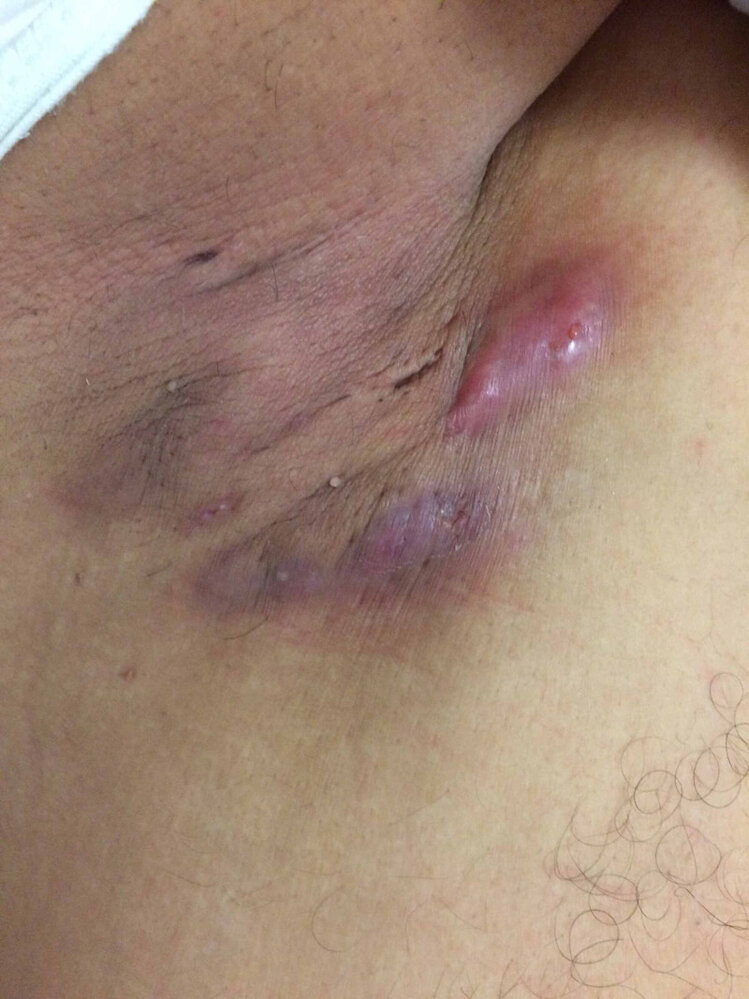
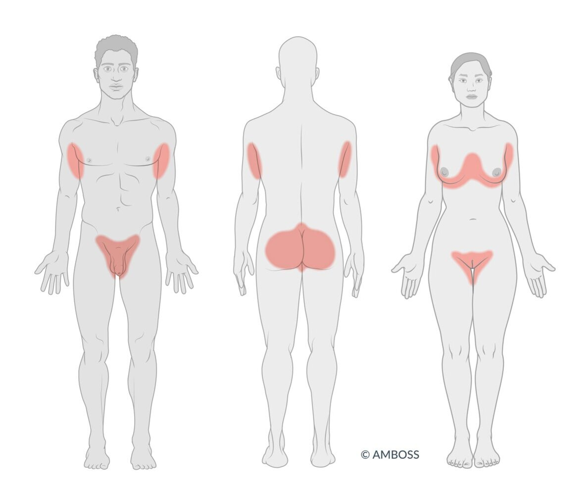
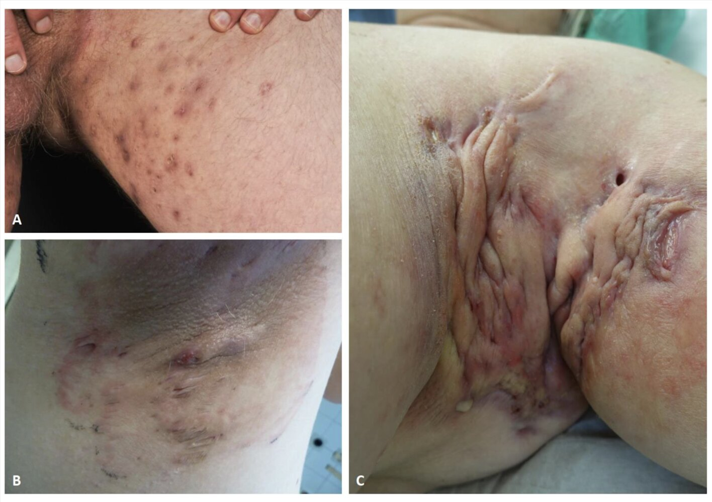

# Hidradenitis suppurativa

*Categories: Clinical knowledge > Dermatology > Localized disorders > Hidradenitis suppurativa*

[Original Article Link](https://coursology-qbank.com/amboss/article/k80m53)

---

## Summary

Hidradenitis suppurativa is a chronic inflammatory <u>skin</u> condition characterized by recurrent follicular inflammation, typically in the <u>intertriginous areas</u>. Manifestations include painful <u>skin</u> lesions (<u>nodules</u> and <u>abscesses</u>), <u>draining sinus</u> tracts, and scarring; the severity of symptoms varies. The disease typically affects young adults. The exact etiology is unknown but likely multifactorial and thought to involve blockage of <u>hair follicles</u>. Diagnosis is clinical and treatment includes <u>wound care</u>, <u>pain management</u>, and pharmacotherapy. Psychological support may be required for mental health conditions that can be associated with hidradenitis suppurativa. Surgical interventions may be needed for severe and/or recurrent disease. Complications include disfigurement resulting from excessive scarring, bacterial <u>superinfection</u>, and, in affected areas, <u>cutaneous squamous cell carcinoma</u>.

---

## Epidemiology

* <u>Prevalence</u>: 0.1–2%

* Average age of onset: 18–39 years

* More common in:

* Women

* Individuals of African descent

* Individuals with a <u>family history</u> of hidradenitis suppurativa

Epidemiological data refers to the US, unless otherwise specified.

---

## Etiology

The exact etiology of hidradenitis suppurativa is unknown, but the following factors may contribute to the development and/or severity of the disease: [[2]](https://coursology-qbank.com/amboss/article/Bi1zFg0)[[3]](https://coursology-qbank.com/amboss/article/mQ1V9g0)[[4]](https://coursology-qbank.com/amboss/article/7OW4Fl0)

* Genetic predisposition to:

* Dysregulation of signaling pathways that promote follicular hyperkeratinization

* Dysregulation of the <u>immune system</u> → elevated levels of <u>proinflammatory cytokines</u>

* Hormonal imbalances

* Environmental factors

* <u>Tobacco smoking</u>

* <u>Obesity</u>

* Bacterial <u>colonization</u> of <u>hair follicles</u> [[5]](https://coursology-qbank.com/amboss/article/qnWC8N0)

* Use of certain medications (e.g., <u>lithium</u>, <u>levonorgestrel</u>) [[6]](https://coursology-qbank.com/amboss/article/LlWwxl0)

---

## Clinical features

* Localized in <u>intertriginous areas</u> containing <u>apocrine glands</u> (most commonly the <u>axillae</u>, groin, inner thigh, perineal and perianal areas)

* The first lesion is usually a solitary painful inflammatory <u>nodule</u> that progresses to an <u>abscess</u> that may open or regress spontaneously.

* Sinus tracts may form between multiple recurrent <u>nodules</u> and drain foul-smelling, seropurulent discharge.

* Development of open ;   and <u>closed comedones</u>

* Scarring ranges from small, individual acneiform scars to thick scarred <u>plaques</u> that affect larger areas of <u>skin</u>.

Hidradenitis suppurativa (acne inversa)

Most common sites of hidradenitis suppurativa

Hidradenitis suppurativa

---

## Diagnosis

Diagnosis is clinical, based on both of the following. [[2]](https://coursology-qbank.com/amboss/article/Bi1zFg0)[[3]](https://coursology-qbank.com/amboss/article/mQ1V9g0)[[4]](https://coursology-qbank.com/amboss/article/7OW4Fl0)

* <u>Clinical features of hidradenitis suppurativa</u>, including:

* Characteristic <u>skin</u> findings

* Involvement of <u>intertriginous areas</u>

* Recurrent symptoms

* Exclusion of <u>differential diagnoses for hidradenitis suppurativa</u>; studies may include:

* <u>Bacterial culture</u> (if the patient has a <u>fever</u> and/or signs of <u>cellulitis</u>)  [[2]](https://coursology-qbank.com/amboss/article/Bi1zFg0)[[3]](https://coursology-qbank.com/amboss/article/mQ1V9g0)

* <u>Skin biopsy</u> (to differentiate from similar lesions seen in other conditions)  [[3]](https://coursology-qbank.com/amboss/article/mQ1V9g0)

---

## Differential diagnoses

* <u>Severe acne</u> vulgaris (i.e., <u>acne conglobata</u>)

* Primary <u>skin and soft tissue infections</u>: e.g., <u>folliculitis</u>, bacterial <u>abscess</u>

* Other conditions with <u>skin</u> lesions that affect the genitourinary region, e.g.:

* <u>Granuloma inguinale</u>

* <u>Pyoderma gangrenosum</u>

* <u>Lymphogranuloma venereum</u>

* <u>Pilonidal cyst</u>

The differential diagnoses listed here are not exhaustive.

---

## Treatment

### General principles [[2]](https://coursology-qbank.com/amboss/article/Bi1zFg0)[[3]](https://coursology-qbank.com/amboss/article/mQ1V9g0)[[4]](https://coursology-qbank.com/amboss/article/7OW4Fl0)

Hidradenitis suppurativa is a chronic condition with no cure and requires <u>chronic disease management</u>.

* Provide <u>supportive care</u>, including <u>pain management</u>.

* Screen for and manage <u>hidradenitis suppurativa-associated comorbidities</u>.

* Initiate first-line pharmacological therapies, which may include:

* Topical or intralesional therapies

* Systemic therapies (e.g., oral <u>antibiotics</u>, hormonal therapy)

* Refer patients with moderate, severe, or refractory disease to dermatology for management.  [[4]](https://coursology-qbank.com/amboss/article/7OW4Fl0)

### <u>Supportive care</u> [[2]](https://coursology-qbank.com/amboss/article/Bi1zFg0)[[3]](https://coursology-qbank.com/amboss/article/mQ1V9g0)[[7]](https://coursology-qbank.com/amboss/article/yi1d8g0)

* Patient education on disease process and management

* Recommend <u>smoking cessation</u> if relevant.  [[2]](https://coursology-qbank.com/amboss/article/Bi1zFg0)[[4]](https://coursology-qbank.com/amboss/article/7OW4Fl0)

* <u>Wound care</u>

* Warm compresses

* Cover <u>open wounds</u>.

* Discuss ways to improve physical comfort, e.g., wearing loose-fitting clothes.

* <u>Pain management</u>

* Optimize control of disease.

* Consider multimodal approaches with <u>nonpharmacological analgesia</u>.

* According to the <u>WHO analgesic ladder</u>, consider: [[4]](https://coursology-qbank.com/amboss/article/7OW4Fl0)

* <u>Topical analgesia</u> (e.g., <u>lidocaine</u>)

* <u>Nonopioid analgesics</u> (e.g., <u>NSAIDs</u>, <u>acetaminophen</u>)

* <u>Opioid analgesics</u> in certain patients with severe <u>pain</u>, for a limited duration

### Hidradenitis suppurativa-associated comorbidities [[2]](https://coursology-qbank.com/amboss/article/Bi1zFg0)[[3]](https://coursology-qbank.com/amboss/article/mQ1V9g0)[[4]](https://coursology-qbank.com/amboss/article/7OW4Fl0)

Screen for and manage the following conditions that commonly co-occur with hidradenitis suppurativa:

* <u>Metabolic syndrome</u> and its components

* <u>Obesity</u>

* <u>Diabetes mellitus type 2</u>

* <u>Hypertension</u>

* <u>Dyslipidemia</u>

* <u>Polycystic ovarian syndrome</u>

* Immune-mediated conditions

* <u>Inflammatory bowel disease</u>

* Inflammatory <u>arthropathies</u>

* Mental health conditions 

* E.g., <u>major depressive disorder</u>, <u>suicidal thoughts</u> or behavior, <u>anxiety disorders</u>

* May result from social isolation and reduced quality of life due to malodorous discharge, <u>pain</u>, and/or disfigurement

* <u>Sexual dysfunction</u>

* <u>Squamous cell carcinoma</u>: may occur in areas affected by hidradenitis suppurativa, especially on the <u>perineum</u> and buttocks

> [!TIP]
> Recommend weight reduction to patients with <u>obesity</u>, as it may improve the severity of disease. [[2]](https://coursology-qbank.com/amboss/article/Bi1zFg0)

> [!TIP]
> <u>Pain</u>, malodorous drainage, and scarring often negatively impact the patient's quality of life. [[3]](https://coursology-qbank.com/amboss/article/mQ1V9g0)[[4]](https://coursology-qbank.com/amboss/article/7OW4Fl0)

### Pharmacological therapy [[2]](https://coursology-qbank.com/amboss/article/Bi1zFg0)[[3]](https://coursology-qbank.com/amboss/article/mQ1V9g0)[[7]](https://coursology-qbank.com/amboss/article/yi1d8g0)

Treatment may include different combinations of the following, depending on the severity of disease:

#### Localized therapies

* Topical <u>antibiotics</u>: e.g., <u>clindamycin</u>, <u>dapsone</u>

* Topical resorcinol

* Intralesional <u>triamcinolone</u>

* <u>Antiseptic</u> washes: e.g., <u>chlorhexidine</u>, <u>benzoyl peroxide</u>, <u>zinc</u> pyrithione

#### Systemic therapies

* Oral <u>antibiotics</u>: e.g., <u>tetracyclines</u>, <u>clindamycin</u> PLUS <u>rifampin</u>, <u>dapsone</u>

* Hormonal therapies: e.g., <u>spironolactone</u>, <u>combined oral contraceptives</u>, <u>metformin</u>  [[7]](https://coursology-qbank.com/amboss/article/yi1d8g0)

* Oral <u>retinoids</u> (limited <u>efficacy</u>): e.g., acitretin, <u>isotretinoin</u>   [[7]](https://coursology-qbank.com/amboss/article/yi1d8g0)

* Oral <u>biologics</u>: e.g., <u>TNF inhibitors</u> (<u>adalimumab</u> or <u>infliximab</u>), <u>anakinra</u>

* <u>Immunosuppressants</u>   [[7]](https://coursology-qbank.com/amboss/article/yi1d8g0)

### Procedural interventions [[2]](https://coursology-qbank.com/amboss/article/Bi1zFg0)[[3]](https://coursology-qbank.com/amboss/article/mQ1V9g0)[[4]](https://coursology-qbank.com/amboss/article/7OW4Fl0)

For lesions refractory to pharmacological therapy, any of the following may be performed:

#### Acute lesions

* <u>Incision and drainage</u> of <u>abscesses</u>

* Punch <u>debridement</u> of small lesions   [[2]](https://coursology-qbank.com/amboss/article/Bi1zFg0)

#### Chronic lesions

* Deroofing of recurrent <u>nodules</u>, <u>abscesses</u>, and sinus tracts   [[2]](https://coursology-qbank.com/amboss/article/Bi1zFg0)[[8]](https://coursology-qbank.com/amboss/article/rnWfuN0)

* <u>Wide local excision</u> with <u>skin grafts</u> for extensive, chronic disease and scarring

* Laser therapy (e.g., Nd:YAG laser, CO2 laser)

---

## Complications

* Excessive scarring, which may lead to:

* <u>Contractures</u> [[3]](https://coursology-qbank.com/amboss/article/mQ1V9g0)

* <u>Lymphedema</u> as a result of lymphatic obstruction (rare): typically affects the anogenital region [[9]](https://coursology-qbank.com/amboss/article/MQ1M9g0)

* Bacterial <u>superinfection</u> [[2]](https://coursology-qbank.com/amboss/article/Bi1zFg0)[[3]](https://coursology-qbank.com/amboss/article/mQ1V9g0)

* <u>Squamous cell carcinoma</u> [[2]](https://coursology-qbank.com/amboss/article/Bi1zFg0)

We list the most important complications. The selection is not exhaustive.

---

## Prognosis

* Chronic with a high rate of recurrence [[4]](https://coursology-qbank.com/amboss/article/7OW4Fl0)[[10]](https://coursology-qbank.com/amboss/article/5OWiGl0)

* Decreases quality of life [[10]](https://coursology-qbank.com/amboss/article/5OWiGl0)

---