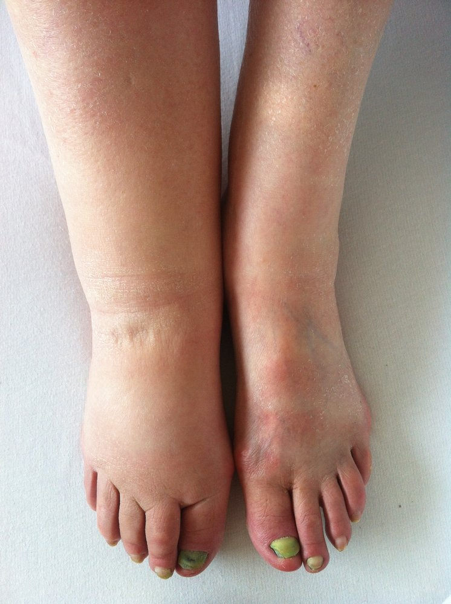

# Lymphedema

*Categories: Clinical knowledge > Dermatology > Localized disorders > Lymphedema*

[Original Article Link](https://coursology-qbank.com/amboss/article/eu0xJ3)

---

## Summary

Lymphedema is the abnormal accumulation of <u>lymph</u> in the <u>interstitium</u>. It is a progressive and chronic condition caused by compromised lymphatic vessels or <u>lymph nodes</u>, resulting in <u>edema</u> and subcutaneous fibroadipose deposition. Primary lymphedema is rare and results from congenital abnormalities in lymphatic development; it is a characteristic clinical feature of <u>Turner syndrome</u>. Secondary lymphedema is more common than primary lymphedema and is caused by damage to <u>the lymphatic system</u>, e.g., due to tumors, <u>surgery</u>, infection, or <u>radiation therapy</u>. Lymphedema manifests with progressive limb swelling, <u>skin</u> changes, and recurrent <u>skin and soft tissue infections</u>. Diagnosis is primarily clinical; <u>lymphoscintigraphy</u> may be performed if there is diagnostic uncertainty. Management involves <u>manual lymphatic drainage</u>, compression, exercise, and skincare. <u>Surgery</u> may be considered if <u>conservative management</u> is unsuccessful.

---

## Definitions

Lymphedema is the abnormal accumulation of highly viscous lipid-rich and protein-rich <u>lymph</u> in the <u>interstitium</u> due to compromised lymphatic vessels or <u>lymph nodes</u>.

---

## Etiology

* Primary lymphedema:  (rare): <u>idiopathic</u>, resulting from congenital abnormalities in lymphatic vessels, e.g., in <u>Turner syndrome</u>

* Secondary lymphedema: caused by damage to <u>the lymphatic system</u> [[1]](https://coursology-qbank.com/amboss/article/IUdYe60)[[2]](https://coursology-qbank.com/amboss/article/82dOj60)

* Tumors

* <u>Surgery</u>

* Inflammation

* Trauma

* <u>Radiation therapy</u>

* Infections, e.g.:

* Recurrent <u>erysipelas</u>

* <u>Leprosy</u>

* <u>Syphilis</u>

* <u>Granuloma inguinale</u>

* <u>Lymphatic filariasis</u>

* <u>Chronic venous insufficiency</u>  [[2]](https://coursology-qbank.com/amboss/article/82dOj60)

* <u>BMI</u> > 50 kg/m2  [[3]](https://coursology-qbank.com/amboss/article/o2d0i60)

> [!TIP]
> Inguinal or axillary <u>lymph node</u> injury is the most significant <u>risk factor</u> for lymphedema. [[1]](https://coursology-qbank.com/amboss/article/IUdYe60)

---

## Clinical features

### Typical features [[1]](https://coursology-qbank.com/amboss/article/IUdYe60)

* Onset of secondary lymphedema: typically 12–18 months after damage to <u>the lymphatic system</u> [[1]](https://coursology-qbank.com/amboss/article/IUdYe60)

* Painless unilateral or bilateral swelling of limbs (pitting in early stages and nonpitting in later stages)

* Swelling of toes and <u>dorsal</u> feet with deep <u>flexion</u> creases

* Stemmer sign: inability to lift and pinch thickened <u>skin</u> at the base of the second toe [[4]](https://coursology-qbank.com/amboss/article/6Tdj760)

* <u>Hyperkeratosis</u> (brawny induration)

* Lymphorrhea: leaking of <u>lymph</u> through the <u>skin</u>

* Absence of cutaneous <u>ulceration</u>

> [!TIP]
> Lymphedema involves the toes, unlike venous <u>edema</u>, which typically spares the toes.

> [!NOTE]
> Severe chronic lymphedema can result in <u>elephantiasis</u>.

Lymphedema following hysterectomy

### Clinical features by stage [[5]](https://coursology-qbank.com/amboss/article/L2dwR60)[[6]](https://coursology-qbank.com/amboss/article/sUdte60)

* Stage 0 (latent stage): reduced capacity of lymphatic vessels, no swelling

* Stage I: reversible <u>pitting edema</u>

* Stage II: gradual <u>fibrosis</u>, irreversible pitting or <u>nonpitting edema</u>  [[1]](https://coursology-qbank.com/amboss/article/IUdYe60)

* Stage III: hardened <u>fibrotic</u> <u>skin</u>, <u>nonpitting edema</u>

---

## Management

Treatment of the underlying cause and <u>conservative management</u> are indicated for all patients with lymphedema.

### <u>Conservative management</u> [[2]](https://coursology-qbank.com/amboss/article/82dOj60)[[5]](https://coursology-qbank.com/amboss/article/L2dwR60)

The following exercises and techniques can be trialed individually or combined as part of complete decongestive therapy.

* Manual lymphatic drainage: a form of massage that is applied in the direction of the <u>heart</u> to increase the natural drainage of <u>lymph</u>

* Compression garments, e.g., multilayer <u>compression stockings</u> (applied by a specialist)

* Elevation of the involved limb

* Muscle pumping exercises, e.g., walking rather than taking escalators

* Sequential pneumatic compression  [[2]](https://coursology-qbank.com/amboss/article/82dOj60)[[8]](https://coursology-qbank.com/amboss/article/u2dpj60)

* Skincare, e.g.:

* Cleansing and use of <u>emollients</u> to prevent and identify infection

* Treatment of <u>lymph</u> stasis-related <u>skin and soft tissue infections</u>

> [!WARNING]
> Multilayer compressive bandages for lymphedema should be applied by a trained professional (e.g., a physiotherapist or clinical lymphologist) as they can be harmful or ineffective when applied incorrectly. [[5]](https://coursology-qbank.com/amboss/article/L2dwR60)

### <u>Surgery</u> [[5]](https://coursology-qbank.com/amboss/article/L2dwR60)[[6]](https://coursology-qbank.com/amboss/article/sUdte60)

If <u>conservative management</u> is unsuccessful, refer for surgical evaluation.

* Removal of deposited fibroadipose tissue and fluid, e.g.:

* Excision

* <u>Liposuction</u>

* Lymphovenous <u>bypass surgery</u>

* Vascularized <u>lymph node</u> transfer

---