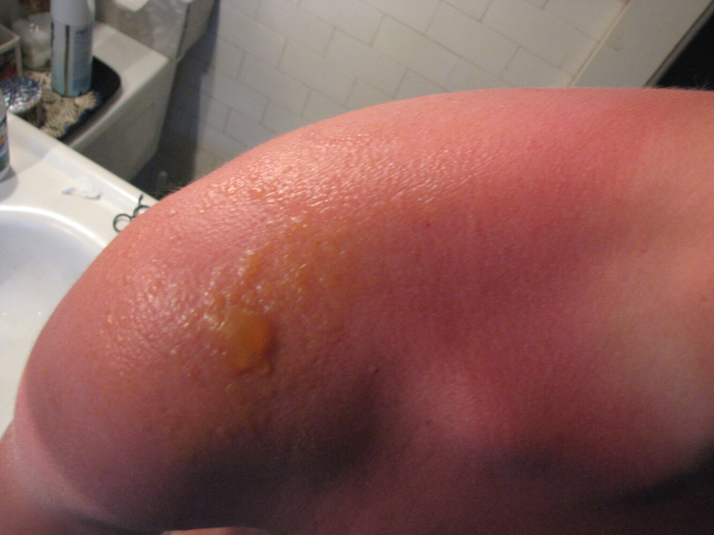

# Sunburn

*Categories: Clinical knowledge > Dermatology > Localized disorders > Sunburn*

[Original Article Link](https://coursology-qbank.com/amboss/article/jF0_33)

---

## Summary

Sunburn is an acute <u>self-limited</u> inflammatory <u>skin</u> reaction that occurs after excessive ultraviolet radiation (UVR) exposure and typically manifests as a <u>first-degree burn</u>. It more commonly affects individuals with light <u>skin</u> than those with darker <u>skin</u>. Most sunburns are <u>superficial</u>, manifesting with redness, <u>pain</u>, <u>pruritus</u>, and swelling that begins a few hours after exposure and typically resolves within 1 week. Diagnosis is based on <u>skin examination</u>, recent UVR exposure, and the exclusion of differential diagnoses using clinical history. Management primarily involves symptomatic <u>treatment of pain</u> and <u>pruritus</u> with topical ointments, oatmeal baths, and moisturizers (e.g., <u>petroleum jelly</u>). <u>Analgesics</u> and <u>antihistamines</u> may be used as needed for persistent <u>pain</u> and <u>pruritus</u>. The use of <u>photoprotective measures</u> should be recommended to all individuals to prevent sunburn and chronic complications of UVR exposure.

---

## Etiology

Sunburn is most commonly caused by <u>ultraviolet B</u> (<u>UVB</u>) radiation.  [[5]](https://coursology-qbank.com/amboss/article/kIYm1q)[[6]](https://coursology-qbank.com/amboss/article/8ZWOWP0)

### Risk factors for sunburn [[3]](https://coursology-qbank.com/amboss/article/0v1eAi0)

* Individuals who are sensitive to UV radiation, e.g. those with: [[7]](https://coursology-qbank.com/amboss/article/VcWGY40)

* Light <u>skin</u> tones  [[5]](https://coursology-qbank.com/amboss/article/kIYm1q)[[6]](https://coursology-qbank.com/amboss/article/8ZWOWP0)

* History of sunburn within 1 hour of exposure to UVR

* History of <u>photodermatoses</u>

* Nonadherence to <u>photoprotective measures</u>

* Use of indoor tanning beds or tanning products  [[3]](https://coursology-qbank.com/amboss/article/0v1eAi0)

* Extensive time spent outdoors for work or recreation  [[7]](https://coursology-qbank.com/amboss/article/VcWGY40)

---

## Pathophysiology

UV radiation → <u>DNA</u> mutations → <u>apoptosis</u> of <u>keratinocytes</u> in the <u>epidermis</u> and release of <u>inflammatory markers</u> (including <u>chemokines</u>, <u>prostaglandins</u>) → inflammation of the <u>dermis</u> hours after exposure [[8]](https://coursology-qbank.com/amboss/article/OgWIvk0)

---

## Clinical features

* The following typically manifest 4–12 hours after UVR exposure: [[5]](https://coursology-qbank.com/amboss/article/kIYm1q)[[7]](https://coursology-qbank.com/amboss/article/VcWGY40)

* <u>Erythema</u>

* <u>Pruritus</u>

* Tenderness

* Swelling

* Blanching

* Warmth

* Features of severe sunburn may also be present and include: [[7]](https://coursology-qbank.com/amboss/article/VcWGY40)[[9]](https://coursology-qbank.com/amboss/article/h51cPh0)

* Systemic symptoms: e.g., <u>headache</u>, <u>fever</u>, <u>nausea</u>, fatigue, <u>dehydration</u>

* Weeping, wet <u>skin</u>

* <u>Blisters</u> with clear fluid

* Peak severity is usually 24–36 hours after exposure. [[5]](https://coursology-qbank.com/amboss/article/kIYm1q)

* Resolution typically occurs within 3–8 days; characterized by dry, <u>hyperpigmented</u> <u>skin</u> that easily peels. [[4]](https://coursology-qbank.com/amboss/article/vZWAWP0)[[10]](https://coursology-qbank.com/amboss/article/CYWqrP0)

> [!TIP]
> Individuals may also develop <u>photokeratitis</u> if the eyes are exposed to UVR. [[11]](https://coursology-qbank.com/amboss/article/ngW7Dk0)

First-degree burn (superficial burn)

Severe sunburn

---

## Management

### General principles [[4]](https://coursology-qbank.com/amboss/article/vZWAWP0)[[10]](https://coursology-qbank.com/amboss/article/CYWqrP0)

* Sunburn is typically managed with supportive therapy in the outpatient setting.

* Further sun exposure should be avoided.

* Clean, loose cotton clothing can protect the <u>skin</u> while it heals. [[13]](https://coursology-qbank.com/amboss/article/pD1L2Q0)

* <u>Sunburn with severe features</u> may require:

* Dressings and topical <u>antiseptic</u> ointment for <u>blisters</u>

* <u>Treatment of dehydration</u>

* See “<u>Treatment of burns</u>” for details.

* To reduce the risk of recurrence, educate patients on <u>prevention of sunburn</u>.

> [!TIP]
> <u>Blisters</u> should be left intact to reduce the risk of infection. [[7]](https://coursology-qbank.com/amboss/article/VcWGY40)

### Supportive therapy [[4]](https://coursology-qbank.com/amboss/article/vZWAWP0)[[7]](https://coursology-qbank.com/amboss/article/VcWGY40)[[10]](https://coursology-qbank.com/amboss/article/CYWqrP0)

* Encourage oral hydration to compensate for excessive fluid loss.  [[10]](https://coursology-qbank.com/amboss/article/CYWqrP0)[[13]](https://coursology-qbank.com/amboss/article/pD1L2Q0)

* For <u>pain</u> and <u>pruritus</u> [[4]](https://coursology-qbank.com/amboss/article/vZWAWP0)[[7]](https://coursology-qbank.com/amboss/article/VcWGY40)

* Oatmeal baths

* Moisturizers (e.g., coconut oil, <u>petroleum jelly</u>, lotions); can be refrigerated before use to increase relief [[7]](https://coursology-qbank.com/amboss/article/VcWGY40)

* Cooling ointments (e.g., aloe vera)

* Wet gauze or a cool cloth

* If symptoms do not improve, consider adding the following: [[4]](https://coursology-qbank.com/amboss/article/vZWAWP0)

* For persistent <u>pain</u>: <u>oral analgesics</u> (e.g., <u>NSAIDs</u>)   [[7]](https://coursology-qbank.com/amboss/article/VcWGY40)[[14]](https://coursology-qbank.com/amboss/article/6gWjwk0)

* For intense <u>pruritus</u>: oral <u>antihistamines</u>   [[4]](https://coursology-qbank.com/amboss/article/vZWAWP0)

* <u>Topical steroids</u> are widely used to treat sunburn; however, there is a lack of evidence supporting their use. [[15]](https://coursology-qbank.com/amboss/article/B8azKm)

> [!WARNING]
> Do not use very cold wet dressings or ice to cool sunburn; ice causes <u>vasoconstriction</u> of <u>blood vessels</u> in the <u>dermis</u>, which can damage the tissue further. [[4]](https://coursology-qbank.com/amboss/article/vZWAWP0)

> [!WARNING]
> Avoid using moisturizers and cooling ointments on broken <u>skin</u> (e.g., open <u>blisters</u>). [[10]](https://coursology-qbank.com/amboss/article/CYWqrP0)

---

## Complications

### <u>Skin</u> conditions [[6]](https://coursology-qbank.com/amboss/article/8ZWOWP0)

* <u>Common acquired melanocytic nevi</u> [[16]](https://coursology-qbank.com/amboss/article/eaWxjP0)

* <u>Precancerous skin lesions</u> (e.g., <u>actinic keratoses</u>) [[6]](https://coursology-qbank.com/amboss/article/8ZWOWP0)

* <u>Aging changes in the skin</u> (e.g., <u>wrinkles</u>, <u>solar lentigines</u>) [[5]](https://coursology-qbank.com/amboss/article/kIYm1q)[[7]](https://coursology-qbank.com/amboss/article/VcWGY40)[[10]](https://coursology-qbank.com/amboss/article/CYWqrP0)

* <u>Malignancy</u> (<u>melanoma</u> and <u>nonmelanoma skin cancers</u>) [[5]](https://coursology-qbank.com/amboss/article/kIYm1q)[[7]](https://coursology-qbank.com/amboss/article/VcWGY40)

* <u>Herpes labialis</u>  [[11]](https://coursology-qbank.com/amboss/article/ngW7Dk0)[[16]](https://coursology-qbank.com/amboss/article/eaWxjP0)

> [!WARNING]
> One sunburn during childhood doubles the risk of <u>melanoma</u> as an adult. [[16]](https://coursology-qbank.com/amboss/article/eaWxjP0)

### Ocular conditions [[11]](https://coursology-qbank.com/amboss/article/ngW7Dk0)

* <u>Cataracts</u>

* Blindness caused by chronic conditions, i.e.:

* <u>Macular degeneration</u>

* <u>Pterygium</u>

We list the most important complications. The selection is not exhaustive.

---

## Prevention

### General principles

* All individuals, regardless of age or <u>skin</u> tone, should combine the following photoprotective measures to reduce the risk of sunburn: [[3]](https://coursology-qbank.com/amboss/article/0v1eAi0)[[7]](https://coursology-qbank.com/amboss/article/VcWGY40)[[16]](https://coursology-qbank.com/amboss/article/eaWxjP0)

* Sun avoidance when possible

* Protective clothing

* Sunscreen

* Children, especially those < 3 years of age, are at increased risk for sunburn compared to adults.  [[7]](https://coursology-qbank.com/amboss/article/VcWGY40)[[16]](https://coursology-qbank.com/amboss/article/eaWxjP0)[[17]](https://coursology-qbank.com/amboss/article/Vv1G_i0)

* Ensure <u>photoprotective measures</u> are strictly adhered to.

* Advise caregivers that <u>blistering</u> sunburn in children < 18 years of age is associated with an increased lifetime risk of <u>melanoma</u>.

* <u>Infants</u> < 6 months of age may experience adverse effects from sunscreen ingredients; sun avoidance is the primary photoprotective strategy in this age group.  [[3]](https://coursology-qbank.com/amboss/article/0v1eAi0)[[8]](https://coursology-qbank.com/amboss/article/OgWIvk0)[[16]](https://coursology-qbank.com/amboss/article/eaWxjP0)

> [!WARNING]
> Indoor tanning is associated with an increased risk of <u>melanoma</u>; individuals should be strongly counseled against it. [[16]](https://coursology-qbank.com/amboss/article/eaWxjP0)[[17]](https://coursology-qbank.com/amboss/article/Vv1G_i0)

### Sun avoidance [[4]](https://coursology-qbank.com/amboss/article/vZWAWP0)[[7]](https://coursology-qbank.com/amboss/article/VcWGY40)

* Avoid sun exposure from 10 am to 4 pm.  [[4]](https://coursology-qbank.com/amboss/article/vZWAWP0)[[7]](https://coursology-qbank.com/amboss/article/VcWGY40)

* Seek shade often (e.g., use umbrellas, stroller canopies).

> [!WARNING]
> Do not recommend sun exposure to <u>prevent vitamin D deficiency</u>; a healthy diet and/or oral supplements should be recommended instead. [[18]](https://coursology-qbank.com/amboss/article/lgWvvk0)

### Protective clothing [[3]](https://coursology-qbank.com/amboss/article/0v1eAi0)[[7]](https://coursology-qbank.com/amboss/article/VcWGY40)

* Wide-brimmed hat with ≥ 3-in diameter

* Long-sleeve shirt

* Full-length pants

* Sunglasses with UVR protection

> [!TIP]
> UVR can penetrate wet clothing and thin fabric. [[7]](https://coursology-qbank.com/amboss/article/VcWGY40)

### Sunscreen [[5]](https://coursology-qbank.com/amboss/article/kIYm1q)[[7]](https://coursology-qbank.com/amboss/article/VcWGY40)[[16]](https://coursology-qbank.com/amboss/article/eaWxjP0)

* A topical solution applied to the <u>skin</u> to protect against UVR and, in some cases, visible light

* Protection is determined by the sun protection factor (<u>SPF</u>). [[6]](https://coursology-qbank.com/amboss/article/8ZWOWP0)

* <u>SPF</u> is a measure of the amount of UVR that causes sunburn on <u>skin</u> protected by sunscreen compared to unprotected <u>skin</u>.

* <u>SPF</u> ranges from 2–100; products offering <u>SPF</u> 15–50 are recommended to reduce adverse risks of sun exposure.  [[19]](https://coursology-qbank.com/amboss/article/jgW_Ek0)

#### Types of sunscreen [[5]](https://coursology-qbank.com/amboss/article/kIYm1q)[[20]](https://coursology-qbank.com/amboss/article/h2Wchk0)

* Chemical sunscreen: a type of sunscreen that contains organic UV filters that absorb UV radiation  [[7]](https://coursology-qbank.com/amboss/article/VcWGY40)

* Mineral-based sunscreen (physical sunscreen)

* A type of sunscreen that contains inorganic UV filters (e.g., zinc oxide, titanium dioxide) that scatter or reflect UVR

* Can protect against both UVR and visible light [[21]](https://coursology-qbank.com/amboss/article/jTW_qk0)[[22]](https://coursology-qbank.com/amboss/article/4gW3vk0)

* Products containing <u>zinc oxide</u> or titanium oxide protect against UVR and visible light but have a chalky white appearance.

* Microionized formulas have reduced visibility on the <u>skin</u> but do not protect against visible light. [[21]](https://coursology-qbank.com/amboss/article/jTW_qk0)

* Tinted sunscreens use pigments such as <u>iron</u> oxides to match <u>skin</u> tones; these protect against visible light and UVR.

* Broad-spectrum sunscreen: protects against both <u>UVB</u> and UVA radiation

* Water-resistant sunscreen: provides protection for 40–80 minutes while sweating or in water [[7]](https://coursology-qbank.com/amboss/article/VcWGY40)

> [!TIP]
> Broad-spectrum sunscreens are preferred, as while <u>UVB</u> radiation is responsible for the majority of sunburns, UVA radiation is associated with <u>photosensitivity</u> reactions and premature <u>skin</u> <u>aging</u>. [[7]](https://coursology-qbank.com/amboss/article/VcWGY40)

> [!TIP]
> <u>Mineral-based sunscreen</u> may be preferred for individuals with sensitive <u>skin</u> (e.g., those with <u>photodermatoses</u> or <u>contact dermatitis</u>). [[7]](https://coursology-qbank.com/amboss/article/VcWGY40)[[16]](https://coursology-qbank.com/amboss/article/eaWxjP0)

#### Application of sunscreen [[7]](https://coursology-qbank.com/amboss/article/VcWGY40)

* Apply a thin layer of sunscreen 15–30 minutes prior to sun exposure.  [[16]](https://coursology-qbank.com/amboss/article/eaWxjP0)

* Adults and children ≥ 6 months of age [[7]](https://coursology-qbank.com/amboss/article/VcWGY40)

* Typically, a broad-spectrum, water-resistant sunscreen is preferred, with a minimum <u>SPF</u> of 15–30.  [[7]](https://coursology-qbank.com/amboss/article/VcWGY40)[[16]](https://coursology-qbank.com/amboss/article/eaWxjP0)

* Approximately 2 tablespoons of sunscreen (one shot glass) is required to effectively cover the body.

* If lip balm and/or cosmetics are used, encourage the selection of products with <u>SPF</u> ≥ 30.

* Children < 6 months of age: If sun exposure is unavoidable, use a <u>mineral-based sunscreen</u> with <u>SPF</u> ≥ 30. [[7]](https://coursology-qbank.com/amboss/article/VcWGY40)[[8]](https://coursology-qbank.com/amboss/article/OgWIvk0)

* Limit use to sun-exposed areas (e.g., cheeks, hands).

* Immediately wash off after sun exposure.  [[3]](https://coursology-qbank.com/amboss/article/0v1eAi0)[[16]](https://coursology-qbank.com/amboss/article/eaWxjP0)

* Spray-on sunscreen should be sprayed onto the palm and then spread onto the <u>skin</u> to avoid inhalation. [[8]](https://coursology-qbank.com/amboss/article/OgWIvk0)

* After the sunscreen dries, apply insect repellent, if needed.  [[7]](https://coursology-qbank.com/amboss/article/VcWGY40)

* Reapply sunscreen every 2–3 hours or more frequently if in water (e.g., swimming, showering) or sweating.

---