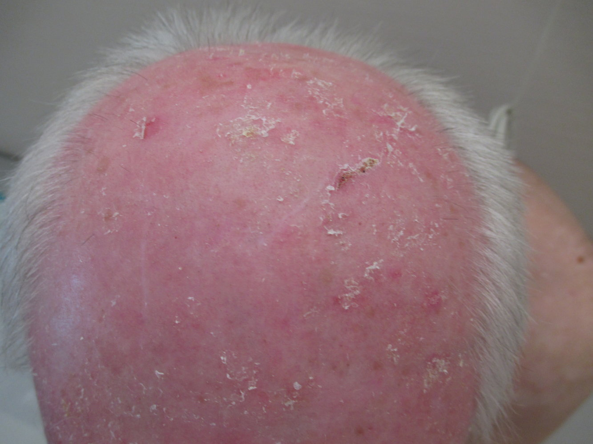
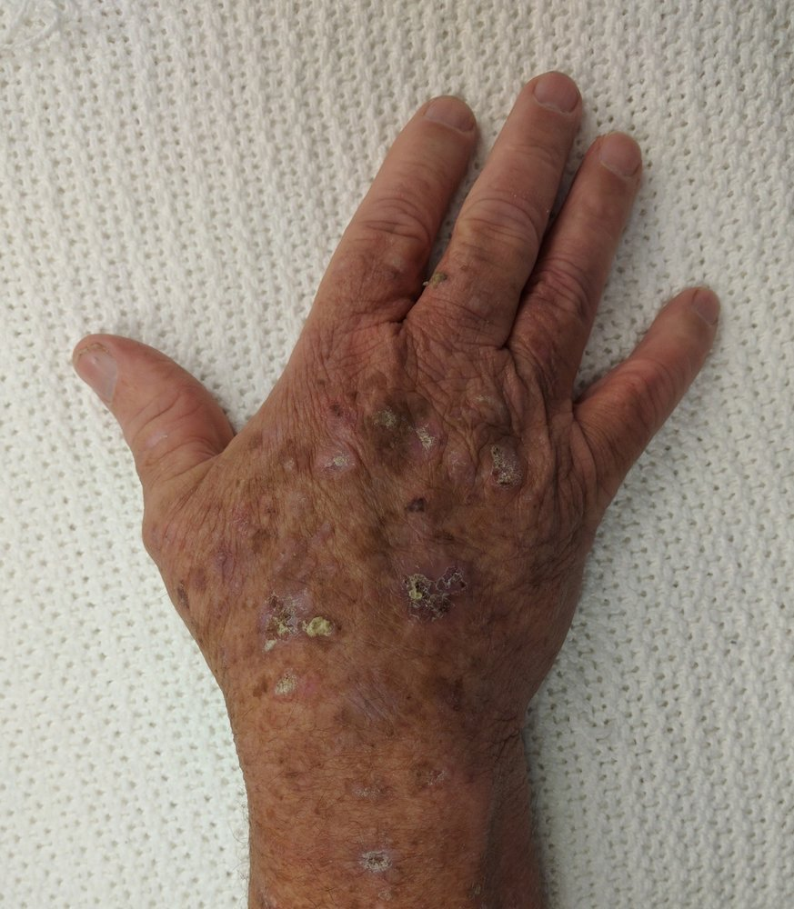

# Actinic keratosis

*Categories: Clinical knowledge > Dermatology > Neoplastic disorders > Actinic keratosis*

[Original Article Link](https://coursology-qbank.com/amboss/article/Jt0se3)

---

## Summary

Actinic keratosis is a UV-induced precancerous lesion that manifests as rough, scaly <u>skin</u> <u>papules</u> or <u>plaques</u>. Lesions either spontaneously regress, persist, or progress to <u>cutaneous squamous cell carcinoma</u>. Actinic keratosis is usually a <u>clinical diagnosis</u>, but a <u>skin biopsy</u> may be necessary if there is diagnostic uncertainty. The choice of treatment varies depending on the number and distribution of lesions. Lesion-directed therapy (e.g., <u>cryosurgery</u>) is usually used for patients with isolated or few lesions, while field-directed therapy with topical agents (e.g., <u>imiquimod</u>, 5-<u>fluorouracil</u>) or <u>photodynamic therapy</u> are used for patients with multiple lesions in one contiguous area.

---

## Clinical features

* Occurs on areas of sun-exposed <u>skin</u>

* Most commonly seen in individuals with light <u>skin</u> who are over the age of 50

* Initially: small lesion (<u>papule</u> or <u>plaque</u>) with rough surface (sandpaper-like texture)

* Later: Lesions grow and become brown or <u>erythematous</u> and scaly.

Actinic keratosis

Actinic keratosis of the scalp

Actinic keratosis

---

## Diagnosis

* Usually a <u>clinical diagnosis</u>

* Diagnostic uncertainty: Perform a <u>skin biopsy</u>.

---

## Pathology

* <u>Atypical cells</u> in the basal and squamous layers

* <u>Hyperkeratosis</u> and <u>parakeratosis</u>

* Granular layer is usually absent.

Actinic keratosis

---

## Management

Management is aimed at improving cosmesis and symptoms and decreasing the risk of malignant transformation to <u>cutaneous squamous cell carcinoma</u>. Refer to dermatology for assistance with management as needed.  [[2]](https://coursology-qbank.com/amboss/article/QddupK0)[[3]](https://coursology-qbank.com/amboss/article/jdd_pK0)

* Single or few lesions: lesion-directed treatment [[2]](https://coursology-qbank.com/amboss/article/QddupK0)

* <u>Cryosurgery</u> with liquid nitrogen  [[2]](https://coursology-qbank.com/amboss/article/QddupK0)

* <u>Curettage</u>: consider for thick lesions [[3]](https://coursology-qbank.com/amboss/article/jdd_pK0)

* <u>Laser ablation</u>

* Multiple lesions in one contiguous area: field-directed treatment [[2]](https://coursology-qbank.com/amboss/article/QddupK0)

* Topical agents

* Topical 5-<u>fluorouracil</u> (<u>5-FU</u>) DOSAGE [[3]](https://coursology-qbank.com/amboss/article/jdd_pK0)

* <u>Imiquimod</u> DOSAGE [[3]](https://coursology-qbank.com/amboss/article/jdd_pK0)

* <u>Tirbanibulin</u> DOSAGE [[4]](https://coursology-qbank.com/amboss/article/lVdvuK0)

* Topical <u>diclofenac</u> DOSAGE: Avoid in patients with <u>contraindications to NSAIDs</u>.

* <u>Photodynamic therapy</u>

* Limited <u>life expectancy</u> or high risk of mortality from treatment: Consider <u>expectant management</u>.

> [!TIP]
> Recommend <u>photoprotective measures</u> to all patients with actinic keratoses to prevent the development of additional lesions. [[2]](https://coursology-qbank.com/amboss/article/QddupK0)

> [!WARNING]
> Topical therapies for actinic keratosis can cause local <u>skin</u> reactions. [[2]](https://coursology-qbank.com/amboss/article/QddupK0)

---

## Prevention

Recommend <u>photoprotective measures</u> to all individuals. [[2]](https://coursology-qbank.com/amboss/article/QddupK0)

> [!TIP]
> Actinic keratoses are caused by exposure to <u>UV light</u>. [[2]](https://coursology-qbank.com/amboss/article/QddupK0)

---

## Prognosis

* Lesions may either regress, persist, or progress to cutaneous <u>squamous cell carcinoma</u> (<u>SCC</u>).

* The degree of <u>epithelial</u> <u>dysplasia</u> determines the risk of <u>cutaneous squamous cell carcinoma</u>.

---