# Basal cell carcinoma

*Categories: Clinical knowledge > Dermatology > Neoplastic disorders > Basal cell carcinoma*

[Original Article Link](https://coursology-qbank.com/amboss/article/rk0f6T)

---

## Summary

<u>Basal cell</u> <u>carcinoma</u> (BCC) is a <u>keratinocyte cancer</u> and the most common type of <u>skin</u> cancer overall. BCC is caused by genetic mutations within the <u>sonic hedgehog</u> signaling (<u>SHH</u>) pathway affecting the <u>basal keratinocytes</u>, <u>hair follicles</u>, and <u>eccrine sweat glands</u>. Important <u>risk factors</u> include UV exposure and a history of <u>organ transplantation</u>. Some individuals have a genetic predisposition to BCC. BCC typically occurs in individuals > 40 years of age and lesions are commonly seen on sun-exposed areas (e.g., head and neck). Typical characteristics include a nonhealing, slow-growing <u>nodule</u> or <u>plaque</u> that may bleed easily or ulcerate. <u>Dermoscopy</u> can be used to support clinical findings, but a <u>skin biopsy</u> is necessary for diagnostic confirmation. <u>Nodular BCC</u> and <u>superficial BCC</u> are the most common histologic subtypes. <u>Risk stratification of BCC</u> is used to classify the lesions as low-risk or high-risk for recurrence after excision and thereby guide management. <u>Tumor</u> resection (<u>Mohs micrographic surgery</u> or surgical excision) is the preferred treatment modality; <u>radiotherapy</u> can be considered if resection is not feasible. Other treatment modalities (e.g., <u>cryotherapy</u>, topical pharmacotherapy, <u>photodynamic therapy</u>) may be considered in selected situations but are associated with higher recurrence rates than resection. <u>Metastatic</u> BCC is rare but has a poor prognosis; <u>multidisciplinary care</u> is recommended. All patients should be screened for recurrence and the development of new <u>skin</u> cancers after treatment. <u>Photoprotective measures</u> should be recommended to all individuals for <u>primary prevention</u> and the prevention of recurrent or subsequent <u>skin</u> cancers.

---

## Risk factors

* Intermittent UV exposure is the most significant <u>risk factor</u>,  especially for individuals with: [[1]](https://coursology-qbank.com/amboss/article/-1WDj40)[[2]](https://coursology-qbank.com/amboss/article/1YW2LP0)[[3]](https://coursology-qbank.com/amboss/article/ytWdTM0)

* Lighter <u>skin</u> tone, <u>eye</u> color, and/or <u>hair</u> color

* Inability to tan and/or presence of <u>freckles</u>

* History of <u>sunburns</u> and/or recreational tanning

* Previous history of <u>basal cell</u> <u>carcinoma</u> [[4]](https://coursology-qbank.com/amboss/article/mcWV140)

* Presence of any <u>nevus</u> on an extremity [[2]](https://coursology-qbank.com/amboss/article/1YW2LP0)

* Autoimmune conditions (e.g., <u>rheumatoid arthritis</u>) [[1]](https://coursology-qbank.com/amboss/article/-1WDj40)

* <u>Immunocompromised state</u> (e.g., <u>solid organ transplant</u> recipient)

* Age > 40 years [[1]](https://coursology-qbank.com/amboss/article/-1WDj40)[[2]](https://coursology-qbank.com/amboss/article/1YW2LP0)

* Male sex [[1]](https://coursology-qbank.com/amboss/article/-1WDj40)

* Exposure to any of the following:

* Chemicals (e.g., <u>arsenic</u>)

* <u>Ionizing radiation</u>

* <u>Phototherapy</u> (e.g., <u>PUVA</u>) [[5]](https://coursology-qbank.com/amboss/article/x7WEL50)

* Genetic predisposition [[1]](https://coursology-qbank.com/amboss/article/-1WDj40)[[3]](https://coursology-qbank.com/amboss/article/ytWdTM0)

* <u>Albinism</u>

* <u>Xeroderma pigmentosum</u>

* <u>Nevoid basal cell carcinoma syndrome</u>

> [!WARNING]
> The use of a tanning bed before 24 years of age doubles the risk of developing BCC. [[2]](https://coursology-qbank.com/amboss/article/1YW2LP0)

---

## Epidemiology

* Most common malignant <u>skin</u> <u>tumor</u> [[1]](https://coursology-qbank.com/amboss/article/-1WDj40)[[2]](https://coursology-qbank.com/amboss/article/1YW2LP0)[[3]](https://coursology-qbank.com/amboss/article/ytWdTM0)

* <u>Incidence</u>:

* Rising <u>incidence</u>

* 2–3 million people per year in the US [[1]](https://coursology-qbank.com/amboss/article/-1WDj40)[[2]](https://coursology-qbank.com/amboss/article/1YW2LP0)

* Sex: <u>♂</u> > <u>♀</u> (∼ 2:1) [[1]](https://coursology-qbank.com/amboss/article/-1WDj40)

Epidemiological data refers to the US, unless otherwise specified.

---

## Clinical features

* Nonhealing well-circumscribed pearly <u>papule</u>, <u>nodule</u>, or <u>plaque</u> with rolled borders, <u>telangiectasia</u>, and/or central <u>umbilication</u> (see “<u>Common subtypes of BCC</u>” for further detail)

* Typically located in areas with sun exposure; most commonly on the face and neck

* Advanced lesions often have central <u>ulceration</u>

* Often painless; may be associated with bleeding or <u>pruritus</u>

* Lesions gradually increase in size (indolent growth)

* Perineural invasion can occur in <u>high-risk BCC lesions</u> and manifests as neuropathy.

* <u>Metastasizes</u> rarely (< 1%); can spread to <u>lymph nodes</u>, <u>soft tissue</u>, <u>lungs</u>, and bone

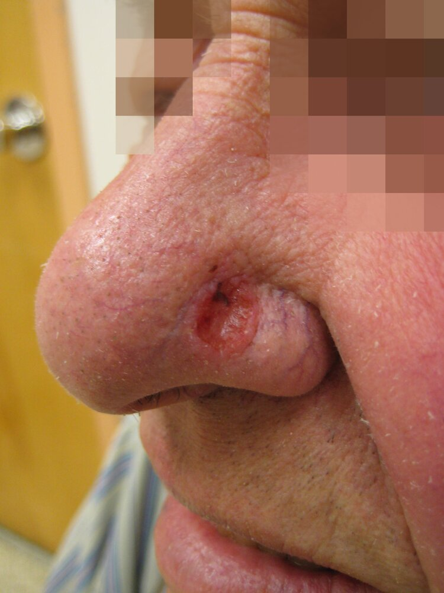

Basal cell carcinoma

Basal cell carcinoma

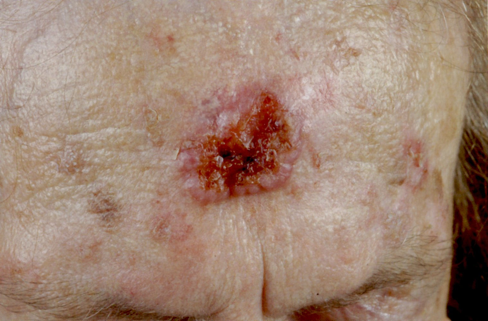

Basal cell carcinoma

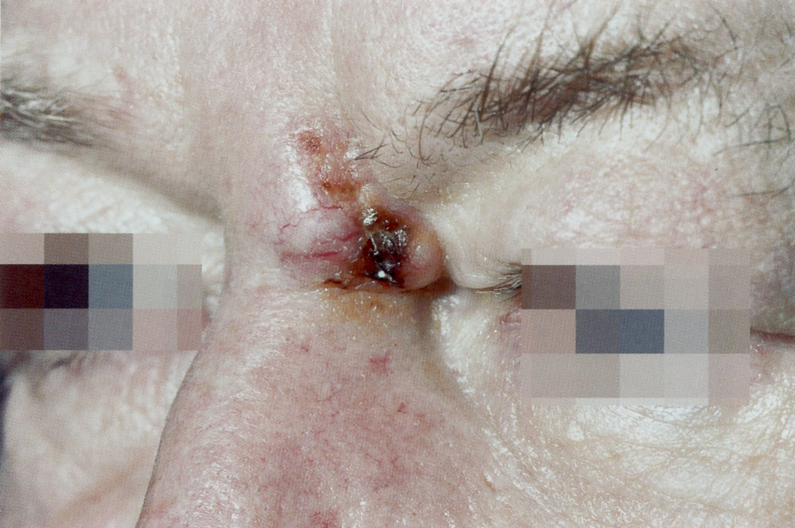

Basal cell carcinoma

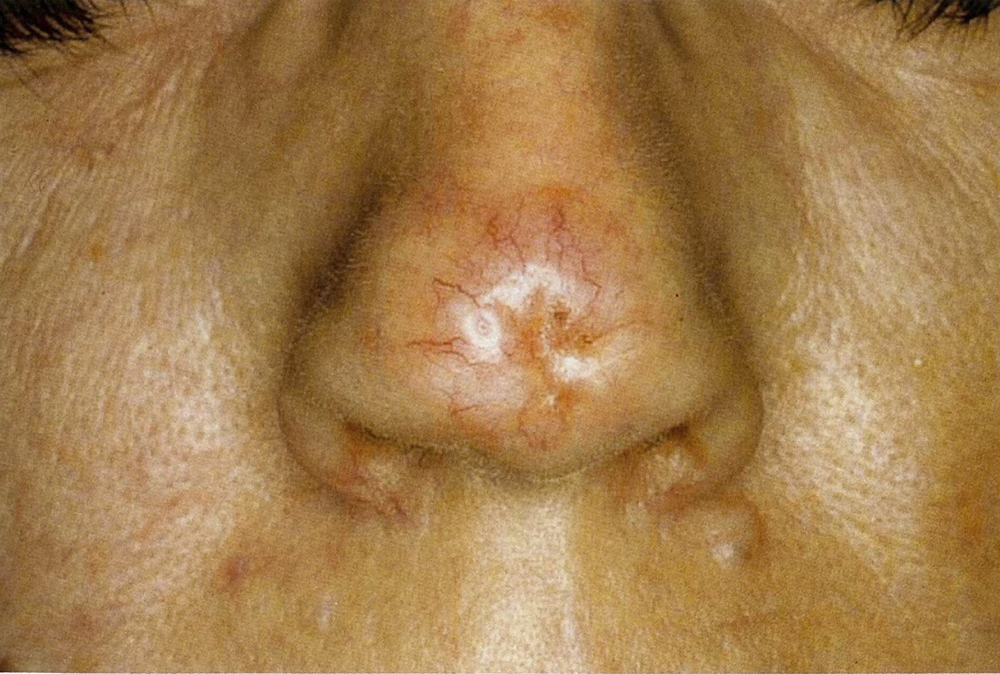

Basal cell carcinoma

> [!TIP]
> Most <u>basal cell</u> <u>carcinomas</u> occur on areas of sun-exposed <u>skin</u>. [[1]](https://coursology-qbank.com/amboss/article/-1WDj40)[[2]](https://coursology-qbank.com/amboss/article/1YW2LP0)

---

## Subtypes and variants

There are several clinical and histological BCC variants; the most common are described here.

> [!TIP]
> BCC lesions may have more than one clinical and histopathological subtype. [[1]](https://coursology-qbank.com/amboss/article/-1WDj40)[[2]](https://coursology-qbank.com/amboss/article/1YW2LP0)

### Low-risk BCC subtypes [[1]](https://coursology-qbank.com/amboss/article/-1WDj40)[[2]](https://coursology-qbank.com/amboss/article/1YW2LP0)

#### Nodular basal cell carcinoma

The most frequently occurring subtype of BCC (accounts for 50–80% of BCC) [[1]](https://coursology-qbank.com/amboss/article/-1WDj40)[[2]](https://coursology-qbank.com/amboss/article/1YW2LP0)

* <u>Papule</u> or <u>nodule</u> with the following:  ;  [[1]](https://coursology-qbank.com/amboss/article/-1WDj40)[[2]](https://coursology-qbank.com/amboss/article/1YW2LP0)

* Shiny with a pearl-like appearance

* Rolled borders

* Central <u>depression</u>, <u>erosion</u>, or <u>ulceration</u> (<u>rodent ulcer</u>)  [[6]](https://coursology-qbank.com/amboss/article/N40-jT)

* <u>Superficial</u> <u>telangiectasias</u> with arborizing pattern (tree-like branching)

* Most commonly located on the face, especially the nose [[6]](https://coursology-qbank.com/amboss/article/N40-jT)

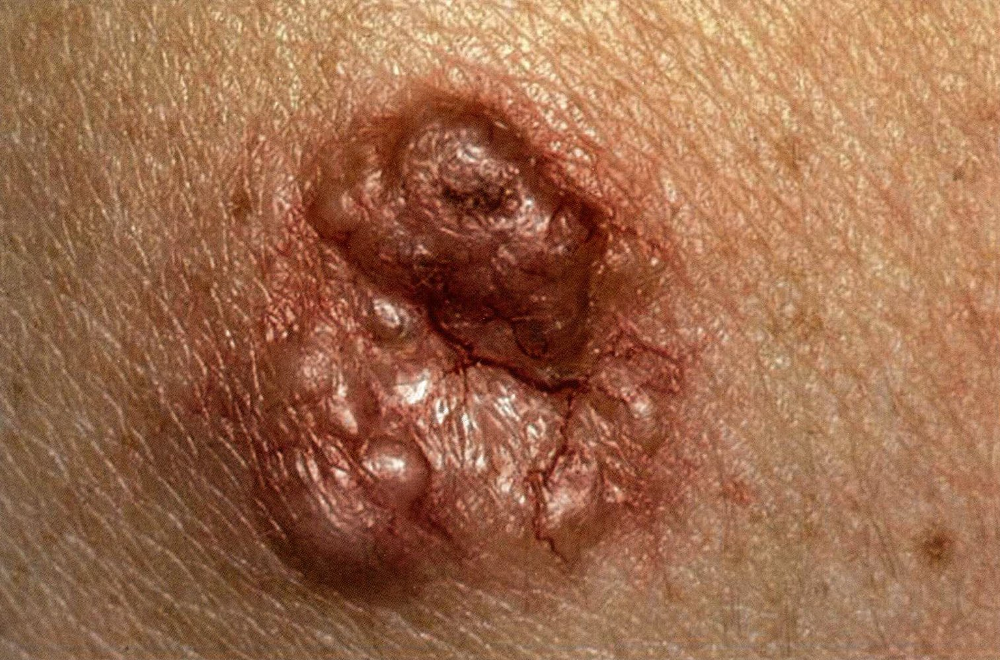

Nodular basal cell carcinoma

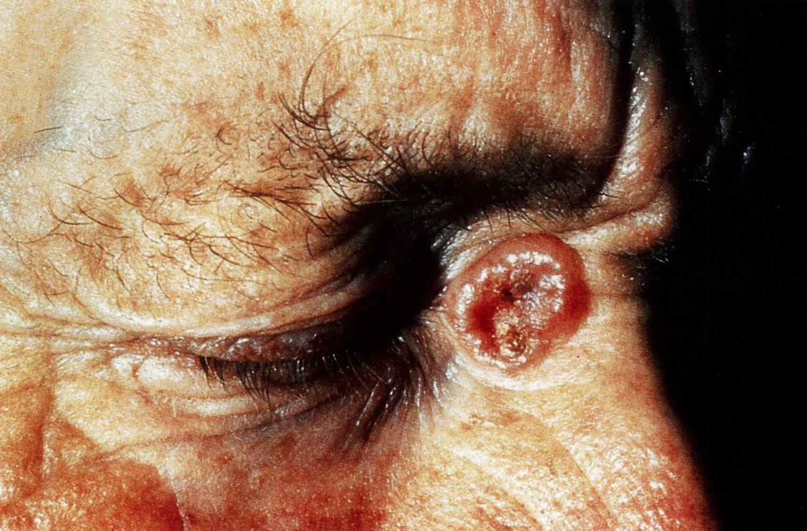

Nodular basal cell carcinoma

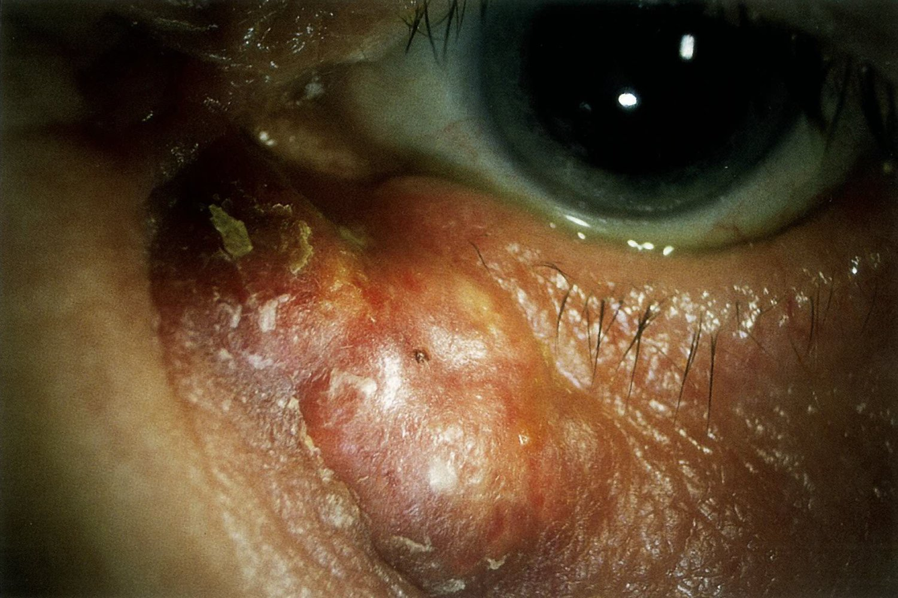

Nodular basal cell carcinoma

#### Superficial basal cell carcinoma

The second most frequent subtype of BCC (accounts for 10–30% of BCC) [[1]](https://coursology-qbank.com/amboss/article/-1WDj40)[[2]](https://coursology-qbank.com/amboss/article/1YW2LP0)

* <u>Plaque</u> with the following:  

* Thin and scaly

* Raised border with a pearl-like appearance

* Central <u>atrophy</u>

* Most commonly located on the trunk and legs

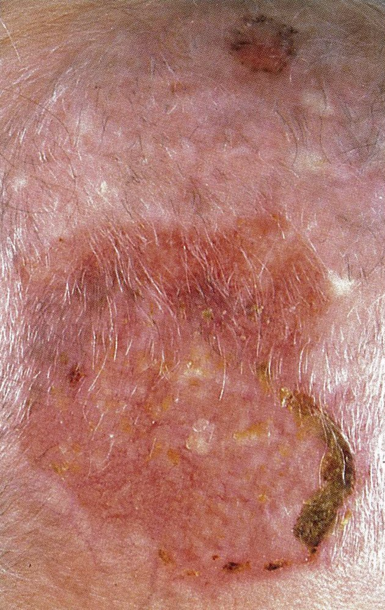

Superficial basal cell carcinoma

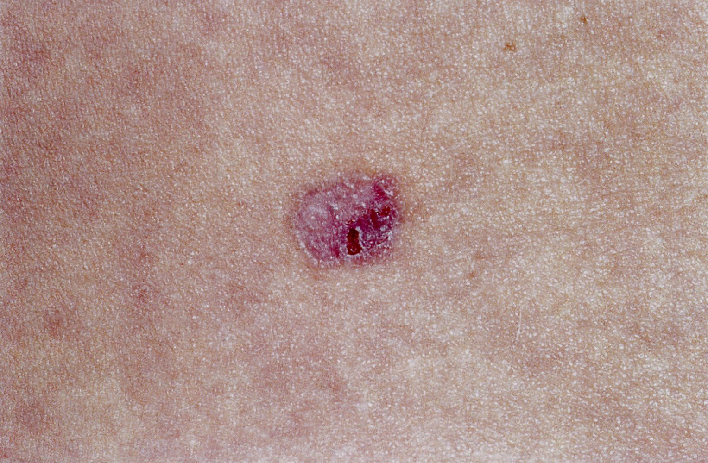

Superficial basal cell carcinoma

> [!TIP]
> <u>Superficial BCC</u> is the least invasive <u>BCC subtype</u>. [[2]](https://coursology-qbank.com/amboss/article/1YW2LP0)

#### Pigmented <u>basal cell</u> <u>carcinoma</u> [[1]](https://coursology-qbank.com/amboss/article/-1WDj40)[[2]](https://coursology-qbank.com/amboss/article/1YW2LP0)

* Nodular or <u>superficial BCC</u> lesion that contain <u>melanin</u>

* Manifests as a blue, brown, or black lesion

* See “<u>Pigmented features of BCC</u>” for further details.

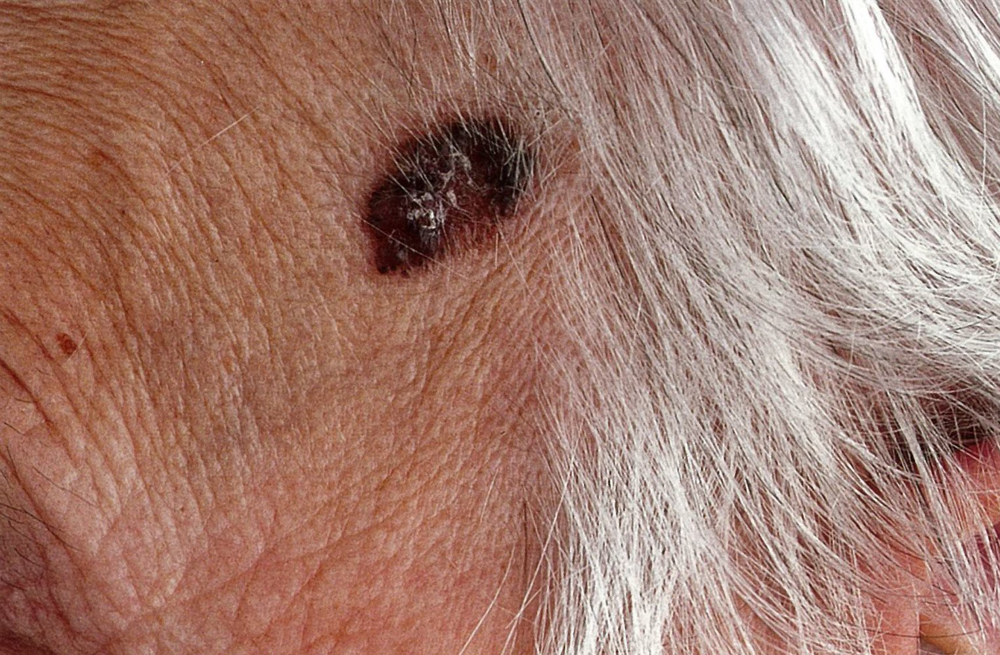

Pigmented basal cell carcinoma

Pigmented basal cell carcinoma

> [!WARNING]
> Features of pigmented <u>basal cell</u> <u>carcinoma</u> can resemble those of <u>melanoma</u>. [[1]](https://coursology-qbank.com/amboss/article/-1WDj40)[[2]](https://coursology-qbank.com/amboss/article/1YW2LP0)

### High-risk BCC subtypes [[1]](https://coursology-qbank.com/amboss/article/-1WDj40)[[2]](https://coursology-qbank.com/amboss/article/1YW2LP0)[[3]](https://coursology-qbank.com/amboss/article/ytWdTM0)

These lesions account for < 20% of all BCCs.

* Micronodular: <u>erythematous</u> <u>macule</u>, thin <u>papule</u>, or <u>plaque</u>

* Infiltrative

* Poorly defined flat or depressed light-colored <u>papule</u> or <u>plaque</u>  with the following:

* Other features include induration, <u>ulceration</u>, and <u>crust</u> formation

* Morpheaform

* Poorly defined, shiny <u>plaque</u>

* Can resemble a <u>scar</u>

* Aggressive; high risk of local recurrence after excision

* Other: basosquamous (metatypical), <u>sclerosing</u>

> [!TIP]
> Micronodular and infiltrative BCC may be clinically indistinguishable from <u>superficial</u> or <u>nodular BCC</u>. Histopathological examination is needed to confirm the diagnosis. [[2]](https://coursology-qbank.com/amboss/article/1YW2LP0)

### Nevoid basal-cell carcinoma syndrome (<u>Gorlin syndrome</u>) [[1]](https://coursology-qbank.com/amboss/article/-1WDj40)[[7]](https://coursology-qbank.com/amboss/article/J1Ws340)

* Rare, <u>autosomal-dominant</u> inherited syndrome

* Manifests with multiple BCC lesions  during childhood or <u>adolescence</u>

* Associated with:

* <u>Malformations</u> (e.g., <u>macrocephaly</u>, <u>hypertelorism</u>)

* Other tumors (e.g., <u>medulloblastoma</u>, <u>ovarian fibroma</u>)

---

## Diagnosis

### General principles [[3]](https://coursology-qbank.com/amboss/article/ytWdTM0)[[4]](https://coursology-qbank.com/amboss/article/mcWV140)

* All patients with suspected BCC should undergo a full-body <u>skin examination</u>.

* <u>Dermoscopy</u> can support visual inspection of lesions. [[8]](https://coursology-qbank.com/amboss/article/CTWqGk0)[[9]](https://coursology-qbank.com/amboss/article/UfWblk0)

* A <u>skin biopsy</u> is required for diagnostic confirmation and risk <u>stratification</u>.

* <u>Biopsy</u> all lesions suspicious for BCC.

* The <u>biopsy</u> specimen should include the deep <u>reticular dermis</u>.

* Further evaluation for regional, nodal, or distant <u>metastasis</u> may be required in patients with <u>high-risk BCC</u>; see “<u>Staging of BCC</u>” for details.

### Dermoscopy findings of BCC [[9]](https://coursology-qbank.com/amboss/article/UfWblk0)[[10]](https://coursology-qbank.com/amboss/article/E1W8i40)

* Arborizing (branching) <u>blood vessels</u>

* <u>Ulceration</u>

* Crystalline structures (i.e., shiny white areas or streaks)

* Pigmented features of BCC

* Large blue-gray ovoid nests

* Leaf-like structures

* Multiple blue-gray nonaggregated globules

* Spoke wheel-like concentric structures

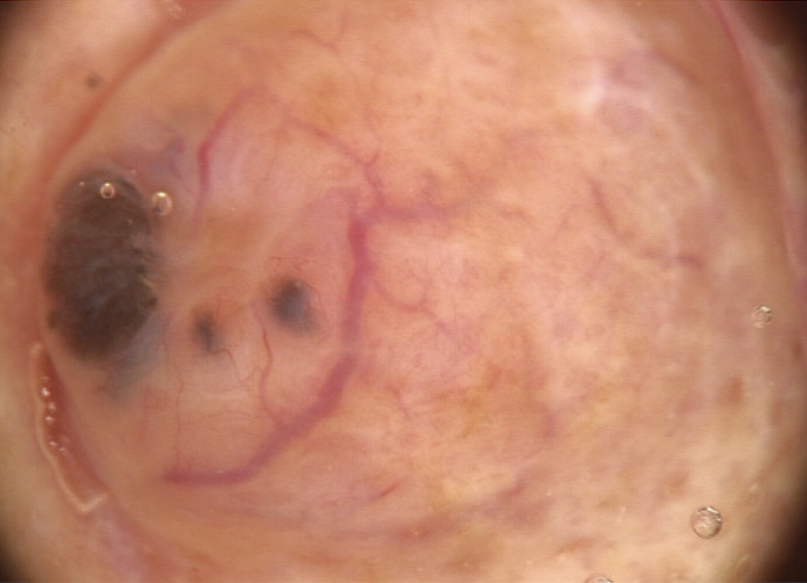

Basal cell carcinoma

### <u>Skin biopsy</u> [[2]](https://coursology-qbank.com/amboss/article/1YW2LP0)[[4]](https://coursology-qbank.com/amboss/article/mcWV140)

Select a <u>biopsy</u> technique based on the clinical features of the lesion and procedural risks ; use shared-decision making.

* Techniques:

* <u>Shave biopsy</u> for a raised lesion

* <u>Punch biopsy</u> of the most abnormal area of a large lesion

* <u>Full-thickness excisional biopsy</u> is preferred for lesions with <u>pigmented features of BCC</u> to rule out <u>melanoma</u>.

* Consider complete excision (with appropriate margins) as a diagnostic and therapeutic procedure for small lesions.

* Ensure adequate sample size and depth (including the deep <u>reticular dermis</u>) for histopathological examination; if not, a repeat <u>biopsy</u> may be required.  [[3]](https://coursology-qbank.com/amboss/article/ytWdTM0)[[4]](https://coursology-qbank.com/amboss/article/mcWV140)

* To optimize the quality of the pathology report, <u>biopsy</u> samples should include the following: [[4]](https://coursology-qbank.com/amboss/article/mcWV140)

* Patient demographics

* Presence of <u>risk factors for BCC</u>

* Size and morphology of the lesion

* Initial sample or repeat

> [!WARNING]
> Perform a <u>full-thickness excisional biopsy</u> if there is any concern for <u>malignant melanoma</u> (e.g., pigmentation, <u>ABCDE criteria</u>). [[2]](https://coursology-qbank.com/amboss/article/1YW2LP0)

---

## Pathology

* Palisading <u>nuclei</u>: <u>Nuclei</u> appear aligned.

* <u>Tumor</u> cells appear similar to <u>epidermal</u> <u>basal cells</u>.

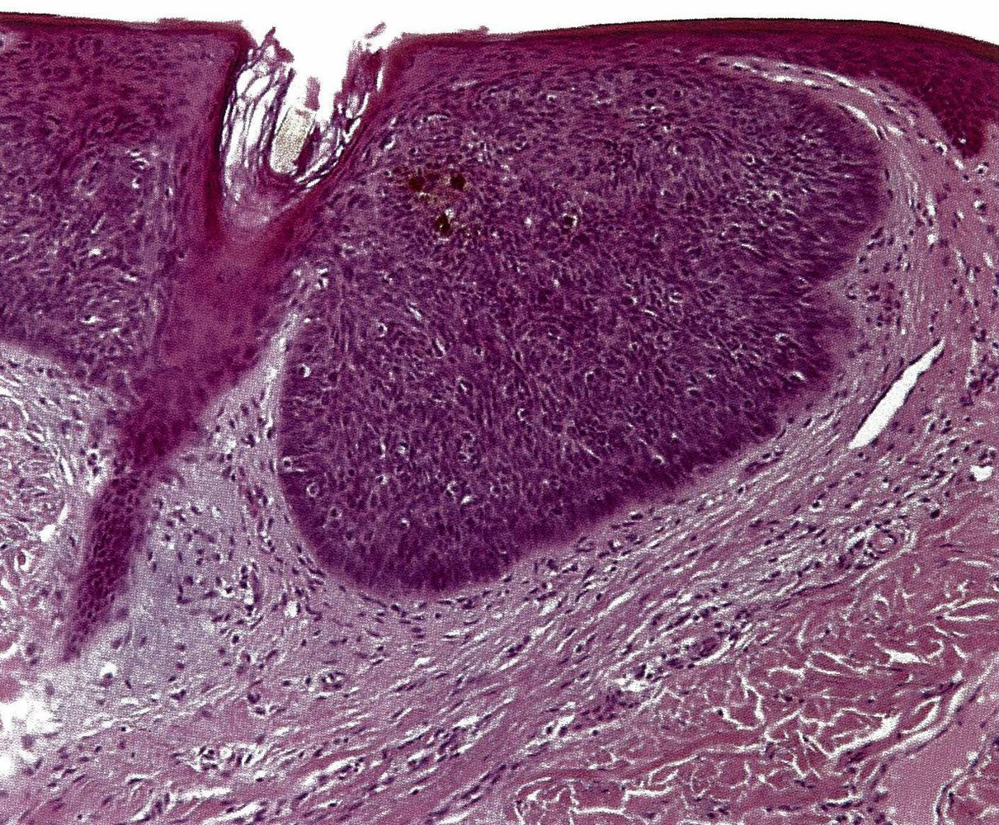

Superficial basal cell carcinoma

Basal cell carcinoma

References:[[11]](https://coursology-qbank.com/amboss/article/gF0Fh3)

---

## Differential diagnoses

### Other common <u>skin</u> cancers or precancerous lesions [[2]](https://coursology-qbank.com/amboss/article/1YW2LP0)

* <u>Precancerous skin lesions</u> (e.g., <u>actinic keratosis</u>, <u>Bowen disease</u>, <u>lentigo maligna</u>)

* <u>Keratoacanthoma</u>

* <u>Cutaneous squamous cell carcinoma</u>

* <u>Melanoma</u>

### Benign <u>skin</u> conditions [[2]](https://coursology-qbank.com/amboss/article/1YW2LP0)

* <u>Psoriasis</u>

* <u>Nummular dermatitis</u>

* <u>Seborrheic keratosis</u>

* <u>Lichen planus</u>

* <u>Extramammary Paget disease</u>

### Trichoepithelioma [[12]](https://coursology-qbank.com/amboss/article/sTWtHk0)

* Definition: a rare, <u>benign tumor</u> of the <u>hair follicle</u> that usually occurs in younger individuals  [[12]](https://coursology-qbank.com/amboss/article/sTWtHk0)

* Clinical features

* Small annular <u>papule</u> with central <u>depression</u>

* Typically located on the face (e.g., cheek)

* Diagnostics

* Perform a full-thickness <u>skin biopsy</u>.

* <u>Histology</u> findings may be similar to those of morpheaform <u>basal cell</u> <u>carcinoma</u> or other <u>skin</u> tumors.

* Treatment: <u>Mohs micrographic surgery</u> (especially if on the face) or surgical excision

The differential diagnoses listed here are not exhaustive.

---

## Treatment

### General principles [[2]](https://coursology-qbank.com/amboss/article/1YW2LP0)[[3]](https://coursology-qbank.com/amboss/article/ytWdTM0)[[4]](https://coursology-qbank.com/amboss/article/mcWV140)

* Definitive <u>treatment of BCC</u> is recommended.

* The choice of therapy is based on:

* Risk of recurrence (see “<u>Risk stratification of BCC</u>”)

* Need for conservation of tissue and function

* Patient expectations (use <u>shared decision-making</u>)

* Treatment options include:

* Resection;   : generally preferred as it is associated with the lowest recurrence rates

* <u>Radiotherapy</u>: when resection is not feasible

* <u>Superficial</u> therapies  : for <u>superficial</u> <u>low-risk BCC</u>

* Systemic therapies  : for locally advanced or <u>metastatic</u> BCC

* Consults and referrals

* Consider referral to a dermatologist for management.

* <u>Multidisciplinary care</u>  is necessary for patients with <u>high-risk BCC lesions</u> or <u>metastatic</u> BCC and those who cannot undergo <u>surgery</u> or radiation.

* Ensure appropriate <u>follow-up for BCC</u> to assess for new or recurrent <u>skin</u> cancers.

### Overview of treatment options [[2]](https://coursology-qbank.com/amboss/article/1YW2LP0)[[3]](https://coursology-qbank.com/amboss/article/ytWdTM0)[[4]](https://coursology-qbank.com/amboss/article/mcWV140)

|  Overview of treatment options for BCC [[2]](https://coursology-qbank.com/amboss/article/1YW2LP0)[[3]](https://coursology-qbank.com/amboss/article/ytWdTM0)[[4]](https://coursology-qbank.com/amboss/article/mcWV140)  |  |  |
| --- | --- | --- |
|  | Indications | Special considerations |
|  Mohs micrographic <u>surgery</u> (MMS)  |   * Recommended for <u>high-risk BCC</u>  * Preferred if minimal tissue excision is required.  * Consider for management of positive margins after surgical excision.    |   * Lowest recurrence rate of all treatment options  * Limited availability; hence reserved for high-risk, recurrent, or <u>complex lesions</u>    |
|  Surgical excision  |   * <u>Low-risk BCC</u>  * Consider for <u>high-risk BCC</u> if MMS is not available    |   * Extent of excision  * Margins should include 4 mm of surrounding normal-appearing tissue.  * The depth should extend to the mid-<u>subcutaneous adipose tissue</u>.  * For <u>high-risk BCC lesions</u>, wider margins are required.  * Wound closure  * <u>Skin grafting</u>, linear repair, or <u>healing by secondary intention</u>  * Consider delayed closure until <u>R0</u> resection is confirmed.    |
| <u>Curettage</u> and electrodessiccation (C&E) |  * <u>Low-risk BCC</u>   |   * Histologic margin assessment is not feasible.  * Contraindicated for tumors:  * On cosmetically sensitive areas  * On <u>hair</u>-bearing <u>skin</u>  * Extending beyond the <u>dermis</u>  * Convert to surgical excision if the subcutaneous layer is breached.    |
| Shave removal |  * <u>Low-risk BCC</u> on the trunk or extremities   |   * <u>Suture closure</u> is not required.  * Complete margin assessment is not performed  * Convert to surgical excision if the subcutaneous layer is breached.    |
| <u>Radiotherapy</u> (RT) |   * Primary RT: Consider when resection is not feasible.  * Consider adjuvant RT for:  * BCC with perineural involvement  * Management of positive margins after resection    |   * Requires multiple sessions  * Typically used for adults > 60 years of age  * Contraindicated in individuals with a genetic predisposition for <u>skin</u> cancers.    |
| <u>Cryotherapy</u>, topical pharmacotherapy, and/or <u>photodynamic therapy</u> |  * Low-risk <u>superficial BCC</u> if resection or RT is not feasible   |   * Higher risk of recurrence than <u>surgery</u> or RT  * Topical pharmacotherapy   * Agents: <u>imiquimod</u> (preferred) and <u>5-FU</u>  * Requires multiple sessions  * Adverse effects: <u>skin</u> irritation and inflammation  * Histological margin assessment is not feasible.    |
| Systemic therapies |  * Locally advanced or <u>metastatic</u> BCC that is not amenable to resection or curative RT   |   * Can be used for primary or recurrent BCC lesions  * Includes:  * <u>Hedgehog pathway inhibitors</u> (e.g., vismodegib, sonidegib)  * Immunotherapy (cemiplimab)    |

> [!TIP]
> MMS is considered superior to surgical excision, as the entire <u>tumor</u> margin is intraoperatively assessed to ensure <u>R0</u> resection, which reduces the risk of recurrence, and the conservation of healthy tissue is maximized. [[3]](https://coursology-qbank.com/amboss/article/ytWdTM0)[[4]](https://coursology-qbank.com/amboss/article/mcWV140)

> [!TIP]
> BCC typically extends beyond the clinically visible margins. Incompletely excised tumors have a recurrence rate of ∼ 26% compared to ∼ 6% after <u>R0</u> resection. [[4]](https://coursology-qbank.com/amboss/article/mcWV140)

### Localized BCC [[2]](https://coursology-qbank.com/amboss/article/1YW2LP0)[[3]](https://coursology-qbank.com/amboss/article/ytWdTM0)[[4]](https://coursology-qbank.com/amboss/article/mcWV140)

#### <u>High-risk BCC</u>

* Preferred: MMS

* Alternatives

* Surgical excision with wide margins

* RT for patients who cannot undergo resection

* Consider adjuvant RT if there is evidence of perineural or large nerve invasion.

#### <u>Low-risk BCC</u>

* Preferred: resection

* Shave removal for <u>superficial BCC</u> on trunk or extremities

* C&E for <u>superficial BCC</u> in non-<u>hair</u>-bearing areas

* Standard surgical excision (4 mm margins)

* RT is preferred for patients who cannot undergo resection.

* Alternatives for small, <u>low-risk BCC lesions</u> with no <u>dermal</u> extension in patients who cannot undergo resection or RT

* <u>Cryotherapy</u>

* Topical pharmacotherapy (i.e., <u>imiquimod</u> or 5-<u>fluorouracil</u>)

* <u>Photodynamic therapy</u>

> [!WARNING]
> Avoid <u>electrodesiccation</u> and <u>curettage</u> in lesions in cosmetically sensitive areas (e.g., face) and <u>hair</u>-bearing areas. [[3]](https://coursology-qbank.com/amboss/article/ytWdTM0)[[4]](https://coursology-qbank.com/amboss/article/mcWV140)

### Locally advanced or <u>metastatic</u> BCC [[2]](https://coursology-qbank.com/amboss/article/1YW2LP0)[[3]](https://coursology-qbank.com/amboss/article/ytWdTM0)[[4]](https://coursology-qbank.com/amboss/article/mcWV140)

Specialist referral and <u>multidisciplinary care</u> are recommended to consider the following options:

* <u>Surgery</u> with or without RT (preferred if feasible)

* <u>Hedgehog pathway inhibitors</u> (e.g., vismodegib, sonidegib)

* Immunotherapy with cemiplimab

* <u>Palliative care</u>

* Enrollment into clinical trials

### Follow-up for BCC [[3]](https://coursology-qbank.com/amboss/article/ytWdTM0)[[4]](https://coursology-qbank.com/amboss/article/mcWV140)

Regular follow-up is essential as patients are at an increased of developing subsequent <u>skin</u> cancers.  [[3]](https://coursology-qbank.com/amboss/article/ytWdTM0)

* Screen for <u>skin</u> cancers every 6–12 months for 5 years; then annually for life.

* Encourage adherence to <u>photoprotective measures</u>.

* Educate patients and/or caregivers on self-examination to detect recurrence or new lesions.

> [!TIP]
> Follow-up with a dermatologist is strongly recommended for <u>immunosuppressed</u> individuals and those with ≥ 4 nonmelanoma <u>skin</u> cancers and/or ≥ 1 <u>melanoma</u> in the past 5 years. [[3]](https://coursology-qbank.com/amboss/article/ytWdTM0)

---

## Prognosis

* Excellent prognosis with a low rate of <u>metastasis</u> (< 0.1%) [[3]](https://coursology-qbank.com/amboss/article/ytWdTM0)

* If <u>metastasis</u> occurs, the prognosis is poor. [[4]](https://coursology-qbank.com/amboss/article/mcWV140)

* Individuals with a history of BCC are at an increased risk of developing subsequent BCC and other <u>skin</u> cancers (<u>SCC</u>, <u>melanoma</u>). [[2]](https://coursology-qbank.com/amboss/article/1YW2LP0)[[3]](https://coursology-qbank.com/amboss/article/ytWdTM0)

---

## Prevention

* Screening: : Consider recommending regular <u>skin</u> self-examination (e.g., monthly).  [[14]](https://coursology-qbank.com/amboss/article/Vv1G_i0)[[15]](https://coursology-qbank.com/amboss/article/hfWcNk0)

* Prevention: Recommend <u>photoprotective measures</u> to all individuals regardless of <u>skin</u> type.  [[14]](https://coursology-qbank.com/amboss/article/Vv1G_i0)[[16]](https://coursology-qbank.com/amboss/article/SfWylk0)

---