# Benign skin tumors

*Categories: Clinical knowledge > Dermatology > Neoplastic disorders > Benign skin tumors*

[Original Article Link](https://coursology-qbank.com/amboss/article/Eu08G3)

---

## Summary

Benign <u>skin</u> tumors are noncancerous <u>skin</u> growths and include <u>hemangiomas</u>, angiomas, <u>angiokeratomas</u>, <u>seborrheic keratoses</u>, <u>dermatofibromas</u>, <u>lipomas</u>, <u>dermal cylindromas</u>, <u>acrochordons</u>, <u>epidermoid cysts</u>, and <u>sebaceous hyperplasia</u>. Benign <u>skin</u> tumors are typically diagnosed based on the appearance of the lesion, but a <u>biopsy</u> may be performed to rule out <u>malignancy</u> if the diagnosis is uncertain or the lesion has concerning features, such as a rapid increase in size. Removal (e.g., with surgical excision, <u>cryosurgery</u>, or <u>electrosurgery</u>) is typically only indicated for suspected <u>malignancy</u>, cosmetic reasons, or if symptoms are bothersome.

For other benign <u>skin</u> disorders, see “<u>Hypertrophic and keloid scars</u>” and “<u>Collection of dermatological disorders</u>.”

---

## Vascular skin tumors

### <u>Infantile hemangioma</u> (<u>strawberry hemangioma</u>)

See “<u>Strawberry hemangioma</u>.”

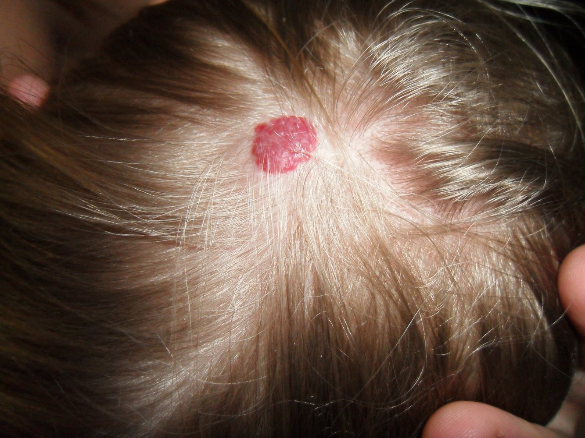

Infantile superficial hemangioma

### Cherry angioma [[1]](https://coursology-qbank.com/amboss/article/Dz11Ej0)[[2]](https://coursology-qbank.com/amboss/article/lPWvUl0)[[3]](https://coursology-qbank.com/amboss/article/-u0DF3)

#### <u>Epidemiology</u>

* Most common benign vascular <u>tumor</u>

* Most commonly occurs in adults > 30 years of age [[2]](https://coursology-qbank.com/amboss/article/lPWvUl0)

* <u>Incidence</u> increases with age

#### Pathophysiology

<u>Cherry angiomas</u> are a benign <u>proliferation</u> of dilated mature <u>capillaries</u> and <u>postcapillary venules</u>.

#### Etiology

* Unknown; chemical exposure or hormonal factors may be involved

* Associated with <u>Fabry disease</u>  [[1]](https://coursology-qbank.com/amboss/article/Dz11Ej0)

#### Clinical features

* Multiple dome-shaped <u>papules</u> or <u>macules</u>

* Typically on the trunk and upper extremities, but can occur anywhere on the body

* 1–5 mm in diameter [[2]](https://coursology-qbank.com/amboss/article/lPWvUl0)

* Well-demarcated

* Bright red or dark purple; if thrombosed, may appear black

* Compressible and blanch with pressure

* Typically asymptomatic

* May bleed profusely with trauma

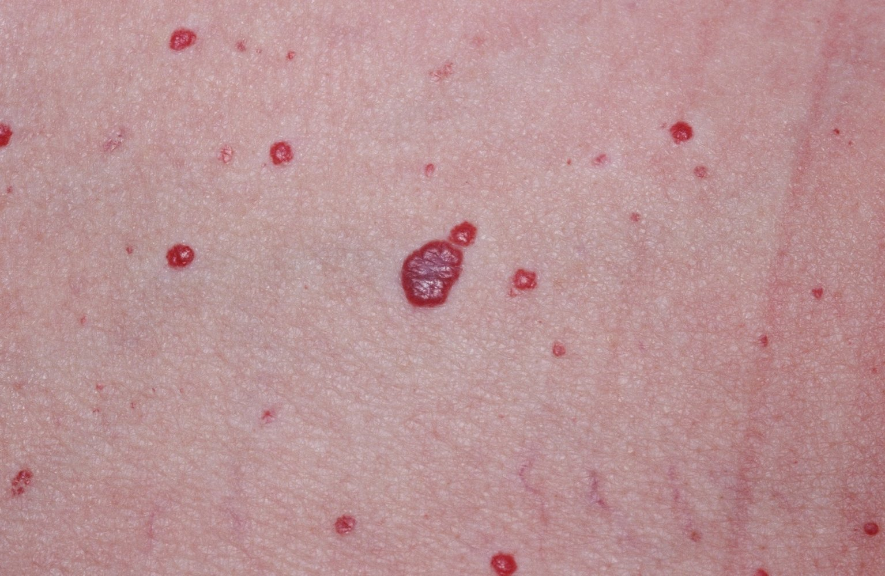

Capillary hemangioma of the skin (cherry angioma)

#### Diagnostics

* Diagnosis is typically clinical.

* <u>Excisional biopsy</u>: if <u>malignancy</u> is suspected  [[4]](https://coursology-qbank.com/amboss/article/5cci1Y0)

* <u>Genetic testing</u>: if <u>Fabry disease</u> is suspected  [[1]](https://coursology-qbank.com/amboss/article/Dz11Ej0)

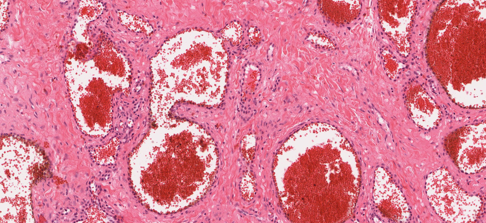

Capillary hemangioma of the skin (cherry angioma)

#### Differential diagnoses

* <u>Pyogenic granuloma</u>

* <u>Petechiae</u>

* <u>Melanoma</u> [[4]](https://coursology-qbank.com/amboss/article/5cci1Y0)

* Blue <u>nevus</u> [[4]](https://coursology-qbank.com/amboss/article/5cci1Y0)

#### Treatment

* Indicated for bleeding lesions or cosmetic reasons

* Options include:

* <u>Electrodessication</u>

* <u>Laser ablation</u>

* Surgical excision (e.g., <u>shave excision</u>)

#### Prognosis [[4]](https://coursology-qbank.com/amboss/article/5cci1Y0)

* No malignant potential

* No spontaneous regression

### Pyogenic granuloma [[1]](https://coursology-qbank.com/amboss/article/Dz11Ej0)[[2]](https://coursology-qbank.com/amboss/article/lPWvUl0)[[5]](https://coursology-qbank.com/amboss/article/0E0e83)

#### Definition

A <u>pyogenic granuloma</u> is a benign vascular <u>tumor</u> characterized by rapid growth and a tendency to bleed easily.

#### <u>Epidemiology</u>

* Most commonly develops in childhood

* Occurs in ∼ 5% of <u>pregnancies</u> (especially in the second and third trimesters) [[6]](https://coursology-qbank.com/amboss/article/pPWLfl0)

#### Etiology

Etiology is unclear; <u>pyogenic granulomas</u> may be associated with:

* Minor trauma

* Elevated <u>hormone</u> levels during <u>pregnancy</u> [[6]](https://coursology-qbank.com/amboss/article/pPWLfl0)

#### Clinical features [[7]](https://coursology-qbank.com/amboss/article/6PWjfl0)

* Solitary polypoid or <u>pedunculated</u> <u>nodule</u>

* Can occur anywhere, but often found on the mucus membranes, head, neck, trunk, hands, and/or feet

* Rapid growth followed by stabilization of size (typically < 2 cm) [[5]](https://coursology-qbank.com/amboss/article/0E0e83)

* Well-demarcated

* Wide range of colors (e.g., yellow, bright red, purple)

* <u>Friable</u>, scaly <u>collarette</u>, may ulcerate

* Tendency to bleed easily, e.g. after minor trauma

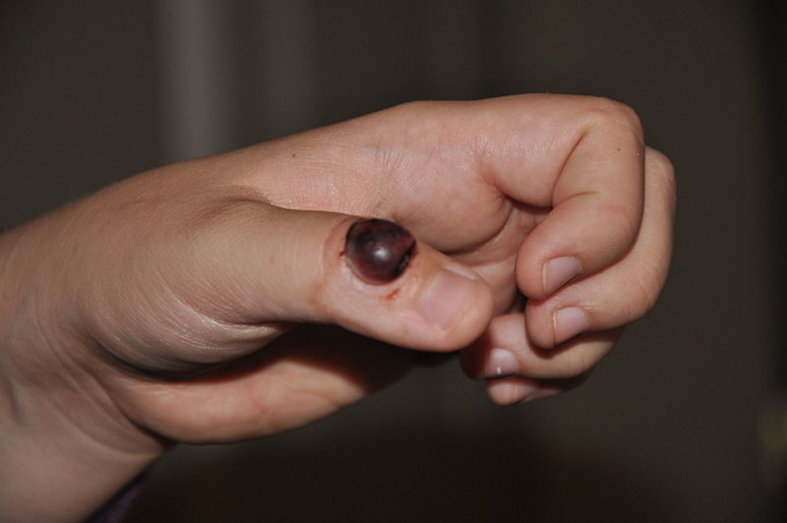

Pyogenic granuloma

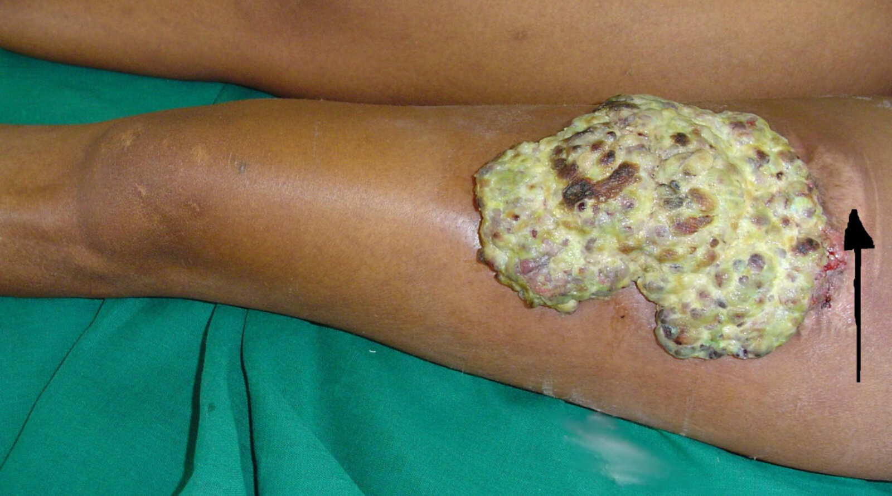

Giant pyogenic granuloma

#### Diagnostics

* Diagnosis is typically clinical.

* <u>Excisional biopsy</u>: if <u>malignancy</u> is suspected

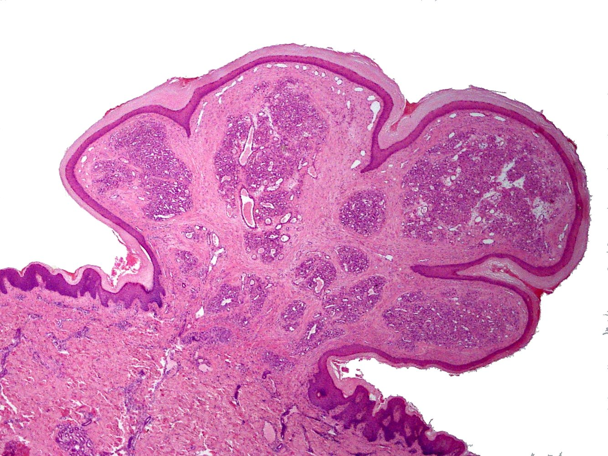

Pyogenic granuloma

#### Differential diagnoses

* Amelanotic <u>nodular melanoma</u>

* <u>Squamous cell carcinoma</u>, <u>basal cell carcinoma</u>

* <u>Angiosarcoma</u>, <u>Kaposi sarcoma</u> [[7]](https://coursology-qbank.com/amboss/article/6PWjfl0)

* <u>Spitz nevi</u>

#### Treatment

* Lesions are typically removed because they proliferate rapidly and bleed easily.

* Options include:

* <u>Laser ablation</u>

* Surgical excision (e.g., <u>shave excision</u>) with <u>electrodesiccation</u>

* Refer patients with facial or recurrent lesions to dermatology.

#### Prognosis [[7]](https://coursology-qbank.com/amboss/article/6PWjfl0)

* Regression occurs in some cases.

* Lesions may recur or form satellite lesions after removal.

### Angiomatosis

See “<u>Bacillary angiomatosis</u>” for further information.

### Angiokeratoma [[2]](https://coursology-qbank.com/amboss/article/lPWvUl0)[[8]](https://coursology-qbank.com/amboss/article/Wk1P5S0)[[9]](https://coursology-qbank.com/amboss/article/lwWvQn0)

#### Definition

An <u>angiokeratoma</u> is a benign <u>vascular ectasia</u> of the <u>superficial</u> <u>dermal</u> <u>blood vessels</u> with overlying <u>hyperkeratosis</u> of the <u>epidermis</u>.

#### Pathophysiology

<u>Angiokeratomas</u> may develop due to increased venous pressure (e.g., <u>pregnancy</u>, <u>hemorrhoids</u>).

#### Etiology

* Unknown

* May be related to genetic factors or local trauma

#### Clinical features

* General features may include: [[10]](https://coursology-qbank.com/amboss/article/PwWWQn0)

* Intermittent bleeding

* <u>Pruritus</u>

* <u>Pain</u>

* Additional features depend on the subtype.

|  <u>Angiokeratoma</u> subtypes [[2]](https://coursology-qbank.com/amboss/article/lPWvUl0)[[8]](https://coursology-qbank.com/amboss/article/Wk1P5S0)[[9]](https://coursology-qbank.com/amboss/article/lwWvQn0)  |  |  |  |
| --- | --- | --- | --- |
|  | <u>Angiokeratoma</u> of Fordyce |  Solitary <u>angiokeratoma</u> [[11]](https://coursology-qbank.com/amboss/article/rIWfV50)  | <u>Angiokeratoma corporis diffusum</u> |
| Morphology |  * Keratotic <u>papules</u>   |  * Keratotic <u>papule</u> or <u>plaque</u>   |  * Punctate lesions   |
| Size |  * < 4 mm   |  * 2–10 mm [[11]](https://coursology-qbank.com/amboss/article/rIWfV50)   |  * < 1 mm   |
| Color |  * Dark red to black   |  * Dark purple to black   |  * Dark red   |
| Distribution |  * Multiple lesions (possibly hundreds) on the external genitalia   [[2]](https://coursology-qbank.com/amboss/article/lPWvUl0)   |  * Solitary lesion on the lower extremities   |  * Numerous lesions covering the trunk, genitals, and buttocks in a “bathing-suit” distribution   |
| Other |  * Most common subtype   |  * Most common in men ages 20–50 [[11]](https://coursology-qbank.com/amboss/article/rIWfV50)   |  * Associated with <u>Fabry disease</u>   |

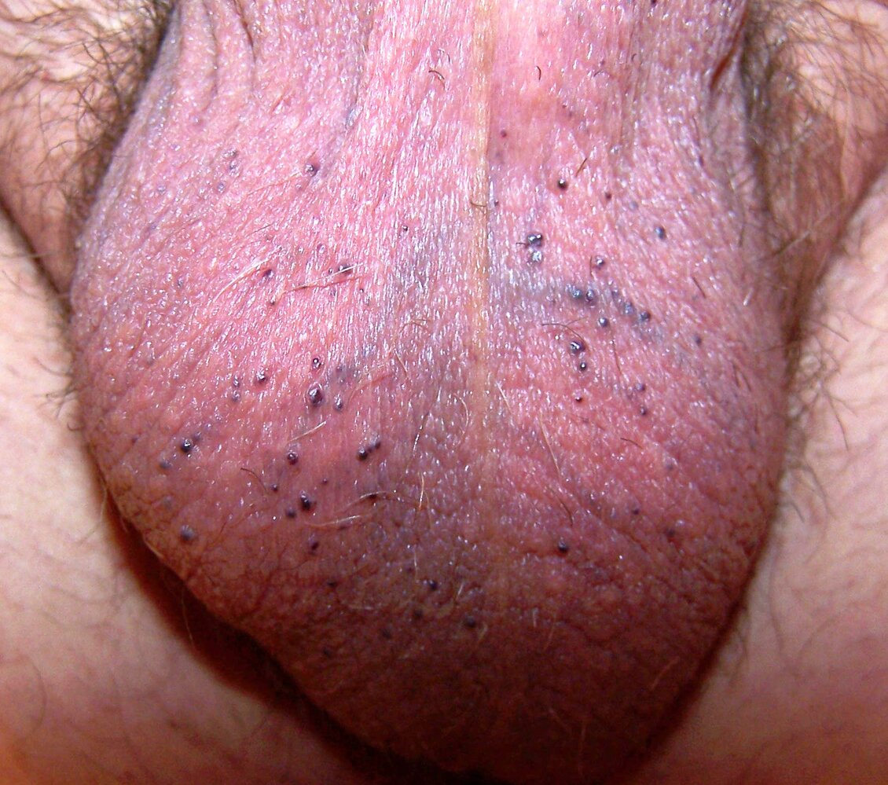

Angiokeratoma of Fordyce

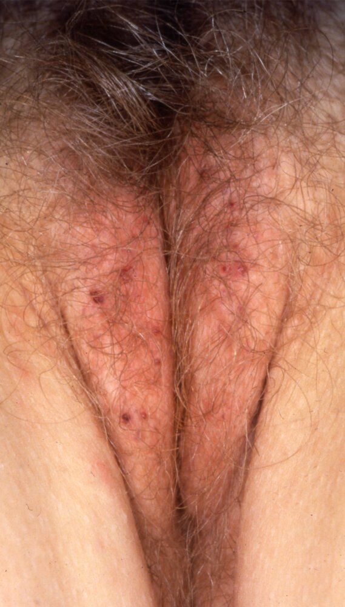

Angiokeratoma of Fordyce

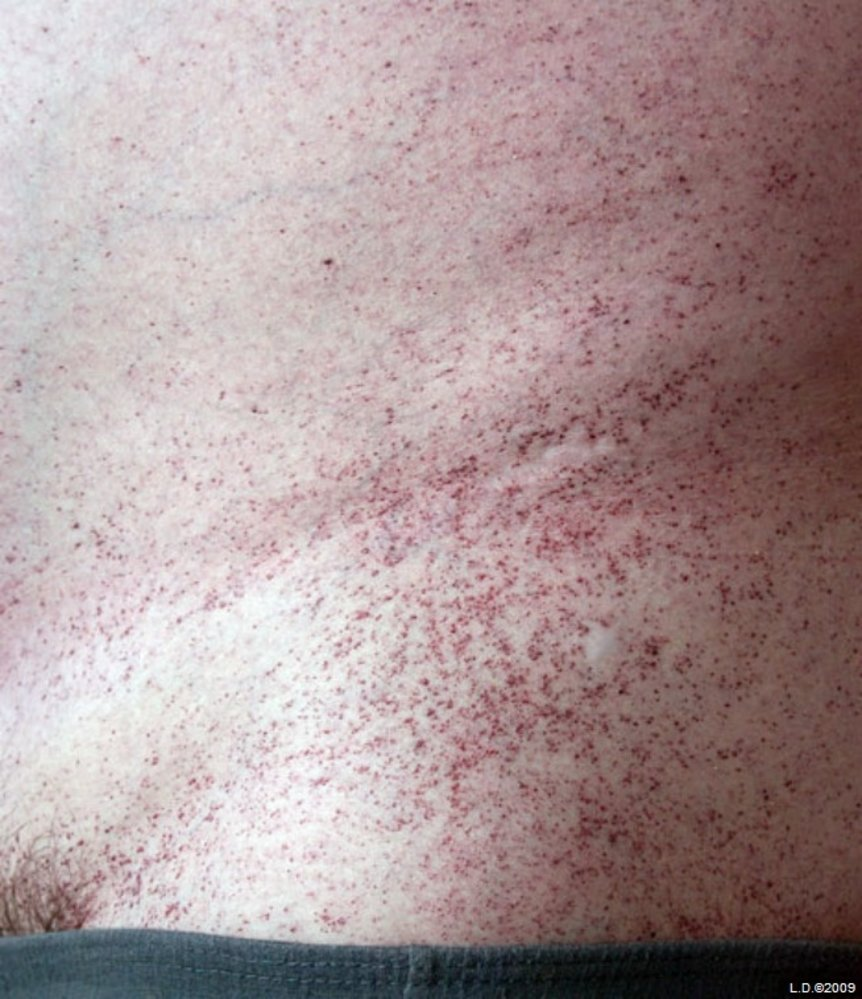

Angiokeratomas

#### Diagnostics

* Diagnosis is typically clinical.

* <u>Dermatoscopy</u>: dark lacunae with a white veil [[12]](https://coursology-qbank.com/amboss/article/C7WqL50)

* <u>Excisional biopsy</u>: if <u>malignancy</u> is suspected

#### Differential diagnosis [[12]](https://coursology-qbank.com/amboss/article/C7WqL50)

* Other vascular lesions: <u>cherry angioma</u>, <u>pyogenic granuloma</u>

* Pigmented lesions: melanocytic <u>nevi</u>, <u>Spitz nevi</u>, <u>melanoma</u>

#### Treatment

* Indicated for suspected <u>malignancy</u>, cosmetic reasons, or if symptoms are bothersome

* Options include:

* Surgical excision

* <u>Electrosurgery</u>

* <u>Laser ablation</u>

* <u>Cryosurgery</u>

#### Prognosis

<u>Angiokeratomas</u> have no malignant potential.

---

## Seborrheic keratosis

### Definition [[13]](https://coursology-qbank.com/amboss/article/mwWVjn0)

<u>Seborrheic keratosis</u> is a benign growth of immature <u>keratinocytes</u>.

### <u>Epidemiology</u> [[1]](https://coursology-qbank.com/amboss/article/Dz11Ej0)

<u>Seborrheic keratosis</u> is the most common benign <u>skin</u> <u>tumor</u> in adults > 30 years of age.

### Etiology [[1]](https://coursology-qbank.com/amboss/article/Dz11Ej0)

* Hereditary

* Underlying <u>malignancy</u> (e.g., <u>gastric adenocarcinoma</u>) can cause paraneoplastic <u>seborrheic keratoses</u> (Leser-Trélat sign).

### Clinical features [[1]](https://coursology-qbank.com/amboss/article/Dz11Ej0)[[2]](https://coursology-qbank.com/amboss/article/lPWvUl0)[[3]](https://coursology-qbank.com/amboss/article/-u0DF3)

* Single or multiple soft <u>papules</u> or <u>plaques</u> that appear stuck on

* Located on the trunk, upper extremities, face, and/or scalp

* Texture is greasy, waxy, velvety, or warty

* 1 mm to 6 cm in diameter [[14]](https://coursology-qbank.com/amboss/article/ei1xqg0)

* Sharply demarcated

* Yellow-brown

* May become irritated (by external trauma or spontaneously) and bleed

* Pruritic (rarely)

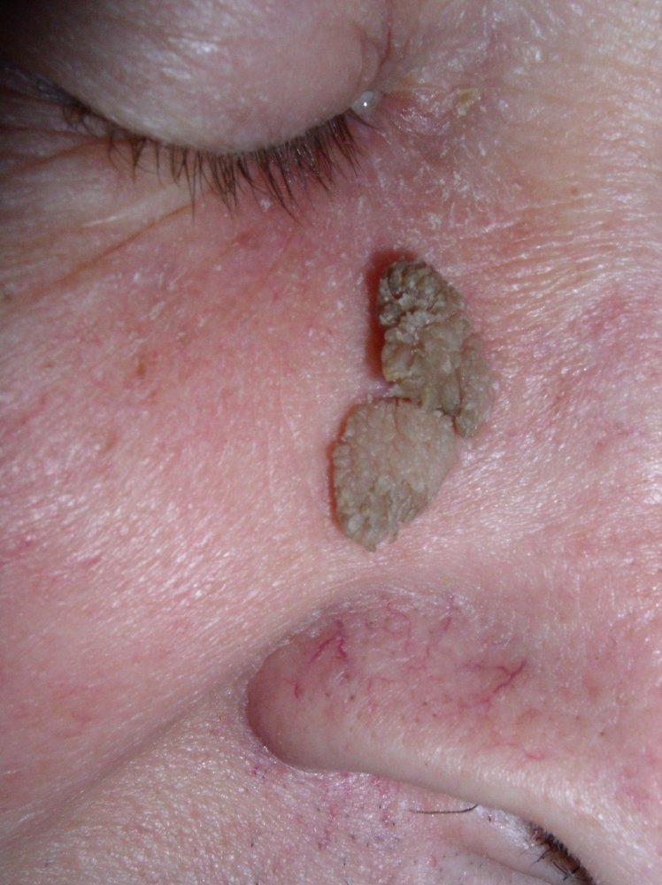

Seborrheic keratosis

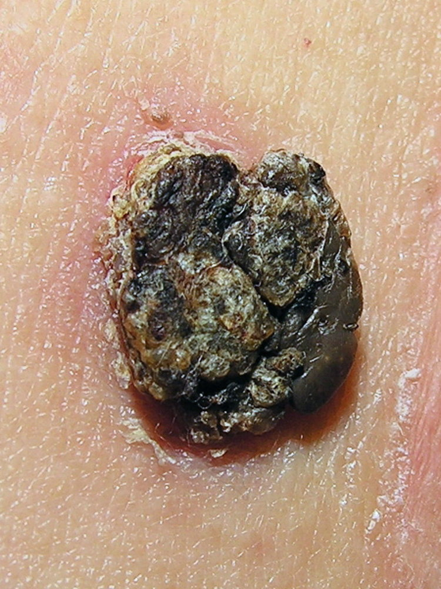

Seborrheic keratosis

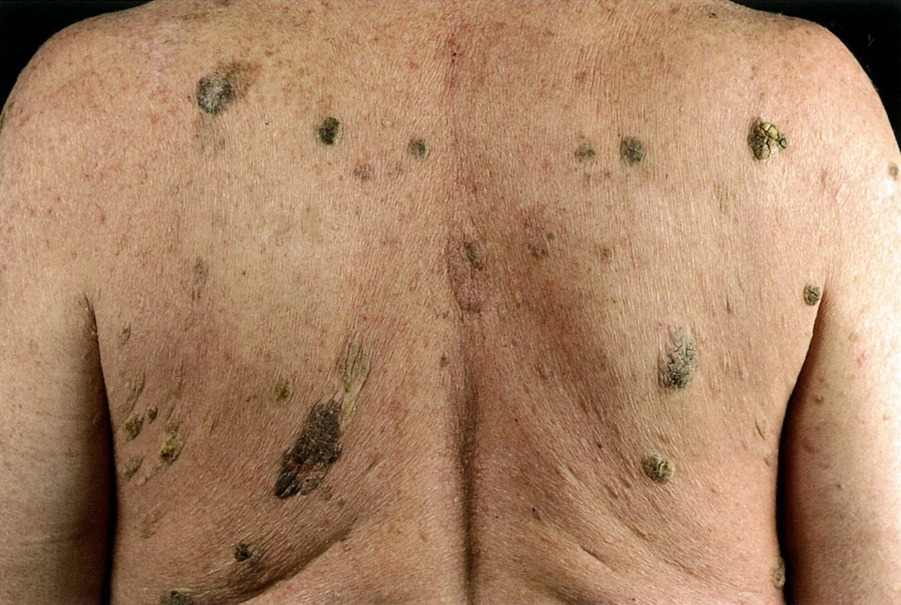

Seborrheic keratosis

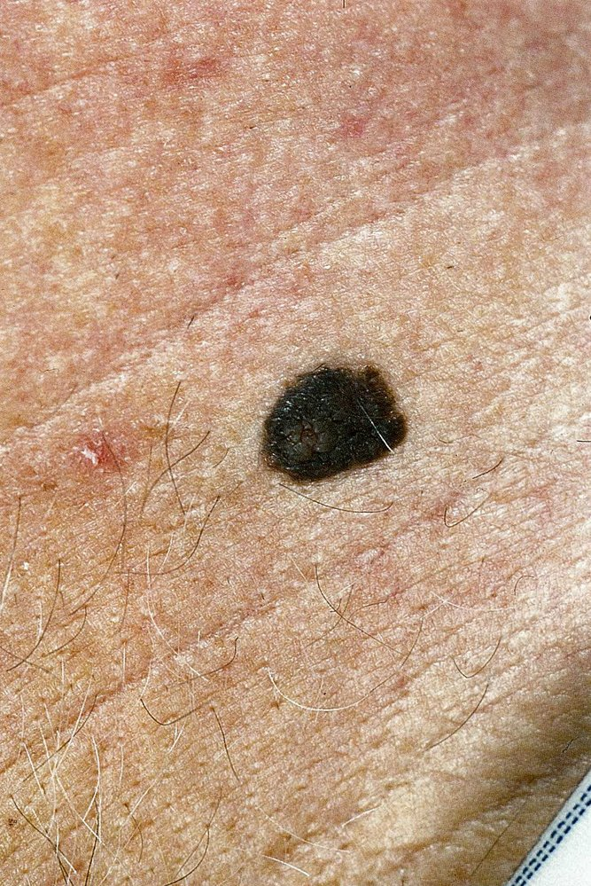

Seborrheic keratosis

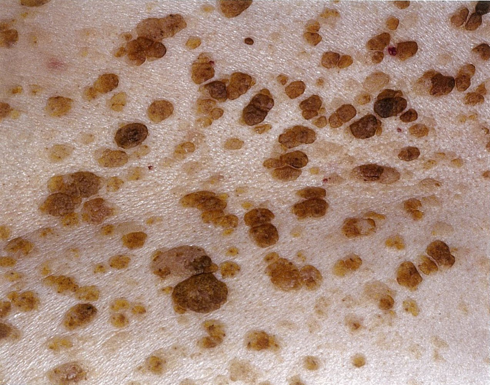

Seborrheic keratosis

### Diagnostics [[1]](https://coursology-qbank.com/amboss/article/Dz11Ej0)[[2]](https://coursology-qbank.com/amboss/article/lPWvUl0)

* Diagnosis is typically clinical; <u>horn cysts</u> on <u>dermatoscopy</u> are <u>pathognomonic</u>.

* <u>Excisional biopsy</u>: if <u>melanoma</u> is suspected

* Evaluation for underlying <u>malignancy</u> (see “<u>Diagnostics of cancer of unknown primary</u>”): indicated for patients with Leser-Trélat sign  [[3]](https://coursology-qbank.com/amboss/article/-u0DF3)

### <u>Histopathology</u> [[13]](https://coursology-qbank.com/amboss/article/mwWVjn0)

There are multiple histopathological variants of <u>seborrheic keratosis</u>. Features may include:

* Numerous monomorphic <u>keratinocytes</u> with papillomatosis

* Numerous <u>melanocytes</u>

* Immature <u>keratinocytes</u> with small <u>keratin</u>-filled cysts (horn cysts)

### Differential diagnoses [[1]](https://coursology-qbank.com/amboss/article/Dz11Ej0)[[2]](https://coursology-qbank.com/amboss/article/lPWvUl0)

* Macular lesions

* <u>Solar lentigo</u>

* <u>Actinic keratosis</u>

* <u>Papular</u> or <u>plaque</u> lesions

* <u>Atypical nevus</u>

* <u>Melanoma</u>

* Pigmented <u>basal cell carcinoma</u>

### Treatment [[1]](https://coursology-qbank.com/amboss/article/Dz11Ej0)

* Indicated for suspected <u>malignancy</u>, cosmetic reasons, or if symptoms are bothersome

* Options include:

* <u>Cryosurgery</u>

* <u>Curettage</u>

* <u>Electrodesiccation</u>

* <u>Laser ablation</u>

* Surgical excision (e.g., <u>shave excision</u>)

### Prognosis [[2]](https://coursology-qbank.com/amboss/article/lPWvUl0)

* No malignant potential

* Increase in number and size with age

---

## Dermatofibroma

### Definition [[2]](https://coursology-qbank.com/amboss/article/lPWvUl0)

A <u>dermatofibromas</u> is a common, small, benign <u>dermal</u> <u>nodule</u>.

### <u>Epidemiology</u> [[1]](https://coursology-qbank.com/amboss/article/Dz11Ej0)

* Most commonly occurs in individuals 20–50 years of age

* <u>♂</u> > <u>♀</u>

### Etiology [[1]](https://coursology-qbank.com/amboss/article/Dz11Ej0)

* Not fully understood

* Sometimes related to an <u>insect bite</u> or trauma

### Clinical features [[1]](https://coursology-qbank.com/amboss/article/Dz11Ej0)[[2]](https://coursology-qbank.com/amboss/article/lPWvUl0)

* Solitary or multiple firm <u>papules</u> or <u>nodules</u>  [[1]](https://coursology-qbank.com/amboss/article/Dz11Ej0)

* Most commonly on the lower extremities but can occur anywhere on the body

* <u>Lateral</u> compression (pinching) causes a central dimple in the lesion (dimple sign)

* Slow-growing (to ∼ 3–10 mm in diameter), then remain the same size for years

* Poorly dermarcated with faded margins

* Variable color (<u>skin</u>-colored, tan, pink, brown)

* Frequently asymptomatic

* May be pruritic or tender and may bleed with trauma

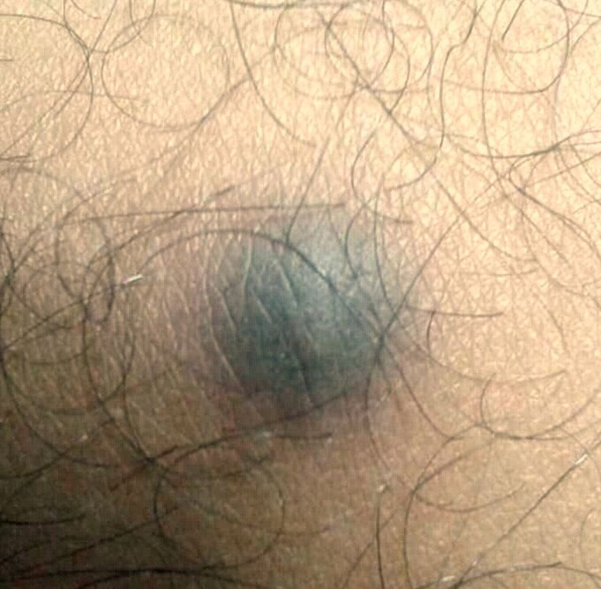

Dermatofibroma

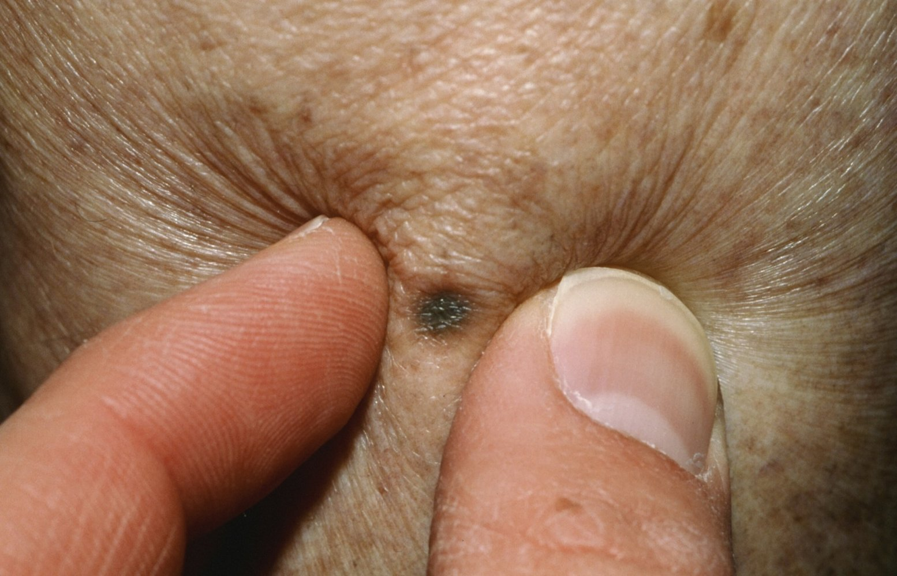

Dermatofibroma

### Diagnostics [[1]](https://coursology-qbank.com/amboss/article/Dz11Ej0)

* Diagnosis is typically clinical.

* <u>Excisional biopsy</u>: if <u>malignancy</u> is suspected

### <u>Histopathology</u> [[1]](https://coursology-qbank.com/amboss/article/Dz11Ej0)[[14]](https://coursology-qbank.com/amboss/article/ei1xqg0)

Typical features include <u>fibroblast</u> and <u>histiocyte</u> <u>proliferation</u>.

### Differential diagnoses [[1]](https://coursology-qbank.com/amboss/article/Dz11Ej0)[[2]](https://coursology-qbank.com/amboss/article/lPWvUl0)[[14]](https://coursology-qbank.com/amboss/article/ei1xqg0)

* Dermatofibrosarcoma protuberans

* <u>Nodular melanoma</u>

* <u>Kaposi sarcoma</u>

* <u>Carcinoma</u>, including <u>basal cell carcinoma</u>

* Benign conditions: cellular <u>dermatofibroma</u>, papulonodular mucinosis, blue <u>nevus</u>, <u>scar</u>, <u>pilar cyst</u>

### Treatment [[1]](https://coursology-qbank.com/amboss/article/Dz11Ej0)

* Indicated for suspected <u>malignancy</u>, cosmetic reasons, or if symptoms are bothersome

* Options include:

* <u>Cryosurgery</u>

* <u>Laser ablation</u>

* Punch excision

* Surgical excision

### Prognosis

* <u>Nodules</u> typically persist for years if untreated; in some cases, <u>nodules</u> spontaneously regress. [[14]](https://coursology-qbank.com/amboss/article/ei1xqg0)

* If removed, local recurrence may occur.  [[15]](https://coursology-qbank.com/amboss/article/WmWPeN0)

---

## Lipoma

### Definition [[1]](https://coursology-qbank.com/amboss/article/Dz11Ej0)

A <u>lipoma</u> is a common, benign, <u>soft tissue</u> <u>mesenchymal</u> <u>tumor</u>, usually subcutaneous.

### Etiology [[2]](https://coursology-qbank.com/amboss/article/lPWvUl0)[[3]](https://coursology-qbank.com/amboss/article/-u0DF3)

* Spontaneous

* May develop following trauma

* Rare disorders, e.g.:

* Familial multiple lipomatosis (an <u>autosomal-dominant</u> disorder characterized by multiple <u>lipomas</u>)

* <u>Dercum disease</u>

### <u>Epidemiology</u> [[1]](https://coursology-qbank.com/amboss/article/Dz11Ej0)

* Most common <u>soft tissue</u> <u>tumor</u>

* <u>Prevalence</u>: 1%

### Clinical features [[1]](https://coursology-qbank.com/amboss/article/Dz11Ej0)[[16]](https://coursology-qbank.com/amboss/article/vnWAEN0)

* Single or multiple round, soft, rubbery mobile, discrete <u>nodules</u> or masses

* Typically on the trunk, neck, and/or extremities

* Slow-growing; typically < 6 cm in diameter, but may be larger

* <u>Skin</u>-colored

* Typically nontender and asymptomatic, but large lesions may cause compressive and/or obstructive symptoms  [[1]](https://coursology-qbank.com/amboss/article/Dz11Ej0)

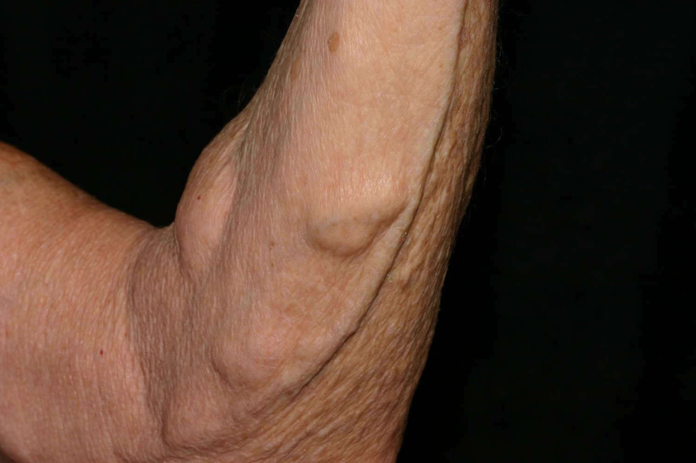

Lipomas

### Diagnostics [[1]](https://coursology-qbank.com/amboss/article/Dz11Ej0)[[17]](https://coursology-qbank.com/amboss/article/QmWu2N0)[[18]](https://coursology-qbank.com/amboss/article/wEWhBM0)

* Diagnosis is typically clinical.

* <u>Ultrasound</u> can help confirm the diagnosis.   [[19]](https://coursology-qbank.com/amboss/article/DEW1BM0)

* Obtain an <u>MRI</u> (preferred) or CT with and without IV contrast for further evaluation if:

* Mass is > 5 cm

* Mass is;  deep to the <u>fascia</u> (on examination, may be firm or fixed instead of freely mobile)

* Other features are concerning for <u>malignancy</u> (e.g., mass is rapidly growing or located on the thigh, older age)

* If <u>MRI</u> or CT findings are not consistent with a <u>lipoma</u>, refer to a <u>multidisciplinary sarcoma center</u> for further management.

> [!WARNING]
> Refer directly to a <u>multidisciplinary sarcoma team</u> if clinical features strongly suggest <u>soft tissue sarcoma</u> (i.e., mass > 5 cm and/or increasing size, associated <u>pain</u>, and/or deep site). [[20]](https://coursology-qbank.com/amboss/article/WLdP9q0)

### <u>Histopathology</u> [[1]](https://coursology-qbank.com/amboss/article/Dz11Ej0)[[17]](https://coursology-qbank.com/amboss/article/QmWu2N0)

* Normal mature <u>adipocytes</u> of <u>mesenchymal</u> origin

* Fibrous capsule

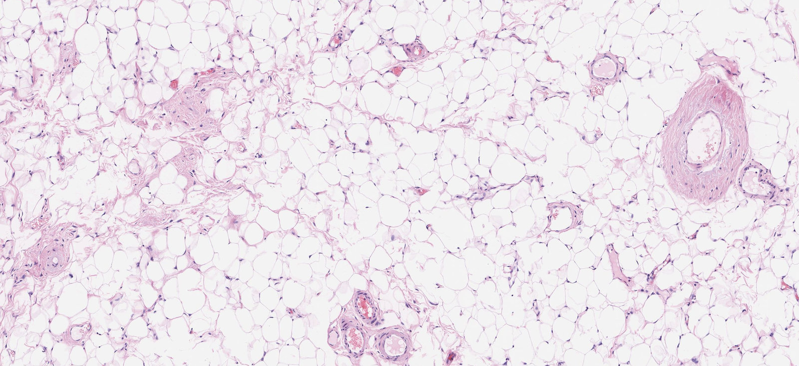

Lipoma

### Differential diagnoses [[1]](https://coursology-qbank.com/amboss/article/Dz11Ej0)

* <u>Liposarcoma</u>

* <u>Epidermal inclusion cyst</u>

* <u>Abscess</u>

* Deep <u>hemangioma</u>

### Treatment

* Indicated for suspected <u>malignancy</u>, cosmetic reasons, or if symptoms are bothersome [[1]](https://coursology-qbank.com/amboss/article/Dz11Ej0)[[3]](https://coursology-qbank.com/amboss/article/-u0DF3)[[17]](https://coursology-qbank.com/amboss/article/QmWu2N0)

* Options include:

* Minimal <u>incision</u> extraction

* Surgical excision

* <u>Liposuction</u> [[3]](https://coursology-qbank.com/amboss/article/-u0DF3)

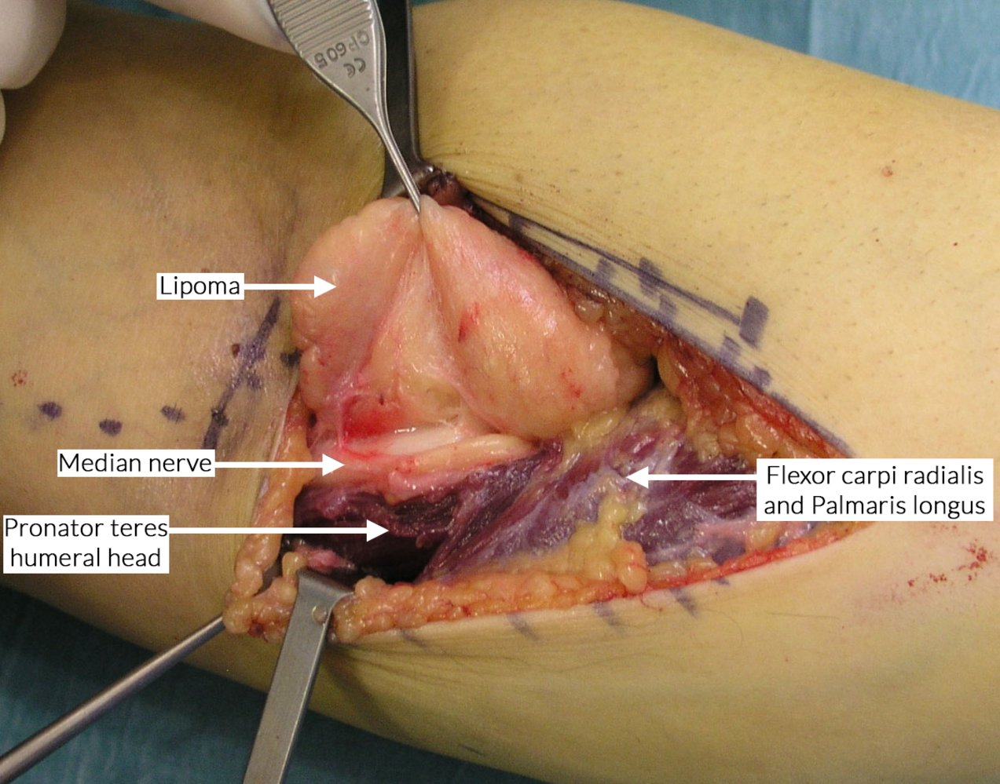

Excision of an intermuscular lipoma

### Prognosis [[17]](https://coursology-qbank.com/amboss/article/QmWu2N0)

* No malignant potential

* If excised, recurrence occurs in < 5% of cases.

---

## Acrochordon (skin tag)

### Definition [[1]](https://coursology-qbank.com/amboss/article/Dz11Ej0)

An <u>acrochordon</u> is a small, sometimes slightly discolored papillomatous <u>skin</u> lesion that most commonly arises in <u>skin</u> folds.

### <u>Epidemiology</u> [[1]](https://coursology-qbank.com/amboss/article/Dz11Ej0)

* Commonly occurs in adults > 50 years of age

* <u>Prevalence</u>: 25–45%

### Etiology [[1]](https://coursology-qbank.com/amboss/article/Dz11Ej0)

* Thought to be caused by frequent irritation, e.g., <u>skin</u> rubbing on <u>skin</u>

* Associated with:

* Hormonal changes (e.g., <u>pregnancy</u>, <u>acromegaly</u>)

* <u>Metabolic syndrome</u> (e.g., <u>obesity</u>, <u>type 2 diabetes mellitus</u>)

* Perianal <u>acrochordons</u> are associated with <u>Crohn disease</u>. [[25]](https://coursology-qbank.com/amboss/article/JZWscP0)[[26]](https://coursology-qbank.com/amboss/article/p4WL4l0)

### Clinical features [[1]](https://coursology-qbank.com/amboss/article/Dz11Ej0)[[2]](https://coursology-qbank.com/amboss/article/lPWvUl0)

* Smooth, round or oval <u>pedunculated</u> <u>papule</u> on a narrow stalk

* Found in locations <u>prone</u> to friction (e.g., lower neck, <u>axilla</u>, inframammary fold, inguinal regions)

* 2–5 mm in height, may be larger [[1]](https://coursology-qbank.com/amboss/article/Dz11Ej0)

* Well-demarcated

* <u>Skin</u>-colored or darker

* Typically asymptomatic

Acrochordons (skin tags)

### Diagnostics [[1]](https://coursology-qbank.com/amboss/article/Dz11Ej0)

* Diagnosis is typically clinical.

* <u>Excisional biopsy</u>: if <u>malignancy</u> is suspected

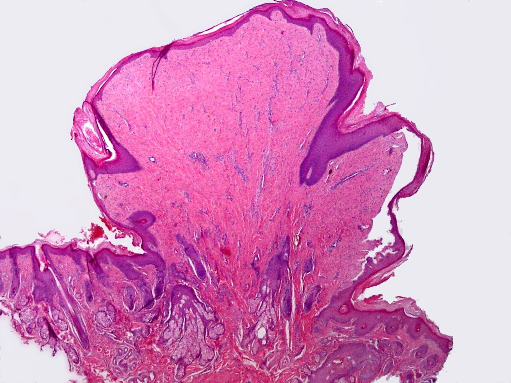

Acrochordon

### Differential diagnoses [[1]](https://coursology-qbank.com/amboss/article/Dz11Ej0)

* <u>Seborrheic keratosis</u>

* <u>Neurofibromas</u>

* Senescent intradermal <u>nevus</u>, <u>pedunculated</u> <u>nevus</u>

* <u>Basal cell carcinoma</u>, <u>squamous cell carcinoma</u>

### Treatment [[1]](https://coursology-qbank.com/amboss/article/Dz11Ej0)[[3]](https://coursology-qbank.com/amboss/article/-u0DF3)

* Indicated for cosmetic reasons or if symptoms are bothersome

* Options include:

* Surgical excision (e.g., <u>shave excision</u> or with scissors)

* <u>Cryosurgery</u>

* <u>Electrodesiccation</u>

> [!TIP]
> Refer patients with <u>eyelid</u> lesions to dermatology or plastic <u>surgery</u> for removal. [[1]](https://coursology-qbank.com/amboss/article/Dz11Ej0)

---

## Cysts

### Epidermoid cyst [[1]](https://coursology-qbank.com/amboss/article/Dz11Ej0)[[2]](https://coursology-qbank.com/amboss/article/lPWvUl0)[[8]](https://coursology-qbank.com/amboss/article/Wk1P5S0)

<u>Epidermoid cysts</u> are also called <u>epidermal inclusion cysts</u>, <u>epidermal cysts</u>, and <u>keratin cysts</u>.  [[1]](https://coursology-qbank.com/amboss/article/Dz11Ej0)

#### Definition

An <u>epidermoid cyst</u> is an encapsulated lesion containing <u>keratin</u> and lipids and lined with <u>stratified</u> <u>squamous epithelium</u>.

#### <u>Epidemiology</u>

* Typically occurs in adulthood

* Most common cutaneous cyst

#### Etiology

The etiology involves the implantation of <u>epithelium</u> within the <u>dermis</u>.

#### Clinical features

* Dome-shaped, firm, mobile, <u>dermal</u> to subcutaneous <u>nodule</u> or mass

* Typically a solitary lesion found on the face, head, neck, trunk, and/or genitals

* Grows slowly over years or remains stable (∼ 0.5–5 cm) [[2]](https://coursology-qbank.com/amboss/article/lPWvUl0)

* Well-demarcated

* <u>Skin</u>-colored with a central black punctum, <u>erythematous</u> when inflamed

* Does not dimple when pinched

* Typically painless; painful if ruptured, which may subsequently lead to infection

* Cyst contents: thick cream-colored keratinaceous material with an unpleasant odor

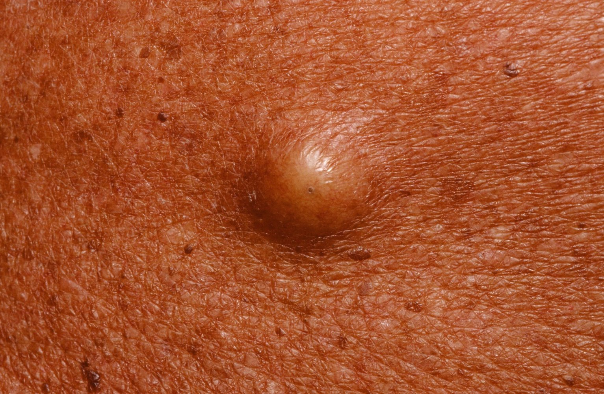

Epidermoid cyst

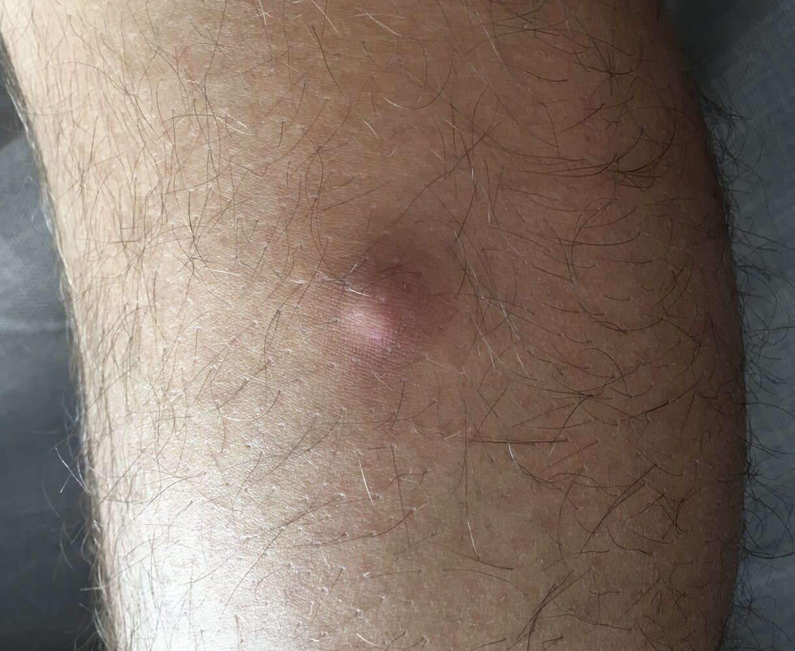

Epidermoid cyst

#### Diagnostics

* Diagnosis is typically clinical.

* <u>Incision and drainage</u>: if infection is suspected [[3]](https://coursology-qbank.com/amboss/article/-u0DF3)

* <u>Excisional biopsy</u>: if <u>malignancy</u> is suspected

#### Differential diagnosis

* <u>Lipoma</u>

* Infection: <u>boil</u>, <u>abscess</u>  [[1]](https://coursology-qbank.com/amboss/article/Dz11Ej0)

* Other cysts: e.g., <u>trichilemmal cyst</u>, <u>sebaceous cyst</u>

#### Treatment

* Asymptomatic cysts do not require treatment.

* For cysts on the face: Refer to dermatology or plastic <u>surgery</u>.

* Ruptured or inflamed cysts:

* May resolve spontaneously (but frequently recur)

* Intralesional <u>steroids</u> (e.g., <u>triamcinolone</u>) may accelerate resolution

* Infected cysts: <u>antibiotics</u>, <u>incision and drainage</u>

* Surgical excision is performed:

* If desired for cosmetic reasons or bothersome symptoms

* After resolution of a ruptured, inflamed, or infected cyst to prevent recurrence

* If lesions occur in multiple and/or in atypical locations (e.g., fingers, toes, legs), evaluate for <u>Gardner syndrome</u>.

> [!WARNING]
> Cysts occurring on the face should be referred to a dermatologist or plastic <u>surgeon</u>. [[1]](https://coursology-qbank.com/amboss/article/Dz11Ej0)

### Trichilemmal cyst (<u>pilar cyst</u>) [[2]](https://coursology-qbank.com/amboss/article/lPWvUl0)[[8]](https://coursology-qbank.com/amboss/article/Wk1P5S0)

#### Definition:

A <u>trichilemmal cyst</u> is a cyst that forms around a <u>hair follicle</u>.

#### <u>Epidemiology</u>

* Second most common <u>skin</u> cyst

* Commonly occur in middle-aged females

#### Etiology

Etiology may be genetic.

#### Clinical features

* Dome-shaped, firm, mobile, subcutaneous <u>nodule</u> or mass [[2]](https://coursology-qbank.com/amboss/article/lPWvUl0)[[8]](https://coursology-qbank.com/amboss/article/Wk1P5S0)

* Often multiple lesions, most commonly located on the scalp

* 0.5–5 cm [[2]](https://coursology-qbank.com/amboss/article/lPWvUl0)

* Well-demarcated

* <u>Skin</u>-colored with no central punctum

* Painful if infected or inflamed

* Cyst contents: dense keratinaceous material

#### Diagnostics

* Diagnosis is typically clinical.

* Culture: if infection is suspected

* <u>Excisional biopsy</u>: if <u>malignancy</u> is suspected

#### Differential diagnosis [[27]](https://coursology-qbank.com/amboss/article/B7WzL50)

* Other cysts, e.g., <u>epidermoid cyst</u>, <u>sebaceous cyst</u>

* <u>Basal cell carcinoma</u> (especially nodular), <u>squamous cell carcinoma</u>

#### Treatment

Treatment consists of surgical excision.

---