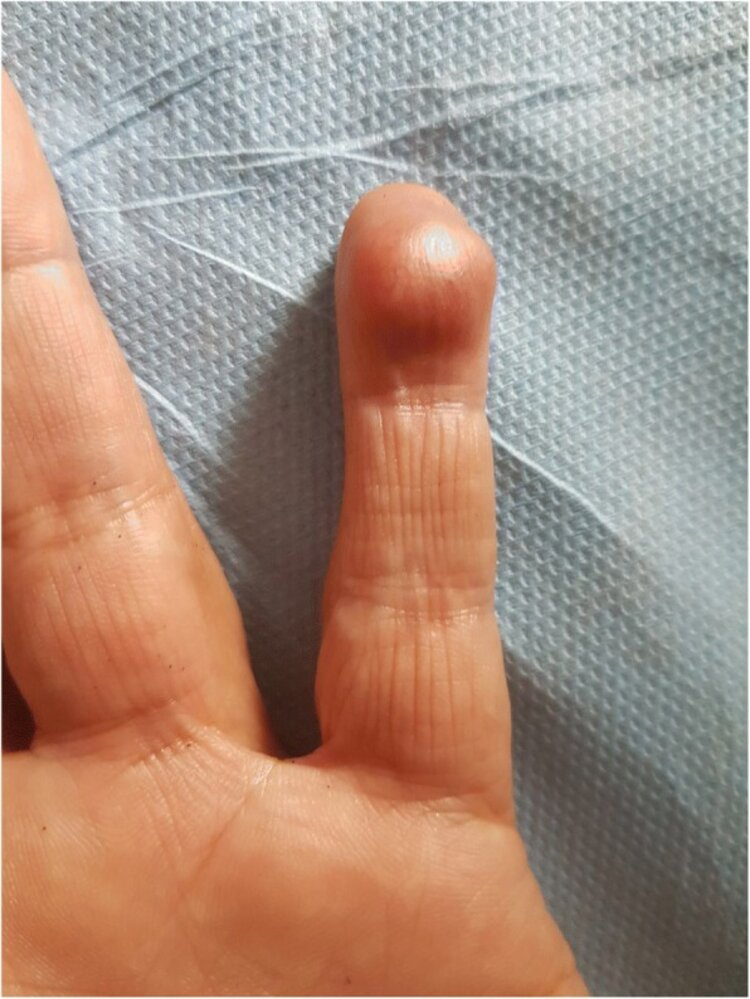

# Glomus tumors

*Categories: Clinical knowledge > Dermatology > Neoplastic disorders > Glomus tumors*

[Original Article Link](https://coursology-qbank.com/amboss/article/oj00YT)

---

## Summary

<u>Glomus</u> tumors are rare, benign, painful, blue-red <u>soft tissue</u> <u>neoplasms</u> originating from <u>glomus bodies</u> in the <u>skin</u>. They typically present in adults 20–40 years and are most commonly found in the <u>distal</u> extremities under the <u>nails</u>. Management consists of surgical excision of the lesion, which usually leads to complete resolution. Malignant <u>glomus</u> tumors and <u>metastases</u> are exceedingly rare.

---

## Epidemiology

* ∼ 1–5% of all <u>soft tissue</u> tumors of the arms

* Age

* Solitary <u>glomus</u> tumors: 20–40 years

* Multiple <u>glomus</u> tumors

* More common in children

* Some are congenital

Epidemiological data refers to the US, unless otherwise specified.

---

## Pathophysiology

* <u>Glomus</u> tumors are benign, hamartomatous proliferations of modified <u>smooth muscle cells</u> that originate from glomus bodies.

* <u>Glomus bodies</u> are located in the <u>skin</u>, mainly of the fingers and toes, and are involved in temperature regulation.

* They contain specialized arteriovenous <u>anastomoses</u> that shunt blood away from the <u>skin</u> surface in cold weather to prevent <u>heat loss</u> and towards the <u>skin</u> surface in hot weather to promote heat dissipation.

* Malignant transformation (glomangiosarcoma) is extremely rare and typically locally infiltrating.

---

## Clinical features

* Small (< 2 cm), blue-red <u>nodules</u> or <u>papules</u> in the hand, foot, and under fingernails

* Severe focal <u>paroxysmal</u> <u>pain</u>, tenderness, and cold <u>sensitivity</u>

* Solitary (common) or multiple findings (rare) [[1]](https://coursology-qbank.com/amboss/article/62Yjio)

* Multiple <u>glomus</u> tumors (glomangiomas or glomuvenous <u>malformations</u>) account for < 10% of cases

* Tumors can be distributed over the whole body and are usually asymptomatic.

Glomus tumor

---

## Diagnosis

* Overview

* <u>Glomus</u> tumors are <u>diagnosed clinically</u>.

* Imaging procedures assess the size and exact location, while findings of <u>glomus</u> cells in the excised <u>tumor</u> confirm the diagnosis. [[2]](https://coursology-qbank.com/amboss/article/8A0Oli)

* <u>Histology</u>

* Uniformly round, small <u>glomus</u> cells

* Pale eosinophilic <u>cytoplasm</u> associated with vasculature

* <u>Plain radiography</u>: bony <u>erosions</u> in subungual lesions

* <u>Color-duplex ultrasonography</u>

* Determines exact size and location of <u>tumor</u>

* Shows a <u>hypoechoic</u> <u>nodule</u> with prominent vascularity

---

## Differential diagnoses

* <u>Infantile hemangioma</u>

* Venous <u>malformations</u>

The differential diagnoses listed here are not exhaustive.

---

## Treatment

* Total surgical excision of the lesion

* Recurrence is rare.

---