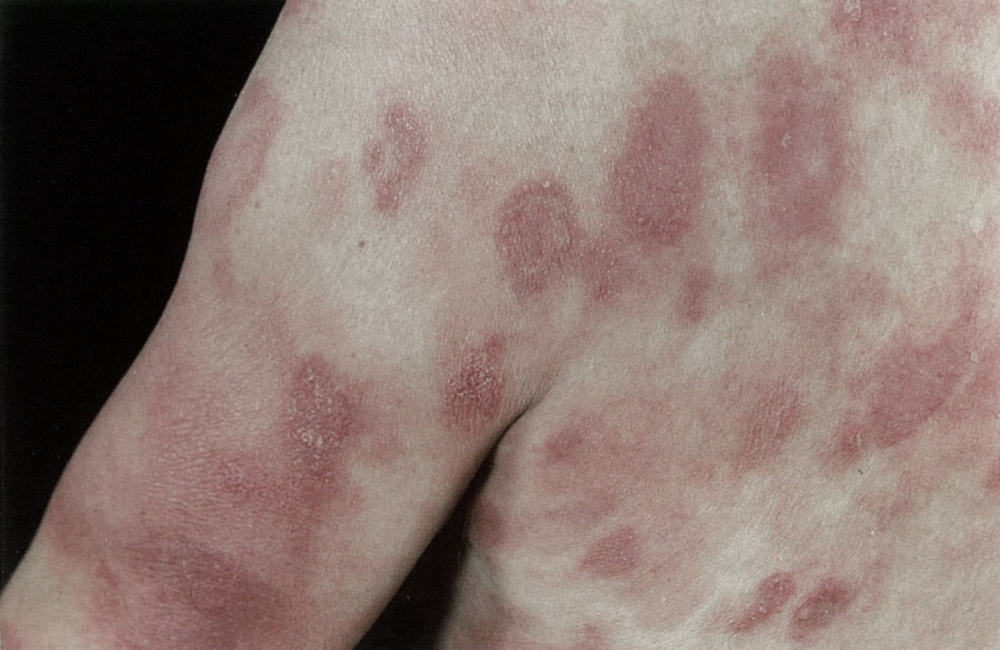
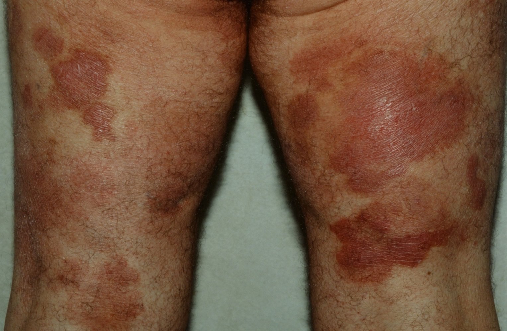
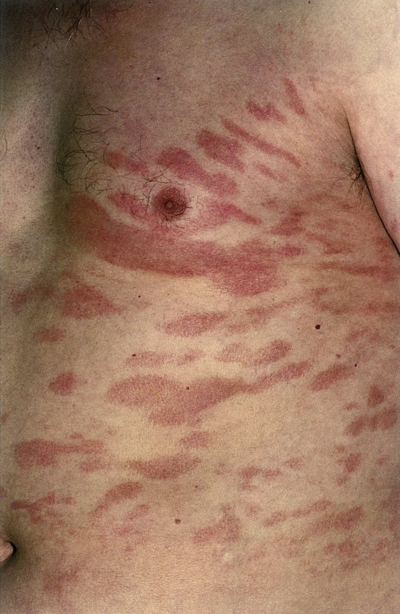
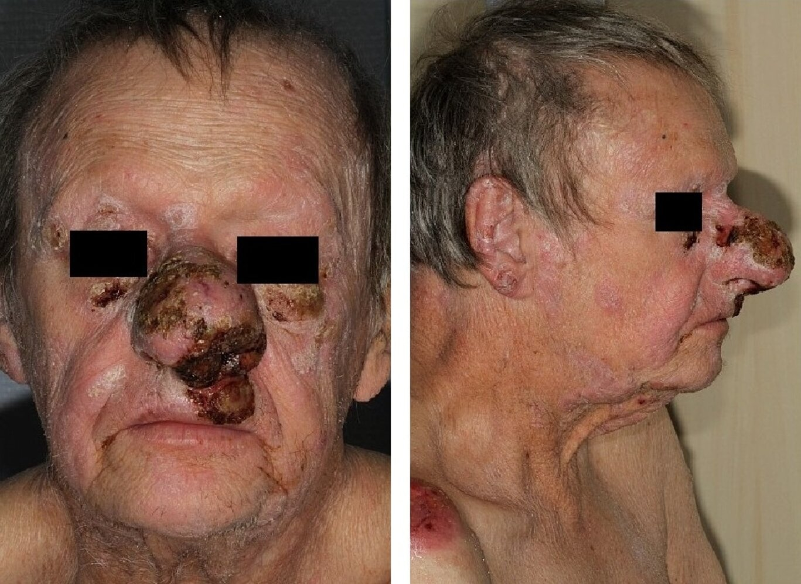
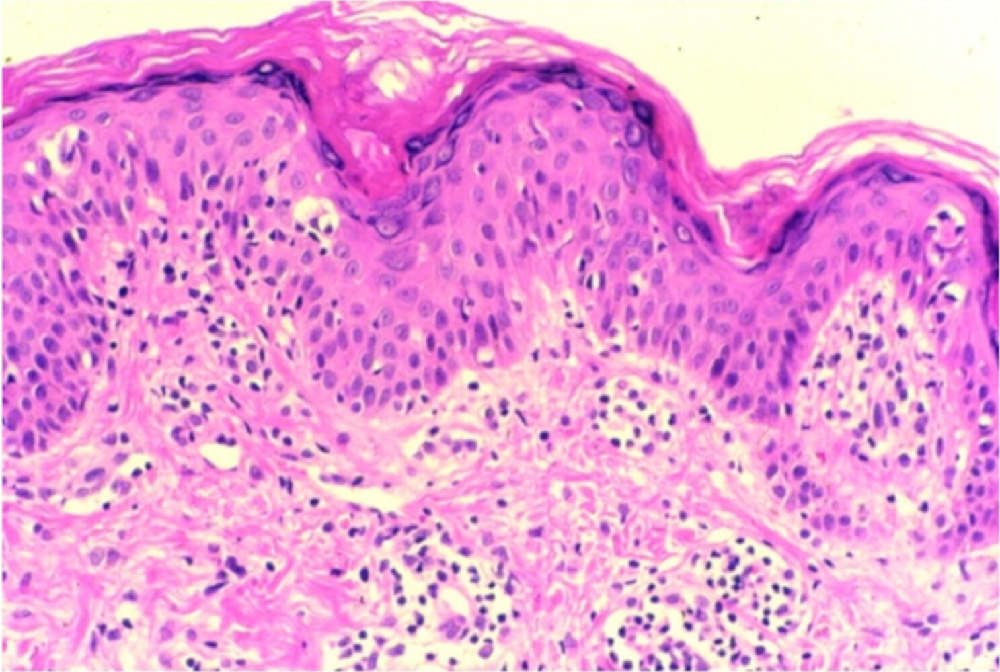
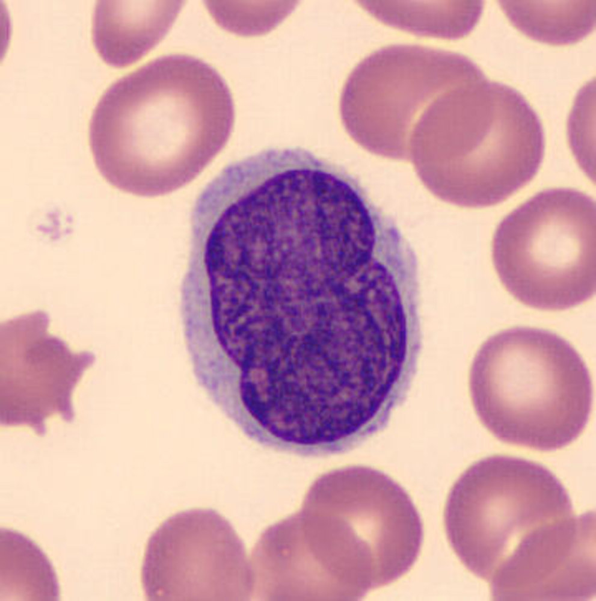

# Mycosis fungoides

*Categories: Clinical knowledge > Dermatology > Neoplastic disorders > Mycosis fungoides*

[Original Article Link](https://coursology-qbank.com/amboss/article/oT0072)

---

## Summary

Mycosis fungoides is the most common type of <u>cutaneous T-cell lymphoma</u>. Due to its nonspecific features, mycosis fungoides is often initially mistaken for other <u>skin</u> conditions. Patients commonly present with pruritic <u>cutaneous plaques</u> and patches, which can progress to nodular tumors and/or systemic involvement in advanced disease. Histopathological findings can be difficult to detect. Characteristic findings on <u>skin</u> <u>punch biopsy</u> include <u>atypical lymphocytes</u> in the upper <u>dermis</u> or aggregates in the <u>epidermis</u> (<u>Pautrier microabscesses</u>). Most cases do not progress beyond early-stage disease. In early stages, several options, including <u>topical corticosteroids</u> and <u>phototherapy</u>, can improve symptoms. In advanced disease, a combination of systemic therapy and <u>skin</u>-directed treatment can provide palliative relief.

---

## Epidemiology

* <u>Incidence</u> [[1]](https://coursology-qbank.com/amboss/article/NYX-69)[[2]](https://coursology-qbank.com/amboss/article/mYXVp9)

* Approx. 4% of <u>non-Hodgkin lymphoma</u> cases

* Mycosis fungoides and <u>Sézary syndrome</u> are the two most common <u>cutaneous T-cell lymphomas</u> (<u>CTCL</u>).

* Age: mostly middle-aged or older adults

* Sex: <u>♂</u> > <u>♀</u>

Epidemiological data refers to the US, unless otherwise specified.

---

## Clinical features

* Cutaneous lesions: variable presentation, often accompanied by severe <u>pruritus</u> [[3]](https://coursology-qbank.com/amboss/article/JTds760)

* <u>Erythematous</u> <u>cutaneous plaques</u> and patches in non-sun-exposed areas, which may be <u>hyperpigmented</u> or <u>hypopigmented</u>    [[4]](https://coursology-qbank.com/amboss/article/YTdn660)

* Nodular tumors: often discolored and can ulcerate [[5]](https://coursology-qbank.com/amboss/article/J3dsjp0)

* Diffuse <u>erythroderma</u>

* Extracutaneous involvement: <u>lymphadenopathy</u>, <u>hepatosplenomegaly</u>, and involvement of other extracutaneous sites in advanced disease [[3]](https://coursology-qbank.com/amboss/article/JTds760)

> [!TIP]
> Loss of the <u>skin</u> barrier can result in <u>skin and soft tissue infections</u>, which can lead to systemic infection.

Mycosis fungoides

Mycosis fungoides

Cutaneous T-cell lymphoma

Mycosis fungoides

---

## Diagnosis

Consider mycosis fungoides in patients with persistent and/or progressive clinical features, especially if treatment for an alternative diagnosis was unsuccessful. Refer to dermatology for diagnostic testing. [[3]](https://coursology-qbank.com/amboss/article/JTds760)

* Punch <u>biopsies</u> of <u>skin</u> lesions: for diagnostic confirmation based on <u>histopathology</u>, <u>immunohistochemistry</u>, and <u>genetic testing</u>  [[4]](https://coursology-qbank.com/amboss/article/YTdn660)

* <u>Laboratory studies</u>

* <u>CBC with differential</u>, <u>CMP</u>, <u>LDH</u>: to rule out other <u>lymphoproliferative disorders</u> and establish a baseline before treatment  [[6]](https://coursology-qbank.com/amboss/article/bTdH660)

* Consider peripheral blood <u>flow cytometry</u>, e.g., to evaluate for <u>Sézary syndrome</u>.

* Imaging studies [[3]](https://coursology-qbank.com/amboss/article/JTds760)

* To evaluate for extracutaneous disease as part of staging

* May include CT neck, chest, abdomen, and <u>pelvis</u> ± <u>FDG-PET scan</u>

* <u>Lymph node</u> <u>biopsy</u>: Perform an <u>excisional biopsy</u> of <u>enlarged lymph nodes</u> to evaluate for infiltration. [[6]](https://coursology-qbank.com/amboss/article/bTdH660)

> [!TIP]
> Initial misdiagnosis is common because mycosis fungoides has varied and nonspecific features.

---

## Pathology

* <u>Histopathology</u> [[4]](https://coursology-qbank.com/amboss/article/YTdn660)

* Atypical <u>T cells</u> with <u>cerebriform</u> <u>nuclei</u> infiltrating the <u>dermis</u> and <u>epidermis</u> [[5]](https://coursology-qbank.com/amboss/article/J3dsjp0)

* Pautrier microabscesses: aggregates of atypical <u>CD4+ T cells</u> within the <u>epidermis</u> that are indicative of mycosis fungoides  [[7]](https://coursology-qbank.com/amboss/article/5YXip9)

* <u>Immunohistochemistry</u>: Mycosis fungoides <u>tumor</u> cells are often <u>CD4+</u> and <u>CD8</u>- and frequently lose expression of other pan-<u>T-cell</u> <u>antigens</u>.  [[3]](https://coursology-qbank.com/amboss/article/JTds760)

Pautrier microabscesses

---

## Differential diagnoses

* <u>Eczema</u>

* <u>Psoriasis</u>

* <u>Cutaneous drug reactions</u>

* Other <u>T-cell</u> <u>lymphoproliferative disorders</u>

* <u>Sézary syndrome</u>

* <u>Adult T-cell leukemia-lymphoma</u>

### Sézary syndrome

* Definition: a <u>cutaneous T-cell lymphoma</u> with <u>leukemic</u> dissemination of mutated <u>T cells</u>

* <u>Epidemiology</u> [[8]](https://coursology-qbank.com/amboss/article/MYXMp9)

* Exact <u>prevalence</u> unknown

* Can be an advanced form of mycosis fungoides or arise de novo

* Clinical features

* Systemic <u>skin</u> lesions

* <u>Erythroderma</u> accompanied by <u>palmar</u> and <u>plantar</u> <u>hyperkeratosis</u>

* Intense <u>pruritus</u>

* <u>Generalized lymphadenopathy</u>

* Diagnostics: : based on the characteristic triad of pruritic <u>erythroderma</u>, <u>lymphadenopathy</u>, and atypical <u>T cells</u> (Sézary cells) on <u>peripheral blood smear</u>   [[9]](https://coursology-qbank.com/amboss/article/nYX7p9)

> [!TIP]
> The <u>leukemic</u> dissemination present in <u>Sézary syndrome</u> distinguishes it from mycosis fungoides.

Sézary Cell

### Adult T-cell leukemia-lymphoma (<u>ATLL</u>) [[10]](https://coursology-qbank.com/amboss/article/WbXPs9)

* Definition: a <u>non-Hodgkin lymphoma</u> associated with infection with the <u>human T-cell lymphotropic virus</u> I (<u>HTLV</u>-I)

* <u>Epidemiology</u>

* Rare in the US; most commonly seen in Japan, West Africa, and the Caribbean

* Associated with IV drug use

* Clinical features

* <u>Generalized lymphadenopathy</u>

* <u>Hepatosplenomegaly</u>

* <u>Skin</u> lesions: may be similar to those seen in mycosis fungoides

* Lytic bone lesions

* Diagnostics

* <u>Peripheral blood smear</u>: <u>lymphocytes</u> with condensed <u>chromatin</u> and hyperlobulated <u>nuclei</u> that resemble clover leaves

* Laboratory tests: <u>hypercalcemia</u>, ↑ <u>LDH</u>

* <u>Immunophenotype</u>: stain positive for CD2, <u>CD4</u>, CD5, CD29, and CD45RO

The differential diagnoses listed here are not exhaustive.

---