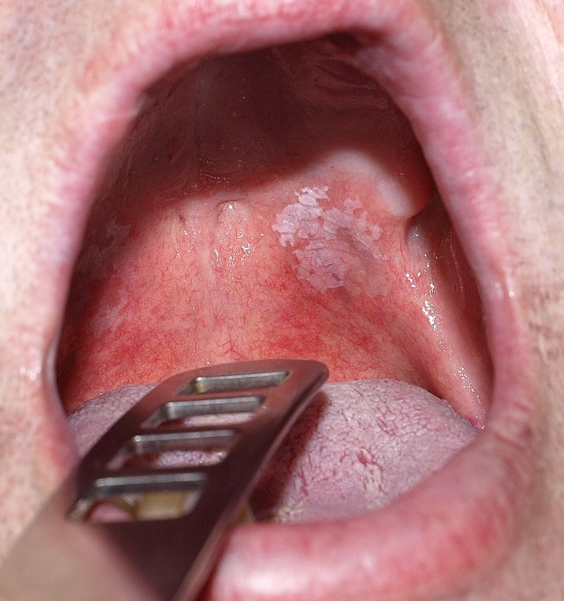
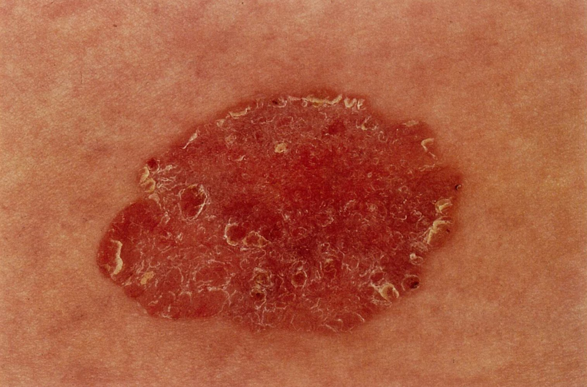
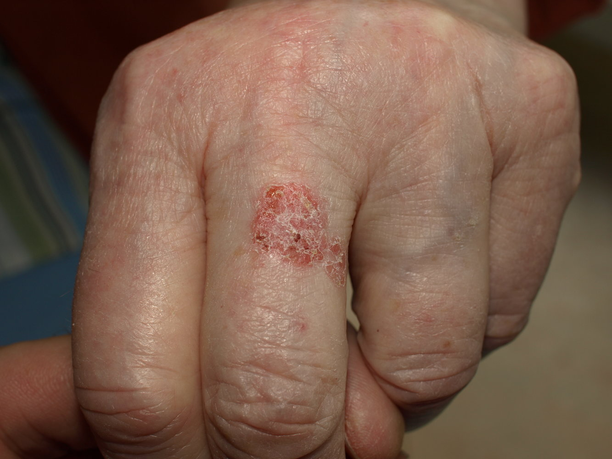
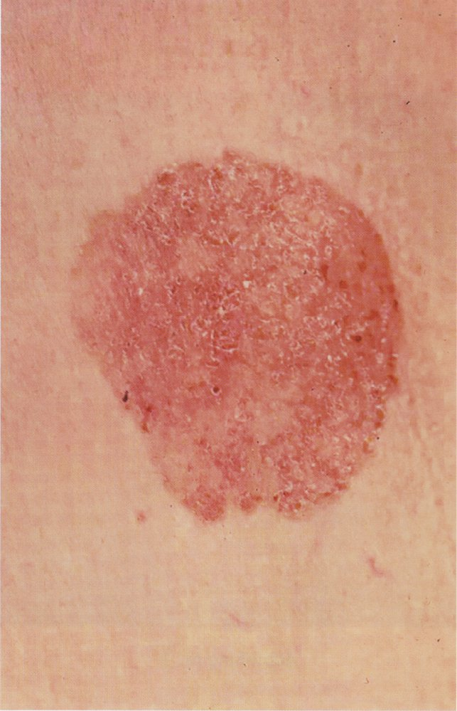
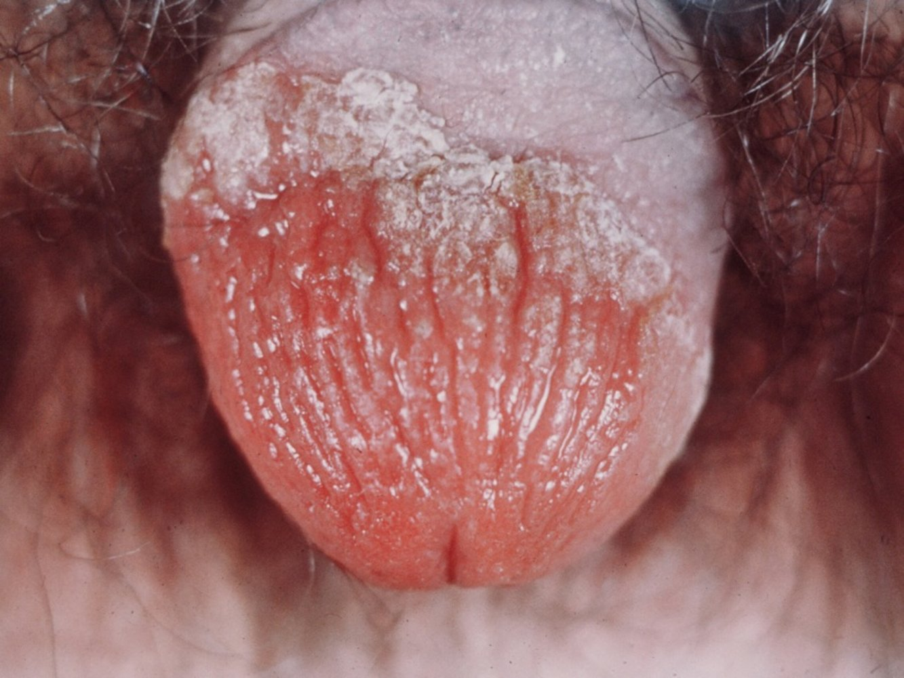

# Precancerous skin lesions

*Categories: Clinical knowledge > Dermatology > Neoplastic disorders > Precancerous skin lesions*

[Original Article Link](https://coursology-qbank.com/amboss/article/pk0LKT)

---

## Summary

Precancerous <u>skin</u> lesions refer to various dermatological growths that are at an increased risk of developing into <u>skin</u> cancer. Typical precancerous <u>skin</u> lesions include <u>lentigo maligna</u>, which may develop into <u>malignant melanoma</u>, and <u>actinic keratosis</u>, which may develop into <u>squamous cell carcinoma</u>. There is also a risk of <u>leukoplakia</u> – presenting in the <u>oral cavity</u> as white <u>plaques</u> – progressing to <u>squamous cell carcinoma</u>. <u>Bowen disease</u> and <u>erythroplasia of Queyrat</u> are less common types of precancerous <u>skin</u> lesions and are often associated with the <u>human papillomavirus</u> (<u>HPV</u>). To prevent malignant transformation, surgical excision is usually the treatment of choice.

<u>Actinic keratosis</u> and <u>bowenoid papulosis</u> are detailed separately.

---

## Overview

| Overview of premalignant mucocutaneous conditions |  |  |  |  |  |
| --- | --- | --- | --- | --- | --- |
| Condition |  | Key features |  | <u>Neoplasms</u> |  |
|  <u>Actinic keratosis</u>    |  |   * Small lesion with sandpaper-like texture  * Lesions grow and become brown or <u>erythematous</u> and scaly    |  |  * <u>Squamous cell carcinoma of the skin</u>   |  |
|  <u>Bowen disease</u>    |  |   * <u>Erythematous</u> and scaly  * Irregularly shaped with sharply defined borders    |  |  |  |
|  <u>Leukoplakia</u>    |  |  * Persistent white <u>plaques</u> that usually cannot be scraped off (predominantly affects <u>oral cavity</u>)   |  |  * Squamous cell <u>carcinoma of the oral cavity</u>   |  |
|  <u>Erythroplasia of Queyrat</u>    |  |   * Single or multiple sharply demarcated, non-healing lesions  * Ulcerate and bleed easily    |  |  * Squamous cell <u>carcinoma of the penis</u>   |  |
|  <u>Lentigo maligna</u>    |  |   * Darkly pigmented <u>macule</u> with irregular borders on sun exposed <u>skin</u>  * Gradual growth, color irregularities, surrounding "island-like" speckling    |  |  * <u>Lentigo maligna melanoma</u>   |  |
|  <u>Dysplastic nevi</u>    |  |  * <u>ABCDE criteria</u>   |  |  * <u>Malignant melanoma</u>   |  |
|  <u>Xeroderma pigmentosum</u>    |  |  * Defective <u>DNA repair mechanisms</u> → slow healing, <u>blistering</u> <u>burns</u> after minimal exposure to sunlight, <u>solar lentigos</u>, <u>xerosis</u>, <u>poikiloderma</u>, and <u>telangiectasia</u>   |  |  * <u>Skin</u> cancer (<u>basal cell carcinoma</u>, <u>cutaneous squamous cell carcinoma</u>, <u>melanoma</u>)   |  |

---

## Leukoplakia

* Definition: <u>hyperkeratosis</u> of the <u>epithelium</u> and <u>mucous membranes</u> [[1]](https://coursology-qbank.com/amboss/article/l40vjT)[[2]](https://coursology-qbank.com/amboss/article/N40-jT)[[3]](https://coursology-qbank.com/amboss/article/m40VPT)

* Etiology

* <u>Tobacco smoking</u>

* <u>Alcohol</u> consumption

* Lesion [[4]](https://coursology-qbank.com/amboss/article/ZvWZAM0)

* Most commonly affects the <u>oral cavity</u>

* Persistent white <u>plaques</u> that usually cannot be scraped off

* Homogeneous appearance: uniform texture, well-defined margins

* Nonhomogeneous appearance (e.g., <u>erythroleukoplakia</u>) : Irregular texture, can be speckled, nodular, granular, and/or <u>verrucous</u>

* Diagnostics: All oral <u>leukoplakia</u> lesions must be biopsied to evaluate the grade of <u>dysplasia</u> and to exclude differential diagnoses.  [[5]](https://coursology-qbank.com/amboss/article/_EW5yM0)[[6]](https://coursology-qbank.com/amboss/article/zEWryM0)

* Pathology

* <u>Hyperkeratosis</u>, <u>parakeratosis</u>, <u>acanthosis</u>, and/or <u>epithelial</u> <u>atrophy</u>

* Low-grade <u>dysplasia</u> is possible.

* Differential diagnosis: <u>oral hairy leukoplakia</u> in <u>immunocompromised individuals</u>

* Treatment

* <u>Smoking cessation</u>

* <u>Cryotherapy</u>, <u>laser ablation</u>

* If lesions persist: surgical excision

* Follow-up: lifelong annual follow-up with <u>biopsy</u> of all recurrent or new <u>leukoplakia</u>  [[6]](https://coursology-qbank.com/amboss/article/zEWryM0)[[7]](https://coursology-qbank.com/amboss/article/-EWDyM0)

* Complications: may develop into <u>squamous cell carcinoma</u>  [[8]](https://coursology-qbank.com/amboss/article/0vWeAM0)

Oral leukoplakia

Oral leukoplakia

---

## Bowen disease and Erythroplasia of Queyrat

Although <u>Bowen disease</u> affects the <u>skin</u> and <u>erythroplasia of Queyrat</u> affects the <u>mucous membrane</u>, the precancerous lesions are histopathologically identical.

### Bowen disease

* Definition: <u>squamous cell carcinoma in situ</u> (SCCIS) of the <u>skin</u>

* Etiology

* Exposure to sun

* Often associated with <u>human papillomavirus</u> (<u>HPV</u>) types 16 and 18

* May be related to <u>arsenic</u> exposure

* Lesion

* Commonly occurs on <u>skin</u> that is exposed to sun

* Irregularly shaped and sharply defined borders

* <u>Erythematous</u> and scaly

* Diagnostics: <u>biopsy</u> (<u>confirmatory test</u>)

* Treatment

* Pharmacotherapy (e.g., <u>5-FU</u>, <u>imiquimod</u>)

* Photodynamic therapy

* Surgical excision with a margin

* Prognosis

* May progress to invasive <u>cutaneous squamous cell carcinoma</u>

* Excellent prognosis if treated

Bowen disease

Bowen disease

Suspicious lesion on the shoulder

### Erythroplasia of Queyrat (<u>Bowen disease of the glans penis</u>)

* Definition: <u>squamous cell carcinoma in situ</u> (SCCIS) of the penile <u>mucosa</u>

* Etiology 

* Chronic irritation or infection

* Lack of <u>circumcision</u>

* <u>HPV</u> types 16 and 18

* Lesion

* Most commonly preputium and <u>glans penis</u> affected

* Single or multiple sharply demarcated, nonhealing lesions (e.g., <u>plaques</u>, red <u>papules</u>)

* May ulcerate and bleed easily

* Treatment and prognosis: see <u>Bowen disease</u>

Erythroplasia of Queyrat

---