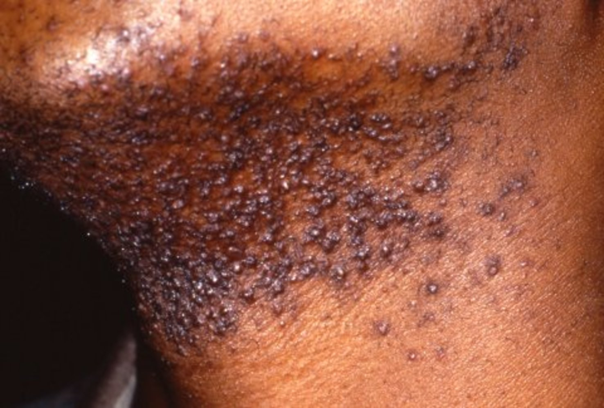

# Dermatological conditions in skin of color

*Categories: Clinical knowledge > Dermatology > Other dermatologic disorders > Dermatological conditions in skin of color*

[Original Article Link](https://coursology-qbank.com/amboss/article/V80Gl3)

---

## Summary

Certain dermatological conditions are more common among individuals with <u>skin of color</u> than among individuals with lighter <u>skin</u> tones. Recognition of these conditions is important to ensure that patients receive timely and appropriate management. This article covers three conditions that are more common in individuals with <u>skin of color</u>: <u>pseudofolliculitis barbae</u>, <u>acne keloidalis nuchae</u>, and <u>dermatosis papulosa nigra</u>. <u>Keloid scarring</u> and <u>postinflammatory hyperpigmentation</u>, both of which are more common in <u>skin of color</u>, are covered in separate articles.

For a more detailed overview of dermatological considerations, including presentations of common malignant and nonmalignant <u>skin</u> conditions, see “<u>Skin of color</u>.”

---

## Pseudofolliculitis barbae

An inflammatory <u>skin</u> reaction in response to short <u>hair</u> that becomes entrapped within the <u>skin</u>

### <u>Epidemiology</u> [[1]](https://coursology-qbank.com/amboss/article/McdM1K0)

Most common in Black men

### Etiology [[2]](https://coursology-qbank.com/amboss/article/ubdpvo0)

* Usually occurs due to shaving (also known as <u>razor bumps</u>)

* Common in individuals with tightly curled <u>hair</u>

### Pathophysiology [[2]](https://coursology-qbank.com/amboss/article/ubdpvo0)

<u>Foreign body reaction</u> to <u>hair</u> as a result of:

* Extrafollicular penetration: <u>Hair</u> enters the interfollicular <u>epidermis</u> after it exits the follicular orifice.

* Transfollicular penetration: <u>Hair</u> penetrates the <u>dermis</u> before exiting the follicular orifice.

### Clinical features [[2]](https://coursology-qbank.com/amboss/article/ubdpvo0)[[3]](https://coursology-qbank.com/amboss/article/Ebd8vo0)

* Firm, <u>hyperpigmented</u> or <u>erythematous</u> <u>papules</u> and <u>pustules</u>

* Most commonly occurs in the beard region (i.e., cheeks, <u>jaw</u>, and neck)

* Lesions may be tender and/or pruritic.

Pseudofolliculitis barbae

### Diagnostics [[2]](https://coursology-qbank.com/amboss/article/ubdpvo0)

* Usually a <u>clinical diagnosis</u>

* The diagnosis can be confirmed with <u>dermoscopy</u>, which shows follicular penetration.

### Treatment [[2]](https://coursology-qbank.com/amboss/article/ubdpvo0)[[3]](https://coursology-qbank.com/amboss/article/Ebd8vo0)

* First line

* Advise patients to stop shaving for at least 8 weeks.  [[3]](https://coursology-qbank.com/amboss/article/Ebd8vo0)

* Educate patients on shaving techniques to minimize the risk of recurrence.

* Advise <u>photoprotective measures</u> to reduce the risk of <u>postinflammatory hyperpigmentation</u>.

* Adjunctive or alternative treatments: Consider the following topical agents alone or in combination. [[2]](https://coursology-qbank.com/amboss/article/ubdpvo0)[[3]](https://coursology-qbank.com/amboss/article/Ebd8vo0)

* <u>Retinoids</u>

* Low-dose <u>corticosteroids</u>

* 5% <u>Benzoyl peroxide</u> gel

* 1% <u>clindamycin</u> gel

* Persistent lesions or definitive treatment: Consider dermatology referral for procedural therapy, e.g.:

* Permanent <u>hair</u>-removal techniques (e.g., <u>laser hair removal</u> with or without <u>eflornithine</u>)

* Chemical peels

> [!WARNING]
> Use of depilatory products (e.g., <u>calcium</u> thioglycolate cream) may result in fewer lesions but can cause high levels of <u>skin</u> irritation. [[2]](https://coursology-qbank.com/amboss/article/ubdpvo0)

### Complications [[2]](https://coursology-qbank.com/amboss/article/ubdpvo0)

* <u>Postinflammatory hyperpigmentation</u>

* <u>Keloid scars</u>

* Secondary bacterial infection (<u>folliculitis barbae</u>)

---