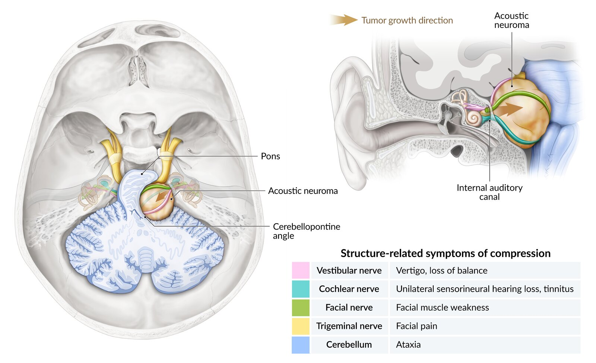
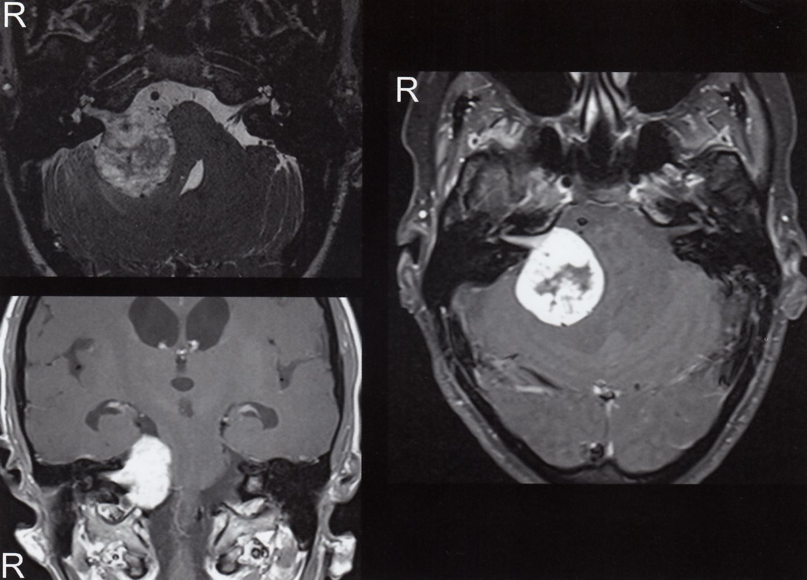
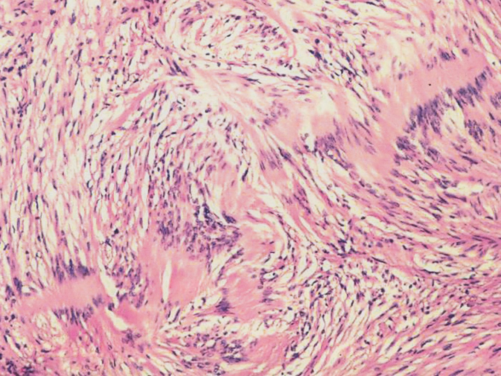
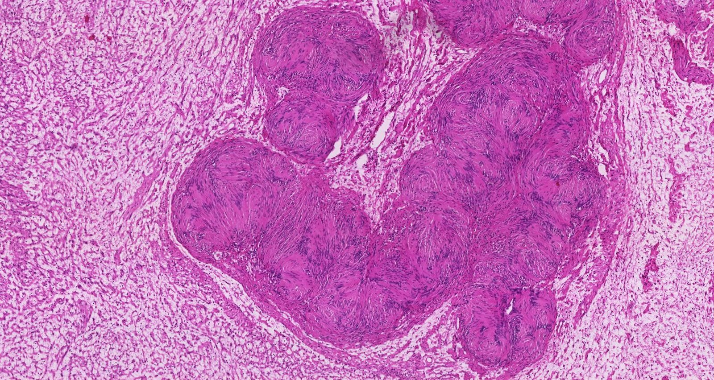
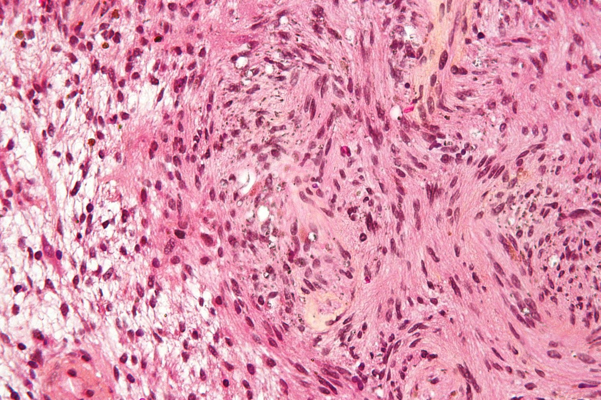

# Acoustic neuroma

*Categories: Clinical knowledge > Ear, nose, and throat > Auditory and vestibular system > Acoustic neuroma*

[Original Article Link](https://coursology-qbank.com/amboss/article/H30KPf)

---

## Summary

Acoustic <u>neuromas</u> (also known as vestibular schwannomas) are <u>benign tumors</u> that arise from <u>Schwann cells</u> and primarily originate within the vestibular portion of <u>cranial</u> nerve VIII. The <u>tumor</u> forms within the internal acoustic canal with variable extension into the <u>cerebellopontine angle</u>. Most tumors are unilateral. Bilateral acoustic <u>neuromas</u> strongly suggest the genetic condition <u>neurofibromatosis type II</u>. Symptoms are related to compression of <u>cranial</u> nerves VIII, V, VII, and the <u>cerebellum</u>. The most common symptom is unilateral <u>sensorineural hearing loss</u>. Diagnosis of acoustic <u>neuroma</u> involves <u>audiometry</u> that demonstrates <u>ipsilateral</u> <u>sensorineural hearing loss</u> and <u>MRI</u> with contrast to confirm the <u>tumor</u>. For patients with large tumors or significant <u>hearing loss</u>, the treatment of choice is surgical removal or <u>radiation therapy</u>. However, observation with follow-up may be appropriate for patients with smaller tumors and minimal <u>hearing loss</u>. On average, the prognosis is favorable, as acoustic <u>neuromas</u> are usually benign, slow-growing tumors with low recurrence rates.

---

## Definitions

* <u>Benign tumors</u> that arise from <u>Schwann cells</u>

---

## Epidemiology

* Median age: 52 years [[1]](https://coursology-qbank.com/amboss/article/RjXlZy)

* <u>Incidence</u>: 4:100,000 people per year (<u>♂</u> = <u>♀</u>) [[1]](https://coursology-qbank.com/amboss/article/RjXlZy)

* Commonly located within the internal acoustic canal and can extend into the <u>cerebellopontine angle</u> (most common <u>tumor</u> of the <u>cerebellopontine angle</u>)

* Most commonly unilateral [[2]](https://coursology-qbank.com/amboss/article/ijXJZy)

> [!TIP]
> Bilateral acoustic <u>neuromas</u> are strongly associated with <u>neurofibromatosis type II</u>.

Epidemiological data refers to the US, unless otherwise specified.

---

## Clinical features

* Early symptoms: as a result of <u>tumor</u> expansion into the internal acoustic canal (<u>internal auditory meatus</u>), causing pressure on the <u>vestibulocochlear nerve</u> (<u>CN VIII</u>)

* Cochlear nerve involvement

* Unilateral <u>sensorineural hearing loss</u> (most common symptom)

* <u>Tinnitus</u>

* Vestibular nerve involvement

* <u>Dizziness</u>  [[3]](https://coursology-qbank.com/amboss/article/Taa6PQ)

* Unsteady gait and disequilibrium

* Late symptoms: caused by pressure of adjacent structures within the <u>cerebellopontine angle</u>

* <u>Trigeminal nerve</u> (<u>CN V</u>) involvement; : <u>paresthesia</u> (numbness), <u>hypoesthesia</u> (decreased sensation), and/or unilateral facial <u>pain</u>

* <u>Facial nerve</u> (<u>CN VII</u>) involvement; : peripheral, unilateral facial <u>weakness</u> that can progress to <u>paralysis</u> [[3]](https://coursology-qbank.com/amboss/article/Taa6PQ)

* Compression of structures in <u>posterior fossa</u>

* <u>Cerebellum</u>: <u>ataxia</u>

* <u>4th ventricle</u>: <u>hydrocephalus</u>

Acoustic neuroma (vestibular schwannoma)

---

## Diagnosis

* <u>Cranial nerve testing</u>

* Cochlear nerve (<u>CN VIII</u>): <u>sensorineural hearing loss</u>

* <u>Audiometry</u>

* <u>Hearing loss</u> with a greater deficit for higher frequencies

* Best initial test: > 90% of patients will have some type of <u>hearing loss</u>. [[2]](https://coursology-qbank.com/amboss/article/ijXJZy)

* <u>Weber test</u>: lateralization to the normal <u>ear</u>

* <u>Rinne test</u>: air conduction > bone conduction in both <u>ears</u>

* <u>Brainstem</u>-evoked <u>audiometry</u>: delay in cochlear nerve conduction time on affected side finding

* Can be used as an additional test in patients with asymmetric <u>audiometry</u> findings

* More cost-effective but less sensitive than an <u>MRI</u>

* <u>Trigeminal nerve</u> (<u>CN V</u>): <u>ipsilateral</u> decreased <u>corneal reflex</u>

* <u>Facial nerve</u> (<u>CN VII</u>): <u>ipsilateral</u> facial twitching or <u>weakness</u>

* Contrast <u>MRI</u> (imaging modality of choice)  

* Recommended in patients with abnormal <u>audiometric testing</u> or high clinical suspicion of acoustic <u>neuroma</u> (<u>cerebellopontine angle syndrome</u>)

* CT with and without contrast is an alternative for those who cannot undergo <u>MRI</u>.

* Shows an enhancing lesion by the internal auditory canal, with possible extension into the <u>cerebellopontine angle</u>

Acoustic neuroma

Vestibularis schwannoma (acoustic neuroma)

---

## Pathology

* Gross findings: encapsulated firm mass

* Microscopic findings

* <u>Spindle cells</u> in palisades (<u>Antoni A tissue</u>) alternating with myxoid <u>hypocellular</u> areas (<u>Antoni B tissue</u>)

* <u>S-100</u> positive

Acoustic neuroma in a 43-year-old patient

Acoustic neuroma

Schwannoma (neurilemoma)

---

## Treatment

* For those with large tumors or significant <u>hearing loss</u>, the main treatment options are <u>surgery</u> or <u>radiation therapy</u>.

* Observation of the <u>tumor</u> can be considered in patients with small tumors or minimal <u>hearing loss</u>, or if they are of advanced age. These patients should undergo <u>MRI</u> surveillance every 6–12 months. [[4]](https://coursology-qbank.com/amboss/article/QjXuZy)

---

## Prognosis

* Good prognosis: <u>Neuromas</u> are a WHO grade I <u>brain tumor</u> with a low rate of recurrence (< 5%). [[2]](https://coursology-qbank.com/amboss/article/ijXJZy)

---