# Benign paroxysmal positional vertigo

*Categories: Clinical knowledge > Ear, nose, and throat > Auditory and vestibular system > Benign paroxysmal positional vertigo*

[Original Article Link](https://coursology-qbank.com/amboss/article/Ti06If)

---

## Summary

Benign <u>paroxysmal</u> positional <u>vertigo</u> (BPPV) is a common disorder of the <u>inner ear</u> thought to be caused primarily by <u>otoconia</u> (canaliths) dislodging and migrating into one of the <u>semicircular canals</u>, most commonly the <u>posterior</u> <u>semicircular canal</u>, where it disrupts the endolymph dynamics. BPPV is the most common <u>cause of peripheral vertigo</u>. The primary symptom of BPPV is episodic <u>vertigo</u> that lasts < 1 minute, triggered by sudden changes in head posture in relation to gravity (e.g., bending forwards, rapidly standing up). BPPV is a <u>clinical diagnosis</u> that is supported by a combination of characteristic features as well as the presence of <u>nystagmus</u> and <u>vertigo</u> elicited by provoking maneuvers (e.g., <u>Dix-Hallpike test</u>). <u>Canalith repositioning maneuvers</u> (<u>CRM</u>), such as the <u>Epley maneuver</u>, are the preferred treatment of BPPV. <u>Vestibular rehabilitation</u> may be used as an adjunct to (<u>CRM</u>). <u>Vestibular suppressants</u> and <u>surgery</u> are reserved for patients with intractable or severely-disabling BPPV.

See also “<u>Vertigo</u>.”

---

## Classification

BPPV can be classified into the following subtypes depending on which <u>semicircular canal</u> is involved.

|  Classification of BPPV [[1]](https://coursology-qbank.com/amboss/article/BXYzZL)  |  |  |
| --- | --- | --- |
| Variants | Definition and <u>epidemiology</u> |  Provoking maneuvers (Diagnostic maneuvers)  |
| Posterior semicircular canal BPPV |   * Positional <u>vertigo</u> triggered by <u>otoconia</u> within the <u>posterior</u> <u>semicircular canal</u>  * Most common type of BPPV (up to 95% of cases)  [[1]](https://coursology-qbank.com/amboss/article/BXYzZL)[[2]](https://coursology-qbank.com/amboss/article/CjbqcF)    |  * <u>Dix-Hallpike maneuver</u>: upbeat <u>torsional nystagmus</u> toward the affected (dependent) <u>ear</u>   |
| Lateral semicircular canal BPPV |   * Positional <u>vertigo</u> triggered by <u>otoconia</u> within the <u>lateral</u> (horizontal) <u>semicircular canal</u>  * Less common than <u>posterior semicircular canal BPPV</u>    |  * <u>Supine roll maneuver</u>: <u>horizontal nystagmus</u> beating toward the ground (geotropic ) or toward the ceiling (apogeotropic )   |
|  Anterior semicircular canal BPPV [[3]](https://coursology-qbank.com/amboss/article/QObuHF)[[4]](https://coursology-qbank.com/amboss/article/jOb_HF)  |   * Positional <u>vertigo</u> triggered by <u>otoconia</u> within the <u>anterior</u> <u>semicircular canal</u>  * Rare (< 3%)    |  * <u>Dix-Hallpike maneuver</u>: downbeat <u>torsional nystagmus</u> toward the affected <u>ear</u>   |

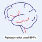

Right Posterior Canal BPPV

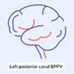

Left Posterior Canal BPPV

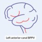

Left Anterior Canal BPPV

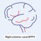

Right Anterior Canal BPPV

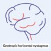

Geotropic Horizontal Nystagmus in Lateral Canal BPPV

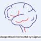

Apogeotropic Horizontal Nystagmus in Lateral Canal BPPV

---

## Epidemiology

* <u>Prevalence</u>

* BPPV is the most common type of peripheral vestibular <u>vertigo</u> with a <u>prevalence</u> of ∼ 2%. [[5]](https://coursology-qbank.com/amboss/article/hjbcZF)

* BPPV is the underlying cause in approx. 40% of geriatric patients presenting with <u>dizziness</u>. [[1]](https://coursology-qbank.com/amboss/article/BXYzZL)

* Sex: <u>♀</u> > <u>♂</u>  [[1]](https://coursology-qbank.com/amboss/article/BXYzZL)[[5]](https://coursology-qbank.com/amboss/article/hjbcZF)

* Age: peak <u>incidence</u> between 50–60 years [[5]](https://coursology-qbank.com/amboss/article/hjbcZF)

Epidemiological data refers to the US, unless otherwise specified.

---

## Etiology

Although the exact etiology is unknown in most patients with BPPV, the condition is thought to result from the dislodgement or abnormal adherence of <u>otoconia</u> (see “Pathophysiology” section). The etiology of dislodged or adherent <u>otoconia</u> is described here.

* <u>Idiopathic</u>

* Most common  [[1]](https://coursology-qbank.com/amboss/article/BXYzZL)

* Possibly secondary to degeneration of the <u>acoustic macula</u> [[2]](https://coursology-qbank.com/amboss/article/CjbqcF)

* Secondary causes [[2]](https://coursology-qbank.com/amboss/article/CjbqcF)

* Trauma 

* <u>Head injury</u> [[1]](https://coursology-qbank.com/amboss/article/BXYzZL)

* Prior otologic <u>surgery</u>

* Other inner-<u>ear</u> disorders

* <u>Vestibular neuritis</u>

* <u>Meniere disease</u>

* Miscellaneous: <u>migraine</u>

* <u>Risk factors</u>  [[1]](https://coursology-qbank.com/amboss/article/BXYzZL)[[5]](https://coursology-qbank.com/amboss/article/hjbcZF)

* Female sex

* Increased age

* Low <u>vitamin D</u> levels

* <u>Osteopenia</u> or <u>osteoporosis</u>

---

## Pathophysiology

Although incompletely understood, BPPV is thought to occur due to dislodged or abnormally adherent <u>otoconia</u>, causing <u>semicircular canal</u> dysfunction. [[1]](https://coursology-qbank.com/amboss/article/BXYzZL)[[2]](https://coursology-qbank.com/amboss/article/CjbqcF)

* Otoconia (<u>otoliths</u>): physiological <u>calcium carbonate</u> crystals present within the <u>utricle</u> and <u>saccule</u> that serve to maintain balance and spatial orientation

* Canalithiasis

* Dislodged, free-floating <u>otoconia</u> (endolymphatic debris).

* <u>Canalithiasis</u> from the <u>acoustic macula</u> enter the <u>semicircular canals</u> → disruption of endolymph dynamics in response to changes in gravitational forces (e.g., changing head positions) → abnormal stimulation of the vestibular apparatus

* Cupulolithiasis: otoconial debris that has adhered to the cupula of the affected <u>semicircular canal</u>
* <u>Cupulolithiasis</u> → increased <u>sensitivity</u> of the <u>semicircular canal</u> to changes in gravitational forces → abnormal stimulation of the vestibular apparatus

* <u>Canalithiasis</u> or <u>cupulolithiasis</u> → abnormal stimulation of the <u>vestibulocochlear nerve</u> in response to changes in head position and movement → severe <u>vertigo</u> attacks that last several seconds [[1]](https://coursology-qbank.com/amboss/article/BXYzZL)

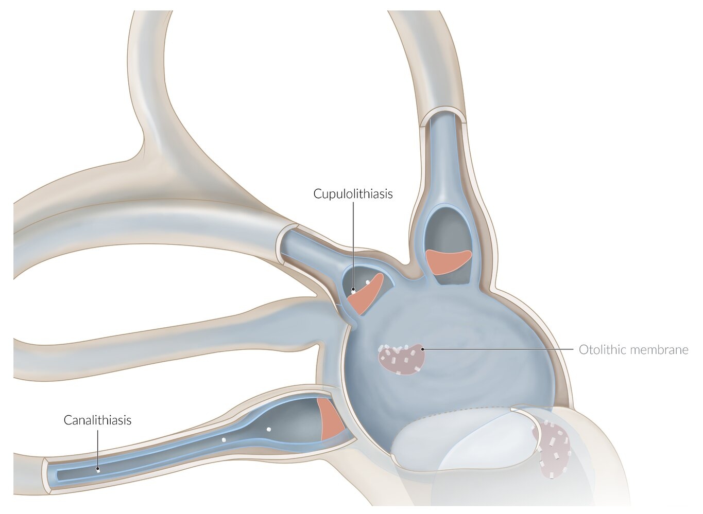

Cupulolithiasis and canalithiasis in benign paroxysmal positional vertigo (BPPV)

Anatomy of the inner ear

---

## Clinical features

* Episodic <u>vertigo</u> (spinning sensation)  [[1]](https://coursology-qbank.com/amboss/article/BXYzZL)[[2]](https://coursology-qbank.com/amboss/article/CjbqcF)

* Sudden (“<u>paroxysmal</u>”) and recurrent episodes

* Lasts several seconds (typically ≤ 1 minute)

* Triggered by certain head movements (positional <u>vertigo</u>) after a latency of a few seconds.

* Associated with:

* <u>Nystagmus</u>

* Risk of falls and subsequent injury

* <u>Nausea and vomiting</u>

* Triggers: Quick rotation of the head relative to gravity is the main trigger of BPPV (see ''Pathophysiology'' section). [[1]](https://coursology-qbank.com/amboss/article/BXYzZL)[[2]](https://coursology-qbank.com/amboss/article/CjbqcF)

* Lying down, reclining, or standing up quickly  [[5]](https://coursology-qbank.com/amboss/article/hjbcZF)

* Rolling over in bed

* Bending forwards

* Suddenly jerking the head to look up or down

* <u>Provoking maneuvers for BPPV</u>: See “Diagnostics” section.

> [!TIP]
> BPPV does not typically cause cochlear (e.g., <u>hearing loss</u> or <u>tinnitus</u>) or neurological symptoms.

---

## Diagnosis

### Approach [[1]](https://coursology-qbank.com/amboss/article/BXYzZL)[[5]](https://coursology-qbank.com/amboss/article/hjbcZF)

The following focuses on patients with triggered <u>episodic vestibular syndrome</u>; see “<u>Approach to vertigo</u>” for details on clinical evaluation, targeted testing (e.g., <u>HINTS examination</u>), and <u>neuroimaging</u> for patients with undifferentiated <u>acute vestibular syndrome</u>.

* BPPV is a <u>clinical diagnosis</u> based on characteristic findings and elicitation of <u>nystagmus</u> and <u>vertigo</u> on <u>provoking maneuvers for BPPV</u>.

* Patients with atypical features or suspected differential diagnoses: Consider further evaluation with <u>audiometry</u>, <u>vestibular function testing</u>, and/or <u>neuroimaging</u> as needed. 
* Consider other diagnoses if any of the following are present: [[1]](https://coursology-qbank.com/amboss/article/BXYzZL)

* <u>Vertigo</u> that lasts longer than one minute

* Associated <u>hearing loss</u>

* Associated neurological symptoms (e.g., gait disturbances) are present.

* Failure to respond to <u>canalith repositioning maneuvers</u> or <u>vestibular rehabilitation therapy</u> [[6]](https://coursology-qbank.com/amboss/article/EOb88F)

### Diagnostic criteria for <u>posterior semicircular canal BPPV</u> [[1]](https://coursology-qbank.com/amboss/article/BXYzZL)

All of the following criteria should be met to confirm the <u>clinical diagnosis</u> of <u>posterior canal BPPV</u>.  [[5]](https://coursology-qbank.com/amboss/article/hjbcZF)

* Episodic <u>vertigo</u> triggered by changes in head position in relation to gravity

* Elicitation of <u>vertigo</u> and <u>nystagmus</u> on performing <u>Dix-Hallpike</u> maneuver, with the following characteristics:

* <u>Latency period</u>: <u>Vertigo</u> and <u>nystagmus</u> manifest a few seconds after completing the maneuver.

* Direction of <u>nystagmus</u>: upbeat <u>torsional nystagmus</u>

* Duration: <u>Vertigo</u> and <u>nystagmus</u> increase and then resolve within 60 seconds after onset.

### Provoking maneuvers for BPPV [[1]](https://coursology-qbank.com/amboss/article/BXYzZL)[[5]](https://coursology-qbank.com/amboss/article/hjbcZF)

* Definition: set of specific sequential maneuvers used to provoke symptoms in an individual with suspected BPPV

* Findings: Positional <u>vertigo</u> associated with <u>nystagmus</u> triggered on specific maneuvers is considered a positive test and is diagnostic of BPPV.
* The following characteristics of <u>nystagmus</u> should be noted:

* Latency: typically 2–5 seconds

* Direction: The direction of <u>nystagmus</u> indicates which specific canal is affected (see individual maneuvers below for more details).

* Duration: < 1 minute (typically 30 seconds)  [[5]](https://coursology-qbank.com/amboss/article/hjbcZF)

* Reversal: The pattern of <u>nystagmus</u> reverses direction when the patient is made to sit in a neutral position at the end of the provoking maneuver.

* Fatigability: Intensity of <u>nystagmus</u> decreases on repeated sequential testing (not recommended).  [[1]](https://coursology-qbank.com/amboss/article/BXYzZL)

* Approach 

* The <u>Dix-Hallpike</u> maneuver should be performed in all patients with suspected BPPV to identify <u>posterior canal BPPV</u>.

* If the <u>Dix-Hallpike</u> maneuver is negative, the <u>supine head roll test</u> should be performed to assess for <u>lateral canal BPPV</u>.

#### Dix-Hallpike maneuver [[1]](https://coursology-qbank.com/amboss/article/BXYzZL)[[7]](https://coursology-qbank.com/amboss/article/oPb0fF)

* Indication

* First-line test for suspected BPPV

* <u>Gold standard test</u> to diagnose suspected <u>posterior semicircular canal BPPV</u> [[1]](https://coursology-qbank.com/amboss/article/BXYzZL)

* Suspected <u>anterior semicircular canal BPPV</u>

* Procedure 
1. * Ask the patient to sit upright on the examination bed and to keep their eyes open during the procedure.
2. * Rotate the head by 45° towards the affected side.
3. * Keeping the neck rotated, quickly lay the patient in a <u>supine position</u> with the neck slightly extended (approx 20°) and the affected <u>ear</u> held down at 45°.
4. * Hold this position for 20–30 seconds.

* Examine the eyes for <u>nystagmus</u>; if present note latency, direction, and duration of <u>nystagmus</u>

* Inquire if the patient is experiencing <u>vertigo</u>

* Wait for resolution of <u>nystagmus</u> and <u>vertigo</u>
5. * Slowly <u>reposition</u> the patient into an upright posture with neck in neutral position and observe for reversal of <u>nystagmus</u>.
6. * If negative (that is, no <u>nystagmus</u>/<u>vertigo</u>), repeat the maneuver with the head turned to the unaffected side in <u>step 2</u>.

* Characteristic findings

* Positive <u>Dix-Hallpike test</u>: positional <u>vertigo</u> and <u>nystagmus</u> triggered during the maneuver

* Direction of <u>nystagmus</u>

* <u>Posterior canal BPPV</u>: <u>upbeat nystagmus</u> with <u>ipsiversive torsional nystagmus</u> component

* <u>Anterior canal BPPV</u>: <u>downbeat nystagmus</u> with <u>ipsiversive torsional nystagmus</u>

* Further steps

* Positive test: Perform <u>Epley repositioning maneuver</u>. [[1]](https://coursology-qbank.com/amboss/article/BXYzZL)[[5]](https://coursology-qbank.com/amboss/article/hjbcZF)

* Negative test [[5]](https://coursology-qbank.com/amboss/article/hjbcZF)[[7]](https://coursology-qbank.com/amboss/article/oPb0fF)

* BPPV not necessarily ruled out

* Consider performing the <u>Epley maneuver</u> anyway.

* Consider ENT consultation for special maneuvers.

* Evaluate for other <u>causes of vertigo</u> and <u>nystagmus</u>.

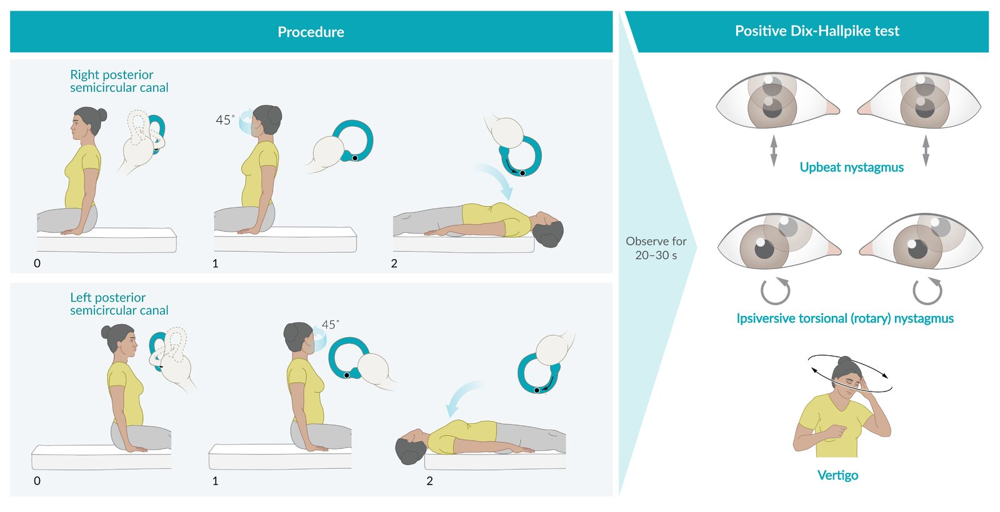

Dix-Hallpike maneuver

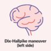

Dix-Hallpike maneuver (left side)

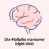

Dix-Hallpike maneuver (right side)

#### Supine head roll test  [[1]](https://coursology-qbank.com/amboss/article/BXYzZL)[[5]](https://coursology-qbank.com/amboss/article/hjbcZF)

* Indication

* Suspected BPPV with negative or atypical findings on <u>Dix-Hallpike test</u>

* <u>Lateral semicircular canal BPPV</u>

* Procedure
1. * Ask the patient to lie in a <u>supine position</u> and to keep their eyes open during the procedure.
2. * Position the patient's head in neutral position.
3. * Quickly turn the patient's head by 90° to one side and examine for <u>nystagmus</u>.
4. * Wait for <u>nystagmus</u> to subside.
5. * <u>Reposition</u> the patient's head to neutral position, reassess for <u>nystagmus</u>; allow <u>nystagmus</u> to subside.
6. * Repeat steps on the opposite side.

* Characteristic findings [[1]](https://coursology-qbank.com/amboss/article/BXYzZL)

* Positional <u>vertigo</u> and <u>nystagmus</u> triggered during the maneuver

* Direction of <u>nystagmus</u> in <u>lateral canal BPPV</u>:

* Bilateral <u>horizontal nystagmus</u> with eyes beating toward the ground (<u>geotropic nystagmus</u>)

* Bilateral <u>horizontal nystagmus</u> with eyes beating toward the ceiling (<u>apogeotropic nystagmus</u>)

### Additional diagnostic evaluation  [[1]](https://coursology-qbank.com/amboss/article/BXYzZL)

#### <u>Audiometry</u> [[1]](https://coursology-qbank.com/amboss/article/BXYzZL)

* Indication: suspected <u>hearing loss</u>

* Supportive findings: typically normal in BPPV

#### Vestibular function tests [[1]](https://coursology-qbank.com/amboss/article/BXYzZL)

* Definition: tests to identify <u>nystagmus</u> in response to vestibular stimulation and thereby assess the integrity and function of the vestibular apparatus of the <u>inner ear</u>

* Indications

* BPPV with atypical <u>nystagmus</u>

* Suspected concomitant vestibular pathology  [[1]](https://coursology-qbank.com/amboss/article/BXYzZL)

* Refractory BPPV

* Supportive findings: Vestibular function is typically normal in BPPV.

#### <u>Neuroimaging</u> [[8]](https://coursology-qbank.com/amboss/article/QkbunF)

* Modalities 

* <u>MRI</u> head and internal auditory canal with and without IV contrast

* CT <u>temporal bone</u> without IV contrast

* Indications  [[1]](https://coursology-qbank.com/amboss/article/BXYzZL)[[8]](https://coursology-qbank.com/amboss/article/QkbunF)

* Suspected BPPV with atypical features, such as:

* No <u>nystagmus</u> or atypical direction of <u>nystagmus</u> on provoking maneuvers

* Persistent <u>vertigo</u>

* To rule out intracranial <u>causes of vertigo</u>

* Preoperative planning for refractory BPPV

* Supportive findings: normal in BPPV  [[1]](https://coursology-qbank.com/amboss/article/BXYzZL)

---

## Differential diagnoses

* See “<u>Causes of vertigo</u>” for other <u>etiologies of vertigo</u>.

* <u>Causes of peripheral vertigo</u>: e.g., <u>meniere disease</u>, <u>vestibular neuritis</u>

* <u>Causes of central vertigo</u>: e.g., <u>TIA</u>, <u>cerebellar stroke</u>, <u>vestibular migraine</u>

* See “<u>Differential diagnoses of vertigo</u>” for other conditions that mimic <u>vertigo</u>: e.g., <u>anxiety</u> or <u>panic disorder</u>, <u>postural hypotension</u>, medication side effects

The differential diagnoses listed here are not exhaustive.

---

## Treatment

Although BPPV is often considered a condition that resolves spontaneously, <u>canalith repositioning maneuvers</u> (<u>CRM</u>) are the preferred first-line treatment. <u>Vestibular rehabilitation therapy</u> may be useful as an adjunct to <u>CRM</u>; both forms of therapy can be performed at home, by patients themselves. Patients with refractory symptoms or atypical symptoms should be evaluated for alternative diagnoses. [[1]](https://coursology-qbank.com/amboss/article/BXYzZL)[[5]](https://coursology-qbank.com/amboss/article/hjbcZF)

### Canalith repositioning maneuvers (<u>CRM</u>) [[1]](https://coursology-qbank.com/amboss/article/BXYzZL)

* Definition: set of specific sequential maneuvers performed to mobilize the <u>otoconia</u> out of the involved <u>semicircular canal</u> and back into the vestibule

* Indication: first-line treatment for BPPV

* General considerations

* <u>CRM</u> can be performed immediately after identifying the affected canal on a provoking maneuver.

* A trained general practitioner can perform the <u>Dix-Hallpike maneuver</u> and <u>Epley maneuver</u>; ENT referral is recommended in patients with persistent or recurrent symptoms. [[9]](https://coursology-qbank.com/amboss/article/3qbSyu)[[10]](https://coursology-qbank.com/amboss/article/Rqblyu)

* Potential side effects include <u>nausea</u>, <u>vomiting</u>, and <u>postural instability</u> lasting for approximately 24 hours.

* <u>Antiemetics</u> or <u>vestibular suppressants</u> may be administered prophylactically before performing <u>CRM</u>.

* Patients with frequent recurrences can be taught to perform these maneuvers themselves at home.

* Outcome

* Up to 80–90% success rate [[6]](https://coursology-qbank.com/amboss/article/EOb88F)[[11]](https://coursology-qbank.com/amboss/article/HObKFF)

* Recurrences requiring repeat <u>CRM</u> are expected.  [[5]](https://coursology-qbank.com/amboss/article/hjbcZF)[[12]](https://coursology-qbank.com/amboss/article/vPbAgF)

* Canal conversion

#### Epley maneuver [[1]](https://coursology-qbank.com/amboss/article/BXYzZL)[[5]](https://coursology-qbank.com/amboss/article/hjbcZF)

* Indication

* <u>Posterior semicircular canal BPPV</u> after a positive <u>Dix-Hallpike</u> maneuver

* <u>Anterior semicircular canal BPPV</u> after a positive <u>Dix-Hallpike</u> maneuver [[4]](https://coursology-qbank.com/amboss/article/jOb_HF)

* Procedure 
1. * The initial steps are the same as those of the <u>Dix-Hallpike</u> maneuver 

* Ask the patient to sit upright on the examination table and to keep their eyes open during the procedure.

* Rotate the head by 45° towards the affected side.

* Keeping the neck rotated, quickly lay the patient in a <u>supine position</u> with the neck slightly extended (approx 20°) and the affected <u>ear</u> facing down at 45°
2. * Hold this position for 30 seconds or until the resolution of <u>nystagmus</u>.
3. * Turn the patient's head by 90° toward the unaffected side; hold this position for 30 seconds or until resolution of <u>nystagmus</u>.
4. * Turn the patient's head and body by 90° towards the unaffected side such that the patient is now lying on their side with their face turned toward the ground.
5. * Hold this position for 30 seconds or until the resolution of <u>nystagmus</u>.
6. * Bring the patient back to a seated, upright position with the head in the neutral position.
7. * After completion of the maneuver, ask the patient to remain in this position for about 15 minutes.

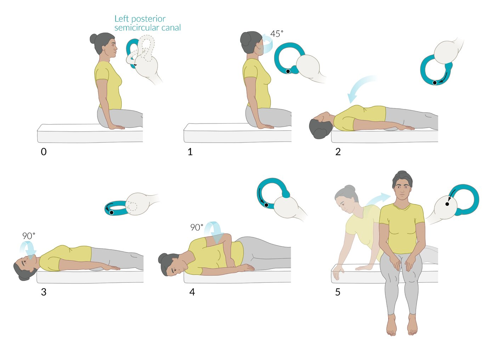

Epley maneuver for left posterior semicircular canal BPPV

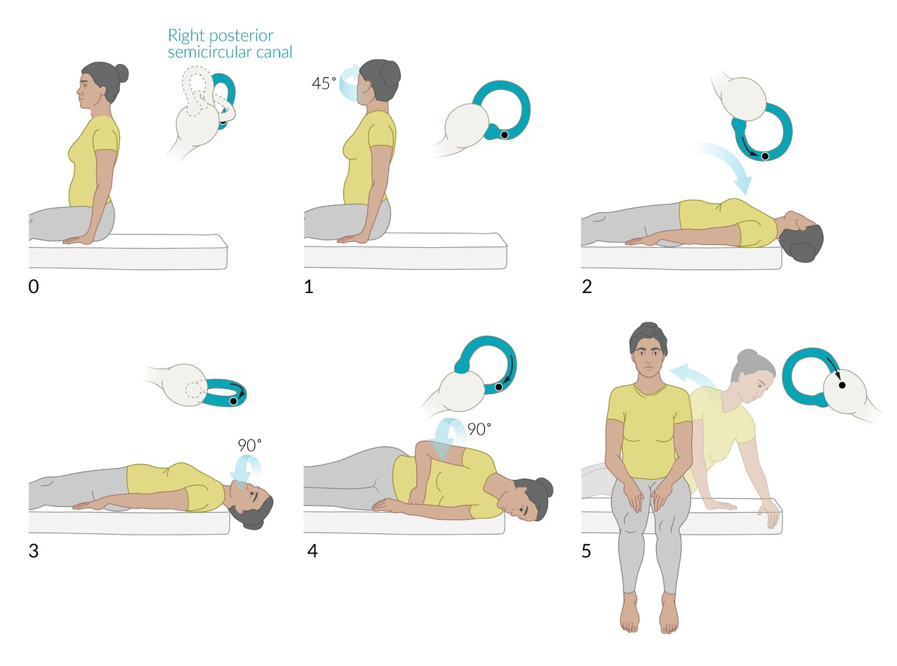

Epley maneuver for right posterior semicircular canal BPPV

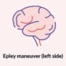

Epley maneuver (left side)

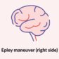

Epley maneuver (right side)

### <u>Vestibular rehabilitation therapy</u> [[1]](https://coursology-qbank.com/amboss/article/BXYzZL)

<u>Vestibular rehabilitation</u> refers to different physical exercises to treat <u>dizziness</u> and balance disorders that the patients perform either at home or with the help of a clinician.

* Indications

* Adjunctive therapy to <u>CRM</u>  [[1]](https://coursology-qbank.com/amboss/article/BXYzZL)

* Refractory BPPV

* Patient refusal or contraindications to <u>CRM</u>

* Patients with preexisting conditions may benefit the most.

* Goal: induce <u>vestibular habituation</u> or adaptation to gravitational changes to minimize the frequency of episodic <u>vertigo</u>

* Options

* There are several exercises for <u>vestibular rehabilitation</u> (e.g., Brandt-Daroff exercise, Cawthorne-Cooksey exercise) that are especially helpful for BPPV.

* Exercises may be customized by a trained specialist

### Observation (<u>watchful waiting</u>) [[1]](https://coursology-qbank.com/amboss/article/BXYzZL)

* Indication  [[6]](https://coursology-qbank.com/amboss/article/EOb88F)

* Mild, infrequent symptoms

* <u>Relative contraindications</u> to <u>CRM</u>

* History of complications from prior <u>CRM</u>

* Patient refusal of <u>CRM</u>

* <u>Relative contraindication</u>: patients at high risk of falls or severe injury from falls  [[6]](https://coursology-qbank.com/amboss/article/EOb88F)

* Procedure

* Withhold <u>CRM</u> and <u>vestibular rehabilitation</u>

* Advise patients to avoid postures or activities that trigger symptoms (see ''Triggers'' in ''Clinical Features” section).

* Reassess patients after 1 month

* Symptom frequency decreased: Continue observation.

* Symptoms disabling: Consider <u>CRM</u> and/or <u>vestibular rehabilitation</u>.

### Medical therapy (<u>vestibular suppressants</u>) [[1]](https://coursology-qbank.com/amboss/article/BXYzZL)

<u>Vestibular suppressants</u> are not routinely indicated due to their adverse effect profile and potential of suppressing the central vestibular compensatory system. Patients should be counseled about their potential side effects.

* Indications

* Symptomatic control during an acute attack (rare)

* Intractable BPPV

* Patients who refuse to undergo <u>canalith repositioning maneuvers</u>

* Before provoking or repositioning maneuvers

* Options: See “<u>Vestibular suppressants</u>”.

* Duration of therapy

* As short a period as possible

* Acute attacks or premaneuver prophylaxis: One-time dosing may be adequate.

* In patients with severe intractable BPPV: variable; 2–6 months [[13]](https://coursology-qbank.com/amboss/article/fPbkVF)

> [!WARNING]
> Chronic use of <u>vestibular suppressants</u> is contraindicated in BPPV because it can inhibit central compensation and potentially exacerbate chronic gait and <u>postural instability</u>. [[1]](https://coursology-qbank.com/amboss/article/BXYzZL)

### Surgical treatment [[2]](https://coursology-qbank.com/amboss/article/CjbqcF)

* Indication

* Intractable BPPV

* Severe and frequent recurrences

* Options

* Singular neurectomy

* <u>Posterior</u> <u>semicircular canal</u> occlusion

---