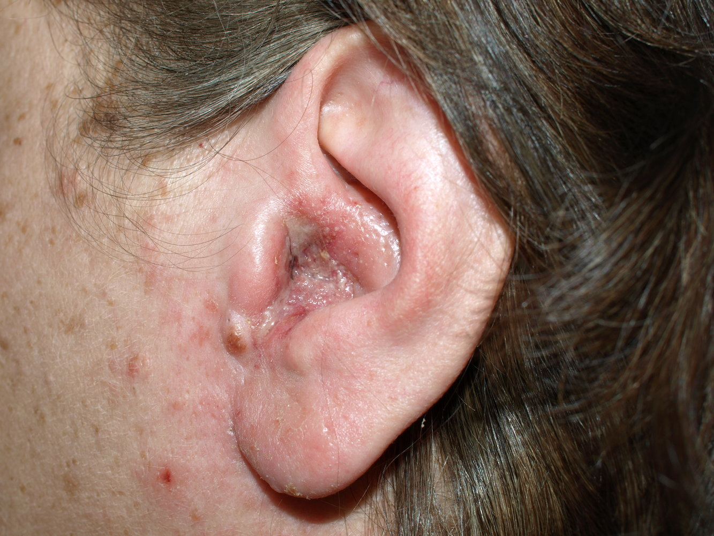

# Otitis externa

*Categories: Clinical knowledge > Ear, nose, and throat > Auditory and vestibular system > Otitis externa*

[Original Article Link](https://coursology-qbank.com/amboss/article/mj0VaT)

---

## Summary

Otitis <u>externa</u> (OE) is an inflammation of the <u>external auditory canal</u> (<u>EAC</u>) and is most often the result of a local bacterial infection. <u>Risk factors</u> for OE include exposure to water and injury to the <u>skin</u> of the <u>EAC</u>. OE is characterized by <u>ear</u> <u>pain</u>, fullness, and/or itching, and tenderness of the tragus and/or <u>pinna</u>. Diagnosis is primarily clinical. <u>Erythema</u>, <u>edema</u>, debris, and/or <u>otorrhea</u> of the <u>EAC</u> may be visible on <u>otoscopy</u>; the <u>tympanic membrane</u> (TM) may not be visualized due to swelling. Treatment typically involves topical antimicrobial agents (e.g., <u>antiseptic</u> or <u>antibiotic</u> <u>ear</u> drops) and supportive management (e.g., <u>analgesia</u>, keeping the <u>EAC</u> dry). Systemic <u>antibiotic therapy</u> is indicated in select cases (e.g., spread of infection, <u>risk factors</u> for severe disease).

<u>Malignant otitis externa</u> (<u>MOE</u>) is covered separately.

---

## Etiology

### <u>Acute otitis externa</u> [[2]](https://coursology-qbank.com/amboss/article/Gi1BGg0)[[3]](https://coursology-qbank.com/amboss/article/gR1Fmg0)

* Infectious causes

* Bacterial infections (most common cause of otitis <u>externa</u>)

* <u>Pseudomonas aeruginosa</u> (∼ 40% of cases), commonly from swimming activities

* <u>Staphylococcus aureus</u>, <u>Proteus mirabilis</u>, <u>Escherichia coli</u>

* Viral infections (rare): <u>Herpes zoster</u>, <u>influenza viruses</u>

* <u>Fungal infections</u> (less common): <u>Aspergillus</u> (accounts for 90% of all <u>fungal otitis externa</u>), <u>Candida</u>

* Noninfectious causes (less common)

* Seborrheic otitis <u>externa</u> (associated with <u>seborrheic dermatitis</u>)

* <u>Eczematous</u> otitis <u>externa</u> (a <u>hypersensitivity reaction</u> to pathogens or topical <u>antibiotics</u>)

* Neurodermatitis (caused by compulsive/psychogenic scratching).

* <u>Risk factors</u>

* Injury to the <u>skin</u> of the <u>EAC</u> (e.g., cleaning, insertion of foreign objects such as <u>hearing aids</u> or earplugs, excessive itching)

* Increased moisture in the <u>EAC</u> (e.g., swimming, humid climate)

* <u>Immunosuppression</u>, e.g., <u>diabetes</u>, <u>HIV</u>

### <u>Chronic otitis externa</u> [[4]](https://coursology-qbank.com/amboss/article/kP1mUS0)

* <u>Idiopathic</u>

* Refractory fungal or bacterial infection

* May be associated with autoimmune diseases, e.g.:

* <u>Sarcoidosis</u>

* <u>Amyloidosis</u>

* <u>Granulomatosis with polyangiitis</u>

---

## Clinical features

### Symptoms [[3]](https://coursology-qbank.com/amboss/article/gR1Fmg0)

* Severe <u>ear</u> <u>pain</u>, particularly at night

* Otorrhea

* Intense itching in the <u>EAC</u>

* <u>Hearing loss</u>

* <u>Jaw</u> <u>pain</u> [[2]](https://coursology-qbank.com/amboss/article/Gi1BGg0)

> [!TIP]
> <u>Fever</u> 38.3°C (101°F) suggests infection extending beyond the <u>EAC</u>. [[2]](https://coursology-qbank.com/amboss/article/Gi1BGg0)

### Examination findings [[2]](https://coursology-qbank.com/amboss/article/Gi1BGg0)[[3]](https://coursology-qbank.com/amboss/article/gR1Fmg0)

* Tenderness on palpation of the tragus

* Pulling up and back on the <u>auricle</u> causes <u>pain</u>.

* The following may also be present:

* Crusting of <u>otorrhea</u> at the entrance to the <u>EAC</u>

* <u>Conductive hearing loss</u>

* Clinical features of <u>cellulitis</u>

* Regional <u>lymphadenitis</u>

#### <u>Otoscopy</u> [[3]](https://coursology-qbank.com/amboss/article/gR1Fmg0)

* <u>Erythematous</u> and <u>edematous</u> <u>EAC</u>

* <u>Otorrhea</u> or debris

* <u>EAC</u> may be occluded by a <u>furuncle</u>, <u>impacted cerumen</u>, or foreign body

* The <u>tympanic membrane</u> may be <u>erythematous</u> but should not bulge.

> [!WARNING]
> Severe <u>edema</u> of the <u>EAC</u> may prevent <u>otoscopic examination</u>.

Otitis externa

---

## Diagnosis

### General principles [[3]](https://coursology-qbank.com/amboss/article/gR1Fmg0)

* Diagnosis is clinical; <u>AOE</u> is likely if all of the following are present : [[1]](https://coursology-qbank.com/amboss/article/_n15Dh0)[[3]](https://coursology-qbank.com/amboss/article/gR1Fmg0)

* Rapid onset of symptoms (typically within 48 hours) within the last 3 weeks

* Symptoms of <u>EAC</u> inflammation (i.e., <u>otalgia</u>, <u>pruritus</u>, and/or fullness)

* Examination findings of <u>EAC</u> inflammation (i.e., pinnal and/or tragal tenderness)

* Diagnostic studies are only performed:

* In suspected comorbid disease

* To rule out <u>differential diagnoses of otitis externa</u>

* For refractory disease or suspected subtypes, e.g., <u>MOE</u>

### Diagnostic studies [[3]](https://coursology-qbank.com/amboss/article/gR1Fmg0)

* <u>Pneumatic otoscopy</u> and/or <u>tympanometry</u>

* Perform if there is diagnostic uncertainty between <u>AOE</u> and <u>acute otitis media</u>.

* Both studies are normal in <u>AOE</u>. [[3]](https://coursology-qbank.com/amboss/article/gR1Fmg0)

* Culture of <u>ear</u> secretions should be obtained if there is: [[2]](https://coursology-qbank.com/amboss/article/Gi1BGg0)

* Insufficient response to initial treatment

* ≥ 1 <u>risk factor</u> for a fungal or <u>antibiotic</u>-resistant <u>pathogen</u>

* Concern the infection has extended beyond the <u>EAC</u>

* Screening for comorbidities: Consider based on clinical features. 

* <u>AOE</u>: <u>screening for diabetes</u> or <u>screening for HIV</u>, especially if <u>otomycosis</u> is suspected or confirmed [[3]](https://coursology-qbank.com/amboss/article/gR1Fmg0)

* <u>COE</u>: screening for autoimmune disease  [[8]](https://coursology-qbank.com/amboss/article/Ol1ICS0)

* Patients with <u>clinical features of MOE</u>: see “<u>Diagnostics of MOE</u>”.

---

## Treatment

The following applies to diffuse <u>acute OE</u>. For <u>localized OE</u> and <u>otomycosis</u>, see “Subtypes and variants.” Treatment of <u>COE</u> differs by underlying cause (e.g., fungal, allergic, or autoimmune).

### Approach [[2]](https://coursology-qbank.com/amboss/article/Gi1BGg0)[[3]](https://coursology-qbank.com/amboss/article/gR1Fmg0)

* Provide supportive therapy as needed (e.g., <u>analgesia</u>, <u>aural toilet</u>).

* Initiate antimicrobial treatment.

* Start topical therapy; insert an <u>ear wick</u> if the <u>EAC</u> is significantly swollen.  [[3]](https://coursology-qbank.com/amboss/article/gR1Fmg0)

* Add oral <u>antibiotics</u> only if <u>indications for systemic antibiotics for OE</u> are present.

* Provide patient education on:

* Counseling for otic medications

* <u>Prevention of OE</u>

* Refer to otolaryngology for: [[9]](https://coursology-qbank.com/amboss/article/ArdRPr0)

* Severe infection

* Need for procedural interventions

* Persistent symptoms

* If no improvement within 48–72 hours, reassess and consider: [[3]](https://coursology-qbank.com/amboss/article/gR1Fmg0)

* Alternative diagnoses: <u>MOE</u>, <u>differential diagnoses of OE</u>

* <u>Treatment adherence</u>

* Modifying management

> [!WARNING]
> If <u>clinical features of MOE</u> are present, admit to the hospital in consultation with otolaryngology and initiate immediate <u>treatment of MOE</u>. [[3]](https://coursology-qbank.com/amboss/article/gR1Fmg0)[[10]](https://coursology-qbank.com/amboss/article/CP1qSS0)

> [!TIP]
> If patients do not respond to initial topical therapy, consider alternative diagnoses such as <u>allergic contact dermatitis</u>, <u>otomycosis</u>, or <u>MOE</u>. [[3]](https://coursology-qbank.com/amboss/article/gR1Fmg0)

### Supportive therapy [[3]](https://coursology-qbank.com/amboss/article/gR1Fmg0)

* <u>Oral analgesia</u>   [[3]](https://coursology-qbank.com/amboss/article/gR1Fmg0)[[11]](https://coursology-qbank.com/amboss/article/OMbIK8)

* Common agents: <u>ibuprofen</u>, <u>acetaminophen</u>

* See “<u>Oral analgesia in adults</u>” and “<u>Oral analgesia in children</u>” for dosing and alternative agents.

* <u>Aural toilet</u>

* Removal of <u>EAC</u> debris improves the delivery of topical therapy and hastens recovery. [[2]](https://coursology-qbank.com/amboss/article/Gi1BGg0)[[3]](https://coursology-qbank.com/amboss/article/gR1Fmg0)

* Contraindications include: <u>risk factors for MOE</u>, <u>nonintact TM</u>

> [!TIP]
> <u>Aural toilet</u> can be painful for patients with severe inflammation; give preemptive <u>analgesia</u> and consider <u>procedural sedation</u>. [[3]](https://coursology-qbank.com/amboss/article/gR1Fmg0)

> [!TIP]
> If the <u>EAC</u> is obstructed with debris in a patient with contraindications to <u>aural toilet</u> (e.g., <u>risk factors for MOE</u>, <u>nonintact TM</u>), refer to otolaryngology. [[3]](https://coursology-qbank.com/amboss/article/gR1Fmg0)

### Topical antimicrobials for OE [[2]](https://coursology-qbank.com/amboss/article/Gi1BGg0)[[3]](https://coursology-qbank.com/amboss/article/gR1Fmg0)

An antimicrobial <u>ear</u> drop, which may contain a <u>glucocorticoid</u>, is prescribed;  for 7–10 days; consider administering the first dose in-office.  [[3]](https://coursology-qbank.com/amboss/article/gR1Fmg0)

* <u>Ototoxic agents</u>: only indicated for visualized, intact TMs

* <u>Antiseptics</u>  

* <u>Acetic acid</u> DOSAGE

* <u>Acetic acid</u> with <u>hydrocortisone</u> DOSAGE

* <u>Aminoglycosides</u>: <u>neomycin</u>/<u>polymyxin</u> B/<u>hydrocortisone</u> DOSAGE

* Non-<u>ototoxic agents</u> (e.g., <u>fluoroquinolones</u>): may be used regardless of TM patency

* <u>Ciprofloxacin</u> with <u>hydrocortisone</u> DOSAGE

* <u>Ciprofloxacin</u> with <u>dexamethasone</u> DOSAGE

* <u>Ofloxacin</u> DOSAGE

> [!TIP]
> If <u>allergic contact dermatitis</u> caused by ototopical agents (e.g., <u>neomycin</u>) is suspected, discontinue the agent and treat with a topical <u>glucocorticoid</u>. [[2]](https://coursology-qbank.com/amboss/article/Gi1BGg0)

> [!WARNING]
> To prevent <u>ototoxicity</u> and <u>iatrogenic</u> <u>hearing loss</u>, use <u>fluoroquinolone</u> eardrops in patients with a nonvisualized or <u>nonintact TM</u>. [[3]](https://coursology-qbank.com/amboss/article/gR1Fmg0)

### Systemic antibiotics for OE [[2]](https://coursology-qbank.com/amboss/article/Gi1BGg0)[[3]](https://coursology-qbank.com/amboss/article/gR1Fmg0)

* Indications for systemic antibiotics for OE

* Inability to administer topical antimicrobials

* Infection extending beyond the <u>EAC</u> (e.g., <u>cellulitis</u>, <u>MOE</u>) or concurrent <u>acute otitis media</u>

* <u>Risk factors for MOE</u> or previous <u>radiotherapy</u> of <u>the ear</u>

* Agents should cover <u>P. aeruginosa</u> and <u>S. aureus</u>, e.g., <u>ciprofloxacin</u> (<u>off-label</u> in children) DOSAGE  [[9]](https://coursology-qbank.com/amboss/article/ArdRPr0)[[12]](https://coursology-qbank.com/amboss/article/AN1Rdh0)

---