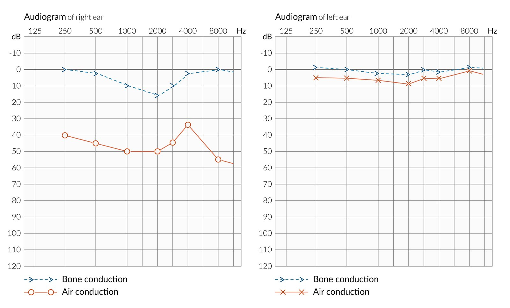

# Otosclerosis

*Categories: Clinical knowledge > Ear, nose, and throat > Auditory and vestibular system > Otosclerosis*

[Original Article Link](https://coursology-qbank.com/amboss/article/Kj0UYT)

---

## Summary

Otosclerosis refers to abnormal bone growth of the <u>bony labyrinth</u>, primarily at the <u>oval window</u>. It manifests at the <u>stapes</u>, which becomes increasingly fixated to the <u>oval window</u>. This process leads to progressive <u>conductive hearing loss</u> because the <u>ossicle</u>'s ability to vibrate becomes increasingly limited. Frequently, the other <u>ear</u> is also affected. Left untreated, the disease can progress to <u>deafness</u>. <u>Audiometry</u> reveals decreased air conduction and a characteristic <u>Carhart's notch</u> in the bone conduction curve. Replacement of the upper part of the <u>stapes</u> with a prosthesis (stapedotomy) is the treatment of choice.

---

## Epidemiology

* Sex: <u>♀</u> > <u>♂</u> (2:1)

* Age of onset: : 20–40 years

* Ethnicity: primarily affects whites

References:[[1]](https://coursology-qbank.com/amboss/article/-H0DGh)

Epidemiological data refers to the US, unless otherwise specified.

---

## Etiology

* The exact mechanism is unknown.

* 50% of cases show <u>autosomal dominant</u> inheritance with <u>incomplete penetrance</u>, while the rest occur sporadically.

References:[[1]](https://coursology-qbank.com/amboss/article/-H0DGh)

---

## Pathophysiology

* Nests of unossified <u>cartilaginous</u> cells in the enchondral layer of the <u>bony labyrinth</u> (<u>otic capsule</u>)  give rise to <u>spongy bone</u> (active otosclerotic focus) → otosclerosis

* Stapedial otosclerosis (most common site) → fixation of <u>stapes</u> to <u>oval window</u> → conductive <u>hearing loss</u>

References:[[2]](https://coursology-qbank.com/amboss/article/p30Ljf)

---

## Clinical features

* Slowly progressive <u>conductive hearing loss</u> with the 2nd <u>ear</u> affected in ∼ 70% of patients as the disease progresses

* <u>Tinnitus</u>

* Mild <u>vertigo</u> (approx. 25%)  [[1]](https://coursology-qbank.com/amboss/article/-H0DGh)

* Paracusis willisii: patients hear better in noisy rather than quiet surroundings.

* Quiet speech

* Schwartze sign: a red-blue hue seen through <u>tympanic membrane</u>

> [!NOTE]
> Symptoms may increase during <u>pregnancy</u> or following <u>menopause</u> because of hormonal changes.

---

## Diagnosis

* <u>Pure tone audiometry</u>

* ↓ Air conduction (especially for lower frequencies)

* Carhart notch: an increase in the bone conduction threshold at 2,000 Hz (which is seen as a dip in the bone conduction curve)

* <u>Impedance audiometry</u>: absent <u>stapedius reflex</u>

Otosclerosis audiogram

Rinne and Weber tuning fork tests

Weber and Rinne Test - Clinical Examination

References:[[1]](https://coursology-qbank.com/amboss/article/-H0DGh)[[3]](https://coursology-qbank.com/amboss/article/Us0b8h)

---

## Treatment

* The progression of otosclerosis cannot be significantly influenced by <u>conservative therapy</u>.

* Surgical procedures

* The <u>stapes</u> is partly (stapedotomy; ) or completely (stapedectomy) replaced by a prosthesis.

* <u>Cochlear implant</u>: in the case of bilateral <u>deafness</u>

---