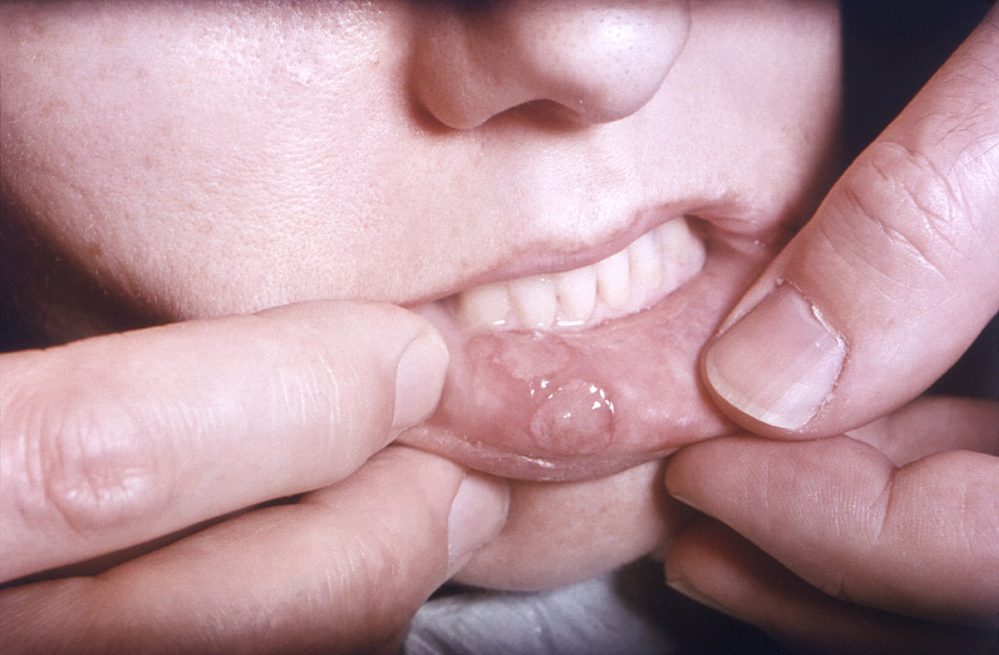
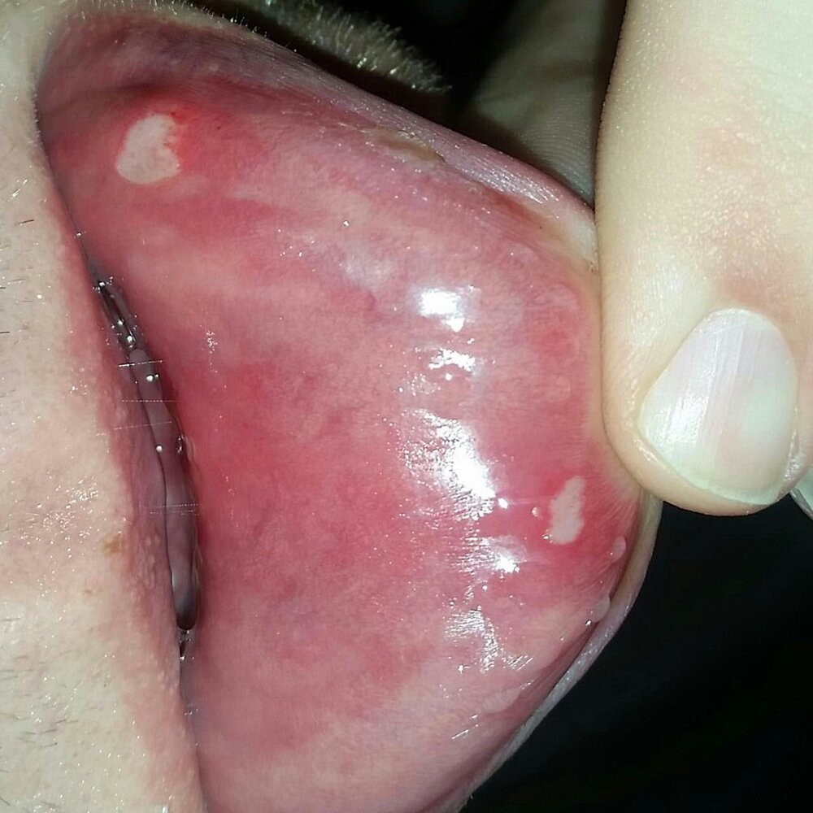

# Aphthous stomatitis

*Categories: Clinical knowledge > Ear, nose, and throat > Face, mouth, and speech > Aphthous stomatitis*

[Original Article Link](https://coursology-qbank.com/amboss/article/Gk0B6T)

---

## Summary

Aphthous <u>stomatitis</u> (also known as canker sores) is characterized by frequent recurrent mouth <u>ulcers</u>. The cause of these painful, mostly benign sores is unknown, but they commonly occur after minimal trauma (e.g., biting the <u>tongue</u>). There are several types of aphthae, all of which can only be treated symptomatically.

---

## Etiology

* There is no identifiable cause but aphthous <u>stomatitis</u> is likely multifactorial.

* May be associated with: 

* Certain disorders (e.g., <u>Behcet disease</u>, <u>inflammatory bowel disease</u>, <u>celiac disease</u>, <u>systemic lupus erythematosus</u>)

* <u>Dermatological disorders</u>

* <u>Malnutrition</u>;  (e.g., <u>vitamin B12 deficiency</u>, <u>folate deficiency</u>, <u>iron deficiency</u>)

* Infections (e.g., <u>HIV</u>)

* Drugs (e.g., <u>methotrexate</u>)

* Often triggered by minimal trauma (e.g., biting the <u>tongue</u>)

* Commonly occurs in individuals with <u>HIV</u>

---

## Clinical features

* Painful <u>mucosal</u> <u>ulcers</u> in nonkeratinized areas of the mouth  and throat

* Efflorescence: round to oval, crater-like appearance on yellowish-grey base and <u>erythematous</u> margins

* No systemic symptoms

* Recurrence is common

Aphthous stomatitis

Aphthous stomatitis

---

## Differential diagnoses

See “Differential diagnosis” in “<u>Acute tonsillitis</u>.”

The differential diagnoses listed here are not exhaustive.

---

## Treatment

* There is no causal treatment

* Symptomatic treatment includes <u>topical corticosteroids</u> (e.g., <u>dexamethasone</u>, <u>triamcinolone</u>), antimicrobials (e.g., <u>tetracycline</u>) and <u>anesthetics</u> (e.g., <u>lidocaine</u>, <u>benzocaine</u>).

---