# Head and neck carcinomas

*Categories: Clinical knowledge > Ear, nose, and throat > Face, mouth, and speech > Head and neck carcinomas*

[Original Article Link](https://coursology-qbank.com/amboss/article/Ts068h)

---

## Summary

Head and neck <u>carcinomas</u> arise in the squamous cells of the <u>mucosal</u> <u>epithelium</u> in the nasal cavity, <u>paranasal sinuses</u>, <u>oral cavity</u>, <u>pharynx</u>, <u>larynx</u>, and <u>trachea</u>. Other nonsquamous cell <u>carcinomas</u> arise in <u>salivary glands</u>, sinuses, muscles, and nerves of the head and neck. Excluding <u>nonmelanoma skin cancer</u>, <u>oral cavity</u> <u>malignancy</u> is the most common head and neck <u>carcinoma</u>. Nasal cavity, <u>oral cavity</u>, and <u>larynx</u> cancers are generally associated with tobacco and/or <u>alcohol</u> use, whereas <u>pharyngeal carcinomas</u> are typically caused by infections with <u>human papillomavirus</u> and <u>Epstein-Barr virus</u>. Clinical features depend on the site and etiology of the primary <u>tumor</u>. Treatment usually involves <u>surgery</u> followed by <u>radiotherapy</u> and/or <u>chemotherapy</u>. Cancers of the <u>brain</u>, <u>eye</u>, <u>ears</u>, <u>esophagus</u>, <u>thyroid gland</u>, and <u>skin</u> of the head and neck are generally not classified as head and neck cancers and are discussed in other articles.

<u>Oral cavity carcinoma</u>, <u>pharyngeal carcinoma</u>, and <u>laryngeal carcinoma</u> are discussed in more detail in their respective articles.

---

## Overview of head and neck cancers

| Overview of nasal cavity, paranasal sinus, and <u>pharyngeal cancers</u> |  |  |  |  |  |
| --- | --- | --- | --- | --- | --- |
| Type | <u>Nasal cavity carcinoma</u> | <u>Paranasal sinus carcinoma</u> |  <u>Pharyngeal carcinoma</u> [[2]](https://coursology-qbank.com/amboss/article/VHcG6d0)  |  |  |
|  <u>Nasopharyngeal carcinoma</u> [[3]](https://coursology-qbank.com/amboss/article/eKcx2W0)  | <u>Hypopharyngeal carcinoma</u> |  <u>Oropharyngeal carcinoma</u> [[4]](https://coursology-qbank.com/amboss/article/A-cR-U0)  |  |  |  |
| <u>Epidemiology</u> |   * Peak <u>incidence</u>: 40–50 years of age  * <u>♂</u> > <u>♀</u> [[5]](https://coursology-qbank.com/amboss/article/srctid0)  * Most common subtype: <u>SCC</u>    |  |   * Peak <u>incidence</u>: 50–60 years of age  * <u>♂</u> > <u>♀</u> (2:1)  * Most common subtype: <u>SCC</u>    |  |  |
| <u>Risk factors</u> and associations |   * Tobacco use  * Chronic and/or occupational inhalation exposure to wood dust  * <u>HPV infection</u>    |  |   * Tobacco and/or <u>alcohol</u> use  * Betel nut chewing  * Exposure to radiation    |  |  |
|  * Inhalation exposure to glues and adhesives   |   * Exposure to <u>air pollution</u>  * Inhalation exposure to leather, textiles, and formaldehyde  * <u>EBV infection</u>, sinonasal tract <u>lymphomas</u>    |   * Diets rich in <u>nitrosamine</u> (from eating salted and/or preserved foods)  * <u>EBV infection</u>    |  * <u>Plummer-Vinson syndrome</u>   |  * <u>HPV infection</u>   |  |
| Clinical features |   * Unilateral nasal obstruction  * <u>Epistaxis</u>    |  |   * Painless <u>lymphadenopathy</u> (early symptom)  * Unilateral nasal discharge, <u>postnasal drip</u>  * Impaired nasal breathing  * <u>Nosebleeds</u>  * Symptoms of <u>eustachian tube</u> obstruction (e.g., recurrent <u>otitis media</u>, <u>hearing loss</u>)    |   * Persistent <u>sore throat</u>  * Muffled voice  * Foreign body sensation  * <u>Dysphagia</u>  * <u>Odynophagia</u>  * <u>Otalgia</u>  * Painless <u>lymphadenopathy</u>    |  |
|  * <u>Hyposmia</u>/<u>anosmia</u>   |   * Commonly arise in the maxillary and <u>ethmoid sinuses</u>  * <u>Chronic sinusitis</u>    |  |  |  |  |
| Diagnostics |   * Rhinoscopy with <u>nasal endoscopy</u>  * <u>Biopsy</u> and histopathological examination  * Imaging: CT or <u>MRI</u>    |  |   * <u>Panendoscopy</u> (<u>laryngoscopy</u>, <u>bronchoscopy</u>, and <u>esophagoscopy</u>)  * <u>Biopsy</u> and histopathological examination (<u>confirmatory test</u>)  * Imaging: CT or <u>MRI</u>    |  |  |
| Treatment |   * Early stages (resectable tumors): surgical resection and <u>radiotherapy</u> (pre- or postoperative)  * Advanced stages (unresectable tumors): <u>radiation therapy</u> combined with <u>chemotherapy</u>    |  |   * Management options include <u>radiation therapy</u>, <u>chemotherapy</u>, and/or <u>surgery</u>.  * For more information, see “<u>Pharyngeal cancer</u>.”    |  |  |

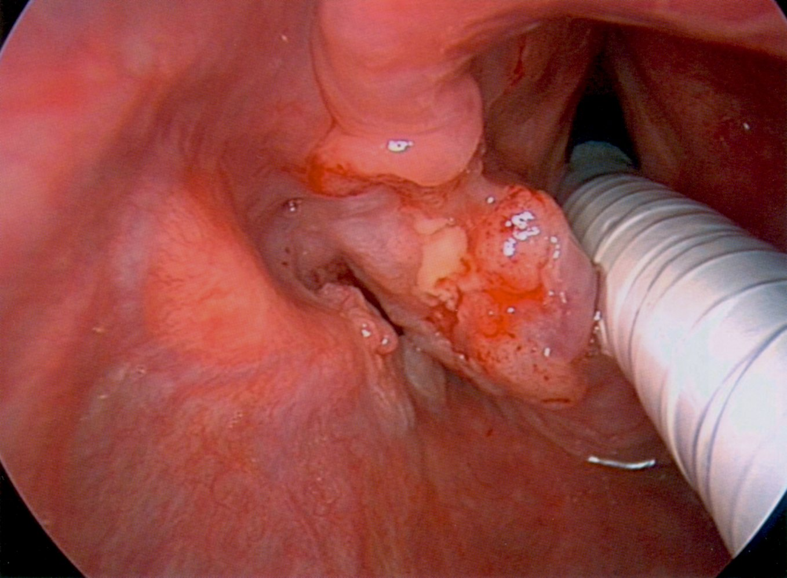

Hypopharyngeal cancer

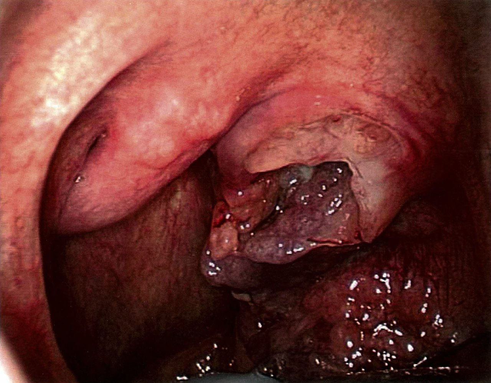

Oropharyngeal carcinoma

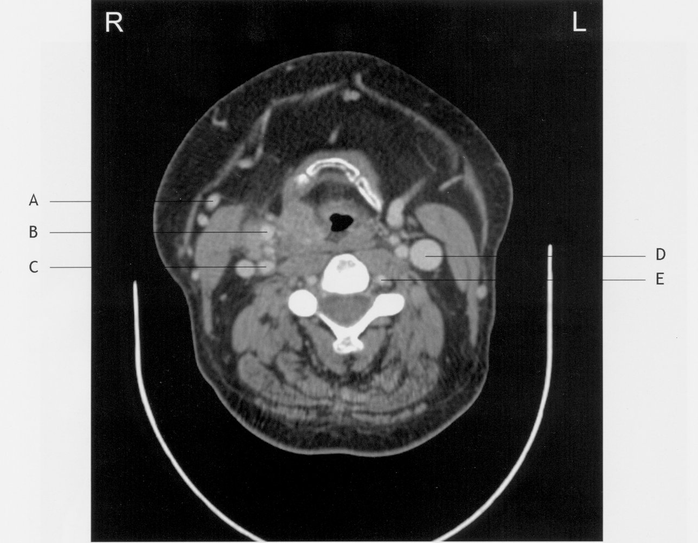

Hypopharyngeal cancer

|  Overview of <u>oral cavity</u>, tonsil, <u>tongue</u>, <u>salivary glands</u>, and <u>lip cancers</u> [[3]](https://coursology-qbank.com/amboss/article/eKcx2W0)  |  |  |  |  |  |  |
| --- | --- | --- | --- | --- | --- | --- |
| Type |  <u>Oral cavity carcinoma</u> [[2]](https://coursology-qbank.com/amboss/article/VHcG6d0)[[4]](https://coursology-qbank.com/amboss/article/A-cR-U0)  | <u>Tonsil carcinoma</u> |  <u>Tongue carcinoma</u> [[6]](https://coursology-qbank.com/amboss/article/_-c5-U0)  | <u>Salivary gland carcinoma</u> |  <u>Lip carcinoma</u> [[7]](https://coursology-qbank.com/amboss/article/K7cU5d0)[[8]](https://coursology-qbank.com/amboss/article/dHco6d0)  |  |
| <u>Epidemiology</u> |   * Peak <u>incidence</u>: 55–60 years of age [[9]](https://coursology-qbank.com/amboss/article/WG0Pyh)  * <u>♂</u> > <u>♀</u> (2:1)  * Most common subtype: <u>SCC</u>    |  |  |   * Peak <u>incidence</u>: 45–50 years of age  * <u>♂</u> > <u>♀</u>  * Common subtypes: <u>mucoepidermoid carcinoma</u> (most common), <u>adenoid cystic carcinoma</u>    |   * Peak <u>incidence</u>: ∼ 66 years of age [[8]](https://coursology-qbank.com/amboss/article/dHco6d0)  * <u>♂</u> > <u>♀</u>  * Common subtypes: <u>SCC</u>, <u>basal cell carcinoma</u>    |  |
| <u>Risk factors</u> and associations |   * Oral tobacco use and smoking  * Long-term <u>alcohol</u> use  * <u>Human papillomavirus</u>, particularly <u>HPV 16</u>, 18, 31, and 33  * <u>Stem cell</u> transplants  * Poor oral hygiene, chronic mechanical irritation (e.g., incorrectly positioned dentures)  * Precancerous lesions (e.g., <u>leukoplakia</u>, erythroplakia)    |  |  |  * <u>Ionizing radiation</u>, viral infection (e.g., <u>HIV</u>)   |   * Tobacco and/or <u>alcohol</u> use  * Prolonged sun exposure  * <u>HPV infection</u>    |  |
| Clinical features |   * Nonhealing, usually painless <u>ulcer</u> on <u>tonsils</u>, <u>lateral</u> <u>ventral</u> <u>tongue</u>, lower lip, and/or floor of the mouth  * <u>Halitosis</u>  * Bleeding in the mouth  * <u>Cervical lymphadenopathy</u>    |  |  |   * Location: <u>parotid glands</u> > submandibular and <u>sublingual glands</u> > minor <u>salivary glands</u>  * Insidious onset  * Painless <u>submucosal</u> swelling or <u>mucosal</u> <u>ulceration</u> (<u>palate</u>, buccal <u>mucosa</u>, <u>lips</u>)    |   * Infiltrative or <u>exophytic</u> lesion of the <u>lips</u>  * Nonhealing <u>ulcer</u> lesion    |  |
|   * <u>Pain</u> (e.g., earache, mouth <u>pain</u>)  * <u>Dysphagia</u>, <u>odynophagia</u>    |   * Persistent <u>sore throat</u>, <u>globus sensation</u>  * Unilateral <u>otalgia</u>  * Unilaterally indurated and/or enlarged tonsil  * <u>Dysphagia</u>, <u>odynophagia</u>    |   * White or red <u>ulcers</u> on the <u>tongue</u>  * Localized <u>pain</u>    |  |  |  |  |
| Diagnostics |   * <u>Panendoscopy</u>  * <u>Biopsy</u> and <u>histopathology</u> of the lesion  * <u>Fine-needle aspiration</u> of any associated <u>lymphadenopathy</u>  * Imaging: CT or <u>MRI</u>    |  |  |   * <u>Ultrasound</u> of the head and neck  * <u>Biopsy</u> and <u>histopathology</u> of the lesion  * <u>Mucoepidermoid carcinoma</u>: squamous, <u>mucinous</u>, and polygonal intermediate cells  * <u>Adenoid cystic carcinoma</u>: slow, infiltrative growth along nerve sheaths  * Imaging: CT or <u>MRI</u>    |   * <u>Exfoliative cytology</u> and direct microscopy  * <u>Biopsy</u> and <u>histopathology</u> of the lesion    |  |
| Treatment |   * Early stages: surgical resection  * Advanced stages (with local spread): surgical resection and <u>radiation therapy</u>, with or without <u>chemotherapy</u>  * Inoperable tumors: <u>radiation therapy</u> with <u>adjuvant chemotherapy</u>  * For more information, see “<u>Oral cavity cancer</u>” and “<u>Tongue conditions</u>.”    |  |  |   * Parotidectomy (<u>superficial</u> or total)  * Advanced stages (with local spread and/or high-grade tumors): <u>neck dissection</u> and/or <u>adjuvant radiotherapy</u> [[10]](https://coursology-qbank.com/amboss/article/-waDl5)[[11]](https://coursology-qbank.com/amboss/article/ZR0Zlf)  * For more information, see “<u>Malignant tumors of the salivary glands</u>.”    |  * Surgical excision and/or <u>radiotherapy</u>   |  |

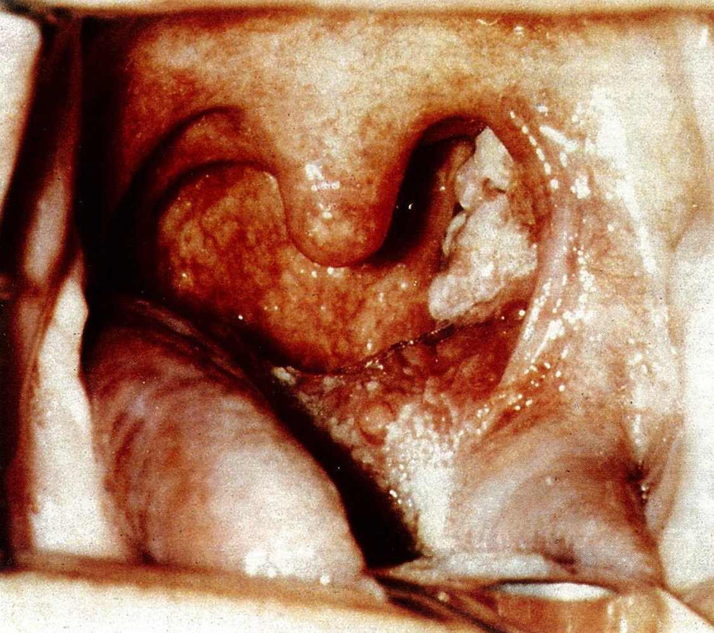

Tonsillar cancer

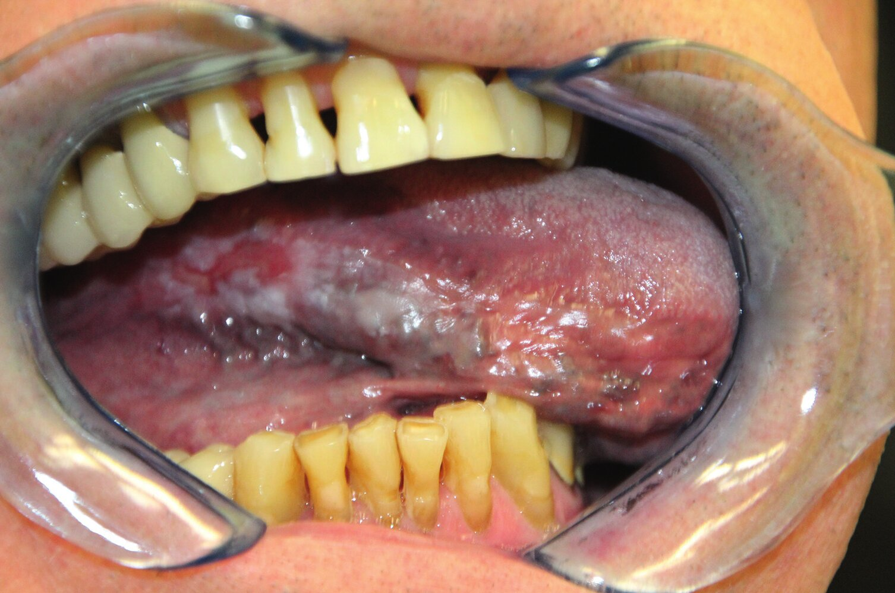

Oral cancer

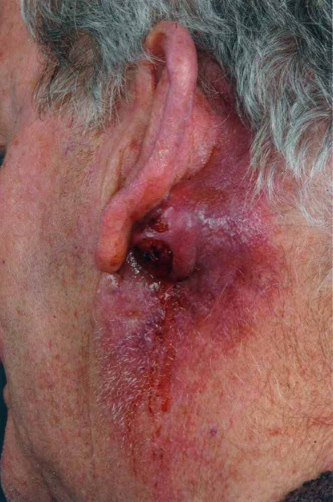

Squamous cell carcinoma of the parotid gland

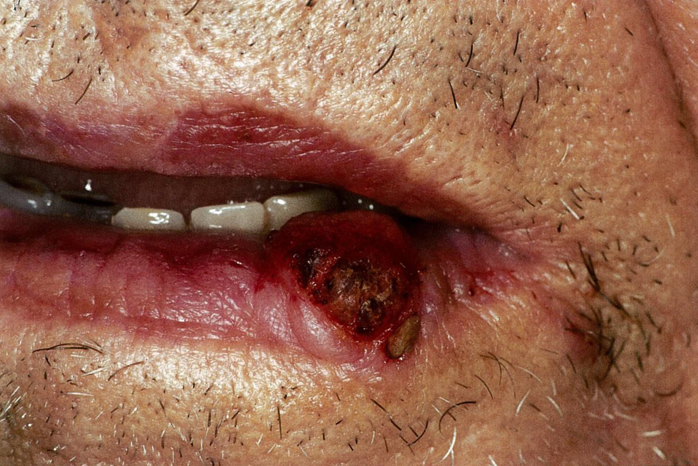

Squamous cell carcinoma

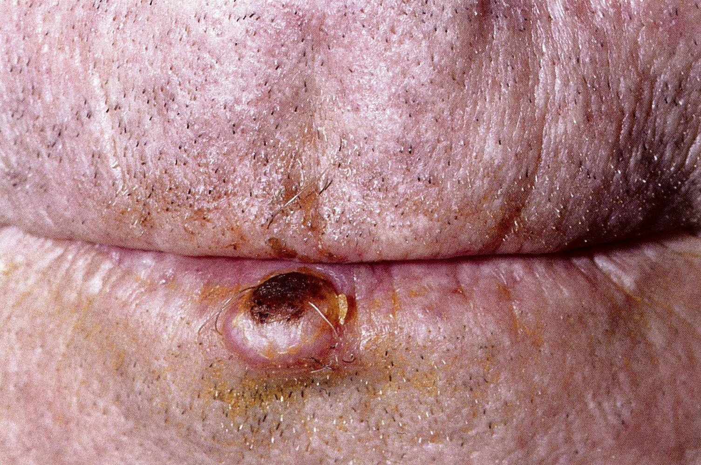

Squamous cell carcinoma

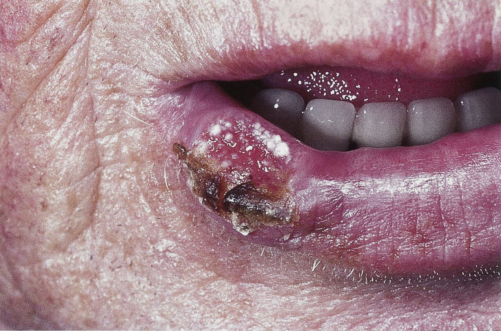

Squamous cell carcinoma

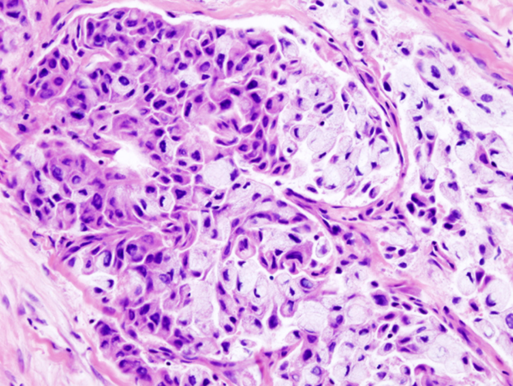

Mucoepidermoid carcinoma

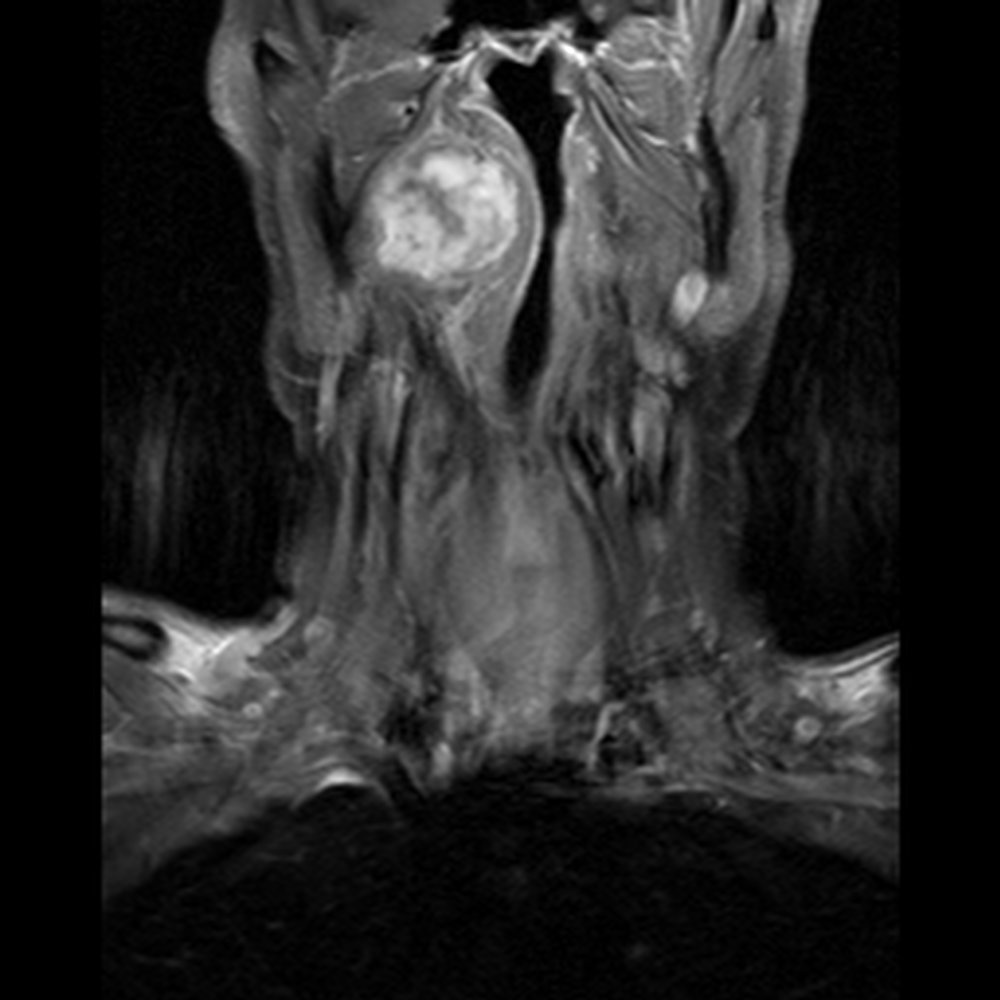

Mucoepidermoid carcinoma of the submandibular gland

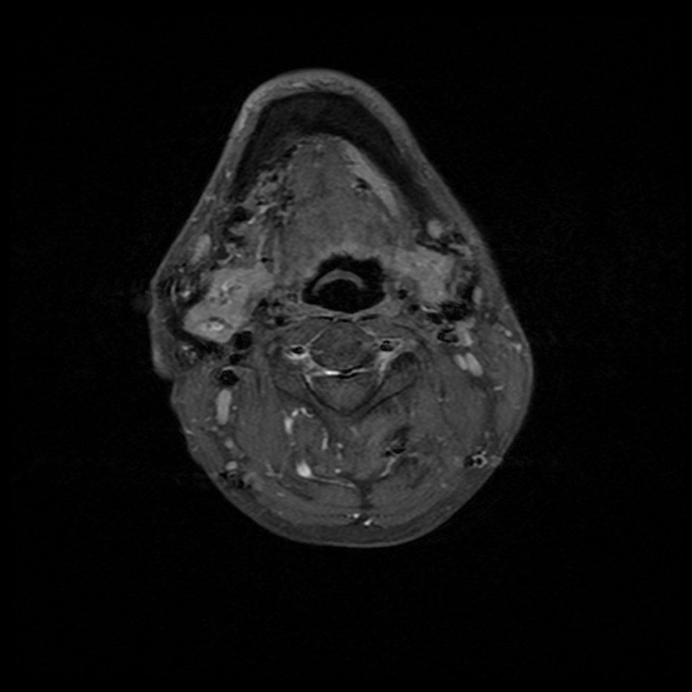

Tumor of submandibular gland

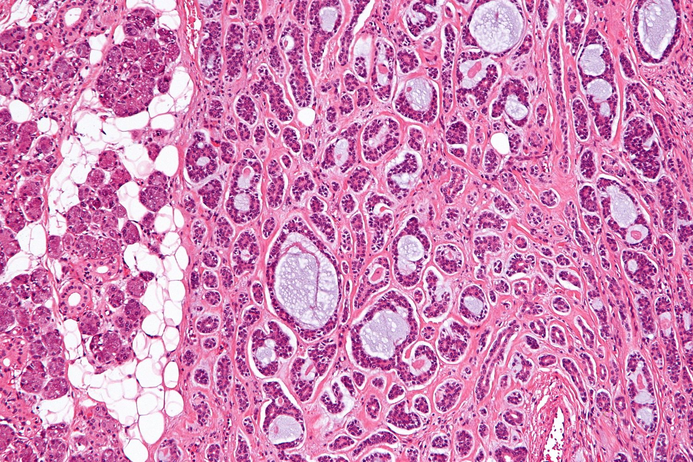

Adenoid cystic carcinoma in parotid gland

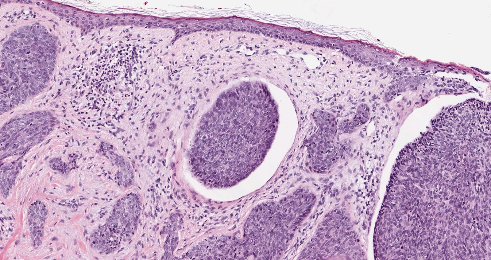

Basal cell carcinoma

|  Overview of laryngeal and <u>tracheal cancers</u> [[6]](https://coursology-qbank.com/amboss/article/_-c5-U0)  |  |  |  |  |
| --- | --- | --- | --- | --- |
| Type |  <u>Laryngeal carcinoma</u> [[2]](https://coursology-qbank.com/amboss/article/VHcG6d0)[[12]](https://coursology-qbank.com/amboss/article/--cD-U0)  |  |  |  <u>Tracheal carcinoma</u> [[13]](https://coursology-qbank.com/amboss/article/VDcGWe0)  |
| <u>Supraglottic</u> <u>carcinoma</u> |  <u>Glottic</u> <u>carcinoma</u>   | <u>Subglottic</u> <u>carcinoma</u> |  |  |
| <u>Epidemiology</u> |   * Peak <u>incidence</u>: 40–70 years of age  * <u>♂</u> > <u>♀</u>  * Most common subtype: <u>SCC</u>    |  |  |   * Peak <u>incidence</u>: 60–70 years of age  * <u>♂</u> > <u>♀</u>  * Primary <u>tracheal carcinomas</u> are uncommon.  * Most common subtypes: <u>SCC</u> and <u>adenoid cystic carcinoma</u>    |
| <u>Risk factors</u> and associations |   * Tobacco and/or <u>alcohol</u> use  * <u>High-risk HPV</u> (e.g., type 16 or 18)  [[14]](https://coursology-qbank.com/amboss/article/vTdAs60)  * Exposure to paint, <u>asbestos</u>, gasoline fumes, and radiation  * Betel nut chewing  * Diets rich in <u>nitrosamines</u> and fats    |  |  |   * Tobacco use  * Exposure to hydrocarbons (e.g., wood smoke, asphalt fumes)    |
| Clinical features |   * Usually discovered at an advanced stage  * <u>Dysphagia</u>  * <u>Hoarseness</u> (usually late-onset)  * Foreign body sensation  * <u>Airway obstruction</u>    |   * Persistent <u>hoarseness</u>/change in voice  * <u>Otalgia</u>  * <u>Chronic cough</u>  * <u>Hemoptysis</u>  * <u>Stridor</u>    |   * Usually discovered at an advanced stage  * <u>Dyspnea</u> and/or <u>stridor</u>    |   * <u>Wheezing</u>, <u>stridor</u>, <u>cough</u>, <u>dyspnea</u>, and <u>hemoptysis</u>  * Symptoms of invasion of the <u>larynx</u> and/or <u>pharynx</u> (e.g., <u>dysphagia</u>, <u>hoarseness</u>)    |
| Diagnostics |   * <u>Direct laryngoscopy</u>: may reveal irregular, nodular, or ulcerative lesions  * <u>Biopsy</u> and <u>histopathology</u> of the lesion  * Imaging: CT with contrast and/or <u>MRI</u>    |  |  |   * <u>Bronchoscopy</u> with <u>biopsy</u> and <u>histopathology</u> of the lesion  * Imaging: <u>chest x-ray</u> or CT    |
| Treatment |   * Early stages: <u>radiotherapy</u> and/or transoral endoscopic laser resection  * Advanced stages (with <u>lymph node</u> and/or distant organ <u>metastasis</u>): total <u>laryngectomy</u>, <u>chemotherapy</u>, and/or <u>radiotherapy</u>  * For more information, see “<u>Laryngeal carcinoma</u>.”    |  |  |  * Surgical resection with adjuvant radiation or <u>chemoradiotherapy</u>   |

Laryngoscopic view of glottic carcinoma (T1a)

Glottic carcinoma (T1b)

Laryngeal squamous cell carcinoma

---

## Nasal cavity and paranasal sinus carcinomas

### Definition

Tumors arising in the nasal cavity and/or <u>paranasal sinuses</u>.

### <u>Epidemiology</u> [[5]](https://coursology-qbank.com/amboss/article/srctid0)

* Peak <u>incidence</u>: ≥ 60 years of age

* <u>Prevalence</u>: < 3% of tumors in the respiratory tract

* Sex: <u>♂</u> > <u>♀</u>

* Most common <u>malignant tumors</u>: <u>cutaneous squamous cell carcinoma</u>, <u>adenocarcinoma</u>, <u>neuroendocrine tumors</u>, <u>mucosal melanoma</u>

### Etiology [[15]](https://coursology-qbank.com/amboss/article/QhYudK)

* <u>Nasal cavity carcinoma</u>

* Chronic and/or occupational inhalation exposure to tobacco, wood dust, glues, and adhesives

* Associated with <u>HPV infection</u>

* <u>Paranasal sinus carcinoma</u>

* Chronic and/or occupational inhalation exposure to <u>air pollution</u>, tobacco, wood dust, leather, textiles, and formaldehyde

* Associated with <u>HPV infection</u>, <u>EBV infection</u>, and sinonasal tract <u>lymphomas</u>

### Clinical features

* Most common sites: nasal cavity, followed by the <u>maxillary sinus</u>

* Unilateral nasal obstruction

* <u>Epistaxis</u>

* <u>Chronic sinusitis</u>

* <u>Hyposmia</u>/<u>anosmia</u>

* Advanced disease: a triad of facial asymmetry, palpable or visible <u>tumor</u> in the <u>oral cavity</u>, and visible intranasal <u>tumor</u>

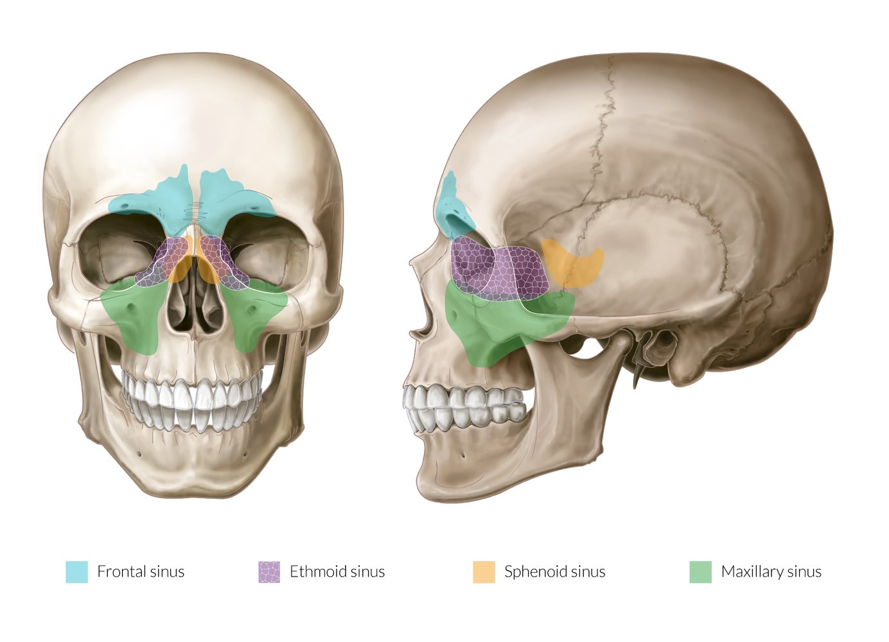

Paranasal sinuses

### Diagnostics

* <u>Nasal endoscopy</u>

* <u>Biopsy</u> and histopathological examination

* Imaging: CT and <u>MRI</u>

### Treatment

* Resectable tumors: surgical resection and <u>radiotherapy</u> (pre- or postoperative)

* Unresectable tumors: <u>radiation therapy</u> combined with <u>chemotherapy</u>

### Complications

* Involvement of adjacent structures (e.g., <u>eye</u> <u>orbits</u>, sinuses, <u>palate</u>) causing <u>neuralgias</u>, facial <u>pain</u>, impaired <u>vision</u>, ocular symptoms (e.g., <u>exophthalmos</u>, <u>diplopia</u>), and/or <u>dentalgia</u>

### Prognosis [[16]](https://coursology-qbank.com/amboss/article/eDcxWe0)

The five-year relative survival rate for nasal cavity and paranasal sinus <u>carcinomas</u> is ∼ 80%.

> [!TIP]
> A patient with unilateral difficulty breathing through the nose may have a <u>malignant tumor</u>.

---

## Lip carcinoma

### Definition

A <u>malignant tumor</u> of the <u>lips</u>.

### <u>Epidemiology</u>

* Peak <u>incidence</u>: ∼ 66 years of age [[8]](https://coursology-qbank.com/amboss/article/dHco6d0)

* Sex: <u>♂</u> > <u>♀</u>

### Etiology [[17]](https://coursology-qbank.com/amboss/article/r7cfMd0)

* <u>Risk factors</u>

* Tobacco use, <u>alcohol</u> use, prolonged UV exposure

* Associated with <u>HPV infection</u>

### Histological subtype [[17]](https://coursology-qbank.com/amboss/article/r7cfMd0)

* <u>SCC</u> (most common)

* <u>Basal cell carcinoma</u>

### Clinical features

* Infiltrative or <u>exophytic</u> lesion of the <u>lips</u>

* <u>Ulcer</u> lesion

* <u>Pain</u>, numbness, and/or bleeding of the lip

* Advanced stage: loss of sensation around the chin and/or invasion of the premaxilla and nasal cavity

Squamous cell carcinoma

Squamous cell carcinoma

Squamous cell carcinoma

### Diagnostics

* <u>Physical examination</u> of the <u>lips</u>

* <u>Exfoliative cytology</u> and direct microscopy

* <u>Biopsy</u> and <u>histopathology</u> of the lesion

* See “<u>Diagnostics for cSCC</u>” and “<u>Diagnostics for BCC</u>” as needed

### Treatment [[17]](https://coursology-qbank.com/amboss/article/r7cfMd0)

* Surgical excision and/or <u>radiation therapy</u>

* See “<u>Treatment of cSCC</u>” and “Treatment of BCC§ as needed.

### Prognosis [[8]](https://coursology-qbank.com/amboss/article/dHco6d0)[[18]](https://coursology-qbank.com/amboss/article/77c4Md0)

* Early stage <u>SCC</u> has a <u>five-year survival rate</u> of ∼ 90%.

* <u>SCC</u> that originates in the upper lip and/or <u>labial commissure</u> has a worse prognosis than <u>SCC</u> of the lower lip.

---

## Tracheal carcinoma

### Definition

A <u>malignant tumor</u> of the <u>trachea</u>.

### Classification

* Primary <u>tracheal carcinomas</u>

* Uncommon: approx. 0.2% of all respiratory malignancies in the US [[19]](https://coursology-qbank.com/amboss/article/R7clld0)

* Main subtypes: <u>SCC</u> (∼ 85%) and <u>adenoid cystic carcinoma</u> (∼ 15%)

* Very rare: <u>mucoepidermoid carcinoma</u>, <u>neuroendocrine tumors</u>, <u>pleomorphic adenoma</u>

* Usually malignant in adults and benign in children

* Secondary <u>tracheal carcinomas</u> (most common): may arise from hematogenous or lymphatic sites of <u>metastasis</u>, or by direct extension from adjacent structures (e.g., <u>thyroid</u>, <u>esophagus</u>)

### <u>Epidemiology</u> [[19]](https://coursology-qbank.com/amboss/article/R7clld0)

* Peak <u>incidence</u>: 60–70 years of age

* Sex: <u>♂</u> > <u>♀</u>

### Etiology

* <u>Risk factors</u>: <u>tobacco smoking</u>, inhalation exposure to hydrocarbons

* Direct invasion of the <u>trachea</u> from <u>carcinoma</u> of the <u>lung</u>, <u>esophagus</u>, <u>larynx</u>, or <u>thyroid gland</u>

* Hematogenous spread from <u>carcinoma</u> of the <u>breast</u>, <u>colon</u>, <u>kidney</u>, and <u>melanoma</u>

### Clinical features [[13]](https://coursology-qbank.com/amboss/article/VDcGWe0)

* Usually mimics other conditions

* Only symptomatic if obstructing the <u>tracheal</u> lumen

* Symptoms vary based on the location of the <u>tumor</u> and histological subtype.

* <u>Airway obstruction</u>: <u>wheezing</u>, <u>stridor</u>, <u>cough</u>, <u>dyspnea</u>, and <u>hemoptysis</u>

* Invasion of adjacent structures (e.g., <u>larynx</u>, <u>pharynx</u>): <u>dysphagia</u>, <u>hoarseness</u> (due to recurrent nerve palsy)

### Diagnostics

* Usually a diagnosis of exclusion, after lack of response to treatment for alternative diagnoses (e.g., <u>COPD</u>, <u>bronchitis</u>)

* Imaging: <u>chest x-ray</u> or CT to rule out other conditions

* <u>Bronchoscopy</u> with <u>biopsy</u> (<u>confirmatory test</u>)

* <u>SCC</u>: <u>exophytic</u> or ulcerous lesions that can be multifocal (up to 10%) or arise as an intraluminal <u>nodule</u>

* <u>Adenoid cystic carcinoma</u> (<u>ACC</u>): polypoid lesions in the <u>trachea</u> or main stem <u>bronchi</u>

* <u>Mucoepidermoid carcinoma</u>: polypoid lesions from bronchial glands in the central <u>airways</u>

### Treatment [[20]](https://coursology-qbank.com/amboss/article/k7cmNd0)

* <u>SCC</u>

* Localized <u>carcinoma</u>: complete surgical resection with postoperative radiation or <u>chemoradiotherapy</u>

* Unresectable, nonmetastatic <u>carcinoma</u>: <u>chemoradiotherapy</u>

* <u>ACC</u>: <u>radiotherapy</u> or <u>chemoradiotherapy</u>

* <u>Mucoepidermoid carcinoma</u>: surgical resection

* See “<u>Airway management in head and neck cancer</u>” if sedation and/or <u>intubation</u> is required.

### Prognosis

The five-year overall survival rate for <u>ACC</u> is approx. 80% and approx. 10% for <u>SCC</u>. [[13]](https://coursology-qbank.com/amboss/article/VDcGWe0)

---