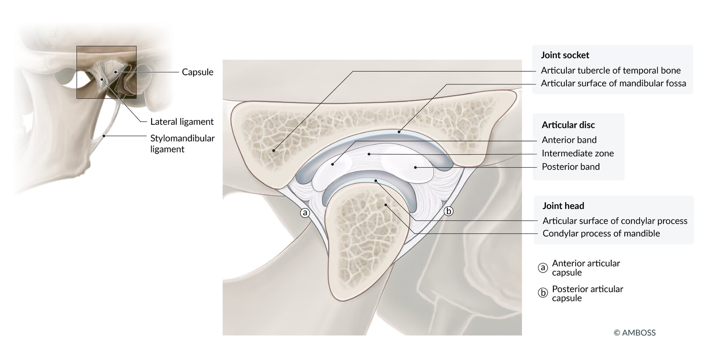
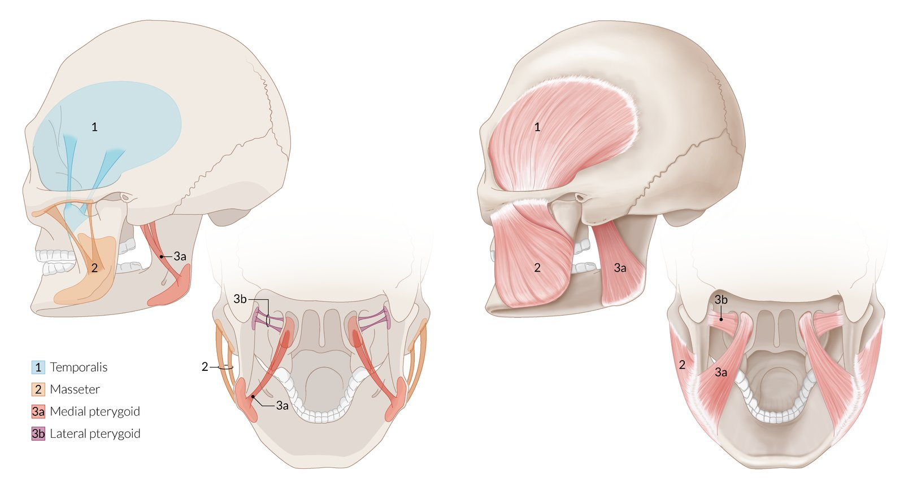

# Jaw disorders

*Categories: Clinical knowledge > Ear, nose, and throat > Face, mouth, and speech > Jaw disorders*

[Original Article Link](https://coursology-qbank.com/amboss/article/BF0z43)

---

## Summary

The most common disorders affecting the <u>jaw</u> are <u>temporomandibular joint (TMJ) disorders</u> and <u>jaw dislocation</u>. <u>TMJ</u> disorders include conditions that cause <u>myalgias</u>, <u>arthralgia</u>, <u>headaches</u>, and biomechanical dysfunction in and around the <u>TMJ</u>. They commonly affect young adults and are likely multifactorial in origin. The diagnosis is clinical and based on characteristic features, which include <u>pain</u>, <u>headache</u>, limitations in <u>jaw</u> functioning, and clicking or grinding of the <u>TMJ</u>. Most patients are <u>treated conservatively</u>, e.g., with <u>oral analgesics</u>, behavior modification, <u>heat therapy</u>, and/or <u>splints</u>, and those with refractory symptoms are referred to a specialist. <u>TMJ dislocation</u> can occur unilaterally or bilaterally as a result of extreme mouth opening or direct trauma. Patients present with an inability to close their mouths, impaired speech, and visible facial deformities. The standard treatment is <u>closed reduction</u>. Complications include <u>mandibular fractures</u>, <u>neurovascular injuries</u>, <u>dental injuries</u>, and repeat <u>dislocations</u>. Irreducible <u>TMJ dislocations</u> and mandibular <u>fracture-dislocations</u> usually require specialized treatment (e.g., <u>surgery</u>).

---

## Temporomandibular joint disorders

### Background [[1]](https://coursology-qbank.com/amboss/article/PHcWqd0)[[2]](https://coursology-qbank.com/amboss/article/iHcJJd0)

* Description

* A syndrome of <u>pain</u> in and <u>dysfunction of the TMJ</u> and <u>muscles of mastication</u>

* Includes myofascial disorders, temporomandibular disc disorders, <u>arthritis</u>, and autoimmune disorders

* <u>Epidemiology</u>: commonly affects young adults (<u>prevalence</u> 15–31%; peak age 20–40 years) [[2]](https://coursology-qbank.com/amboss/article/iHcJJd0)[[3]](https://coursology-qbank.com/amboss/article/e3WxhO0)

Cross-section of the (left) temporomandibular joint

Muscles of mastication

### Etiology [[1]](https://coursology-qbank.com/amboss/article/PHcWqd0)[[4]](https://coursology-qbank.com/amboss/article/uuXpG-)

The etiology of <u>TMJ</u> disorders (<u>TMDs</u>) is likely multifactorial and involves:

* Behavioral factors: e.g., poor head and/or <u>cervical spine</u> posture, possibly <u>bruxism</u>  [[1]](https://coursology-qbank.com/amboss/article/PHcWqd0)[[5]](https://coursology-qbank.com/amboss/article/i3WJRO0)[[6]](https://coursology-qbank.com/amboss/article/Q3WuRO0)

* Psychological factors: e.g., <u>depression</u>, <u>anxiety</u>, <u>stress</u>

* Trauma to the <u>TMJ</u>: e.g., <u>cervical spine</u> or <u>jaw</u> injuries

* Abnormal processing of <u>trigeminal nerve</u> <u>pain</u>: e.g., sensitization

* <u>Substance use disorder</u>: e.g., <u>cocaine</u>, <u>MDMA</u>, <u>methamphetamines</u>  [[7]](https://coursology-qbank.com/amboss/article/amWQVN0)[[8]](https://coursology-qbank.com/amboss/article/dmWoeN0)[[9]](https://coursology-qbank.com/amboss/article/VmWGeN0)

### Clinical features [[1]](https://coursology-qbank.com/amboss/article/PHcWqd0)[[2]](https://coursology-qbank.com/amboss/article/iHcJJd0)

* <u>Pain</u>

* Typically preauricular

* Constant, dull, unilateral, with intermittent sharp <u>pain</u>

* Can spread to <u>the ear</u>, temporal regions, periorbital regions, and/or the <u>mandible</u>

* Aggravating factors

* Worsened by <u>jaw</u> motion (e.g., chewing)

* Tenderness on palpation of the <u>TMJ</u>

* Other symptoms

* <u>Ear</u> discomfort

* <u>Headache</u> (most often temporal)

* Clicking, cracking, or grinding of the <u>TMJ</u>

* Mild <u>trismus</u>, e.g.:

* Limited <u>jaw</u> opening (occasionally painful)

* Intermittent locking of the <u>jaw</u>

* Patients may report <u>bruxism</u>.  [[1]](https://coursology-qbank.com/amboss/article/PHcWqd0)[[5]](https://coursology-qbank.com/amboss/article/i3WJRO0)[[6]](https://coursology-qbank.com/amboss/article/Q3WuRO0)

> [!WARNING]
> Consider a more serious cause of <u>trismus</u> (e.g., <u>head and neck cancer</u>, <u>deep neck infection</u>, <u>tetanus</u>, <u>acute dystonic reaction</u>) if <u>trismus</u> is sustained, progressive, severe, occurs without <u>jaw</u> clicking, or accompanied by atypical symptoms, e.g., <u>lymphadenopathy</u> or oral lesions. [[10]](https://coursology-qbank.com/amboss/article/zNWrdN0)[[11]](https://coursology-qbank.com/amboss/article/ZmWZVN0)

### Diagnosis [[2]](https://coursology-qbank.com/amboss/article/iHcJJd0)

* <u>TMJ</u> disorders are <u>clinical diagnoses</u>.

* Diagnostic criteria for <u>temporomandibular disorders</u> (DC/<u>TMD</u>) are used clinically and for research. [[12]](https://coursology-qbank.com/amboss/article/U3Wb3O0)

* Multiple <u>TMD</u> subtypes exist with unique individual criteria.

* Generally, a <u>TMD</u> is diagnosed if characteristic clinical features (e.g., <u>pain</u>, locking, clicking, <u>headache</u>):

* Can be localized to the <u>TMJ</u> and nearby anatomic regions

* Are reproducible with <u>jaw</u> function and/or provocation tests

* Have been present for at least 30 days

* Cannot be explained by another disorder

* Imaging (e.g., CT, <u>MRI</u>) is typically used to rule out other diagnoses (e.g., <u>fracture</u>, infection) and if symptoms persist despite <u>conservative treatment</u>.

### Management [[1]](https://coursology-qbank.com/amboss/article/PHcWqd0)[[2]](https://coursology-qbank.com/amboss/article/iHcJJd0)[[13]](https://coursology-qbank.com/amboss/article/QHcuJd0)

* Begin a trial of <u>conservative management</u> for all patients.

* If there is no improvement in 2–4 weeks or a severe acute exacerbation, consider imaging, outpatient specialist consultation, and treatment escalation as needed. [[2]](https://coursology-qbank.com/amboss/article/iHcJJd0)

* Consult oromaxillofacial <u>surgery</u> (<u>OMFS</u>) if there is a history of <u>TMJ</u> trauma or <u>fracture</u>, refractory severe <u>pain</u>, or persistent <u>pain</u> of unclear etiology for longer than 3–6 months. [[2]](https://coursology-qbank.com/amboss/article/iHcJJd0)

* Consult dentistry for underlying <u>dental disorders</u>.

#### <u>Conservative management</u>

* General measures

* Soft diet

* Moist warm compresses

* <u>Physical therapy</u> and passive stretching exercises

* Patient education and behavior modification (e.g., <u>stress</u> reduction, avoiding excessive opening of the <u>mandible</u> when yawning)

* <u>Occlusal splints</u>

* Pharmacological therapy

* <u>NSAIDs</u> (e.g., <u>naproxen</u>): first-line agents (see “<u>Oral analgesics</u>” for dosages) [[2]](https://coursology-qbank.com/amboss/article/iHcJJd0)

* <u>Muscle relaxants</u> (e.g., <u>cyclobenzaprine</u>): generally added for patients with evidence of a muscular component (e.g., muscle spasms, tenderness to palpation) [[2]](https://coursology-qbank.com/amboss/article/iHcJJd0)[[13]](https://coursology-qbank.com/amboss/article/QHcuJd0)

* Inadequate improvement after 2–4 weeks of <u>conservative treatment</u>, <u>NSAIDs</u>, and/or <u>muscle relaxants</u>: Consider adding <u>tricyclic antidepressants</u> (e.g., <u>amitriptyline</u>), <u>benzodiazepines</u> (e.g., <u>diazepam</u>), or <u>anticonvulsants</u> (e.g., <u>gabapentin</u>). [[2]](https://coursology-qbank.com/amboss/article/iHcJJd0)

> [!WARNING]
> <u>Opioids</u> are generally not recommended to treat <u>TMDs</u>. <u>Opioids</u> should only be used for a short period of time in patients with severe <u>pain</u> refractory to nonopioid medication. [[2]](https://coursology-qbank.com/amboss/article/iHcJJd0)

#### Invasive management

* <u>Intraarticular corticosteroid injection</u>

* Other injectable agents: intraarticular hyaluronic injections, <u>botulinum toxin</u> injections

* <u>Surgery</u> (rarely required)

* Indications: if <u>conservative measures</u> and intraarticular injections are unsuccessful and in patients with a history of recent trauma

* Procedures: <u>arthroscopy</u>, <u>discectomy</u>, <u>total joint replacement</u>

---