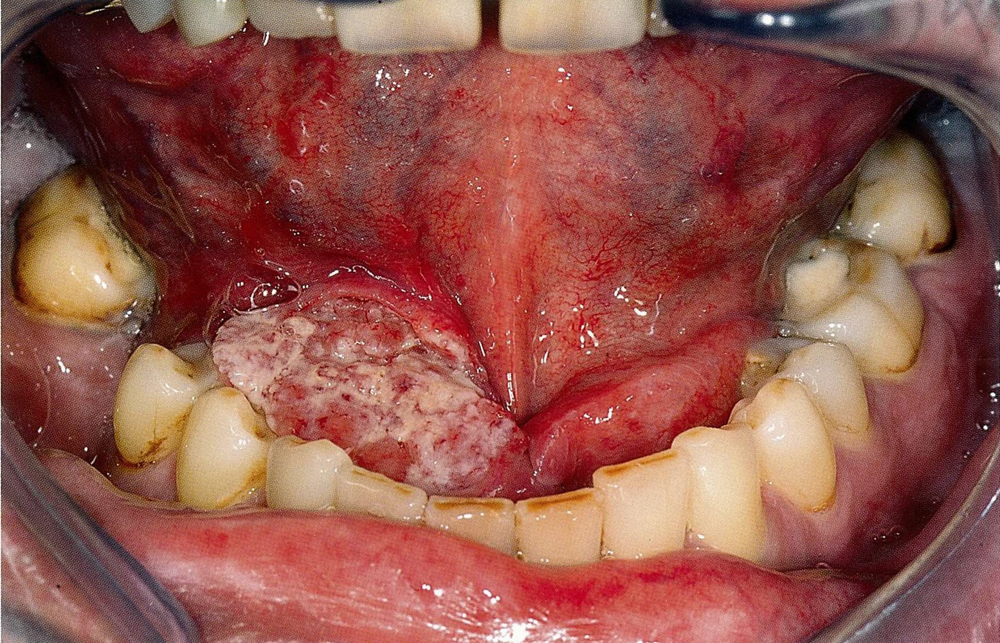

# Oral cavity cancer

*Categories: Clinical knowledge > Ear, nose, and throat > Face, mouth, and speech > Oral cavity cancer*

[Original Article Link](https://coursology-qbank.com/amboss/article/Po0WXS)

---

## Summary

<u>Oral cavity</u> cancers refer to <u>malignant tumors</u> of the oral <u>mucosa</u>, <u>tonsils</u>, and <u>salivary glands</u>. Predisposing factors include smoking, oral tobacco consumption, long term <u>alcohol</u> use, and <u>human papilloma virus</u> infection. <u>Oral cavity</u> cancers usually present in males, aged 55–60 years, with clinical features like <u>pain</u>, <u>dysphagia</u>, or a nonhealing <u>ulcer</u> on the <u>tonsils</u>, <u>tongue</u>, or oral <u>mucosa</u>. Clinically suspected cases are confirmed via histopathological examination of a <u>biopsy</u> specimen. Imaging and <u>panendoscopy</u> help determine the extent of the <u>tumor</u> and to rule out spread. Treatment depends upon the stage of the <u>tumor</u> and the extent of its spread, and may include surgical resection (usually with <u>neck dissection</u>), <u>radiation therapy</u>, and/or <u>chemotherapy</u>.

---

## Etiology

* <u>Risk factors</u>

* Oral tobacco consumption (e.g., snuff, paan/betel quid), smoking

* Long-term <u>alcohol</u> consumption

* Poor oral hygiene, chronic mechanical irritation (e.g., badly positioned dentures)

* Human papillomavirus, particularly <u>HPV 16</u>, 18, 31, and 33

* Presence of precancerous lesions : <u>leukoplakia</u> , erythroplakia , <u>erythroleukoplakia</u>

References:[[1]](https://coursology-qbank.com/amboss/article/XG09Bh)[[3]](https://coursology-qbank.com/amboss/article/QfYuNo)[[4]](https://coursology-qbank.com/amboss/article/jfY_No)

---

## Types of cancers in the oral cavity

* Oral <u>mucosal</u> cancer: <u>squamous cell carcinoma</u> (most common); ulcerative or <u>verrucous</u> growth

* <u>Salivary gland cancer</u>: usually <u>mucoepidermoid carcinoma</u> (see <u>Malignant tumors of the salivary glands</u>)

* <u>Tonsillar cancer</u>: <u>squamous cell carcinoma</u> (most common, > 70%), <u>lymphoma</u>

References:[[1]](https://coursology-qbank.com/amboss/article/XG09Bh)[[5]](https://coursology-qbank.com/amboss/article/cG0ayh)[[6]](https://coursology-qbank.com/amboss/article/PfYWmo)

---

## Clinical features

* <u>Halitosis</u>

* <u>Pain</u> (e.g., earache)

* <u>Dysphagia</u>

* Nonhealing <u>ulcer</u> on <u>tonsils</u>, <u>lateral</u>/<u>ventral</u> <u>tongue</u>, lower lip, and/or floor of the mouth

* Unusual bleeding in the mouth

* Facial swelling (e.g., around the jawbone), <u>pain</u> or <u>paralysis</u> of a part of the face → <u>salivary gland</u> <u>tumor</u> likely

* <u>Lymphadenopathy</u>: regional, lymphogenic <u>metastasis</u> occurs early ; distant <u>metastases</u> in <u>lungs</u>, <u>liver</u>, and bones emerge later

Oral cavity cancer

Tonsillar cancer

Oropharyngeal carcinoma

> [!WARNING]
> A second <u>carcinoma</u> often develops close to the primary lesion!

References:[[1]](https://coursology-qbank.com/amboss/article/XG09Bh)[[7]](https://coursology-qbank.com/amboss/article/4fY3mo)

---

## Diagnosis

* <u>Biopsy</u> and <u>histopathology</u> of the lesion

* <u>Panendoscopy</u>: assessment of <u>tumor</u> extent

* <u>HPV testing</u>

* Chest <u>x-ray</u>, axial CT: assess <u>tumor</u> spread in solid organs; screen for <u>lymph node</u> and <u>bone metastases</u>

* <u>PET-CT</u>

References:[[1]](https://coursology-qbank.com/amboss/article/XG09Bh)[[8]](https://coursology-qbank.com/amboss/article/kfYmmo)

---

## Treatment

* Localized <u>malignancy</u>: surgical resection

* Tumors with local spread : <u>surgery</u> (usually with <u>neck dissection</u>) + radiation therapy, with or without <u>chemotherapy</u>

* Inoperable tumors: <u>radiation therapy</u> with <u>adjuvant chemotherapy</u>

* Surgical procedures  

* Maxillectomy, mandibulectomy

* Glossectomy (<u>tongue</u> removal; total, hemi or partial), <u>laryngectomy</u>

* <u>Neck dissection</u>

> [!WARNING]
> A patient with <u>oral cavity</u> <u>carcinoma</u> is at risk for <u>airway obstruction</u>. See “<u>Airway management in head and neck cancer</u>” before <u>procedural sedation</u> and/or <u>airway</u> manipulation.

---