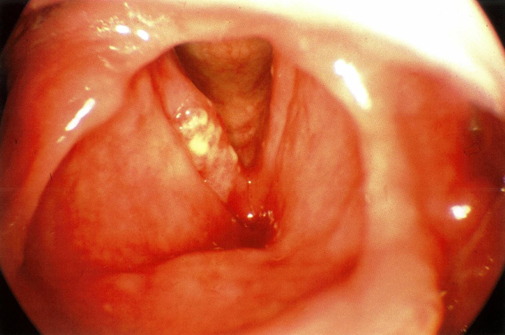
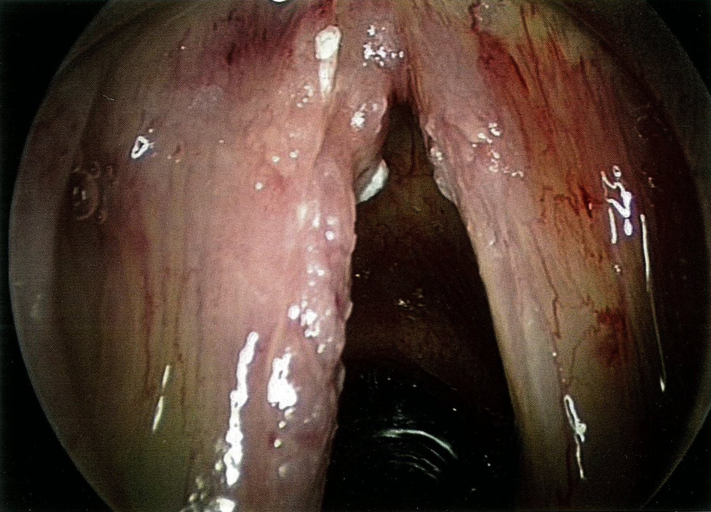
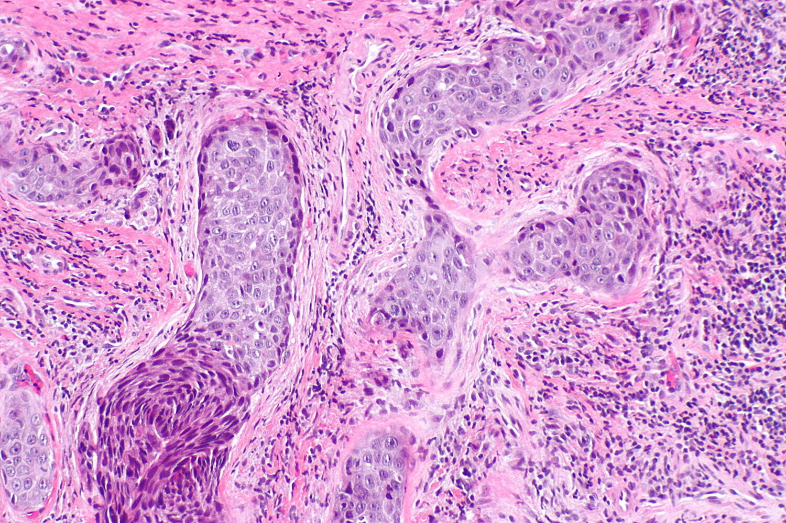

# Laryngeal carcinoma

*Categories: Clinical knowledge > Ear, nose, and throat > Neck, pharynx, and larynx > Laryngeal carcinoma*

[Original Article Link](https://coursology-qbank.com/amboss/article/ZP0ZWT)

---

## Summary

Laryngeal <u>carcinomas</u> are <u>malignant tumors</u> that arise in the <u>supraglottic</u>, <u>glottic</u> (i.e., involving the <u>vocal cords</u>), and <u>subglottic</u> regions of the <u>larynx</u>. Laryngeal cancers are most commonly <u>squamous cell carcinomas</u>. Smoking and <u>alcohol</u> consumption are the most important <u>risk factors</u>. <u>Glottic</u> cancer is the most common subtype and typically manifests with <u>hoarseness</u> in early stages. Diagnosis is based on tissue <u>biopsy</u> under <u>direct laryngoscopy</u>, and staging is determined via imaging such as <u>CT scan</u> or <u>MRI</u>. Treatment varies based on the site and stage of the <u>tumor</u>. Early-stage cancers are usually treated with <u>radiation therapy</u> or transoral laser microsurgery with the goal of voice preservation. Advanced stages often require <u>laryngectomy</u>. Patients with <u>supraglottic</u> or <u>subglottic</u> cancer often present later than those with <u>glottic</u> cancer, which typically results in a poorer prognosis. Vocal <u>rehabilitation</u> is indicated after <u>laryngectomy</u> to help patients regain speech production.

---

## Epidemiology

* Sex: <u>♂</u> > <u>♀</u>

* Age of onset: 40–70 years

References:[[1]](https://coursology-qbank.com/amboss/article/HMaKJO)

Epidemiological data refers to the US, unless otherwise specified.

---

## Etiology

* Tobacco use

* <u>Alcohol</u> use

* Exposure to <u>asbestos</u>

* Precancerous lesions: <u>leukoplakia</u> or <u>laryngeal papillomatosis</u> in adults (see “<u>Precancerous lesions of the larynx</u>”)

* <u>Irradiation</u> of the <u>head and neck region</u>

* Infection with <u>high-risk HPV</u> (e.g., type 16 or 18)  [[3]](https://coursology-qbank.com/amboss/article/vTdAs60)

* Betel nut chewing

* Diets rich in salt-preserved meats (<u>nitrosamines</u>) and dietary fats

---

## Classification

Laryngeal <u>carcinomas</u> are classified according to their location in relation to the <u>glottis</u>.

* <u>Glottic</u> <u>carcinoma</u>/<u>vocal cord</u> <u>carcinoma</u> (most common form: approximately 60% of cases)

* <u>Supraglottic</u> <u>carcinoma</u> (approximately 40% of cases)

* <u>Subglottic</u> <u>carcinoma</u> (approximately 1% of cases)

> [!NOTE]
> Laryngeal <u>carcinomas</u> are almost always <u>squamous cell cancers</u> (<u>SCC</u>)!

References:[[4]](https://coursology-qbank.com/amboss/article/VfYGOo)

---

## Clinical features

* <u>Hoarseness</u>/change in voice

* Foreign body sensation

* <u>Dyspnea</u>

* <u>Dysphagia</u>

* <u>Stridor</u> (due to <u>airway</u> narrowing)

* <u>Aspiration</u> while eating or drinking

> [!NOTE]
> Unexplained <u>hoarseness</u> for longer than 3 weeks should always be investigated by <u>laryngoscopy</u>!

References:[[5]](https://coursology-qbank.com/amboss/article/U30b3f)

---

## Diagnosis

### Initial workup [[2]](https://coursology-qbank.com/amboss/article/bgdHF60)[[6]](https://coursology-qbank.com/amboss/article/Xgd9F60)

Patients with clinically suspected laryngeal cancer should be promptly referred to otolaryngology.

* Visualization

* <u>Flexible nasopharyngoscopy</u> or <u>direct laryngoscopy</u>: to visualize irregular, nodular, and/or ulcerative lesions

* Stroboscopic examination: to assess <u>vocal cord</u> mobility during <u>phonation</u>

* <u>Biopsy</u>

* Required for definitive diagnosis

* Obtain tissue from the lesion of interest and any lesions on the <u>contralateral</u> arytenoid, <u>anterior</u> commissure, and interarytenoid area.

* <u>Histopathology</u> 

* Used to differentiate laryngeal cancer from <u>benign laryngeal lesions</u> (e.g., vocal <u>nodules</u> and polyps)

* 90–95% of laryngeal cancers are <u>squamous cell carcinomas</u>. [[6]](https://coursology-qbank.com/amboss/article/Xgd9F60)

### Further workup [[7]](https://coursology-qbank.com/amboss/article/E2d8j60)

Order staging imaging if <u>malignancy</u> is confirmed.

* <u>MRI</u> and/or CT neck with IV contrast: to assess local and regional disease extent (e.g. <u>lymph node</u> involvement)

* <u>FDG PET-CT scan</u>: to assess for distant <u>metastasis</u>

Laryngoscopic view of glottic carcinoma (T1a)

Glottic carcinoma (T1b)

Laryngeal squamous cell carcinoma

---

## Treatment

### General principles [[2]](https://coursology-qbank.com/amboss/article/bgdHF60)

* Individualize treatment in consultation with a multidisciplinary <u>tumor board</u>.

* Obtain pretreatment evaluations from a speech pathologist, dietitian, and, if <u>radiation therapy</u> is planned, a dental specialist.

* Treatment is based on <u>tumor</u> location and stage, comorbidities, <u>performance status</u>, and <u>goals of care</u>.

* After treatment, regularly monitor for recurrence.

> [!WARNING]
> A patient with laryngeal <u>carcinoma</u> is at risk for <u>airway obstruction</u>. See “<u>Airway management in head and neck cancer</u>” before <u>procedural sedation</u> and/or <u>airway</u> manipulation.

### Treatment modalities [[2]](https://coursology-qbank.com/amboss/article/bgdHF60)

Management includes one or more of the following options:

* <u>Radiation therapy</u>: all stages

* <u>Cisplatin</u>-based <u>chemotherapy</u>: advanced stages (T3-T4)

* <u>Surgery</u>

* Transoral laser microsurgery: early stages (T1-T2)

* <u>Laryngectomy</u> (extent depends on <u>tumor</u> characteristics): all stages

> [!TIP]
> <u>Larynx</u>-preservation techniques should be preferred if appropriate.

### Posttreatment voice <u>rehabilitation</u> [[2]](https://coursology-qbank.com/amboss/article/bgdHF60)

Voice <u>rehabilitation</u> is used to help patients regain speech production after <u>laryngectomy</u>.

* Tracheoesophageal prosthesis (e.g., Blom-Singer valve)

* Preferred first-line option

* Diverts air from the <u>trachea</u> to the <u>pharynx</u> while blocking food from entering the <u>trachea</u>

* Placed during initial <u>laryngectomy</u> (primary placement) or after <u>radiation therapy</u> (secondary placement)

* Alternative options

* Esophageal speech: an alternative method of speaking that involves <u>swallowing</u> air and directing it into the upper <u>esophagus</u>

* Electrolarynx: a device that, when pressed against the <u>soft tissue</u> of the throat, produces pharyngeal vibrations to allow speech production

### Posttreatment monitoring [[8]](https://coursology-qbank.com/amboss/article/v2dAj60)

* All patients should undergo a regular history, <u>physical examination</u>, and endoscopy to assess for recurrence.

* Assess <u>thyroid</u> function (e.g., <u>TSH</u> levels) every 6–12 months after <u>radiation therapy</u>. [[8]](https://coursology-qbank.com/amboss/article/v2dAj60)

* Order imaging for selected patients.

* T3/T4 or N2/N3 disease: baseline imaging of the primary site with <u>FDG PET-CT scan</u> within 6 months of treatment [[8]](https://coursology-qbank.com/amboss/article/v2dAj60)[[9]](https://coursology-qbank.com/amboss/article/x2dEP60)

* Any <u>cancer stage</u> with signs of recurrence: <u>FDG PET-CT scan</u>

> [!TIP]
> After <u>radiation therapy</u>, measure <u>TSH</u> levels every 6–12 months to assess for radiation-induced <u>thyroid</u> dysfunction. [[8]](https://coursology-qbank.com/amboss/article/v2dAj60)

### Management of recurrence [[10]](https://coursology-qbank.com/amboss/article/D2d1P60)

* Localized disease: surgical resection ± <u>adjuvant therapy</u>

* Unresectable nonmetastatic disease: <u>radiation therapy</u> or <u>chemoradiotherapy</u>

* <u>Metastatic</u> disease

* Curative intent: <u>platinum-based chemotherapy</u> and immunotherapy (e.g., <u>pembrolizumab</u>)

* Noncurative intent: <u>palliative chemotherapy</u> and/or <u>radiation therapy</u>

---