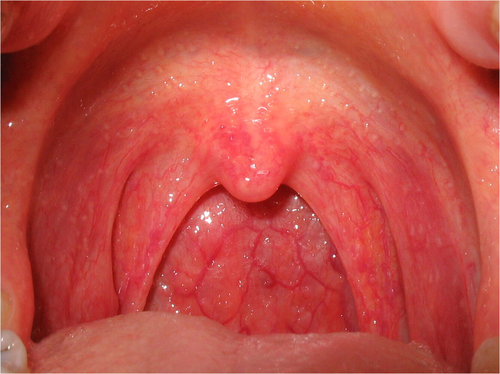

# Allergic rhinitis

*Categories: Clinical knowledge > Ear, nose, and throat > Nose and sinuses > Allergic rhinitis*

[Original Article Link](https://coursology-qbank.com/amboss/article/mq0V_S)

---

## Summary

Allergic <u>rhinitis</u> is an acute or <u>chronic inflammation</u> of the nasal <u>mucosa</u> caused by a <u>type 1 hypersensitivity reaction</u> to an inhaled <u>allergen</u> (e.g., dust, animal dander, <u>mold</u> spores, plant pollen). It is the most common form of <u>rhinitis</u> and is associated with other allergic conditions such as <u>atopic dermatitis</u> and <u>asthma</u>. Clinical manifestations of allergic <u>rhinitis</u> include nasal congestion, <u>rhinorrhea</u>, sneezing, and <u>postnasal drip</u>. Exacerbation of <u>allergic rhinitis symptoms</u> may occur in certain seasons or with exposure to certain <u>allergens</u>. Allergic <u>rhinitis</u> is typically diagnosed based on clinical features. <u>Allergen testing</u> helps determine the causative <u>allergen</u> and may also be used to confirm the diagnosis if there is clinical uncertainty. Initial management involves <u>allergen</u> and irritant avoidance and pharmacotherapy with intranasal <u>corticosteroids</u> or oral or intranasal <u>antihistamines</u>. <u>Allergen immunotherapy</u> may be considered if initial treatment does not provide adequate symptom relief.

---

## Epidemiology

* Most common form of <u>rhinitis</u> (affects 1 in 6 Americans) [[1]](https://coursology-qbank.com/amboss/article/EKa8Rl)

* <u>♂</u> > <u>♀</u> in patients ≤ 21 years [[2]](https://coursology-qbank.com/amboss/article/Jtbsev)

* <u>♀</u> > <u>♂</u> in patients > 21 years

Epidemiological data refers to the US, unless otherwise specified.

---

## Etiology

Allergic <u>rhinitis</u> is defined as an acute or chronic <u>rhinitis</u> that is caused by exposure to an inhaled <u>allergen</u> (e.g., dust, animal dander, <u>mold</u> spores, plant pollen).

* Etiology: <u>type I hypersensitivity reaction</u> (an <u>IgE</u>-mediated process) [[3]](https://coursology-qbank.com/amboss/article/F9cg6e0)

* <u>Risk factors</u> [[4]](https://coursology-qbank.com/amboss/article/uKapRl)[[5]](https://coursology-qbank.com/amboss/article/WlXPDy)

* Genetic predisposition

* <u>Family history</u> of <u>allergies</u> and/or <u>atopy</u>

* Associated allergic conditions

* <u>Allergic conjunctivitis</u>

* <u>Atopic dermatitis</u> and/or <u>bronchial asthma</u>

* <u>Birth</u> during the pollen season

* Firstborn child  [[6]](https://coursology-qbank.com/amboss/article/qtbCev)

* Early use of <u>antibiotics</u>, formula, or solids [[7]](https://coursology-qbank.com/amboss/article/bV1HGf0)

* Exposure to indoor <u>allergens</u> including maternal smoking in the first year of life [[2]](https://coursology-qbank.com/amboss/article/Jtbsev)

---

## Clinical features

* Recurrent episodes of sneezing, nasal congestion, <u>rhinorrhea</u>, and <u>postnasal drip</u>

* Itchy nose and throat

* Pale, boggy nasal <u>mucosa</u> with <u>hypertrophic turbinates</u>

* <u>Cobblestone appearance</u> of the <u>posterior</u> pharyngeal wall

* Allergic shiners: <u>hyperpigmentation</u> and <u>edema</u> of the lower <u>eyelid</u> as a result of venous congestion

* Allergic salute: a habit of wiping the nose with a transverse or upward movement of the hand

* Allergic nasal crease: a transverse <u>hyperpigmented</u> or <u>hypopigmented</u> line that is seen at the junction of the lower third and the middle third of the nasal bridge, which is the natural crease formed when the nose is pushed upwards by the <u>allergic salute</u>

* Complications of chronic <u>rhinitis</u>, e.g.,

* Recurrent <u>sinusitis</u> and/or <u>otitis media</u>

* Signs of chronic mouth breathing (<u>adenoid facies</u>, <u>dental malocclusion</u>)

* Impaired <u>sense of smell</u>

* Features of associated conditions, e.g., [[1]](https://coursology-qbank.com/amboss/article/EKa8Rl)

* <u>Nasal polyps</u>

* <u>Allergic conjunctivitis</u>

* <u>Asthma</u>

* <u>Sleep-disordered breathing</u>

* <u>Atopic dermatitis</u>

> [!TIP]
> <u>Hypertrophic turbinates</u> are pink or violaceous, hard, sensitive to probing, immobile, and shrink with <u>nasal decongestant</u> therapy. <u>Nasal polyps</u> are pale, soft, mobile, insensitive, and do not decrease in size following therapy with <u>nasal decongestants</u>.

Pharyngitis

---

## Diagnosis

### Approach [[1]](https://coursology-qbank.com/amboss/article/EKa8Rl)[[5]](https://coursology-qbank.com/amboss/article/WlXPDy)

* Obtain a detailed clinical history identifying:

* <u>Clinical features of allergic rhinitis</u>

* <u>Allergen</u> exposure

* Medication history

* Coexisting conditions (e.g., <u>asthma</u>, <u>atopic dermatitis</u>, <u>otitis media</u>)

* Order <u>allergen testing</u>:

* To identify the causative <u>allergen</u> in all patients with features consistent with allergic <u>rhinitis</u>  [[5]](https://coursology-qbank.com/amboss/article/WlXPDy)

* To confirm the diagnosis in the following situations :

* Poor response to empiric therapy  [[1]](https://coursology-qbank.com/amboss/article/EKa8Rl)

* Diagnostic uncertainty

* Additional diagnostic modalities (e.g., imaging and <u>nasal endoscopy</u>)

* Not routinely required

* Consider in cases of diagnostic uncertainty (e.g., to rule out sinonasal disorders). [[1]](https://coursology-qbank.com/amboss/article/EKa8Rl)

> [!TIP]
> Allergic <u>rhinitis</u> is primarily a <u>clinical diagnosis</u> in patients presenting with characteristic clinical features (i.e., nasal congestion, <u>rhinorrhea</u>, itchy nose, sneezing) that are triggered by seasonal, perennial, or episodic exposure to <u>allergens</u>. [[5]](https://coursology-qbank.com/amboss/article/WlXPDy)

> [!WARNING]
> <u>Epistaxis</u>, unilateral <u>rhinorrhea</u> or nasal blockage, severe <u>headache</u>, or <u>anosmia</u> are atypical for allergic <u>rhinitis</u> and should prompt further workup for an alternative diagnosis. [[1]](https://coursology-qbank.com/amboss/article/EKa8Rl)

### Allergen testing [[1]](https://coursology-qbank.com/amboss/article/EKa8Rl)[[5]](https://coursology-qbank.com/amboss/article/WlXPDy)

> [!TIP]
> Testing for aeroallergens is recommended in all patients with features consistent with allergic <u>rhinitis</u>. Testing for food <u>allergens</u> is not routinely recommended. [[5]](https://coursology-qbank.com/amboss/article/WlXPDy)

#### <u>Skin</u> tests

* Indication: preferred over blood tests as they are more sensitive

* Possible contraindications

* Concern for <u>anaphylaxis</u> with <u>skin</u> testing and/or patients at high risk if <u>anaphylaxis</u> develops

* Dermatological conditions that may interfere with the interpretation of <u>skin</u> test results

* Use of medications that cannot be interrupted and that can interfere with the response to <u>skin</u> testing

* Options [[9]](https://coursology-qbank.com/amboss/article/me1Vzf0)

* <u>Skin prick test</u>: The development of a pruritic <u>wheal</u> at the site of the <u>skin</u> puncture (typically within 15–20 minutes) strongly suggests <u>allergen</u> sensitization.

* <u>Intradermal test</u>: Consider if there is a strong suspicion of <u>allergen</u> sensitization in patients with a negative <u>skin prick test</u>.

Skin prick test

Positive skin prick test

> [!WARNING]
> <u>Skin</u> tests to detect <u>allergen</u> sensitization can cause <u>anaphylaxis</u>! [[1]](https://coursology-qbank.com/amboss/article/EKa8Rl)

#### Blood tests

* Indications

* Presence of contraindications for <u>skin</u> tests

* Patient preference

* Method: immunoassays to identify <u>allergen-specific IgE</u> in the serum (<u>allergen-specific IgE test</u>)

> [!TIP]
> Blood tests for <u>allergen</u> sensitization are preferred if there is concern for <u>anaphylaxis</u> with <u>skin</u> testing. [[1]](https://coursology-qbank.com/amboss/article/EKa8Rl)

> [!WARNING]
> In asymptomatic individuals, a positive <u>skin</u> or blood test for a particular <u>allergen</u> is not diagnostic of an <u>allergy</u> to that <u>allergen</u>. [[1]](https://coursology-qbank.com/amboss/article/EKa8Rl)

---

## Management

### Approach [[1]](https://coursology-qbank.com/amboss/article/EKa8Rl)[[5]](https://coursology-qbank.com/amboss/article/WlXPDy)

* Recommend environmental modifications.

* Initiate pharmacotherapy with <u>antihistamines</u> (intranasal or oral) or intranasal <u>corticosteroids</u>.

* Assess response to therapy in 5–7 days.

* If symptoms are under control:

* Step down and stop pharmacotherapy if the trigger is no longer present.

* Or administer treatment on an as-needed basis.

* If symptoms are uncontrolled, consider any of the following : 

* An alternative monotherapy

* Adding a symptom-specific agent to initial pharmacotherapy

* Referral for <u>allergen immunotherapy</u>

### Environmental modifications [[1]](https://coursology-qbank.com/amboss/article/EKa8Rl)[[5]](https://coursology-qbank.com/amboss/article/WlXPDy)

* Advise patients to avoid exposure to putative <u>allergens</u> (e.g., dust, animal dander, <u>mold</u> spores, plant pollen, or latex).

* Examples of environmental modifications include:

* HEPA filters

* Dust <u>mite</u> bedding covers

* Pesticides against dust <u>mites</u>

* Removal of pets

### Pharmacotherapy [[1]](https://coursology-qbank.com/amboss/article/EKa8Rl)[[5]](https://coursology-qbank.com/amboss/article/WlXPDy)

<u>Medications for allergic rhinitis</u> can be initiated empirically. The choice of initial pharmacotherapy depends on the severity and <u>type of allergic rhinitis</u> and should be tailored to the clinical response (see “Approach” above).

* <u>Episodic allergic rhinitis</u>, intermittent <u>seasonal allergic rhinitis</u>, or <u>perennial allergic rhinitis</u>: : intranasal or oral second-generation <u>antihistamines</u> on an as-needed basis

* <u>Persistent allergic rhinitis</u>

* <u>Mild allergic rhinitis</u>: monotherapy with intranasal <u>corticosteroids</u> (e.g., <u>budesonide</u>, <u>fluticasone</u>)

* <u>Moderate to severe allergic rhinitis</u>: intranasal <u>corticosteroids</u>, with or without intranasal <u>antihistamines</u>

* Select patients:  : Consider adding symptom-specific agents (e.g., decongestants, <u>anticholinergics</u>) to intranasal <u>corticosteroid</u> and <u>antihistamine</u> therapy.

> [!TIP]
> Intranasal <u>steroids</u> are considered the most effective <u>maintenance treatment</u> for <u>persistent allergic rhinitis</u>. Potential adverse effects include <u>nosebleeds</u> and, rarely, septal perforation with long-term use. [[5]](https://coursology-qbank.com/amboss/article/WlXPDy)

> [!TIP]
> In patients with severe or refractory allergic <u>rhinitis</u>, consider a 5–7 day course of oral <u>corticosteroids</u> and refer to an allergist. [[5]](https://coursology-qbank.com/amboss/article/WlXPDy)

|  Medications for allergic rhinitis [[1]](https://coursology-qbank.com/amboss/article/EKa8Rl)[[3]](https://coursology-qbank.com/amboss/article/F9cg6e0)[[5]](https://coursology-qbank.com/amboss/article/WlXPDy)  |  |  |
| --- | --- | --- |
| Drug class | Examples | Clinical considerations |
| Intranasal <u>corticosteroids</u> |   * <u>Fluticasone</u> DOSAGE  * <u>Mometasone</u> DOSAGE  * <u>Budesonide</u> DOSAGE    |   * Can also improve ocular symptoms  * Onset of maximal benefit: at least 2 weeks    |
| <u>Antihistamines</u> |   * Intranasal  * <u>Azelastine</u>DOSAGE  * Olopatadine DOSAGE  * Second-generation oral <u>antihistamines</u>   * <u>Cetirizine</u> DOSAGE  * <u>Fexofenadine</u> DOSAGE  * <u>Loratadine</u> DOSAGE    |  * Second-generation oral <u>antihistamines</u> are preferred over first-generation oral <u>antihistamines</u> (e.g., <u>diphenhydramine</u>).   |
|  Decongestants (α1-<u>sympathomimetics</u>) |   * Intranasal: <u>oxymetazoline</u> DOSAGE  * Oral: <u>pseudoephedrine</u> DOSAGE    |   * Severe <u>mucosal</u> <u>edema</u>: Consider intranasal decongestants (for up to 5 days).  * Nasal congestion inadequately relieved with oral <u>antihistamines</u> alone: Consider adding oral decongestants.  [[1]](https://coursology-qbank.com/amboss/article/EKa8Rl)  * Contraindications  * Avoid in the <u>first trimester</u> of <u>pregnancy</u>.  * Use with caution in patients with cardiovascular or <u>cerebrovascular disease</u>, <u>hyperthyroidism</u>, or <u>glaucoma</u>.    |
| <u>Mast cell stabilizers</u> |  * Intranasal <u>cromolyn</u> DOSAGE   |   * Less effective than intranasal <u>corticosteroids</u> and <u>antihistamines</u>  * May help to prevent symptoms of <u>episodic allergic rhinitis</u> if used prior to <u>allergen</u> exposure    |
| <u>Anticholinergics</u> |  * Intranasal <u>ipratropium</u> DOSAGE   |  * Consider adding to intranasal <u>corticosteroids</u> or <u>antihistamines</u> for symptomatic management of <u>rhinorrhea</u>.   |
| <u>Leukotriene receptor antagonists</u> |  * <u>Montelukast</u>   |   * Not a preferred treatment option  * Risk of serious neuropsychiatric events, including <u>suicidality</u>  * May be considered in patients with concomitant <u>asthma</u> after discussion of potential risks and benefits    |

> [!WARNING]
> Intranasal <u>sympathomimetics</u> should generally not be used for more than 3–5 days because of the risk of rebound nasal congestion (<u>rhinitis medicamentosa</u>). [[1]](https://coursology-qbank.com/amboss/article/EKa8Rl)[[5]](https://coursology-qbank.com/amboss/article/WlXPDy)

> [!WARNING]
> <u>Montelukast</u> is associated with a risk of serious psychiatric events including <u>suicide</u> and may only be used in patients with concomitant <u>asthma</u> using a <u>shared decision-making</u> strategy.

### <u>Allergen immunotherapy</u> [[1]](https://coursology-qbank.com/amboss/article/EKa8Rl)[[5]](https://coursology-qbank.com/amboss/article/WlXPDy)

* Controlled exposure to gradually increasing doses of the <u>allergen</u> (sublingually or subcutaneously) in order to reduce <u>sensitivity</u> to the <u>allergen</u>  [[10]](https://coursology-qbank.com/amboss/article/hCcc7e0)

* Consider in patients with <u>allergen-specific IgE</u> <u>antibodies</u> and any of the following: [[5]](https://coursology-qbank.com/amboss/article/WlXPDy)

* Inadequate symptom control with pharmacotherapy with/without environmental modifications

* Preference for immunotherapy over other treatment methods after a <u>shared decision-making</u> conversation

* Concomitant <u>asthma</u>

* Generally requires ≥ 3 years of treatment

### <u>Surgery</u> [[1]](https://coursology-qbank.com/amboss/article/EKa8Rl)[[5]](https://coursology-qbank.com/amboss/article/WlXPDy)

* Indications: significant nasal obstruction in patients with treatment-resistant allergic <u>rhinitis</u>

* Procedure: reduction of <u>hypertrophic</u> <u>nasal turbinates</u>

---