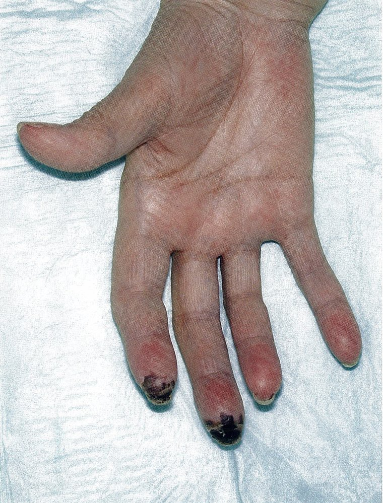
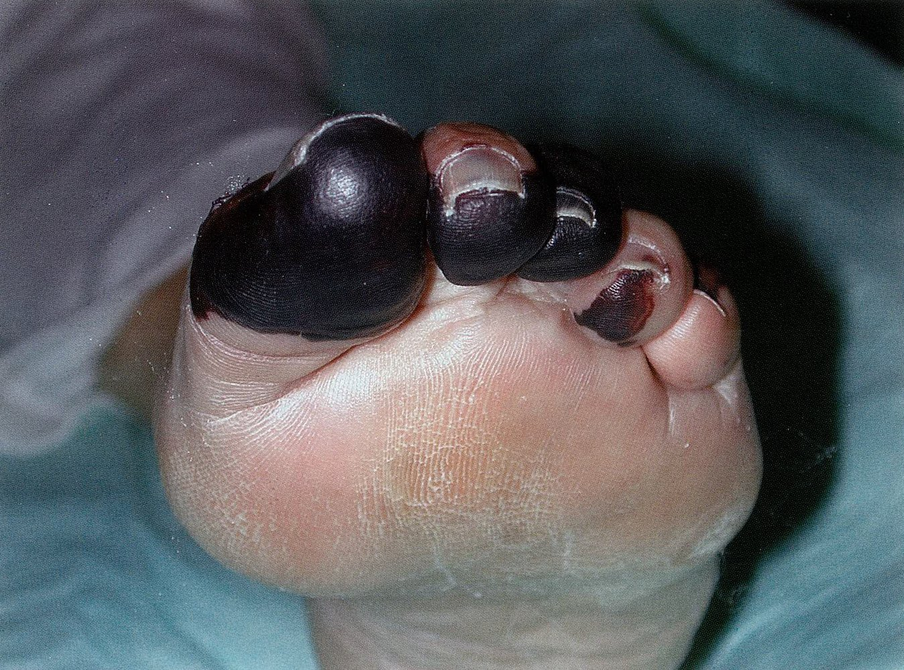
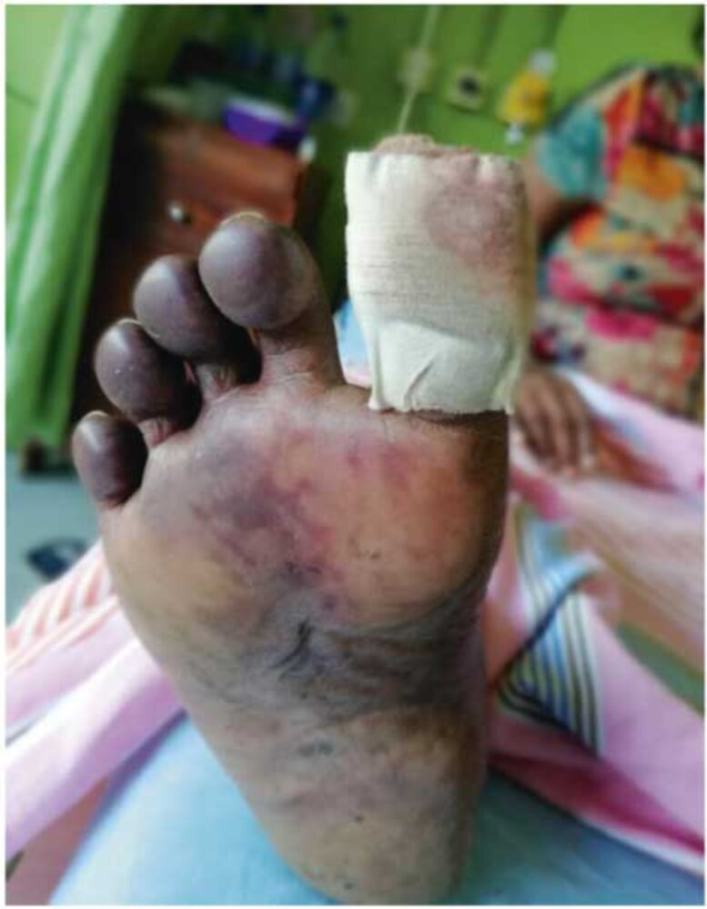
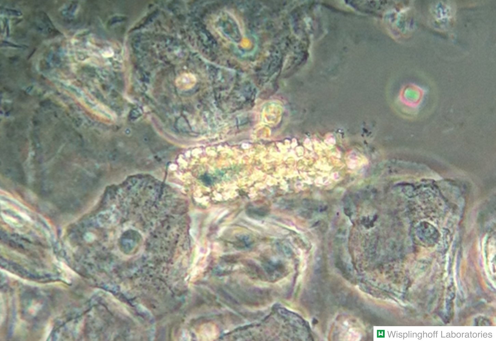
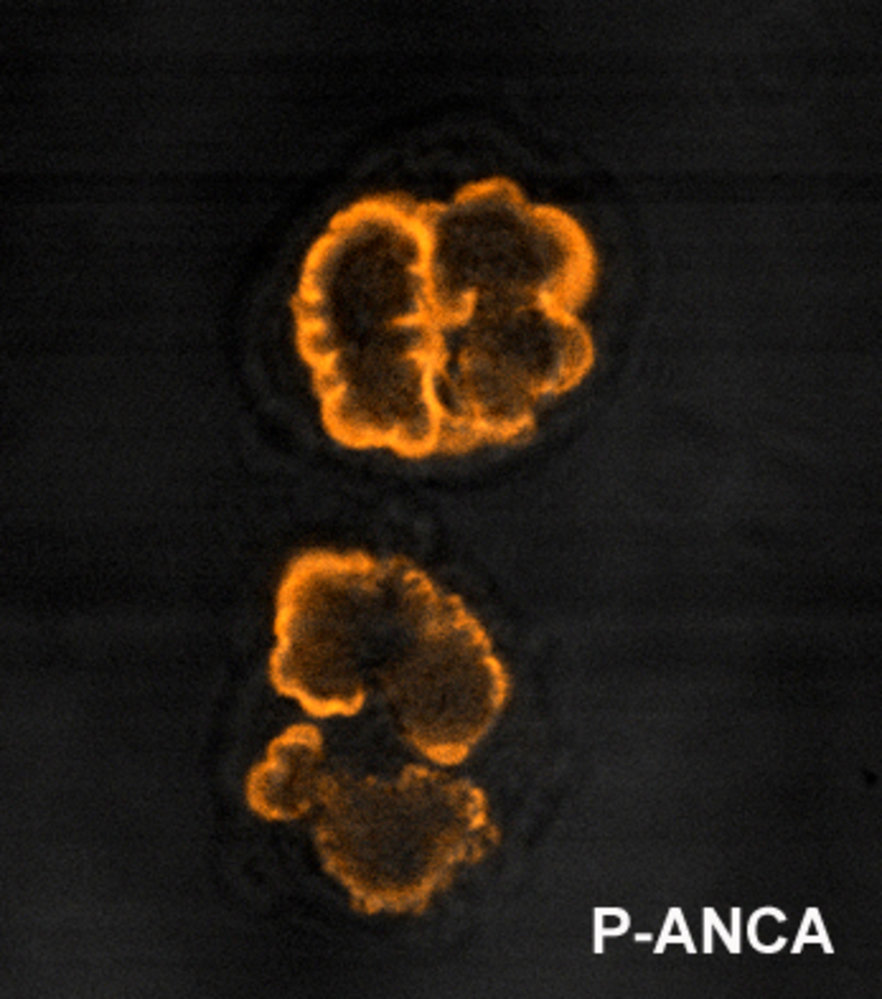
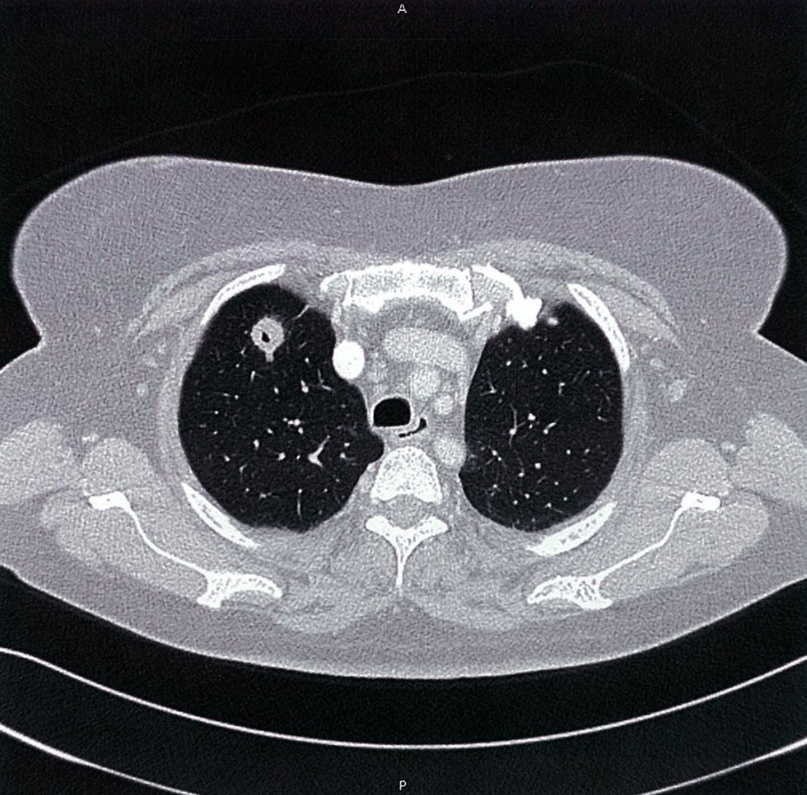
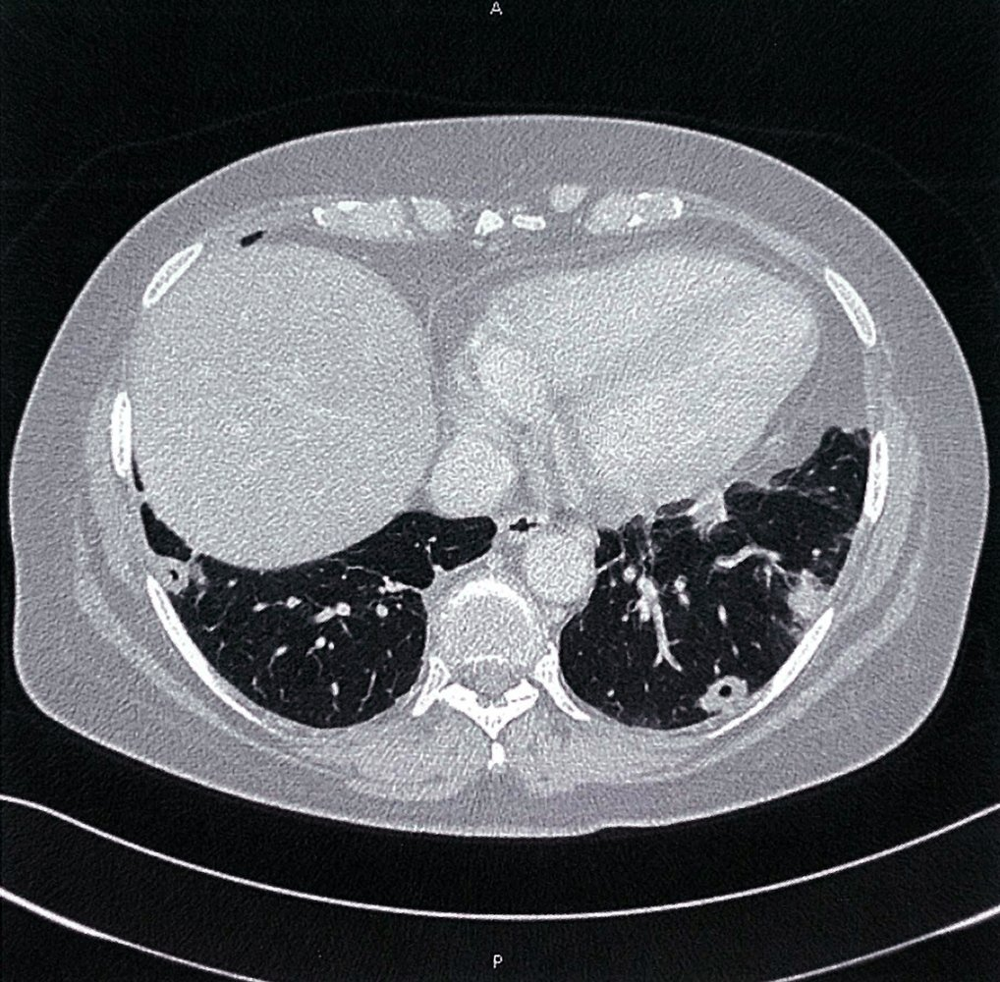
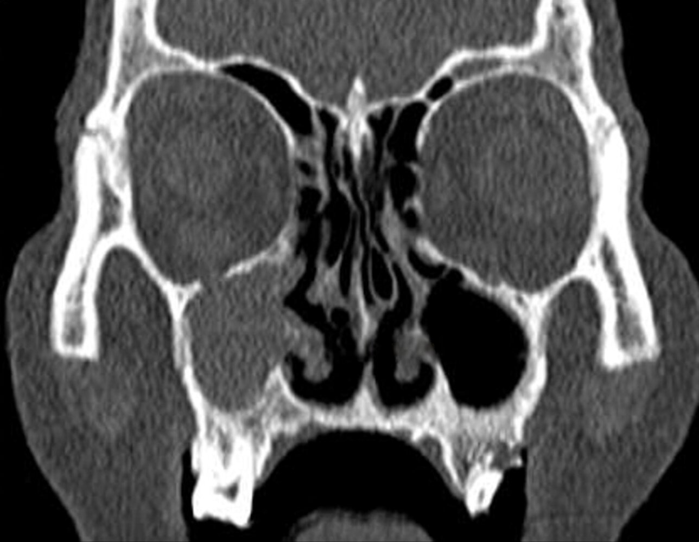
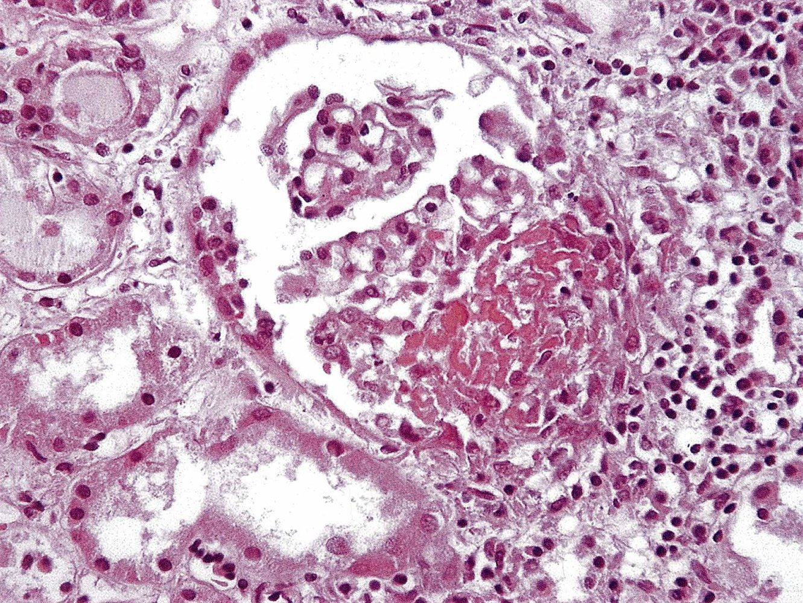
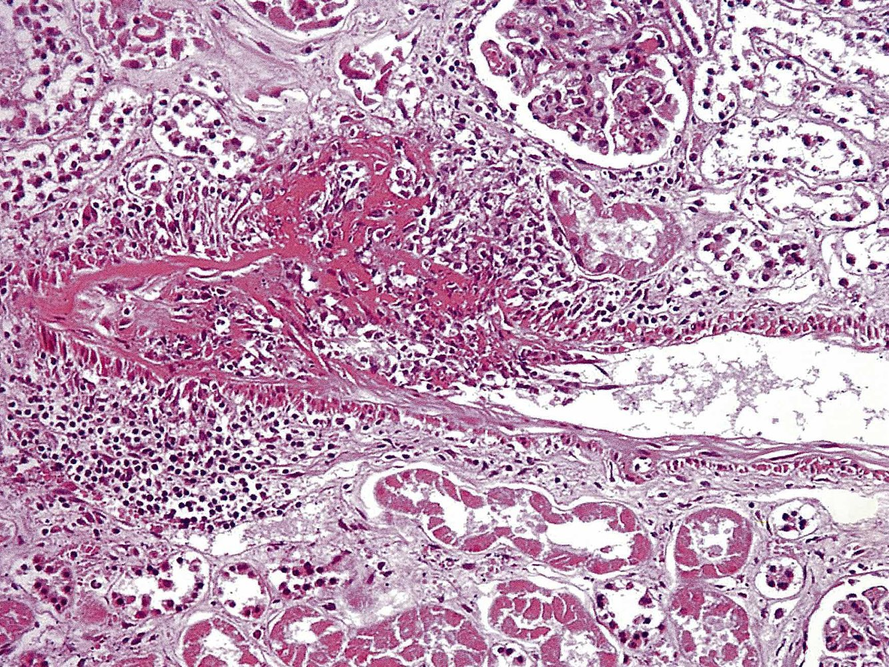

# Granulomatosis with polyangiitis

*Categories: Clinical knowledge > Ear, nose, and throat > Nose and sinuses > Granulomatosis with polyangiitis*

[Original Article Link](https://coursology-qbank.com/amboss/article/TT06J2)

---

## Summary

Granulomatosis with polyangiitis (GPA; previously referred to as <u>Wegener granulomatosis</u>) is a systemic <u>vasculitis</u> that affects both small and medium-sized vessels. Patients typically initially present with a limited form that consists of <u>constitutional symptoms</u> and localized manifestations, such as <u>chronic sinusitis</u>, <u>rhinitis</u>, <u>otitis media</u>, ocular involvement, and/or <u>skin</u> lesions. More serious manifestations may develop in later stages, including pulmonary complications and <u>glomerulonephritis</u>; the <u>heart</u> may also be involved. Testing modalities include <u>laboratory studies</u>, imaging, and <u>biopsy</u>. Diagnosis is confirmed by <u>biopsy</u> findings of necrotizing <u>granulomatous inflammation</u>. Pharmacotherapy consists of <u>immunosuppressive drugs</u>, typically <u>glucocorticoids</u> combined with <u>methotrexate</u>, <u>cyclophosphamide</u>, or <u>rituximab</u>. Relapses are common.

Granulomatosis with polyangiitis fact sheet

---

## Definition

Granulomatosis with polyangiitis is a type of systemic <u>ANCA-associated vasculitis</u> of small and medium-sized vessels characterized by necrotizing <u>granulomatous inflammation</u>, and it typically affects the <u>lungs</u>, <u>paranasal sinuses</u>, and <u>kidneys</u>. [[1]](https://coursology-qbank.com/amboss/article/x01ER20)

---

## Pathophysiology

* The following processes play a key role in the pathophysiology of GPA:

* Aberrant <u>epigenetic</u> expression of proteinase-3 on <u>the cell</u> membrane of <u>neutrophils</u>

* Formation of <u>antibodies</u> against proteinase-3 (<u>PR3-ANCA</u>)

* Binding of <u>PR3-ANCA</u> to PR3 activates <u>neutrophils</u> → release of neutrophilic inflammatory mediators, formation of <u>neutrophil</u> extracellular traps, <u>complement</u> activation → damage to <u>endothelial</u> cells of <u>small blood vessels</u>

---

## Clinical features

* <u>Constitutional symptoms</u>: <u>fever</u>, night sweats, weight loss, <u>arthralgias</u>

* ENT involvement: often the first clinical manifestation 

* Chronic <u>rhinitis</u>/<u>sinusitis</u>: <u>nasopharyngeal</u> <u>ulcerations</u> → <u>nasal septum perforation</u> → saddle nose deformity (<u>depression</u> of the nasal dorsum)

* Chronic otitis and/or <u>mastoiditis</u>

* In some cases, thick, <u>purulent</u> discharge, sometimes containing blood

* Oral <u>ulcers</u>

* Strawberry gingivitis: a characteristic feature of granulomatosis with polyangiitis characterized by painful, <u>erythematous</u>, gingival inflammation with <u>petechiae</u> that results in the appearance of the surface of a strawberry [[5]](https://coursology-qbank.com/amboss/article/8YXOI9)[[6]](https://coursology-qbank.com/amboss/article/uYXpI9)

* <u>Lower respiratory tract</u>: potentially life-threatening 

* Treatment-resistant, <u>pneumonia</u>-like symptoms with <u>cough</u>, <u>dyspnea</u>, <u>hemoptysis</u>, <u>wheezing</u>, <u>hoarseness</u>, and/or pleuritic <u>pain</u>

* Clinical features of <u>pulmonary fibrosis</u>, <u>pulmonary hypertension</u>, and/or pulmonary hemorrhage may occur.

* Renal involvement: potentially life-threatening 

* Pauci-immune <u>glomerulonephritis</u> (Pauci‑immune indicates that there is little evidence of <u>immune complex</u>/<u>antibody</u> deposits.) → rapidly progressive (crescentic) <u>glomerulonephritis</u> (<u>RPGN</u>) with possible <u>pulmonary-renal syndrome</u>

* Typically causes <u>hematuria</u> and red cell casts

* <u>Skin</u> lesions

* <u>Papules</u>, <u>vesicles</u>, <u>ulcers</u>

* <u>Purpura</u> of the lower extremities

* May lead to necrotizing <u>vasculitis</u> of small vessels → <u>dry gangrene</u> of digits

* Ocular involvement

* <u>Conjunctivitis</u>, <u>episcleritis</u>, retinal <u>vasculitis</u>

* Corneal <u>ulcerations</u>

* Cardiac involvement: potentially life-threatening 

* <u>Pericarditis</u>, <u>myocarditis</u>

* <u>Vasculitis</u> of the <u>coronary arteries</u>; may lead to <u>myocardial infarction</u> and <u>death</u>

* Rarely: <u>cardiomyopathy</u>

> [!TIP]
> Upper respiratory manifestations (i.e., <u>purulent</u>, sometimes bloody discharge, chronic <u>nasopharyngeal</u> infections, <u>saddle nose deformity</u>) are the most common chief complaints.

> [!NOTE]
> Classic GPA triad: necrotizing <u>vasculitis</u> of small <u>arteries</u>, upper/<u>lower respiratory tract</u> manifestations, and <u>glomerulonephritis</u>

Necrotizing vasculitis of the fingers

Necrotizing vasculitis of the toes

Granulomatosis with polyangiitis

---

## Diagnosis

### General principles [[7]](https://coursology-qbank.com/amboss/article/gx1FDQ0)[[8]](https://coursology-qbank.com/amboss/article/Tx16DQ0)

* Suspect GPA in patients with either:

* Characteristic clinical features (i.e., <u>glomerulonephritis</u>, pulmonary <u>nodules</u>, and ENT inflammation)

* Positive <u>c-ANCA</u>

* Consult rheumatology.

* Obtain laboratory and imaging studies to:

* Determine the extent and severity of organ involvement

* Rule out differential diagnoses (e.g., infection, <u>neoplasm</u>)

* Characteristic histopathological findings confirm the diagnosis.

### <u>Laboratory studies</u> [[7]](https://coursology-qbank.com/amboss/article/gx1FDQ0)

* Routine studies  

* <u>Inflammatory markers</u>: ↑ <u>ESR</u> or ↑ <u>CRP</u>

* <u>CBC</u>: <u>normocytic</u> normochromic <u>anemia</u>

* <u>BMP</u>: ↑ <u>creatinine</u> and ↑ <u>BUN</u>

* Serum <u>AAT</u> level: ↓  [[9]](https://coursology-qbank.com/amboss/article/mMWV6N0)[[10]](https://coursology-qbank.com/amboss/article/xndEvq0)

* <u>Urinalysis</u>: <u>microscopic hematuria</u>, <u>proteinuria</u>

* <u>Urine sediment</u>: <u>nephritic sediment</u> (dysmorphic <u>RBC</u> and <u>RBC casts</u>)

* <u>Serology</u>: <u>ANCA</u> (positive in ∼ 90% of patients) [[7]](https://coursology-qbank.com/amboss/article/gx1FDQ0)[[11]](https://coursology-qbank.com/amboss/article/cjWazO0)

* <u>PR3-ANCA</u> in ∼ 75% of patients

* <u>MPO-ANCA</u> in ∼ 20% of patients

> [!TIP]
> While positive PR3-<u>ANCAs</u> have a high <u>sensitivity</u> for GPA (∼ 98%), their absence does not exclude the diagnosis. [[8]](https://coursology-qbank.com/amboss/article/Tx16DQ0)

Red blood cell (RBC) casts in urine sediment

Cytoplasmic pattern of antineutrophil cytoplasmic antibodies (c-ANCA)

Perinuclear antineutrophil cytoplasmic antibodies (p-ANCA)

### Imaging studies [[7]](https://coursology-qbank.com/amboss/article/gx1FDQ0)

#### Chest imaging

* Obtain a chest <u>X-ray</u> or CT chest for all patients to assess for <u>lung</u> involvement.

* Supportive findings

* Multiple bilateral cavitating nodular lesions

* Pulmonary hemorrhage

#### Additional studies

Consider additional studies to assess for organ involvement as needed, e.g.:

* <u>Kidney ultrasound</u>

* Consider as part of the workup of <u>AKI</u> or <u>CKD</u>.

* May also be used to guide a percutaneous <u>kidney biopsy</u>

* CT <u>paranasal sinuses</u>

* Consider in patients with upper respiratory symptoms.

* May show <u>sinusitis</u>, bone <u>erosions</u>, and/or masses in the retroorbital space, <u>paranasal sinuses</u>, and/or mastoid

* Cardiac studies (e.g., <u>ECG</u>, <u>TTE</u>): Consider in patients with cardiac symptoms.

Cavitary lung nodules 1/2

Cavitary lung nodules 2/2

Sinonasal changes in granulomatosis with polyangiitis

### <u>Biopsy</u> [[7]](https://coursology-qbank.com/amboss/article/gx1FDQ0)[[12]](https://coursology-qbank.com/amboss/article/nEX7w-)

* Indications

* Consider in all patients to confirm the diagnosis.

* In patients with renal disease, a <u>kidney biopsy</u> may be required to assess for relapse and/or irreversible damage.

* Samples: may be obtained from any affected tissue

* Findings   [[12]](https://coursology-qbank.com/amboss/article/nEX7w-)

* <u>Necrosis</u>

* <u>Vasculitis</u> of small and medium-sized vessels

* <u>Intravascular</u> and extravascular <u>granulomas</u> (mainly in the <u>lungs</u> and upper <u>airways</u>)

* Renal tissue: pauci-immune focal and segmental necrotizing <u>glomerulonephritis</u>

> [!TIP]
> <u>Biopsy</u> may not be required in certain patients, e.g., those with characteristic clinical features and positive <u>PR3-ANCA</u>, because results will not affect management. [[7]](https://coursology-qbank.com/amboss/article/gx1FDQ0)

> [!WARNING]
> For patients with severe <u>kidney</u> or <u>lung</u> disease, do not delay treatment for <u>biopsy</u>. Several days of treatment do not significantly reduce the <u>biopsy</u> yield of <u>biopsy</u> samples. [[7]](https://coursology-qbank.com/amboss/article/gx1FDQ0)

Glomerulonephritis in granulomatosis with polyangiitis

Renal necrotizing vasculitis in granulomatosis with polyangiitis

---

## Differential diagnoses

|  | Granulomatosis with polyangiitis (GPA) | <u>Microscopic polyangiitis</u> |
| --- | --- | --- |
| Clinical presentation |   * <u>Glomerulonephritis</u>  * Localized necrotizing <u>vasculitis</u>  * Upper/<u>lower respiratory tract</u> manifestations with necrotizing <u>granulomas</u>    |   * Potentially palpable <u>purpura</u>  * <u>Nasopharyngeal</u> involvement less common  * No <u>granulomatous inflammation</u>    |
| Laboratory tests |  * <u>PR3-ANCA</u>/<u>c-ANCA</u> (anti-proteinase 3)   |  * <u>MPO-ANCA</u>/<u>p-ANCA</u> (anti-<u>myeloperoxidase</u>)   |

Cytoplasmic pattern of antineutrophil cytoplasmic antibodies (c-ANCA)

Perinuclear antineutrophil cytoplasmic antibodies (p-ANCA)

The differential diagnoses listed here are not exhaustive.

---

## Treatment

### General principles   [[1]](https://coursology-qbank.com/amboss/article/x01ER20)[[12]](https://coursology-qbank.com/amboss/article/nEX7w-)

* Consult rheumatology and other specialties (e.g., nephrology, pulmonology, otorhinolaryngology) as required.

* The goal of pharmacotherapy is to achieve remission within 3 months. [[7]](https://coursology-qbank.com/amboss/article/gx1FDQ0)

* <u>Plasmapheresis</u> may be considered in certain patients, e.g., patients with concomitant <u>anti-GBM disease</u>.  [[1]](https://coursology-qbank.com/amboss/article/x01ER20)

* Manage <u>hemoptysis</u> and <u>ARDS</u> urgently, if present.

* See “<u>Acute management checklist for life-threatening hemoptysis</u>.”

* See “<u>Acute management checklist for ARDS</u>.”

> [!WARNING]
> GPA can rarely cause <u>life-threatening hemoptysis</u> and/or <u>ARDS</u> from <u>diffuse alveolar hemorrhage</u> that may require <u>mechanical ventilation</u> and/or <u>ECMO</u>. [[13]](https://coursology-qbank.com/amboss/article/kkWmLl0)

### Pharmacotherapy [[1]](https://coursology-qbank.com/amboss/article/x01ER20)

#### Induction of remission

Indication: patients with active disease

* Nonsevere disease  

* <u>Glucocorticoids</u>

* PLUS a <u>glucocorticoid-sparing agent</u>, e.g., <u>methotrexate</u> (preferred) or <u>azathioprine</u>

* Severe disease (i.e., organ- or life-threatening)  

* <u>Glucocorticoids</u>

* PLUS a <u>glucocorticoid-sparing agent</u>, e.g., <u>rituximab</u> ; (preferred) or <u>cyclophosphamide</u>   [[1]](https://coursology-qbank.com/amboss/article/x01ER20)

#### <u>Maintenance of remission</u>

Indication: patients who initially presented with severe disease

* Slowly taper <u>glucocorticoids</u> to the minimum effective dose.   [[1]](https://coursology-qbank.com/amboss/article/x01ER20)

* <u>Glucocorticoid-sparing agents</u>: e.g., <u>rituximab</u> (preferred), <u>methotrexate</u>, or <u>azathioprine</u>

* Duration of treatment: typically ≥ 18 months

> [!TIP]
> Assessment for concurrent <u>immunosuppressive</u> states (e.g., <u>HIV</u>, <u>TB</u>, <u>diabetes mellitus</u>) is required before starting <u>immunosuppressive therapy</u>. [[7]](https://coursology-qbank.com/amboss/article/gx1FDQ0)

### Management of associated symptoms [[7]](https://coursology-qbank.com/amboss/article/gx1FDQ0)

* Assess <u>ASCVD risk</u> and manage as indicated.

* Patients with sinonasal disease

* Consider topical nasal <u>antibiotics</u>, lubricants, and/or <u>glucocorticoids</u>.

* Consider referral for nasal reconstructive <u>surgery</u>.

* Patients with <u>end-stage renal disease</u>: Consider referral for <u>kidney transplantation</u>.

### <u>Supportive care</u> [[1]](https://coursology-qbank.com/amboss/article/x01ER20)[[7]](https://coursology-qbank.com/amboss/article/gx1FDQ0)

* <u>Prevent complications of glucocorticoid therapy</u>.

* Monitor for <u>adverse effects of immunosuppressants</u>.

* Consider <u>pneumocystis pneumonia prophylaxis</u>.

---

## Prognosis

* Without adequate treatment, the 1-year survival rate is < 20%. [[14]](https://coursology-qbank.com/amboss/article/CYXqr9)

* 5-year survival with adequate treatment is approx. 80%. [[15]](https://coursology-qbank.com/amboss/article/YAanRM)

* <u>Diffuse alveolar hemorrhage</u> is a common <u>cause of death</u>.

---