# Abdominal aortic aneurysm

*Categories: Clinical knowledge > Emergency medicine > Cardiovascular disorders > Abdominal aortic aneurysm*

[Original Article Link](https://coursology-qbank.com/amboss/article/No0-XS)

---

## Summary

Abdominal <u>aortic aneurysm</u> (AAA) is a focal dilatation of the <u>abdominal aorta</u> to more than 1.5 times its normal diameter. AAAs are classified by location as either suprarenal or infrarenal <u>aneurysms</u>. Men of advanced age are at increased risk for their formation; smoking and <u>hypertension</u> are also major <u>risk factors</u>. AAAs are frequently asymptomatic and therefore detected incidentally. Symptomatic AAAs can manifest with <u>lower back pain</u>, a pulsatile abdominal mass, and a <u>bruit</u> on <u>auscultation</u>. Abdominal <u>ultrasound</u> is the best initial and <u>confirmatory test</u> to diagnose AAAs and determine their extent. Observation, close follow-up, and reduction of <u>cardiovascular risk factors</u> are indicated for small <u>aneurysms</u>, whereas pronounced (> 5.5 cm in men; > 5 cm in women) or rapidly expanding <u>aneurysms</u> require <u>surgery</u>. Surgical treatment involves open resection of the <u>aneurysm</u> with graft placement or, increasingly, endovascular <u>stent</u> placement. The prognosis is markedly worse if dissection or <u>aneurysm</u> rupture occurs. <u>AAA rupture</u> typically manifests with sudden onset of severe tearing back or abdominal <u>pain</u>, a painful pulsatile mass, and <u>hypovolemic shock</u>, and should be managed with emergent <u>surgery</u>. All men between 65 and 75 years of age with a history of smoking should be screened once with an <u>ultrasound</u> to exclude an AAA. See also <u>thoracic aortic aneurysm</u> for more information.

---

## Definitions

* Localized dilation of all three layers of the abdominal aortic wall (<u>intima</u>, media, and adventitia) to ≥ 3 cm [[1]](https://coursology-qbank.com/amboss/article/4JY38J)

Types of aneurysms

---

## Epidemiology

* Peak <u>incidence</u>: 60–70 years (rare in patients < 50 years)

* Sex: <u>♂</u> > <u>♀</u>: ∼ 2:1

Epidemiological data refers to the US, unless otherwise specified.

---

## Etiology

* <u>Risk factors</u> [[2]](https://coursology-qbank.com/amboss/article/BzYzE7)

* Smoking (most important <u>risk factor</u>)

* Advanced age

* <u>Atherosclerosis</u> (<u>ASCVD</u>)

* <u>Hypercholesterolemia</u> and <u>arterial hypertension</u>

* Positive <u>family history</u>

* Male sex

* Trauma

---

## Classification

* Localization

* Infrarenal: below the <u>renal arteries</u>  

* Most common location [[3]](https://coursology-qbank.com/amboss/article/L2bwRG)

* One-third of <u>aneurysms</u> extend into the <u>iliac arteries</u>. [[1]](https://coursology-qbank.com/amboss/article/4JY38J)

* Suprarenal: above the <u>renal arteries</u>

* Shape  

* Saccular (spherical)  [[4]](https://coursology-qbank.com/amboss/article/62bjiG)

* Fusiform (spindle-shaped)

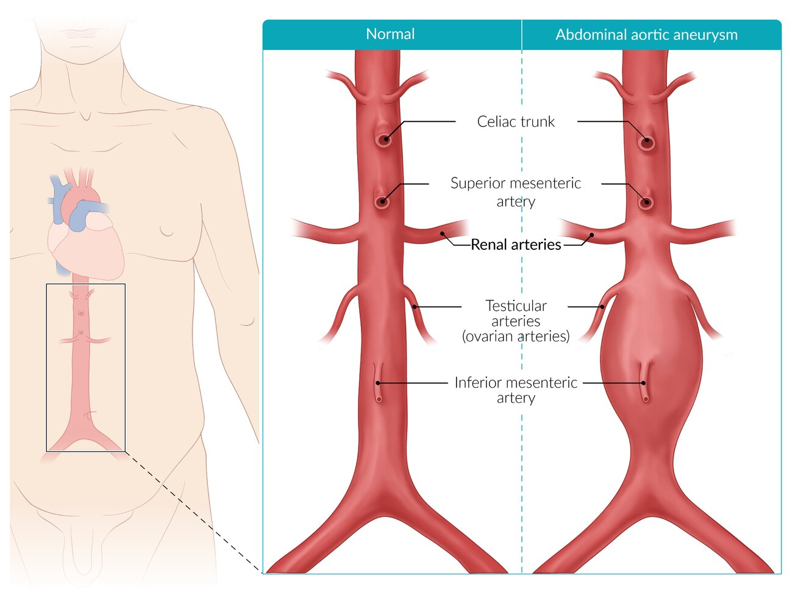

Typical abdominal aortic aneurysm

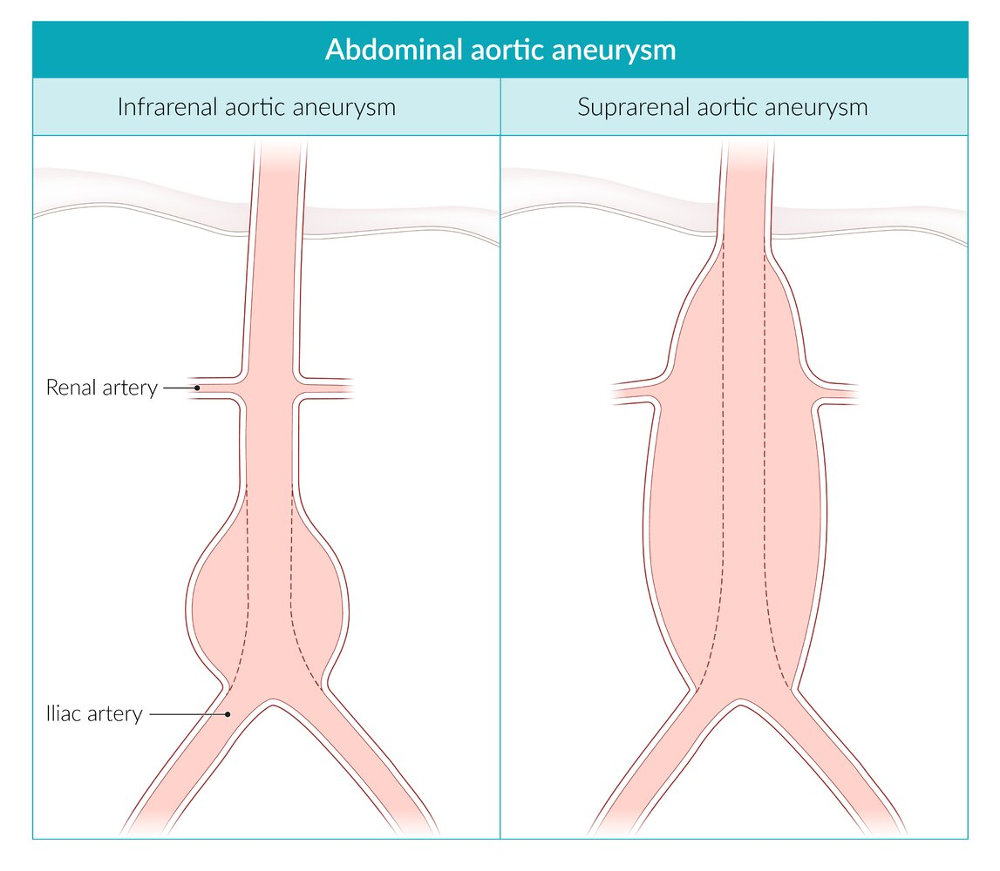

Abdominal aortic aneurysm locations

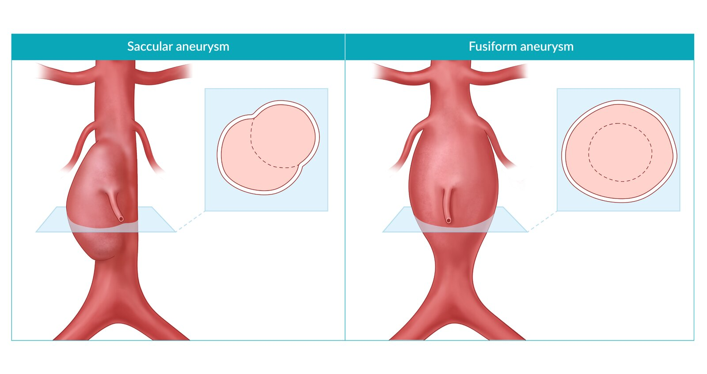

Saccular and fusiform abdominal aortic aneurysms

---

## Pathophysiology

* Inflammation and proteolytic degeneration of <u>connective tissue</u> <u>proteins</u> (e.g., <u>collagen</u> and <u>elastin</u> and/or <u>smooth muscle cells</u>) in high-risk patients → loss of structural integrity of the aortic wall → widening of the vessel → mechanical <u>stress</u> (e.g., <u>high blood pressure</u>) acts on weakened wall tissue → dilation and rupture may occur.

* The aneurysmatic dilatation of the vessel wall may cause disruption of the <u>laminar blood flow</u> and <u>turbulence</u>.

* Possible <u>formation of thrombi</u> in the <u>aneurysm</u> → peripheral <u>thromboembolism</u>

Types of aneurysms

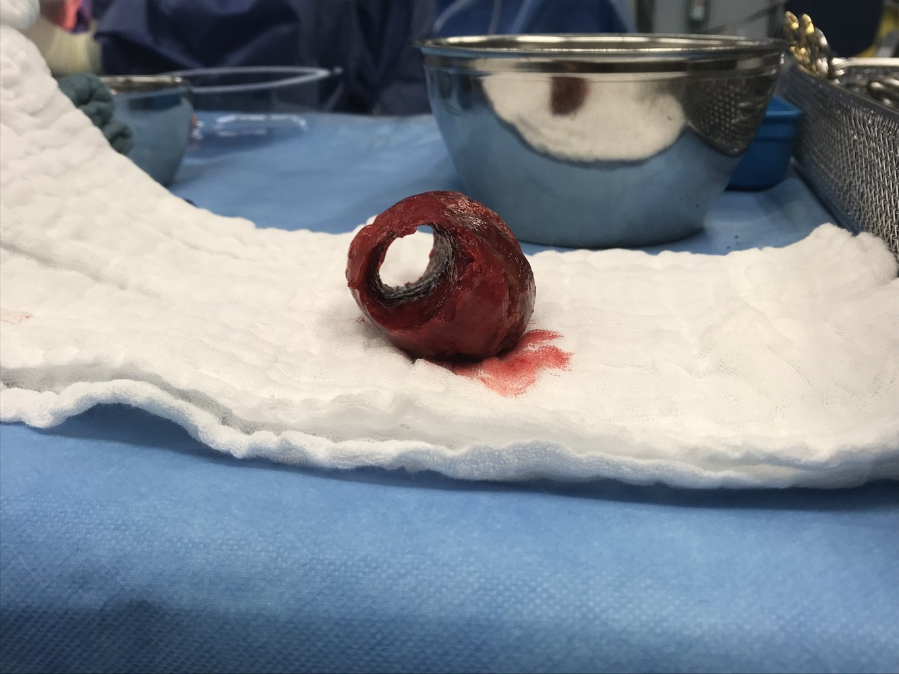

Thrombus from an abdominal aortic aneurysm

References:[[5]](https://coursology-qbank.com/amboss/article/p30Ljf)

---

## Clinical features

<u>Aortic aneurysms</u> are usually asymptomatic or have nonspecific symptoms. They are often discovered incidentally on <u>ultrasound</u> or <u>CT scan</u>. Rupture or dissection of the <u>aneurysm</u> is a life-threatening condition (see “<u>Ruptured AAA</u>”).

* <u>Lower back pain</u>

* Pulsatile abdominal mass at or above the level of the <u>umbilicus</u>

* <u>Bruit</u> on <u>auscultation</u>

* Peripheral <u>thrombosis</u> and <u>distal</u> atheroembolic phenomena (e.g., <u>blue toe syndrome</u> and <u>livedo reticularis</u>)

* Decreased <u>ankle brachial index</u>

Blue toe syndrome

---

## Diagnosis

The diagnosis of AAA is confirmed by imaging showing aortic diameter > 3 cm. Unstable patients should be taken directly to the OR for emergency <u>surgery</u> if <u>ruptured AAA</u> is suspected (see <u>ruptured AAA</u>). There are no laboratory findings specific to AAA. [[1]](https://coursology-qbank.com/amboss/article/4JY38J)

> [!TIP]
> Imaging should not delay treatment if AAA is suspected in <u>hemodynamically unstable</u> patients.

### Imaging [[6]](https://coursology-qbank.com/amboss/article/c-Yaw7)[[7]](https://coursology-qbank.com/amboss/article/1-Y2w7)

#### Abdominal <u>ultrasound</u> (<u>formal ultrasound</u> or <u>POCUS</u>)

* Indications

* Best initial and <u>confirmatory test</u> in:

* Asymptomatic patients

* Patients with abdominal <u>pain</u> and no known AAA or <u>risk factors for AAA</u>

* To determine the presence, size, and extent of an <u>aneurysm</u>

* Screening and surveillance

* <u>Formal ultrasound</u> [[8]](https://coursology-qbank.com/amboss/article/X-Y9D7)

* Obtain longitudinal and transverse views for:

* <u>Proximal</u>, mid, and <u>distal</u> <u>abdominal aorta</u>

* Both <u>proximal</u> common <u>iliac arteries</u>

* Obtain AP dimension measurements of the greatest diameters of each vessel.

* See “<u>POCUS for suspected AAA</u>” for the point-of-care imaging technique and findings.

* Supportive findings

* Dilatation of the aorta ≥ 3 cm   [[1]](https://coursology-qbank.com/amboss/article/4JY38J)

* <u>Thrombus</u> may be present (<u>hyperechoic</u>)

* Disadvantages: Abdominal <u>ultrasound</u> has low <u>sensitivity</u> for <u>aneurysmal</u> leaks, branch <u>artery</u> involvement, and suprarenal involvement, and its findings are insufficient for procedural planning. [[1]](https://coursology-qbank.com/amboss/article/4JY38J)[[9]](https://coursology-qbank.com/amboss/article/OM0IKg)

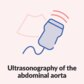

Point of Care Ultrasound of the Abdominal Aorta - AMBOSS Video

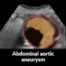

AMBOSS POCUS series | Abdominal aortic aneurysm

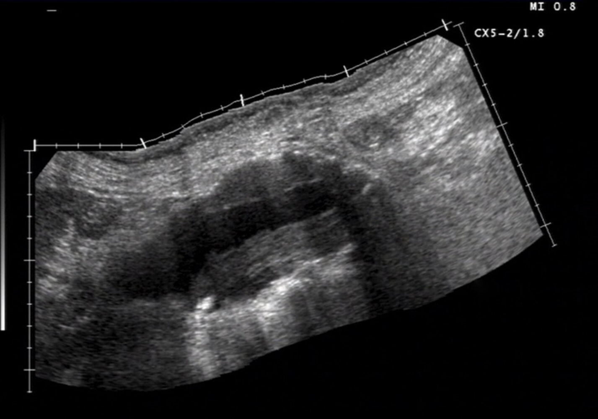

Aortic abdominal aneurysm with mural thrombus

> [!TIP]
> If a large (≥ 5.5 cm in men, ≥ 5.0 cm in women) <u>aneurysm</u> is seen on <u>ultrasound</u> in a patient presenting with abdominal <u>pain</u>, refer the patient for treatment immediately.

#### CT angiography abdomen and pelvis for abdominal aortic aneurysm

See “<u>Ruptured AAA</u>” for CT findings of acute <u>aneurysmal</u> rupture.

* Indications

* Imaging modality of choice in symptomatic patients and for preintervention planning

* To help confirm the diagnosis when <u>ultrasound</u> is not possible in asymptomatic patients

* More detailed evaluation of the location, size, and extent of the <u>aneurysm</u>, involvement of branch vessels, and presence of <u>thrombus</u> or rupture

* Supportive findings

* Dilatation of the aorta ≥ 3 cm   and, possibly, branch vessels [[1]](https://coursology-qbank.com/amboss/article/4JY38J)

* Reduced distribution of <u>vasa vasorum</u> may be seen.  [[10]](https://coursology-qbank.com/amboss/article/ol10BS0)

* <u>Thrombus</u> may also be present (<u>hypodense</u>, nonenhancing).

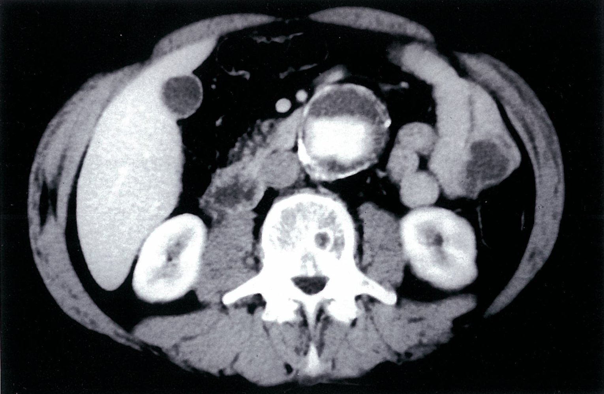

Abdominal aortic aneurysm

Infrarenal abdominal aortic aneurysm

#### <u>MR angiography</u> abdomen and <u>pelvis</u> with and without IV contrast

* Indications

* Preintervention planning when <u>CT angiography</u> is not possible

* To help confirm diagnosis when <u>ultrasound</u> and <u>CT angiography</u> are not possible in asymptomatic patients

* Supportive findings: similar to <u>CT angiography</u>

#### <u>Arteriography</u> (<u>aortography</u> abdomen)

* Indications

* To help confirm diagnosis or for preintervention planning if the patient has significant contraindications to <u>CTA</u> and <u>MRA</u>

* More detailed assessment of the aortic lumen

* Supportive findings: contrast column in the lumen of the <u>aneurysm</u> and branch vessels [[6]](https://coursology-qbank.com/amboss/article/c-Yaw7)

* Disadvantage: may mask the actual diameter of the <u>aneurysm</u> (because a <u>mural thrombus</u> does not appear on <u>arteriography</u>)

> [!TIP]
> An <u>aortic aneurysm</u> is sometimes incidentally detected on an abdominal or <u>pelvis</u> <u>radiograph</u> by the presence of a rounded <u>soft tissue</u> density and/or curvilinear calcification of the <u>aneurysm</u> wall.

Abdominal aortic aneurysm

---

## Differential diagnoses

| Abdominal vs. thoracic aortic aneurysm |  |  |
| --- | --- | --- |
| Characteristics | Abdominal <u>aortic aneurysm</u> | <u>Thoracic aortic aneurysm</u> |
| Location |  * Below the <u>renal arteries</u> (most common)   |  * <u>Ascending aorta</u> (most common)   |
| <u>Epidemiology</u> |   * Advanced age  * Predominantly men  * More common than <u>TAA</u>    |   * Advanced age  * Predominantly men    |
| Etiology |   * Smoking (most important <u>risk factor</u>)  * <u>Atherosclerosis</u>  * <u>Hypercholesterolemia</u> and <u>arterial hypertension</u>    |   * <u>Arterial hypertension</u>  * <u>Bicuspid aortic valve</u>  * Tertiary <u>syphilis</u>  [[11]](https://coursology-qbank.com/amboss/article/VnYGHp)  * <u>Connective tissue diseases</u> (e.g., <u>Marfan syndrome</u>, <u>Ehlers-Danlos syndrome</u>)  * Trauma  * Smoking    |
| Clinical features |   * Pulsatile abdominal mass  * <u>Bruit</u> on <u>auscultation</u>  * <u>Lower back pain</u>    |   * Feeling of pressure in the chest  * Thoracic <u>back pain</u>    |
| Diagnostics |  * Abdominal <u>ultrasound</u> (best initial and <u>confirmatory test</u>)   |  * <u>Chest x-ray</u> and <u>CTA</u> of chest   |
| Therapy |  * Indications for repair  * Diameter: ≥ 5.5 cm in men; ≥ 5.0 cm in women  * Expansion rate: ≥ 0.5 cm/6 months  * Symptomatic <u>aneurysm</u>  * Complications (e.g., rupture)  * <u>Saccular aneurysm</u>   |  * Indications for repair  * Diameter  * Aortic root and <u>ascending aorta</u>: ≥ 5.5 cm  * <u>Aortic arch</u>: ≥ 5.5 cm  * <u>Descending aorta</u>:  * Expansion rate: ≥ 0.3 cm/year in 2 consecutive years, or ≥ 0.5 cm in 1 year  * Symptomatic <u>aneurysm</u>  * Complications (e.g., rupture)   |

See <u>differential diagnoses of acute abdomen</u> in <u>acute abdomen</u>.

The differential diagnoses listed here are not exhaustive.

---

## Treatment

### Approach [[1]](https://coursology-qbank.com/amboss/article/4JY38J)[[12]](https://coursology-qbank.com/amboss/article/uTcpsb0)

* Patients with any symptoms: immediate vascular <u>surgery</u> consult

* Suspected or known rupture (regardless of patient stability)  : emergency repair within 90 minutes (see “<u>Ruptured AAA</u>”)

* Patients with signs or symptoms of impending rupture : urgent <u>aneurysm</u> repair, ideally within normal working hours, as this is associated with better outcomes  

* Ensure <u>blood product</u> availability.

* Maintain BP strictly within normal parameters.

* Consult anesthesia.

* Optimize the treatment of and stabilize any comorbidities that could increase perioperative risk (e.g., <u>ADHF</u>, <u>AKI</u>).

* Asymptomatic patients: elective <u>aneurysm</u> repair or <u>aneurysm</u> surveillance

* All patients: reduction of cardiovascular risk [[1]](https://coursology-qbank.com/amboss/article/4JY38J)

* <u>Smoking cessation</u>

* Appropriate medical management of other <u>atherosclerotic risk factors</u> (e.g., <u>hypertension</u>, <u>diabetes mellitus</u>, <u>dyslipidemia</u>)

> [!TIP]
> Consult vascular <u>surgery</u> and the <u>ICU</u> about any patients with a symptomatic AAA.

### Invasive treatment: AAA repair

* Indications

* Emergency repair: unstable patients

* Urgent repair: impending rupture or leaking AAA

* Elective repair [[13]](https://coursology-qbank.com/amboss/article/FEWgxM0)

* Diameter: ≥ 5.5 cm in men; ≥ 5.0 cm in women

* Expansion rate: ≥ 0.5 cm/6 months

* Symptomatic <u>aneurysm</u>

* <u>Saccular aneurysm</u>

#### Procedures [[1]](https://coursology-qbank.com/amboss/article/4JY38J)

The long-term survival and complication rates of endovascular and open surgical repair are similar, and these procedures each have their advantages and disadvantages.

* Endovascular aneurysm repair (<u>EVAR</u>) 

* Indications: minimally invasive procedure that is preferred over open surgical repair for most <u>aneurysms</u>, especially in patients with a high operative risk

* Procedure: Under <u>fluoroscopic</u> guidance, an expandable <u>stent</u> graft is placed via the femoral or <u>iliac arteries</u> intraluminally at the site of the <u>aneurysm</u>.

* Disadvantage: Reintervention rates are higher for <u>EVAR</u> than for OSR.

* Open surgical repair (OSR)

* Indications

* <u>Mycotic aneurysm</u> or infected graft

* Persistent <u>endoleak</u> and <u>aneurysm</u> sac growth following <u>EVAR</u>

* Anatomical contraindications for <u>EVAR</u>

* Procedure: A <u>laparotomy</u> is performed and the dilated segment of the aorta is replaced with a tube graft or Y-prosthesis (bifurcated synthetic <u>stent</u> graft).

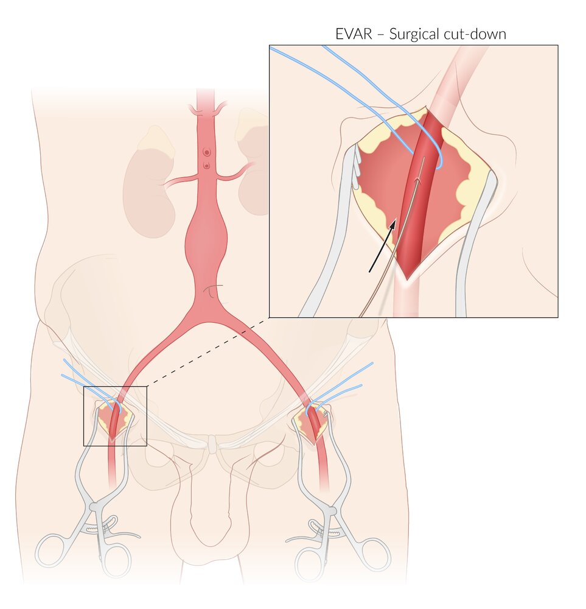

Arterial access for endovascular aneurysm repair (EVAR) of abdominal aortic aneurysm (AAA)

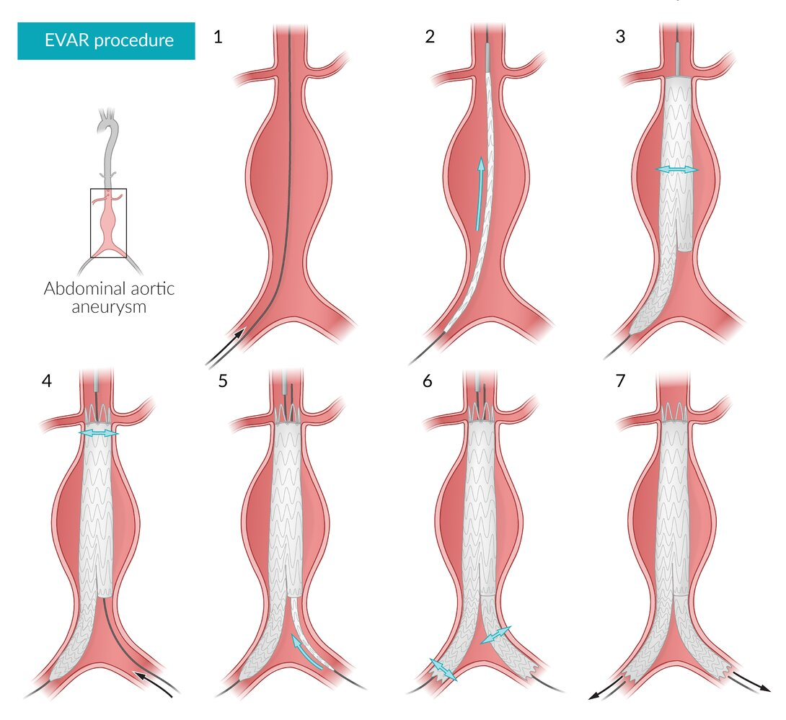

Endovascular aneurysm repair (EVAR) of abdominal aortic aneurysm (AAA)

#### <u>Preoperative assessment</u> for elective repair  [[1]](https://coursology-qbank.com/amboss/article/4JY38J)

* Calculation of mortality risk: used to weigh operative risk against <u>life expectancy</u> for patients being considered for elective <u>AAA repair</u>

|  Elective <u>AAA repair</u> postoperative mortality risk score  [[14]](https://coursology-qbank.com/amboss/article/lbbvFH)  |  |  |
| --- | --- | --- |
|  | Parameter | Points |
| Planned intervention | <u>EVAR</u> | 0 |
| OSR (infrarenal) | 2 |  |
| OSR (suprarenal) | 4 |  |
| <u>Aneurysm</u> size (mm) | < 65 | 0 |
| ≥ 65 | 2 |  |
| Age | ≤ 75 years | 0 |
| > 75 years | 1 |  |
| Sex | Male | 0 |
| Female | 1 |  |
| Comorbidities | History of <u>MI</u> or <u>cerebrovascular disease</u>  | 1 |
| <u>COPD</u> | 2 |  |
| Serum <u>creatinine</u> (mg/dL) | < 1.5 | 0 |
| ≥ 1.5 | 2 |  |
|  Interpretation   * 0–4 points: low risk  * 5–7 points: medium risk  * 8–10 points: high risk  * 11–14 points: prohibitively high risk     |  |  |

Overview of enzyme inhibition mechanisms

* <u>Preoperative management</u> of comorbid conditions

* Cardiac consult in patients with cardiac diseases 

* Optimize <u>heart failure</u> therapy.

* Consider <u>coronary revascularization</u>.

* 12-lead <u>ECG</u> in all patients

* <u>Echocardiography</u> in patients with worsening <u>dyspnea</u> or <u>dyspnea</u> of unknown origin

* <u>Pulmonary function</u> studies, including <u>ABG</u>, in patients with <u>COPD</u>, tobacco use, <u>exertional dyspnea</u>

* Additional considerations: <u>Life expectancy</u> should also be considered when planning elective repair.  [[15]](https://coursology-qbank.com/amboss/article/D0b1RH)

#### Perioperative care for AAA repair

* IV <u>antibiotic prophylaxis</u> [[1]](https://coursology-qbank.com/amboss/article/4JY38J)

* <u>First-generation cephalosporin</u>, e.g., <u>cefazolin</u> DOSAGE

* If the patient is allergic to <u>penicillin</u>: <u>vancomycin</u> DOSAGE

* Anticipate and treat <u>acute blood loss anemia</u>

* Ensure <u>blood product</u> availability.

* Indications for <u>blood transfusion</u> [[1]](https://coursology-qbank.com/amboss/article/4JY38J)

* <u>Hemoglobin</u> is ≤ 7 g/dL

* <u>Hemoglobin</u> is < 10 g/dL and there is ongoing blood loss

* <u>Central venous access</u> and <u>arterial line</u> monitoring during the procedure

* Consider postoperative admission to <u>ICU</u>:

* In patients with significant cardiac, pulmonary, or renal comorbidities

* In patients requiring <u>mechanical ventilation</u>

* After significant <u>arrhythmia</u> or <u>hemodynamic instability</u> during procedure

* Multimodal <u>pain management</u>

* E.g., <u>morphine</u> DOSAGE

* Consider epidural <u>analgesia</u> after OSR

* See also <u>acute pain management</u>.

* <u>VTE prophylaxis</u>

#### Surveillance after repair  [[1]](https://coursology-qbank.com/amboss/article/4JY38J)[[7]](https://coursology-qbank.com/amboss/article/1-Y2w7)

Postoperative surveillance following <u>EVAR</u> is important because it can help to detect possible <u>endoleaks</u>, sac growth, device migration, and device failure. Because of the risk of an anastomotic <u>aneurysm</u> or <u>aneurysmal</u> dilation in the <u>visceral</u> aorta or <u>iliac arteries</u>, regular follow-up is recommended after OSR.

* <u>CT angiography</u> abdomen and <u>pelvis</u> with IV contrast 

* After 1 month, 12 months, then annually

* After 6 months if an abnormality is seen on the 1-month scan

* <u>MR angiography</u> abdomen and <u>pelvis</u> without and with IV contrast

* Indication: <u>contraindications to CT</u> <u>angiography</u>, avoidance of radiation

* Artifacts might be visible depending on <u>stent</u> material and orientation.

* <u>Duplex ultrasound</u>

* Indication: may be used for annual follow-up if the 12-month scan is unremarkable

* Abdominal and <u>pelvic</u> <u>CT angiography</u> with IV contrast should still be performed every 5 years.

### <u>Conservative treatment</u>: AAA surveillance without repair

Small (< 5.5 cm in men, < 5.0 cm in women), asymptomatic AAA can typically be observed with interval surveillance <u>ultrasound</u>.  [[13]](https://coursology-qbank.com/amboss/article/FEWgxM0)

* To identify the expansion rate and thus decrease the risk of rupture

* Frequency depends on the size of the <u>aneurysm</u>.

|  Follow-up frequency for AAA surveillance [[13]](https://coursology-qbank.com/amboss/article/FEWgxM0)  |  |  |
| --- | --- | --- |
| Maximum diameter of the <u>abdominal aorta</u> |  |  Recommended follow-up interval  |
| In men | In women |  |
| 3–3.9 cm |  |  * <u>Ultrasound</u> every 3 years   |
| 4–4.9 cm | 4–4.4 cm |  * <u>Ultrasound</u> every 12 months   |
| ≥ 5.0 cm | ≥ 4.5 cm |  * <u>Ultrasound</u> every 6 months   |

> [!TIP]
> Regular monitoring is essential because <u>aneurysm</u> size and expansion rate are strong predictors of the risk of rupture.

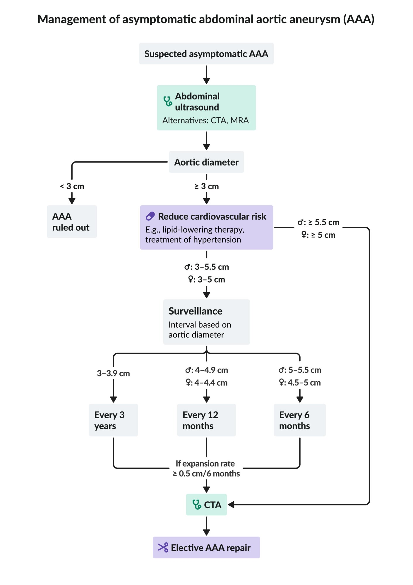

Management of asymptomatic abdominal aortic aneurysm (AAA)

---

## Abdominal aortic aneurysm rupture

### <u>Risk factors</u>

* Rapidly expanding <u>aneurysm</u>

* Large diameter <u>aneurysm</u>

* Smoking, tobacco use

### Clinical features

* Classic triad:

* <u>Hypotension</u> due to <u>hypovolemic shock</u> (especially in free ruptures)

* Sudden onset of severe, tearing back or abdominal <u>pain</u> with radiation to the flank, buttocks, legs, or groin

* Painful pulsatile mass

* <u>Grey Turner sign</u> and/or <u>Cullen sign</u> (if there is an extensive <u>retroperitoneal hematoma</u>)

* <u>Nausea</u>, <u>vomiting</u>

* <u>Syncope</u>

* <u>Hematuria</u>

### Diagnostics [[1]](https://coursology-qbank.com/amboss/article/4JY38J)[[12]](https://coursology-qbank.com/amboss/article/uTcpsb0)[[16]](https://coursology-qbank.com/amboss/article/35YSPp)

The optimal diagnostic approach depends on patient stability, available resources, and clinical suspicion. Follow local protocols if available.

* Unstable patients: : The diagnosis is clinical; refer directly for operative treatment.  [[1]](https://coursology-qbank.com/amboss/article/4JY38J)[[12]](https://coursology-qbank.com/amboss/article/uTcpsb0)

* Consider <u>POCUS</u> to rapidly confirm the presence of an AAA.

* Do not use <u>POCUS</u> to exclude a <u>ruptured AAA</u> if there is high clinical suspicion.

* Stable patients (controversial)  [[1]](https://coursology-qbank.com/amboss/article/4JY38J)[[12]](https://coursology-qbank.com/amboss/article/uTcpsb0)[[16]](https://coursology-qbank.com/amboss/article/35YSPp)[[17]](https://coursology-qbank.com/amboss/article/9TcNGb0)

* Consider imaging (in consultation with a vascular <u>surgeon</u>) provided it does not delay definitive management, for the following reasons:

* To evaluate for alternate etiologies if the diagnosis is uncertain  [[1]](https://coursology-qbank.com/amboss/article/4JY38J)

* Anatomic assessment (e.g., with a thoracoabdominal <u>CTA</u>) to determine candidacy for <u>EVAR</u> and guide operative planning.  [[12]](https://coursology-qbank.com/amboss/article/uTcpsb0)

* Closely monitor patients clinically during transfer outside of critical care areas for imaging.

#### Imaging modalities

* <u>CTA</u> thorax, abdomen, and <u>pelvis</u>

* Study of choice if imaging can be performed without delaying operative repair [[12]](https://coursology-qbank.com/amboss/article/uTcpsb0)[[17]](https://coursology-qbank.com/amboss/article/9TcNGb0)

* Higher detection rates for contained rupture and <u>retroperitoneal</u> bleeds than <u>ultrasound</u>

* Allows surgeons to determine if a patient is suitable for <u>EVAR</u>

* Characteristic findings

* Sign of impending rupture: high-attenuation crescent within <u>mural thrombus</u> [[18]](https://coursology-qbank.com/amboss/article/Nab-kH)

* Signs of rupture: <u>retroperitoneal hematoma</u>, <u>retroperitoneal</u> stranding, indistinct aortic wall, extravasation of contrast

* <u>POCUS</u>: In an unstable patient, assume that a visible AAA on <u>POCUS</u> is a <u>ruptured AAA</u> until proven otherwise.

* Key finding: dilatation of the aorta ≥ 3 cm

* Other possible findings (depending on the location of the rupture)

* Periaortic fluid

* Free <u>intraperitoneal</u> fluid

* <u>Retroperitoneal</u> fluid

* For more detailed findings see “<u>POCUS for suspected AAA</u>.”

Ruptured abdominal aortic aneurysm (AAA)

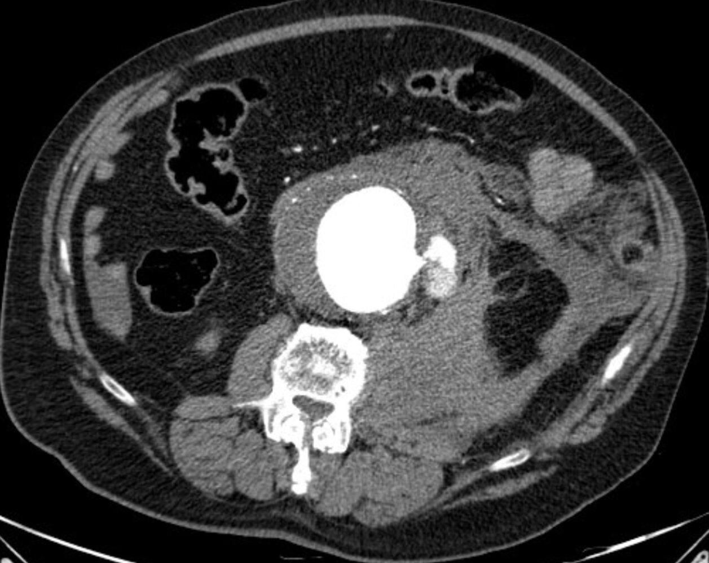

Ruptured aortic aneurysm

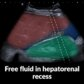

AMBOSS POCUS series | Free fluid in hepatorenal recess (Morison pouch)

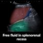

AMBOSS POCUS series | Free fluid in splenorenal recess

#### Additional studies

* Laboratory findings that may be seen: 

* <u>CBC</u>: ↓ <u>hemoglobin</u>, ↓ <u>hematocrit</u>, ↓ <u>red blood cell count</u>

* <u>Metabolic acidosis</u> in cases of <u>shock</u>

* <u>ECG</u>: may show <u>ischemic</u> changes secondary to acute blood loss [[16]](https://coursology-qbank.com/amboss/article/35YSPp)

> [!WARNING]
> A <u>ruptured AAA</u> can mimic an acute <u>MI</u> if blood loss impairs coronary <u>perfusion</u>, causing <u>chest pain</u> and <u>ischemic ECG changes</u>. Screen for an AAA in patients with cardiac <u>chest pain</u> and additional epigastric or <u>back pain</u>.

### Treatment [[1]](https://coursology-qbank.com/amboss/article/4JY38J)[[12]](https://coursology-qbank.com/amboss/article/uTcpsb0)

The main goal of treatment is operative repair by a vascular <u>surgeon</u> without delay.

* Initial management (ideally within 30 minutes)

* Large-bore <u>IV access</u>

* Start continuous monitoring  and reassess regularly as patients may deteriorate rapidly.

* <u>Immediate hemodynamic support</u>

* <u>Fluid resuscitation</u>, or if available, <u>blood transfusion</u>, ideally using <u>blood products</u> in a 1:1:1 <u>ratio</u> (see “<u>Massive transfusion</u>”)  [[12]](https://coursology-qbank.com/amboss/article/uTcpsb0)[[16]](https://coursology-qbank.com/amboss/article/35YSPp)

* Use <u>vasopressors and inotropes</u> with caution.  [[16]](https://coursology-qbank.com/amboss/article/35YSPp)

* Target: <u>permissive hypotension</u> (e.g., <u>SBP</u> 70–90 mm Hg) [[1]](https://coursology-qbank.com/amboss/article/4JY38J)

* Urgent vascular <u>surgery</u> and anesthesia consult  [[1]](https://coursology-qbank.com/amboss/article/4JY38J)

* <u>Pain management</u> with IV <u>opioids</u>

* Definitive treatment (ideally within 90 minutes): emergency <u>EVAR</u> or OSR  [[1]](https://coursology-qbank.com/amboss/article/4JY38J)[[12]](https://coursology-qbank.com/amboss/article/uTcpsb0)[[13]](https://coursology-qbank.com/amboss/article/FEWgxM0)

* <u>Palliation</u>: Consider in frail patients with multiple comorbidities.  [[12]](https://coursology-qbank.com/amboss/article/uTcpsb0)

> [!WARNING]
> Avoid elective <u>intubation</u>, as it may precipitate cardiovascular collapse. [[1]](https://coursology-qbank.com/amboss/article/4JY38J)

> [!TIP]
> Refer all patients with a suspected <u>ruptured AAA</u> for immediate operative evaluation.

### Prognosis

* High <u>mortality rate</u> (∼ 81%) [[2]](https://coursology-qbank.com/amboss/article/BzYzE7)

* Older age, <u>loss of consciousness</u>, and <u>cardiac arrest</u> prior to <u>surgery</u> are associated with high mortality.

### Disposition [[1]](https://coursology-qbank.com/amboss/article/4JY38J)

* Consult vascular <u>surgery</u> as soon as a <u>ruptured AAA</u> is suspected.

* Transfer the patient to the nearest regional center with suitable facilities if a vascular <u>surgeon</u> is not available.

* Consider transfer to a regional center if the available in-hospital vascular <u>surgery</u> service manages a low number of ruptured AAAs annually and transfer can be achieved within 30 minutes.  [[12]](https://coursology-qbank.com/amboss/article/uTcpsb0)

#### Interfacility transfer

* Criteria

* Appropriate expertise and equipment are not available at the referring hospital.

* The patient is suitable for and willing to undergo surgical repair.

* The case has been discussed and accepted by the vascular <u>surgery</u> team at the receiving hospital.

* The patient is not currently in <u>cardiac arrest</u>.

* Preparation prior to departure

* <u>Establish IV access</u>.

* Ensure BP is in the target range (i.e., <u>SBP</u> 70–90 mm Hg).

* Organize transfer of any imaging.

* Establish monitoring for continuous assessment of <u>vital signs</u> during transport.

* Conduct a telephone <u>handover</u> between physicians at the referring and receiving hospitals.

> [!TIP]
> If patients require a transfer, it should be organized as swiftly as possible, with transfer times ideally under 30 minutes!

---

## Complications

* <u>Abdominal aortic aneurysm rupture</u>

* Embolism: caused by <u>thrombotic</u> material from the <u>aneurysm</u>

* <u>Aortic dissection</u>

* <u>Postoperative complications</u> [[19]](https://coursology-qbank.com/amboss/article/4M03Kg) 

* <u>Ischemia</u> of the bowel, <u>kidneys</u>, and spinal cord

* <u>Anterior spinal artery</u> occlusion

* Prosthetic graft infection

* <u>Aortoenteric fistula</u>  [[20]](https://coursology-qbank.com/amboss/article/AN1Rdh0)

* Manifests with massive <u>gastrointestinal hemorrhage</u>

* Unstable patients: Urgently consult surgeons for immediate intervention.

* Stable patients: Assess with CT or endoscopy to rule out differential diagnoses and assist with surgical planning.

* Complications following <u>EVAR</u> [[1]](https://coursology-qbank.com/amboss/article/4JY38J)

* <u>Endoleak</u>

* Access site complications, e.g., bleeding, <u>hematoma</u>, <u>false aneurysm</u>

* Graft limb <u>thrombosis</u>

Ruptured abdominal aortic aneurysm (AAA)

Ruptured aortic aneurysm

We list the most important complications. The selection is not exhaustive.

---

## Prevention

### <u>Primary prevention</u> [[1]](https://coursology-qbank.com/amboss/article/4JY38J)

* See “<u>Primary prevention of ASCVD</u>” for detailed information on <u>primary prevention</u>.

* The following lifestyle measures are thought to reduce the risk of developing an AAA:

* <u>Smoking cessation</u>

* Eating nuts, fruits, and vegetables more than three times a week

* Exercising more than once a week

### Screening for AAA [[1]](https://coursology-qbank.com/amboss/article/4JY38J)[[2]](https://coursology-qbank.com/amboss/article/BzYzE7)[[13]](https://coursology-qbank.com/amboss/article/FEWgxM0)

* Indications

* Men aged 65–75 years with a history of smoking (<u>ever smokers</u>)  [[1]](https://coursology-qbank.com/amboss/article/4JY38J)[[2]](https://coursology-qbank.com/amboss/article/BzYzE7)[[13]](https://coursology-qbank.com/amboss/article/FEWgxM0)

* Consider screening:

* Individuals aged 65–75 years with a <u>family history</u> of AAA in a <u>first-degree relative</u>  [[1]](https://coursology-qbank.com/amboss/article/4JY38J)[[2]](https://coursology-qbank.com/amboss/article/BzYzE7)[[13]](https://coursology-qbank.com/amboss/article/FEWgxM0)

* Women aged 65–75 years with a history of smoking (<u>ever smokers</u>)  [[1]](https://coursology-qbank.com/amboss/article/4JY38J)[[2]](https://coursology-qbank.com/amboss/article/BzYzE7)[[13]](https://coursology-qbank.com/amboss/article/FEWgxM0)

* Individuals aged > 75 years with no previous screening and a history of smoking or <u>family history</u> of AAA  [[1]](https://coursology-qbank.com/amboss/article/4JY38J)[[22]](https://coursology-qbank.com/amboss/article/B61zM30)

* Individuals < 65 years with multiple <u>risk factors for AAA</u> or a <u>family history</u> of AAA [[13]](https://coursology-qbank.com/amboss/article/FEWgxM0)

* Modality: abdominal <u>ultrasound</u> [[1]](https://coursology-qbank.com/amboss/article/4JY38J)[[2]](https://coursology-qbank.com/amboss/article/BzYzE7)[[6]](https://coursology-qbank.com/amboss/article/c-Yaw7)

* Frequency

* One-time screening is recommended. [[2]](https://coursology-qbank.com/amboss/article/BzYzE7)

* Consider rescreening after 10 years if the aortic diameter was between 2.5 cm and 3 cm at the initial assessment. [[1]](https://coursology-qbank.com/amboss/article/4JY38J)

> [!TIP]
> <u>AAA screening</u> is not recommended for women who have never smoked and have no <u>family history</u> of AAA. [[2]](https://coursology-qbank.com/amboss/article/BzYzE7)

> [!TIP]
> Men aged 65-75 with a history of smoking should be screened with a one-time abdominal <u>ultrasound</u>.

---