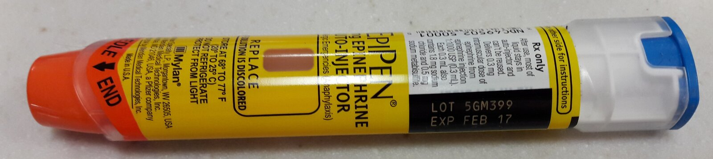

# Anaphylaxis

*Categories: Clinical knowledge > Emergency medicine > Cardiovascular disorders > Anaphylaxis*

[Original Article Link](https://coursology-qbank.com/amboss/article/rq0f-S)

---

## Summary

Anaphylaxis is an acute, potentially life-threatening, <u>type 1 hypersensitivity reaction</u>, involving the sudden <u>IgE</u>-mediated release of <u>histamine</u> mediators from <u>mast cells</u> and <u>basophils</u> in response to a trigger (e.g., food, <u>insect stings</u>, medication). <u>Anaphylactoid reactions</u> (a subtype of <u>pseudoallergy</u>) are <u>IgE</u>-independent reactions that result from direct mast-cell activation (e.g., in response to <u>opioids</u>); the clinical presentation and management are the same as for anaphylaxis. Typical signs and symptoms of both reactions include the acute onset of <u>hives</u>, <u>angioedema</u>, <u>stridor</u>, <u>dyspnea</u>, <u>bronchospasm</u>, circulatory failure (<u>distributive shock</u>), <u>vomiting</u>, and <u>diarrhea</u>. The diagnosis is clinical and is based on combinations of typical symptoms, plus the presence of a known or suspected trigger. Rapid recognition and treatment are key to prevent <u>death</u> from <u>airway</u> loss, <u>respiratory failure</u>, or cardiovascular collapse. Management consists of initial resuscitation measures that focus on administering <u>IM epinephrine</u>, removing triggers, <u>securing the airway</u>, and giving IV fluid boluses, which take precedence over adjunctive treatment like <u>steroids</u> and <u>antihistamines</u>.

---

## Definitions

* Anaphylaxis: a severe <u>type 1 hypersensitivity reaction</u> that can cause life-threatening and multisystem effects due to <u>IgE</u>-mediated <u>mast cell</u> activation

* Anaphylactoid reaction

* A reaction that is clinically similar to anaphylaxis but is mediated by direct nonimmune-mediated activation of either <u>mast cells</u> or the <u>complement cascade</u> (see “<u>Pseudoallergy</u>”)

* Examples include reactions to radiocontrast media and <u>vancomycin</u>

* Anaphylactic shock: a type of <u>distributive shock</u> that results from anaphylaxis

---

## Etiology

* Trigger is <u>idiopathic</u> in 20% of patients [[2]](https://coursology-qbank.com/amboss/article/UEYbEI)

* Most common triggers leading to fatal anaphylaxis [[2]](https://coursology-qbank.com/amboss/article/UEYbEI)[[3]](https://coursology-qbank.com/amboss/article/K1YU3L)[[4]](https://coursology-qbank.com/amboss/article/mEYVwI)

* Younger patients: <u>food allergies</u>;  (e.g., peanut, tree nuts), <u>insect stings</u> (e.g., <u>bee stings</u>)

* Older patients: drug reactions, radiocontrast media

* Hospitalized patients: food, medications (e.g., <u>antibiotics</u>, <u>NSAIDs</u>), latex

---

## Pathophysiology

* Anaphylaxis (<u>type I hypersensitivity reaction</u>) or <u>anaphylactoid reactions</u> → <u>degranulation</u> of <u>mast cells</u> → massive <u>histamine</u> release → systemic <u>vasodilation</u> → increased <u>capillary leakage</u> → <u>anaphylactic shock</u>

* See also “<u>Hypersensitivity classification</u>.”

---

## Clinical features

### Onset of symptoms [[3]](https://coursology-qbank.com/amboss/article/K1YU3L)[[5]](https://coursology-qbank.com/amboss/article/35YSPp)

In general, the onset of symptoms is acute (within minutes to hours of exposure to a likely <u>antigen</u>).

|  <u>Antigen</u>-dependent onset of anaphylaxis [[3]](https://coursology-qbank.com/amboss/article/K1YU3L)[[5]](https://coursology-qbank.com/amboss/article/35YSPp)  |  |
| --- | --- |
| Trigger | Median time to circulatory arrest |
| Food | 30 min |
| Insect | 15 min |
| Medication | 5 min |

### Affected organ systems [[3]](https://coursology-qbank.com/amboss/article/K1YU3L)[[5]](https://coursology-qbank.com/amboss/article/35YSPp)

* <u>Skin</u> or <u>mucous membranes</u>

* Flushing, <u>erythema</u>

* <u>Hives</u>, <u>pruritus</u>

* Swelling of the eyelids, <u>angioedema</u>

* Nasal congestion, sneezing

* Respiratory

* <u>Cough</u>, <u>hoarseness</u>

* Chest tightness

* <u>Dyspnea</u> (due to <u>bronchospasm</u> or laryngeal <u>edema</u>), <u>tachypnea</u>

* <u>Stridor</u>, <u>wheezing</u>

* <u>Hypoxia</u>, <u>cyanosis</u>

* Gastrointestinal

* <u>Nausea</u>, <u>vomiting</u> (especially in <u>food allergies</u>)

* Abdominal <u>pain</u>, <u>diarrhea</u>

* Cardiovascular

* <u>Hypotension</u>

* Adults: <u>SBP</u> < 90 mm Hg OR decrease ≥ 30% from baseline [[6]](https://coursology-qbank.com/amboss/article/MEYMwI)

* Children: definition depends on age

* <u>Tachycardia</u>, weak peripheral pulses

* Signs of <u>end-organ dysfunction</u>

* <u>Altered mental status</u>, <u>syncope</u>

* Decreased urine output, <u>anuria</u>

* <u>Skin</u> changes (e.g., mottling)

* Low temperature

* Delayed <u>capillary refill</u> (e.g., > 2 seconds)

* <u>Ischemic</u> <u>chest pain</u>

> [!WARNING]
> Beware of atypical manifestations without <u>skin</u>/<u>mucosal</u> symptoms (10% of patients) to avoid misdiagnosis and treatment delay. [[2]](https://coursology-qbank.com/amboss/article/UEYbEI)

### Diagnostic criteria for anaphylaxis [[2]](https://coursology-qbank.com/amboss/article/UEYbEI)[[5]](https://coursology-qbank.com/amboss/article/35YSPp)[[7]](https://coursology-qbank.com/amboss/article/JnYs8p)

If any of the following criteria are fulfilled, anaphylaxis is likely. The onset of symptoms must be acute (minutes to hours).

* 1) Known <u>allergen</u> exposure with <u>hypotension</u> (<u>SBP</u> < 90 mm Hg or ≥ 30% decrease from the baseline)

* 2) Acute illness with <u>skin</u> and/or <u>mucosal</u> symptoms (e.g., <u>hives</u>, swollen <u>lips</u>, <u>tongue</u>, and/or uvula) AND ≥ 1 of the following:

* Cardiovascular: <u>SBP</u> < 90 mm Hg or ≥ 30% decrease from baseline and/or <u>altered mental status</u>, <u>syncope</u>, <u>ischemic</u> <u>chest pain</u>, incontinence, or <u>anuria</u>

* Respiratory: <u>dyspnea</u>, <u>hypoxia</u>, <u>stridor</u>, <u>hoarseness</u>, <u>wheezing</u>, <u>cough</u>

* 3) Suspected <u>allergen</u> exposure AND ≥ 2 of the following:

* Gastrointestinal: abdominal <u>pain</u>, <u>nausea</u>, <u>vomiting</u>, <u>diarrhea</u>

* Cardiovascular: systolic BP < 90 mm Hg or ≥ 30% decrease from baseline, and/or <u>altered mental status</u>, <u>syncope</u>, <u>ischemic</u> <u>chest pain</u>, incontinence, <u>anuria</u>

* Respiratory: <u>dyspnea</u>, <u>hypoxia</u>, <u>stridor</u>, <u>hoarseness</u>, <u>wheezing</u>, <u>cough</u>

* <u>Skin</u>/<u>mucosal</u>: <u>hives</u>, <u>angioedema</u>, <u>pruritus</u>, flushing

> [!WARNING]
> If <u>anaphylaxis diagnostic criteria</u> are met, empiric treatment should be given without delay.

---

## Management

* Stabilize the patient (<u>ABCDE approach</u>).

* <u>Airway</u> assessment and management (see “<u>Airway management and ventilation in anaphylaxis</u>”)

* <u>Rapid sequence intubation</u> (<u>RSI</u>) for <u>airway</u> compromise

* Oxygen: Provide <u>FiO2</u> of 100% (e.g., <u>high-flow O2</u> by <u>nonrebreather mask</u>).

* Aggressive <u>IV fluid resuscitation</u> if <u>hypotension</u> present (large-bore <u>IV access</u>; administer 1–2 L <u>0.9% saline</u> IV bolus)

* Position the patient <u>supine</u>.

* If anaphylaxis is likely (see <u>diagnostic criteria for anaphylaxis</u>), start initial treatment immediately: [[3]](https://coursology-qbank.com/amboss/article/K1YU3L)[[5]](https://coursology-qbank.com/amboss/article/35YSPp)[[8]](https://coursology-qbank.com/amboss/article/QuYuII)

* Remove inciting <u>allergen</u>

* Administer epinephrine IM 1:1,000 (1 mg/mL) DOSAGE into the anterolateral thigh  

* Repeat every 5–15 minutes as needed

* <u>IM epinephrine</u> injections always require a more concentrated solution (1:1,000)

* <u>Epinephrine autoinjector</u> may be used.

* See “<u>Anaphylactic transfusion reactions</u>” for specific considerations in patients with reactions during or up to 3 hours after <u>transfusion</u> of <u>blood products</u>.

* Once stabilized, consider adjunctive therapy with <u>antihistamines</u>; , <u>corticosteroids</u> (e.g., <u>methylprednisolone</u>)

* Continuous reassessment and subsequent management

> [!TIP]
> The most important measures in anaphylaxis are to remove the inciting <u>allergen</u> and administer <u>epinephrine</u> as soon as possible. Delay can lead to <u>airway</u> compromise, <u>respiratory failure</u>, <u>refractory shock</u>, and <u>death</u>.

> [!WARNING]
> <u>Epinephrine</u> injections for anaphylaxis should always be given intramuscularly in a concentration of 1:1,000 (as opposed to the 1:10,000 solution used in <u>cardiac arrest</u>). Injecting the 1:1,000 solution into a <u>vein</u> can lead to <u>cardiac arrhythmia</u>/arrest.

Epinephrine autoinjector

---

## Subsequent management

### Refractory anaphylaxis [[3]](https://coursology-qbank.com/amboss/article/K1YU3L)[[5]](https://coursology-qbank.com/amboss/article/35YSPp)[[8]](https://coursology-qbank.com/amboss/article/QuYuII)

* <u>Anaphylactic shock</u> refractory to repeated <u>IM epinephrine</u> and fluids
* Continuous IV <u>epinephrine infusion</u> 1:1,000,000 (1 mcg/mL) DOSAGE 

* 1:1,000,000 <u>epinephrine</u> solutions may not commercially available and require mixing.

* Administration via <u>central venous access</u> recommended

* <u>Anaphylactic shock</u> refractory to IV <u>epinephrine infusion</u>

* Administer IV <u>glucagon</u> DOSAGE, especially if the patient is on a <u>β-blocker</u>

* Consider other <u>vasopressors</u>

* Ensure adequate fluid status

* Consider consulting <u>ECMO</u> team if above measures fail.

* <u>Cardiac arrest</u>: Start <u>ACLS</u> protocol.

### Adjunctive therapy [[3]](https://coursology-qbank.com/amboss/article/K1YU3L)[[5]](https://coursology-qbank.com/amboss/article/35YSPp)[[8]](https://coursology-qbank.com/amboss/article/QuYuII)

* <u>Antihistamines</u>: Consider a combination of an H1-<u>antagonist</u> and H2-<u>antagonist</u> in severe cases.

* <u>H1-antagonists</u>: e.g., <u>diphenhydramine</u> DOSAGE

* H2-<u>antagonists</u>: e.g., <u>cimetidine</u> (<u>off-label</u>) DOSAGE  [[11]](https://coursology-qbank.com/amboss/article/P11WSf0)[[12]](https://coursology-qbank.com/amboss/article/4113Sf0)[[13]](https://coursology-qbank.com/amboss/article/k11mSf0)

* <u>Corticosteroids</u>

* <u>Methylprednisolone</u> DOSAGE

* OR <u>prednisone</u> DOSAGE

> [!WARNING]
> <u>Antihistamines</u> and <u>steroids</u> should be administered in anaphylaxis only after the initial resuscitation measures (<u>IM epinephrine</u>, fluids and/or <u>vasopressors</u>) have been given.

> [!WARNING]
> A lack of response to <u>epinephrine</u>, <u>antihistamines</u>, and <u>steroids</u> should raise suspicion of differential diagnoses such as <u>bradykinin-mediated angioedema</u>, which requires its own specific treatment (see “<u>Treatment of angioedema</u>”).

### Monitoring and disposition [[3]](https://coursology-qbank.com/amboss/article/K1YU3L)[[5]](https://coursology-qbank.com/amboss/article/35YSPp)[[8]](https://coursology-qbank.com/amboss/article/QuYuII)

* Monitor in acute-care setting  at least 4–8 hours

* Continuous <u>pulse oximetry</u> monitoring

* <u>Continuous cardiac monitoring</u>

* Clinical reassessment for <u>biphasic anaphylactic reactions</u>

* Extend monitoring if patient requires ≥ 2 doses of <u>IM epinephrine</u> OR IV <u>epinephrine</u>

* <u>ICU</u> admission for patients needing <u>advanced airway</u>, <u>mechanical ventilation</u>, and/or <u>vasopressor</u> support

* Prior to discharge:

* Alert bracelet and <u>allergy</u> documentation (if trigger is identified)

* <u>Patient counseling</u> on identification and avoidance of triggers

* Prescription and training on <u>epinephrine autoinjector</u> use

* Consider <u>allergy</u>/<u>Immunology</u> referral (e.g., anaphylaxis due to <u>Hymenoptera stings</u>)

---

## Complications

* Biphasic anaphylactic reactions [[4]](https://coursology-qbank.com/amboss/article/mEYVwI)[[14]](https://coursology-qbank.com/amboss/article/NEY-DI)[[15]](https://coursology-qbank.com/amboss/article/5EYiwI)

* Definition: recurrence of <u>anaphylaxis symptoms</u> despite initially successful treatment and without re-exposure to an <u>antigen</u>

* Frequency: occurs in 5–20% of patients with anaphylaxis

* Onset: typically 6–24 hours after treatment

* Not prevented by <u>corticosteroids</u>

* <u>Respiratory failure</u>, <u>cardiac arrest</u>, <u>death</u>
* <u>Risk factors</u> include: [[2]](https://coursology-qbank.com/amboss/article/UEYbEI)[[3]](https://coursology-qbank.com/amboss/article/K1YU3L)

* Delayed administration of <u>epinephrine</u>

* Improper patient positioning

* History of peanut/tree nut <u>allergy</u>, previous severe/near-fatal anaphylaxis, previous biphasic reaction

* Comorbidities: <u>asthma</u>, cardiovascular disease, mast-cell activation disease (e.g., <u>mastocytosis</u>)

* Drug side effects

* Complications of <u>intubation</u> or <u>ventilation strategies</u>

We list the most important complications. The selection is not exhaustive.

---