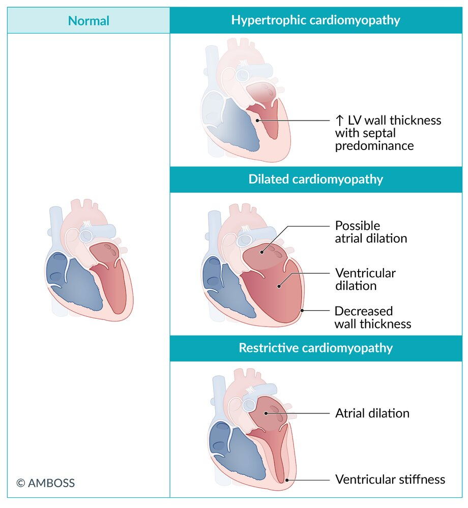
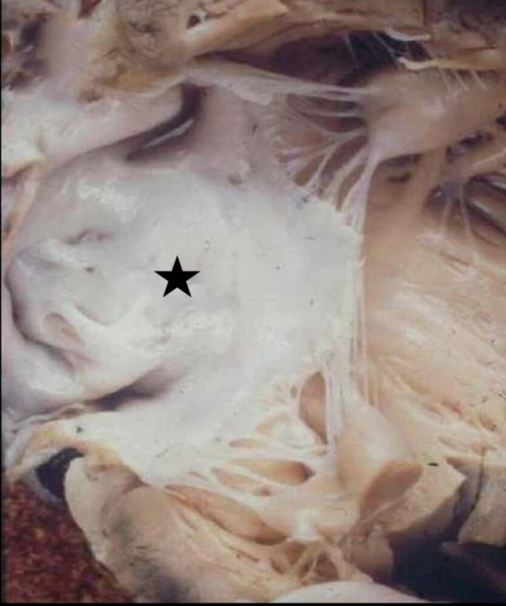
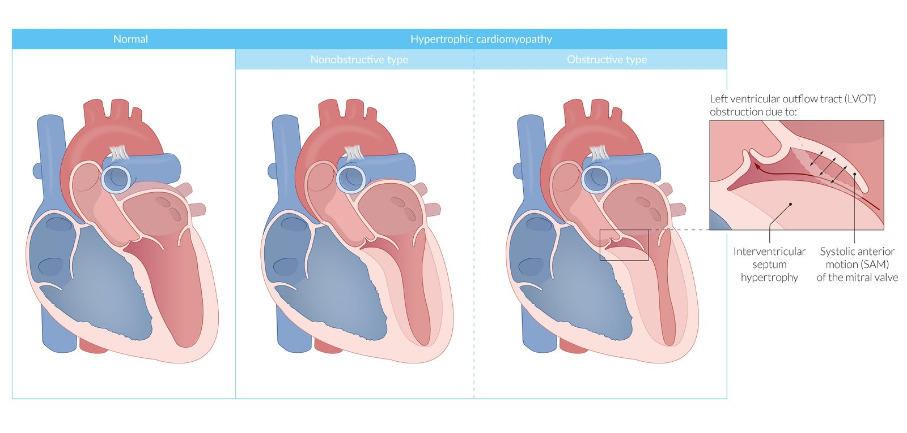
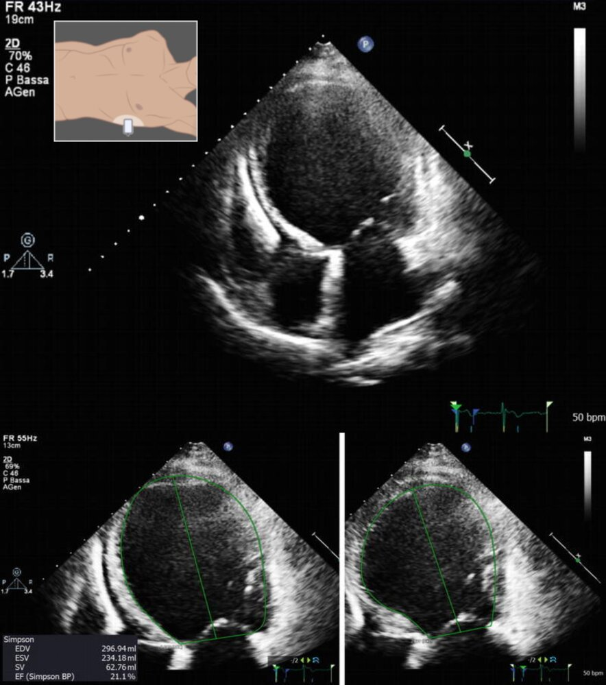
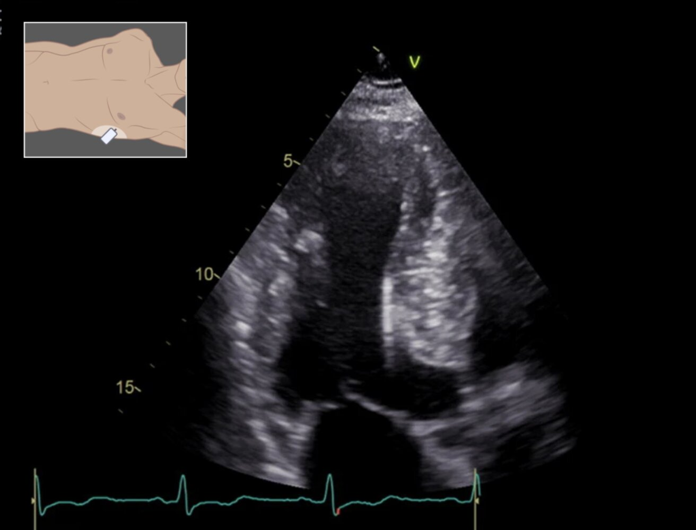
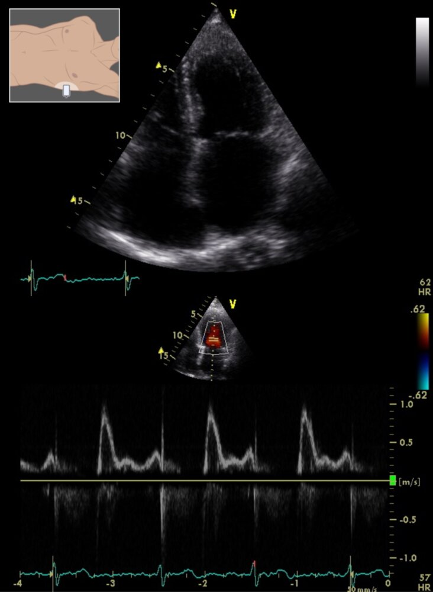
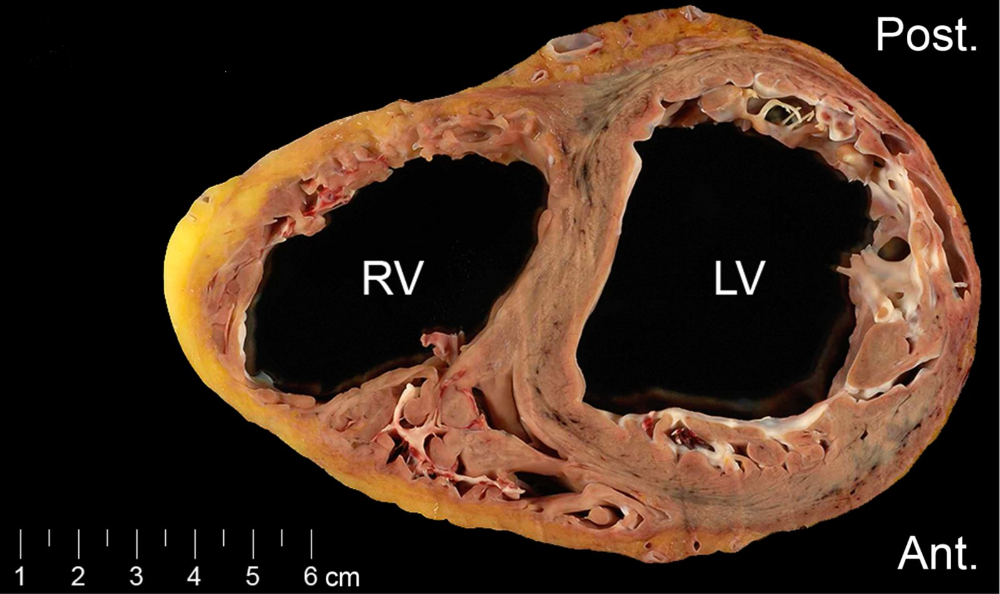

# Cardiomyopathy

*Categories: Clinical knowledge > Emergency medicine > Cardiovascular disorders > Cardiomyopathy*

[Original Article Link](https://coursology-qbank.com/amboss/article/yS0dXf)

---

## Summary

Cardiomyopathies are diseases of the <u>muscle tissue</u> of the <u>heart</u>. Types of cardiomyopathies include dilated (most common), <u>hypertrophic</u>, restrictive, and <u>arrhythmogenic right ventricular cardiomyopathy</u>.

<u>Arrhythmogenic right ventricular cardiomyopathy (ARVC)</u> primarily affects the <u>right ventricle</u> and is characterized by fibrofatty replacement of <u>myocardium</u>, which causes <u>myocardial</u> thinning and subsequent ventricular dilation. Although the hallmark finding is <u>arrhythmia</u>, symptoms are highly variable. Because management depends greatly on individual factors, such as the extent of the disease, there is no single best course of treatment. All patients should avoid strenuous exercise.

<u>Arrhythmia-induced cardiomyopathy</u> is a very rare type of cardiomyopathy. It is caused by long-standing <u>arrhythmia</u> and typically affects the <u>left ventricle</u>. Features include <u>palpitations</u>, <u>syncope</u>, and signs of <u>arrhythmia</u> on <u>ECG</u>. Progression to <u>left heart failure</u> is possible in severe cases. Treatment involves <u>antiarrhythmics</u> such as <u>beta blockers</u> for rhythmic control.

“<u>Dilated cardiomyopathy</u>”, “<u>Hypertrophic cardiomyopathy</u>,” “<u>Restrictive cardiomyopathy</u>,” and “<u>Peripartum cardiomyopathy</u>” are described in their respective articles in more detail.

---

## Overview of major types of cardiomyopathy

|  Differential diagnosis of major cardiomyopathies  |  |  |  |  |
| --- | --- | --- | --- | --- |
| Types |  | <u>Dilated cardiomyopathy</u> | <u>Hypertrophic cardiomyopathy</u> | <u>Restrictive cardiomyopathy</u> |
| Etiology |  |   * Mostly <u>idiopathic</u>  * Genetic predisposition (<u>TTN gene</u> mutation)  * <u>Ischemic heart disease</u>  * Infectious diseases  * <u>Coxsackie B virus</u>  * <u>Chagas disease</u>  * <u>HIV</u>  * Systemic disorders  * <u>Sarcoidosis</u>  * <u>Hemochromatosis</u>  * <u>Thiamine deficiency</u> (<u>wet beriberi</u>)  * Toxic substances  * <u>Cocaine</u>  * <u>Alcohol</u>  * Medication (e.g., <u>doxorubicin</u>)  * <u>Peripartum cardiomyopathy</u>    |  * Inherited (<u>autosomal dominant</u>) mutation of:  * <u>Myosin</u> binding <u>protein C</u>  * β-<u>Myosin</u> <u>heavy chain</u>   |   * Mostly <u>idiopathic</u>  * Systemic disorders  * <u>Amyloidosis</u>  * <u>Sarcoidosis</u>  * <u>Hemochromatosis</u>  * <u>Systemic sclerosis</u>  * <u>Heart</u> disease  * <u>Loffler endocarditis</u>  * <u>Endocardial fibroelastosis</u>  * Post-radiation <u>fibrosis</u>    |
| Pathophysiology |  |  * <u>Eccentric hypertrophy</u> of the <u>left ventricle</u> → ↓ ventricular contractility → ↓ <u>LVEF</u>   |   * <u>Concentric hypertrophy</u> of the <u>left ventricle</u> (including the interventricular septum) → ↓ ventricular relaxation → ↓ <u>diastolic</u> filling and systolic output → ↓ <u>myocardial</u> and peripheral <u>perfusion</u>  * Obstructive type (<u>HOCM</u>): <u>left ventricular outflow tract</u> (<u>LVOT</u>) obstruction and <u>mitral regurgitation</u> due to <u>systolic anterior movement</u> (<u>SAM</u>) of the <u>mitral valve</u>    [[1]](https://coursology-qbank.com/amboss/article/z5br58)    |  * <u>Proliferation</u> of connective tissue →  * ↓ Elasticity of cardiac tissue  * Atrial enlargement and severe <u>diastolic dysfunction</u>   |
| Distinctive clinical features |  |   * Signs of <u>left heart failure</u> and <u>right heart failure</u>  * <u>S3 gallop</u>  * Systolic <u>murmur</u>    |   * Frequently asymptomatic  * Signs of <u>left heart failure</u> (<u>dyspnea</u>, <u>syncope</u>, <u>dizziness</u>)  * <u>Arrhythmias</u>  * <u>S4 gallop</u>  * Possible <u>holosystolic murmur</u> from <u>mitral regurgitation</u>  * Sudden <u>death</u>    |  * Signs of <u>left heart failure</u> and <u>right heart failure</u>   |
| <u>Echocardiography</u> | LV cavity size |  * Significantly increased   |  * Decreased   |  * Decreased   |
| EF |  * Significantly decreased   |  * Normal   |  * Normal or increased   |  |
| Wall thickness |  * Normal or decreased   |  * Significantly increased   |  * Usually increased   |  |
| Additional findings |   * Left or biventricular dilation (with or without atrial dilation)  * Wall motion abnormalities  * <u>Systolic dysfunction</u>  * Normal <u>diastolic</u> function    |   * Outflow tract obstruction (<u>SAM</u>, interventricular septum <u>hypertrophy</u>)  * Reduced <u>diastolic</u> filling    |   * Dilated <u>atria</u>, nondilated ventricles  * Reduced <u>diastolic</u> filling    |  |
| Other characteristics |  |  * Most common cardiomyopathy   |   * Second most common cardiomyopathy  * Most common cause of sudden <u>heart failure</u> in athletes and teenagers    |  * Poor prognosis without <u>heart transplant</u>   |

Overview of cardiomyopathies

Endocardial fibroelastosis

Hypertrophic cardiomyopathy

Dilated cardiomyopathy

Hypertrophic cardiomyopathy

Restrictive cardiomyopathy

---

## Arrhythmogenic right ventricular cardiomyopathy (ARVC)

### <u>Epidemiology</u>

* Most common in young adults (mean age at diagnosis: ∼ 30 years) [[2]](https://coursology-qbank.com/amboss/article/cJYaGJ)

* <u>Prevalence</u>: 1:1,000–2,000 [[3]](https://coursology-qbank.com/amboss/article/XJY9sJ)

### Etiology

* Mutations of various <u>genes</u> (e.g., JUP <u>gene</u>)

* <u>Autosomal recessive</u> or <u>autosomal dominant inheritance</u> [[3]](https://coursology-qbank.com/amboss/article/XJY9sJ)[[4]](https://coursology-qbank.com/amboss/article/WJYPGJ)

### Pathophysiology

* <u>Right ventricular</u> <u>myocardial cell</u> <u>death</u> (due to <u>myocyte</u> <u>apoptosis</u>, inflammation, and fatty/<u>fibrotic</u> tissue replacement) → thinning of the <u>right ventricular</u> wall → dilation of the ventricle → <u>ventricular arrhythmia</u> and dysfunction   [[2]](https://coursology-qbank.com/amboss/article/cJYaGJ)

* The <u>left ventricle</u> can also be affected, but consequences are usually less severe.

Arrhythmogenic right ventricular cardiomyopathy

### Clinical features

* Highly variable

* Many patients remain asymptomatic.

* <u>Angina pectoris</u>

* <u>Dyspnea</u>

* <u>Peripheral edema</u>, <u>ascites</u>, hepatic and splenic congestion

* <u>Palpitations</u>, <u>syncope</u>, possibly <u>sudden cardiac death</u> (particularly during or after exercise)

### Diagnostics [[2]](https://coursology-qbank.com/amboss/article/cJYaGJ)[[3]](https://coursology-qbank.com/amboss/article/XJY9sJ)[[5]](https://coursology-qbank.com/amboss/article/1JY2GJ)

#### Approach

<u>ARVC</u> is diagnosed based on the <u>AHA</u> criteria which include the following features:

1. * Dysfunction and structural abnormalities of RV (can be revealed by <u>echocardiography</u>, <u>MRI</u>, or RV <u>angiography</u>)
2. * Histological characteristics (require <u>myocardial biopsy</u>)
3. * Abnormal <u>repolarization</u> (diagnosed with <u>ECG</u>)
4. * <u>Depolarization</u>/conduction abnormalities (diagnosed with <u>ECG</u>)
5. * <u>Arrhythmias</u> (diagnosed with <u>ECG</u>)
6. * <u>Family history</u> (confirmation of <u>ARVC</u> in a relative either by criteria, pathological examination in <u>surgery</u> or <u>autopsy</u>, or by <u>genetic testing</u>)

#### Findings

* <u>ECG</u>

* <u>Repolarization</u> disturbances in the right <u>precordial leads</u> (V1-3)

* Possibly epsilon wave (at the end of a widened <u>QRS complex</u>)

* Highly specific for <u>ARVC</u> but only occurs in ∼ ⅓ of patients

* Increased QRS duration

* <u>Ventricular tachycardia</u>

* Ventricular extrasystoles

* <u>Echocardiography</u> and <u>cardiac MRI</u>

* RV enlargement

* RV wall motion abnormalities

* ↓ RV EF

* Localized RV <u>aneurysms</u>

* <u>Endomyocardial biopsy</u>: fibrofatty replacement of <u>myocardial</u> tissue

* <u>Genetic testing</u>: Multiple genetic abnormalities that can cause <u>ARVC</u> have been identified (e.g., plakoglobin (JUP), <u>desmoplakin</u> (DSP), plakophilin-2 (PKP2), <u>desmoglein</u>-2 (DSG2), <u>desmocollin</u> (DSC2)). [[4]](https://coursology-qbank.com/amboss/article/WJYPGJ)

Comparison of monomorphic and polymorphic ventricular tachycardia (VT), including torsades de pointes

### Management [[5]](https://coursology-qbank.com/amboss/article/1JY2GJ)

* Avoid intense physical exertion.

* Antiarrhythmic treatment

* Pharmacologic: <u>beta blockers</u> (e.g., <u>sotalol</u>), <u>amiodarone</u>, <u>calcium channel blockers</u>

* Invasive

* <u>AICD</u> implantation (in high-risk patients, e.g., patients with <u>left ventricular</u> involvement)

* <u>Radiofrequency ablation</u> (only as ancillary treatment)

* <u>Heart transplant</u> (in severe cases that are refractory to all other treatments)

* Screening and <u>genetic counseling</u> for first-degree relatives [[6]](https://coursology-qbank.com/amboss/article/QDYuVr)

---