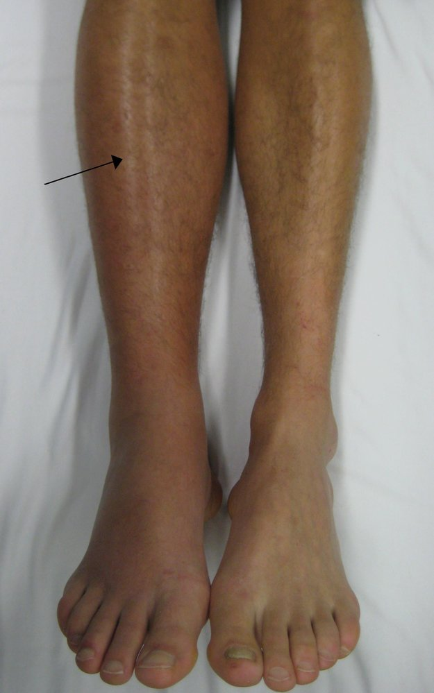
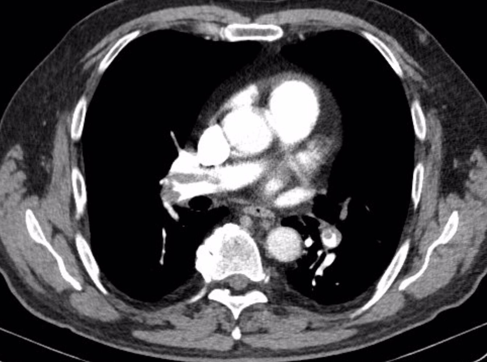
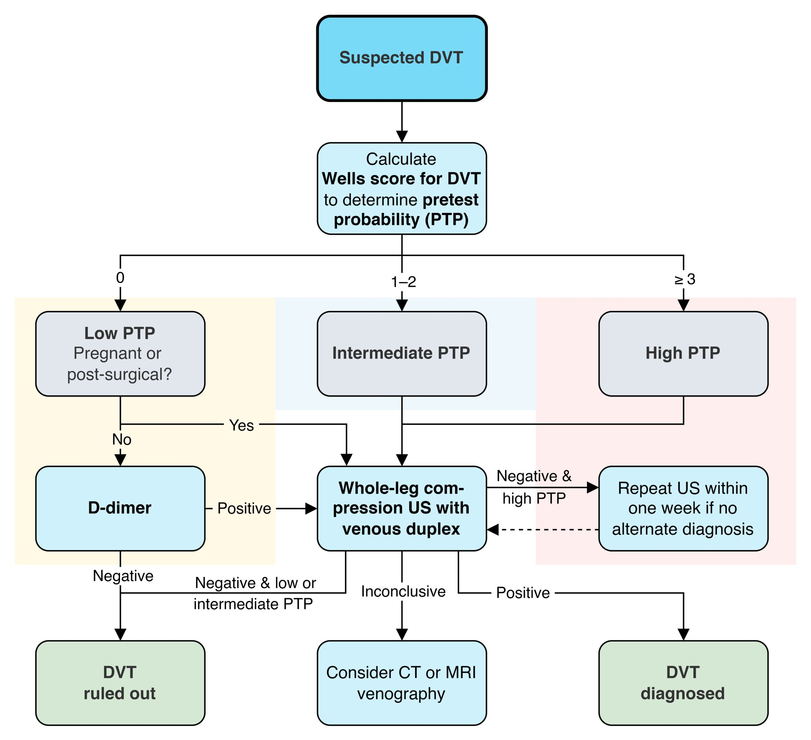
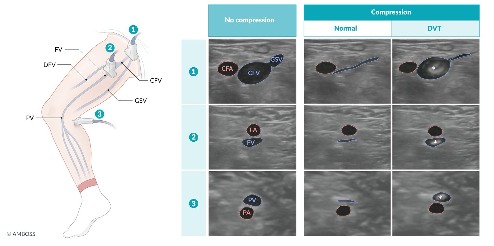
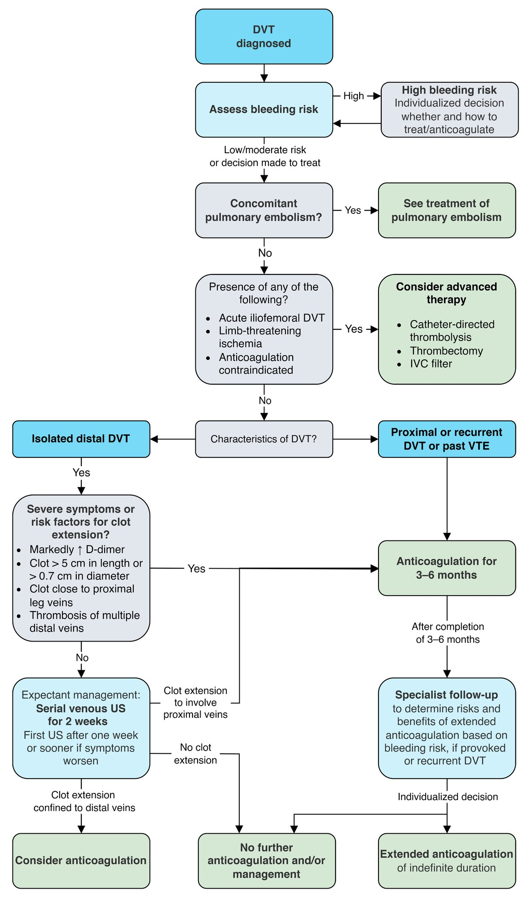
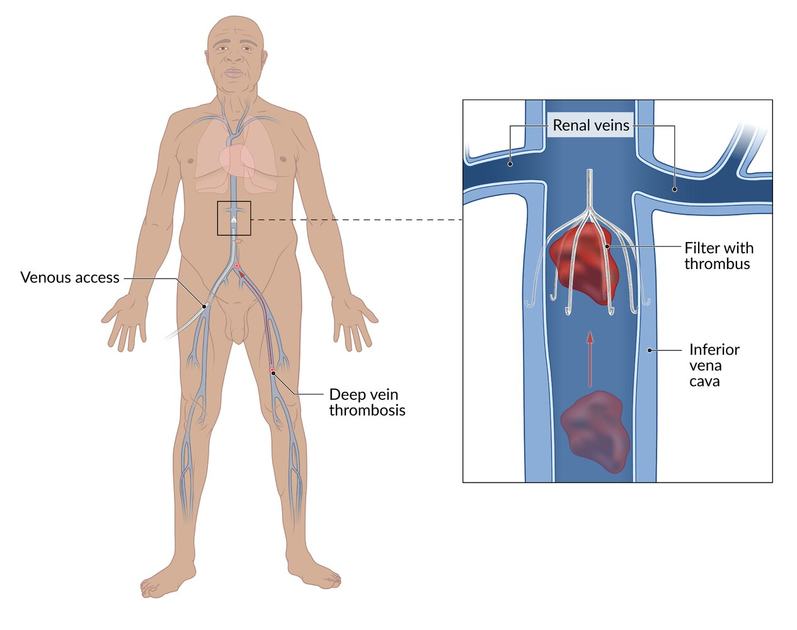
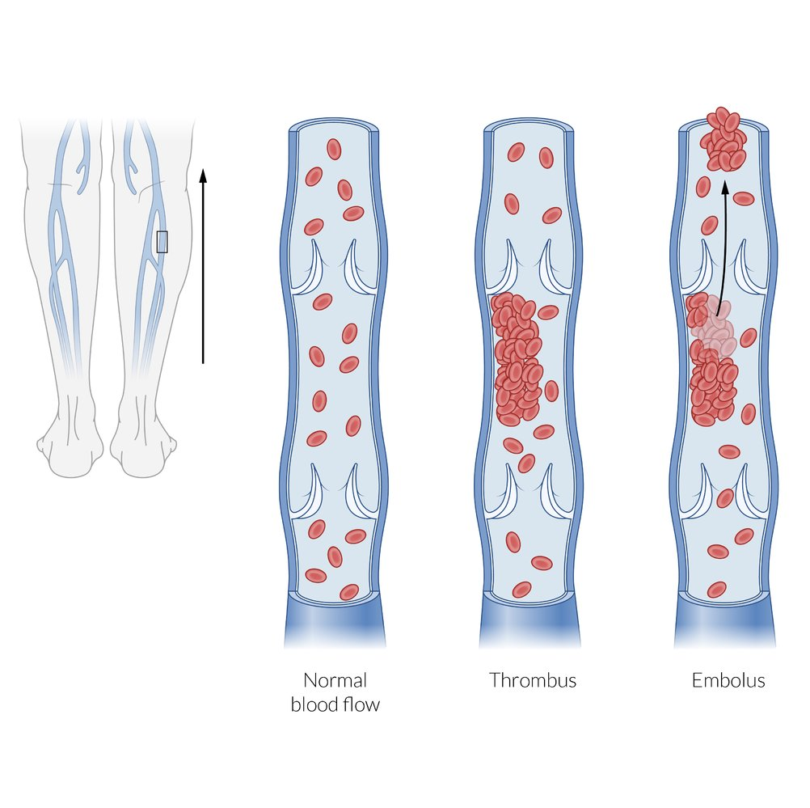
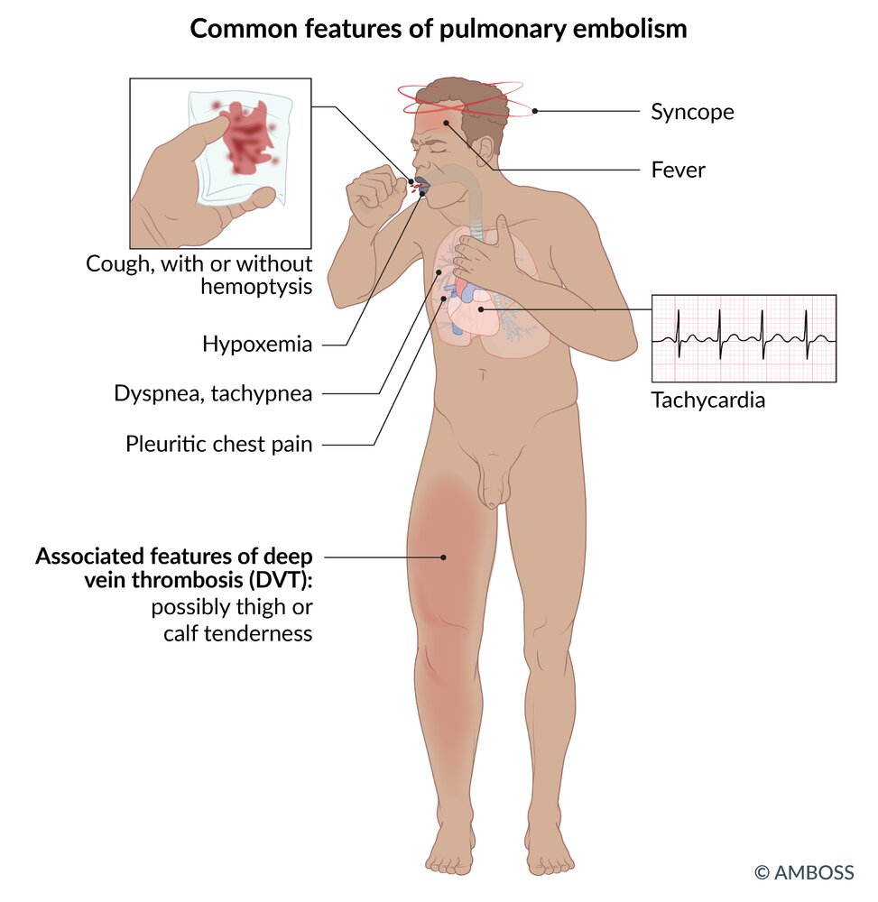

# Deep vein thrombosis

*Categories: Clinical knowledge > Emergency medicine > Cardiovascular disorders > Deep vein thrombosis*

[Original Article Link](https://coursology-qbank.com/amboss/article/fh0kWf)

---

## Summary

<u>Deep vein</u> <u>thrombosis</u> (DVT) is the formation of a blood clot within the <u>deep veins</u>, most commonly those of the lower extremities. The main <u>risk factors for DVT</u> are vascular <u>endothelial</u> damage (e.g., <u>surgery</u> or trauma), <u>venous stasis</u> (e.g., immobility), and <u>hypercoagulability</u> (e.g., <u>thrombophilia</u>), collectively referred to as the <u>Virchow triad</u>. Symptoms include <u>edema</u>, warmth, and dull <u>pain</u> of the affected extremity. Patients may also present with <u>features of pulmonary embolism</u> (<u>PE</u>), a severe complication of DVT. The <u>Wells criteria for DVT</u> are used to determine the <u>pretest probability</u> (<u>PTP</u>) of DVT in nonpregnant adults. The initial test of choice for DVT in nonpregnant adults is <u>D-dimer</u> in patients with a low <u>PTP</u> and venous <u>ultrasound</u> (US) in patients with moderate or high <u>PTP</u>. A negative <u>D-dimer</u> assay (i.e., levels < 500 ng/mL) allows DVT to be ruled out, while a positive <u>D-dimer</u> (levels ≥ 500 ng/mL) is nonspecific and requires a venous <u>ultrasound</u> to confirm the diagnosis. Noncompressibility of the affected <u>vein</u> is the most important <u>sonographic</u> feature of DVT. Long-term anticoagulation for 3–6 months is recommended in all patients with DVT, except for isolated asymptomatic <u>distal DVT</u>, for which <u>expectant management</u> with serial <u>ultrasound</u> may be considered, as the risk of postthrombotic sequelae is low. Prevention of <u>recurrent DVT</u> (i.e., anticoagulation extended indefinitely after completion of primary treatment) is recommended for select patients, depending on the extent and etiology of the DVT and the patient's bleeding risk. <u>Catheter-directed thrombolysis</u> or thrombectomy may be considered for limb-threatening <u>ischemia</u>, acute iliofemoral DVT, and patients with <u>contraindications to anticoagulation</u>. <u>Primary prevention</u> of <u>VTE</u> is recommended in patients at risk of DVT or <u>PE</u> (e.g., seriously ill medical patients, most surgical patients, and long-distance travelers with additional <u>risk factors for VTE</u>) and includes mechanical and pharmacological measures.

---

## Definitions

* <u>Deep vein</u> <u>thrombosis</u> (DVT): the formation of one or more blood clots in a <u>deep vein</u>, typically of the lower extremities [[1]](https://coursology-qbank.com/amboss/article/w_bhqw)[[2]](https://coursology-qbank.com/amboss/article/1yb2Vw)[[3]](https://coursology-qbank.com/amboss/article/qzbCFw)

* Proximal DVT: DVT of the lower extremity affecting the <u>femoral vein</u>, <u>profunda femoris</u> <u>vein</u>, and/or the <u>popliteal vein</u> (up to the calf <u>vein</u> trifurcation) [[4]](https://coursology-qbank.com/amboss/article/pdbLIs)

* Distal DVT: DVT of the lower extremity that is confined to the <u>veins</u> beyond the calf <u>vein</u> trifurcation (i.e., below <u>the knee joint</u>)

* Venous thromboembolism (<u>VTE</u>): an umbrella term that encompasses DVT and <u>pulmonary embolism</u> (<u>PE</u>)

* Recurrent VTE: <u>VTE</u> that recurs in a patient after the completion of the first 2 weeks of <u>antithrombotic therapy</u>.  [[5]](https://coursology-qbank.com/amboss/article/C_bqqw)

* Provoked VTE: <u>VTE</u> in an individual with ≥ 1 <u>risk factor for VTE</u>

* Unprovoked VTE (<u>idiopathic</u> <u>VTE</u>): <u>VTE</u> in an individual without <u>risk factors for VTE</u>

---

## Etiology

Any factor that causes <u>hypercoagulability</u>, <u>endothelial</u> damage, and/or <u>venous stasis</u> can cause DVT (see “<u>Virchow triad</u>”).

|  Risk factors for venous thromboembolism [[6]](https://coursology-qbank.com/amboss/article/MzbMtw)[[7]](https://coursology-qbank.com/amboss/article/9XXNZC)  |  |
| --- | --- |
| Transient <u>risk factors</u> | Chronic <u>risk factors</u> |
|   * Surgical factors  * <u>Surgery</u> under <u>general anesthesia</u>  * <u>Cesarean delivery</u>  * <u>Immobilization</u>  * Acute illness requiring complete bed rest  * Lower extremity injury with restricted mobility for ≥ 3 days  * Long-distance travel  * <u>Estrogen</u>-related factors   * <u>Pregnancy</u>  * Use of <u>OCPs</u> or <u>HRT</u>  * <u>Intravascular</u> devices, such as:  * Indwelling venous catheter: <u>central venous catheters</u> are linked to increased <u>incidence</u> of pediatric <u>venous thromboembolism</u> [[8]](https://coursology-qbank.com/amboss/article/XmW9VN0)  * Implanted pacemaker or <u>cardiac defibrillator</u> leads  * Patient factors  * <u>Obesity</u>  * Smoking  * IV drug use  * Nonadherence to <u>VTE prophylaxis</u>    |   * Patient factors  * Age > 60 years  * Personal or <u>family history</u> of DVT or <u>PE</u>  [[9]](https://coursology-qbank.com/amboss/article/5zbitw)  * Anatomic predisposition to <u>venous stasis</u> (e.g., compression of the iliac <u>veins</u> due to <u>pelvic</u> <u>malignancy</u>, May-Thurner syndrome)  * Prothrombotic chronic illnesses  * <u>Active cancer</u>  * <u>Nephrotic syndrome</u>  [[10]](https://coursology-qbank.com/amboss/article/Q1XugC)  * Autoimmune disorders  * <u>APLA syndrome</u>  * <u>Inflammatory bowel disease</u>  * <u>Hereditary thrombophilia</u>  * <u>Factor V Leiden</u>  * <u>Antithrombin III deficiency</u>, <u>protein C deficiency</u>, and <u>protein S deficiency</u>  * <u>Prothrombin mutation</u>    |

> [!NOTE]
> Remember DVT <u>risk factors</u> using the mnemonic “THROMBOSIS”: Travel, Hypercoagulable/<u>HRT</u>, Recreational drugs, Old (> 60), Malignancy, Blood disorders, Obesity/Obstetrics, Surgery/Smoking, Immobilization, Sickness (<u>CHF</u>/<u>MI</u>, <u>IBD</u>, <u>nephrotic syndrome</u>, <u>vasculitis</u>)!

References:[[11]](https://coursology-qbank.com/amboss/article/VVYGtL)

---

## Pathophysiology

### The Virchow triad

The <u>Virchow triad</u> refers to the three main pathophysiological components of <u>thrombus formation</u>.

1. * <u>Hypercoagulability</u>: increased <u>platelet adhesion</u>, <u>thrombophilia</u> (e.g., <u>factor V Leiden mutation</u>), use of <u>oral contraceptives</u>, <u>pregnancy</u>
2. * <u>Endothelial</u> damage: Inflammatory or traumatic vessel injuries can lead to activation of <u>clotting factors</u> through contact with exposed subendothelial <u>collagen</u>.
3. * Venous stasis: <u>varicosis</u>, external pressure on the extremity, <u>immobilization</u> (e.g., hospitalization, bed rest, long flights or bus rides), local application of heat

> [!NOTE]
> To remember the three pathophysiological components of <u>thrombus formation</u>, think: “HE'S Virchow”: H-Hypercoagulability, E-Endothelial damage, S-Stasis.

References:[[12]](https://coursology-qbank.com/amboss/article/y-0d-i)

---

## Clinical features

<u>Deep vein</u> <u>thrombosis</u> may be asymptomatic.

* Localized unilateral symptoms 

* Typically affects <u>deep veins</u> of the legs, thighs, or <u>pelvis</u>

* Swelling, feeling of tightness or heaviness

* Warmth, <u>erythema</u>, and possibly livid discoloration

* Progressive tenderness, dull <u>pain</u>  

* Homans sign: calf <u>pain</u> on <u>dorsal flexion</u> of the foot

* Meyer sign: Compression of the calf causes <u>pain</u>.

* Payr sign: <u>pain</u> when pressure is applied over the <u>medial</u> part of the sole of the foot

* Distention of <u>superficial veins</u>

* <u>Distal</u> pulses are normal.

* General symptoms: : <u>fever</u>   [[13]](https://coursology-qbank.com/amboss/article/-KYDQJ)

* Possible <u>signs of pulmonary embolism</u>: <u>dyspnea</u>, <u>chest pain</u>, <u>dizziness</u>, <u>weakness</u>

* See also “<u>Clinical features of UEDVT</u>.”

Deep vein thrombosis (DVT)

---

## Subtypes and variants

### Upper extremity deep vein thrombosis (<u>UEDVT</u>) [[14]](https://coursology-qbank.com/amboss/article/1cW2Y40)

#### Definitions

* Proximal UEDVT: <u>thrombosis</u> of the axillary or <u>subclavian vein</u>

* Distal UEDVT: <u>thrombosis</u> of the brachial, radial, ulnar, or interosseus <u>veins</u>

* Primary UEDVT (<u>Paget-Schroetter syndrome</u>): <u>UEDVT</u> due to an underlying anatomical abnormality, repetitive injury to the <u>vein</u>, or an unknown cause

* Secondary UEDVT: <u>UEDVT</u> due to an indwelling device in the <u>vein</u> or a <u>hypercoagulable state</u>

#### <u>Epidemiology</u>

* <u>UEDVT</u> is less common than lower extremity DVT.

* <u>Primary UEDVT</u> typically occurs in young individuals, while <u>secondary UEDVT</u> typically occurs in older adults.

* <u>Secondary UEDVT</u> is more common than <u>primary UEDVT</u>.

* <u>Proximal UEDVT</u> is more common than <u>distal UEDVT</u> with the <u>subclavian vein</u> being the most commonly affected.

* Multiple <u>vein</u> involvement occurs in approx. 60% of patients with <u>UEDVT</u>.

#### Etiology

* <u>Primary UEDVT</u>

* Venous <u>thoracic outlet syndrome</u> due to increased muscle bulk, <u>fibrotic</u> <u>connective tissue</u>, abnormal ligamentous insertion, or osseous abnormalities (e.g., <u>cervical rib</u>)

* Effort-induced <u>thrombosis</u>: repetitive strenuous activity involving the upper extremities (e.g., weight-lifting, gymnastics, operation of a jackhammer)

* <u>Secondary UEDVT</u>

* Venous devices

* <u>Central venous catheters</u> and port systems

* Pacemaker leads

* <u>Hypercoagulable states</u>

* <u>Malignancy</u>

* <u>Hereditary thrombophilia</u>

* <u>Pregnancy</u>

* <u>Oral contraceptive</u> use

* Prolonged upper extremity <u>immobilization</u>

#### Clinical features of UEDVT

* Symptoms tend to be more severe with <u>proximal UEDVT</u> than with <u>distal UEDVT</u>.

* Acute <u>thrombosis</u>

* Discoloration, swelling, and/or <u>pain</u> in the affected arm

* <u>Superficial</u> venous engorgement

* Chronic <u>thrombosis</u>

* Often asymptomatic until complete occlusion occurs

* Even with complete occlusion, symptoms are often nonspecific or minimal as drainage through collateral <u>veins</u> can partially compensate for occlusion.

#### Management [[15]](https://coursology-qbank.com/amboss/article/ldbvJs)[[16]](https://coursology-qbank.com/amboss/article/41W3S40)[[17]](https://coursology-qbank.com/amboss/article/2_YTn7)

* Initial evaluation

* Calculate the <u>pretest probability</u> of <u>UEDVT</u> using the dichotomized Constans score. [[18]](https://coursology-qbank.com/amboss/article/jcW_X40)

* One point is given for each of the following:

* The presence of a device in the <u>vein</u>

* Unilateral <u>edema</u>

* Localized <u>pain</u>

* One point is subtracted if another diagnosis is at least equally plausible.

* A score of ≥ 2 indicates a high likelihood of <u>UEDVT</u>.

* <u>UEDVT</u> likely (<u>dichotomized Constans score</u> ≥ 2): perform <u>duplex ultrasonography</u> or measure <u>D-dimers</u>

* <u>UEDVT</u> unlikely (<u>dichotomized Constans score</u> < 2): measure <u>D-dimers</u>

* If <u>D-dimers</u> are negative: <u>UEDVT</u> can be ruled out.

* If <u>D-dimers</u> are positive: perform <u>duplex ultrasonography</u>

* Further evaluation

* If initial <u>duplex ultrasonography</u> is negative but clinical suspicion remains high:

* Consider repeating <u>duplex ultrasonography</u>.

* Consider alternative imaging modalities such as CT or <u>MR venography</u>.

* If <u>primary UEDVT</u> is suspected: Consider a <u>chest x-ray</u> to screen for bone abnormalities (see “Diagnostics” in “<u>Thoracic outlet syndrome</u>”).

* If <u>secondary UEDVT</u> due to a <u>hypercoagulable state</u> is suspected: Consider screening for occult <u>malignancy</u> or <u>inherited thrombophilia</u> (see “Diagnostics” in “<u>Hypercoagulable states</u>”).

* Initial treatment

* <u>Proximal UEDVT</u>

* First-line: anticoagulation therapy

* Second-line: <u>catheter-directed thrombolysis</u> in patients with limb-threatening or severe symptoms despite anticoagulation and no contraindications for <u>thrombolytic therapy</u>

* <u>Distal UEDVT</u>

* Symptomatic patients: anticoagulation therapy

* Asymptomatic patients: typically <u>expectant management</u> with repeat <u>duplex ultrasonography</u> to monitor the clot

* Anticoagulation therapy in <u>UEDVT</u>

* Initiate <u>parenteral anticoagulation</u> using <u>unfractionated heparin</u> or <u>low molecular weight heparin</u> (<u>LMWH</u>)

* Continue long-term anticoagulation for at least 3 months with <u>LMWH</u>, <u>vitamin K antagonists</u>, or <u>direct oral anticoagulants</u>.

* Further treatment based on the underlying cause

* <u>Primary UEDVT</u>: Consider thoracic outlet decompression <u>surgery</u> if symptoms persist despite anticoagulation and <u>thrombolysis</u>.

* <u>Secondary UEDVT</u> due to a venous device

* Leave the device in situ if the patient has <u>proximal UEDVT</u> and does not have an indication for device removal.

* Indications for device removal

* Failure of symptoms to resolve with anticoagulation

* <u>Contraindication to anticoagulation</u>

* Evidence of a <u>central line</u>-associated <u>blood stream infection</u> (see “<u>Indications for intravascular catheter removal</u>”)

* The device is no longer needed.

#### Differential diagnosis

* Neurologic or arterial <u>thoracic outlet syndrome</u>

* <u>Superior vena cava syndrome</u>

* <u>Complex regional pain syndrome</u>

* Secondary <u>lymphedema</u>

* <u>Brachial neuritis</u>

* Quadrilateral <u>pain</u> syndrome

* Cervical <u>nerve root</u> compression

* Peripheral nerve compression

#### Complications

* <u>Pulmonary embolism</u>

* <u>Superior vena cava syndrome</u>

* <u>Postthrombotic syndrome</u>

* Recurrence of a <u>UEDVT</u>

Acute and chronic pulmonary emboli

### Phlegmasia cerulea dolens

* Definition: : a severe form of DVT characterized by obstruction of all <u>veins</u> of one extremity, with subsequent restriction of arterial flow; associated with high mortality

* Symptoms

* Severe swelling, <u>edema</u>, and <u>pain</u>

* Coldness, <u>cyanosis</u>, and pulselessness

* Treatment

* Emergency <u>surgery</u>: venous thrombectomy, <u>fasciotomy</u>

* <u>Fibrinolysis</u> if <u>surgery</u> fails

* <u>Amputation</u> as last resort

* Complications: <u>shock</u>, <u>gangrene</u>, <u>acute renal failure</u> (due to <u>rhabdomyolysis</u>)

---

## Wells score

* The <u>Wells score for DVT</u>, also known as the <u>Wells criteria</u>, is used to calculate the pretest <u>probability</u> of DVT of the lower extremities in nonpregnant adults.  [[19]](https://coursology-qbank.com/amboss/article/UCbbrD)[[20]](https://coursology-qbank.com/amboss/article/iVYJ8L)

* A different version of the score is used to determine the <u>probability</u> of <u>PE</u> (see “<u>Wells criteria for PE</u>”).

|  Modified Wells criteria for deep vein thrombosis [[19]](https://coursology-qbank.com/amboss/article/UCbbrD)[[20]](https://coursology-qbank.com/amboss/article/iVYJ8L)[[21]](https://coursology-qbank.com/amboss/article/mdbVqs)  |  |  |
| --- | --- | --- |
| Criteria |  | Score |
| <u>Medical history</u> | <u>Active cancer</u> | + 1 |
| Previously documented DVT | + 1 |  |
| <u>Immobilization</u> |  <u>Paralysis</u>, <u>paresis</u>, or recent (cast) <u>immobilization</u> of lower extremity | + 1 |
|  Recently bedridden for ≥ 3 days OR underwent major <u>surgery</u> within the past 12 weeks under general/<u>local anesthesia</u>  | + 1 |  |
| Clinical features | Tenderness localized along the <u>deep venous system</u>  | + 1 |
| Swelling of the entire leg | + 1 |  |
| Calf swelling ≥ 3 cm compared to the <u>contralateral</u> leg   | + 1 |  |
|  <u>Pitting edema</u> confined to the symptomatic leg | + 1 |  |
| Distended collateral <u>superficial veins</u> (nonvaricose) | + 1 |  |
| Differential diagnosis | Alternative diagnosis as likely as or more likely than DVT | - 2 |
|  Interpretation (<u>pretest probability</u> for DVT) [[15]](https://coursology-qbank.com/amboss/article/ldbvJs)   * 0: low  * 1–2: intermediate  * ≥ 3: high     |  |  |

> [!TIP]
> The <u>Wells score</u> can overestimate the <u>probability</u> of DVT in patients with concomitant signs of lower extremity <u>cellulitis</u> due to overlap in the clinical manifestations. [[22]](https://coursology-qbank.com/amboss/article/yRcdpX0)

Wells criteria for deep vein thrombosis

---

## Diagnosis

### Diagnostic approach for suspected lower-extremity DVT [[4]](https://coursology-qbank.com/amboss/article/pdbLIs)[[15]](https://coursology-qbank.com/amboss/article/ldbvJs)[[23]](https://coursology-qbank.com/amboss/article/FxbgyD)

This approach is valid for evaluating a first-episode or recurrent lower extremity DVT. [[15]](https://coursology-qbank.com/amboss/article/ldbvJs)

* Calculate the <u>pretest probability</u> (<u>PTP</u>) using <u>Wells criteria for DVT</u>.

* Check <u>D-dimer</u> first for low <u>PTP</u> (initial <u>D-dimer</u> is not diagnostically helpful for intermediate and high <u>PTP</u>).  ;  [[24]](https://coursology-qbank.com/amboss/article/_KY5QJ)

* Negative (< 500 ng/mL): DVT ruled out

* Positive (≥ 500 ng/mL): Possible DVT; Proceed to venous US.

* Obtain venous <u>ultrasound</u> (US) for intermediate or high <u>PTP</u>, or low <u>PTP</u> with positive D-Dimer  [[23]](https://coursology-qbank.com/amboss/article/FxbgyD)

* Negative US

* Intermediate and low <u>PTP</u>: DVT ruled out

* High <u>PTP</u>: Repeat venous US within a week if no alternate diagnosis.  [[4]](https://coursology-qbank.com/amboss/article/pdbLIs)

* Positive US: DVT confirmed; Screen for an underlying cause if no <u>risk factors for DVT</u> are identified on initial evaluation.

* Inconclusive US: Consider <u>venography</u>, CT <u>venography</u>, or <u>MR venography</u>.

> [!TIP]
> A negative <u>D-dimer</u> can help rule out DVT without venous <u>ultrasound</u> in patients with low <u>pretest probability</u>. It is not helpful for patients with intermediate or high <u>pretest probability</u>.

> [!WARNING]
> The positive yield of investigations for concomitant DVT (i.e., using the <u>Wells score</u>, D-Dimer, and/or venous <u>ultrasound</u>) is low for patients with a high likelihood of lower extremity <u>cellulitis</u>. A selective rather than routine approach to evaluating for DVT is preferred in these patients to avoid unnecessary testing. [[22]](https://coursology-qbank.com/amboss/article/yRcdpX0)

Diagnostic approach to DVT

### Initial evaluation of DVT

Based on the patient's <u>pretest probability</u>, the initial test to evaluate for DVT may be either <u>D-dimer</u> or <u>compression ultrasound</u>.

> [!TIP]
> Severe swelling and <u>edema</u> with concomitant coldness, <u>cyanosis</u>, and pulselessness should raise concern for <u>phlegmasia cerulea dolens</u>, which requires emergency <u>surgery</u>.

#### <u>D-dimer</u>  [[15]](https://coursology-qbank.com/amboss/article/ldbvJs)[[23]](https://coursology-qbank.com/amboss/article/FxbgyD)

* Indication: preferred initial test for nonpregnant patients with a low <u>PTP</u> of DVT (<u>Wells score</u> = 0)

* Interpretation

* Cutoff for normal range is typically 500 ng/mL

* Some centers use age-adjusted <u>D-dimer</u> cutoffs  (See also “Diagnostics” in “<u>Pulmonary embolism</u>”) [[25]](https://coursology-qbank.com/amboss/article/k1XmSC)[[26]](https://coursology-qbank.com/amboss/article/O1XISC)[[27]](https://coursology-qbank.com/amboss/article/l1XvSC)

* <u>Accuracy</u>

* High <u>sensitivity</u> (∼ 96%)

* Low <u>specificity</u> (∼ 36%)  [[4]](https://coursology-qbank.com/amboss/article/pdbLIs)

* Not reliable for ruling out DVT in patients with intermediate or high <u>PTP</u>

> [!TIP]
> In patients with a low <u>pretest probability</u> of DVT, a negative <u>D-dimer</u> (< 500 ng/mL) rules out DVT. [[15]](https://coursology-qbank.com/amboss/article/ldbvJs)

> [!TIP]
> A positive <u>D-dimer</u> alone does not confirm DVT. [[15]](https://coursology-qbank.com/amboss/article/ldbvJs)

#### Lower extremity venous ultrasound [[4]](https://coursology-qbank.com/amboss/article/pdbLIs)[[15]](https://coursology-qbank.com/amboss/article/ldbvJs)[[23]](https://coursology-qbank.com/amboss/article/FxbgyD)[[28]](https://coursology-qbank.com/amboss/article/6dbjIs)

* Indications

* Preferred initial test for patients with moderate or high <u>PTP</u> of lower extremity DVT (<u>Wells score</u> ≥ 1)

* Preferred initial test for pregnant or postsurgical patients even if the <u>PTP</u> of DVT is low

* Next diagnostic step in patients with a low <u>PTP</u> of lower extremity DVT but a positive <u>D-dimer</u>

* Procedures   [[23]](https://coursology-qbank.com/amboss/article/FxbgyD)

* Compression ultrasound: The <u>vein</u> is identified and external pressure is directly applied over it with the probe.  

* <u>Proximal</u> leg: allows for evaluation of the femoral and <u>popliteal veins</u> up to the trifurcation

* Whole leg: allows for evaluation of the <u>proximal</u> leg PLUS <u>distal</u> calf <u>veins</u> (beyond the trifurcation)

* Venous <u>duplex ultrasound</u>: can be added to <u>compression ultrasound</u>

* Involves the addition of color Doppler

* Allows for better evaluation of noncompressible <u>deep veins</u>  [[29]](https://coursology-qbank.com/amboss/article/4xb39D)

* <u>Point-of-care ultrasound for DVT</u>: Consider if <u>formal ultrasound</u> cannot be promptly obtained. [[23]](https://coursology-qbank.com/amboss/article/FxbgyD)

* Supportive ultrasound findings of DVT [[29]](https://coursology-qbank.com/amboss/article/4xb39D)

* Noncompressibility of the obstructed <u>vein</u>

* Intraluminal <u>hyperechoic</u> mass

* Distention of the affected <u>vein</u>

* On Doppler imaging

* Absent venous flow (complete obstruction) or abnormal venous flow (partial obstruction)

* Inadequate augmentation of venous flow on <u>distal</u> calf compression or <u>Valsalva maneuver</u>

* Of <u>recurrent DVT</u>: <u>thrombosis</u> in a new venous segment or a > 4 mm increase in noncompressibility of the obstructed <u>vein</u>

* <u>Accuracy</u>: operator- and technique-dependent

* Whole leg study by radiology: high <u>sensitivity</u> and <u>specificity</u> (∼ 95%) for <u>proximal DVT</u>; lower <u>sensitivity</u> and <u>specificity</u> (∼ 65%) for <u>distal DVT</u> [[28]](https://coursology-qbank.com/amboss/article/6dbjIs)

* <u>Point of care ultrasound</u> study (<u>POCUS</u>) by trained nonradiologists: equivalent <u>accuracy</u> for detection of <u>proximal DVT</u>, but <u>distal DVT</u> may be missed  [[30]](https://coursology-qbank.com/amboss/article/ARcRpX0)[[31]](https://coursology-qbank.com/amboss/article/B1czQY0)

> [!TIP]
> <u>Compression ultrasound</u> of the whole leg with color Doppler (i.e., <u>duplex scanning</u>) is the most accurate test for diagnosing DVT. [[23]](https://coursology-qbank.com/amboss/article/FxbgyD)

> [!TIP]
> If appropriately trained, consider performing a <u>POCUS</u> study to quickly rule in a <u>proximal DVT</u>. If the study is negative, further investigations (e.g., a whole leg <u>ultrasound</u> study by radiology) may be necessary. [[30]](https://coursology-qbank.com/amboss/article/ARcRpX0)[[31]](https://coursology-qbank.com/amboss/article/B1czQY0)

POCUS protocol for detection of lower extremity DVT

### Additional evaluation

#### Routine <u>laboratory studies</u>

These are recommended to assess organ function and bleeding risk prior to anticoagulation.

* <u>CBC</u>

* <u>BMP</u>

* <u>Liver chemistries</u>

* <u>Coagulation studies</u>

* Assess the patient's baseline coagulation status.

* Screen for subtherapeutic <u>INR</u> in patients on <u>VKA</u> therapy with suspected <u>recurrent DVT</u>.

#### <u>Venography</u>, CT <u>venography</u>, or <u>MR venography</u> [[4]](https://coursology-qbank.com/amboss/article/pdbLIs)[[28]](https://coursology-qbank.com/amboss/article/6dbjIs)

* Indications

* Inconclusive findings on <u>compression US</u>

* Inability to perform <u>compression US</u> due to, e.g., <u>obesity</u>, significant lower limb <u>edema</u>, <u>immobilization</u> cast

* Finding: intraluminal filling defect

#### Screening for an underlying cause

Patients with the following may require additional evaluation: <u>unprovoked DVT</u>, unexplained <u>recurrent VTE</u>, and/or a history suggestive of a <u>hypercoagulable state</u> or occult <u>malignancy</u>. [[2]](https://coursology-qbank.com/amboss/article/1yb2Vw)

* <u>Thrombophilia screening</u> [[2]](https://coursology-qbank.com/amboss/article/1yb2Vw)

* <u>Thrombosis</u> in patients < 45 years

* Unusual <u>thrombus</u> localization

* Positive <u>family history</u>

* Recurrent or multiple <u>thromboses</u>

* <u>Recurrent pregnancy loss</u>

* See “Diagnostics” in “<u>Hypercoagulable states</u>.”

* Screening for occult <u>malignancy</u> [[2]](https://coursology-qbank.com/amboss/article/1yb2Vw)[[32]](https://coursology-qbank.com/amboss/article/bybHdw)[[33]](https://coursology-qbank.com/amboss/article/Xyb9dw)

* Indications: <u>unprovoked VTE</u> (esp. patients > 50 years), <u>recurrent VTE</u>, unusual <u>thrombus</u> location

* Investigations: routine age-appropriate <u>cancer screening</u> recommended [[32]](https://coursology-qbank.com/amboss/article/bybHdw)[[33]](https://coursology-qbank.com/amboss/article/Xyb9dw)

* In addition to routine <u>laboratory studies</u>: consider e.g., <u>urinalysis</u>, <u>FOBT</u>, serum <u>calcium</u> levels

* Consider <u>CXR</u>, <u>colonoscopy</u>, <u>mammogram</u>, <u>digital rectal examination</u>, <u>Pap smear</u>

---

## Differential diagnoses

* <u>Superficial thrombophlebitis</u>

* Muscle or <u>soft tissue</u> injury (i.e., posttraumatic swelling or <u>hematoma</u>)

* <u>Lymphedema</u>

* Venous insufficiency

* <u>Ruptured popliteal cyst</u>

* <u>Cellulitis</u>

* <u>Compartment syndrome</u>

> [!TIP]
> In patients with suspected <u>cellulitis</u> AND <u>risk factors for DVT</u> or no response to <u>antibiotics</u>, consider <u>compression ultrasound</u> to rule out DVT. [[22]](https://coursology-qbank.com/amboss/article/yRcdpX0)

The differential diagnoses listed here are not exhaustive.

---

## Superficial thrombophlebitis

### Definition

* Inflammation and <u>thrombosis</u> of a <u>superficial vein</u>

* Variants

* <u>Thrombophlebitis migrans</u> (<u>Trousseau syndrome</u>)

* <u>Superficial thrombophlebitis of the breast</u>

### <u>Risk factors</u>

* <u>Risk factors for VTE</u>

* <u>Varicose veins</u>  [[34]](https://coursology-qbank.com/amboss/article/GfbBnG)

* Venous cannulation, IV drug administration

* Behçet disease

* <u>Thromboangiitis obliterans</u> [[35]](https://coursology-qbank.com/amboss/article/BKYziJ)

#### <u>Risk factors</u> for concomitant DVT [[17]](https://coursology-qbank.com/amboss/article/2_YTn7)[[36]](https://coursology-qbank.com/amboss/article/tfbXLG)

* Age ≥ 75 years

* Past history of <u>VTE</u>

* <u>Superficial thrombophlebitis</u> affecting nonvaricose <u>veins</u> or <u>veins</u> above the knee [[17]](https://coursology-qbank.com/amboss/article/2_YTn7)[[37]](https://coursology-qbank.com/amboss/article/zAbrmw)

* Recent <u>immobilization</u>, <u>surgery</u>, or trauma

* <u>Pregnancy</u>, recent <u>childbirth</u>, use of <u>estrogen</u> therapy

* <u>Obesity</u>, autoimmune disease, <u>thrombophilia</u>, <u>CHF</u>, or <u>active cancer</u>

### Clinical features

* <u>Pain</u>, tenderness, induration, and <u>erythema</u> overlying a <u>superficial vein</u>, often with a palpable cord (the thrombosed <u>vein</u>)

* Most commonly affects the <u>superficial</u> <u>veins of the leg</u>

* Concomitant DVT and/or <u>PE</u> present in ∼ 25% of patients (see “<u>Clinical features of DVT</u>” and “<u>Clinical features of PE</u>”) [[36]](https://coursology-qbank.com/amboss/article/tfbXLG)[[37]](https://coursology-qbank.com/amboss/article/zAbrmw)[[38]](https://coursology-qbank.com/amboss/article/Z_bZ5w)

### Diagnostics

<u>Superficial thrombophlebitis</u> is typically a <u>clinical diagnosis</u>. The primary differential diagnoses are localized <u>skin</u> or <u>soft tissue</u> inflammation (e.g., <u>cellulitis</u>, <u>vasculitis</u>) [[36]](https://coursology-qbank.com/amboss/article/tfbXLG)[[39]](https://coursology-qbank.com/amboss/article/yAbdmw)

* <u>Compression ultrasound</u> with/without Doppler

* Indication: presence of any <u>risk factor</u> for concomitant DVT or if the <u>clinical diagnosis</u> is unclear

* Findings: thickened, <u>edematous</u>, noncompressible <u>superficial vein</u> with/without an intraluminal <u>thrombus</u>, with/without extension into a <u>deep vein</u>

* Evaluation for the underlying cause: same as that for DVT (see “Diagnostics" above)

### Treatment   [[17]](https://coursology-qbank.com/amboss/article/2_YTn7)[[40]](https://coursology-qbank.com/amboss/article/e_bxMw)

All patients should be evaluated and treated for concomitant <u>pulmonary embolism</u> or DVT.

* Symptomatic care: indicated for all patients [[17]](https://coursology-qbank.com/amboss/article/2_YTn7)

* Oral and/or <u>topical analgesics</u>: See “<u>Pain management</u>.”

* Compression therapy with <u>graduated compression stockings</u>

* Anticoagulation: : to consider based on <u>thrombus</u> length (e.g., ≥ 5 cm), location (i.e., proximity to the <u>deep venous system</u>), and <u>risk factors for DVT</u>

* Not required in the following circumstances: (i.e., provide symptomatic care only)

* <u>Superficial thrombophlebitis</u> caused by venous cannulation

* <u>Thrombus</u> length < 5 cm without <u>risk factors</u> for concomitant DVT

* Prophylactic regimen (for 45 days)

* Indications

* <u>Thrombus</u> length ≥ 5 cm located > 3 cm away from the <u>SFJ</u>

* <u>Thrombus</u> length < 5 cm with any <u>risk factors</u> for concomitant DVT

* Options

* <u>Rivaroxaban</u> DOSAGE  [[41]](https://coursology-qbank.com/amboss/article/c_baMw)

* <u>Fondaparinux</u> DOSAGE  [[42]](https://coursology-qbank.com/amboss/article/FfbgLG)

* <u>LMWH</u>, such as <u>enoxaparin</u> DOSAGE: preferred in pregnant patients

* Therapeutic regimen (for at least 3 months)

* Indication: any length <u>thrombus</u> located < 3 cm from the <u>SFJ</u>

* Options: See “Long-term anticoagulation” in “Treatment.”

### Complications

* DVT

* <u>Pulmonary embolism</u>

* Infection (<u>septic thrombophlebitis</u>)

---

## Treatment

### Approach [[7]](https://coursology-qbank.com/amboss/article/9XXNZC)[[24]](https://coursology-qbank.com/amboss/article/_KY5QJ)

* Evaluate and treat concomitant <u>pulmonary embolism</u> and stabilize the patient as needed.

* Assess <u>bleeding risk on anticoagulation for VTE</u>.

* Initiate anticoagulation therapy based on the extent and <u>etiology of DVT</u>. 

* <u>Expectant management</u>: serial venous <u>ultrasound</u> without anticoagulation

* Primary treatment: anticoagulation for 3–6 months in patients not being managed expectantly

* Prevention of <u>recurrent DVT</u>: extended anticoagulation after completion of primary treatment; should be individualized (e.g., patients with chronic <u>risk factors</u>)

* Treat the underlying cause, if feasible.

> [!WARNING]
> Consider empirical <u>management of pulmonary embolism</u> in unstable or pulseless patients with obvious signs of DVT. [[17]](https://coursology-qbank.com/amboss/article/2_YTn7)[[43]](https://coursology-qbank.com/amboss/article/s-YtA7)

Treatment of deep vein thrombosis

### Expectant management of DVT [[7]](https://coursology-qbank.com/amboss/article/9XXNZC)[[23]](https://coursology-qbank.com/amboss/article/FxbgyD)[[24]](https://coursology-qbank.com/amboss/article/_KY5QJ)

* Indication: asymptomatic or only mildly symptomatic isolated <u>distal DVT</u> without <u>risk factors</u> for clot extension

* <u>Relative contraindications</u>  

* Severe symptoms

* Risk factors for clot extension in DVT 

* Markedly elevated <u>D-dimer</u> levels

* <u>Thrombosis</u> > 5 cm in length and/or > 0.7 cm in diameter

* <u>Thrombosis</u> of multiple <u>distal</u> <u>veins</u>

* <u>Thrombosis</u> in close proximity to the <u>proximal</u> leg <u>veins</u>

* Past history of <u>VTE</u>

* Measures

* Serial venous US for 2 weeks after symptom onset to identify clot extension

* If evidence of clot extension is:

* Absent: No further management is required.

* Confined to <u>distal</u> <u>veins</u>: Consider anticoagulation.

* Involves <u>proximal</u> <u>veins</u>: Initiate anticoagulation.

### Anticoagulation for DVT [[7]](https://coursology-qbank.com/amboss/article/9XXNZC)[[24]](https://coursology-qbank.com/amboss/article/_KY5QJ)[[44]](https://coursology-qbank.com/amboss/article/T_Y6n7)

Patients with acute DVT may require temporary <u>parenteral anticoagulation</u> initially (<u>bridging anticoagulation</u>) followed by long-term (typically 3–6 months) oral anticoagulation.

#### Initial <u>parenteral anticoagulation</u>

* Indications
* * Bridging anticoagulation for <u>VKAs</u>: <u>Parenteral anticoagulation</u> overlaps with oral anticoagulation until therapeutic <u>INR</u> is maintained.

* Parenteral lead-in therapy for <u>dabigatran</u> and <u>edoxaban</u>: These <u>DOACs</u> are started after completion of lead-in parenteral therapy without overlapping.

* Duration: first 5–10 days

* Options

* <u>Low molecular weight heparin</u> (<u>LMWH</u>) (e.g., <u>enoxaparin</u>  DOSAGE);  : preferred in pregnant patients and patients with normal renal function, <u>liver</u> disease, or <u>active cancer</u> [[17]](https://coursology-qbank.com/amboss/article/2_YTn7)[[45]](https://coursology-qbank.com/amboss/article/U_Ybn7)[[46]](https://coursology-qbank.com/amboss/article/zIWr250)

* <u>Fondaparinux</u> (<u>factor Xa inhibitor</u>);  DOSAGE : preferred in patients with a history of <u>heparin-induced thrombocytopenia</u>

* <u>Unfractionated heparin</u> (<u>UFH</u>) bolus plus infusion;  DOSAGE : preferred in patients with <u>renal failure</u>, inadequate subcutaneous absorption (i.e., <u>morbid obesity</u>), and those at a high risk of bleeding  [[44]](https://coursology-qbank.com/amboss/article/T_Y6n7)[[47]](https://coursology-qbank.com/amboss/article/pzbLFw)

> [!TIP]
> Treatment with <u>heparin</u> (especially <u>UFH</u>) can cause <u>heparin-induced thrombocytopenia</u>. For early detection, perform regular <u>CBCs</u>.

#### Long-term anticoagulation for DVT

* Indication: all patients with DVT who cannot be managed expectantly and have no <u>contraindications to anticoagulation</u>

* Isolated <u>distal DVT</u> with severe symptoms and/or <u>risk factors</u> for clot extension

* Any of the following in a patient with high bleeding risk:

* <u>Proximal DVT</u> (provoked or unprovoked)

* <u>Recurrent DVT</u> (provoked or unprovoked)

* DVT provoked by a transient <u>risk factor</u>

* Duration: : 3–6 months

* <u>Direct oral anticoagulants</u> (<u>DOACs</u>): first-line therapy in nonpregnant patients, including patients with <u>active cancer</u> (preferred over <u>VKAs</u>) [[46]](https://coursology-qbank.com/amboss/article/zIWr250)[[48]](https://coursology-qbank.com/amboss/article/XAb9Rw)[[49]](https://coursology-qbank.com/amboss/article/cAbaiw)

* Regular monitoring of <u>coagulation parameters</u> is not required.

* Associated with a lower risk of <u>major bleeding</u>

* Options (any of the following) 

* Direct <u>factor Xa inhibitors</u>: <u>rivaroxaban</u> DOSAGE, <u>apixaban</u> DOSAGE, or <u>edoxaban</u> DOSAGE

* <u>Direct thrombin inhibitors</u>: <u>dabigatran</u> DOSAGE

* <u>Dabigatran</u> and <u>edoxaban</u> require parenteral lead-in therapy while <u>rivaroxaban</u> and <u>apixaban</u> can be started immediately. [[48]](https://coursology-qbank.com/amboss/article/XAb9Rw)

* <u>Vitamin K antagonists</u> (<u>VKAs</u>): <u>warfarin</u> DOSAGE

* <u>Bridging anticoagulation</u> is required.

* Initiate simultaneously with initial <u>parenteral anticoagulation</u>.

* Continue <u>parenteral anticoagulation</u> with <u>warfarin</u> for at least 5 days and until therapeutic <u>INR</u> has been maintained for 48 hours.  [[49]](https://coursology-qbank.com/amboss/article/cAbaiw)[[50]](https://coursology-qbank.com/amboss/article/1Ab2iw)

* Second-line therapy in nonpregnant patients, including patients with <u>active cancer</u> [[46]](https://coursology-qbank.com/amboss/article/zIWr250)

* Requires dose adjustment to maintain a target <u>INR</u> of 2–3

* <u>LMWH</u>: : preferred in pregnant individuals;  , e.g., <u>enoxaparin</u> DOSAGE [[46]](https://coursology-qbank.com/amboss/article/zIWr250)[[48]](https://coursology-qbank.com/amboss/article/XAb9Rw)

> [!TIP]
> Initial <u>parenteral anticoagulation</u> (with <u>LMWH</u>, <u>fondaparinux</u>, or <u>UFH</u>) should be initiated at the same time as <u>warfarin</u> and before <u>dabigatran</u> and <u>edoxaban</u>. Initial <u>parenteral anticoagulation</u> is not required for patients receiving <u>rivaroxaban</u> or <u>apixaban</u>. [[7]](https://coursology-qbank.com/amboss/article/9XXNZC)[[24]](https://coursology-qbank.com/amboss/article/_KY5QJ)

#### Extended anticoagulation for DVT [[7]](https://coursology-qbank.com/amboss/article/9XXNZC)[[24]](https://coursology-qbank.com/amboss/article/_KY5QJ)[[44]](https://coursology-qbank.com/amboss/article/T_Y6n7)

The decision to extend anticoagulation indefinitely after primary treatment is typically made after balancing the risk of <u>recurrent DVT</u> (e.g., for patients with chronic <u>risk factors</u>) with the <u>bleeding risk on anticoagulation for VTE</u>.

* Indications

* Any of the following in a patient with low or moderate bleeding risk:

* Unprovoked <u>proximal DVT</u>

* Unprovoked <u>recurrent DVT</u>

* DVT provoked by chronic <u>risk factors</u> (e.g., <u>active cancer</u> with additional <u>risk factors</u>, <u>thrombophilia</u>)

* Duration: indefinite

* Options [[24]](https://coursology-qbank.com/amboss/article/_KY5QJ)

* First episode of DVT: Continue the same <u>anticoagulant</u> used for long-term anticoagulation (e.g., <u>warfarin</u>, or <u>DOACs</u>).

* <u>Recurrent DVT</u> while appropriately anticoagulated 

* On an <u>oral anticoagulant</u>: Switch to <u>LMWH</u>;  either temporarily or for the remaining duration of therapy (e.g., <u>enoxaparin</u>  DOSAGE).

* On <u>LMWH</u>: Increase <u>LMWH</u> dose by 25–33%.

* Patients wishing to discontinue anticoagulation : Consider <u>aspirin</u> (unless there are contraindications).

* Monitoring: Reassess bleeding risk periodically (e.g., annually).

> [!TIP]
> Extended anticoagulation is usually not required in patients with a <u>provoked DVT</u> due to a transient or reversible <u>risk factor</u> (e.g., <u>surgery</u>, <u>intravascular</u> catheter). [[24]](https://coursology-qbank.com/amboss/article/_KY5QJ)[[44]](https://coursology-qbank.com/amboss/article/T_Y6n7)

#### Anticoagulation for DVT in active cancer [[46]](https://coursology-qbank.com/amboss/article/zIWr250)

* Approach to management

* Initiate <u>LMWH</u> (e.g., <u>enoxaparin</u>), <u>UFH</u>, <u>fondaparinux</u>, <u>rivaroxaban</u>, or <u>apixaban</u>.

* Continue anticoagulation for at least 6 months.

* First line: <u>LMWH</u> (e.g., <u>enoxaparin</u>), <u>edoxaban</u>, <u>rivaroxaban</u>, or <u>apixaban</u> (preferred over <u>VKAs</u>) [[46]](https://coursology-qbank.com/amboss/article/zIWr250)

* Alternative : <u>VKAs</u>, e.g., <u>warfarin</u> (<u>bridging anticoagulation</u> required)

* Consider indefinite anticoagulation for patients with active <u>metastatic</u> cancer and/or receiving <u>chemotherapy</u>.  [[46]](https://coursology-qbank.com/amboss/article/zIWr250)

* For dosages, see “Anticoagulation.”

* Additional considerations

* No alterations are required for patients with primary or <u>metastatic</u> <u>CNS</u> <u>malignancy</u>.  [[46]](https://coursology-qbank.com/amboss/article/zIWr250)

* Incidental <u>PE</u> or DVT should be treated in the same way as symptomatic <u>VTE</u>.  [[46]](https://coursology-qbank.com/amboss/article/zIWr250)

> [!TIP]
> Patients with <u>active cancer</u> and <u>VTE</u> should receive anticoagulation for at least 6 months. [[46]](https://coursology-qbank.com/amboss/article/zIWr250)

### Advanced therapy for DVT

These interventions are not routinely indicated. Consider in patients with acute iliofemoral DVT, limb-threatening <u>ischemia</u>, or DVT and <u>contraindications to anticoagulation</u>.

* <u>Catheter-directed thrombolysis</u> (<u>CDT</u>)  [[7]](https://coursology-qbank.com/amboss/article/9XXNZC)[[24]](https://coursology-qbank.com/amboss/article/_KY5QJ)

* Indications

* Limb-threatening <u>ischemia</u> (<u>phlegmasia cerulea dolens</u>)

* Consider in acute (< 14 days) iliofemoral DVT in patients with low risk of bleeding and <u>life expectancy</u> ≥ 1 year  [[24]](https://coursology-qbank.com/amboss/article/_KY5QJ)[[51]](https://coursology-qbank.com/amboss/article/ZebZxs)

* Agents: <u>streptokinase</u>, <u>urokinase</u>, <u>rtPA</u> [[51]](https://coursology-qbank.com/amboss/article/ZebZxs)

* Thrombectomy 
* Indications: same as for <u>CDT</u>; consider as an alternative to <u>CDT</u> in patients with <u>absolute contraindications to thrombolysis</u>  [[51]](https://coursology-qbank.com/amboss/article/ZebZxs)

* Inferior vena cava filter (<u>Greenfield filter</u>)  
* Indications  [[24]](https://coursology-qbank.com/amboss/article/_KY5QJ)[[46]](https://coursology-qbank.com/amboss/article/zIWr250)[[52]](https://coursology-qbank.com/amboss/article/-VbDCs)

* DVT with a high risk of <u>PE</u> (e.g., <u>proximal DVT</u>) in patients with <u>contraindications for anticoagulation</u>, <u>absolute contraindications to thrombolysis</u>, and contraindications to thrombectomy (e.g., patients with active bleeding, recent major <u>surgery</u>, recent <u>intracranial hemorrhage</u>) [[53]](https://coursology-qbank.com/amboss/article/qAbCkw)

* Consider in anticoagulated patients with severe <u>PE</u> to prevent subsequent <u>PE</u>. [[24]](https://coursology-qbank.com/amboss/article/_KY5QJ)[[52]](https://coursology-qbank.com/amboss/article/-VbDCs)

Inferior vena cava filter

### <u>Supportive care</u> [[24]](https://coursology-qbank.com/amboss/article/_KY5QJ)

* Encourage early ambulation; minimize bed rest.  [[54]](https://coursology-qbank.com/amboss/article/aebQxs)[[55]](https://coursology-qbank.com/amboss/article/7Ab4Ow)[[56]](https://coursology-qbank.com/amboss/article/rAbfOw)

* <u>Graduated compression stockings</u>

* Consider only for symptomatic relief (i.e., reduction of <u>edema</u> and <u>pain</u>)

* No longer routinely recommended to prevent <u>postthrombotic syndrome</u>. [[24]](https://coursology-qbank.com/amboss/article/_KY5QJ)[[44]](https://coursology-qbank.com/amboss/article/T_Y6n7)

* <u>Analgesics</u> for <u>pain</u> relief: See “ <u>Pain management</u> ”; avoid <u>NSAIDs</u> if the patient is receiving anticoagulation or <u>thrombolytics</u>. [[57]](https://coursology-qbank.com/amboss/article/sAbtOw)

* Delay any elective <u>surgery</u> for at least 3 months after initiation of anticoagulation therapy.  [[44]](https://coursology-qbank.com/amboss/article/T_Y6n7)

### Disposition  [[7]](https://coursology-qbank.com/amboss/article/9XXNZC)[[24]](https://coursology-qbank.com/amboss/article/_KY5QJ)[[44]](https://coursology-qbank.com/amboss/article/T_Y6n7)

* Outpatient therapy is preferred for patients with uncomplicated DVT. [[58]](https://coursology-qbank.com/amboss/article/_Rc5pX0)

* Educate the patient regarding prescribed anticoagulation and the recognition of warning signs.

* Ensure outpatient follow-up within 1–2 weeks.

* Hospital admission during the acute phase is recommended for patients with:

* Suspected limb <u>ischemia</u>

* High bleeding risk

* Inability or unwillingness to self-administer <u>parenteral anticoagulant therapy</u>

* Significant comorbidities

* Limited social supports

* <u>Pain</u> requiring IV <u>analgesia</u>

> [!TIP]
> Prior to discharge, educate patients regarding prescribed anticoagulation and advise them to immediately seek medical attention if they develop worsening <u>pain</u> or swelling, <u>shortness of breath</u>, <u>chest pain</u>, or signs of bleeding.

---

## Complications

* <u>Pulmonary embolism</u>: <u>Pulmonary emboli</u> most commonly originate in the <u>proximal</u> <u>deep veins</u> of the lower extremities (e.g., iliac, femoral, or <u>popliteal veins</u>).

* <u>Postthrombotic syndrome</u> (<u>chronic venous insufficiency</u>)

* <u>Septic thrombophlebitis</u>: may occur in patients with a history of IV drug use using nonsterile needles

* Venous gangrene (rare complication) [[59]](https://coursology-qbank.com/amboss/article/duXoJ-)

* The development of <u>ischemic necrosis</u> of a <u>distal</u> extremity despite palpable or doppler pulses, occurring as a complication of <u>deep vein</u> <u>thrombosis</u>

* Often associated with the use of <u>warfarin</u> in patients with acquired <u>hypercoagulability</u> (e.g., in <u>malignancy</u>, <u>heparin-induced thrombocytopenia</u>, <u>antiphospholipid syndrome</u>).

Pulmonary embolism from a deep vein thrombosis

Clinical features of pulmonary embolism

Acute and chronic pulmonary emboli

We list the most important complications. The selection is not exhaustive.

---

## Prevention

### <u>VTE prophylaxis</u>

<u>VTE prophylaxis</u> should be chosen based on the presence of <u>risk factors for VTE</u> and estimated risk of bleeding on anticoagulation therapy. [[60]](https://coursology-qbank.com/amboss/article/z8Yr6I)

* General preventive measures 

* Regular exercise

* Early postoperative mobilization

* <u>Physiotherapy</u>

* Avoid certain medications (e.g., <u>OCPs</u>) in patients with thrombophilias (e.g., <u>factor V</u> Leiden).

* Pharmacological VTE prophylaxis:  (<u>antithrombotics</u>): <u>LMWH</u>, low-dose <u>UFH</u>, and <u>DOACs</u> are recommended.

* Mechanical VTE prophylaxis 

* <u>Graduated compression stockings</u>: preferred in long-distance travelers

* Intermittent pneumatic compression device

* Preferred in seriously ill medical patients and in surgical patients

* Alternating inflation and deflation of the compression device improve <u>venous return</u> by simulating the calf pump mechanism.

* Duration of prophylaxis in hospitalized patients [[60]](https://coursology-qbank.com/amboss/article/z8Yr6I)

* <u>Mechanical VTE prophylaxis</u>: until the patient is mobile

* <u>Pharmacological VTE prophylaxis</u>

* Seriously ill medical patients: at least 7 days; extend to span the duration of hospitalization

* Surgical patients: consider extended therapy for > 3 weeks  [[61]](https://coursology-qbank.com/amboss/article/bebHxs)

|  Approach to VTE prophylaxis [[60]](https://coursology-qbank.com/amboss/article/z8Yr6I)[[61]](https://coursology-qbank.com/amboss/article/bebHxs)[[62]](https://coursology-qbank.com/amboss/article/uJbpDu)  |  |  |
| --- | --- | --- |
|  | Indications |  Choice of prophylaxis [[63]](https://coursology-qbank.com/amboss/article/h_bcLw)[[64]](https://coursology-qbank.com/amboss/article/i_bJLw)  |
| Low-risk patients |   * Chronically ill medical or <u>nursing home</u> patients  * Medical outpatients with minor <u>risk factors for VTE</u>  * Minor general <u>surgery</u>  * Long-distance (> 4 hours) travelers without <u>risk factors for DVT</u>    |   * Pharmacological or <u>mechanical VTE prophylaxis</u> is not routinely required.  * Encourage general preventative measures.    |
| At-risk outpatients |  * Long-distance (> 4 hours) travelers with an additional <u>risk factor for DVT</u>  [[60]](https://coursology-qbank.com/amboss/article/z8Yr6I)   |   * First-line: mechanical prophylaxis preferred; consider <u>LMWH</u>, e.g., <u>enoxaparin</u> DOSAGE as an alternative  * Second-line: full-dose <u>ASA</u> DOSAGE [[65]](https://coursology-qbank.com/amboss/article/G_bBpw)    |
| Medical inpatients |  * Seriously ill  or critically ill  patients without high bleeding risk [[66]](https://coursology-qbank.com/amboss/article/IdXYrC)[[67]](https://coursology-qbank.com/amboss/article/Jmbsg8)   |   * First-line: <u>LMWH</u>, e.g., <u>enoxaparin</u> DOSAGE  * Second-line: low-dose <u>UFH</u> DOSAGE  * Third-line: <u>mechanical VTE prophylaxis</u>    |
|  * Seriously ill or critically ill medical patients with high bleeding risk   |  * Preferred: <u>mechanical VTE prophylaxis</u> only, until bleeding risk subsides   |  |
|  Surgical patients   |   * <u>Hip arthroplasty</u>  * <u>Knee arthroplasty</u>    |   * First-line: low-dose <u>ASA</u> DOSAGE or <u>apixaban</u> DOSAGE [[24]](https://coursology-qbank.com/amboss/article/_KY5QJ)[[68]](https://coursology-qbank.com/amboss/article/AdXRsC)  * Second-line: <u>LMWH</u> DOSAGE  * Third-line: low-dose <u>UFH</u> DOSAGE  * Fourth-line: <u>mechanical VTE prophylaxis</u>    |
|  * Major neurosurgical procedures with <u>risk factors for DVT</u> and low bleeding risk   |   * First-line: <u>LMWH</u>, e.g., <u>enoxaparin</u> DOSAGE  * Second-line: low-dose <u>UFH</u> DOSAGE  * Third-line: <u>mechanical VTE prophylaxis</u>    |  |
|   * Major surgeries (non-neurosurgical)  * The following procedures in patients with <u>risk factors for DVT</u>:  * <u>Laparoscopic cholecystectomy</u>  * Urological <u>surgery</u>  * Major trauma in a patient with low to moderate bleeding risk    |   * First-line: <u>LMWH</u>, e.g., <u>enoxaparin</u> DOSAGE, or low-dose <u>UFH</u> DOSAGE  * Second-line: <u>mechanical VTE prophylaxis</u>    |  |
|   * The following procedures in patients without <u>risk factors for DVT</u>:  * Major neurosurgical procedure  * <u>Laparoscopic cholecystectomy</u>  * Urological <u>surgery</u>  * Major trauma in patients with high bleeding risk    |  * Preferred: <u>mechanical VTE prophylaxis</u> only   |  |

> [!TIP]
> Prophylaxis is usually indicated in seriously ill patients who are hospitalized, patients undergoing major <u>surgery</u>, patients with major trauma, and long-distance travelers with additional <u>risk factors for VTE</u>.

> [!TIP]
> In surgical patients, the first dose of the antithrombotic should be administered within 12 hours of completing the <u>surgery</u>. [[61]](https://coursology-qbank.com/amboss/article/bebHxs)

> [!TIP]
> <u>LMWH</u> or low-dose <u>UFH</u> is recommended for postoperative anticoagulation in patients who have undergone major <u>surgery</u>.

### VTE prophylaxis in active cancer [[46]](https://coursology-qbank.com/amboss/article/zIWr250)

The preferred agent for <u>VTE prophylaxis</u> depends on the patient's setting and <u>risk factors</u>. Always assess bleeding risk.

#### Outpatients [[46]](https://coursology-qbank.com/amboss/article/zIWr250)

* Patients receiving selected cancer therapy (e.g., hormonal therapy, <u>thalidomide</u>, or <u>lenalidomide</u>) and those with a high risk of <u>thrombosis</u> who are starting systemic cancer therapy  [[46]](https://coursology-qbank.com/amboss/article/zIWr250)

* <u>LMWH</u>, e.g., <u>enoxaparin</u> DOSAGE

* <u>Apixaban</u> (<u>off-label</u>) DOSAGE OR <u>rivaroxaban</u> DOSAGE [[69]](https://coursology-qbank.com/amboss/article/NrW-h50)[[70]](https://coursology-qbank.com/amboss/article/mrWV350)

* Patients traveling for > 4 hours: See “<u>Approach to VTE prophylaxis</u>.” [[60]](https://coursology-qbank.com/amboss/article/z8Yr6I)

> [!TIP]
> <u>Pharmacological VTE prophylaxis</u> is not routinely recommended for outpatients with cancer or those admitted for minor procedures, <u>chemotherapy</u>, or <u>stem cell</u> or <u>bone marrow transplantation</u> unless other <u>risk factors</u> are present.

#### Hospitalized patients [[46]](https://coursology-qbank.com/amboss/article/zIWr250)

* Medical patients (i.e., patients with an acute medical illness or reduced mobility)  [[46]](https://coursology-qbank.com/amboss/article/zIWr250)

* First line: <u>LMWH</u>, e.g., <u>enoxaparin</u> DOSAGE

* Alternative: low-dose <u>UFH</u> DOSAGE

* Surgical patients

* Begin <u>VTE prophylaxis</u> preoperatively with <u>UFH</u> or <u>LMWH</u> (unless contraindicated).

* Continue for at least 7–10 days after major cancer <u>surgery</u>.  [[46]](https://coursology-qbank.com/amboss/article/zIWr250)

---