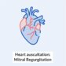
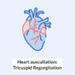
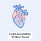
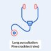
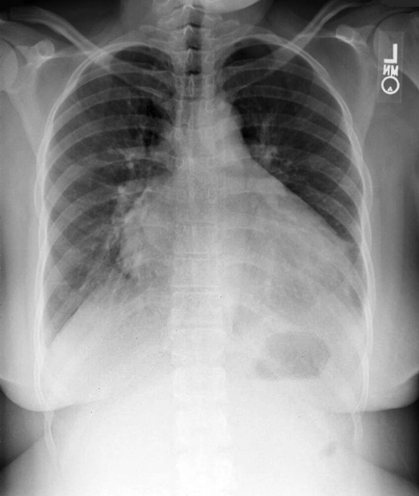
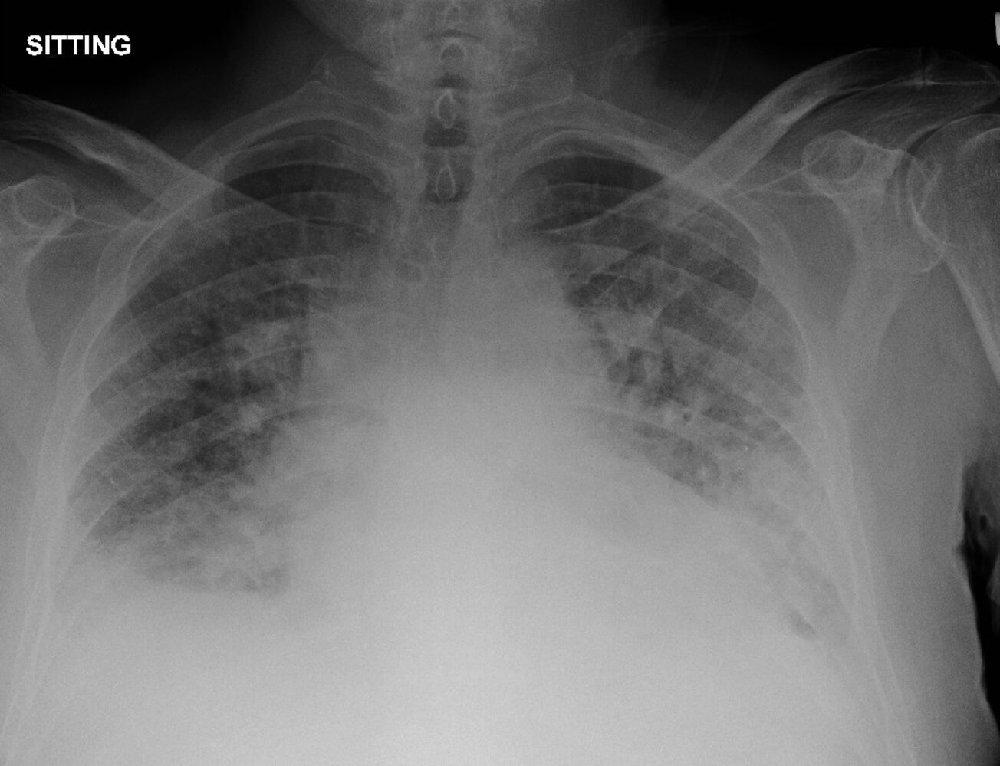
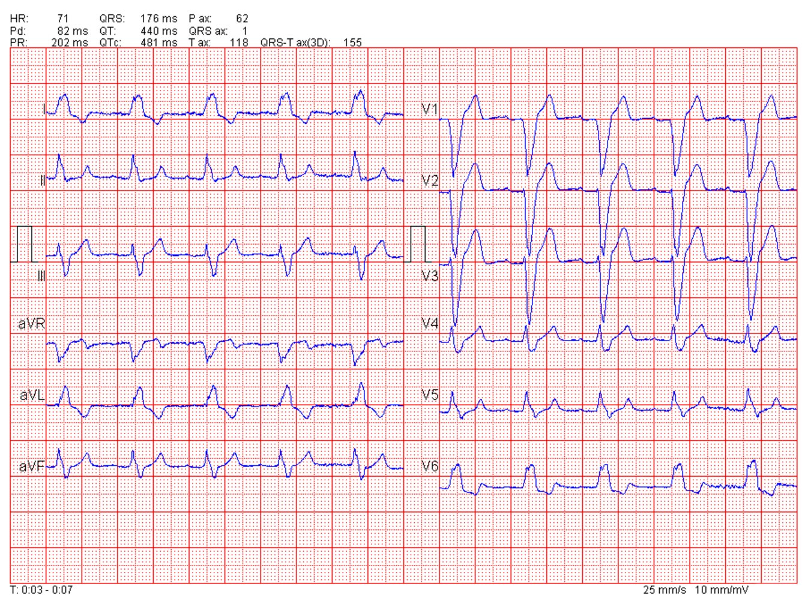
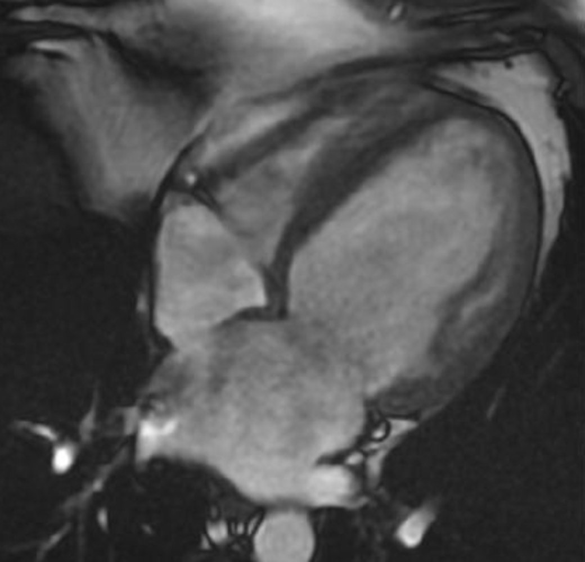
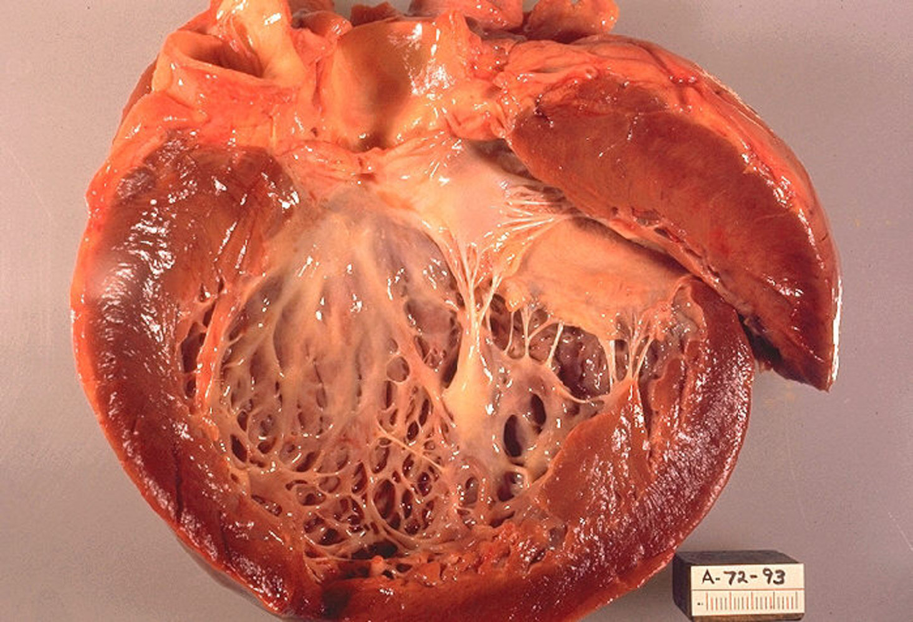
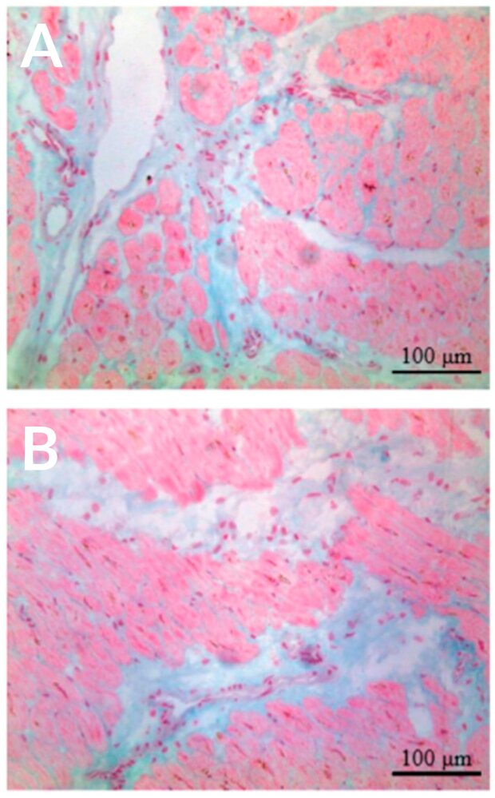

# Dilated cardiomyopathy

*Categories: Clinical knowledge > Emergency medicine > Cardiovascular disorders > Dilated cardiomyopathy*

[Original Article Link](https://coursology-qbank.com/amboss/article/nr073h)

---

## Summary

Dilated <u>cardiomyopathy</u> (DCM) is the occurrence of ventricular dilatation and <u>systolic dysfunction</u> despite normal filling pressures, in the absence of <u>coronary artery disease</u>, abnormal loading pressures (e.g., <u>valvular heart disease</u>, <u>hypertension</u>), or <u>congenital heart disease</u>. It is the most common type of <u>cardiomyopathy</u>. Although most cases are <u>idiopathic</u> or inherited, DCM can also be caused by a number of conditions (e.g., endocrine disorders, autoimmune disease) and infections (e.g., <u>Coxsackie B virus</u>, <u>Chagas disease</u>) and by the use of certain substances (e.g., <u>heavy drinking</u>, <u>cocaine</u>). In DCM, decreased <u>left ventricular contractility</u> leads to <u>left heart failure</u> and eventually <u>right heart failure</u> with decreased ventricular output. Isolated dilation and subsequent decrease in <u>right ventricular</u> contractility is rare. Diagnosis is confirmed with <u>echocardiography</u>. Studies to evaluate the underlying etiology should be guided by clinical suspicion and include <u>laboratory studies</u>, <u>genetic testing</u>, advanced <u>cardiac imaging</u>, and, rarely, <u>endomyocardial biopsy</u>. Management involves treatment of the underlying condition and associated complications, e.g., <u>congestive heart failure</u> and <u>arrhythmias</u>. Severe or refractory disease may be managed with device implantation or <u>cardiac transplantation</u>. <u>First-degree relatives</u> of patients with primary DCM should receive <u>screening for DCM</u>.

Overview of cardiomyopathies

---

## Epidemiology

* <u>Incidence</u>: ∼ 6/100,000 per year (most common <u>cardiomyopathy</u>) [[4]](https://coursology-qbank.com/amboss/article/hb1ct20)[[5]](https://coursology-qbank.com/amboss/article/3b1St20)

* Sex: <u>♂</u> > <u>♀</u> (∼ 1.5:1)  [[6]](https://coursology-qbank.com/amboss/article/Rb1lt20)

* Age at presentation: most commonly between 30 and 40 years of age, but can occur at any age [[3]](https://coursology-qbank.com/amboss/article/qdXCIC)

* Ethnicity: more common in individuals of African descent [[3]](https://coursology-qbank.com/amboss/article/qdXCIC)

Epidemiological data refers to the US, unless otherwise specified.

---

## Etiology

### Primary causes [[2]](https://coursology-qbank.com/amboss/article/1zc27U0)[[7]](https://coursology-qbank.com/amboss/article/FhVgf80)

* <u>Idiopathic</u> [[2]](https://coursology-qbank.com/amboss/article/1zc27U0)

* Familial, caused by mutations in <u>genes</u> such as: 

* <u>Genes</u> that encode components for <u>sarcomeres</u> and <u>desmosomes</u>, e.g.: ;  [[8]](https://coursology-qbank.com/amboss/article/3QXSDB)[[9]](https://coursology-qbank.com/amboss/article/YzcnrU0)

* <u>TTN gene</u>: encodes the intrasarcomeric protein <u>titin</u> (connectin)

* <u>MYH7 gene</u>: encodes the beta-<u>myosin</u> <u>heavy chain</u>

* LMNA <u>gene</u>: encodes <u>protein structure</u> within <u>nuclear membrane</u> [[2]](https://coursology-qbank.com/amboss/article/1zc27U0)[[7]](https://coursology-qbank.com/amboss/article/FhVgf80)

### Secondary causes [[2]](https://coursology-qbank.com/amboss/article/1zc27U0)[[7]](https://coursology-qbank.com/amboss/article/FhVgf80)[[10]](https://coursology-qbank.com/amboss/article/trYXQq)

* Infectious <u>myocarditis</u>

* Most commonly caused by viral infections, such as:

* <u>Coxsackie B virus</u>

* <u>HIV</u>

* <u>Adenovirus</u>

* Herpes <u>viruses</u>

* <u>Influenza A</u> and B <u>viruses</u>

* Other causative pathogens, e.g., bacteria (e.g., <u>Borrelia burgdorferi</u>), <u>protozoa</u> (e.g., <u>Trypanosoma cruzi</u>)

* Substance use

* <u>Alcohol use disorder</u>

* <u>Cocaine</u>

* <u>Amphetamines</u>

* Cardiotoxic medications, e.g., <u>anthracyclines</u>, such as <u>doxorubicin</u> and <u>daunorubicin</u>; <u>AZT</u>; <u>trastuzumab</u>

* Heavy metal exposure, e.g., lead, <u>iron</u>, cobalt, <u>mercury</u>, <u>arsenic</u> [[2]](https://coursology-qbank.com/amboss/article/1zc27U0)[[7]](https://coursology-qbank.com/amboss/article/FhVgf80)

* Infiltrative and autoimmune disorders 

* <u>Systemic lupus erythematosus</u>

* <u>Sarcoidosis</u>

* <u>Vasculitides</u>, e.g., <u>eosinophilic granulomatosis with polyangiitis</u>, <u>polyarteritis nodosa</u>

* <u>Hemochromatosis</u>

* <u>Peripartum cardiomyopathy</u> (can occur in the last trimester or up to 6 months postpartum)

* Chronic <u>tachycardia</u>, e.g., <u>atrial fibrillation</u>

* Chest radiation [[11]](https://coursology-qbank.com/amboss/article/E-c8_U0)

* Endocrinopathies, e.g., <u>pheochromocytoma</u>, <u>acromegaly</u>, <u>hyperthyroidism</u>, <u>hypothyroidism</u>

* Neuromuscular diseases, e.g., <u>myotonic dystrophy</u>, <u>Duchenne muscular dystrophy</u>, <u>Becker muscular dystrophy</u>

* Nutritional deficiencies, e.g., <u>thiamine</u> (<u>wet beriberi</u>), <u>selenium</u>, carnitine, <u>calcium</u> [[12]](https://coursology-qbank.com/amboss/article/m5VVkE0)

> [!NOTE]
> Volume and pressure overload secondary to conditions such as <u>hypertension</u> and <u>valvular heart disease</u> can cause dilation of the <u>myocardium</u>; however, these are not considered forms of DCM, as filling pressures are abnormal. [[2]](https://coursology-qbank.com/amboss/article/1zc27U0)

> [!NOTE]
> To remember some high-yield secondary causes of dilated <u>cardiomyopathy</u>, think ABCCCDD: Alcohol use, Beriberi, Cocaine, Coxsackie B <u>virus</u>, Chagas, Doxorubicin/Daunorubicin

---

## Pathophysiology

* Causative factors decrease the contractility of the <u>myocardium</u> → activation of compensatory mechanisms (<u>Frank-Starling law</u>) to maintain <u>cardiac output</u> → ↑ end-<u>diastolic</u> volume (<u>preload</u>) → <u>myocardial remodeling</u> → eccentric hypertrophy (<u>sarcomeres</u> added in series) and dilation of the ventricle;      → reduced <u>myocardial</u> contractility → <u>systolic dysfunction</u> and ↓ <u>ejection fraction</u> → <u>heart failure</u>

* Decreased LV contractility due to dilation leads to <u>left heart failure</u> and eventually <u>right heart failure</u> (see “<u>Pathophysiology of congestive heart failure</u>”).

Eccentric vs. concentric ventricular hypertrophy

---

## Clinical features

### Symptoms [[2]](https://coursology-qbank.com/amboss/article/1zc27U0)

* Gradual development of symptoms of <u>congestive heart failure</u>

* <u>Dyspnea</u>

* Ankle and abdominal swelling

* <u>Angina pectoris</u>

* Fatigue

* Some patients may present with <u>symptoms of arrhythmia</u>.

### <u>Physical examination</u> [[13]](https://coursology-qbank.com/amboss/article/qb1Cu20)

* Systolic <u>murmur</u> secondary to <u>mitral valve regurgitation</u>;   or <u>tricuspid valve regurgitation</u>   [[14]](https://coursology-qbank.com/amboss/article/sAXtO00)

* <u>S3 gallop</u>

* Displacement of the apex beat

* <u>Jugular venous distention</u>

* Bilateral <u>rales</u>

* <u>Peripheral edema</u>

* <u>Ascites</u>

Mitral Regurgitation (MR) - Heart Auscultation - Episode 4

Tricuspid Regurgitation (TR) - Heart Auscultation - Episode 12

S3 Heart Sound (S3 Gallop) - Heart Auscultation - Episode 9

Fine Crackles (Rales) - Lung Auscultation - Episode 2

Pitting edema of lower leg

---

## Diagnosis

DCM is typically diagnosed during the workup for associated cardiac conditions (e.g., <u>heart failure</u>) or through screening of family members of patients with known or suspected familial DCM. [[15]](https://coursology-qbank.com/amboss/article/bzcHrU0)

### Approach [[10]](https://coursology-qbank.com/amboss/article/trYXQq)[[16]](https://coursology-qbank.com/amboss/article/hQXcDB)

* Confirm the diagnosis on <u>echocardiography</u>.

* Rule out <u>ischemic cardiomyopathy</u> in patients with features of <u>ischemic heart disease</u>: See “<u>Diagnostics for CAD</u>.”

* Assess for complications, e.g., <u>heart failure</u>, <u>arrhythmias</u>. [[9]](https://coursology-qbank.com/amboss/article/YzcnrU0)

* Evaluate for the underlying etiology.

* Strong <u>family history</u> of DCM: Perform <u>genetic testing</u>

* Consider further testing based on clinical suspicion.

* Underlying etiology remains unclear: 

* Consider advanced studies (e.g., <u>cardiac MRI</u> or <u>endomyocardial biopsy</u>).

* Consider <u>evaluation for ischemic heart disease</u> in patients > 35 years of age with DCM of unclear etiology.

* <u>Idiopathic</u> DCM: Refer for <u>genetic counseling</u> and testing to evaluate for a possible genetic etiology.

### <u>Echocardiography</u> [[16]](https://coursology-qbank.com/amboss/article/hQXcDB)

* Indications

* To confirm the diagnosis of suspected DCM

* To screen <u>first-degree relatives</u> of patients with familial DCM  [[2]](https://coursology-qbank.com/amboss/article/1zc27U0)[[10]](https://coursology-qbank.com/amboss/article/trYXQq)[[16]](https://coursology-qbank.com/amboss/article/hQXcDB)

* Characteristic findings

* Ventricular dilation with or without atrial dilation

* Normal ventricular wall thickness [[17]](https://coursology-qbank.com/amboss/article/nyb7fw)

* ↓ <u>Left ventricular ejection fraction</u> (<u>LVEF</u>)

* Wall motion abnormalities may be seen in some underlying etiologies (e.g., <u>muscular dystrophy</u>, acute <u>myocarditis</u>). [[10]](https://coursology-qbank.com/amboss/article/trYXQq)[[16]](https://coursology-qbank.com/amboss/article/hQXcDB)

> [!TIP]
> Offer screening with a <u>physical examination</u>, <u>ECG</u>, and <u>echocardiography</u> (with assessment of <u>left ventricular</u> size and function) to <u>first-degree relatives</u> of patients with familial DCM. [[9]](https://coursology-qbank.com/amboss/article/YzcnrU0)[[16]](https://coursology-qbank.com/amboss/article/hQXcDB)

Dilated cardiomyopathy

### Initial diagnostic workup

#### <u>Laboratory studies</u> [[10]](https://coursology-qbank.com/amboss/article/trYXQq)[[16]](https://coursology-qbank.com/amboss/article/hQXcDB)

* <u>CBC with differential</u>  [[18]](https://coursology-qbank.com/amboss/article/Xzc9rU0)

* <u>Basic metabolic panel</u>

* <u>Liver chemistries</u>

* <u>TSH</u>

* <u>HIV testing</u>

* <u>Ferritin</u>, <u>transferrin saturation</u>

* <u>Diagnostics for congestive heart failure</u>: in patients with concomitant <u>heart failure</u>  [[16]](https://coursology-qbank.com/amboss/article/hQXcDB)[[19]](https://coursology-qbank.com/amboss/article/2pYTKJ)

* Additional studies as needed for the underlying etiology as guided by clinical evaluation, such as:

* <u>Urine toxicology screen</u> for suspected substance use

* <u>Inflammatory markers</u> to detect autoimmune disease or <u>myocarditis</u>  [[10]](https://coursology-qbank.com/amboss/article/trYXQq)

* Specific <u>serologies</u> (e.g., for <u>Lyme disease</u>, <u>Chagas disease</u>)

#### <u>Chest x-ray</u>

* Indications: to assess for complications and the underlying etiology [[19]](https://coursology-qbank.com/amboss/article/2pYTKJ)

* Possible findings include:

* <u>Cardiomegaly</u>: left-sided enlargement with a balloon appearance

* Radiographic <u>features of pulmonary edema</u> secondary to <u>decompensated heart failure</u>

* Findings of underlying disease, e.g., hilar <u>lymphadenopathy</u> in <u>sarcoidosis</u> [[10]](https://coursology-qbank.com/amboss/article/trYXQq)

Cardiac silhouette enlargement

Cardiogenic pulmonary edema

#### <u>ECG</u> [[10]](https://coursology-qbank.com/amboss/article/trYXQq)[[20]](https://coursology-qbank.com/amboss/article/WzcP7U0)

* Indications

* To assess for complications (e.g., <u>AV block</u>)

* To rule out <u>tachycardia-induced cardiomyopathy</u>

* Possible findings include  [[2]](https://coursology-qbank.com/amboss/article/1zc27U0)[[10]](https://coursology-qbank.com/amboss/article/trYXQq)

* Conduction disorders (e.g., <u>AV block</u>, <u>LBBB</u>)

* <u>Atrial fibrillation</u>, other <u>tachyarrhythmias</u>

* Reduced QRS <u>voltage</u>

* <u>ST-segment</u> and <u>T-wave</u> abnormalities (e.g., <u>T-wave inversions</u>)

Third-degree atrioventricular block (complete heart block)

Left bundle branch block

Atrial fibrillation

#### <u>Holter monitoring</u>

* Indications [[16]](https://coursology-qbank.com/amboss/article/hQXcDB)

* <u>Arrhythmia symptoms</u>

* Abnormal <u>ECG</u>

* <u>Cardiomegaly</u> on <u>chest x-ray</u>

* Possible findings include: [[2]](https://coursology-qbank.com/amboss/article/1zc27U0)

* <u>Sinus tachycardia</u>

* <u>Supraventricular arrhythmias</u>

* <u>Premature ventricular contractions</u>

* <u>Nonsustained ventricular tachycardia</u>

### <u>Genetic testing</u> [[16]](https://coursology-qbank.com/amboss/article/hQXcDB)

* Recommended in:

* Patients with suspected familial or <u>idiopathic</u> DCM

* Family members of patients with DCM and an associated genetic mutation

* Consider in patients with DCM and any of the following: [[10]](https://coursology-qbank.com/amboss/article/trYXQq)

* <u>AV block</u> on <u>ECG</u>

* Elevations in:

* <u>Ferritin</u> and/or <u>transferrin saturation</u>

* <u>Creatine kinase</u> or <u>cardiac biomarkers</u>

* Symptoms of neuromuscular disorders

> [!TIP]
> Refer patients for <u>genetic counseling</u> prior to ordering <u>genetic testing</u> for DCM. [[9]](https://coursology-qbank.com/amboss/article/YzcnrU0)

### Advanced studies [[10]](https://coursology-qbank.com/amboss/article/trYXQq)[[16]](https://coursology-qbank.com/amboss/article/hQXcDB)

#### <u>Cardiac MRI</u>

* Indications

* Suspected infiltrative DCM (e.g., due to <u>hemochromatosis</u>, <u>amyloid</u>)

* DCM of unclear etiology after the initial evaluation

* Evaluation of cardiac function and morphology

* Findings

* <u>Myocardial</u> <u>edema</u>: in active <u>myocarditis</u> and <u>sarcoidosis</u> [[10]](https://coursology-qbank.com/amboss/article/trYXQq)

* Disease-specific pattern of <u>gadolinium</u> <u>enhancement</u>: e.g., in <u>muscular dystrophy</u>, <u>sarcoidosis</u>, <u>Chagas disease</u> [[10]](https://coursology-qbank.com/amboss/article/trYXQq)

Dilated cardiomyopathy

#### <u>Endomyocardial biopsy</u>

* Indication: suspected underlying etiology that requires specific management (e.g., <u>amyloidosis</u>) and cannot be confirmed by other diagnostic methods

* Findings vary based on the underlying etiology.

---

## Pathology

* <u>Interstitial</u> <u>fibrosis</u> [[21]](https://coursology-qbank.com/amboss/article/Ib1YE20)

* Altered <u>cardiomyocyte</u> appearance [[2]](https://coursology-qbank.com/amboss/article/1zc27U0)

* Cell <u>hypertrophy</u>

* <u>Vacuole</u> formation

* Loss of <u>myofibrils</u>

* <u>Nuclear atypia</u>

Dilated cardiomyopathy

Dilated cardiomyopathy

---

## Treatment

### Overview [[10]](https://coursology-qbank.com/amboss/article/trYXQq)[[16]](https://coursology-qbank.com/amboss/article/hQXcDB)

* Treat the underlying cause of DCM: e.g., ; manage endocrine abnormalities, encourage abstinence from <u>alcohol</u>.

* Avoid cardiotoxic agents, if possible.

* <u>Treat congestive heart failure</u>, if present.

* In severe or refractory disease, consider:

* <u>AICD</u> with or without <u>cardiac resynchronization therapy</u>

* <u>Left ventricular assist devices</u>

* <u>Heart transplantation</u>

### Management of the underlying etiology [[16]](https://coursology-qbank.com/amboss/article/hQXcDB)

|  Management of underlying disease in dilated <u>cardiomyopathy</u> [[16]](https://coursology-qbank.com/amboss/article/hQXcDB)  |  |  |
| --- | --- | --- |
|  |  | Treatment |
| <u>Substance use disorder</u> |  |   * Encourage complete abstinence from the causative substance (e.g., <u>alcohol</u>, <u>cocaine</u>, stimulants).  * See “<u>Counseling on substance use disorders</u>.”    |
| Endocrine disorders | <u>Hyperthyroidism</u> |   * Start <u>β blockers</u>; aim to normalize the <u>heart rate</u>.  * Initiate <u>definitive treatment for hyperthyroidism</u>.    |
| <u>Hypothyroidism</u> |   * Start <u>levothyroxine replacement</u>.  * For older patients and those with known or suspected <u>CAD</u>:  [[16]](https://coursology-qbank.com/amboss/article/hQXcDB)  * Start <u>thyroid hormone</u> replacement at 25–50% of the expected required dose.  * Titrate up as tolerated every 6–8 weeks.    |  |
| <u>Acromegaly</u> |   * Start <u>somatostatin analogues</u> or refer for <u>surgery</u> (e.g., <u>transsphenoidal adenomectomy</u>).  * See “<u>Treatment of acromegaly</u>.”    |  |
| Infections | <u>Myocarditis</u> |   * <u>Management of myocarditis</u> is primarily supportive.  * Patients with <u>giant cell myocarditis</u>: Start <u>immunosuppressants</u>.  [[22]](https://coursology-qbank.com/amboss/article/Xc19af0)    |
| <u>HIV</u> |  * Start <u>antiretroviral therapy</u>.   |  |
| <u>Chagas disease</u> |   * Give antitrypanosomal therapy (e.g., <u>benznidazole</u>, <u>nifurtimox</u>).  * See “<u>Treatment of Chagas disease</u>.”    |  |
| <u>Chemotherapy</u>-related <u>cardiomyopathy</u> |  |   * All patients: Monitor cardiac function before, during, and after treatment with <u>cardiotoxic chemotherapy</u> agents.  * For patients undergoing <u>anthracycline</u>-based <u>chemotherapy</u>, consider:  * Selecting less cardiotoxic derivatives (e.g., epirubicin or <u>idarubicin</u>)  * Using cardioprotective agents (e.g., <u>dexrazoxane</u>)  * For patients with cardiac damage: Weigh the risks and benefits of continued treatment with cardiotoxic agents.    |
| <u>Peripartum cardiomyopathy</u> |  |   * Initiate <u>multidisciplinary care</u>, involving cardiology, obstetrics, neonatology, and intensive care.  * Be aware of restrictions when <u>using heart failure medications during pregnancy and lactation</u>.  * See “<u>Treatment of peripartum cardiomyopathy</u>.”    |
| Autoimmune diseases |  |   * Start <u>immunosuppressants</u> to manage the underlying disease.  * For <u>lupus</u> <u>myocarditis</u>: Initiate high-dose <u>corticosteroids</u>.    |

> [!WARNING]
> Avoid <u>immunosuppressants</u> with potential cardiotoxicity (e.g., <u>etanercept</u>, <u>infliximab</u>) in patients with DCM. [[16]](https://coursology-qbank.com/amboss/article/hQXcDB)

### Management of complications

* <u>Congestive heart failure</u> [[19]](https://coursology-qbank.com/amboss/article/2pYTKJ)[[23]](https://coursology-qbank.com/amboss/article/2-cT9U0)

* Treat patients with DCM and <u>heart failure</u> with <u>guideline-directed medical therapy</u>. [[16]](https://coursology-qbank.com/amboss/article/hQXcDB)

* Nonpharmacological measures include <u>sodium</u> restriction, <u>smoking cessation</u>, restriction of <u>alcohol</u> consumption, and exercise (if able). [[19]](https://coursology-qbank.com/amboss/article/2pYTKJ)

* <u>Arrhythmias</u>: Management does not differ from standard best practice.  [[24]](https://coursology-qbank.com/amboss/article/xUXE2x)

* See “Treatment of <u>atrial fibrillation</u>.”

* See “<u>Management of AV block</u>.”

* <u>Secondary mitral regurgitation</u>: Consider <u>mitral valve</u> <u>surgery</u>. [[25]](https://coursology-qbank.com/amboss/article/-FXDk-)

* <u>Thromboembolic events</u>: anticoagulation [[26]](https://coursology-qbank.com/amboss/article/f-ck9U0)

* Indications: <u>mechanical valves</u>, intraventricular <u>thrombus</u>, and/or <u>atrial fibrillation</u>

* Agents: <u>warfarin</u>, <u>direct oral anticoagulants</u>, heparins

* The choice of <u>anticoagulant</u> and dosage vary based on the indication; for example dosages, see “<u>Anticoagulation in atrial fibrillation</u>.”

### Severe or refractory DCM [[19]](https://coursology-qbank.com/amboss/article/2pYTKJ)[[23]](https://coursology-qbank.com/amboss/article/2-cT9U0)

* Consider device implantation in selected patients with persistently low <u>LVEF</u> on optimized medical therapy.

* If symptomatic with <u>LVEF</u> ≤ 35%: <u>AICD</u> (to prevent <u>sudden cardiac death</u> due to <u>ventricular fibrillation</u>)

* If symptomatic with <u>LVEF</u> ≤ 35%, <u>sinus rhythm</u>, and QRS > 150 ms: <u>cardiac resynchronization therapy</u> (to improve contractility)

* See “Invasive interventions” in “<u>Treatment of heart failure</u>” for additional eligibility criteria.

* DCM refractory to medical therapy and device implantation: Consider <u>heart</u> <u>cardiac transplantation</u>.

* <u>Left ventricular assist devices</u> can be considered as:

* A <u>bridge to transplant</u>

* An alternative therapy for refractory DCM in patients who are ineligible for transplant

> [!TIP]
> DCM is the leading indication for <u>heart transplantation</u>. [[27]](https://coursology-qbank.com/amboss/article/gjXF-B)

---

## Complications

* <u>Heart failure</u>

* <u>Thromboembolism</u> (e.g., <u>stroke</u>, <u>pulmonary embolism</u>, <u>acute mesenteric ischemia</u>)

* <u>Arrhythmias</u> (e.g., <u>atrial fibrillation</u>, <u>ventricular tachycardia</u>, <u>ventricular fibrillation</u>)

* <u>Sudden cardiac death</u>

We list the most important complications. The selection is not exhaustive.

---