# Hypertrophic cardiomyopathy

*Categories: Clinical knowledge > Emergency medicine > Cardiovascular disorders > Hypertrophic cardiomyopathy*

[Original Article Link](https://coursology-qbank.com/amboss/article/qr0CRh)

---

## Summary

<u>Hypertrophic</u> <u>cardiomyopathy</u> (HCM) is the most common hereditary <u>heart</u> disease. HCM is characterized by unexplained <u>hypertrophy</u> of the <u>left ventricle</u> (LV) that leads to <u>diastolic dysfunction</u>. It is a leading cause of <u>sudden cardiac death</u> (<u>SCD</u>) in young athletes. While many patients are asymptomatic, common symptoms include <u>exertional dyspnea</u> and <u>syncope</u>, which are often exacerbated by exercise. <u>Physical examination</u> may reveal a <u>systolic ejection</u> <u>murmur</u> that increases with maneuvers that decrease <u>preload</u> (e.g., the <u>Valsalva maneuver</u>) and an <u>S4 gallop</u>. Diagnosis is confirmed with <u>echocardiography</u>, which typically shows an asymmetrically thickened LV wall, particularly the septum. Management consists of <u>SCD</u> prevention in high-risk individuals, and pharmacological treatment, e.g., <u>beta blockers</u>, <u>nondihydropyridine calcium channel blockers</u> (<u>CCBs</u>), which is indicated only for symptomatic patients. Invasive management, including septal reduction therapy, may be required for refractory obstructive HCM. It is crucial to avoid medications that reduce <u>preload</u> or <u>afterload</u>, such as <u>nitrates</u> and <u>ACE inhibitors</u>, in patients with obstructive HCM, as they can worsen the obstruction. <u>First-degree relatives</u> of patients with HCM should receive <u>screening for HCM</u>.

---

## Epidemiology

* Second most common <u>cardiomyopathy</u>

* <u>♂</u> = <u>♀</u>  [[1]](https://coursology-qbank.com/amboss/article/zDdrSH0)[[2]](https://coursology-qbank.com/amboss/article/B-dzzs0)

* Two types are distinguished: [[3]](https://coursology-qbank.com/amboss/article/L7Ywmq)

* Obstructive type, i.e., <u>hypertrophic</u> obstructive <u>cardiomyopathy</u> (<u>HOCM</u>): ∼ 70% of cases

* Nonobstructive type: ∼ 30% of cases

* One of the most frequent causes of <u>sudden cardiac death</u> in young patients, especially young athletes [[1]](https://coursology-qbank.com/amboss/article/zDdrSH0)

Epidemiological data refers to the US, unless otherwise specified.

---

## Etiology

* HCM is a genetic condition characterized by otherwise unexplained <u>left ventricular hypertrophy</u>. ;  [[3]](https://coursology-qbank.com/amboss/article/L7Ywmq)[[4]](https://coursology-qbank.com/amboss/article/V90GmR)

* Most common hereditary <u>heart</u> disease

* <u>Autosomal dominant</u> inheritance with varying <u>penetrance</u>

* Most commonly caused by mutations of the <u>sarcomeric</u> protein <u>genes</u> (e.g., <u>myosin</u> <u>heavy chain</u>, <u>myosin</u> binding <u>protein C</u>) → disorganization of <u>myocyte</u> architecture characterized by myofibrillar disarray and <u>fibrosis</u>  

* MYH7 gene: <u>gene</u> on the long arm of <u>chromosome</u> 14 that codes for the beta-<u>myosin</u> <u>heavy chain</u>, which forms a part of type II <u>myosin</u> in skeletal and <u>cardiac muscle cells</u>

* MYBPC3 gene: <u>gene</u> on the short arm of <u>chromosome</u> 11 that codes for cardiac <u>myosin</u> binding <u>protein C</u>, which prevents the breakdown of <u>thick filaments</u> in cardiac <u>sarcomeres</u>

* Less commonly due to a mutation in cardiac <u>sarcomeric</u> <u>proteins</u> such as <u>troponin</u> and <u>tropomyosin</u>

* Other conditions that are associated with left-ventricular <u>hypertrophy</u> include the following:

* Chronic <u>hypertension</u> (most common cause of <u>left ventricular hypertrophy</u>)

* <u>Aortic stenosis</u>

* <u>Friedreich ataxia</u>, <u>Fabry disease</u>, <u>Noonan syndrome</u>

* <u>Amyloidosis</u>

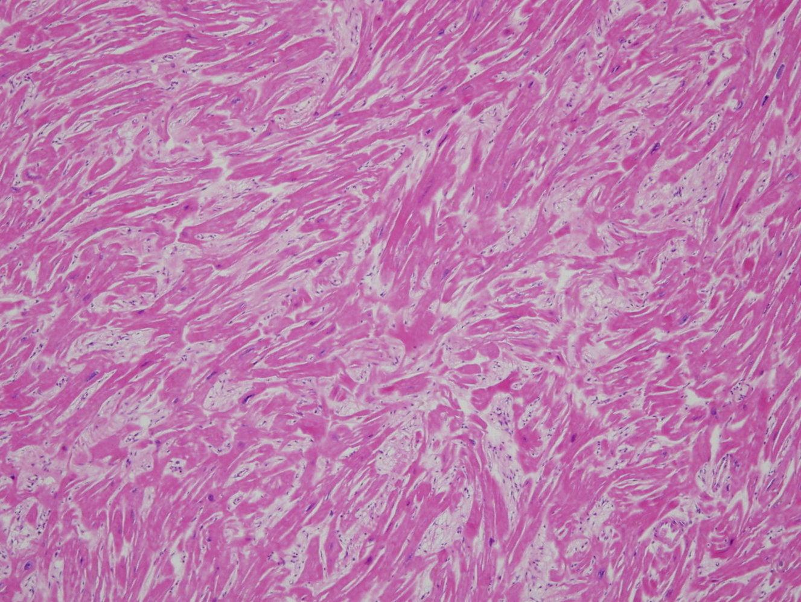

Myofibrillar disarray

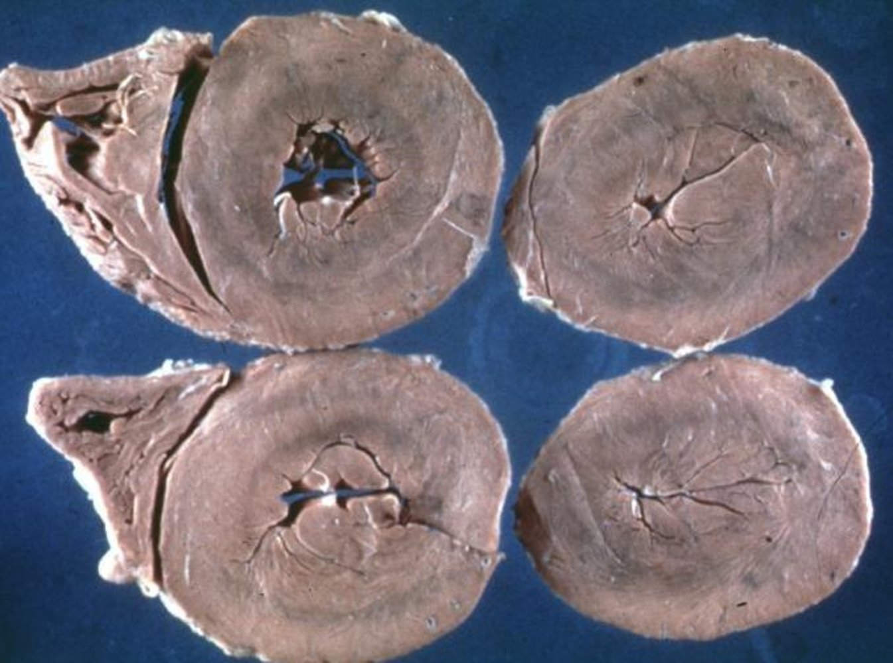

Concentric hypertrophic cardiomyopathy

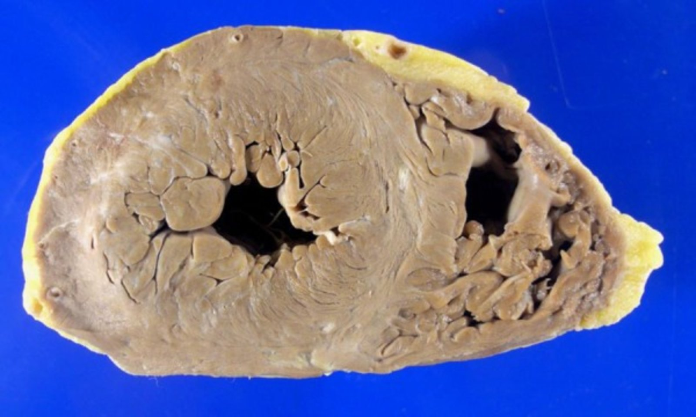

Hypertrophic cardiomyopathy

---

## Pathophysiology

HCM is characterized by <u>hypertrophy</u> of the <u>left ventricle</u>;  ; most commonly occurs with asymmetrical septal involvement, which leads to <u>diastolic dysfunction</u> (impaired <u>left ventricular</u> relaxation and filling) → reduced systolic output volume → reduced peripheral and <u>myocardial</u> <u>perfusion</u>.;   → <u>cardiac arrhythmia</u> and/or <u>heart failure</u> and increased risk of <u>sudden cardiac death</u> [[5]](https://coursology-qbank.com/amboss/article/DrY1jq)

### Nonobstructive and obstructive HCM [[6]](https://coursology-qbank.com/amboss/article/e6bxPu)

* Typical features include:

* Increased LV wall thickness with septal predominance , no dilation of <u>left ventricle</u>

* Myofibrillar disarray, <u>interstitial</u> <u>fibrosis</u>, and <u>myocyte</u> <u>hypertrophy</u>

* Concentric hypertrophy: a form of <u>cardiac remodeling</u> characterized by parallel duplication of <u>sarcomeres</u> that leads to thickening of the ventricular wall   

* In <u>HOCM</u>, <u>concentric hypertrophy</u> is caused by genetic mutations (see “Etiology”).

* <u>Concentric hypertrophy</u> can also occur secondary to the following diseases, then potentially mimicking HCM: 

* <u>Hypertension</u> and <u>aortic valve stenosis</u>;  (due to chronic pressure and <u>volume overload</u>): Chronic <u>hypertension</u> → increased <u>afterload</u> → increased <u>myocardial</u> wall tension → changes in <u>myocardial</u> <u>gene</u> expression → <u>sarcomeres</u> laid down in parallel → increased <u>left ventricular</u> thickness → decreased <u>left ventricular</u> size → <u>diastolic dysfunction</u>

* Storage disorders (e.g., <u>Fabry disease</u>, <u>amyloidosis</u>) and hereditary syndromes;  (e.g., <u>Friedreich ataxia</u>, <u>Noonan syndrome</u>)

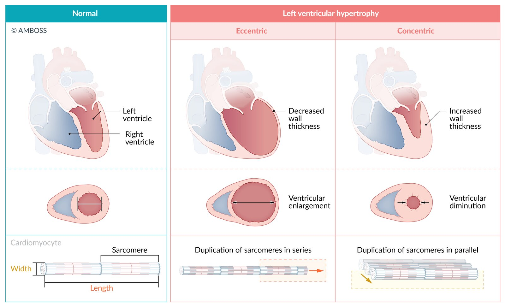

Eccentric vs. concentric ventricular hypertrophy

### <u>HOCM</u> [[5]](https://coursology-qbank.com/amboss/article/DrY1jq)[[7]](https://coursology-qbank.com/amboss/article/W90PmR)

* Pathomechanism: <u>LVOT obstruction</u> → increased LV systolic pressure → prolongation of ventricular relaxation → increased LV <u>diastolic</u> pressure → exacerbation of HCM with further reduction of <u>cardiac output</u>

* Mechanisms of obstruction

* Systolic anterior motion (<u>SAM</u>) of the <u>mitral valve</u>, results in mitral-septal contact during mid-to-late <u>systole</u> ; caused by either or both:

* Venturi effect: accelerated blood flow through ventricular outflow tract creates negative pressure that pulls the <u>mitral valve</u> towards the septum → increased outflow tract obstruction

* Ejection against an elongated and distorted <u>mitral valve</u>;  causes leaflets to get pulled into the outflow tract → potential <u>secondary mitral regurgitation</u>

* Muscular obstruction

* Encroachment of the <u>LVOT</u> by the <u>hypertrophic</u> septum

* <u>Hypertrophy</u>  or anomalous insertion  of <u>papillary</u> muscles → increased <u>left ventricular</u> apical pressure → ↑ risk for development of apical <u>ventricular aneurysms</u>

* <u>LVOT obstruction</u> is dynamic 

* The following factors can increase the degree of obstruction: ↑ LV contractility, ↓ <u>preload</u>, and ↓ <u>afterload</u>

* Clinically exacerbating factors 

* Physical exercise/<u>stress</u>

* <u>Dehydration</u>

* Pharmacologic provocation (e.g., <u>diuretics</u>, <u>ACEIs</u>/<u>ARBs</u>, <u>digoxin</u>, <u>hydralazine</u>)

* <u>Valsalva maneuver</u> (strain phase)

Hypertrophic cardiomyopathy

---

## Clinical features

### Clinical features [[1]](https://coursology-qbank.com/amboss/article/zDdrSH0)

HCM is frequently asymptomatic; , especially if nonobstructive. The following features may be present:

* <u>Exertional dyspnea</u>

* <u>Angina</u> pectoris

* <u>Syncope</u>, <u>dizziness</u>, <u>lightheadedness</u>

* <u>Palpitations</u>, <u>cardiac arrhythmias</u>

* <u>Sudden cardiac death</u> (particularly during or after intense physical activity)

* Symptoms of HCM may worsen with exercise, <u>dehydration</u>, and certain medications (e.g., <u>diuretics</u>, <u>hydralazine</u>, <u>ACEIs</u>, <u>ARBs</u>, <u>digoxin</u>). [[1]](https://coursology-qbank.com/amboss/article/zDdrSH0)

### <u>Physical examination</u> [[1]](https://coursology-qbank.com/amboss/article/zDdrSH0)

* <u>Systolic ejection</u> <u>murmur</u> (crescendo-decrescendo):  

* Cause: subvalvular dynamic <u>LVOT obstruction</u> due to asymmetrically thickened <u>myocardium</u>

* Location: best heard at the cardiac apex or the left lower sternal border and <u>Erb's point (cardiology)</u>

* Radiation: to the <u>axilla</u> if there is concomitant <u>mitral regurgitation</u>; no radiation to the neck

* Response to maneuvers and medications (see “Maneuvers and their effects on <u>murmurs</u>") 

* Increases with <u>Valsalva maneuver</u>, standing, <u>inotropic</u> medications (e.g., <u>digitalis</u>).

* Decreases with:

* Hand grip, squatting, or passive leg elevation

* Drugs that decrease cardiac contractility (e.g., <u>beta blockers</u>)

* <u>S4 gallop</u>

* Possible <u>holosystolic murmur</u> from <u>mitral regurgitation</u>

* Sustained apex beat

* Paradoxical split of <u>S2</u>

* Pulsus bisferiens: LV outflow obstruction causes a sudden quick rise of the <u>pulse</u> followed by a slower longer rise (<u>biphasic pulse</u>).

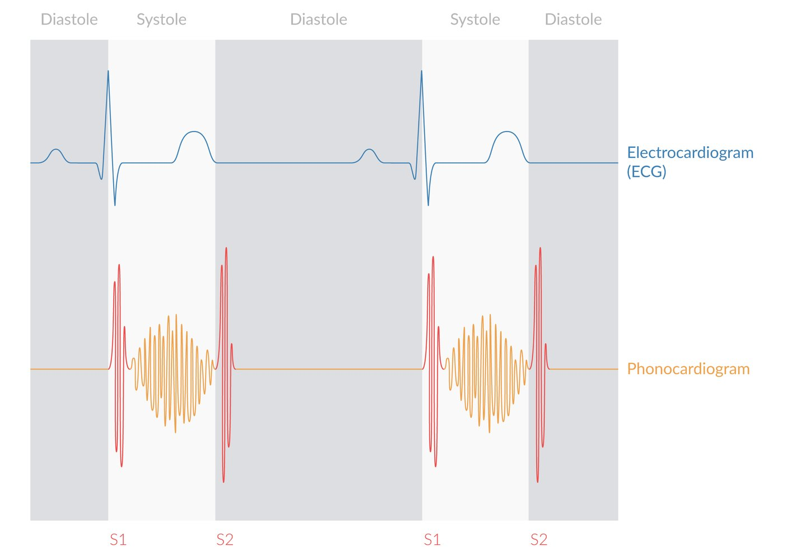

Heart murmur in hypertrophic obstructive cardiomyopathy, aortic stenosis, and pulmonary stenosis

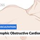

Hypertrophic Obstructive Cardiomyopathy (HOCM) - Heart Auscultation - Episode 5

> [!WARNING]
> <u>HOCM</u> is a common cause of <u>sudden cardiac death</u> in young patients.

---

## Diagnosis

<u>Transthoracic echocardiography</u> (<u>TTE</u>) with Doppler is the primary imaging modality in most patients. Additional studies (e.g., <u>ECG</u>, <u>cardiac MRI</u>, exercise testing, and screening for <u>CAD</u> or genetic diseases) can be done on a case-by-case basis. [[1]](https://coursology-qbank.com/amboss/article/zDdrSH0)[[8]](https://coursology-qbank.com/amboss/article/00VeeG0)

### Diagnostic criteria [[1]](https://coursology-qbank.com/amboss/article/zDdrSH0)

Both criteria must be met to make the diagnosis:

1. * LV nondilated <u>hypertrophy</u> (usually ≥ 15 mm in adults)
2. * Absence of other cardiac or systemic diseases that could explain <u>hypertrophy</u> (e.g., long-standing <u>hypertension</u> or <u>aortic stenosis</u>)

### <u>Transthoracic echocardiography</u> with Doppler [[1]](https://coursology-qbank.com/amboss/article/zDdrSH0)[[8]](https://coursology-qbank.com/amboss/article/00VeeG0)

* Indications 

* Initial assessment for suspected HCM

* Repeat testing in patients with a new cardiovascular event or change in clinical status

* Findings  

* Wall thickness

* Asymmetrically thickened LV wall,;  (≥ 15 mm), typically involving the septum   [[1]](https://coursology-qbank.com/amboss/article/zDdrSH0)

* LV wall thickness ≥ 30 mm is associated with a high risk of <u>SCD</u>. [[1]](https://coursology-qbank.com/amboss/article/zDdrSH0)

* Outflow tract abnormalities

* <u>Systolic anterior motion of the mitral valve</u>

* <u>Mitral regurgitation</u>

* ↑ <u>LVOT</u> pressure gradient via Doppler <u>echocardiography</u>

* Other findings 

* <u>Left atrial enlargement</u>  [[9]](https://coursology-qbank.com/amboss/article/o7Y05q)

* Systolic function typically normal

* <u>Diastolic dysfunction</u>

* Findings more specific to <u>HOCM</u> [[1]](https://coursology-qbank.com/amboss/article/zDdrSH0)

* Asymmetrically thickened interventricular septum

* Dynamic <u>LVOT obstruction</u> due to contact between the septum and <u>mitral valve</u> during <u>systole</u>

* Obstruction is considered present if peak <u>LVOT</u> gradient is ≥ 30 mm Hg. [[1]](https://coursology-qbank.com/amboss/article/zDdrSH0)

* Hemodynamically significant obstruction is considered if <u>LVOT</u> pressure gradient is ≥ 50 mm Hg.[[1]](https://coursology-qbank.com/amboss/article/zDdrSH0)

Hypertrophic cardiomyopathy

> [!TIP]
> Asymmetrical septal thickening, dynamic <u>LVOT obstruction</u> by the <u>mitral valve</u> during <u>systole</u>, and <u>LVOT</u> pressure gradient ≥ 30 mm Hg are findings more specific for <u>HOCM</u>.[[1]](https://coursology-qbank.com/amboss/article/zDdrSH0)

### ECG findings in HCM  [[1]](https://coursology-qbank.com/amboss/article/zDdrSH0)[[10]](https://coursology-qbank.com/amboss/article/MXbMAH)

* Indication: all patients with suspected HCM

* Classic findings: commonly seen in HCM

* <u>ECG signs of LVH</u> (see <u>Sokolow-Lyon criteria</u>)

* Deep <u>Q waves</u>, particularly in the inferior (II, III, and <u>aVF</u>) and <u>lateral</u> (I, aVL, V4–6) leads

* Giant <u>inverted T waves</u> in the <u>precordial leads</u>  [[10]](https://coursology-qbank.com/amboss/article/MXbMAH)

* Other supportive findings

* Nonspecific <u>ST segment</u> and <u>T-wave</u> changes

* <u>P wave</u> changes indicating <u>left atrial enlargement</u> (e.g., <u>P mitrale</u>)

* <u>LBBB</u>

* Associated <u>arrhythmias</u>: <u>ventricular tachycardia</u>, <u>atrial fibrillation</u>, or <u>atrial flutter</u>

> [!WARNING]
> A normal <u>ECG</u> in patients with HCM is rare (5–25% of cases) and should prompt further evaluation . [[1]](https://coursology-qbank.com/amboss/article/zDdrSH0)

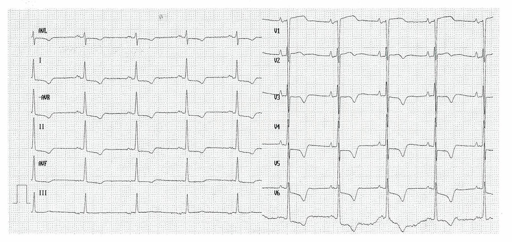

ECG in left ventricular hypertrophy

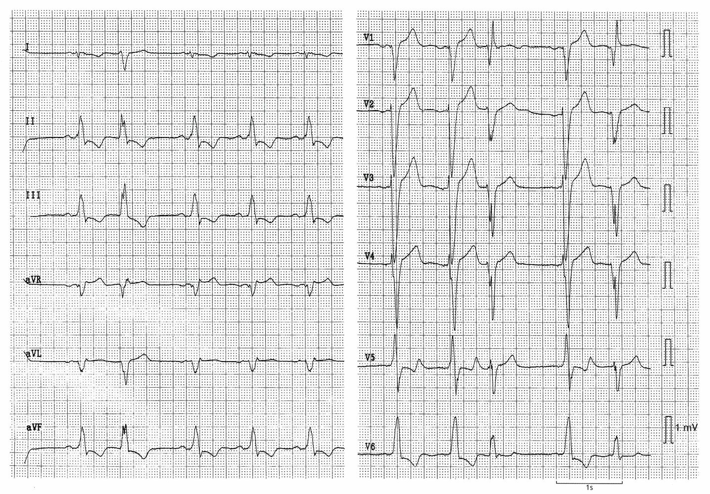

Left ventricular hypertrophy and left bundle branch block

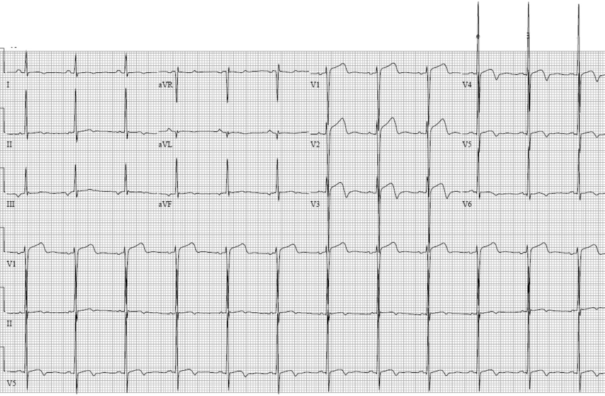

Left ventricular hypertrophy

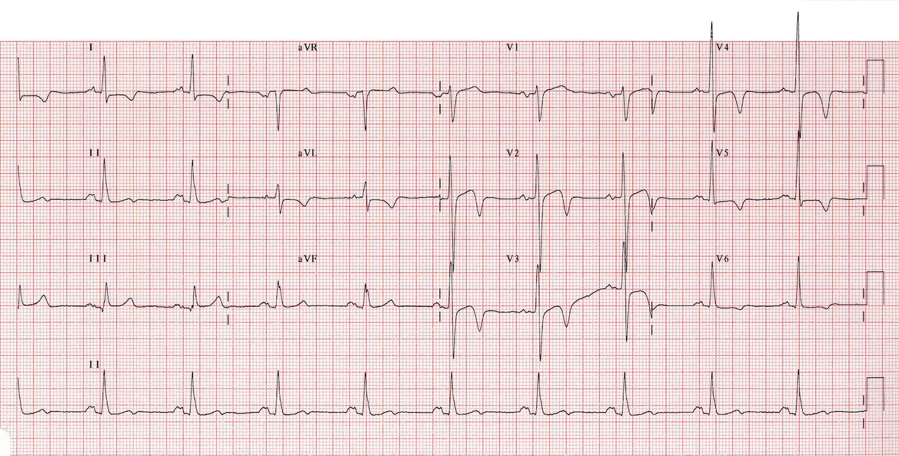

Hypertrophic cardiomyopathy

### <u>Chest x-ray</u>

* Indication: considered for patients presenting with <u>dyspnea</u> or <u>chest pain</u> of unknown etiology

* Findings

* The <u>cardiac silhouette</u> can be normal or enlarged.

* <u>Left atrial enlargement</u> is commonly seen in <u>mitral regurgitation</u>.

* Signs of <u>pulmonary congestion</u> (e.g., <u>CXR findings in pulmonary edema</u>) may be present in severe <u>CHF</u>.

### Exercise testing [[1]](https://coursology-qbank.com/amboss/article/zDdrSH0)

Provocation tests (e.g., exercise testing) are obligatory if no obstruction is discernible at rest.

* <u>Stress echocardiography</u> [[1]](https://coursology-qbank.com/amboss/article/zDdrSH0)

* Indications: to confirm and quantify dynamic <u>LVOT obstruction</u> if inconclusive <u>TTE</u>

* Findings: <u>LVOT obstruction</u> and/or <u>mitral regurgitation</u>

* <u>Cardiac exercise stress test</u> [[1]](https://coursology-qbank.com/amboss/article/zDdrSH0)

* Indications  

* Assessment of functional capacity and response to therapy

* Addition of <u>ECG</u> and blood pressure monitoring for <u>SCD</u> risk <u>stratification</u>

* Findings

* Development of symptoms (e.g., <u>dyspnea</u>, <u>palpitations</u>)

* Blood pressure monitoring: <u>hypotension</u>

* <u>ECG</u>: <u>arrhythmias</u> and/or signs of <u>ischemia</u> (e.g., <u>ECG changes in STEMI</u>, <u>ECG</u> changes in <u>NSTEMI</u>/UA)

### <u>Cardiac MRI</u> (<u>cMRI</u>) [[1]](https://coursology-qbank.com/amboss/article/zDdrSH0)[[8]](https://coursology-qbank.com/amboss/article/00VeeG0)

* Indications

* Evaluation of ventricular morphology  if <u>echocardiographic</u> findings are inconclusive

* Patients with known HCM and additional findings in <u>MRI</u>  may require a change in management approach.

* Consider if risk <u>stratification</u> for <u>SCD</u> is inconclusive.

* Evaluation of alternative diagnoses

* Advantages

* Better visualization of segmental <u>LVH</u> located in the anterolateral wall or apex compared to <u>echocardiography</u>

* Better detection of apical <u>aneurysms</u> compared to <u>echocardiography</u>

* Identification of <u>myocardial</u> <u>fibrosis</u> with <u>late gadolinium enhancement</u> (<u>LGE</u>)

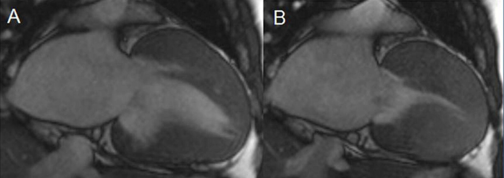

Symmetric hypertrophic cardiomyopathy

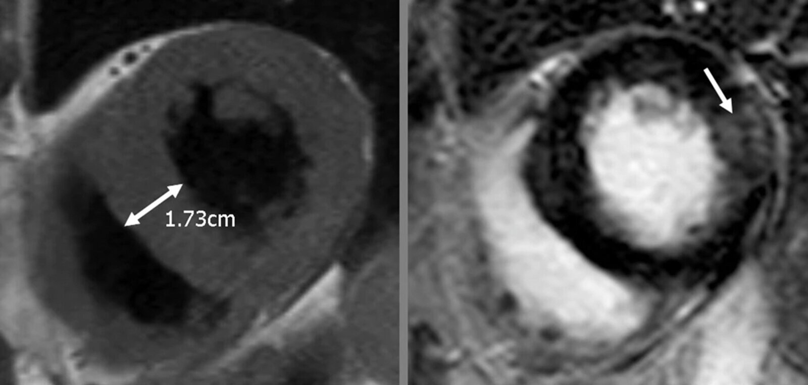

Hypertrophic cardiomyopathy

### Additional studies [[1]](https://coursology-qbank.com/amboss/article/zDdrSH0)

* <u>Genetic testing</u>: All patients should be assessed and receive <u>genetic counseling</u>. 

* Indications for <u>genetic testing</u> 

* Considered in <u>index patients</u> to identify first-degree family members who may be at risk of HCM

* <u>Index patients</u> with an atypical presentation or for whom another genetic cause is suspected

* Patients who undergo <u>genetic testing</u> should receive counseling from a knowledgeable professional with expertise in genetic cardiovascular diseases. [[7]](https://coursology-qbank.com/amboss/article/W90PmR)[[11]](https://coursology-qbank.com/amboss/article/wXbhZs)

* Assessment for <u>coronary artery disease</u> [[1]](https://coursology-qbank.com/amboss/article/zDdrSH0)

* Indicated for patients with chest discomfort for whom a <u>diagnosis of CAD</u> would impact HCM management

* Includes <u>coronary angiography</u> with evaluation of the left side of the <u>heart</u>  

* <u>Gold standard</u> for identifying epicardial coronary stenoses

* Used to measure <u>LVOT</u> gradient and <u>hemodynamics</u>

* Considered in patients with an intermediate or high likelihood of CAD§

* <u>Ambulatory ECG</u> monitor (e.g., 24-hour <u>Holter monitor</u>, 48-hour <u>Holter monitor</u>, or <u>event recorder</u>) [[1]](https://coursology-qbank.com/amboss/article/zDdrSH0)

* Indications

* Initial assessment of confirmed HCM to identify candidates for <u>implantable cardioverter defibrillator</u> (<u>ICD</u>) therapy

* <u>Palpitations</u> or <u>lightheadedness</u>

* <u>Risk factors for atrial fibrillation</u>

* Findings

* <u>Ventricular tachyarrhythmias</u>

* <u>Atrial fibrillation</u> or <u>atrial flutter</u> [[1]](https://coursology-qbank.com/amboss/article/zDdrSH0)[[10]](https://coursology-qbank.com/amboss/article/MXbMAH)

* Repeat testing every 1–2 years for patients without prior evidence of VT.

---

## Treatment

### Approach[[1]](https://coursology-qbank.com/amboss/article/zDdrSH0)

* All patients

* Refer to a cardiologist or HCM specialist.

* Counsel on lifestyle changes.

* Risk <u>stratify</u> for <u>sudden cardiac death</u> and consider <u>AICD</u> placement.

* Treat cardiovascular comorbidities (e.g., <u>diabetes</u>, <u>obesity</u>, <u>hypertension</u>, <u>hyperlipidemia</u>).

* Asymptomatic patients: Pharmacological and surgical interventions are not indicated.  [[1]](https://coursology-qbank.com/amboss/article/zDdrSH0)

* Symptomatic patients

* Pharmacological treatment is the first choice for all patients with obstructive or nonobstructive HCM.

* Invasive treatment is indicated for symptoms refractory to pharmacological treatment.

* Manage complications (e.g., <u>shock</u>, <u>atrial fibrillation</u>, <u>CHF</u> and <u>ventricular arrhythmias</u>).

### All patients [[1]](https://coursology-qbank.com/amboss/article/zDdrSH0)

#### Lifestyle changes

* Avoidance of <u>dehydration</u>

* Maintaining a healthy body weight

* Avoidance of <u>unhealthy alcohol use</u>

* Mild or moderate-intensity physical activity

* Avoidance of situations that will likely cause <u>vasodilation</u> (e.g., high temperatures)

> [!TIP]
> Patients with HCM may participate in strenuous physical activities after careful assessment by an HCM specialist with experience managing athletes. [[1]](https://coursology-qbank.com/amboss/article/zDdrSH0)

#### <u>Automated implantable cardioverter defibrillator</u> (<u>AICD</u>) [[1]](https://coursology-qbank.com/amboss/article/zDdrSH0)

An <u>AICD</u> is considered for primary or secondary prevention of <u>sudden cardiac death</u> in patients with HCM who are at high risk.

* Absolute indications: history of <u>ventricular fibrillation</u>, <u>sustained ventricular tachycardia</u>, or <u>SCD</u>

* Relative indications  

* <u>Syncope</u> of unknown cause (≥ 1 episode)

* History of <u>SCD</u> in a first-degree relative

* LV wall thickness ≥ 30 mm [[1]](https://coursology-qbank.com/amboss/article/zDdrSH0)

* LV apical <u>aneurysm</u> with <u>transmural</u> <u>scar</u>

* <u>LVEF</u> < 50% [[1]](https://coursology-qbank.com/amboss/article/zDdrSH0)

* Other <u>risk factors</u> to consider 

* Documented nonsustained <u>ventricular tachycardia</u>

* Younger age  [[1]](https://coursology-qbank.com/amboss/article/zDdrSH0)

* Extensive <u>late gadolinium enhancement</u> on <u>CMR</u>

* Specific considerations

* Single-chamber transvenous <u>ICD</u> or subcutaneous <u>ICD</u> are recommended for most patients.

* Dual-chamber <u>ICD</u> may be considered for:

* Need for atrial or AV sequential pacing

* Comorbid <u>paroxysmal</u> <u>atrial tachycardia</u> or <u>atrial fibrillation</u>

* Symptomatic patients ≥ 65 years old with <u>HOCM</u> [[1]](https://coursology-qbank.com/amboss/article/zDdrSH0)

### Symptomatic patients [[1]](https://coursology-qbank.com/amboss/article/zDdrSH0) [[8]](https://coursology-qbank.com/amboss/article/00VeeG0)

The goal is to alleviate symptoms of HCM by slowing the <u>heart rate</u> and <u>LVOT</u>.

#### Pharmacological treatment [[1]](https://coursology-qbank.com/amboss/article/zDdrSH0)[[8]](https://coursology-qbank.com/amboss/article/00VeeG0)

Cardiology consultation is advised before starting treatment.

* Initial therapy: for all symptomatic patients with obstructive or nonobstructive HCM 

* First-line: beta blockers (e.g., <u>propranolol</u> DOSAGE OR <u>atenolol</u> DOSAGE OR <u>nadolol</u> DOSAGE)  [[12]](https://coursology-qbank.com/amboss/article/N3b-it) 
* Titrate to goal <u>resting heart rate</u> < 60-65/minute [[1]](https://coursology-qbank.com/amboss/article/zDdrSH0)

* Second-line: <u>nondihydropyridine CCBs</u>   

* Consider in patients with <u>HOCM</u> who do not tolerate or respond to <u>beta blockers</u>.

* <u>Verapamil</u> DOSAGE is preferred, but should be avoided if there is <u>hypotension</u> or severe <u>dyspnea</u> at rest.

* <u>Diltiazem</u> DOSAGE may be considered if there is intolerance or contraindications to <u>verapamil</u>.

* Additional agents: The following may be added to <u>beta blockers</u> or <u>CCBs</u> if symptoms are persistent. 

* Obstructive HCM

* <u>Disopyramide</u> DOSAGE  [[1]](https://coursology-qbank.com/amboss/article/zDdrSH0)[[13]](https://coursology-qbank.com/amboss/article/m3bVQt)

* <u>Mavacamten</u>: for patients with <u>NYHA</u> II-III <u>HOCM</u>  [[1]](https://coursology-qbank.com/amboss/article/zDdrSH0)

* Obstructive HCM or nonobstructive HCM with <u>LVEF</u> > 50%: Oral <u>diuretics</u>, e.g., <u>furosemide</u> DOSAGE

> [!WARNING]
> Medications for HCM may cause <u>arrhythmias</u> (e.g, <u>AV block</u>, <u>QT prolongation</u>) or worsen <u>LVOT obstruction</u> symptoms in specific situations (e.g., <u>hypovolemia</u>).

#### Medications to avoid [[1]](https://coursology-qbank.com/amboss/article/zDdrSH0)

The following are <u>relative contraindications</u>. A risk-benefit assessment should be performed for each patient (e.g., considering acute complications such as <u>heart failure</u> or <u>atrial fibrillation</u>).

* To be avoided in <u>LVOT obstruction</u>  

* High-dose <u>diuretics</u>

* <u>Digoxin</u>

* <u>ACE inhibitors</u> and <u>ARBs</u>  [[14]](https://coursology-qbank.com/amboss/article/w3bhkt)

* <u>Dihydropyridine CCBs</u> (e.g., <u>nifedipine</u>)

* <u>Vasodilators</u> (e.g., <u>nitrates</u> and <u>PDE-5 inhibitors</u>)

* Positive <u>inotropes</u> (e.g., <u>dopamine</u>, <u>dobutamine</u>, <u>norepinephrine</u>)

* To be avoided in nonobstructive HCM
* <u>Digoxin</u> (except in <u>atrial fibrillation</u> with <u>LVEF</u> ≤ 50%)

> [!WARNING]
> Positive <u>inotropic</u> and <u>afterload</u>-reducing or <u>preload</u>-reducing drugs (e.g., <u>digoxin</u>, <u>nitrates</u>, <u>dihydropyridine CCBs</u>, <u>ACEIs</u>) are contraindicated in patients with obstructive HCM. [[1]](https://coursology-qbank.com/amboss/article/zDdrSH0)

#### Invasive treatment [[1]](https://coursology-qbank.com/amboss/article/zDdrSH0)

These may be indicated for symptoms refractory to pharmacological treatment.

* Septal reduction therapy 

* Indications: severe symptoms (e.g., <u>dyspnea</u> or <u>chest pain</u>, often <u>NYHA</u> III or IV, exertional <u>syncope</u> or <u>presyncope</u>) due to <u>LVOT obstruction</u> [[1]](https://coursology-qbank.com/amboss/article/zDdrSH0)[[15]](https://coursology-qbank.com/amboss/article/K7YU5q)

* <u>LVOT obstruction</u> demonstrated to be due to <u>mitral valve</u> apposition with the <u>hypertrophied</u> septum

* <u>LVOT</u> gradient ≥ 50 mm Hg at rest or with provocation

* Procedures

* Surgical septal myectomy (<u>Morrow procedure</u>): preferred for most patients; it consists of partial resection of the <u>hypertrophic</u> muscular intraventricular septum to widen the <u>left ventricular outflow tract</u>.

* Transcoronary ablation of septal hypertrophy (<u>alcohol septal ablation</u>): if <u>surgery</u> is contraindicated

* <u>Heart transplantation</u>: Consider in nonobstructive HCM with <u>heart failure</u> <u>NYHA</u> III– IV refractory to GDMT.

---